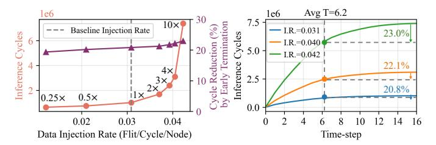
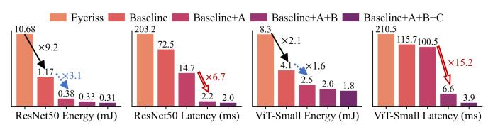
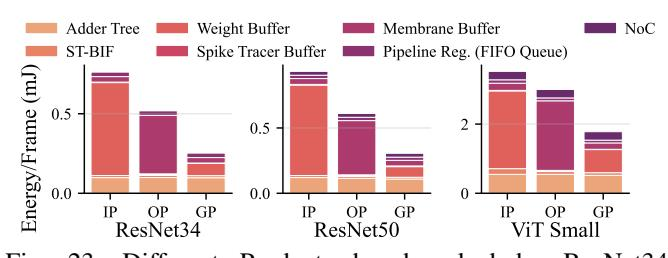
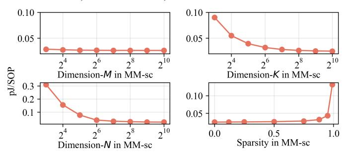
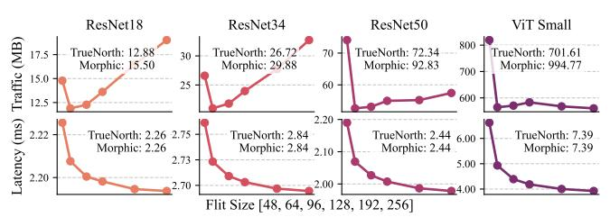
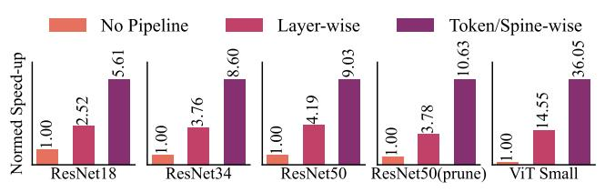
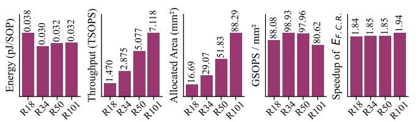

# K. Ablation Study

This section explores the factors contributing to ELSA's high throughput and energy efficiency, including Gustavson-

Fig. 21: Total inference cycles together with the cycle reduction achieved by early termination (left) and average inference cycles per time-step (right) under different injection rates. SNN is ResNet50, and the confidence threshold is 0.55. "1×" in the left figure denotes #flits normalized to the baseline.

Fig. 22: Breakdown of techniques. A: Gustavson-product, B: spine/token-wise pipeline, and C: BAER. Baseline denotes ELSA without any optimizations and pipeline scheduling.

product, bundled AER, spine/token-wise pipeline, multi-path routing algorithm, and memory technique.

1) Technique Breakdown: Fig. 22 presents the energy and latency of various technique combinations in ELSA. Our baseline includes near-memory computing, addition-only computation, and large on-chip SRAM, but no architectural optimizations (i.e., inner-product, normal AER, and no pipeline scheduling). With these naive optimizations, our baseline outperforms Eyeriss [21], saving  $9.2\times$  energy on ResNet50 and  $2.1\times$  on ViT-Small (black arrows). Introducing Gustavson-product (optimization-A) cuts energy further by  $3.1\times$  and  $1.6\times$  (blue dotted arrows), and also reduces weight-buffer access cycles, improving latency. Adding the spine/token pipeline (optimization-B) delivers dramatic speedups of  $6.7\times$  on ResNet50 and  $15.2\times$  on ViT-Small (red hollow arrows), which also lowers leakage energy consumed by onchip SRAMs. Finally, bundled AER (optimization-C) yields modest latency gains, as most cycles remain dominated by PE computation rather than NoC traffic.

2) Effectiveness of Gustavson-Product: To highlight the benefits of the Gustavson-product, Fig. 23 breaks down energy for three sparse, event-driven product algorithms: inner-product, outer-product, and Gustavson-product. All three incur similar adder-tree costs. Inner-product suffers from high weight-buffer energy (76.2% on ResNet34) because it reads the full dense weight matrix to generate a membrane potential row. Outer-product minimizes weight-buffer use (1.3%) but repeatedly accesses the high-precision membrane buffer, which dominates energy (70.3%). Gustavson-product combines sparse weight reads with membrane-stationary updates, cutting combined buffer energy to 43.1%. Across ResNet34, ResNet50, and ViT-Small, this yields average savings of 2.7× versus inner-product and 1.9× versus outer-product. As shown

Fig. 23: Different Products benchmarked by ResNet34, ResNet50, ViT-Small on ImageNet. IP, OP, and GP denote Inner-Product, Outer-Product, and Gustavson-Product.

Fig. 24: Energy (pJ/SOP) scaling with different matrix dimensions  $(M \times K \times N)$  and sparsity levels in MM-sc.

in Fig. 24, the energy efficiency of Gustavson-product is sensitive to the K and N dimensions, varying from 0.31 to 0.023 pJ/SOP for K and from 0.09 to 0.025 pJ/SOP for N. This sensitivity arises because dimension K determines the spike batching size; a small K reduces adder utilization and increases the memory access overhead amortized per spike. Meanwhile, a small N under-utilizes the SRAM bandwidth (64-bit by default), thereby degrading energy efficiency. For sparsity, since small sparsity increases hardware utilization, the energy cost (pJ/SOP) decreases.

- 3) Effectiveness of Bundled AER: Bundled AER stores the spine/token ID across spikes only once, cutting NoC traffic. Fig. 25 plots traffic and latency versus flit size, and compares ELSA to TrueNorth [11] and MorphIC [17]. At 64-bit flit size, bundled AER reduces traffic by an average 19.1% versus TrueNorth and 36.7% versus MorphIC. TrueNorth has less traffic than MorphIC, since TrueNorth discards a 3-bit Xdimension hop count when the hop number is 0. Additionally, in Fig. 25, we observe that: 1) Across models, traffic first falls then rises with flit size. Small flits (e.g. 48 bits) split each spine/token into many flits, inflating traffic. Very large flits (e.g. 256 bits) under-utilize payload, also raising traffic. This phenomenon is lessened in models with more spikes per spine/token, such as ResNet50 and ViT-S, as the payload utilization in large flits is improved. 2) Latency steadily decreases as flit size grows, since fewer flits traverse the network. By contrast, TrueNorth and MorphIC send one spike per flit, generating many small flits and incurring higher latency.
- 4) Effectiveness of Spine/Token-wise Pipeline: Fig. 26 compares three pipelining strategies. The spine/token-wise pipeline achieves the lowest latency, yielding speedups of  $2.2\times$ ,  $2.3\times$ ,  $2.8\times$ , and  $2.5\times$  over the no-pipeline baseline on ResNet18, ResNet34, ResNet50, and ViT-Small, respectively. By allow-

Fig. 25: NoC Traffic and Latency Across Various Flit Sizes.

Fig. 26: Normalized speedup of ELSA using three different pipelines across various networks.

ing each layer to start as soon as its spine or token is ready, hardware utilization is improved. Note that the speedup in ViT-S  $(36.1\times)$  is more than ResNet18  $(5.6\times)$ , as ViT-S is deeper than ResNet18, leading to higher hardware utilization.

- 5) Effectiveness of Multi-Path Routing Algorithm: To evaluate our multi-path routing introduced in Sec. VI, Fig. 27 plots the distribution of flits across NoC links. First, multi-path routing lowers required peak bandwidth by reducing the maximum flits per link, from 17.9 GB/s to 11.9 GB/s on ResNet50 and from 11.9 GB/s to 11.6 GB/s on ViT-S, compared to X-Y routing. Second, the distribution of flits with multi-path routing is more concentrated than Valiant's and X-Y routing algorithms, mitigating the communication imbalance.
- 6) Effectiveness of Memory Technique: ELSA to store all SNN parameters on-chip and performs frequent memory accesses during inference, making memory choice critical for area and energy efficiency. Tab. IX compares SRAM and eDRAM implementations. SRAM delivers superior energy efficiency but consumes more area, while eDRAM reduces the area at the expense of higher energy cost. Designers can select the memory technology to make area—power trade-offs.

TABLE IX: The TOPS/W and Allocated Area of ResNet18/34/50 with different Memory Techniques.

|       | Metric                  | ResNet18 | ResNet34 | ResNet50 | ViT Small |
|-------|-------------------------|----------|----------|----------|-----------|
| SRAM  | TOPS/W                  | 29.96    | 27.12    | 25.55    | 5.10      |
| eDRAM | TOPS/W                  | 5.97     | 5.32     | 3.64     | 2.61      |
| SRAM  | Area (mm 2 ) | 16.69    | 29.73    | 51.83    | 79.53     |
| eDRAM | Area (mm 2 ) | 9.78     | 17.12    | 29.34    | 48.70     |

7) Scaling Study: Fig. 28 shows the scaling study of ELSA from ResNet18 to ResNet101. To eliminate the impact of sparsity, we use the number of synaptic operations (#SOP) to calculate the throughput (TSOPS), energy efficiency (pJ/SOP), and area efficiency (GSOPS/mm²). Overall, ELSA scales stably in energy efficiency (range from 0.030 to 0.038 pJ/SOP), area efficiency (range from 80.6 to 98.9 GOPS/mm²), and speedup achieved by early correctness behavior (range from 1.84× to 1.94×). Both throughput and area consumption increase with the model scaling. The reason is that a large model

Fig. 27: Flit distribution across ELSA NoC links. Violin width shows flit count frequency; numbers mark #flits medians, dotted lines indicate #flits quartiles.

Fig. 28: Scaling study of ELSA in ResNet18, ResNet34, ResNet50, and ResNet101, including the energy (pJ/SOP), throughput (TSOPS), allocated area (mm²), area efficiency (GOPS/mm²), and speedup achieved by the expected latency of first-correct-response ( $E_{\rm F.C.R}$ ). SOP is synaptic operation.

consumes more hardware resources, and the spine/token-wise pipeline further improves the throughput.

We also show the energy breakdown during the model size scaling in Tab. X. Overall, the most energy consumption is concentrated on neural core computation (larger than 89.0%). With the model size scaling, the communication consumption increases from 2.99% to 8.05%. The consumptions for supporting spine/token-level pipeline scheduling, including the BAER generator/decoder, PE control, and scheduler, are small (<4%) and remain stable with the model scaling.

