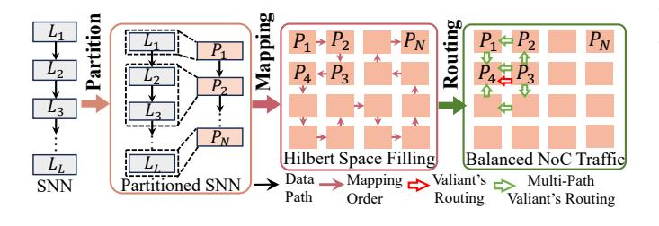

# VI. SNN MAPPING OPTIMIZATION

As shown in Fig. 14, ELSA maps SNN into neural cores through a three-stage mapping algorithm, including partition,

Fig. 14: **Mapping Procedure in ELSA**. ELSA maps SNN through three stages: partition, mapping, and routing.

mapping, and routing. The mapping algorithm has three targets: 1) minimize the NoC traffic, 2) minimize the required peak bandwidth (*aka*. RPB), and 3) maximize PE utilization.

**Partition:** In the partition stage, as shown in Fig. 14(left), layer-wise partition is preferred in ELSA. The reason is that the communication within SNN layers, such as spike broadcast in tiling strategy (Sec. IV-A3) and spike reduction operation between PEs in Local Input Reducer, can be avoided. For mapping a layer across multiple neural cores, we use the MM-sc tiling strategy Fig. 10, which column-wise partitions the synaptic weight and membrane matrices across cores. To minimize the NoC traffic and maximize the PE utilization, we propose a greedy partition algorithm (Algorithm 2). Firstly, we sort connections  $c_{ij}$  (line-3). Then, for each connection  $c_{ij}$ , we compare the allocated memory  $a = a_i + a_j$  and the number of neuron circuits  $d = d_i + d_j$  to the neural core's capacities (A, D) (line 5). If within the capacity (A, D), we combine the two SNN layers into one partition (lines 6-7).

**Mapping:** After partitioning, ELSA applies the Hilbert-curve-based3 mapping algorithm from [26] to assign partitions to neural cores. As illustrated in the center of Fig. 14, the algorithm first generates an initial placement by traversing the Hilbert curve, then models inter-core communication as force potentials and iteratively refines the mapping using a greedy minimization of the total potential.

**Routing:** After mapping, routing is essential for balancing NoC traffic. As shown in Fig. 14(right), X–Y routing selects a single path between adjacent neuron cores (e.g.,  $P_3$  to  $P_4$ , red hollow arrow), leading to congestion and elevated required peak bandwidth (aka. RPB). To mitigate this, we propose a multi-path routing algorithm that explores two alternative paths beyond the shortest one (green arrows), bypassing hotspots and enhancing load balance. A genetic algorithm is then employed to optimize the transmission probabilities across these paths, further mitigating traffic imbalance.

