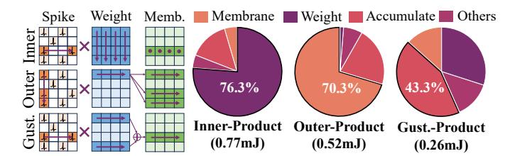

# B. Network-on-Chip with Bundled AER Protocol

**Problem.** Existing SNN accelerators [7], [11]–[14] exploit the address-event representation (AER) protocol to encode 1-bit spikes as multi-bit packets (e.g., 32 bits in [11]), including the spike's spatial position and time-step information. Unlike QANN accelerators [21] that transmit 8-bit activations, SNN hardware transmits spikes individually over multiple time-steps. Consequently, even with high spike sparsity (over 80% in ViTs), TrueNorth [11] can generate up to  $8\times$  more traffic than QANN baselines (Fig. 6). This overhead arises from large packet headers and repeated transmissions across time-steps, resulting in substantial communication overhead.

**Solution.** We introduce a *bundled AER* (BAER) protocol that substantially reduces SNN communication overhead while preserving event-driven behavior. Instead of transmitting each spike separately, BAER aggregates all spikes produced in the same row of neurons into a single packet, amortizing the

Fig. 7: Energy breakdown when applying different execution patterns to ELSA. The workload is ResNet-18.

header across the group and removing the per-spike header overhead of conventional AER [11]. This row-wise bundling reduces both packet count and metadata redundancy, yielding a more communication-efficient substrate that aligns naturally with the fine-grained spine/token-wise pipeline of ELSA.

