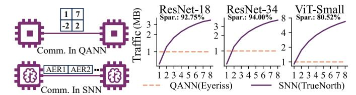

# A. Fine-Grained Spine/Token-wise Pipeline

**Problem.** Elastic inference is an *inherent temporal property* of SNNs that enables correct responses to salient inputs at earlier time-steps. Unfortunately, existing SNN accelerators [7]–[14] fail to effectively exploit this property as their execution patterns fundamentally limit temporal elasticity. Specifically, they follow either a layer-by-layer (LBL) or time-step-by-time-step (TBT) execution pattern, distinguished by how computation traverses the three intrinsic dimensions of SNN inference: time-steps (T), layers (L), and spines/tokens (N) within each layer. The definitions of spines and tokens are shown in Fig. 4.

Fig. 6: Left: Communication comparison of QANN and SNN accelerators. Right: TrueNorth traffic relative to Eyeriss [21], using sparsity statistics from SpikeZIP-TF [4].

LBL-based accelerators [8]–[10] must complete all T timesteps for all N spines/tokens within a layer (i.e.,  $T \times N$  computations) before proceeding to the next layer. As a result, outputs are produced only after the entire network has finished execution, eliminating any opportunity for early responses. TBT-based SNN accelerators [11]–[14], [17], evaluate all L layers at each time-step, enabling progressively generated outputs. Although these SNN accelerators support elastic inference, their coarse-grained and layer-wise pipeline necessitates the completion of all N spines/tokens before advancing, as shown in Fig. 5(a). This design prevents completed spines/tokens from being forwarded immediately, increasing the early response time of elastic inference. Overall, existing SNN accelerators fail to effectively exploit elastic inference.

**Solution.** We propose a dataflow architecture with a fine-grained spine/token-wise pipeline that eliminates the coarse synchronization barriers inherent in prior TBT-based accelerators. Rather than waiting for all N spines/tokens of a layer to finish, the architecture forwards each completed spine/token to the next layer immediately, regardless of the progress of the others. As illustrated in Fig. 5, this design replaces the conventional coarse-grained layer-wise pipeline (top) with a fine-grained spine/token-wise pipeline (bottom). The resulting execution forms a continuous streaming pipeline, reducing the latency to the first response from  $O(L \times N)$  to O(L). For deep SNNs such as Spikeformer [3] with L = 74 and N = 197, our design can translate into substantial system-level speedup.

