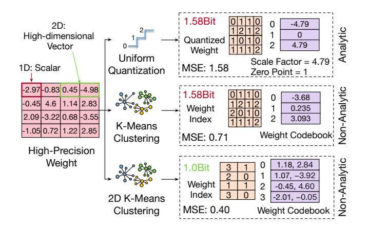
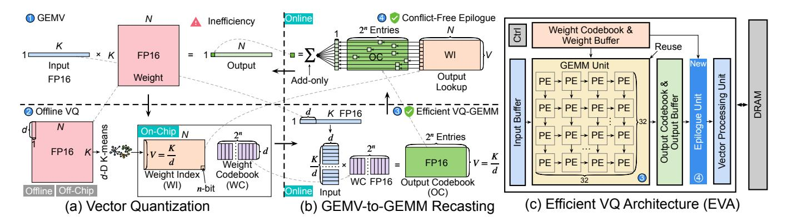

# I. INTRODUCTION

Large Language Models (LLMs) [\[2\]](#page-13-0), [\[14\]](#page-13-1), [\[38\]](#page-14-0), [\[50\]](#page-14-1), [\[56\]](#page-14-2) have achieved remarkable success across a wide range of domains, from natural language understanding [\[13\]](#page-13-2), [\[46\]](#page-14-3) to code generation [\[17\]](#page-13-3), [\[55\]](#page-14-4), [\[63\]](#page-14-5). However, the inference efficiency of LLMs remains a critical challenge, particularly in the *decoding phase* of the autoregressive (AR) mechanism [\[60\]](#page-14-6). During inference, computation is divided into two distinct phases: *prefill* and *decoding*. The prefill phase processes the entire input sequence and can be efficiently executed as largescale General Matrix Multiplication (GEMM) operations. In contrast, the decoding phase generates one token at a time, resulting in a sequence of small-scale General Matrix–Vector Multiplication-like (GEMV-like) operations. As illustrated in Fig. [1](#page-1-0) (a), this fundamental difference in computational granularity makes the decoding phase significantly less efficient.

Quantization has become an essential technique for efficient LLM inference [\[19\]](#page-13-4), [\[21\]](#page-13-5), [\[23\]](#page-13-6), [\[26\]](#page-13-7), [\[37\]](#page-13-8), [\[39\]](#page-14-7), [\[45\]](#page-14-8). Conventional quantization methods [\[24\]](#page-13-9), [\[26\]](#page-13-7), [\[31\]](#page-13-10) typically apply low-precision formats to both weights and activations, enabling reduced-precision computation and lower memory access cost. Recent frameworks primarily focus on *weightonly quantization* [\[16\]](#page-13-11), [\[33\]](#page-13-12), [\[61\]](#page-14-9), [\[62\]](#page-14-10), such as AWQ [\[37\]](#page-13-8) and SqueezeLLM [\[32\]](#page-13-13). These methods compress model weights into low-bit representations (e.g., 4-bit) while retaining highprecision computation (e.g., FP16) for activations. Weight-only quantization directly targets the *decoding* bottleneck of LLMs, where activations are lightweight but weight tensors dominate memory traffic. Although activations remain in high precision to preserve model accuracy, weight-only quantization achieves nearly linear speedup in the decoding stage as the weight precision decreases [\[37\]](#page-13-8). This improvement arises because LLM decoding is inherently memory-bound, and quantization effectively mitigates the bandwidth bottleneck caused by frequent weight loading.

Pushing this trend further leads to *codebook-based compression* [\[6\]](#page-13-14), [\[15\]](#page-13-15), [\[22\]](#page-13-16), where weight tensors are represented using lookup tables (LUTs) instead of arithmetic quantization functions. Unlike integer or floating-point quantization, lookup-based quantization provides higher flexibility and better fidelity by enabling non-uniform representations. Recently, *Vector Quantization* (VQ) [\[15\]](#page-13-15), [\[18\]](#page-13-17), [\[25\]](#page-13-18), [\[40\]](#page-14-11), [\[58\]](#page-14-12) has emerged as a pivotal technique that extends codebooks from single-element (scalar) to multi-element (vector) representations, allowing each codebook entry to encode multiple weight elements (e.g., 4 or 8). Compared with arithmetic quantization methods such as AWQ [\[37\]](#page-13-8), which are typically limited to 4 bit precision, VQ pushes this limit further to 2-bit quantization while maintaining high accuracy, demonstrating superior algorithmic efficiency. As illustrated in Fig. [1](#page-1-0) (b), an example with a vector size of d = 4 partitions the weight matrix into 4 element vectors, which are then mapped to a compact weight index (WI) matrix and a weight codebook (WC). This multidimensional compression enhances quantization expressiveness and achieves state-of-the-art accuracy-compression tradeoffs while significantly reducing model size.

Despite its effectiveness in model compression, conventional VQ offers no speedup on current hardware accelera-

Fig. 1. Motivation of this work. (a) Conventional GEMV suffers from poor utilization of compute units during LLM decoding. (b) Vector quantization introduces irregular and conflicting memory accesses during online lookup. (c) EVA eliminates lookup conflicts and reformulates LLM decoding into GEMM-style computation, enabling efficient execution on modern accelerators.

tors (e.g., GPUs); in fact, it can even be slower than FP16 inference [41]. This limitation arises from two fundamental challenges:

- (1) Compute inefficiency (Fig. 1 (a)). While VQ effectively reduces memory bandwidth requirements, it does not alter the computational structure of the decoding phase, which remains a sequence of small-scale GEMV operations. Such matrix–vector computation is inherently inefficient on modern accelerators optimized for large GEMM workloads, leading to low parallelism and poor utilization. This inefficiency is not unique to VQ but is a general limitation of weight-only quantization in LLM decoding [1], [49].
- (2) Memory inefficiency (Fig. 1 (b)). Even after compressed weights are loaded into on-chip memory, the ensuing dequantization via codebook lookup often suffers from severe memory access conflicts. These conflicts stem from the irregular and uncoalesced indexing patterns inherent to LUT-based quantization, which lead to serialization, limited memory throughput, and reduced cache efficiency. For example, as shown on the right side of Fig. 1 (b), indices 5 and 3 attempt to access the same memory bank simultaneously, resulting in a memory conflict and serialized access. This bottleneck fundamentally limits their attainable speedup, regardless of their impressive compression ratios.

To overcome these challenges, we propose EVA, an Efficient  $\underline{VQ}$ -based  $\underline{A}$ rchitecture that addresses both computational and memory inefficiencies in the LLM decoding phase. EVA is built on a simple yet effective aha insight, consisting of two main steps that jointly restructure computation and remove memory conflicts.

Step 1: From weight decoding to codebook dot product. Since each vector in the VQ-quantized weight matrix originates from the codebook, explicit reconstruction is unnecessary. As shown on the left side of Fig. 1 (c), instead of decoding the weight indices (WIs) on-chip to reconstruct the full weight matrix, we directly compute dot products between the input vectors and the weight codebook (WC), generating intermediate results that collectively form an *output codebook* (OC). To support this operation, the input is partitioned into multiple vectors (e.g.,  $v_0$  and  $v_1$ ), each multiplied by the WC to produce corresponding intermediate results that together constitute the OC.

Step 2: Conflict-free lookup from the output codebook. As shown on the right side of Fig. 1 (c), the final outputs are obtained by performing lookup operations on the OC using the WI matrix. Unlike conventional VQ, where lookups in the WC frequently cause memory bank conflicts, this formulation eliminates such conflicts entirely. During OC computation, matrix multiplication implicitly distributes OC elements across different banks, as each bank stores results derived from distinct input vectors. For example, when indices such as 5 and 3 in the rightmost column of the WI matrix are accessed simultaneously, they map to different banks (corresponding to  $v_0$  and  $v_1$ ), enabling fully parallel and conflict-free access.

Advantages. This approach improves both computational and memory efficiency. (1) Computation. The LLM decoding process is effectively reformulated from GEMV to GEMM, increasing arithmetic intensity and parallelism. Since the codebook is small (e.g., 256 entries) while N is large (e.g., 4096), the overall computation cost is significantly reduced. (2) Memory. Compared with conventional VQ, accessing the same number of weight indices does not require additional memory banks. At the same time, the bandwidth requirement is reduced from reading d=4 weight elements per access to reading a single OC element, and memory conflicts are completely eliminated. These optimizations make EVA efficient in both computation and memory utilization.

In summary, EVA transforms the inefficient VQ decoding process into a conflict-free GEMM-style computation. We further design a dedicated hardware architecture that implements this reformulation to achieve high utilization and scalability based on a simple yet effective insight.

Specifically, EVA makes the following contributions:

- We propose a codebook-driven GEMM formulation that replaces conventional weight decoding with direct dot products between input vectors and the weight codebook. This formulation transforms memory-bound GEMV operations into compute-efficient GEMM computations, significantly improving utilization.
- We develop an output-codebook lookup mechanism
  that reorganizes memory access into a conflict-free structure. By distributing output codebook entries across memory banks, EVA eliminates lookup conflicts and reduces
  bandwidth demand.
- We design and implement a hardware-software cooptimized architecture tailored for efficient LLM decoding while maintaining compatibility with conventional accelerator execution in the prefill stage.

Extensive experiments demonstrate that EVA achieves up to  $11.17 \times$  speedup and  $7.17 \times$  improvement in energy efficiency over the state-of-the-art lookup-based baseline, FIGLUT, while preserving arithmetic precision after vector quantization.

#### II. BACKGROUND AND MOTIVATION

## A. LLM Decoding: Computational Inefficiency

The core operation in transformer-based Large Language Models (LLMs) [28], [56] is matrix multiplication, expressed as  $\mathbf{Y} = \mathbf{X}\mathbf{W}$ . Here,  $\mathbf{X} \in \mathbb{R}^{M \times K}$  denotes the input matrix, and  $\mathbf{W} \in \mathbb{R}^{K \times N}$  represents the projection or feed-forward weight matrix. Autoregressive LLMs [60] are typically executed in two distinct phases: *prefill* and *decoding*. During the prefill phase, the model processes multiple tokens from several sequences simultaneously [72]. As a result, all three dimensions (M, K, and N) of the matrix multiplication are large, enabling General Matrix Multiplication (GEMM). This configuration allows GPUs and other accelerators to exploit extensive data reuse, thereby achieving high computational efficiency [7], [30], [49].

In contrast, during the *decoding* phase, the model generates tokens sequentially, one at a time. Consequently, the total number of rows is reduced to M=1, turning the matrix multiplication  $\mathbf{X}\mathbf{W}$  from a large-scale GEMM operation into a small-scale General Matrix–Vector Multiplication (GEMV) operation. As shown in Fig. 1 (a), performing GEMV on accelerators optimized for GEMM is highly inefficient for two primary reasons. First, when M is small, only a narrow portion of the GEMM unit is active, while most processing element (PE) lanes remain idle.

Second, GEMV inherently suffers from low arithmetic intensity because one dimension of the matrix cannot be reused across computations. During decoding, activations are small, but the weight matrix dominates the memory footprint and must be repeatedly fetched for each generated token without reuse. As a result, GEMV operations become memory-bound, with the majority of runtime dominated by weight loading rather than computation. This inefficiency has motivated extensive research on compressing the weight matrices during the decoding process to reduce memory bandwidth demand and improve overall inference efficiency [37], [39].

GEMVs occur only in the decode phase with a batch size of 1. In this article, we will refer to both strict GEMVs and GEMV-like GEMMs from small batches, as they both cause array underutilization.

## B. Quantization

Quantization methods for LLMs can be broadly categorized into two classes: *analytic quantization* and *non-analytic quantization*. As illustrated in Fig. 2, the key distinction lies in whether the quantization function can be explicitly represented by arithmetic operations (e.g., rounding, scaling).

**Analytic quantization.** As shown in Fig. 2 (a), analytic quantization refers to schemes with explicit mathematical formulations that map high-precision values (e.g., FP32, FP16) to low-bit values (e.g., INT4/8, FP4/8) through simple operations

Fig. 2. Comparison of quantization schemes: (a) uniform quantization (analytic); (b) K-means (1D vector) quantization (non-analytic); (c) 2D vector quantization (non-analytic).

such as linear scaling and rounding. Both activations and weights can be quantized in this way, and such approaches are widely adopted for compute-bound workloads where reduced-precision arithmetic directly lowers FLOPs [31], [70].

However, the decoding phase of LLM inference is inherently *memory-bound*, rather than compute-bound. Therefore, modern systems typically employ **weight-only quantization** [16], [37], where weights are stored in low-bit representations (e.g., 4-bit), while activations remain in high precision (e.g., FP16). This strategy effectively reduces memory bandwidth requirements and achieves near-linear speedups proportional to the reduction in data transfer volume.

Nonetheless, the computation itself still operates in high precision. Thus, this approach functions primarily as a *compression technique* rather than a low-precision computation method. Because of its simple and analytic nature, decoding from such quantized weights is efficient: element-wise dequantization can be performed *in-place* without additional dependencies. Consequently, weight-only analytic quantization has been widely adopted in decoding-optimized frameworks such as AWQ [37] and GPTQ [16].

Despite its practicality, analytic quantization offers limited representational flexibility. Its quantization error remains relatively high under aggressive compression. More importantly, it cannot alter the underlying GEMV computation paradigm: the decoding process remains a sequence of small, memory-bound matrix—vector multiplications.

Non-analytic quantization. In contrast, non-analytic quantization removes the requirement for closed-form quantization functions. Instead, it directly learns quantization mappings by minimizing a reconstruction loss, typically the mean squared error (MSE), commonly through K-means clustering [6], [15], [22] (Fig. 2 (b)). This approach achieves substantially lower quantization errors than analytic methods and maintains high fidelity even at 2-bit precision. Representative schemes in this category include lookup-table (LUT)-based quantization methods [21], [22], [34] that replace arithmetic dequantization with direct table lookups.

However, this flexibility comes at a cost. Since the mapping

TABLE I
COMPARISON OF REPRESENTATIVE LUT-BASED ACCELERATOR DESIGNS.

| Architecture                             | Codebook Size                                                 | Strategy                                  | Replication / Bandwidth Cost                                                                                                                                        |
|------------------------------------------|---------------------------------------------------------------|-------------------------------------------|---------------------------------------------------------------------------------------------------------------------------------------------------------------------|
| GOBO [73] LUT TC [44] LUT-DLA [34] | 8 × 16 bits (FP16) 8 × 8 bits (INT8) 16× 16 bits (BF16) | Duplication Duplication Duplication | $768 \times (8 \times 16 \text{ bits})$ Registers $2 \times 64 \times (8 \times 8 \text{ bits})$ Registers $256 \times (16 \times 16 \text{ bits})$ Registers |
| FIGLUT [48]                              | 8 × 16 bits (FP16)                                            | Broadcast                                 | $16 \times 32 \times (8 \times 16 \text{ bits})$ Bandwidth                                                                                                          |

between original weights and quantized representations is no longer expressible in arithmetic form, decoding requires a *1-to-1 lookup* from codebooks. Such irregular and uncoalesced memory access patterns lead to frequent memory bank conflicts, making the decoding process both expensive and difficult to parallelize, as illustrated in Fig. 1 (b). This limitation has prevented non-analytic quantization from being widely adopted in large-scale inference systems.

**Vector Quantization (VQ).** Vector Quantization (VQ) extends non-analytic quantization from scalar (1D) K-means to higher-dimensional clustering (multi-D K-means). By encoding multiple elements jointly (e.g., 4D or 8D vectors), VQ captures local structural correlations in weights and substantially reduces quantization loss. As shown in Fig. 2 (c), VQ achieves lower reconstruction error than analytic quantization even with an average of only 1 bit per element, reaching state-of-the-art (SOTA) accuracy-compression trade-offs.

Nevertheless, VQ introduces substantial challenges during decoding. Because each vector code corresponds to multiple weight elements, the effective codebook size increases, which in turn raises memory bandwidth demands and exacerbates access irregularity. This "1-to-many" lookup mechanism makes VQ particularly sensitive to memory access conflicts, posing a fundamental barrier to its efficient deployment on current accelerators.

## C. Codebook-based Lookup: Memory Inefficiency

Supporting efficient codebook-based non-analytic quantization has long been a major research objective in both architecture and system communities.

**Architectural perspective.** From a hardware perspective, prior studies mainly focus on optimizing the lookup table (LUT) design to reduce memory conflicts. Representative works include GOBO [73], FIGLUT [48], LUT Tensor Core [44], and LUT-DLA [34]. As summarized in Tbl. I, these approaches typically rely on either duplicating or broadcasting the codebook across processing elements (PEs) to mitigate bank conflicts. However, both strategies incur substantial hardware and bandwidth overhead. For instance, FIGLUT broadcasts  $8 \times 16$ -bit data to a full PE column of 32 lanes, resulting in a total bandwidth requirement of  $16 \times 32 \times (8 \times 16 \, \text{bits})$ , while LUT-DLA requires  $256 \times (16 \times 16 \, \text{bits})$  registers to store replicated codebook entries. Such design costs significantly constrain scalability and limit the effective codebook size to at most 16 entries.

**Software and system perspective.** From the algorithmic and system side, prior VQ frameworks primarily focus on improving accuracy while adopting naive software implementations. AQLM [15] and QuiP [58] are implemented in PyTorch

TABLE II SUMMARY OF NOTATIONS.

| Symbol                     | Description                                     | Value                       |
|----------------------------|-------------------------------------------------|-----------------------------|
| M                          | Input (output) height, i.e., number of tokens   | 1                           |
| N                          | Weight (output) width, i.e., output channel     | 4096+                       |
| K                          | Input width or weight height for reduction      | 4096+                       |
| d                          | Vector dimension used in VQ                     | 8                           |
| n                          | Bit-width of each vector index                  | 8                           |
| $2^n$                      | Number of entries per codebook                  | 256                         |
| $V = \frac{K}{d}$          | Height of compressed weight index matrix        | 512+                        |
| v                          | Tile height for grouped computation             | 32                          |
| C                          | Number of codebooks per layer                   | 2–4                         |
| $q = \frac{C \times n}{d}$ | Effective quantization bit-width (average)      | 2–4                         |
| I                          | Weight index (WI) matrix                        | $\mathbb{R}^{d\times 2^n}$  |
| В                          | Weight codebook (WC) containing $2^n$ centroids | $\mathbb{R}^{d \times 2^n}$ |
| О                          | Output codebook (OC)                            | $\mathbb{R}^{V \times 2^n}$ |

and mainly serve as model compression techniques, often slower than FP16 inference. VQ-LLM [41] is the first GPU-based framework to address codebook conflicts; however, due to GPU hardware constraints, it only mitigates conflicts by profiling codebook access frequencies to classify *hot* and *cold* entries. This heuristic approach alleviates but does not eliminate memory contention, leaving the fundamental inefficiency of VO unresolved.

As a result, despite its superior compression and accuracy, vector quantization remains limited by its poor hardware efficiency and irregular access patterns. In this study, we propose *EVA*, which overcomes both computational inefficiency and memory conflicts through a unified, architecture-aware VQ design.

#### III. OVERVIEW OF EVA

This section presents the computation flow and architectural overview of *EVA*, as illustrated in Fig. 3. We first define the key variables and symbols used throughout this study, summarized in Tbl. II.

#### A. Vector Quantization

**GEMV.** As illustrated in Fig. 3 (a) 1, the LLM decoding phase performs a sequence of matrix-vector multiplications (GEMV). For each generated token, the computation is expressed as

$$y = xW$$

where  $\mathbf{x} \in \mathbb{R}^{1 \times K}$  is the token activation vector and  $\mathbf{W} \in \mathbb{R}^{K \times N}$  represents the model weights. During autoregressive generation,  $\mathbf{x}$  updates token by token, requiring multiple small GEMV operations executed sequentially. Each operation reads the full weight matrix from off-chip memory but performs limited arithmetic, making the process inherently *memory-bound*. This low arithmetic intensity causes severe underutilization of compute resources on modern accelerators. To alleviate this bottleneck, quantization is commonly applied to reduce the storage and bandwidth requirements of  $\mathbf{W}$ .

**Vector Quantization.** As shown in Fig. 3 (a) ②, Vector Quantization (VQ) compresses the weight matrix  $\mathbf{W}$  by grouping d consecutive weights along the K dimension into d-dimensional vectors. Each group of d weights forms a small

Fig. 3. Overview of the EVA computation flow and architecture.

vector that is replaced by an index referencing a shared weight codebook (WC)  ${\bf B}$ . The codebook contains  $2^n$  representative d-dimensional centroids (where n is the index bit-width), each learned from the distribution of weights using k-means clustering [15], [22]. All  $K \times N$  weight elements are therefore represented as  $V \times N$  indices, where V = K/d. The weight index (WI) matrix  ${\bf I}$  stores these compact indices, while the codebook  ${\bf B}$  stores the learned centroids.

During inference, the quantized model no longer loads the original full-precision weights. Instead, each weight vector is reconstructed on demand by fetching its corresponding centroid from the codebook. This process replaces bandwidth-intensive FP16 weight loading with lightweight index-based lookups, significantly reducing the storage and memory access cost of LLM layers.

In this study, we adopt d=8 for the vector dimension and n=8 for the index bit-width, resulting in a codebook of  $2^n=256$  centroids. This corresponds to an average quantization rate of approximately  $\frac{n}{d}=1$  bit per element for one codebook, which, however, is too low to preserve model accuracy. To achieve higher precision while maintaining compression efficiency, we adopt the additive vector quantization strategy AQLM [15] and use multiple codebooks for hierarchical refinement. Specifically, we employ C codebooks to obtain an effective average quantization precision of  $q=\frac{C\times n}{d}$  bits. EVA supports C=2, 3, and 4 codebooks, corresponding to 2-bit, 3-bit, and 4-bit quantization for LLM decoding.

Computation and Memory Inefficiencies. After dequantization, conventional VQ-based methods continue with the GEMV operation as shown in step  $\bigcirc$  [15], [58]. This offline VQ process significantly reduces memory footprint and data movement. However, it does not change the fundamental LLM decoding computation pattern, since each token still performs a GEMV using the reconstructed weights. Furthermore, the lookup-based reconstruction introduces irregular memory access patterns that cause frequent bank conflicts and degrade parallel efficiency. Compared with 1D k-means quantization, VQ demands higher bandwidth and larger codebooks. These characteristics increase the memory access complexity of VQ, but they also reveal an inherent structural regularity that can be exploited for more efficient computation.

#### B. Recasting GEMV to GEMM

While conventional VQ increases codebook dimensionality and lookup complexity, its multi-dimensional centroids also expose an opportunity for computation reorganization. By exploiting this property, we reformulate the LLM decoding computation so that the original GEMV can be recast as a GEMM operation, thereby improving compute efficiency. The detailed process is described below.

**Dot product between input and centroids.** As illustrated in Fig. 3 (b) 3, we first reshape the input token vector  $\mathbf{x} \in \mathbb{R}^{1 \times K}$  into a two-dimensional matrix  $\mathbf{X} \in \mathbb{R}^{(K/d) \times d}$  by grouping every d consecutive elements into a vector. According to matrix multiplication rules, each d-dimensional row vector of  $\mathbf{X}$  performs a dot product with the corresponding d elements from each column of the weight matrix  $\mathbf{W} \in \mathbb{R}^{K \times N}$ . After applying VQ, these d elements are replaced by the centroids referenced by the weight index (WI) matrix  $\mathbf{I} \in [0, 2^n)^{(K/d) \times N}$ . Therefore, each input vector interacts with the corresponding centroids across all output channels. This means that, regardless of the output dimension N, the number of possible weight values for each input vector is bounded by the codebook size  $2^n$ .

**VQ GEMM.** This observation enables a key simplification. We can directly multiply the reshaped input matrix  $\mathbf{X}$  with the codebook  $\mathbf{B} \in \mathbb{R}^{d \times 2^n}$  to obtain an intermediate result called the output codebook (OC). Each element in the output codebook  $\mathbf{O} \in \mathbb{R}^{(K/d) \times 2^n}$  represents the dot product between one input vector and one centroid, which can be reused across multiple output channels. This operation effectively converts the token-level GEMV into a compact GEMM between  $\mathbf{X}$  and  $\mathbf{B}$ :

$$O = XB$$

where **O** is the output codebook. This formulation bridges vector quantization and matrix multiplication, paving the way for efficient GEMM-based LLM decoding on modern accelerators.

**Advantages.** This reformulation provides several key benefits for efficient LLM decoding:

 Regularized memory access. Converting LLM decoding into GEMM avoids direct lookups on the weight codebook, which are irregular. The number of lookups is

- reduced, and all memory accesses become regular and coalesced.
- 2) Lower bandwidth demand. The dot-product operation aggregates every d weights into one value, reducing the lookup bandwidth requirement by a factor of d.
- 3) Reduced computation. For LLMs, the output dimension N often exceeds 4096, while the codebook size is only  $2^n=256$ . Conventional GEMV requires  $1\times N\times K$  multiply-accumulate operations, whereas VQ-GEMM needs only  $\frac{K}{d}\times 2^n\times d=K\times 2^n$  operations, achieving approximately  $\frac{N}{2^n}=16\times$  fewer computations.
- 4) Higher accelerator utilization. Recasting LLM decoding into GEMM greatly improves hardware utilization. The matrix dimension in the M direction is no longer fixed at 1, but expanded to  $V = \frac{K}{d}$ , which is typically greater than 512, enabling efficient use of the accelerator's matrix-multiplication units.

Together, these advantages allow *EVA* to achieve high throughput with regular memory access, lower bandwidth demand, and significantly improved compute efficiency.

#### C. Epilogue for Lookup and Reduction

After the VQ-GEMM operation, we obtain the intermediate result matrix **O**, as shown in Fig. 3 (b) **4**. In the epilogue stage, two operations are required to reconstruct the final output of LLM decoding.

1) Lookup using the index matrix. Each output element is selected from O according to its corresponding index in the weight index matrix I:

$$\hat{\mathbf{y}} = \text{Lookup}(\mathbf{O}, \mathbf{I}),$$

where  $\hat{\mathbf{y}}$  denotes the intermediate partial sum. This lookup is conflict-free because both  $\mathbf{I}$  and  $\mathbf{O}$  share the same height V = K/d. Each row of  $\mathbf{O}$  is mapped to a dedicated memory bank, enabling parallel access along the V dimension without conflicts. Compared with conventional VQ methods, accessing the same number of WI entries does not require additional memory banks. However, the bandwidth of each bank is reduced by a factor of d, since each access fetches only one FP16 element instead of an 8d centroid with 8 FP16s.

2) Reduction by accumulation. After lookup, the selected elements are accumulated to form the final output vector. This add-only reduction requires no multipliers and incurs minimal hardware cost, allowing the epilogue to run efficiently in parallel with the GEMM pipeline.

**Advantages.** The epilogue is lightweight and hardware-friendly, featuring: (i) add-only operations, (ii) conflict-free parallel access, (iii) reduced bandwidth by a factor of d, and (iv) a simple, efficient pipeline design.

Overall, this stage completes the LLM decoding process with minimal overhead and provides a clean interface between VQ-GEMM computation and final output reconstruction.

## D. Efficient VQ Architecture

Finally, Fig. 3 (c) presents the overall EVA architecture. Thanks to the structured scheduling of the VQ-GEMM op-

Fig. 4. Tiling strategy of the VQ-GEMM operation in EVA. Input and WI tensors are streamed as tiles from off-chip memory, while the WC and output remain stationary on-chip for reuse.

eration, the architecture design remains simple, scalable, and highly generalizable across different accelerators.

First, EVA adopts a systolic-array-based computation core, which has been widely used in modern AI accelerators [19], [21], [27]. The proposed VQ-GEMM operation can be directly mapped onto the existing systolic array with minimal modification. While VQ requires FP16 arithmetic for accuracy, the LLM prefill stage can maintain accuracy using only INT8 precision [31], [67]. To support both regimes efficiently, we introduce a reconfigurable PE design that performs one FP16 operation or four INT8 operations per cycle, enabling seamless and high-throughput reuse across FP16 VQ decoding and INT8 prefill computation.

Second, a dedicated epilogue unit is introduced to support VQ-specific post-processing, including the lookup and accumulation operations described earlier. This unit is optimized for conflict-free access and add-only reduction, ensuring low latency and efficient integration with the systolic array pipeline.

These architectural components and their co-optimization strategies will be discussed in detail in the following sections.

## IV. VECTOR QUANTIZATION-BASED GEMM

This section introduces the VQ-based GEMM design in *EVA*, including the tiling strategy, the mixed-precision GEMM unit, and its architectural integration with the epilogue stage.

#### A. Tiling Strategy

Tiling is an essential optimization for GEMM execution because the on-chip memory resources of accelerators are limited. As shown in Fig. 4, the tensors involved in the VQ-GEMM computation, including the input, weight index (WI), weight codebook (WC), and output, are pre-arranged in off-chip DRAM before execution. Among these tensors, only the input and WI matrices are tiled for streaming access, while the WC and output remain stationary on-chip to maximize reuse.

For the input, the matrix is reshaped and divided into tiles of size  $v \times d$ , where v is set to 32 in our design. Each input tile is loaded into the on-chip buffer for one round of computation. Similarly, the WI tensor is accessed by v rows per iteration, corresponding to  $v \times N$  elements. Since  $v \times N$  can be large for

Fig. 5. Reconfigurable GEMM unit in *EVA*. The mixed-precision PE array supports both INT8 prefill and FP16 VQ-GEMM for LLM decoding through precision reconfiguration.

modern LLM layers, WI is streamed into the chip to balance throughput and buffer utilization.

In contrast, both the weight codebook (WC) and the output are shared within a layer and remain stationary in on-chip SRAM. The WC is read-only throughout the layer, while the output tile is progressively updated after each VQ-GEMM iteration and finally written back to DRAM after all partial sums are accumulated.

The on-chip buffers are organized into two regions: (1) one for the input and WC tensors participating in GEMM computation, and (2) another for the WI and output tensors, which are consumed and updated during the epilogue stage (Sec. V).

#### B. Mixed-precision Processing Element

Although *EVA* is primarily designed for LLM decoding, it must also maintain compatibility with other workloads such as prefill and attention computations. For prefill and attention computations, FP16 precision is often unnecessary, and low-precision INT8 arithmetic is sufficient [31], [67]. Therefore, the base GEMM unit in *EVA* adopts an INT8-based processing element (PE) design, which is widely used in modern accelerators. However, LLM decoding relies on weight-only quantization and FP16 computation to maintain accuracy. Supporting both modes independently would require a separate FP16 multiplier array, resulting in substantial hardware overhead.

To address this challenge, EVA reuses the existing INT8 multiply-accumulate (MAC) array to support FP16 operations through lightweight reconfiguration, as illustrated in Fig. 5. An FP16 number consists of a 1-bit sign, a 5-bit exponent, and a 10-bit mantissa. By decomposing each FP16 multiplication into four INT8 multiplications, the PE reconstructs FP16 mantissa multiplication without requiring a dedicated FP16 multiplier. A small 6-bit adder and several XOR gates are

Fig. 6. Epilogue unit (EU) for conflict-free lookup in EVA, supporting vertical adder-tree reduction and diagonal accumulation across outputs (C0–C3) with output-level parallelism.

added to handle exponent and sign computation. For FP16 addition, an alignment unit is inserted before accumulation, and the existing INT32 accumulator is reused for the final summation.

This reconfiguration enables FP16 support with minimal hardware modification. A conventional  $32 \times 32$  INT8 array can be dynamically reconfigured into a  $32 \times 8$  array for FP16 computation during LLM decoding. This configuration perfectly matches the tiling parameters (v=32, d=8) used in the VQ-GEMM operation, allowing the GEMM unit to achieve optimal utilization and performance. The result is a unified GEMM unit capable of executing both INT8 and FP16 operations with high area efficiency and utilization, enabling EVA to flexibly support both prefill and LLM decoding workloads.

