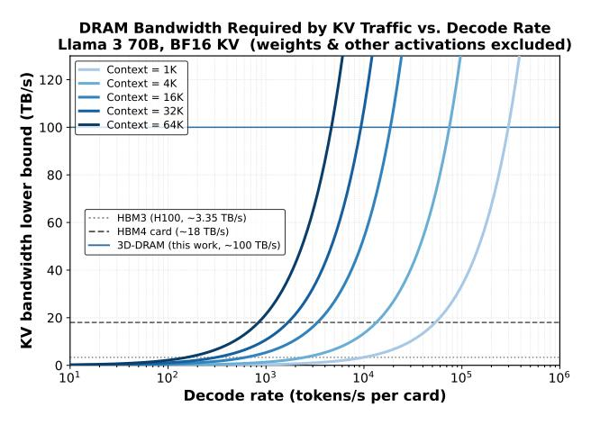

# *B. KV-cache growth makes decode capacity-limited*

During decode, each layer reads the KV cache for all prior tokens and writes the KV for the newly generated token. The KV cache footprint grows linearly with context length and the number of concurrent sessions, quickly consuming tens to hundreds of GB. The KV cache size for, say, the Llama-70B model, increases from 10GB (batch = 1) to 320GB (batch = 32) and imposes a hard cap on sessions per card.

**Fig. 2:** DRAM bandwidth required by KV reads versus decode rate (BF16 KV; excludes weights/other activations). KV traffic alone drives multi-TB/s pressure at long context, motivating memory systems with substantially higher bandwidth density than conventional off-package DRAM.

## C. KV traffic yields multi-TB/s bandwidth pressure

Decode is also bandwidth-limited. A useful sanity check is a lower bound on required DRAM bandwidth from KV reads alone (ignoring weights and other activations). If attention reads S prior tokens and writes one new token per step, the KV bytes moved per output token scale as:

$$D_{\mathrm{KV}} \gtrsim \underbrace{S \cdot (2LH_{\mathrm{KV}}d_{\mathrm{head}}q)}_{\mathrm{read \ KV \ for \ history}} + \underbrace{(2LH_{\mathrm{KV}}d_{\mathrm{head}}q)}_{\mathrm{write \ KV \ for \ new \ token}}, \quad (1)$$

where L is the layer count,  $H_{\rm KV}$  the number of KV heads (GQA/MQA),  $d_{\rm head}$  the head dimension, and q bytes/element. Figure 2 converts this lower bound into bandwidth (TB/s) required to sustain a target decode rate (tokens/s) across context lengths. This demand reaches the multi-TB/s regime at long context and moderate token rates, consistent with industry efforts that directly target KV bandwidth [58], [59].

