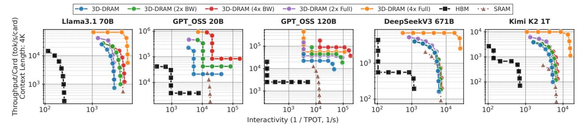
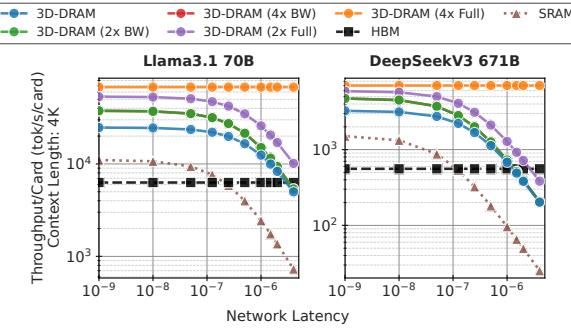
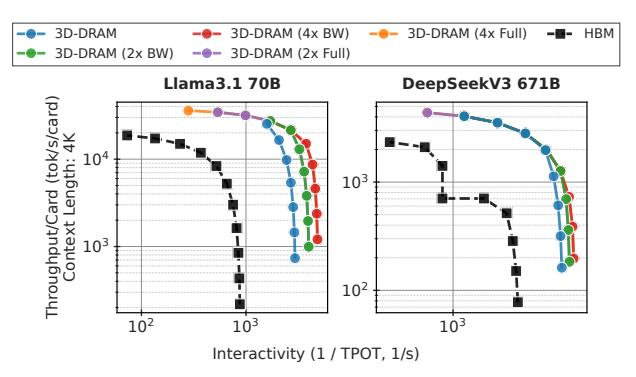
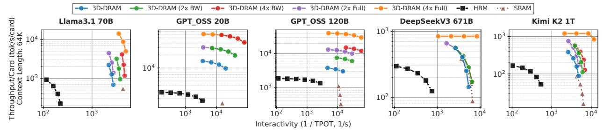
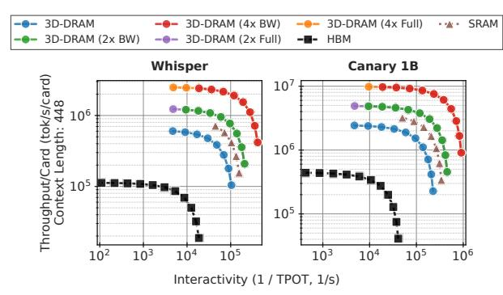

# D. Per-Layer Communication

The deployment mode dictates the schedule of collectives. **Dense (unified) deployment.** Each transformer layer triggers two TP all-reduce operations: one after the attention projection and one after the FFN, each transferring  $\mathcal{O}(h \cdot b)$  bytes, where h is the hidden dimension and b the micro-batch size. At the low TP degrees enabled by 3D-DRAM (e.g., TP = 4 for Llama-70B vs. TP = 8 for SRAM), these all-reduces involve fewer participants and proportionally less data, reducing per-layer communication time.

**MoE** (disaggregated) deployment. Each layer involves up to four distinct collectives: (i) an attention all-to-all among the TP cards to exchange partial attention outputs and log-sum-exp statistics ( $\sim$ 16 KB/card at TP=4); (ii) a post-attention all-reduce to combine projection outputs ( $\propto h \cdot b$ ); (iii) a dispatch many-to-many that routes activated tokens from the attention group to expert cards ( $\sim$ hundreds of KB/card); and (iv) a combine many-to-many that returns expert outputs to the attention group ( $\sim$ MB/card). The dispatch and combine phases scale with the number of active experts and the EP degree.

Reducing the card count through higher per-card capacity directly shrinks both the participant set and the total volume of these collectives, enabling 3D-DRAM to lower communication overhead relative to lower-capacity alternatives.

#### VII. METHODOLOGY

## A. Raptor Hardware and Memory Model

We evaluate the memory subsystem using two parameters: peak bandwidth and usable capacity. All experiments use the same accelerator logic, called XPU. Pairing XPU with our 3D-DRAM yields the full Raptor (RP) product, while XPU+SRAM and XPU+HBM serve as external-memory baselines on the same logic. Since our interest is the memory-bound regime, we focus on the decode phase of inference.

**TABLE III:** Accelerator + memory technology configurations. Tensor compute throughput for the XPU accelerator logic is fixed at 10 PFLOPS; we only vary the attached memory subsystem. Pairing the XPU logic with 3D-DRAM yields the full Raptor (RP) product; SRAM and HBM variants are external-memory baselines on the same logic.

| Accelerato   | r + Memory                 | Mem Bandwidth (TB/s) |     | Tensor Compute Throughput (PFLOPS) |
|--------------|----------------------------|----------------------------|-----|------------------------------------------|
| Memory ted   | chnology variants          |                            |     |                                          |
| VDII.        | SRAM                       | 150                        | 4   | 10                                       |
| XPU +        | HBM                        | 18                         | 192 | 10                                       |
| RP +         | 3D-DRAM                    | 100                        | 32  | 10                                       |
| Ablation sti | udy variants               |                            |     |                                          |
|              | $3D$ -DRAM $(2 \times BW)$ | 200                        | 32  | 10                                       |
| RP +         | $3D$ -DRAM $(4 \times BW)$ | 400                        | 32  | 10                                       |
|              | 3D-DRAM (2× Full)          | 200                        | 64  | 10                                       |
|              | 3D-DRAM (4× Full)          | 400                        | 128 | 10                                       |

Each XPU card is paired with one of three memory technologies: on-die **SRAM** (very high bandwidth, minimal capacity), **HBM** DRAM (high capacity, limited bandwidth), or **3D-DRAM** (high bandwidth with moderate—high capacity). To disentangle bandwidth and capacity for 3D-DRAM, we sweep five RP + 3D-DRAM design points derived from a baseline *prototype*. Our lab is also testing chips with 2-High and 4-High stacking, with DRAM-on-top packaging. Thus, we include design points with 2× and 4× capacity and bandwidth.

The baseline, 3D-DRAM, provides 100 TB/s of bandwidth (with 2 ms refresh and scrubbing) and 32 GB of capacity. For bandwidth-only scaling, 3D-DRAM ( $2 \times BW$ ) and 3D-DRAM ( $4 \times BW$ ) increase bandwidth by  $2 \times$  and  $4 \times$  while holding capacity at 32 GB. For proportional scaling, 3D-DRAM ( $2 \times Full$ ) and 3D-DRAM ( $4 \times Full$ ) scale both bandwidth and capacity by  $2 \times$  and  $4 \times$ . Together with the XPU + **SRAM** 

Fig. 14: tok/s/card vs Interactivity for LLM models across multiple hardware configurations at context length of 4K with minimal-card deployment (the fewest cards that can hold weights and KV cache). Network latency and bandwidth for this plot  $0.5\mu s$  and 1 TB/s, respectively.

and XPU + **HBM** baselines (Table III), this isolates the effect of each memory substrate on decode throughput.

## B. Models and Deployment

We evaluate three workload classes: (1) dense decoder-only large language models (LLMs), Llama-70B [44]; (2) mixture-of-experts (MoE) LLMs, DeepSeek-V3 [14], GPT-OSS [62], and Kimi K2 [48], with sparse expert routing, irregular memory access, and variable per-token activation footprints; and (3) speech models, Whisper [69] and Canary [65], with encoder-decoder pipelines, longer contexts, and distinct compute-to-memory ratios. This suite spans model sizes, KV footprints, and arithmetic intensities.

We use the deployment modes and parallelism strategies described in §VI. Data parallelism (DP) increases the number of concurrent sequences after TP, PP, and (when applicable) EP are fixed. We evaluate two deployment regimes:

- Minimal-card uses the fewest accelerator cards that can hold both weights and KV cache under a given tensor/pipeline/data parallelism configuration (TP/PP/DP). This exposes each baseline's (XPU+SRAM, XPU+HBM, RP+3D-DRAM) intrinsic capacity limits and performance at the physical deployment boundary. The resulting configurations, along with 3D-DRAM scaling variants used only in our ablation, are summarized in Table II.
- **Iso-card** fixes the total card count to the number required by RP + 3D-DRAM in the minimal-card regime, enabling capacity-independent comparisons.

We report two metrics (see §I). *Interactivity* is 1/TPOT (in 1/s), where TPOT (Time Per Output Token) is the average latency to produce one token for a request [92] and higher is better. *Throughput* is tok/s/card, the steady-state tokens-per-second per accelerator card in a deployment [89].

#### VIII. RESULTS

#### A. Batch Sizes Analysis

To study the impact of batch size on latency and throughput under a given service level agreement (SLA) for large-scale LLM deployment, we model request arrivals as a Poisson process [70] and use an event-driven traffic generator and a batched compute engine. We use an arrival rate of 110 requests/s (~9.5M requests/day, in line with publicly quoted data [46]) as a representative production load, and also sweep higher rates. Requests are queued in front of the compute

TABLE IV: Batch-size behavior under Poisson arrivals.

| a) Batch size versus arrival rate $(T = 1 \text{ ms})$ |           |           | (b) Recommended batch versus per-batch laten |            |  |
|--------------------------------------------------------|-----------|-----------|-------------------------------------------------|------------|--|
| Req/s                                                  | Max batch | Avg batch | T (ms)                                          | Batch size |  |
| 110                                                    | 1         | 1.00      | 0.1                                             | 1          |  |
| 200                                                    | 3         | 1.05      | 1                                               | 1          |  |
| 500                                                    | 5         | 1.17      | 2                                               | 1          |  |
| 1000                                                   | 27        | 5.12      | 30 100                                       | 8 16    |  |

engine. Whenever the engine becomes idle, it drains the queue by forming batches of size b from the q pending requests. With constant per-batch latency T, the time to process q requests is Tq/b. Each simulation runs for 1s (1000ms).

Using a 1ms per-batch processing time from Figure 14, Table IV(a) shows that average and maximum batch sizes remain well below 32 even at high arrival rates. Sweeping per-batch latency (Table IV(b)) yields recommended batch sizes that also stay under 32 while sustaining the offered load, and steady-state queue depths remain within the same bounds. We therefore fix the batch size to 32 as a practical operating point that balances latency and throughput for realistic deployments.

## B. Throughput per Card versus Interactivity

- 1) Experimental Setup and Interpretation: Figure 14 shows the throughput–interactivity trade-off as batch size varies. Network latency is fixed at  $0.5\mu s$  and network bandwidth at 1~TB/s. Along each curve, increasing batch size generally raises tok/s/card (moving upward) while reducing interactivity (moving leftward). The desirable region is the upper-right, where both interactivity (1/TPOT) and tok/s/card are high. We use unified deployment for dense models and disaggregated deployment for MoE models. Each point on the curves is obtained by sweeping the batch size for a fixed parallelism configuration and memory substrate.
- 2) Dense versus MoE Behavior: Dense models exhibit two regimes. At small batch sizes, decode is memory-bound; increasing the batch size amortizes the weight and KV-cache transfers, improving tok/s/card. At larger batch sizes, the arithmetic units saturate, tok/s/card plateaus, and TPOT rises.

MoE models exhibit four regimes. First, attention is memory-bound and dominates latency; tok/s/card improves with batch size (e.g., left of the GPT\_OSS-120B curve on 3D-DRAM ( $4\times$  BW)). Second, expert loading dominates, creating a near-horizontal segment where tok/s/card stalls while interactivity drops. Third, all experts are active, but their load

cost is amortized over more tokens; tok/s/card rises at roughly constant TPOT, visible as a vertical segment. Fourth, attention compute dominates again, producing a second horizontal segment (e.g., GPT\_OSS-20B on 3D-DRAM  $(4 \times BW)$ ).

3) Impact of Technology and 3D-DRAM Scaling: HBM-based accelerators consistently underperform 3D-DRAM and SRAM, matching tok/s/card only in the compute-bound regime and with significantly worse interactivity.

For dense models, SRAM and baseline 3D-DRAM trace similar interactivity-throughput curves. For MoE models, 3D-DRAM outperforms SRAM. At the practical batch of 32 (§VIII-A), 3D-DRAM has better interactivity and tok/s/card.

Increasing 3D-DRAM bandwidth shifts the memory-bound region of the 3D-DRAM, 3D-DRAM (2× BW), and 3D-DRAM (4× BW) curves toward the upper right. Scaling both bandwidth and capacity (3D-DRAM (2× Full), 3D-DRAM (4× Full)) further improves performance by reducing the card count and increasing effective per-card bandwidth, as evident in GPT\_OSS and DeepSeekV3-671B; however, changes in pipeline parallelism obscure this trend for Llama-3.1-70B.

Comparing bandwidth-only versus full scaling (3D-DRAM  $(2\times BW)$  vs. 3D-DRAM  $(2\times Full)$ , 3D-DRAM  $(4\times BW)$  vs.3D-DRAM  $(4\times Full)$ ) isolates the capacity effect: fewer cards increase parameter movement per card, leaving tok/s/card similar but potentially degrading interactivity unless the higher capacity also lowers PP. We show detailed curves only for Llama-3.1-70B and DeepSeekV3-671B.

## C. Impact of Network Latency and Bandwidth

Using the interconnect model from §VI, Fig. 15 sweeps network latency at 1 TB/s bandwidth and batch size 32 (§VIII-A). tok/s/card is flat below  $0.1\,\mu s$  for all models and memory stacks. Beyond this point, tensor- and pipeline-parallel collectives become significant. SRAM degrades fastest because its limited capacity forces higher TP/PP degrees and larger collective volumes; HBM, which uses smaller TP degrees, is largely insensitive. 3D-DRAM outperforms both across most models: at 4K context and a realistic network setting  $(0.5\,\mu s, 1~{\rm TB/s})$ , 3D-DRAM improves tok/s/card by  $4.38\times$  over HBM and  $3.15\times$  over SRAM. At higher latencies, communication can dominate, leading to sharp tok/s/card drops, particularly in configurations with high TP/PP.

**Fig. 15:** Impact of network latency on tok/s/card across Llama-70B, and DeepSeek-V3 with minimal-card deployment. The batch size is set to 32, the maximum deployable batch size, and the network bandwidth is 1 TB/s.

**Fig. 16:** Impact of network bandwidth on tok/s/card across Llama-70B, and DeepSeek-V3 with minimal-card deployment. The batch size is set to 32, the maximum deployable batch size, and the network latency is  $0.5\mu$ s.

Fig. 16 sweeps network bandwidth at fixed  $0.5\,\mu s$  latency. Dense models saturate above 1~TB/s; MoE models stabilize at 256~GB/s. HBM is largely insensitive because its small TP degrees produce low collective volume. SRAM and 3D-DRAM are more sensitive at low bandwidths due to heavier collectives, with tok/s/card dropping sharply once communication overhead dominates.

## D. Ablation Study

1) Iso-Card: In the minimal-card setup, HBM often uses fewer cards than 3D-DRAM, resulting in lower tok/s/card. To isolate batch-size effects, we adopt an *iso-card* configuration in which all accelerators match the card count of 3D-DRAM. SRAM is excluded as it cannot scale to the required capacities.

Figure 17 shows that HBM leverages its larger per-card capacity to run larger batches, improving tok/s/card relative to the minimal-card case. However, at small and medium batch sizes, HBM's lower bandwidth still limits tok/s/card, and 3D-DRAM remains ahead. Iso-card deployment improves HBM's interactivity, but it remains below all 3D-DRAM configurations until compute-bound saturation.

2) Long Context: Figure 18 extends the analysis to longer contexts, following the trends in §VIII-B. Larger KV-cache reduces the maximum batch size, pushing accelerators into phase 1 (attention memory-bound) for DeepSeekV3-671B, with memory capacity and bandwidth as the primary limiters.

Fig. 17: tok/s/card vs Interactivity for Llama-70B, and DeepSeek-V3 across multiple hardware configurations with iso-card deployment. Network latency and bandwidth for this plot  $0.5 \mu s$  and  $1~{\rm TB/s}$ , respectively.

Fig. 18: tok/s/card vs Interactivity for LLM models across multiple hardware configurations at context length of 64K with minimal-card deployment. Network latency and bandwidth for this plot  $0.5\mu s$  and 1 TB/s, respectively.

Fig. 19: tok/s/card vs Interactivity for Whisper and Canary 1B across multiple hardware configurations with minimal-card deployment. Network latency and bandwidth for this plot  $0.5\mu s$  and 1 TB/s, respectively.

3) Speech Models: Figure 19 shows tok/s/card versus batch size for Whisper and Canary-1B. Both models fit on a single card for all memory types, and their short context (448 tokens) makes bandwidth, not capacity, the key performance driver. SRAM delivers the highest tok/s/card, followed by 3D-DRAM, then HBM. Increasing bandwidth improves both throughput and interactivity; increasing capacity alone provides no benefit for these workloads.

#### IX. ALTERNATIVE DEPLOYMENT PARADIGMS

The preceding sections treat Raptor as a uniform accelerator across the decode pipeline. Production serving stacks, however, are increasingly heterogeneous, partitioning the decode loop across hardware pools with complementary strengths. We highlight two such directions where Raptor's  $\sim\!\!100\,\mathrm{TB/s}$  3D-DRAM substrate pairs naturally with an HBM-class GPU.

1. Attention-FFN Disaggregation (AFD) splits a single MoE layer between a GPU running attention and Raptor running the FFN/expert blocks. Attention traffic is dominated by the KV cache, which fits comfortably in HBM capacity; FFN traffic is dominated by expert weight loading, which scales with batch and top-k, and therefore benefits from the highest available bandwidth. AFD places each block on the substrate that matches its bottleneck, and modern MoE models such as DeepSeek-V3 [14] make the boundary essentially free. For instance, the activation exchange fuses with the all-to-all collectives already used for expert parallelism, as demonstrated by systems such as MegaScale-Infer [93] and Step-3 [79].

2. Speculative Decoding [5], [10], [38], [42], [43] uses a small draft model to propose K candidate tokens, and a larger target model to verify them in a single parallel forward pass. The two halves have opposite memory-intensity profiles. Notably, verification amortizes target weights across K tokens. It is a compute-bound operation well matched to GPU tensor cores. On the other hand, drafting K backto-back autoregressive steps is a memory-bound operation. This asymmetry motivates the inverse pairing of AFD: the draft model on Raptor, which achieves 100 TB/s and reduces the sequential draft latency on speculative decoding's critical path, with verification performed on an HBM-class GPU. A prior production deployment on our previous accelerator, Corsair, reports sizable end-to-end speedups under exactly this pairing [19]. Furthermore, NVIDIA's Vera Rubin platform pairs Rubin GPUs with the Groq 3 LPX accelerator in a closely related heterogeneous configuration that explicitly lists speculative decoding among its target use cases [57]. Together, AFD and speculative decoding show that Raptor is not only competitive as a unified decode accelerator but also composes naturally with GPUs in heterogeneous deployments.

#### X. RELATED WORKS

Prior work uses 3D-stacked memory to increase bandwidth or enable near-data compute, building on characterizations of 3D-stacked DRAM [7], [12], [17], [21], [36], and exposes PIM/NDP offloading abstractions for graph and sparse workloads [6], [22], [34], [49]. More recent proposals revisit hybrid-bonded memory, cross-bank coordination, and NDP scheduling [37], [39], [41], [74], [81], [82], [90], [91]. However, these target CNN/DNN workloads or general NDP abstractions and do not re-architect the 3D-DRAM subsystem, its channelization, mapping, and reliability/thermal behavior, around KV-cache traffic. LLM-oriented efforts attack the memory wall via offload-friendly kernels and formats [28], [29], or by adding PIM, CXL-attached memory, monolithic-3D tiers, and compute-enabled memory [20], [23], [24], [26], [40], [63], [66], [76], [77], but assume existing DRAM/HBM organizations rather than co-designing the memory card around decode-phase bandwidth and thermal limits. We co-design the 3D-DRAM organization, stream-blocked mapping, and reliability/thermal mechanisms for KV-cache serving beyond HBM bandwidths.

Fig. 20: tok/s/card versus interactivity for Llama-70B, GPT-OSS (20B, 120B), DeepSeek-V3, and Kimi K2 across multiple hardware configurations with minimal-card deployment (the fewest cards that can hold weights and KV cache).

Comparison with H2-LLM and Stratum: Table V summarizes architectural differences. H2-LLM [39] embeds nearmemory processing (NMP) inside hybrid-bonded DRAM for low-batch edge inference, achieving 0.4 TB/s channel bandwidth and 0.28 PFLOPS of in-memory compute. It is a single-chip architecture with no multi-chip scaling path, and its DRAM-process NMP prevents the use of leading-edge logic nodes. For memory-bound decode, Raptor's 100 TB/s card-level bandwidth provides a  $\sim\!250\times$  raw advantage.

Stratum [63] targets MoE serving with a tiered monolithic-3D (Mono3D) DRAM architecture. Each chip stacks 1024 Mono3D DRAM layers with tier-dependent latencies, providing high internal NMP bandwidth. While multi-chip configurations (Stratum-S/L/XL) scale aggregate internal bandwidth up to 364 TB/s, they face a severe external bandwidth bottleneck. The external xPU−DRAM interface delivers only ~0.82 TB/s per chip (~10 TB/s for the 12-chip Stratum-XL), creating a 36× bandwidth cliff between chip-local NMP and crosschip communication. Since large models, KV cache growth, and MoE routing require cross-chip data movement, Stratum's effective multi-chip bandwidth degrades to ~10-35 TB/s. Raptor's non-tiered 100 TB/s bandwidth avoids this cliff, offering a 3.3×-10× bandwidth advantage. Furthermore, Stratum faces yield risks (1024 layers) and unverified thermal dissipation from densely stacked in-memory logic.

Figure 20 quantifies the architectural differences of Table V in terms of end-to-end serving performance. Across all three models, Raptor's 3D-DRAM configuration consistently occupies the upper-right region of the throughput-interactivity space, achieving both higher tokens/s/card and lower per-token latency than H2-LLM and Stratum-XL at every batch size. H2-LLM, constrained by its 0.4 TB/s single-chip bandwidth and DRAM-process compute, clusters in the low-throughput, low-interactivity corner; the gap widens as batch size grows because H2-LLM cannot amortize its fixed bandwidth ceiling. Stratum-XL achieves higher absolute throughput than H2-LLM thanks to its 12-chip aggregate internal bandwidth, yet

TABLE V: Comparison with recent 3D/PIM architectures.

| Feature          | H2-LLM [39]      | Stratum [63]                | Raptor (Ours)      |
|------------------|------------------|-----------------------------|--------------------|
| Target Domain    | Edge Inference   | MoE Datacenter              | Datacenter LLM/MoE |
| Compute Design   | In-Memory PIM    | Near-Memory (NMP)           | Ext. Accelerator   |
| Compute Logic    | 0.28 PFLOPS      | $\sim$ 0.5–6 PFLOPS         | 10.0 PFLOPS        |
| Memory Tech      | Hybrid-Bonded    | Mono3D (1024-L)             | 3D-DRAM TSV        |
| Effective BW     | 0.4 TB/s         | $\sim 10-35 \text{ TB/s}^*$ | 100 TB/s (Unified) |
| Multi-Chip Scale | Limited (1-chip) | 36× BW Cliff                | High-BW Seamless   |
| Validation       | Simulation       | Simulation                  | Silicon Test Chip  |

\* Estimated effective system bandwidth accounting for cross-chip routing bottleneck.

remains well below Raptor. Its  $36 \times$  external bandwidth cliff forces cross-chip data movement through a  $\sim 10\,\mathrm{TB/s}$  bottleneck, limiting effective bandwidth to a fraction of Raptor's unified  $100\,\mathrm{TB/s}$  pipe. The gap is most pronounced for the largest model (DeepSeekV3 671B), where KV-cache traffic dominates and memory bandwidth determines decode latency.

Both works are *orthogonal* to Raptor. They perform simulation-level design-space exploration, whereas Raptor provides silicon-backed evidence. PIM products (e.g., HBM-PIM [36], AIM [26]) add limited compute to DRAM banks but retain the conventional HBM device organization; Raptor codesigns the *full* memory subsystem, channelization, data mapping, ECC, and thermal management, around KV-cache traffic at orders of magnitude higher bandwidth. Architecturally, Raptor decouples compute from memory, with a 100 TB/s bandwidth DRAM subsystem feeding a 10 PFLOPS accelerator on a leading-edge logic process. This avoids both the internal vs.-external bandwidth hierarchy that limits Stratum's multi-chip scaling and the process/scaling constraints that bound H2-LLM's single-chip design.

## XI. CONCLUSION

Generative AI is increasingly dominated by memory-bound autoregressive decode, where existing SRAM and HBM-based accelerators hit hard limits in capacity, bandwidth, and I/O power. This paper targets that bottleneck by designing an accelerator around a logic-on-3D-DRAM primary memory substrate. We introduce the early silicon of Raptor, the first 3D-DRAM accelerator for generative inference. Raptor uses workload-aware channelization and mapping, a pinless DBI scheme, and topology-preserving redundancy to enable a practical and efficient 3D-DRAM. Across Llama-3.1 70B, DeepSeek-V3, Kimi K2, GPT-OSS, Whisper, and Canary, Raptor sustains ~100TB/s per card, delivering 4.7× higher throughput than HBM designs and 2.4× higher than SRAM designs while also improving interactivity and reducing sensitivity to network latency and bandwidth.

#### **ACKNOWLEDGEMENTS**

We thank the anonymous reviewers for their constructive feedback. We are also grateful to Dr. Jayaprakash Balachandran for discussions on thermals, and to Dr. Timothy Heil, Dr. Satyam Srivastava, and Bharadwaj Pudipeddi for their comments and feedback. This work was performed while Prashant J. Nair was on sabbatical/leave at d-Matrix Inc.

