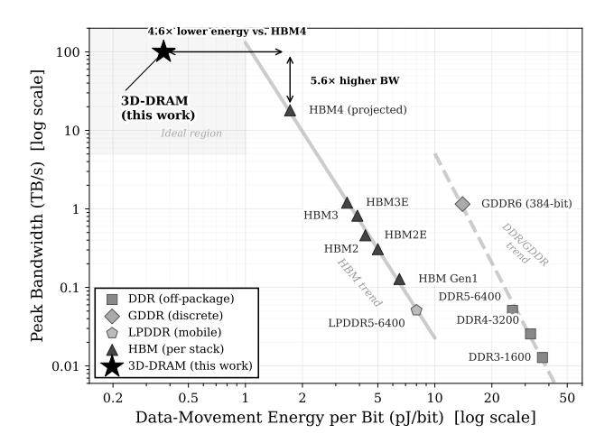
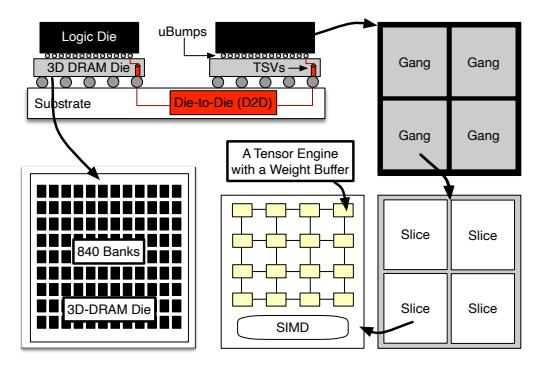

# D. Why 3D-DRAM: Bandwidth and transfer energy

Modern accelerators increasingly rely on HBM because conventional DIMM DRAM cannot supply sufficient bandwidth. However, HBM scaling is already stressing I/O and packaging: HBM3 retains a 1,024-bit data interface but doubles channels to 16×64-bit to improve concurrency [80]; HBM3E pushes pin speeds beyond 9.2 Gb/s to exceed 1.2 TB/s per placement [45]; and HBM4 doubles the interface width to 2,048 bits and increases channels to 32, enabling up to 2 TB/s per stack but further increasing interface complexity [4], [9]. Figure 3 makes this explicit by decomposing bandwidth across HBM and DDR generations over time.

Beyond raw bandwidth, decode is a *data-movement* problem where transfer energy matters. Representative measurements and industry disclosures indicate that HBM-class signaling can be several-times lower energy per bit than high-speed graphics-class interfaces, and device-access energy is a significant component of end-to-end serving power [60], [61]. Figure 3 summarizes picojoule (pJ) per bit ranges.

Fig. 3: Representative data-movement energy (pJ/bit) and bandwidth. The HBM per-stack bandwidth scaling is driven by increasing pin speed and interface width (HBM2E→HBM3→HBM3E→HBM4) to feed AI workloads [4], [45], [78], [80]. The energy per bit for HBM is not scaling efficiently. Unfortunately, the decode phase is dominated by bytes moved, so reducing transfer energy directly improves tokens/J.

## E. Example: Single-Layer KV-Cache Mapping

Consider one attention layer of Llama-3.1-70B (GQA, 8 KV heads, head dim 128, FP16). Each token produces  $2\times 8\times 128\times 2$  B = 4 KB of KV state, giving a 16 MB layer cache at 4K context. The stack partitions this into 1,024 stream-blocked tiles of 16 KB, spread evenly across the slice's 16 channels (64 tiles/channel). Each channel has three banks; a 16 KB tile maps to 128 flits of 128 B, stored as a 96 B aligned portion (one column across all three banks) plus a 32 B partial. Reading a tile thus spans roughly two rows per bank. Successive flits walk consecutive columns within an open row, and with 124 columns per row (124  $\times$  32 B = 3,968 B/bank), the row buffer is fully read before the next activation. At 64 tiles/channel, the layer occupies  $\sim$ 128 of 1364 rows per bank (<10%), leaving ample room for weights and other layers.

At decode, a Tensor Engine (§IV) streams tiles as a sequential column walk. It opens a row, streams all 124 columns, and activates the next row. The 16 channels are also operated independently. Thus, a refresh or scrub on one bank does not stall the other 15. New KV entries are appended to the tile tail with stream-flipping metadata, extending the occupied rows by one flit pair per step. The 16 KB tile granularity matches paged-attention page sizes (≥4 KB), so allocation and eviction occur at page boundaries without fragmenting the layout or disrupting row-buffer locality.

#### IV. RAPTOR: DESIGN

## A. Logic-Die Hierarchy and Dataflow

Raptor's logic floorplan (Fig. 4) mirrors the parallelism and data-movement demands of generative inference. Each accelerator card integrates 2-4 multi-chip modules (MCMs), each containing four 1.2 GHz chiplets. A chiplet vertically stacks a logic die on a 3D-DRAM die via face-to-face (F2F) bonding and is organized into four *gangs* of four *slices* each. Every slice

Fig. 4: Each accelerator card integrates up to four packages, each with four Raptor chiplets that face-to-face (F2F) stack a TSMC N4P logic die directly on a 3D-DRAM die. Dedicated 3D-DRAM channels feed per-slice tensor engines (TE) and weight buffers (WB).

contains a 4 × 4 tensor-engine (TE) array and a SIMD core for auxiliary operations. TEs deliver dense matrix throughput, slices localize data movement and buffering, gangs provide intermediate coordination, and chiplets aggregate bandwidth and capacity for tensor-parallel execution.

*a) Slice – the fundamental locality domain:* The slice is the key unit of compute-memory co-location in Raptor. TEs perform the dominant multiply-accumulate operations, accumulating partial sums in an output buffer. Activations are staged in slice-level SRAM global memory and streamed into per-TE input buffers during execution. In parallel, the 3D-stacked DRAM stores model weights and KV cache, partitioned into dedicated channels that feed each TE's weight buffer independently. This preserves bank-level parallelism across TEs and prevents unrelated refresh, scrub, or maintenance events from introducing cross-TE stalls. A SIMD core complements the TE array by handling auxiliary vector and transcendental operations. Together, TE compute, local SRAM staging, and independent 3D-DRAM channels make the slice a natural scheduling and locality domain.

*b) Gang – the intermediate execution domain:* A gang groups four slices into an execution island that bridges slicelocal computation and chiplet-wide aggregation. Gangs coordinate slices that jointly process a wider tensor shard, share work across nearby channels, and balance data movement over a bounded physical region of the logic die. This level is necessary because Raptor is not a flat compute array attached to a monolithic memory fabric: channel layout, bank allocation, and local routing must remain regular enough for timing closure yet flexible enough to sustain high decode throughput. The gang abstraction captures this organization, allowing the design to scale beyond a single slice without imposing chipletwide control overhead on every local operation.

*c) Chiplet – bandwidth and capacity aggregation:* Each chiplet aggregates four gangs into a weight-stationary chiplet backed by 840 3D-DRAM banks. These banks are mapped across the gang/slice hierarchy into balanced, independent channels: 16 per slice, 256 per chiplet. This channel count is central to sustaining decode bandwidth, where many small, latency-sensitive KV and weight accesses must proceed concurrently. Chiplets within an MCM communicate over Gen-2 die-to-die (D2D) links at 32 Gbps/lane; inter-MCM and host connectivity use PCIe Gen7. Thus, the design scales from TElocal weight delivery to package-level tensor parallelism while preserving the locality advantages of stacked memory.

Raptor's architectural contributions are implemented at the logic–memory interface, not in an abstract memory model. Stream-blocking depends on how banks are grouped into channels and assigned to TE weight buffers. Stream-flipping operates on the single-cycle, wide F2F interface between the logic die and 3D-DRAM. Topology-preserving redundancy maintains a regular bank/channel organization so faulty banks can be bypassed without disrupting the logical view of the compute engines. Thermal-aware refresh and ECC rely on independent bank operation and fine-grained scheduling across the hierarchy. Thus, the slice/gang/chiplet decomposition is necessary to explain how each mechanism is realized. §VI describes how inter-package PCIe Gen7 links support multicard deployment and collective communication.

