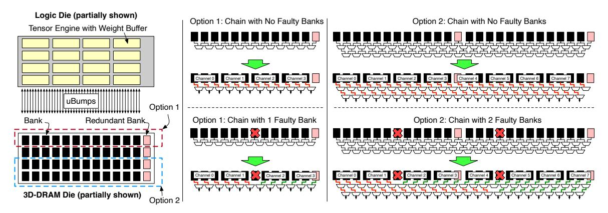
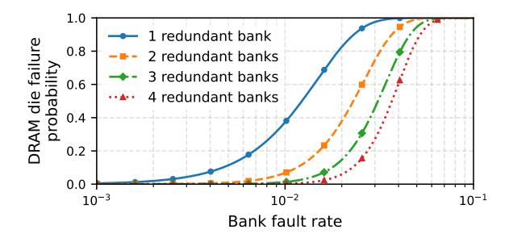

# *E. Topology-Preserving Redundancy*

Beyond performance and power, the 3D-DRAM subsystem must tolerate manufacturing-time and runtime faults while maintaining full, symmetric channel bandwidth and capacity within the card-level power and thermal budgets [16].

- *1) Faults and Thermal Concern:* A primary reliability concern is bank failures during manufacturing [53]–[56]. Each bank includes spare rows and columns, but if these cannot repair all defects, the bank is marked faulty. This can force the affected channel to run at reduced width or capacity. Because channels feed WBs in lockstep, an under-provisioned channel becomes the bottleneck, degrading performance per watt.
- *2) Redundant Banks with Topology Preservation:* We introduce redundant banks that transparently replace faulty ones while preserving the logical channel topology. A naive scheme would place all redundant banks at the edge of the 3D-DRAM

Fig. 7: Stream-flipping (pinless DBI) encoding and metadata layout in 3D-DRAM. For each 128B flit in a stream, the controller decides whether to invert the data to minimize bit transitions and stores a single DBI metadata bit alongside the 1024 data bits in DRAM; on reads, the flit is reconstructed with one conditional inversion, providing DBI-like behavior with only 0.8% capacity overhead and no PHY changes.

Fig. 8: Bank-chaining topology-preserving redundancy for 3D-DRAM. In general, with N functional and M redundant banks arranged in a chain, lightweight hierarchical multiplexing on the logic die can select any contiguous (N+M)-bank window to form  $\frac{N}{3}$  bank channels. This helps tolerate up to M arbitrary faulty banks while keeping channel width, mapping, and routing symmetric. This prevents significant routing concerns for redundant banks.

"beachfront" and route around faulty banks with long-distance wiring, increasing metal usage, latency, and power on an already power-sensitive interface.

Instead, we distribute spare banks alongside regular banks and select them so that channels remain logically contiguous. This keeps routing local, minimizes additional logic and wiring power, and ensures that all channels presented to the compute fabric remain symmetric in width and capacity.

3) Our Approach: We employ three mechanisms:

A. Bank chaining: We realize topology-preserving redundancy with a simple bank chaining scheme. We logically chain N functional banks with M redundant banks and use lightweight multiplexing on the logic die to select any contiguous N-bank window from the N+M physical banks. For example, as shown in Figure 8, choosing N=24 and M=2 allows the controller to form eight channels of three banks each from any 24 non-faulty banks in a chain of 26, tolerating up to two faulty banks at arbitrary positions. This selection requires only M=2 levels of multiplexing and adds negligible routing overhead, as routing remains on the logic die near the corresponding tensor engine and weight buffer.

**B. Scalable thermal-aware refresh:** At runtime, the dominant reliability stressor is temperature. The temperatures can reach 105°C at the logic and 3D-DRAM interface. At this temperature, the 3D-DRAM requires a refresh interval of 4ms to maintain retention margin, 8× more frequent than the nominal 32 ms refresh used in HBM devices. However, our 3D-DRAM is deeply banked, and each bank contains only 1364 rows. This is 16–32× fewer rows than in conventional DRAM banks. Thus, even with a 4ms interval, the refresh overhead is lower than that of commodity DRAM [50]–[52].

**C.** Interleaved Error-Correcting Code (ECC): To further harden against manufacturing and runtime faults, each bank uses a blocking ECC scheme. The last eight columns store a pair of 8-bit symbol-based [144, 140] Reed–Solomon codewords, interleaved to match the subarray mapping [11]. We co-locate this ECC with the stream-flipping DBI metadata.

On a read, the controller first fetches ECC and DBI metadata from all banks in a channel, then the corresponding data flits.

It checks ECC, corrects erroneous data (if needed), and uses the DBI bits to decide whether each 128B flit must be inverted before entering the compute pipeline. Writes follow the reverse order: the controller computes ECC, chooses the DBI polarity to minimize transitions, writes the (possibly inverted) data, and then commits ECC and DBI metadata. Raptor also employs periodic background scrubbing, as in conventional DRAM, to repair transient errors before they accumulate [15], [56], [71].

## V. SILICON CHARACTERIZATION

We validate Raptor's performance, resilience, power, thermal, and refresh characteristics on silicon.

1) Results of Stream Blocking: Figure 9 plots flit latency and aggregate 3D-DRAM bandwidth per card as DRAM frequency scales from 500MHz to 1GHz for 2- and 4-banks-per-channel configurations. The 2-bank design retains 256 channels per chiplet and uses the remaining banks for redundancy, while the 4-bank design is hypothetical and assumes a DRAM die with 33% more banks than the 3-banks-per-channel baseline. Because each row holds multiple 128B flits, streaming an entire row amortizes activation and reduces per-flit latency. At 700MHz, 3D-DRAM delivers 2.5ns average flit latency and 105TB/s of 3D-DRAM bandwidth per card, about 12.5× that of HBM3 cards; even if HBM4 doubles HBM bandwidth, 3D-DRAM still provides a 6.25× advantage.

Fig. 9: Impact of bank grouping on latency and bandwidth (measured). With the chosen 3-bank design at 700 MHz, Raptor achieves  $\sim$ 2.5 ns latency and  $\sim$ 105 TB/s bandwidth per card

## A. Stream-Flipping characterization

Figure 10 reports measured I/O energy (VDD1 = 2.5 V, VDD11 = 1.1 V) as banks scale from 1 to 8 under three switching rates. At 8 banks, the worst-case energy is 0.455 pJ/bit (100% switching); stream flipping reduces effective switching to 40-48%, yielding 0.376 pJ/bit. This is an **18% reduction** without pin changes, and  $\sim 6\times$  below reported HBM3 energy. At the same voltage, the 500 MHz energy is lower than the 400 MHz energy because a higher frequency improves the amortization of static power. Power-rail analysis confirms that the 1.1 V array rail accounts for **87%** of active power, centering thermal management on DRAM array activity.

## B. Resilience, Refresh and Rowhammer

Figure 11 shows the resilience improvement as we vary the group size and number of redundant banks. While we cannot disclose absolute yield figures, we leverage redundant banks across both pre-package (wafer-level) and post-package (stack-level) repair flows, as is standard in high-volume DRAM manufacturing. In practice, bank chaining recovers channels that would otherwise be yield-limiting.

At 700 MHz, switching from 16 ms to 4 ms refresh (required at  $T_j > 85\,^{\circ}\mathrm{C}$ ) costs only 1.37% of bandwidth (Table I) loss. Raptor's 840 banks  $\times$  1364 rows/bank keeps per-bank refresh latency 16–32× below conventional DRAM. For the RowHammer threshold of 200K (as we use an older technology node), back-to-back activations take 8.8 ms at  $t_{\rm RC}$  = 44 ns to hit this rowhammer threshold. Since the 4 ms refresh interval is below the 8.8ms window, every row is refreshed before any neighbor accumulates sufficient activations and RowHammer is inherently mitigated [13], [33], [67], [72], [73], [85]–[88]. This co-design of bank geometry with thermal-refresh policy is unique to deeply-banked 3D-DRAM.

Table I reports the measured refresh-induced bandwidth loss. In all cases, refresh traffic is a small fraction of total memory bandwidth. This allows reliable operation while remaining within the card's thermal budget [68].

**Fig. 10:** Measured I/O energy vs. number of active banks at 500 MHz (read-only, BL128, VDD1 = 2.5 V, VDD11 = 1.1 V). Stream flipping reduces energy by 18% (0.45  $\rightarrow$  0.37 pJ/bit at 8 banks). At the same VDD, the 500 MHz energy is lower than that at 400 MHz due to better static power amortization with higher throughput. The design target frequency is 700 MHz.

**Fig. 11:** Resilience of bank-chaining versus group size and redundancy. Increasing the number of redundant banks substantially improves resilience by enabling recovery of channels that would otherwise be fault-limiting.

TABLE I: Refresh overhead at 700MHz.

| Refresh interval | Bandwidth overhead | 3D-DRAM bandwidth (TB/s) |
|------------------|--------------------|--------------------------|
| 1 ms             | 0.0546             | 99.2628                  |
| 2 ms             | 0.0270             | 102.1314                 |
| 4 ms             | 0.0137             | 103.5657                 |

## C. Thermal analysis and Characterization

The junction-to-ambient thermal path is analyzed as a series resistor network through five layers: (1) the thinned die stack (logic + DRAM, 0.62 mm), (2) TIM1 (first thermal interface material, between die and lid;  $k=5\,\mathrm{W/mK}$ ,  $100\,\mu\mathrm{m}$ ), (3) the copper lid ( $k=390\,\mathrm{W/mK}$ , 1.5 mm), which spreads heat from die to package footprint, (4) TIM2 (second thermal interface material, between lid and heatsink;  $k=6\,\mathrm{W/mK}$ ,  $200\,\mu\mathrm{m}$ ), and (5) the heatsink/airflow cooling solution. The cooling solution contributes  $\sim\!80\%$  of total thermal resistance ( $R_{\theta}$ ); the entire die stack including 3D-DRAM adds only  $\sim\!1.5\%$  (0.003 °C/W). DRAM stacking, therefore, does not measurably shift junction temperature ( $T_{j}$ ) versus power.

Figure 12(a) shows the modeled  $T_j$  distribution across the logic die at Raptor's operating point of  $\sim \! 106 \, \mathrm{W}$  per chiplet (422 W per MCM  $\div$  4 chiplets), under the optimized heatsink configuration ( $R_{\theta} = 0.10\,^{\circ}\mathrm{C/W}, T_a = 35\,^{\circ}\mathrm{C}$ ). The 2D temperature field is computed from a spatially resolved power density map of the chiplet architecture. The TE arrays form localized hotspots at  $\sim \! 92\,^{\circ}\mathrm{C}$ , while SRAM buffers, inter-gang crossbar, and PHY regions are 4-6 °C cooler and are attenuated by lateral heat spreading in the copper lid.

Figure 12(b) plots peak  $T_j$  versus die-stack power under three cooling configurations. At baseline air cooling ( $R_{\theta} = 0.16\,^{\circ}\text{C/W}$ ,  $T_a = 55\,^{\circ}\text{C}$ ), only 63 W per chiplet stays below the 105 °C limit. The optimized heatsink yields a peak  $T_j$  of  $\sim$ 93 °C at 106 W which is well within target, with headroom to  $\sim$ 140 W. Liquid cooling ( $R_{\theta} = 0.02\,^{\circ}\text{C/W}$ ) effectively removes the thermal constraint ( $T_j < 60\,^{\circ}\text{C}$  at 106 W).

Figure 12(c) presents a horizontal cross-section through the die center, comparing the logic die and 3D-DRAM layer average temperatures. The logic-above-DRAM stacking keeps the DRAM  $\sim$ 3.5 °C cooler than the logic surface. This is the opposite of conventional HBM, where DRAM sits above the heat-generating logic and absorbs conducted heat. This thermal inversion is a direct advantage of the F2F bonding approach.

Fig. 12: Thermal analysis of the logic-on-3D-DRAM stack (analytical resistor-network model). (a) Modeled  $T_j$  distribution across the chiplet at 106 W with optimized heatsink; TE arrays form localized hotspots at  $\sim$ 92 °C while inter-gang and PHY regions remain 4-6 °C cooler. Gang and slice boundaries overlaid. (b) Peak  $T_j$  vs. die-stack power under three cooling configurations; the optimized heatsink sustains 106 W with  $\sim$ 12 °C margin below the 105 °C limit. (c) Horizontal cross-section at die center showing the 3D-DRAM layer runs  $\sim$ 3.5 °C cooler than the logic die.

#### VI. DEPLOYMENT AND COMMUNICATION

#### A. Interconnect Hierarchy

Figures 4 and 13 show the three-level interconnect hierarchy of Raptor. Within each chiplet, four gangs communicate over a custom on-chip network-on-chip (NoC) for low-latency partial-sum reductions and activation exchanges (§IV-A). Four chiplets are connected by die-to-die (D2D) links at 32 Gbps/lane. Each card integrates 2-4 MCMs, and multiple cards form a node. For scale-up deployment, every MCM can connect to every switch tray via PCIe Gen 7 or the Ethernet Scale-Up Network (ESUN) links, forming a one-hop fat-tree with all-to-all MCM connectivity within a rack. The topology is protocol-agnostic, and additional switch tiers can extend connectivity across racks.

The per-link throughput varies across the three hierarchies (on-chip NoC, D2D, PCIe/ESUN), but aggregate bandwidth at any hierarchy level scales with the addition of links; the primary distinction across levels is therefore latency. Because aggregate bandwidth can be matched across levels by adjusting link count while latency stays at the same order within each level, we model the inter-card network as a unified flat fabric parameterized by one-way latency (swept 0.01 to  $10~\mu s$ ) and aggregate bandwidth (swept 32~GB/s to 4~TB/s), allowing us to evaluate sensitivity without committing to a specific protocol or link count (§VIII).

IO Chiplet: The deployment in Figure 13 assumes the PHYs reside on the N4P Raptor logic die. An orthogonal solution is to relocate the PCIe/ESUN/D2D PHYs (and optional copackaged optics or CPO) to a dedicated IO chiplet bonded to the MCM on a mature node. This is a deployment-time decision, not a compute-die redesign, and our chiplet decomposition already accommodates it. This enables three payoffs: (i) it reclaims N4P reticle and removes a power-dense heat source from the 3D-DRAM beachfront (§V); (ii) it decouples the MCM from the scale-up protocol, opening memory-semantic fabrics and CPO alternatives to PCIe/ESUN; and (iii) for

**Fig. 13:** Scale-out organization of Raptor from gangs to a rack deployment. Each node can hold several cards (here showing two MCMs per card). Every MCM connects to every switch tray via PCIe Gen 7 or the Ethernet Scale-Up Network (ESUN), forming a one-hop tree with all-to-all connectivity. Within an MCM, four chiplets communicate over D2D links; within a chiplet, four gangs communicate over a custom on-chip NoC. There is variation in the *per-link* latency and throughput across all three protocols. While per-link throughput varies across levels, aggregate bandwidth scales with the number of links, so the primary distinction across levels is latency.

heterogeneous deployments, a coherent load/store fabric can absorb cross-pool many-to-many traffic into page-granularity accesses, shifting the sensitivity curves in §VIII into the low-latency regime where collectives do not limit the tokens/s/card.

## B. Collective Implementation

This interconnect hierarchy is exploited by the collective implementations. All-reduce operations use a hierarchical decomposition that combines reduce-scatter and all-gather phases: the bulk of the data reduction occurs locally within a chiplet over the on-chip NoC, with progressively smaller messages

TABLE II: The minimal-card configurations for each model and accelerator.

|                 | Accelerator (XPU + SRAM/HBM, RP + 3D-DRAM) |                            |                             |                             |                             |                           |                                       |
|-----------------|--------------------------------------------|----------------------------|-----------------------------|-----------------------------|-----------------------------|---------------------------|---------------------------------------|
| Model           | SRAM                                       | HBM                        | 3D-DRAM                     | 3D-DRAM (2× BW)             | 3D-DRAM (4× BW)             | 3D-DRAM (2× Full)         | 3D-DRAM (4× Full)                     |
| Llama3.1 70B    | 8 8 1 0 4, U, 128                          | 1   1   1   0   1, U, 192  | 1   1   1   0   1, U, 32    | 1   1   1   0   1, U, 32    | 1 1 1 0 1, U, 32            | 1   1   1   0   1, U, 64  | 1   1   1   0   1, U, 128             |
| GPT_OSS 20B     | 2 1 8 0 1, D, 40                           | 1 1 1 0 1, D, 384          | 1   1   1   0   1, D, 64    | 1   1   1   0   1, D, 64    | 1   1   1   0   1, D, 64    | 1 1 1 0 1, D, 128         | 1 1 1 0 1, D, 256                     |
| GPT_OSS 120B    | 8 1 1 3 2 0 1, D, 160                      | 1   1   1   0   1, D, 384  | 1   1   4   0   1, D, 160   | 1   1   4   0   1, D, 160   | 1   1   4   0   1, D, 160   | 1   1   2   0   1, D, 192 | 1 1 1 0 1, D, 256                     |
| DeepSeekV3 671B | 8 1 64 4 4, D, 1216                        | 1   1   4   1   1, D, 1152 | 4   1   32   2   1, D, 1216 | 4 1 1 3 2 2 1, D, 1216      | 4   1   32   2   1, D, 1216 | 2 1 16  2  1, D, 1280     | 1 1 8 1 1, D, 1280                    |
| Kimi K2 1T      | 8 1 1 384 4 4, D, 6336                     | 1 1 8 1 1, D, 1920         | 4   1   48   2   1, D, 1728 | 4   1   48   2   1, D, 1728 | 4   1   48   2   1, D, 1728 | 2 1 1 2 4 2 1, D, 1792    | 1   1   1   1   1   1   1   1   1   1 |
| Canary 1B       | 1 1 1 0 1, U, 4                            | 1   1   1   0   1, U, 192  | 1 1 1 0 1, U, 32            | 1 1 1 0 1, U, 32            | 1 1 1 0 1, U, 32            | 1   1   1   0   1, U, 64  | 1 1 1 0 1, U, 128                     |
| Whisper         | 1 1 1 0 1, U, 4                            | 1   1   1   0   1, U, 192  | 1   1   1   0   1, U, 32    | 1   1   1   0   1, U, 32    | 1   1   1   0   1, U, 32    | 1   1   1   0   1, U, 64  | 1   1   1   0   1, U, 128             |

Each cell reports  $\langle Attn-TP|FFN-TP|EP|SE|PP$ , mode, memGB $\rangle$ , where Attn-TP and FFN-TP denote tensor parallelism for the attention and FFN blocks, respectively; EP is expert parallelism; SE is the number of shared-expert cards; PP is pipeline depth; mode is unified (U) or disaggregated (D) deployment; and memGB is aggregate memory in GB across the deployment (i.e., total cards  $\times$  per-card capacity; e.g., for Kimi K2 1T on SRAM the configuration requires 1,584 cards  $\times$  4 GB = 6336 GB, reflecting the extreme parallelism forced by SRAM's small per-card capacity).

exchanged at the MCM (D2D) and card (PCIe) levels. Allgather operations are implemented as broadcasts, leveraging Raptor's source-side multicast capability to reduce congestion at higher levels of the hierarchy.

## C. Parallelism Mapping

**Dense models** use *unified deployment*, distributing every layer across the same set of cards. Tensor parallelism (TP) shards attention heads and FFN matrices across cards; we cap TP at 8 to stay within a single node and avoid collectives-dominated scaling. Pipeline parallelism (PP) partitions layers across additional cards only when a single card cannot hold the required weights and KV cache.

**MoE models** use *disaggregated deployment* [93]: a small TP group of cards (e.g., TP=4) handles attention, while experts are spread across the remaining cards via expert parallelism (EP). This separation keeps per-expert state within a single card's capacity and confines the heavier many-to-many traffic to the EP pool.

Because Raptor's 3D-DRAM offers substantially higher per-card capacity than SRAM, and higher bandwidth than HBM, it requires fewer cards for a given model, which directly reduces the parallelism degree and, consequently, the collective communication overhead. The per-model parallelism configurations used in our evaluation are listed in Table II.

