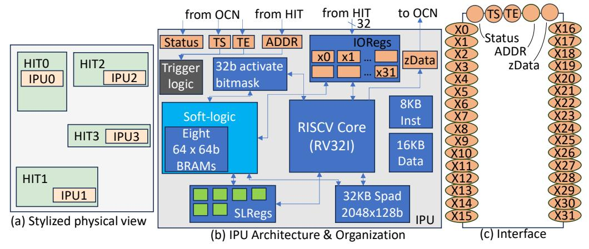
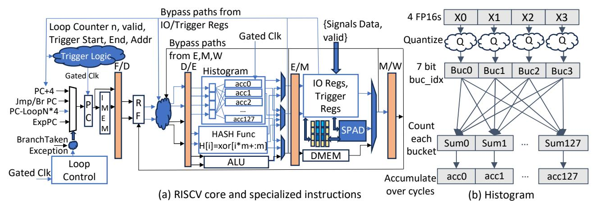
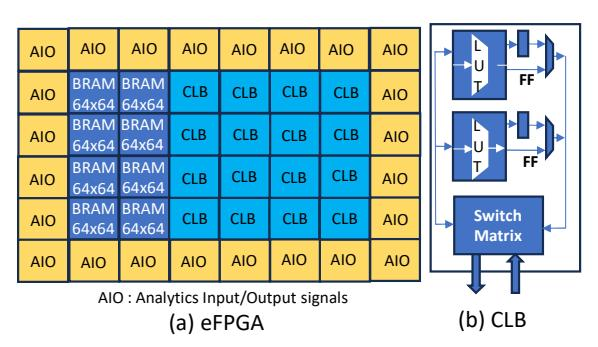
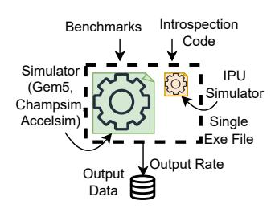

# *D. IPU Program Lifetime*

This section is an end-to-end example. The HIT is a CPU core and introspection development is closed policy - the CPU core designer will also write the introspection code. The analysis is PICS generation; the demonstration of the software-defined performance attribution capability (§VI-B) we encourage the reader to skim that first.

| Signal        | #Bits | Reg | Semantics                   |
|---------------|-------|-----|-----------------------------|
| itlb-miss     | 1     | x0  | Instruction TLB miss flag   |
| icache-miss   | 1     | x1  | L1 Icache miss flag         |
| recycle       | 1     | x9  | Recycle ROB unique IDs flag |
| fetch-pc-head | 64    | x11 | Next PC to be fetched       |

TABLE I: Partial ABI Spec.

Pre-Fabrication. As part of the design of the CPU core, up to 32 signals are chosen to connect to the IPU. No information needs to be released to the public because of the closed policy; yet, an internal ABI Spec would be created to facilitate development. A partial ABI Spec is seen in Table I. Prior to verification, the IPU is flattened into the core layout and the HIT-IPU connections are made as outlined in Figure 2. A subtle issue is that the HIT designer needs to determine what the important signals are. By providing 32 we give them freedom to be profligate which allows rich analytics post-manufacture. Optimizations for future work include multiplexing a larger number of signals from a HIT to the IPU to sidestep the 32 signal limit. It is also possible for designers to create IPU variants, each with a different set of signal inputs. The type of IPU variant integrated into a particular HIT could then be chosen at random. If produced at scale, this would allow greater flexibility without generating larger overheads or compromising analytics accuracy.

**Development.** With the ABI Spec defined, the introspection code can be developed, which is the PICS generation in this example. To this end, the CPU designer references the ABI spec for each of the 17 signals necessary and identifies which input registers they are connected to. A portion of the compiled code handling the instruction TLB miss event is shown below:

```
_main: regtimer 50000, psv_loop
psv_loop: beq x0, 1, itlbm_m
beq x1, 1, icache_miss; x1 is a HW inp sig
...\nitlb_m: hash r1, x12; x12 is an HW inp sig
ld r2, r1, 0
addi r2, r2, 0x40
sw r2, r1, 0
ret
```

In development, a 400,000 cycles sample rate is chosen to limit the output load; this creates approximation error that the CPU designer tests and finds within acceptable limits. The overall PC ordering by most cycles used is correct. The CPU designer releases the introspection binary, output location, approximation error, and if a region of interest can be chosen onto the app-store.

Analysis. Now, a SW developer has encountered unexpected slowdowns in their application and wants to profile it. They can download the PICS generation binary on the host. The listing also indicates that output will be put in a file on disk and that the user can optionally specify a region of instructions to analyze. They include a few API calls at the top of their program source:

```
IPU_CONFIG_IMAGE("PICS-generation")
IPU_CONFIG_START(ROI_BEGIN)
IPU_CONFIG_STOP(ROI_END)
```

| PC       | Event Combination      | Number of Cycles |
|----------|------------------------|------------------|
| 0x7912d0 | DTLB miss, DCache Miss | 50000000         |
| 0x80dda0 | Branch Mispredict      | 200000           |

TABLE II: Some rows from PICS generation analysis output.

code>

ROI\_BEGIN and ROI\_END are the beginning and end of the region of interest where the developer believes the slowdown to be. Essentially, it sets the respective Program Counters as the address to monitor for activating the IPU.

**Post-Analysis.** The output file has a list formatted as in Table II that is produced by host code, monitoring the IPU's introspection program. The developer uses the results for application performance tuning.

#### IV. HARDWARE ARCHITECTURE

A chip can have multiple IPUs. Each IPU observes hardware signals from its corresponding HIT and runs introspection binaries on those signals as stylized in Figure 3(a). The IPUs use the chip's OCN, which enables them to transmit introspection outputs to and configuration from the host. The collection of IPUs is visible as a PCIe device and uses PCIe to interface with the host; each IPU is distinguished through distinct memory mapped regions. If the chip lacks an OCN, some form of network which connects the IPUs to the PCIe interface must be added as well.

Configuration of an IPU occurs through an API call: IPU\_CONFIG\_IMAGE (image). This bundles the introspection binary and trigger logic meta-data and sends them to the appropriate IPU based on a given hardware device ID.

Interface overheads. HIT-IPU connections are short because the IPU is flattened into the HIT during P&R. Therefore, wiring overheads are negligible. Depending on the signals in a HIT and what the HIT itself is - there could be timing issues that can be addressed with standard buffering techniques used for performance counters. Consider a square HIT that is  $2mm^2$ . At a simple level, signals might need to traverse 2.8mm (half the perimeter of the HIT) to reach the IPU logic. To avoid timing issues for a high frequency design, one flip-flop might be necessary. Since this "far away" signal is buffered by one cycle, it implies all signals of this  $HIT \rightarrow IPU$  must be buffered. HIT designers can use P&R feedback to judiciously select signals to avoid/minimize this.

No cross-chip wires are introduced; IPU configuration and output transfers use the existing OCN and PCIe, transmitting small packets at long intervals with negligible traffic impact. **Signal Selection Methodology**. A natural question is how a hardware designer should choose which signals to connect to an IPU, and whether 32 signals are sufficient. We address both concerns. Across our four capability demonstrations, the maximum number of signals required was 17 (for PICS generation), while the prefetcher emulation and GPU aggregation demonstrations required only 2 and 3 signals respectively. These demonstrations span fundamentally different analysis



Fig. 3: IPU hardware architecture.

classes, yet none approached the 32-signal budget, suggesting it is well-sized for practical introspection tasks.

We observe that signal selection is principally determined by the HIT type rather than by any particular downstream analysis. A CPU front-end block naturally exposes fetch-related signals (the current PC, miss indicators); a cache controller naturally exposes its request bus, eviction activity, and coherence state; a GPU scoreboard naturally exposes functional unit activity flags. This property is important: the designer does not need to anticipate future analyses. Instead, they expose the important internal state, and the IPU's programmability enables a combinatorial space of analyses to be composed from these primitives post-deployment.

This stands in sharp contrast to PMU design. A PMU hardwires both the data source and the analysis into a single counter (e.g., "count L2 misses"), producing exactly one predefined answer per event. The IPU decouples source selection from analysis: 32 primitive signals serve as inputs to arbitrary software, enabling analyses the designer never anticipated — all from the same fixed interface. Where N PMU events yield N answers, N IPU signals yield a vast space of programs.

To guide signal selection, we recommend a coverage-based methodology organized along three axes: (1) datapath values such as addresses and operand fields; (2) control signals such as stall conditions, flush events, valid bits, and branch outcomes; and (3) state indicators such as queue occupancy, buffer fullness, and functional unit activity. Ensuring representation across the major pipeline stages and known resource bottleneck points within each category provides a robust default signal set for a given HIT.

Hardware organization. The IPU architecture comprises four baseline components: a programmable core, a scratchpad SRAM, 32 input registers (IORegs), and 3 trigger registers: Trigger Start (TS), Trigger End (TE), and ADDR. The trigger logic looks at the ADDR signal from the HIT along with TS and TE (programmed using API calls) to control when the IPU becomes active. This is shown in Figure 3(b) while the interface is laid out in Figure 3(c). To concretize the

| Unit           | Area(mm <sup>2</sup> ) |
|----------------|------------------------|
| RISC-V Core    | 0.0011                 |
| eFPGA          | 0.22                   |
| SRAM           | 0.016                  |
| Histogram Unit | 0.001                  |

TABLE III: Area Per-Component

architecture, we select some sizes for these components: the core is 32-bit RISCV core (RV32I instruction set) using a data-SRAM and an instruction-SRAM; the scratchpad is 32KB.

Execution Model. An IPU has a 4-bit STATUS register, putting it in 6 states: PAUSED (P), ACTIVE-PAUSED (AP), ACTIVE-RUNNING (AR), FINALIZE (F), ERROR (E), and UNDEFINED (U). Its program structure includes 3 predefined program regions: init, \_main, and end. Borrowing from the simplicity of micro-controllers, init is hardcoded to instruction memory address 0x0. The entire instruction memory is 8KB which amounts to 2048 instructions. On power-on, PC is set to 0 and starts executing the code in init. By convention, finish is hard-coded to be 16 instructions from the bottom of the instruction memory at 0x7F0. When the IPU is set to the finalize state, it executes code in the finish function and transitions to the PAUSED state.

The execution model of code on an IPU is data-driven, i.e. when new inputs arrive the \_main function is called if the IPU is in the ACTIVE-PAUSED state. If it is running code triggered by previous input, it will be in the ACTIVE-RUNNING state - data received when in this state is dropped. Whenever we show a datapath of X bits for the IO registers, there is an implied additional valid bit associated. This bit is used to determine whether new input has arrived.

**Microarchitecture**. We design two IPU variants for different regions of the analysis-vs-data-rate design space.  $\mathbf{IPU}_{lite}$  is a compact, cacheless RISC-V core with built-in primitives like histograms, loop counters, and hash functions for efficient, low-complexity introspection. The pipelined architecture of the  $\mathbf{IPU}_{lite}$  is shown in Figure 4(a), while that of the included histogram unit is shown in 4(b).  $\mathbf{IPU}_{pro}$  augments the RISC-V core with soft-logic—a lightweight embedded FPGA seen



Fig. 4: IPU Microarchitecture showing datapath and control-path changes



Fig. 5: IPU<sub>pro</sub> soft-logic design

in Figure 5 with 590 configurable logic blocks (CLBs), 470 analytics IO (AIO) tiles (identical to baseline IO tiles except for the fact that we removed staging flip-flops, which are already in our IORegs), and eight small BRAMs (64 entries deep and 64-bits wide)—enabling complex, high-throughput analysis tailored at runtime. It interfaces via memory-mapped registers and supports introspection programs that bundle RTL logic alongside control code. Each IPU is embedded with its associated HIT and communicates via the OCN, avoiding long wires and limiting system traffic due to low data rates. Multiple IPUs scale well: 5 IPUpro and 10 IPUlite consume just 0.65% of a 200 mm² die, and even full coverage across GPU SMs stays under 1% chip area overhead. A per-component breakdown of IPU area can be found in Table III.

On statistical bias from dropped data. When dropping data at a regular interval it is possible to introduce statistical bias. However, a simple algorithmic defense against pathological correlation is available entirely in software: randomizing the sampling window length around the target average (e.g., perturbing a 256-cycle window pseudorandomly). This breaks any systematic alignment between the IPU's processing cadence and periodic hardware behavior, and requires no hardware changes which further illustrates the value of the IPU's programmability.

#### V. EVALUATION METHODOLOGY

To empirically evaluate the IPU, we demonstrate three capabilities that we briefly describe in the introduction. Table IV describes the emulation and simulation testbeds we built. Emulation and Simulation testbed. Our four demonstrations span prefetch engine (Champsim [32] simulator), coremicroarchitecture (GEM5 [8] cycle level simulation), and GPU cycle-level simulation (AccelSim [39]). We built an IPU emulator for code development and to determine correctness of the introspection. For performance (time), we developed a co-simulation environment that adds an IPU simulator into Champsim, Gem5, and Accelsim (left Figure in Table IV). For area and power, we implemented and synthesized RTL which was verified with an emulator for correctness. Table IV also shows the number of lines of code for the \_main function of each introspection program. In total, more than 200 applications were simulated.

RTL Implementation. We implemented  $IPU_{pro}$  and  $IPU_{lite}$ in Verilog. Our implementation was verified for many input values against the introspection reference implementation. We use the AsAP7 7nm educational PDK [16]. For SRAMs we use CACTI scaled from 32nm to 7nm per [71]. We implemented our soft-logic using the FABulous design flow [40] to estimate area and power, and their synthesis flow for utilization. To determine soft-logic power, we used data from the reference introspection execution to create input traces. We used ASIC process flow of synthesis (DC Compiler/Primetime), APR(Innovus), and VCD based power estimation obtained from Netlist simulation of all demonstrations. The max clock frequency for the soft-logic and IPUpro is 1.3 GHz and 2 GHz for the IPU<sub>lite</sub>. The HIT signals we need are described in each capability, and we show that the signals are readily available for any reasonable implementation of a GPU or core. The first two demonstrations are on a CPU and the third demonstration is on a GPU. For comparison, our references are: a CPU Zen2 4-Core Complex [70], which needs 31 mm<sup>2</sup> area and consumes 4 watts of power [3], and a GPU SM, that uses 3.475 mm<sup>2</sup> [46] of area and consumes 1 watt [38], [83].



| Capability             | Stateful        | Software-Defined        | Scalable, On-Chip | Real-Time Component |
|------------------------|-----------------|-------------------------|-------------------|---------------------|
| Demonstrated           | Emulation       | Performance Attribution | Data Aggregation  | Level Diagnosis     |
| Benchmarks             | 135 Traces [19] | 13 Spec                 | 21 Gemms          | 189 Traces [32]     |
| Simulator              | Champsim        | Gem5 SE                 | AccelSim          | Champsim            |
| Config Matching        | Entangled [63]  | TEA [34]                | QV100 Model       | Gaze [14]           |
| #lines of IPU code     | 300 Verilog     | 75                      | 2                 | 50                  |
| #bits into IPU         | 64              | 215                     | 4                 | 132                 |
| #signals from HIT      | 2               | 17                      | 3                 | 6                   |
| Output size            | 3B              | 6B                      | 4B                | 384B                |
| Output timing (cycles) | Program         | 400k                    | 256               | 20M                 |
| Rate per HIT (1/s)     | approx 0        | 15KB                    | 15.6MB            | 18.75KB             |

TABLE IV: Methodology configurations and IPU System Testbed Flow for emulation in figure.

Full Synthesis and Place-and-Route. To complement our top-down comparison against published areas of modern highend microprocessors, we performed full synthesis and placeand-route of the IPU integrated into a real processor. We selected BOOM (4 wide OOO core). We evaluated both a single-core configuration (with a 256KB L2 cache) and a 4 core complex (with a 1MB L2 cache, resembling the Zen2 4-core complex organization). The IPU was flattened into the core's hierarchy, with signals connected for the TEA case study (Section VI-B), and full place-and-route was performed using Cadence Innovus on the ASAP 7nm PDK. Timing was met in all configurations. To stress-test signal routing, we conservatively inserted 4 stages of flip-flop buffering on the HIT-to-IPU signal paths which models the wiring distance of a core far larger than BOOM even though our place-and-route results showed that only 1 stage was necessary at BOOM's physical dimensions. This confirms that the IPU's buffering approach scales comfortably to production-sized cores. For the single-core configuration, the area overhead including all wiring was 3%. Crucially, this represents an upper-bound: BOOMv2 is substantially smaller than production high-end cores (2.2 mm² compared to 31 mm² for a Zen2 core complex), owing to its smaller BTB, TLBs, absence of SIMD units, lower issue width, and smaller ROB. The IPU's absolute size is constant — the higher percentage overhead reflects the smaller denominator, not a larger IPU. On a Zen2-class core, the same IPU would represent approximately 0.2% area overhead.

