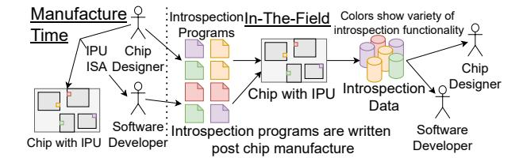
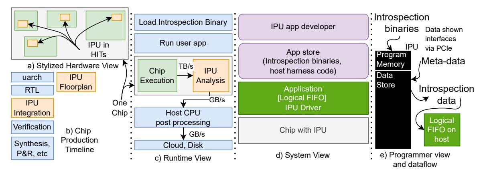

# Enabling Continuous, In-Field Introspection: The Programmable IPU Architecture

Ian McDougall\*, Shayne Wadle\*, Harish Babu Batchu†, and Karthikeyan Sankaralingam\*†

\*Department of Computer Sciences

University of Wisconsin-Madison, Madison, WI, USA

Email: {imcdougall, swadle}@wisc.edu, karu@cs.wisc.edu

†NVIDIA, Santa Clara, CA, USA

Email: harishbabub@nvidia.com

Abstract—Modern silicon systems are increasingly opaque, leaving developers blind to in-field hardware behavior on real workloads. Existing introspection tools force a debilitating tradeoff: fixed-function Performance Monitoring Units (PMUs) are low-overhead but lack programmability, while trace-based solutions are high-fidelity but incur prohibitive data and performance overhead, and have an accessibility challenge as well. This leaves a critical "capability gap," with no solution offering programmability, low overhead, and real-time analysis simultaneously. This paper introduces the Introspection Processing Unit (IPU), a new, lightweight architectural primitive designed to fill this gap. The IPU is a novel hybrid microarchitecture, pairing a programmable RISC-V core with judiciously chosen microarchitectural accelerator extensions, including a tiny eFPGA. This hybrid design is our core insight, balancing the flexibility of software with the line-rate efficiency required for non-invasive introspection. We demonstrate the IPU's power not through point solutions, but by showing its ability to perform classes of analysis previously considered intractable in the field. We show a single IPU architecture can perform: 1) Stateful Emulation: (e.g., A/B testing instruction prefetchers), 2) Software-Defined Performance Attribution (e.g., creating per-instruction cycle stacks), 3) Scalable, On-Chip Data Aggregation (e.g., fine-grained GPU utilization monitoring), and 4) Real-Time Component-Level Diagnosis (e.g., per-miss root-cause diagnosis of a prefetcher). Our complete RTL-level prototype, synthesized at 7nm, proves this new capability is practical, with an area overhead of < 1%and power consumption of <25mW.

Index Terms—introspection, analysis, accelerator, A/B testing, performance monitoring

## I. INTRODUCTION

As modern CPUs, GPUs, and accelerators grow increasingly complex and opaque, our ability to understand their *after*-deployment behavior remains archaic, creating a crisis in observability. Developers, researchers, and performance analysts are fundamentally blind to the detailed, real-time operation of hardware in the field, forcing them to rely on simulation, proxies, and offline analysis that cannot capture the intricacies of live workloads. The rich data made available from live collection and analysis, in tandem with advanced generative AI frameworks, could make major advancements in computer hardware feasible at a much quicker rate than is currently possible [64]. This blindness to live data is not for a lack of tools, but for a lack of the *right* tool. The existing landscape for hardware introspection forces a debilitating trade-off between flexibility, efficiency, and accessibility:

- 1) **Fixed-Function Monitors (e.g., PMUs):** Performance Monitoring Units (PMUs) are the workhorse of in-field analysis. They are ubiquitous and impose near-zero overhead. Their fundamental limitation, however, is their inflexibility. A PMU can only count what its designers anticipated would be useful. It is a rigid, fixed-function tool that cannot be adapted to answer new questions that arise post-deployment, and hides nuances of actual on-chip events [34].
- 2) **High-Overhead Trace** (e.g., JTAG): At the other extreme, trace-based solutions provide exhaustive, cycle-by-cycle detail. While invaluable for post-mortem debugging in a *lab*, they are entirely unsuitable for in-field, real-time analysis. The resulting data deluge (often terabytes per second) overwhelms on-chip buffers, saturates I/O bandwidth, and induces significant application slowdowns, making them unusable for observing long-running, production workloads. JTAG is impractical for a software developer seeking insights on bottlenecks on the hardware they are optimizing code for.
- 3) Specialized Hardware (e.g., TEA for PICS [33], [34]): To address specific, critical needs like detailed program analysis, designers have proposed specialized, fixed-function hardware blocks to obtain per-instruction cycle stacks (PICS). They can offer deep insights for programmers such as which instruction spent how many cumulative cycles in L2 vs. TLB misses. While effective for their narrow task, this approach is unscalable. It is not feasible to anticipate and ship dozens of disparate hardware monitors for every *potential* use case.

This leaves a vast and critical **capability gap**. There is no existing architectural solution that provides **programmability** (like a CPU), **real-time signal access** (like a trace), and **low overhead** (like a PMU) simultaneously. We lack the ability to deploy new, sophisticated analysis *software* that runs directly on the hardware, observing its internal state, aggregating data locally, and even participating in low-latency tracking, all while the main system runs at full speed. Section VII presents a taxonomy of the relevant academic literature as well.

This paper proposes the **Introspection Processing Unit** (**IPU**), a new, lightweight architectural primitive designed to fill this gap. It is distinguished by three key properties:

• Low-level Signal Access: The IPU has high-bandwidth, read-only access to a curated set of internal microarchitectural signals, far beyond what is exposed to a PMU.

Fig. 1: IPU overview

- On-Chip Data Processing: It executes analysis programs *locally*, enabling on-chip aggregation, filtering, and statistical analysis. This "computational introspection" solves the data-deluge problem by exporting only high-level insights, not raw traces.
- Low-Latency State Tracking: Its tight integration allows it to track system state in real-time, enabling tasks like hardware emulation that are impossible at line rate with any other tool.

Concretely, an IPU is built around a tiny RISC-V core placed in close physical proximity to the hardware block it introspects (a "Hardware-module Introspection Target" or HIT), as shown in Figure 1. At design time, engineers can attach IPUs to HITs, exposing a set of curated internal signals (e.g., up to 32 per IPU). The actual analysis that runs on these signals is fully programmable via "introspection binaries" that can be securely conceived and deployed any time during the chip's life. From a system-level perspective, the IPU streams its aggregated introspection output to the host via a logical FIFO, with chip designers using software signing to control access.

The core contribution of this paper is the design, implementation, and evaluation of this introspection architecture that executes flexible, software-defined analysis. We also propose a security model to govern its use via a trusted computing base and signed introspection binaries, addressing the challenges of this new capability. To demonstrate the power and generality of *this single architecture*, we illustrate its application to four disparate capabilities, each representing a class of problem currently considered intractable in the field:

- 1) **Stateful Emulation:** We implement the complex entangled instruction prefetcher [63], demonstrating the IPU's ability to run stateful simulations *while* the processor runs at full speed.
- 2) **Software-Defined Performance Attribution:** We use the IPU to replicate in software the functionality of a specialized PICS block, providing per-instruction cycle stack accounting for program optimization.
- 3) **Scalable, On-Chip Data Aggregation:** We use IPUs to monitor GPU TensorCore utilization, performing local data aggregation to provide system-wide insights.
- 4) **Real-Time Component-Level Diagnosis:** We attach an IPU to a state-of-the-art data cache prefetcher [14], classifying demand misses into root-cause categories by tapping prefetcher-internal decision-point signals.

We present a complete RTL-level prototype, synthesized at

7nm, which proves the IPU's practicality. Our design achieves this new, powerful capability with an area overhead of <1% and a power consumption of <25mW, making it a feasible addition to any modern chip design. The IPU provides a path forward, moving hardware introspection from a rigid, predefined function to a flexible, programmable platform.

Contribution and Architectural Novelty. To deliver these capabilities, our IPU architecture and microarchitecture are a hybrid system, not simply a standard RISC-V CPU. This design is the result of several key insights, unknown prior to our demonstration, that were necessary to achieve lowoverhead, high-performance introspection. While we use a RISC-V core as the baseline for **Programmability**, a core contribution is the judiciously chosen microarchitectural extensions that enable high-bandwidth, allowing the core to subscribe to internal hardware signals. We recognized that a processor-core-only approach is insufficient for line-rate data processing, and this led to our central insight: a hybrid core-accelerator architecture. We pair the core with small, specialized hardware, including a "histogram accelerator" and a tiny, on-chip eFPGA (used when introspection is dominated by state-machine traversals). We demonstrate that for a wide class of introspection tasks, this minimal reconfigurable logic is sufficient. This hybrid design—balancing the flexibility of a CPU with the efficiency of purpose-built hardware—is the key to achieving the IPU's capabilities, a novel "sweet spot" that prior work has not identified.

This paper is organized as follows. An overview of the IPU and system design is in § II, software and hardware architecture are detailed in § III and §IV respectively. Evaluation methodology is in § V, and our results demonstrating the four capabilities are in § VI. § VII covers related work.

#### II. SYSTEM OVERVIEW

This section provides an overview of the IPU's hardware and software components, which are illustrated in Figure 2. We first define two key terms: the "user program" refers to an application running on the chip's main processor (e.g., a web browser, DL inference workload). The "introspection binary" is the small, signed program that runs on the IPU core to analyze the user program's hardware-level behavior. To contextualize this relationship, we outline two representative classes of introspection tasks. First, a task of on-chip data aggregation: an IPU monitoring a TensorCore's output values every cycle. Instead of streaming these high-frequency values off-chip, which is infeasible, the introspection binary computes a histogram of the value distribution locally (e.g., in 1024 bins). It then sends only this small, final histogram to host memory, solving the data deluge problem. Second, a task of stateful, low-latency emulation: an introspection binary implementing an instruction prefetcher. The IPU subscribes to the CPU's front-end signals (e.g., the current PC), runs its own prefetch logic in real-time, and reports the resulting miss-rate, enabling a kind of live A/B testing.

**Hardware**. The Introspection Processing Unit (IPU) is a modular design built around a simple in-order RISC-V core.

Fig. 2: Cloud is purple, chip/HIT is green, blue is existing processes, orange is our contribution/new circuitry

Inclusion of common analytics functions beneficial to maintain speed creates the  $IPU_{lite}$ . The  $IPU_{pro}$  has soft logic for finite state machine traversal introspection programs as we detail in §IV. An IPU is responsible for monitoring an individual hardware component of the underlying chip: the Hardware-module Introspection Target (HIT). Our design associates one IPU per HIT (Figure 2(a)). Examples of possible HITs include individual sub-modules within a core, L2 controller, GPU SM sub-modules, a CPU core, etc. The IPU will be flattened into the hierarchy of the HIT for placement and routing (P&R) purposes (Figure 2(b)). The IPUs are also connected to the underlying chip's on-chip network (OCN), which is used to transfer introspection information out of the IPU.

Runtime View. The runtime view of a program is cascaded in Figure 2(c) with time flowing downward. The IPU driver exposes an API to configure and load the introspection code. The user application can specify what regions to analyze (e.g. specific tensor address regions). Once IPU configuration is complete, the user application begins execution. On each data input to the IPU, it determines if the data is within the region to analyze. If so, the introspection program executes on said data. While analysis is on-going, any further incoming data is dropped. Therefore, introspection programmers must be cognizant of the data rate specifications from the hardware designer. Once analysis execution completes, the IPU awaits the next data. In most introspection programs, outputs occur at intervals through a logical FIFO (Figure 2(e)). Once the user application ends, the IPU output can be post processed and, finally, exported onto disk or into the cloud.

**System Architecture**. The system architecture (Figure 2(d)) includes an API to expose IPUs and the IPUs themselves. At runtime, the IPU appears as a PCIe device that is programmed via an API, allowing hardware and software developers to download introspection programs. Each IPU is physically tied to its hardware block, and secure code execution is enforced via certificate-based code-signing using a public/private key infrastructure similar to Android/iOS app stores [1], [4]. This enables a secure, app-store-like model where trusted introspection programs—authored by chip designers, researchers,

or developers—are deployed through configuration API calls. Privacy. Figure 2(e) illustrates the IPU's security implications. By design, an IPU cannot inject signals into its HIT; it accepts code-signed binaries and emits introspection data. Rich analysis inherently risks leaking microarchitecture details—a known issue in tools like PICS [34] and even performance counters [26]. The central privacy concern is unintended inference, such as users learning undisclosed HIT details. We mitigate this with three policy modes enforced during code signing: closed (no third-party introspection), restrictive (requiring source-code review), and permissive (for credentialed developers). Future formal guarantees may leverage program verification [49], trace wringing [21], local differential privacy [15], [18], [28], [31], [75], or secure multiparty computation [44]. While subtler side-channel risks exist, the IPU's risk is comparable to existing performance counters. Our system-level API further ensures user privacy by streaming only introspection data, without host state access (e.g., IP/MAC addresses). The broader concern of vendoruser trust is not unique to IPUs; diagnostics (e.g., JTAG) are often disabled in untrusted settings. Like confidential modes in modern CPUs/GPUs [58] or signed Intel firmware, IPUs can support SKU variants or boot-time configurations that disable them entirely. In untrusted deployments, IPUs would be disabled, aligning with industry norms and not detracting from their value in trusted or OEM-controlled contexts.

Limitations and Future Work. A potential critique is that the IPU merely shifts the design-time burden from event selection (PMUs) to signal selection. We argue this mischaracterizes the contribution: a PMU hardwires a fixed question (e.g., count L2 misses), whereas the IPU designer selects primitive data sources (e.g., L2 request bus, PC address). The IPU's Programmability then allows forming a combinatorial number of new questions from these signals, including those the designer never anticipated. The IPU thus provides an extensible substrate for analysis, not a rigid, predefined answer.

A second concern is the potential for new side-channel attacks. We acknowledge this risk, which is inherent to any powerful introspection mechanism, including even simple per-

formance counters [26]. However, as detailed in our security overview (Figure 2), the IPU's architecture provides a more robust and controllable security model than the status quo. While formal guarantees remain an area for future work, the IPU provides a securable foundation for introspection.

Additionally, the IPU is scoped to high-performance processors where its area is negligible relative to its HIT; embedded systems are left for future work.

## III. SOFTWARE ARCHITECTURE

This section describes the software implementation on top of IPUs with a deep dive on introspection programs. The collection of IPUs on chip appear as a single PCIe device with distinct memory mapped areas for each IPU. The IPUs also expose a host API for configuring what introspection binary to run and the trigger logic.

## *A. Programmer's Model*

An IPU is a programmable RISC-V core with a unique interface: 32 named inputs per execution. API calls configure which regions of the user program are analyzed. A small on-IPU memory is available, and the introspection program runs once per input set, repeating if new data arrives or idling otherwise. Post-processing can be performed at program end before offloading results.

Data & Transfer Semantics. A HIT's signal interface to these 32 named values would be exposed to users through a formal documentation such as an ABI Spec specifying the semantics of signals and data arrival rate. Introspection developers must ensure that the HIT signal rate matches data processing speed in the IPUs, use sampling, or be aware that some data will be dropped if there is a mismatch (See also §III-C). Introspection binaries are able to transmit data via host-memory mapped into the IPU's address space. The IPU can then issue simple memory instructions to the unit's memory hierarchy that are then transparently routed to a region in host memory. Using this, we can create a store for introspection results.

Small input buffers can delay when data is dropped; however, they cannot prevent it if the introspection rate is slower than the data arrival rate—by Little's Law, loss is inevitable without stalling the HIT, which our architecture prohibits. Thus, the IPU drops inputs when active. Introspection programs must be designed with this in mind, using sampling, aggregation, or exploiting event sparsity. (See also end of §IV). Though the IPU runs at 2 GHz in 7 nm, HITs may run faster (e.g., 3–4 GHz). We do not require clock synchronization; instead, we support three modes: (1) Accept reduced fidelity via sub-sampling (e.g., 1-in-2 cycles); (2) Use a fast buffer for asynchronous, windowed processing; or (3) Restrict introspection to low-frequency phases or optimize the IPU for speed.

## *B. Software API and Execution Management*

For configuration, the IPU exposes a minimal host-side API facilitated via memory-mapped I/O to the IPU. To configure a binary for execution, IPU\_CONFIG\_IMAGE(image) specifies that an IPU should load a given introspection binary image. To configure when analysis begins, IPU\_CONFIG\_START(addr) sets the IPU to begin processing new data when the program to be analyzed reaches addr. IPU\_CONFIG\_STOP(addr) similarly sets when to stop processing new data. To enable fine-grained analysis we expose IPU\_PAUSE() and IPU\_RESUME() to pause and resume introspection execution. Finally, the command IPU\_FINALIZE() instructs the IPU to execute any cleanup code necessary for the introspection program. The API resembles CUPTI [57] or Linux's perf\_event [29], allowing either a harness process to transparently configure and trigger IPU execution, or user binaries to use PAUSE/RESUME for fine-grained control.

## *C. Development Environment and Validation.*

Introspection programs are written in C using a standard RISC-V toolchain. The IPU's specialized instructions — histogram accumulation, hash computation, loop directives are exposed as compiler intrinsics and a function library, so developers need not write assembly directly. The code snippets in this work show assembly to illustrate low-level behavior, but the actual development experience is C-level. For IPUpro programs that include eFPGA logic, the developer provides the corresponding Verilog alongside the C control code.

To validate an introspection program before deployment, we provide an IPU emulator comprising a RISC-V functional emulator and, for IPUpro, a Verilog co-simulator for the eFPGA. The emulator is coupled with a HIT traffic injector: a configurable testbench that generates signal streams at realistic timing and data rates derived from the ABI spec. Under any deployment policy mode, the developer has access to the ABI spec providing all the signal details needed to develop and test introspection code. Because the traffic injector is timing-coupled to the emulator, it faithfully reproduces the IPU's dropping behavior (because IPU is an in-order processor, timing simulation is easy and fast). Developers observe exactly which inputs are dropped under realistic conditions, measure the resulting approximation error, and can iterate: tuning sampling window lengths, adjusting analysis granularity, and verifying that qualitative results (e.g., PC rankings in PICS) remain stable. Professional embedded workflows for microcontrollers routinely use traffic-injecting testbenches to validate firmware against realistic stimulus prior to deployment; using such a simulate-then-deploy (for example hobbyist platforms like Arduino [6] and the industry standard [5]). The IPU development flow follows the same paradigm, scaled to the demands of microarchitectural introspection.

