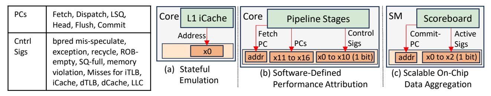
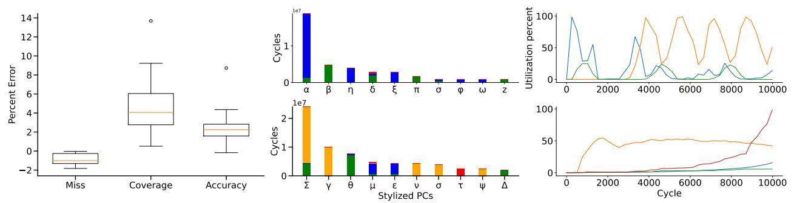
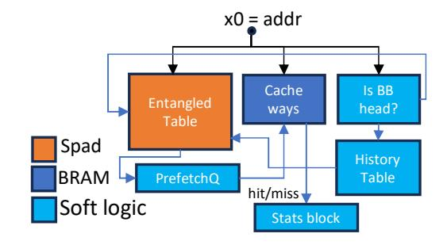
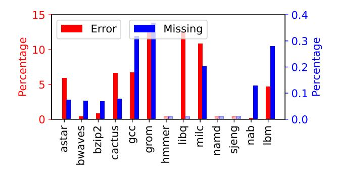
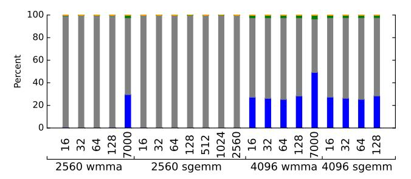
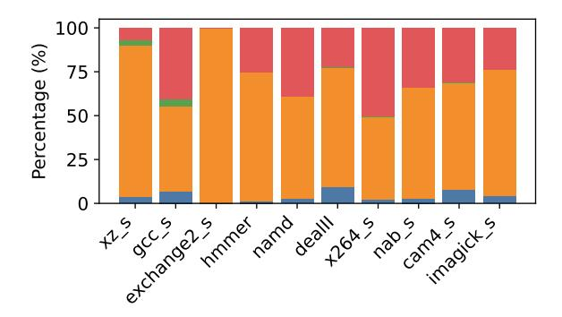

# VI. IPU CAPABILITIES DEMONSTRATION

Having described the IPU architectural and system design, we now demonstrate the power and generality of this single, programmable architecture. The following subsections are not intended to be a collection of disparate point solutions; we are not claiming to have built the world's best prefetcher emulator or performance monitor. Rather, each example is chosen to illustrate a distinct *class of capability* that the IPU's approach makes possible for the first time in a real-time, in-field setting, *with a single hardware design*. We will demonstrate:

- Stateful Emulation: Running complex, history-based algorithms that act at line rate.
- Software-Defined Performance Attribution: Replicating and extending the capabilities of specialized, fixedfunction analysis hardware entirely in software.

- Scalable, On-Chip Data Aggregation: Enabling programmable temporal aggregation, where local, cycle-level analysis allows efficient introspection.
- Real-Time Component-Level Diagnosis: Classifying individual microarchitectural events by their internal root cause at the point of occurrence.

Summarized results. Figure 6 shows which hardware signals are connected to the IPU across three of the designs. Figure 7 depicts a utility result for three of the capability demonstrations. An overview of the interface width, code length, and output characteristics is shown in Table IV. For each capability, we first cover its definition, then the demonstration we picked, details of the implementation - which includes the design of the introspection code, the area and power, and whether any data is dropped and its effects on accuracy if so.

*Across all four capabilities, the IPU enables runtime, signal-level introspection beyond the reach of fixed-function hardware, tracing tools, or other postmortem analysis.*

## *A. Capability 1: Stateful Emulation*

The Capability. The first and most powerful capability we demonstrate is the IPU's ability to execute complex, stateful software in a tight, low-latency situation. This class of task is impossible for existing tools: PMUs are stateless counters, and off-chip trace analysis doesn't run on live deployments.

The Demonstration. To prove this capability, we use the IPU to implement an entangled instruction prefetcher emulator. This task is an ideal illustration, as a prefetcher is a complex, history-based state machine. It must: 1) subscribe to the processor's real-time instruction fetch stream, 2) maintain a complex internal state (e.g., history tables, state transition graphs), and 3) perform computations for every instruction, all without stalling the main processor. The next few paragraphs cover the implementation details.

- ⋆ HIT & Interface. The HIT is the CPU front end block, and we need essentially one data signal - fetch PC being issued by the processor core (depending on the decoupled front-end design, the signal could be different; a virtual or physical address depending on cache design). The analysis is performed over the entire program so no signal is connected to ADDR nor are TS and TE configured.
- ⋆ Introspection Code. Implementing the prefetcher using RISC-V code is too slow as it drops data that is required to maintain correct cache state (a state-machine traversal is

Fig. 6: Demonstration interfaces. (b)PCs and Control Sigs are listed in left-hand table. (c)Active Sigs are for the tensor core, SIMT, and memory subsystem.

(a) Stateful Emulation (b) Software-Defined Performance Attribution (c) Scalable, On-Chip Data Aggregation In the interest of space, the labels for (b) are symbols. In reality they are PC values in the application binary.

Fig. 7: Utility results for three of the demonstrations. (a) Relative error for each metric in prefetch emulation in-silicon across 135 workload traces. (b) TOP-10 PICS for NAB and astar benchmarks, showing instruction contributions to exposed cycles.

Deache miss, Deache miss and LLC miss, Drain-SQ full, Misspeculation (c) Cycle-level GPU utilization over time.

SIMT, Tensor Core, higher level memory, SIMT. Lower graph sorts running average of statistics when the windows are ordered by overall chip utilization.

Fig. 8: Organization of the soft-logic block for prefetcher

branch-heavy code). Instead, we implement it on the soft logic and are able to run at one address per cycle with nearly full eFPGA utilization. The RTL design of the prefetch emulator is shown in Figure 8. Since we cannot inject anything into the HIT, our entangling design assumes that all L1 misses are L2 hits to determine entangling pairs (we measure the error this introduces). The execution of memory requests is still correct under this assumption - it does not change the contents of L1.

 $\star$  **Performance analysis**. The design accumulates coverage, misses, and accuracy counters in hardware and emits them periodically (every  $2^{31}$  cycles to the host) to avoid overflow.

Thus, the traffic to host is minimal.

\* Simulation methodology. In our Champsim testbed we ran 135 CVP traces and compared IPU based prefetch to the original entangled prefetch implementation from the authors. Our results are nearly identical to the results from the original paper, as the only difference is the always-hit-in-L2 assumption, discussed below. To measure error, we compare our statistics to the reference simulation's statistics.

Analysis of approximations. Figure 7(a) shows coverage, accuracy, and miss-rate error across the traces. For each metric, our always-hit-in-L2 assumption leads to better prefetching than actual, outperforming on each statistic by less than 5% on average. In cases where the prefetch stats are high, the initial miss rate was very low (less than 0.25%) so the other prefetch stats are less meaningful. The Figure shows the distribution of errors in terms in min, max, and inner quartile. Note that we don't model cache pollution effects, which our results show has small impact on accuracy.

**Area and Power**. The area of an  $IPU_{pro}$  is 0.22 mm2. In comparison to the CPU reference, this is 0.7% area overhead; power is 20.8 mW, which is around 0.5% of the CPU reference (Section V). On a chip with a single  $IPU_{pro}$  instead of one per core complex, the area and power overheads reduce to 0.175% and 0.125% respectively.

Key Takeaway. We demonstrate that a general-purpose IPU can perform specialized, state-dependent simulation at line rate, in software. This enables inconceivable in-field A/B testing: deploying and profiling prefetcher binaries on live workloads. The contribution is not the prefetcher algorithm, but proof that our general-purpose architecture is fast enough to emulate this complexity—a task previously relegated to offline simulation and impossible on deployed workloads.

## B. Capability 2: Software-Defined Performance Attribution

**The Capability**. The second capability we demonstrate is the IPU's power to replace rigid, specialized, fixed-function hardware with a flexible, software-defined program. Modern processors often include bespoke hardware blocks for specific, high-value analysis tasks, but these blocks are unchangeable and add to the design validation burden.

**The Demonstration**. We demonstrate this capability by implementing a "software-defined PICS" (Per Instruction Cycle Stacks). Hardware like TEA [34] is extremely powerful, as it provides developers with PICS: fine-grained, per-instruction attributions for stall cycles (e.g., L2 miss, TLB miss). Its limitation is its inflexibility; it is a custom hardware block designed to find a specific set of predefined bottlenecks.  $IPU_{lite}$  constructs these stacks using its programmable core as illustrated in Figure 7b. Implementation details follow next.

- \* HIT & Interface. The HIT is the core pipeline of a CPU. Figure 6(b) shows the interface as listed in the left table including Control Sigs, which indicate long-latency events starting in the core. In addition, we have 6 virtual address PC values from 4 parts of the pipeline. To restrict program regions, users set the TS and TE registers with the fetch-PC connected to the ADDR register using the IPU API.
- \* Introspection code. The introspection code has two phases: every cycle we update a Performance Signature Vector (PSV) which is a bit-mask that indicates which event has occurred for a particular dynamic instance of a PC. This follows a sequential if-else-if sequence across all supported hardware events, where if an event occurs in the core pipeline a load-modify-store sequence sets a specific bit of the appropriate PSV to a '1'. If an instruction causes a flush, we store its associated PC value in the IPU's memory, so that we can reference it after it commits. Every 400,000 cycles (TEA paper's design value) we update PICS which correspond to combining the delays of every dynamic instance of a PC into a single entry. The introspection code scans through the active list of PSVs to determine to which PSV we can attribute cycles and sends to the FIFO that PSV (PC + signature).
- \* Performance analysis. 215 bits of data are used every cycle. In the common case (representing more than 75% of the cycles our results and traces we obtained from TEA authors confirm this), no event is triggered when the ROB is sampled (as it isn't stalled/drained). In the other 25% of cycles, typically a single long latency event occurs. Some times 2 or more events occur when the ROB is sampled (very rarely 3 events, and almost never more than that). Outside of the cycles where the ROB is sampled, there are typically 1-3 events in the

Fig. 9: Average of the relative error for the PICS per benchmark in red and percent of total missed cycles in blue. Light red/blue bars indicate zero error or missed cycles, respectively.

processor pipeline which need to be processed, triggering 3-9 instructions of code. The introspection output data volume is a few bytes of PSV data every 400,000 cycles.

\* Simulation methodology. As shown in Table IV, we use a gem5-based simulation. For the SPEC benchmarks, we used SimPoints to simulate representative regions with 100 million instructions per-region. Two example PICS stacks from our 13 applications (all of which we generated the PICS for) are shown in Figure 7(b). For validation of PICS generation, we ran 3 DARCHR microbenchmarks [2] expecting *one* PC to show up in the PICS stack for these microbenchmarks. The resultant PCs are shown below verifying the generation. One PC has a large cycle-count, showing that is primarily responsible for performance stalls.

| PC                                  | Assembly               | kCycles | C Code Line               |  |  |
|-------------------------------------|------------------------|---------|---------------------------|--|--|
| STL2 causes LSQ Full                |                        |         |                           |  |  |
| 4017f6                              | mov %eax,(%rsi,%rdx,1) | 127878  | arr[lfsr].p1=lfsr         |  |  |
| CCH_st causes Branch Misspeculation |                        |         |                           |  |  |
| 401813                              | jne 4017f8             | 177     | if(randArr[i])            |  |  |
| ML2 causes D-Cache Miss             |                        |         |                           |  |  |
| 4017ee                              | mov %eax,(%rsi,%rdx,1) | 58595   | lfsr = lfsr +arr[lfsr].p1 |  |  |

\* Analysis of approximations. This demonstration has the notion of dropped data - if an event is triggered during the PSV generation window of a previous event, we drop that event. Note that IORegs are designed to hold their "old" data (and drop new data) until the IPU reverts back to AP state. To understand the impact of this, we used our simulation testbed to create PICS with simulating introspection code running in 1 cycle vs per-cycle simulation of the introspection (which can take 8 cycles when two events occur in the same cycle). Our error metric is defined as the average relative error (compared to the single-cycle version) of the cycle stack height for each PC for each application. Figure 9 shows this in the red bars. Typically, the quantitative error is < 3%while three applications show 10-14% error. In all scenarios, the list of PCs and the scale of the cycle contributions to PICS was correct, which is most important for performance optimizations. In some very rare scenarios, we drop entire PCs from the PICS stack - when a PC always appears in the

Fig. 10: Breakdown of how use overlaps amongst the three signals collected shown per gemm shape. Blue is all low. Grey is 1 high and 2 low. Green is 2 high and 1 low. The number under each stack is the n and number in groupings is the m and k. wmma or sgemm are the kernels. The leftmost stack is (2560,16,2560) wmma benchmark.

dropped window. The Y-axis shows the percentage of cycles covered by these dropped PC in blue. By definition these are exceedingly rare and unimportant for performance analysis. Across our applications, they cover  $\leq 0.37\%$  of cycles.

**Area and Power**. The IPU $_{lite}$  has an area of 0.019 mm2. Compared to the CPU reference, this is an area overhead of 0.06%. Power consumption is 15.0 mW which is 0.38% of the CPU reference power. On a chip with a single IPU $_{lite}$  instead of one per core complex, the area and power overheads reduce to 0.015% and 0.095% respectively.

Key Takeaway. The IPU successfully generates the same per-instruction breakdown of performance bottlenecks that a dedicated PICS block would. The critical contribution, however, is the demonstration of generality for software-defined performance attribution: moving complex performance attribution from a rigid, pre-silicon design choice to a flexible, post-silicon software task.

## C. Capability 3: Scalable, On-Chip Data Aggregation

**The Capability**. The final capability we demonstrate is the IPU's *programmable temporal aggregation*. This is the ability to process low-level hardware signals every cycle and perform complex analysis on them within flexible, software-defined time windows (e.g., 256 cycles). This class of fine-grained analysis is impossible for existing tools, and is necessary to capture hardware behavior when it is bursty and ephemeral.

**The Demonstration**. We use the IPU to perform a fine-grained utilization analysis of GPU TensorCores. The introspection program groups activity signals into *N*-cycle windows, calculating the percentage of active cycles within each window. This allows it to build a histogram, not of average activity, but of the distribution of these fine-grained temporal behaviors. Aggregate PMUs would report a single, misleading average for the entire kernel, hiding the dynamic, sub-kernel-level activity that our IPU's programmable time-windowing reveals.

\* HIT & Interface. This is a GPU demonstration, with the HIT for the IPU being an SM scoreboard block. The data signals are 3 one-bit signals indicating whether the SIMT core is active, the TC is active, and the L1 cache subsystem

is in a state where it is servicing one or more outstanding requests (MSHRs non-empty status). While GPU hardware is proprietary the performance counters from NVIDIA Nsight Compute CLI (NCU) count aggregates for these signals indicate they are readily available and not disruptive from a design standpoint. Optionally, the virtual address retiring PC is connected to the ADDR register with IPU's software API used to restrict regions of interest. To isolate to a region within a kernel, a PC start and end range be provided to TS and TE. Or, it can run untriggered to capture the full kernel.

- \* Introspection code. The introspection code is a single histogram instruction (optimized with a loop directive) that runs for 256 cycles receiving new data every cycle. The output is 3 bytes every 256 cycles, denoting how many active cycles of that unit, which can also be batched across windows.
- $\star$  **Performance analysis**. Every 256 cycles, we emit three 1-byte values; thus, introspection output data bandwidth is 3 \* 108(#SMs) / 256 bytes per cycle = 1.7 GB/second at 1.4 GHz. With 10 of 108 SMs sampled, the bandwidth reduces to 0.16 GB/second.
- \* Simulation methodology. One representative output is shown in Figure 7(c). The top half shows chronologically ordered windows of 256 cycles with the Y-axis denoting % of cycles in that window where that signal was active. We can see the mutually exclusive behavior. The bottom graph shows the same data ordered by increasing utilization where it plots the running average for each signal. Figure 10 post processes this data and presents it in a different way. We classify windows of 256-cycles into 4 bins: 2 signals high (green), one signals high (blue), all signals low (grey). 'High' means a component is used in greater than 25% the cycles in that window, and 'low' means in less than 25% of the cycles. We can see that large portions of time are spent with at least one component of the SM being idle - pointing to further hardware optimization beyond directions like TMA [56] that have appeared. Other work has also looked at improving such utilization [9], [81].

**Analysis of approximations.** This demonstration uses our histogram instruction in a novel way, essentially treating each signal as its own bucket and builds a 3-bucket histogram. Hence we have very little dropped data - the source of error is the few cycles needed at the end of a window to write 3 bytes of accumulated statistics.

**Area and Power**. The IPU $_{lite}$  has an area of 0.019 mm2 that is 0.6% of the area of the GPU reference. This demonstration consumes 4.7 mW of power. The IPU $_{lite}$  power overhead is around 0.5% of GPU reference. If instead the chip designer included only one IPU $_{lite}$  on the chip, the area and power overheads are 0.003% and 0.004% respectively.

Key Takeaway. This "computational introspection" approach effectively breaks the data-scaling barrier. The IPU's ability to be programmed with arbitrary aggregation logic (e.g., "compute histogram," "find average," "report max contention") is the key. It moves the bottleneck from data transfer to local computation, enabling fine-grained, real-time observability.

Fig. 11: Each bar represents a breakdown of root-cause classification across all L1D cache misses for a trace. Blue: cold region, Orange: no learned pattern. Green: late prefetch. Red: prefetch failure.

## D. Capability 4: Real-Time Component-Level Diagnosis

The Capability. The fourth capability we demonstrate is the IPU's ability to perform real-time, per-event root-cause diagnosis of microarchitectural component failures. Unlike aggregate counters that report how often a component fails, the IPU classifies why each failure occurred by tapping the component's internal decision-point signals. The IPU brings this diagnostic capability to silicon on deployed workloads without requiring specialized hardware.

The Demonstration. We demonstrate this capability by attaching an IPUlite to the L1 data cache and its prefetcher (we use the Gaze spatial prefetcher [14]). On each demand miss, the IPU classifies the miss into one of four root-cause categories by observing prefetcher-internal decision-point signals. The resulting per-miss, per-PC failure-mode distribution is unavailable from any existing production tool; PMUs report only aggregates, and sampling tools like PEBS lack visibility into prefetcher-internal state.

- \* HIT & Interface. The HIT is the L1 data cache and prefetcher complex. The data signals consist of the demand miss indicator (1 bit), the Accumulation Table (AT) hit signal (1 bit), the missed\_in\_pt flag indicating whether the Pattern History Table (PHT) contained a pattern at region graduation time (1 bit), and the MSHR prefetch-in-flight status (1 bit). The demand miss virtual address and PC are delivered via the address bus from the LSQ. To restrict analysis to a region of interest, the user sets the TS and TE registers with the LSQ-PC connected to the ADDR register using the IPU API.
- \* **Performance analysis**. The output is a compact histogram of failure-mode counts per PC, emitted periodically to the host. At four categories per PC, the introspection output data volume is a few hundred bytes per reporting interval, imposing negligible host traffic.
- \* Simulation methodology. We use ChampSim with the Gaze authors' implementation. We ran 189 Spec benchmark traces and logged the prefetcher's internal decision-path signals on each demand access. An offline analysis script faithfully models the IPU's processing latency and classifies each miss,

simulating dropped data that would occur when miss events arrive faster than the 20-cycle processing window. To measure error, we compare the failure-mode distributions with and without the dropped-data constraint. Representative output generated across ten of the traces are shown in Figure 11. For hardware designers, a workload dominated by "no learned pattern" failures points to insufficient PHT capacity or overly conservative training triggers, whereas one dominated by "late prefetch" indicts memory scheduling latency or lookahead distance — two fundamentally different microarchitectural investments that aggregate miss counters cannot distinguish. Programs with a substantial "prefetch failure" fraction, such as x264\_s in Figure 11, suggest cache pressure is evicting prefetched data before it is consumed. This is a signal that cache sizing, replacement policy, or prefetch throttling warrant redesign. For software developers, PCs flagged as "cold region" or "no learned pattern" are prime candidates for explicit prefetch hints, since no hardware prefetch is in flight to coalesce with — actionable guidance that no existing production tool provides. Finally, deploying the same introspection binary across a fleet can reveal that the dominant failure mode in production diverges from what design-time benchmarks predicted.

- \* Analysis of approximations. The primary source of approximation is dropped data: demand misses that arrive within 20 cycles of the previous miss. However, L1D miss events are infrequent relative to the IPU's processing budget. With the Gaze prefetcher active, the residual miss rate is low, and consecutive misses separated by fewer than 20 cycles are rare. The average error in category proportions per-trace is less than 3.5% with a median of 2.46%, confirming that the processing rate is well matched to the event rate.
- $\star$  **Area and Power**. Like the TEA case study, we use an IPUlite, with the analytics code behavior being similar (scratchpad reads and RISC-V instructions), thus resulting in area and power of 0.019  $mm^2$  and 15mW.

**Key Takeaway**. The IPU brings per-miss, per-PC failure-mode diagnosis to deployed silicon, enabling iterative, reprogrammable investigation without a new tape-out. The contribution is not the classification algorithm, but closing the observability gap between simulation and production.

## E. Comparison with Existing Mechanisms

Across all four capabilities, the IPU enables runtime, signal-level introspection beyond the reach of fixed-function hardware, tracing tools, or other postmortem analysis. In the first, the IPU emulates a candidate prefetcher via custom logic triggered on memory accesses—something not possible with commercial tools like Intel PCM, CUPTI, or CoreSight, which lack in-field programmable logic. While LBA [12], [13] is conceptually similar, it lacks the programmability and hardware efficiency of IPU. In the TEA case, performance counters cannot implement Time-Proportional Event Analysis (TEA) [34], which underpins PICS. Unlike prior work requiring dedicated RTL for RISC-V BOOM, our IPU replicates TEA without RTL changes and with greater flexibility. The

| Yr                         | Technique                       | S | P | T | A |  |
|----------------------------|---------------------------------|---|---|---|---|--|
|                            | General Approaches              |   |   |   |   |  |
| –                          | SW profiling                    | N | N | N | Y |  |
| –                          | Perf counters                   | Y | N | p | Y |  |
| –                          | Debug monitors                  | Y | N | Y | N |  |
| –                          | HW emulation                    | N | Y | Y | N |  |
| –                          | RTL simulation                  | N | Y | Y | N |  |
|                            | Security                        |   |   |   |   |  |
| '03                        | DISE [17]                       | N | p | N | N |  |
| '10                        | FlexCore [25]                   | Y | p | Y | N |  |
| '11                        | LBA [12], [13]                  | N | Y | N | N |  |
| '20                        | PHMon/Nile [23], [24]           | Y | p | N | N |  |
|                            | Embedded Systems                |   |   |   |   |  |
| '101                       | ABACUS3 [27], [48], [69]     | Y | p | N | Y |  |
| '13                        | hidICE Verification [7]         | Y | Y | N | N |  |
| '15                        | SOF [41], [42]                  | Y | N | p | N |  |
| '161                       | AIPHS2 [51], [73], [74]      | Y | N | p | Y |  |
| '17                        | Enhanced PMU2 [66]           | Y | N | p | Y |  |
| '18                        | NIRM [68]                       | Y | N | N | N |  |
| Profiling and PerfMonitors |                                 |   |   |   |   |  |
| '01                        | Programmable Co-Proc [52], [82] | Y | Y | p | N |  |
| '01                        | Stratified Sampling [65]        | N | Y | p | N |  |
| '03                        | ULF [80]                        | p | Y | N | N |  |
| '03                        | Interval Based Profiling [53]   | N | Y | p | N |  |
| '05                        | Owl [67]                        | N | p | Y | Y |  |
| '25                        | IPU (ours)                      | Y | Y | Y | Y |  |

1Year of most relevant work 2Limited to manipulating event counts

TABLE V: Related work in our 4-axes taxonomy. S (Speed); P (Programmability); A (Accessibility); T (HW Transparency)

IPU can also build histograms of fine-grained, cycle-level signal states, which are impractical to obtain via simulation, emulation, or debug monitors due to visibility limits or high overheads. Finally, the IPU classifies each demand miss by its prefetcher-internal root cause—a per-event, per-PC diagnosis that neither PMUs nor sampling tools can provide.

## VII. RELATED WORK

We define a four-attribute taxonomy to classify hardware introspection (Table V): Speed (line-rate, non-disruptive execution); Transparency (visibility, from coarse counters to finegrained microarchitectural behavior); Programmability (flexible, post-fabrication analysis, not fixed-function queries). Finally, Accessibility measures how readily a solution can be used by both hardware and software developers, especially for in-field deployment. It gauges the ability to gain actionable insights without being obstructed by hardware constraints or proprietary software bottlenecks, ensuring the technique is broadly and practically available to all stakeholders. Prior works' trade-offs create a capability gap, which the IPU fills.

*Software profiling* tools (strace, gprof, binary instrumentation) lack hardware transparency and scale poorly with introspection complexity. *Performance counters* offer speed but are restricted to pre-defined events with no support for stateful emulation (Table VI). PGO techniques [10], [11], [22], [35], [43], [45], [50], [54], [61], [62], [78], Top Down Analysis [76], [79], and Intel PT [36] improve optimization but address only part of the opacity problem. *Debug monitors* [37] (JTAG, boundary-scan) offer deeper access but require physical connections and cannot efficiently capture live

| Feature           | CoreSight   | Intel PT/PMU | IPU        |
|-------------------|-------------|--------------|------------|
| Granularity       | Trace-level | Event/sample | Per-signal |
| Programmable      | No          | Configurable | Full       |
| Control interface | Hardwired   | MSRs         | API        |

TABLE VI: IPU vs. existing introspection mechanisms

execution. *HW emulation* (Cadence Palladium [59], Synopsys Zebu [60]) provides full transparency but costs millions and runs at 2–5× slowdown; RTL and cycle-level simulation are orders-of-magnitude slower still.

Prior academic work falls into three categories, none achieving the IPU's combination of speed, programmability, transparency, and accessibility. Security-oriented approaches (DISE [17], FlexCore [25], LBA [12], [13], PHMon/Nile [23], [24]) run at-speed but eschew programmability and transparency. Embedded systems techniques (ABACUS [27], [48], [69], hidICE [7], SOF [41], [42], AIPHS [51], [73], [74], Enhanced PMU [66], NIRM [68]) assume direct hardware access, lacking accessibility and programmability. Performance counter and profiling techniques [47], [53], [65], [67], [77], [80] lack hardware transparency. Owl [67] proposed FPGA monitoring but was limited to pre-defined analytics, while Profiling Co-Processors [52], [82] lacked fine-grained transparency beyond instruction retirement signals. Our work builds upon these ideas, leveraging the RISC-V ecosystem, modern accelerator design [30], [72], and specialization principles [20], [30], [55] to deliver a hybrid architecture that spans all four axes.

## VIII. CONCLUSION

This paper introduced the Introspection Processing Unit (IPU), a new architectural primitive designed to solve a fundamental "capability gap" in hardware observability—the gap between inflexible, low-overhead PMUs and high-overhead, post-mortem trace solutions. Our core contribution is the IPU's novel hybrid microarchitecture, which pairs a programmable RISC-V core with judiciously chosen extensions and small hardware accelerators. We demonstrated this architecture's power not by solving individual problems, but by showing it can perform entire *classes of analysis* previously intractable in the field, including stateful emulation, software-defined performance attribution, scalable on-chip data aggregation, and real-time component-level diagnosis. Our complete RTL-level prototype proves this new capability is practical, adding < 1% in area and consuming < 25mW.

## ACKNOWLEDGMENTS

Support for this research was provided by the University of Wisconsin - Madison Office of the Vice Chancellor for Research with funding from the Wisconsin Alumni Research Foundation.

## REFERENCES

- [1] "ios app signing. https://help.apple.com/pdf/security/en US/appleplatform-security-guide.pdf."
- [2] "microbench. https://github.com/darchr/microbench."
- [3] "Tdp and power draw: No real surprises https://www.anandtech.com/ show/16214/amd-zen-3-ryzen-deep-dive-review-5950x-5900x-5800xand-5700x-tested/8."

3Limited to architectural traces. p means partial.

- [4] "Android app signing. https://developer.android.com/studio/publish/appsigning."
- [5] ARM Ltd., "Fixed Virtual Platforms (FVP)," https://developer.arm.com/ Tools%20and%20Software/Fixed%20Virtual%20Platforms, 2025, accessed: 2025.
- [6] Autodesk, "Tinkercad Circuits: Arduino Simulator," https://www. tinkercad.com/circuits, 2025, accessed: 2025.
- [7] R. Backasch, C. Hochberger, A. Weiss, M. Leucker, and R. Lasslop, "Runtime verification for multicore soc with high-quality trace data," *ACM Transactions on Design Automation of Electronic Systems (TO-DAES)*, vol. 18, no. 2, pp. 1–26, 2013.
- [8] N. Binkert, B. Beckmann, G. Black, S. K. Reinhardt, A. Saidi, A. Basu, J. Hestness, D. R. Hower, T. Krishna, S. Sardashti, R. Sen, K. Sewell, M. Shoaib, N. Vaish, M. D. Hill, and D. A. Wood, "The gem5 simulator," *SIGARCH Comput. Archit. News*, vol. 39, no. 2, p. 1–7, aug 2011. [Online]. Available: https://doi.org/10.1145/2024716.2024718
- [9] B. Chen, H. Zhao, W. Cui, Y. He, S. Zhang, Q. Chen, Z. Li, and M. Guo, "Maximizing the utilization of gpus used by cloud gaming through adaptive co-location with combo," in *Proceedings of the 2023 ACM Symposium on Cloud Computing*, ser. SoCC '23. New York, NY, USA: Association for Computing Machinery, 2023, p. 265–280. [Online]. Available: https://doi.org/10.1145/3620678.3624660
- [10] D. Chen, D. X. Li, and T. Moseley, "Autofdo: Automatic feedbackdirected optimization for warehouse-scale applications," in *Proceedings of the 2016 International Symposium on Code Generation and Optimization*, 2016, pp. 12–23.
- [11] D. Chen, N. Vachharajani, R. Hundt, S.-w. Liao, V. Ramasamy, P. Yuan, W. Chen, and W. Zheng, "Taming hardware event samples for fdo compilation," in *Proceedings of the 8th annual IEEE/ACM international symposium on Code generation and optimization*, 2010, pp. 42–52.
- [12] S. Chen, P. B. Gibbons, M. Kozuch, and T. C. Mowry, "Log-based architectures: Using multicore to help software behave correctly," *SIGOPS Oper. Syst. Rev.*, vol. 45, no. 1, p. 84–91, feb 2011. [Online]. Available: https://doi-org.ezproxy.library.wisc.edu/10.1145/ 1945023.1945034
- [13] S. Chen, M. Kozuch, P. B. Gibbons, M. Ryan, T. Strigkos, T. C. Mowry, O. Ruwase, E. Vlachos, B. Falsafi, and V. Ramachandran, "Flexible hardware acceleration for instruction-grain lifeguards," *IEEE Micro*, vol. 29, no. 1, p. 62–72, jan 2009. [Online]. Available: https://doi.org/10.1109/MM.2009.6
- [14] Z. Chen, C. Wu, Y. Gu, R. Jia, J. Li, and M. Guo, "Gaze into the pattern: Characterizing spatial patterns with internal temporal correlations for hardware prefetching," in *2025 IEEE International Symposium on High Performance Computer Architecture (HPCA)*, 2025, pp. 173–187.
- [15] A. Cheu1(B), A. Smith, J. Ullman1, D. Zeber3, and M. Zhilyaev, "Distributed differential privacy via shuffling," in *Proceedings of Eurocrypt*, 2019.
- [16] L. T. Clark, V. Vashishtha, L. Shifren, A. Gujja, S. Sinha, B. Cline, C. Ramamurthy, and G. Yeric, "Asap7: A 7-nm finfet predictive process design kit," *Microelectronics Journal*, vol. 53, pp. 105–115, 2016. [Online]. Available: https://www.sciencedirect.com/science/article/pii/ S002626921630026X
- [17] M. Corliss, E. Lewis, and A. Roth, "Dise: a programmable macro engine for customizing applications," in *30th Annual International Symposium on Computer Architecture, 2003. Proceedings.*, 2003, pp. 362–373.
- [18] G. Cormode, S. Jha, T. Kulkarni, N. Li, D. Srivastava, and T. Wang, "Privacy at scale: Local differential privacy in practice," in *Proceedings of the 2018 International Conference on Management of Data*, 2018, pp. 1655–1658.
- [19] "Championship value prediction. https://microarch.org/cvp1/."
- [20] W. J. Dally, Y. Turakhia, and S. Han, "Domain-specific hardware accelerators," *Commun. ACM*, vol. 63, no. 7, p. 48–57, jun 2020. [Online]. Available: https://doi-org.ezproxy.library.wisc.edu/10. 1145/3361682
- [21] D. Dangwal, W. Cui, J. McMahan, and T. Sherwood, "Safer program behavior sharing through trace wringing," in *Proceedings of the Twenty-Fourth International Conference on Architectural Support for Programming Languages and Operating Systems*, ser. ASPLOS '19. New York, NY, USA: Association for Computing Machinery, 2019, p. 1059–1072. [Online]. Available: https://doi.org/10.1145/3297858. 3304074
- [22] J. Dean, J. E. Hicks, C. A. Waldspurger, W. E. Weihl, and G. Chrysos, "Profileme: Hardware support for instruction-level profiling on out-of-

- order processors," in *Proceedings of 30th Annual International Symposium on Microarchitecture*. IEEE, 1997, pp. 292–302.
- [23] L. Delshadtehrani, S. Canakci, B. Zhou, S. Eldridge, A. Joshi, and M. Egele, "PHMon: A programmable hardware monitor and its security use cases," in *29th USENIX Security Symposium (USENIX Security 20)*. USENIX Association, Aug. 2020, pp. 807–824. [Online]. Available: https://www.usenix.org/conference/ usenixsecurity20/presentation/delshadtehrani
- [24] L. Delshadtehrani, S. Eldridge, S. Canakci, M. Egele, and A. Joshi, "Nile: A programmable monitoring coprocessor," *IEEE Computer Architecture Letters*, vol. 17, no. 1, pp. 92–95, 2018.
- [25] D. Y. Deng, D. Lo, G. Malysa, S. Schneider, and G. E. Suh, "Flexible and efficient instruction-grained run-time monitoring using on-chip reconfigurable fabric," in *2010 43rd Annual IEEE/ACM International Symposium on Microarchitecture*, 2010, pp. 137–148.
- [26] R. Desikan, D. Burger, and S. W. Keckler, "Measuring experimental error in microprocessor simulation," in *Proceedings of the 2001 Symposium on Software Reusability: Putting Software Reuse in Context*, ser. SSR '01. New York, NY, USA: Association for Computing Machinery, 2001, p. 266–277. [Online]. Available: https: //doi.org/10.1145/375212.379271
- [27] N. C. Doyle, E. Matthews, G. Holland, A. Fedorova, and L. Shannon, "Performance impacts and limitations of hardware memory access trace collection," in *Design, Automation & Test in Europe Conference & Exhibition (DATE), 2017*. IEEE, 2017, pp. 506–511.
- [28] U. Erlingsson, V. Pihur, and A. Korolova, "Rappor: Randomized aggregatable privacy-preserving ordinal response," in *Proceedings of CCS 2014*, 2014.
- [29] L. Foundation. [Online]. Available: https://perf.wiki.kernel.org/index. php/Main Page
- [30] A. Fuchs and D. Wentzlaff, "The accelerator wall: Limits of chip specialization," in *2019 IEEE International Symposium on High Performance Computer Architecture (HPCA)*, 2019, pp. 1–14.
- [31] B. Ghazi, P. Manurangsi, P. Kamath, and R. K. Ravikumar, "Anonymized histograms in intermediate privacy models," in *NeurIPS 2022*, 2022.
- [32] N. Gober, G. Chacon, L. Wang, P. V. Gratz, D. A. Jimenez, E. Teran, ´ S. H. Pugsley, and J. Kim, "The championship simulator: Architectural simulation for education and competition," *ArXiv*, vol. abs/2210.14324, 2022. [Online]. Available: https://api.semanticscholar.org/CorpusID: 253117130
- [33] B. Gottschall, L. Eeckhout, and M. Jahre, "Tip: Time-proportional instruction profiling," in *MICRO-54: 54th Annual IEEE/ACM International Symposium on Microarchitecture*, ser. MICRO '21. New York, NY, USA: Association for Computing Machinery, 2021, p. 15–27. [Online]. Available: https://doi.org/10.1145/3466752.3480058
- [34] B. Gottschall, L. Eeckhout, and M. Jahre, "Tea: Time-proportional event analysis," in *Proceedings of the 50th Annual International Symposium on Computer Architecture*, ser. ISCA '23. New York, NY, USA: Association for Computing Machinery, 2023. [Online]. Available: https://doi.org/10.1145/3579371.3589058
- [35] W. He, H. Yu, L. Wang, and T. Oh, "Revamping sampling-based pgo with context-sensitivity and pseudo-instrumentation," in *2024 IEEE/ACM International Symposium on Code Generation and Optimization (CGO)*, 2024, pp. 322–333.
- [36] Intel, "Hardware-based profile guided optimization (pgo) from intel https://www.intel.com/content/www/us/en/developer/articles/technical/ hwpgo.html," 2024.
- [37] "Tutorial: The role of jtag in system debug & test throughout the embedded system development lifecycle. https://www.embedded.com/tutorial-the-role-of-jtag-in-system-debugtest-throughout-the-embedded-system-development-lifecycle/."
- [38] V. Kandiah, S. Peverelle, M. Khairy, J. Pan, A. Manjunath, T. G. Rogers, T. M. Aamodt, and N. Hardavellas, "Accelwattch: A power modeling framework for modern gpus," in *MICRO-54: 54th Annual IEEE/ACM International Symposium on Microarchitecture*, 2021, pp. 738–753.
- [39] M. Khairy, Z. Shen, T. M. Aamodt, and T. G. Rogers, "Accel-sim: An extensible simulation framework for validated gpu modeling," in *2020 ACM/IEEE 47th Annual International Symposium on Computer Architecture (ISCA)*, 2020, pp. 473–486.
- [40] D. Koch, N. Dao, B. Healy, J. Yu, and A. Attwood, "Fabulous: An embedded fpga framework," in *The 2021 ACM/SIGDA International Symposium on Field-Programmable Gate Arrays*, ser. FPGA '21. New York, NY, USA: Association for Computing Machinery, 2021, p. 45–56. [Online]. Available: https://doi.org/10.1145/3431920.3439302

- [41] J. C. Lee, F. Kouteib, and R. Lysecky, "Event-driven framework for configurable runtime system observability for soc designs," in *2012 IEEE International Test Conference*. IEEE, 2012, pp. 1–10.
- [42] J. C. Lee and R. Lysecky, "System-level observation framework for nonintrusive runtime monitoring of embedded systems," *ACM Transactions on Design Automation of Electronic Systems (TODAES)*, vol. 20, no. 3, pp. 1–27, 2015.
- [43] R. Levin, I. Newman, and G. Haber, "Complementing missing and inaccurate profiling using a minimum cost circulation algorithm," in *High Performance Embedded Architectures and Compilers: Third International Conference, HiPEAC 2008, Goteborg, Sweden, January 27-29, ¨ 2008. Proceedings 3*. Springer, 2008, pp. 291–304.
- [44] Y. Lindell, "Secure multiparty computation (mpc)," Cryptology ePrint Archive, Paper 2020/300, 2020, https://eprint.iacr.org/2020/300. [Online]. Available: https://eprint.iacr.org/2020/300
- [45] X. Liu, Y. Peng, and J. Zhang, "A sample profile-based optimization method with better precision," in *Proc. Int. Conf. Artif. Intell. Comput. Sci*, 2016, pp. 340–346.
- [46] Locuza, "Nvidia's ada lineup, configurations, estimated die sizes and a comparison with other chips https://locuza.substack.com/p/nvidias-adalineup-configurations."
- [47] Y. Lv, B. Sun, Q. Luo, J. Wang, Z. Yu, and X. Qian, "Counterminer: Mining big performance data from hardware counters," in *2018 51st Annual IEEE/ACM International Symposium on Microarchitecture (MI-CRO)*, 2018, pp. 613–626.
- [48] E. Matthews, L. Shannon, and A. Fedorova, "A configurable framework for investigating workload execution," in *2010 International Conference on Field-Programmable Technology*. IEEE, 2010, pp. 409–412.
- [49] J. McMahan, M. Christensen, K. Dewey, B. Hardekopf, and T. Sherwood, "Bouncer: Static program analysis in hardware," in *2019 ACM/IEEE 46th Annual International Symposium on Computer Architecture (ISCA)*, 2019, pp. 711–722.
- [50] M. C. Merten, A. R. Trick, C. N. George, J. C. Gyllenhaal, and W.-m. W. Hwu, "A hardware-driven profiling scheme for identifying program hot spots to support runtime optimization," in *Proceedings of the 26th annual international symposium on Computer architecture*, 1999, pp. 136–147.
- [51] A. Moro, F. Federici, G. Valente, L. Pomante, M. Faccio, and V. Muttillo, "Hardware performance sniffers for embedded systems profiling," in *2015 12th International Workshop on Intelligent Solutions in Embedded Systems (WISES)*. IEEE, 2015, pp. 29–34.
- [52] S. Mysore, B. Agrawal, N. Srivastava, S.-C. Lin, K. Banerjee, and T. Sherwood, "Introspective 3d chips," *SIGOPS Oper. Syst. Rev.*, vol. 40, no. 5, p. 264–273, oct 2006. [Online]. Available: https://doi.org/10.1145/1168917.1168890
- [53] S. Narayanasamy, T. Sherwood, S. Sair, B. Calder, and G. Varghese, "Catching accurate profiles in hardware," in *The Ninth International Symposium on High-Performance Computer Architecture, 2003. HPCA-9 2003. Proceedings.* IEEE, 2003, pp. 269–280.
- [54] D. Novillo, "Samplepgo-the power of profile guided optimizations without the usability burden," in *2014 LLVM Compiler Infrastructure in HPC*. IEEE, 2014, pp. 22–28.
- [55] T. Nowatzki, V. Gangadhan, K. Sankaralingam, and G. Wright, "Pushing the limits of accelerator efficiency while retaining programmability," in *2016 IEEE International Symposium on High Performance Computer Architecture (HPCA)*. IEEE, 2016, pp. 27–39.
- [56] NVIDIA, "Nvidia hopper architecture in-depth.https://developer.nvidia. com/blog/nvidia-hopper-architecture-in-depth/."
- [57] NVIDIA, "Overview of nvtx. https://docs.nvidia.com/nvtx/overview/ index.html."
- [58] NVIDIA Corporation, "NVIDIA Hopper Architecture In-Depth," https:// resources.nvidia.com/en-us-gtc-2022/nvidia-hopper-architecture, 2022, gTC 2022 Talk S41455.
- [59] "Palladium emulation. high-performance hardware verification and debug of complex socs and systems. https://www.cadence.com/ en US/home/tools/system-design-and-verification/emulation-andprototyping/palladium.html."
- [60] "Synopsys zebu emulation. the industry's fastest emulation systems https://www.synopsys.com/verification/emulation.html."
- [61] V. Ramasamy, P. Yuan, D. Chen, and R. Hundt, "Feedback-directed optimizations in gcc with estimated edge profiles from hardware event sampling," in *Proceedings of GCC Summit*. Citeseer, 2008, pp. 87–102.
- [62] G. Ren, E. Tune, T. Moseley, Y. Shi, S. Rus, and R. Hundt, "Google-wide profiling: A continuous profiling infrastructure for

- data centers," *IEEE Micro*, pp. 65–79, 2010. [Online]. Available: http://www.computer.org/portal/web/csdl/doi/10.1109/MM.2010.68
- [63] A. Ros and A. Jimborean, "A cost-effective entangling prefetcher for instructions," in *2021 ACM/IEEE 48th Annual International Symposium on Computer Architecture (ISCA)*, 2021, pp. 99–111.
- [64] K. Sankaralingam, "Computer architecture's alphazero moment: Automated discovery in an encircled world," *arXiv preprint arXiv:2604.03312*, 2026.
- [65] S. S. Sastry, R. Bodik, and J. E. Smith, "Rapid profiling via stratified sampling," *ACM SIGARCH Computer Architecture News*, vol. 29, no. 2, pp. 278–289, 2001.
- [66] T. Scheipel, F. Mauroner, and M. Baunach, "System-aware performance monitoring unit for risc-v architectures," in *2017 Euromicro Conference on Digital System Design (DSD)*. IEEE, 2017, pp. 86–93.
- [67] M. Schulz, B. S. White, S. A. McKee, H.-H. S. Lee, and J. Jeitner, "Owl: Next generation system monitoring," in *Proceedings of the 2nd Conference on Computing Frontiers*, ser. CF '05. New York, NY, USA: Association for Computing Machinery, 2005, p. 116–124. [Online]. Available: https://doi.org/10.1145/1062261.1062284
- [68] M. Seo and R. Lysecky, "Non-intrusive in-situ requirements monitoring of embedded system," *ACM Transactions on Design Automation of Electronic Systems (TODAES)*, vol. 23, no. 5, pp. 1–27, 2018.
- [69] L. Shannon, E. Matthews, N. Doyle, and A. Fedorova, "Performance monitoring for multicore embedded computing systems on fpgas," *arXiv preprint arXiv:1508.07126*, 2015.
- [70] T. Singh, S. Rangarajan, D. John, R. Schreiber, S. Oliver, R. Seahra, and A. Schaefer, "2.1 zen 2: The amd 7nm energy-efficient high-performance x86-64 microprocessor core," in *2020 IEEE International Solid- State Circuits Conference - (ISSCC)*, 2020, pp. 42–44.
- [71] A. Stillmaker and B. Baas, "Scaling equations for the accurate prediction of CMOS device performance from 180 nm to 7 nm," *Integration*, vol. 58, pp. 74–81, Jun. 2017. [Online]. Available: https://linkinghub.elsevier.com/retrieve/pii/S0167926017300755
- [72] M. B. Taylor, L. Vega, M. Khazraee, I. Magaki, S. Davidson, and D. Richmond, "Asic clouds: specializing the datacenter for planet-scale applications," *Commun. ACM*, vol. 63, no. 7, p. 103–109, Jun. 2020. [Online]. Available: https://doi.org/10.1145/3399734
- [73] G. Valente, T. Fanni, C. Sau, T. D. Mascio, L. Pomante, and F. Palumbo, "A composable monitoring system for heterogeneous embedded platforms," *ACM Transactions on Embedded Computing Systems (TECS)*, vol. 20, no. 5, pp. 1–34, 2021.
- [74] G. Valente, V. Muttillo, L. Pomante, F. Federici, M. Faccio, A. Moro, S. Ferri, and C. Tieri, "A flexible profiling sub-system for reconfigurable logic architectures," in *2016 24th Euromicro International Conference on Parallel, Distributed, and Network-Based Processing (PDP)*. IEEE, 2016, pp. 373–376.
- [75] T. Wang, J. Blocki, N. Li, and S. Jha, "Locally differentially private protocols for frequency estimation," in *Proceedings of the 26th USENIX Security Symposium*, 2017.
- [76] M. E. Weingarten, M. Grieco, S. Edwards, and T. A. Khan, "Icicle: Open-source hardware support for top-down microarchitectural analysis on risc-v," in *2025 IEEE International Symposium on Workload Characterization (IISWC)*, 2025, pp. 464–477.
- [77] P. E. West, Y. Peress, G. S. Tyson, and S. A. McKee, "Core monitors: monitoring performance in multicore processors," in *Proceedings of the 6th ACM conference on Computing frontiers*, 2009, pp. 31–40.
- [78] B. Wicht, R. A. Vitillo, D. Chen, and D. Levinthal, "Hardware counted profile-guided optimization," *arXiv preprint arXiv:1411.6361*, 2014.
- [79] A. Yasin, "A top-down method for performance analysis and counters architecture," in *2014 IEEE International Symposium on Performance Analysis of Systems and Software (ISPASS)*, 2014, pp. 35–44.
- [80] M. Zhang, X. He, and Q. Yang, "A unified, low-overhead framework to support continuous profiling and optimization," in *Conference Proceedings of the 2003 IEEE International Performance, Computing, and Communications Conference, 2003.* IEEE, 2003, pp. 327–334.
- [81] H. Zhao, W. Cui, Q. Chen, J. Zhao, J. Leng, and M. Guo, "Exploiting intra-sm parallelism in gpus via persistent and elastic blocks," in *2021 IEEE 39th International Conference on Computer Design (ICCD)*, 2021, pp. 290–298.
- [82] C. Zilles and G. Sohi, "A programmable co-processor for profiling," in *Proceedings HPCA Seventh International Symposium on High-Performance Computer Architecture*, 2001, pp. 241–252.

[83] M. Spe ˇ ˇtko, O. Vysocky, B. Jans ´ ´ık, and L. Rˇ´ıha, "Dgx-a100 face to face dgx-2—performance, power and thermal behavior evaluation," *Energies*, vol. 14, no. 2, 2021. [Online]. Available: https://www.mdpi.com/1996-1073/14/2/376