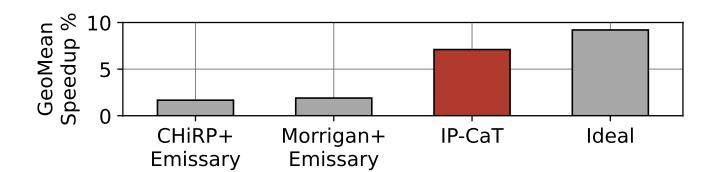

# Enhancing Instruction Prefetching via Cache and TLB Management

Alexandre Valentin Jamet\* alexandre.jamet@bsc.es

Georgios Vavouliotis† georgios.vavouliotis@huawei.com

Martí Torrents\* marti.torrents@bsc.es

Dimitrios Chasapis\* dimitrios.chasapis@bsc.es

Marc Casas\* marc.casas@bsc.es

\*Barcelona Supercomputing Center †Computing Systems Lab, Huawei Technologies AG, Switzerland

Abstract—Modern server workloads have massive instruction footprints, exacerbating pressure on the processor front-end, and making techniques like L1 instruction (L1I) prefetching essential to alleviate this bottleneck. Although L1I prefetchers deliver significant performance gains, their full potential remains underutilized due to two main factors: i) L1I prefetch requests that cross page boundaries require address translation before being issued, and the latency involved in retrieving these translations undermines the timeliness of the L1I prefetches; ii) the reuse potential of code lines fetched in the cache hierarchy by L1I prefetches is highly variable—while a few lines are accessed multiple times, many are dead-on-arrival.

This paper proposes the *Instruction Prefetch Centric Cache* and *TLB Management (IP-CaT)*, a microarchitectural scheme orchestrating TLB and cache management to maximize the benefits of L1I prefetching. IP-CaT comprises two modules: i) the *translation Prefetch Buffer (tPB)*, a small buffer located alongside the last-level TLB (sTLB) that accommodates translations fetched by L1I page-cross prefetches to reduce the address translation cost of L1I prefetching and ii) the *Trimodal Instruction Prefetch Replacement Policy (TIPRP)*, a decision-tree based replacement policy for the L2 cache (L2C) specialized in the management of lines fetched by L1I prefetches.

Our evaluation shows that IP-CaT delivers significant performance benefits when integrated with three state-of-the-art L1I prefetchers (EPI [1], FNL+MMA [2], Barça [3]). For example, IP-CaT+EPI achieves a 6.1% geomean speedup over EPI across a set of 105 contemporary server workloads. We also show that IP-CaT outperforms the state-of-the-art instruction TLB prefetcher [4], the leading TLB replacement policy [5], and codeaware, prefetch-aware, and general-purpose cache replacement policies (Emissary [6], SHiP++ [7], Mockingjay [8]).

Index Terms—virtual memory, address translation, instruction prefetching, cache management, replacement policy

#### I. INTRODUCTION

Contemporary server workloads feature massive instruction memory footprints. Prior studies [9], [10] reveal significant yearly growth in memory instruction footprints of these workloads, sometimes reaching up to 30%. Although CPU vendors progressively increase the capacity of key front-end structures such as the L1 instruction cache (L1I) and the Translation Lookaside Buffer (TLB) [11], these enhancements lag behind the rapid expansion of instruction working sets of server workloads [10], [12]. Consequently, the processor front-end faces increasing pressure, with frequent L1I misses stalling instruction fetching and degrading performance. In this

Fig. 1: Comparison of IP-CaT with i) combinations of the state-of-the-art TLB replacement policy (CHiRP [5]), instruction TLB prefetcher (Morrigan [4]), and code-aware cache replacement policy (Emissary [6]) and ii) an idealized upper bound combining optimized TLB and cache management for L1I prefetches. This comparison considers EPI as L1I prefetcher [1] and 105 server workloads.

context, microarchitectural techniques such as L1I prefetching have become indispensable to hide instruction fetch latencies and sustain high front-end performance.

L1I prefetchers [1]–[3], [13] have proven effective in mitigating the front-end bottleneck of server workloads with large code footprints. These prefetchers use sophisticated mechanisms to identify instruction access patterns, enabling them to anticipate future instruction fetches and reduce costly cache misses. By proactively fetching instruction blocks before being demanded by the core, L1I prefetchers help sustain a steady instruction supply and improve overall pipeline utilization.

Modern L1I prefetching schemes operate with virtual addresses since first-level instruction caches are typically Virtually Indexed and Physically Tagged (VIPT) structures [14], [15]. Identifying and predicting instruction access patterns in the virtual address space is simpler than in the physical space, as adjacent virtual pages are not guaranteed to be contiguous in physical memory. Operating in the virtual address domain also gives L1I prefetchers direct access to the TLB hierarchy, enabling them to issue prefetch requests that cross instruction page boundaries (hereafter, page-cross prefetch requests [11], [16]–[18]). An L1I prefetcher might be configured to discard or permit prefetches that cross page boundaries; the former is a conservative approach while the latter indirectly uses the L1I prefetcher to prefetch instruction translations to the TLB hierarchy [4]. Allowing L1I prefetchers to cross page boundaries, a practice increasingly adopted in modern commercial processors [\[11\]](#page-13-10), enhances prefetchers' coverage and their ability to anticipate future instruction fetches.

Using three state-of-the-art L1I prefetchers [\[1\]](#page-13-0)–[\[3\]](#page-13-2) and a representative set of 105 server workloads, our analysis confirms that L1I prefetchers are highly effective, providing substantial performance gains. We identify two factors that undermine the potential of L1I prefetchers to deliver even higher performance. First, *address translation latency becomes a critical bottleneck for L1I page-cross prefetches*. While L1I page-cross prefetching brings significant gains, its translation overhead offsets part of the benefit. We show that reducing the translation latency of L1I page-cross prefetches reveals a significant opportunity for further performance gains. The second limiting factor is *inefficient utilization of codes lines fetched by L1I prefetch requests in the lower-level caches*, particularly the L2 cache (L2C). Prefetch requests—both in-page and pagecross—fetch instruction lines with variable reuse behavior: many lines are dead-on-arrival, some experience limited reuse, and a small subset serve a large number of demand accesses. This variability indicates an opportunity to better coordinate L1I prefetching decisions with L2C management, thereby maximizing the utility of prefetched code lines.

We propose *Instruction Prefetch Centric Cache and TLB Management (IP-CaT)*, a microarchitectural scheme that jointly orchestrates TLB and cache management to amplify the benefits of L1I prefetching. IP-CaT addresses the two key limitations that hinder the effectiveness of L1I prefetchers by i) mitigating the translation latency of L1I page-cross prefetching through the reuse of translations issued by the L1I prefetcher without polluting the TLB hierarchy and ii) reducing L2C pollution from useless L1I prefetches via a new decision treebased replacement policy that anticipates the reuse potential of prefetched code lines.

To amplify the benefits of L1I prefetching, IP-CaT integrates two components. The first is the *Translation Prefetch Buffer (tPB)*, a small buffer located alongside the TLB, which stores translations fetched into the TLB hierarchy by L1I page-cross prefetches. The second is the *Trimodal Instruction Prefetch Replacement Policy (TIPRP)*, a decision tree-based L2C replacement policy that combines three complementary policies to judiciously manage prefetched code lines by anticipating their reuse. TIPRP dynamically selects the most suitable policy per program phase based on a tree-based selection logic monitoring both cache hits and evictions. This policy goes beyond the monolithic, single-counter design of set-dueling [\[19\]](#page-13-17), enabling more fine-grained and adaptive policy decisions. tPB accelerates L1I prefetching timeliness by hiding the address translation latency of page walks, while TIPRP minimizes L2C code pollution by preserving only the prefetched code lines with high reuse potential. Their synergistic interaction enables IP-CaT to improve the performance of any L1I prefetcher by coordinating TLB and cache management for L1I prefetches.

Our evaluation considers three state-of-the-art L1I prefetchers to prove the versatility and effectiveness of IP-CaT. Using a set of 105 contemporary server workloads, we show that IP-CaT consistently enhances the performance of all evaluated L1I prefetchers by reducing the address translation latency of L1I page-cross prefetches and optimizing L2C management for code lines fetched by L1I prefetchers. As shown in Figure [1,](#page-0-0) IP-CaT significantly outperforms the state-of-the-art TLB replacement policy [\[5\]](#page-13-4), instruction TLB prefetcher [\[4\]](#page-13-3), and code-aware cache replacement policy [\[6\]](#page-13-5), approaching the ideal upper bound of co-optimizing TLB and cache management for L1I prefetches.

In summary, this paper makes the following contributions:

- We show that instruction address translation limits the effectiveness of L1I page-cross prefetching and state-ofthe-art schemes [\[4\]](#page-13-3), [\[5\]](#page-13-4) fail to exploit its full potential.
- We demonstrate that code lines fetched in L2C by L1I prefetchers exhibit highly variable reuse behavior, ranging from dead-on-arrival lines to heavily reused lines.
- We propose *IP-CaT*, the first microarchitectural scheme to fully extract the benefits of L1I prefetching through coordinated TLB and L2C management.
- We evaluate IP-CaT using three state-of-the-art L1I prefetchers (EPI [\[1\]](#page-13-0), Barc¸a [\[3\]](#page-13-2), FNL+MMA [\[2\]](#page-13-1)) across 105 single-core server workloads and 160 multi-core server workload mixes. IP-CaT consistently improves IPC across all considered L1I prefetchers and workloads. For example, when combined with EPI, IP-CaT improves geomean performance by up to 6.1%.
- We show that IP-CaT outperforms the state-of-the-art instruction TLB prefetcher (Morrigan [\[4\]](#page-13-3)), TLB replacement policy (CHiRP [\[5\]](#page-13-4)), and code-aware, prefetchaware, and general-purpose cache replacement policies (Emissary [\[6\]](#page-13-5), SHiP++ [\[7\]](#page-13-6), Mockingjay [\[8\]](#page-13-7), CLIP [\[20\]](#page-13-18), PACMAN [\[21\]](#page-13-19), PACIPV [\[22\]](#page-13-20)).

