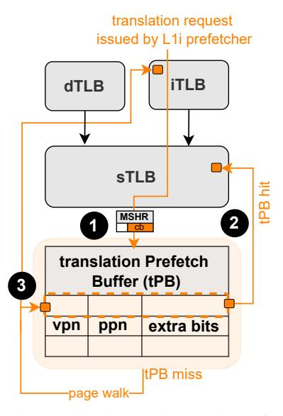
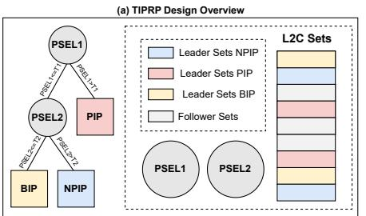
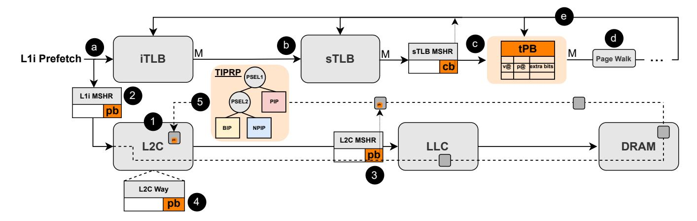
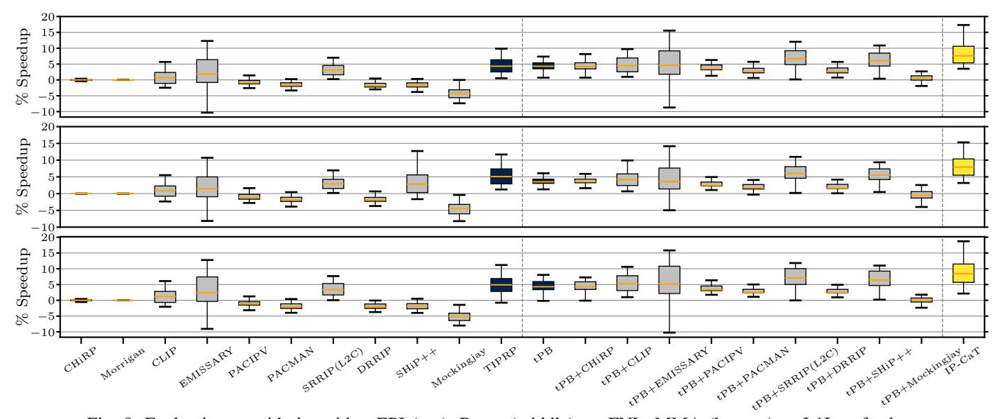

# IV. IP-CAT DESIGN

This section presents Instruction Prefetch Centric Cache and TLB Management (IP-CaT), the first scheme to enhance the benefits of L1I prefetching through coordinated management of the TLB and the cache hierarchy. IP-CaT comprises of two building blocks. First, the Translation Prefetch Buffer (tPB), a small buffer located alongside the sTLB that accommodates instruction page table entries (PTEs) fetched in the TLB hierarchy by L1I page-cross prefetches. tPB is motivated by Finding 1, which shows that while L1I pagecross prefetching can substantially improve the performance of server applications, its benefits are limited by instruction address translation latency. By enabling the reuse of PTEs fetched by the L1I prefetcher, tPB reduces the translation cost of L1I page-cross prefetching. Second, the Trimodal Instruction Prefetch Replacement Policy (TIPRP), a decision-tree L2C replacement policy specialized in the management of lines fetched by L1I prefetches. TIPRP decides, at runtime, whether prefetched code lines in L2C should be retained, prioritized for

eviction, or bypassed, based on their anticipated contribution to performance. The design of TIPRP is motivated by Finding 2, revealing that lines fetched in L2C by L1I prefetches shows variable behavior in terms of reuse; a big fraction of these lines are dead-on-arrival, some experience limited reuse, while a small fraction serves a large number of demand L2C accesses, thus being very critical for performance.

## A. translation Prefetch Buffer (tPB)

The translation Prefetch Buffer (tPB) is a small setassociative structure located alongside the sTLB that stores instruction PTEs fetched in the TLB hierarchy by L1I pagecross prefetches. Each tPB entry stores the virtual page number (vpn) for indexing purposes, the physical page number (ppn), and attribute bits that sTLB entries typically store [15]. Note that tPB is populated only by instruction translation requests originating from L1I page-cross prefetches and not by demand sTLB misses, justified in Section VI-A3. Figure 5 shows the design and operation (in steps) of tPB.

L11 prefetch requests look up the TLB hierarchy (iTLB, sTLB) for the corresponding address translation. If the requested translation misses in both iTLB and sTLB, tPB is queried for possible hits (1) in Figure 5). Upon tPB hits, the hitting tPB entry is inserted into sTLB 2 following the sTLB insertion policy. Also, the hitting tPB entry is invalidated. For L1I prefetches that miss in tPB, a prefetch page table walk is initiated to fetch the corresponding address translation. Translation entries fetched by page walks initiated by the L1I prefetcher are stored in the iTLB and tPB, but not in the sTLB to avoid polluting the sTLB content 3.

Demand instruction TLB accesses that miss in both iTLB and sTLB, are routed to the tPB. When a demand access hits in the tPB, the corresponding entry is inserted into the sTLB according to the sTLB insertion policy, under the assumption of future reuse. The matching tPB entry is then invalidated to free space in its limited storage. Therefore, tPB hits mitigate the address translation performance bottleneck by reducing the number of demand page table walks. Section VI-A1 quantifies the impact of tPB on page walk reduction.

To support tPB's operation while allowing demand data and instruction translation requests to proceed normally, IP-CaT should differentiate between translation requests originating from the L1I page-cross prefetches and the other translation requests. To do so, IP-CaT requires one extra bit per sTLB MSHR entry indicating whether the corresponding translation request originates from an L1I page-cross prefetch request or not, as shown in Figure 5. We refer to this bit as cross-bit (cb). In practice, a new entry including the cb is inserted in the sTLB MSHR every time a translation request originating from an L1I page-cross prefetch misses in sTLB. The cb is set to 1 only for address translation requests coming from the L1I prefetcher and to 0 otherwise. The cb makes it possible to identify translations requested by L1I page-cross prefetches, which will be stored in tPB instead of sTLB (3 in Figure 5) while all the other translations will be stored in the sTLB.

Fig. 5: Organization and operation of tPB.

1) Integrating tPB in sTLB: Section IV-A presents tPB as a standalone structure to make its design and operation more transparent. In practical implementations, tPB can be seamlessly integrated into the sTLB by matching its associativity. Under this design, the sTLB is augmented with additional sets that are logically designated for tPB entries. Section VI-E evaluates multiple tPB design alternatives and demonstrates that integrating tPB into the sTLB achieves performance gains comparable to those of a decoupled sTLB-tPB organization. Beyond simplifying the implementation, this integrated design also reduces the translation coherence overhead associated with a separate tPB structure, presented in Section IV-C.

### B. Trimodal Instruction Prefetch Replacement Policy (TIPRP)

The <u>Trimodal Instruction Prefetch Replacement (TIPRP)</u> is a decision tree-based L2C replacement policy that judiciously manages lines coming from L1I prefetches by anticipating whether these lines will be accessed in the future or not. TIPRP reduces L2C pollution incurred by dead-on-arrival lines fetched by L1I prefetches while maximizing the utilization of prefetched code lines that are critical for performance.

- 1) Building Blocks of TIPRP: Since code lines fetched in L2C by L1I prefetches exhibit variable behavior (Section III-C), TIPRP combines three complementary RRPV-based [19] policies. A decision tree dynamically selects between them, adapting TIPRP to the different execution phases (Section IV-B3). Figure 6 (a) illustrates the design of TIPRP along with its constituent replacement policies:
- <u>Prioritize Instruction Prefetch</u> (PIP). The PIP policy protects lines fetched into L2C by L1I prefetches from being evicted. To select a candidate for eviction, PIP looks for the least recently used line not fetched to L2C by an L1I prefetch request present in the corresponding set. If no such lines are present in the set, PIP evicts the line in LRU position (RRPV = 3). PIP applies the standard SRRIP promotion and insertion policies [19], [41], [45], [46] for all cache lines.

|                    | (c) TIPRP Training        |                           |
|--------------------|---------------------------|---------------------------|
| Leader Set Type | Demand L2C Hit            | L2C Eviction              |
| Leader Sets        | if(pb==0) no update       | if(pb==0) no update       |
| PIP                | if(pb==1) PSEL1++, PSEL2- | if(pb==1) PSEL1, PSEL2    |
| Leader Sets        | if(pb==0) PSEL1, PSEL2++  | if(pb==0) PSEL1++, PSEL2- |
| NPIP               | if(pb==1) no update       | if(pb==1) no update       |
| Leader Sets        | if(pb==0) PSEL1, PSEL2    | if(pb==0) PSEL1++, PSEL2+ |
| BIP                | if(pb==1) no update       | if(pb==1) no update       |

Fig. 6: (a) Overview of TIPRP and the implementation of its adaptive selection logic that dynamically selects between NPIP and PIP policies, (b) TIPRP operation in pseudo-code, and (c) TIPRP training events.

- <u>Non-Prioritize Instruction Prefetch</u> (NPIP). NPIP favors the eviction of lines fetched by L1I prefetches. To do so, NPIP inserts lines fetched in L2C by L1I prefetches at the bottom of the recency stack, in the LRU position (RRPV = 3). NPIP handles eviction and promotion of lines fetched by L1I prefetches in the same way as standard SRRIP [19]. Finally, for all other cache lines types, NPIP applies the same eviction, promotion, and insertion policies as SRRIP [19].
- <u>Bypass Instruction Prefetch</u> (BIP). BIP bypasses, *i.e.*, does not insert, code lines fetched in L2C by L1I prefetches. For other cache lines types, BIP applies the same eviction, promotion, and insertion policies as standard SRRIP [19].
- 2) Insights on the Operation of PIP, NPIP, and BIP: PIP operates at eviction time while NPIP and BIP operate at insertion time. This asymmetry boosts IP-CaT benefits and training efficiency. PIP operates at eviction time to protect lines fetched by L1I prefetches. We found that applying it at insertion time would make it less effective in protecting prefetched code lines. In contrast, NPIP operates at insertion since this policy moderately favors the eviction of lines fetched into L2C by instruction prefetches. Operating at eviction time would bias NPIP too much towards the quick eviction of prefetched code lines. Finally, BIP completely avoids prefetched code lines to be inserted at L2C, thus can only operate at insertion time.
- 3) Dynamically Selecting between PIP, NPIP, and BIP: TIPRP dynamically decides whether PIP, NPIP, or BIP should drive L2C eviction, promotion, and insertion policies. TIPRP goes beyond the monolithic nature of set-dueling [19], [47] by leveraging a two-level decision tree where node-level decisions are driven by saturating counters, as Figure 6 (a) shows. To determine the best policy for a given access, TIPRP uses two saturating counters, named PSEL1 and PSEL2, that monitor the effectiveness of PIP, NPIP, and BIP. TIPRP statically splits the L2C sets into four categories: i) Leader Sets for PIP, i.e., sets statically assigned to use the PIP policy, ii) Leader Sets for NPIP, i.e., sets statically assigned to use the NPIP policy, iii) Leader Sets for BIP, i.e., sets statically assigned to use the BIP policy, and iv) Follower Sets, which use the best policy between PIP, NPIP, and BIP. Empirically, we determine that 10 bits for PSEL1 and PSEL2 and 32/16/16 Leader Sets for PIP/NPIP/BIP are good decisions points. Note that NPIP and BIP use half as many Leader Sets as PIP. Because NPIP and BIP do not prioritize lines fetched in L2C by L1I prefetches,

the two can be seen as a single policy against PIP. Using half Leader Sets for NPIP and BIP compared to PIP ensures fair training and equal probability of selecting policies that either favor or do not favor lines fetched in L2C by L1I prefetches. Figure 6 (a) presents an overview of TIPRP's selection logic.

IP-CaT requires one bit per L2C block to annotate whether a line has been fetched by an L1I prefetch or not. We refer to this bit as *prefetch bit* (pb). This bit makes it possible to update PSEL1 and PSEL2 counters, supporting the dynamic selection between the competing policies. Since pb is commonly present in L2C designs [48]–[50], we assume the availability of pb at L2C, indicating whether a code line was fetched by the L1I prefetcher. For designs lacking this information, Section IV-C explains how IP-CaT propagates pb to L2C.

- TIPRP Operation: Figure 6 (b) uses pseudo code to describe the operation of TIPRP. Upon an L2C access, PIP, NPIP, or BIP drive the replacement for the current access based on whether or not the access belongs to either policy's Leader Sets. If the access belongs to a Follower Set, PSEL1 and PSEL2 select which policy to activate. If PSEL1 is over threshold T1, PIP is selected. Otherwise, PSEL2 is used to make the final selection. If PSEL2 is below threshold T2, BIP is enabled; otherwise NPIP is used for the current access.
- TIPRP Training: Figure 6 (c) shows the training events of TIPRP's selection scheme, *i.e.*, the update of the PSEL1 and PSEL2 counters. While original set-dueling [19] relies on a single counter and updates it only upon evictions, TIPRP updates PSEL1 and PSEL2 upon both L2C hits and L2C evictions while discriminating between cache lines fetched by L1I prefetches and the other lines.

Regarding the PIP training events, if a demand L2C request is served by a Leader Set of PIP, PSEL1 and PSEL2 are updated only when the hitting line has been fetched in L2C by an L1I prefetch (pb=1). In such case, PSEL1 is incremented (positive update), since hitting on L2C lines fetched by L1I prefetches in the PIP Leader Sets indicates that PIP is beneficial for performance. Conversely, evicting L2C lines fetched by L1I prefetches from PIP Leader Sets implies that PIP is not a good replacement policy for the current phase, thus PSEL1 is decremented (negative update), as shown in Figure 6 (c). In both scenarios, PSEL2 is decremented, *i.e.*, we favor BIP over NPIP, since our experiments indicate that, when TIPRP determines that PIP is not useful for the current

Fig. 7: Operation of IP-CaT integrated in a standard microarchitecture.

program phase, it is better to aggressively start with BIP and gradually fall into NPIP if needed.

If a demand L2C request is served by a Leader Set of NPIP, PSEL1 and PSEL2 are updated only when the line that served the access has not been fetched into L2C by an L1I prefetch request (pb=0 in Figure 6 (c)). In this scenario, i) PSEL2 is incremented (positive update), as Figure 6 (c) shows, since a hit on a L2C line not fetched by an L1I prefetch request in the NPIP Leader Sets indicates that NPIP brings benefits and ii) PSEL1 is decremented not to favor the selection of PIP in subsequent accesses since NPIP brings benefits. Conversely, evicting L2C lines not fetched by an L1I prefetch request from NPIP Leader Sets indicates that NPIP is not optimally managing the L2C for the current phase, thus i) PSEL2 is decremented (negative update) to favor BIP over NPIP, i.e., to promote the complete bypass of lines fetched by L1I prefetches and thus increase the L2C storage capacity dedicated to L2C lines not fetched by L1I prefetch requests; and ii) PSEL1 is incremented to favor the selection of PIP for the next accesses. The operation for the Leader Sets of BIP is justified by similar arguments as NPIP.

Training Asymmetry. Accesses to Leader Sets of NPIP and BIP update PSEL1 and PSEL2 only when the line has not been fetched in L2C by an L1I prefetch request (pb=0); when pb=1 no update happens. Similarly, accesses to Leader Sets of PIP update PSEL1 and PSEL2 only when the line has been fetched in L2C by an L1I prefetch request (pb=1). The rationale of this asymmetry is that TIPRP updates PSEL1 and PSEL2 only on events that strongly indicate whether a policy improves or harms performance. For example, upon an L2C eviction of a line not fetched by an L1I prefetch (pb=0) in an NPIP Leader Set, IP-CaT updates PSEL1 to indicate that policies favoring the eviction of prefetched code lines are not producing the desired behavior, thus enabling PIP as it can deliver better performance. Conversely, an L2C eviction of a line fetched by an L1I prefetch (pb=1) in an NPIP Leader Set does not carry much significance to decide whether NPIP should be enabled. We experimentally verify that updating PSEL1 and PSEL2 only on events strongly correlated to the usefulness of the considered policies, as shown in Figure 6 (c), yields 5% higher IPC than updating these counters in all events.

• Insights on the Effectiveness of TIPRP: The placement of PIP, NPIP, and BIP in the decision tree nodes of Figure 6 (a) is crucial for the performance of TIPRP. We empirically determined that placing PIP, NPIP, and BIP within the decision tree nodes in this way allows for favoring transitions from PIP to NPIP, and from NPIP to BIP. This configuration provides the highest performance improvement.

## C. Operation of IP-CaT

Figure 7 shows the complete operation of IP-CaT. Standard microarchitectural structures appear in gray color while the components of IP-CaT are annotated in different color. Since pb is typically present in L2C designs [48]–[50], IP-CaT does not require augmenting each L2C block with additional bits. Figure 7 annotates pb in orange while showing how to propagate it to L2C for completeness.

Upon L1I prefetch requests (for either in-page or pagecross prefetches), the iTLB is looked up for the corresponding address translation a and, upon iTLB misses, the sTLB is accessed **b**. For sTLB accesses that result in a miss, the tPB is looked-up for possible hits **©**. Upon tPB hits, IP-CaT inserts the requested translation in sTLB (Section IV-A). Otherwise, a page walk is triggered to fetch the translation from the page table **d**. At the end of the page walk **e**, the requested translation is stored in i) tPB and iTLB for page walks triggered by L1I page-cross prefetch requests, and ii) iTLB and sTLB for page walks not triggered by L1I pagecross prefetch requests, as explained in Section IV-A. IP-CaT is aware of whether translation requests originate from the L1I prefetcher or not since the sTLB MSHR stores the cb bit, as described in Section IV-A and Figure 7. Note both sTLB and tPB are looked up for potential hits upon requests for instruction translations, as explained in Section IV-A.

After address translation, the physical address is known and memory requests lookup the L2C upon first-level cache misses ①. Section IV-B explains how TIPRP drives the L2C insertion, promotion, and eviction policies. IP-CaT decides to enable NPIP, PIP, or BIP ⑤ by taking into account the PSEL1 and PSEL2 values, as described in Section IV-B. IP-

| Component      | Description                                                                                     |  |
|----------------|-------------------------------------------------------------------------------------------------|--|
| CPU Core       | 1- and 4-core system, 4GHz, 128-entry FTQ, 352-entry ROB,                                       |  |
|                | 6-wide issue                                                                                    |  |
|                | TAGE-SC-L [51], [52], 8K-entry BTB, 64-entry RAS                                                |  |
| L1I TLB (iTLB) | 64-entry, 4-way, 1cc, 8-entry MSHR, LRU                                                         |  |
|                | 64-entry, 4-way, 1cc, 8-entry MSHR, LRU                                                         |  |
|                | 1536-entry, 12-way, 8cc, 16-entry MSHR, LRU                                                     |  |
| Page Structure | 4-level Split PSC, parallel search, 1cc.                                                        |  |
| Caches (PSCs)  | L5: 1-entry, L4: 2-entry, L3: 8-entry, L2: 32-entry                                             |  |
| L1I Cache      | 32KB, 8-way, 4cc, 8-entry MSHR, LRU, EPI [1] / Barça [3] /                                      |  |
|                | FNL+MMA [2]                                                                                     |  |
| L1D Cache      | 48KB, 12-way, 5cc, 16-entry MSHR, LRU, Berti [53]                                               |  |
| L2 Cache       | 1MB, 16-way, 10cc, 32-entry MSHR, LRU                                                           |  |
| LLC            | 1.375MB per core, 11-way, 36cc, 64-entry MSHR, SHiP [29]                                        |  |
| DRAM           | 4GB/core, 25.6GB/s, 1 channel/core, t RP =t RCD =t CAS =12.5ns |  |

TABLE I: Baseline System Configuration.

CaT requires keeping pb in the L1I and L2C MSHRs (2,3) to propagate pb to the L2C 4 for designs lacking this feature.

- Storage Overhead. IP-CaT's storage overhead depends on the sTLB MSHR size of the underline microarchitecture. Considering the system described in Section V, IP-CaT requires 0.79KB to be implemented (6452b for a 64-entry tPB, 16b for sTLB MSHR cb bits, 10b for PSEL1, and 10b for PSEL2). This is just 0.08% of the L2C capacity. The energy impact of IP-CaT is negligible due to this minimal storage overhead.
- TLB Shootdowns and Translation Coherence. IP-CaT does not introduce any translation coherence issue as the tPB component can be resembled as an extra TLB level or can be incorporated into the sTLB. The only requirement is to include tPB in the TLB shootdown process. Section IV-A1 describes that tPB can be seamlessly integrated in the sTLB, minimizing its translation coherence overheads. Section VI-E evaluates different tPB configurations suitable for sTLB integration.
- Wrong-Path Execution. IP-CaT handles wrong-path requests implicitly, like conventional replacement policies that are agnostic to path correctness. While such requests may cause pollution or bring useful data, making replacement policies wrong-path aware is a promising direction for future work, e.g., via branch prediction hints or a dedicated predictor using commit-stage information.

## V. EXPERIMENTAL METHODOLOGY

We evaluate IP-CaT using ChampSim [54], [55], a detailed trace-based simulator of an out-of-order processor with a three-level cache hierarchy [53], and a decoupled frontend [56] with FDIP [13]. We consider 5-level radix tree page table, an x86 hardware page table walker [44], and MMU Caches [57]. Table I details our baseline system configuration, similar to an Intel Cascade Lake microarchitecture [58], [59].

Simulated Page Sizes. Our evaluation considers two scenarios: i) the system uses only 4KB pages (Section VI-A, Section VI-C) and ii) the system uses both 4KB pages and 2MB pages (Section VI-G) [17], [60]. Considering 4KB pages is relevant as large pages require memory contiguity and defragmentation, which cannot be guaranteed in servers due to their large uptimes [9], [60]–[62].

Single-Core Workloads. We use a set of server workloads with large code footprints, including workloads provided by Qualcomm [63], [64] and other established server workloads (NodeApp, PHPWiki, TPCC, Twitter, Wikipedia, Kafka,

| Technique              | L2C      | LLC        | STLB     | tPB |
|------------------------|----------|------------|----------|-----|
| Baseline               | LRU      | SHiP       | LRU      | n/a |
| CHiRP [5]              | LRU      | SHiP       | CHiRP    | n/a |
| Morrigan [4]           | LRU      | SHiP       | Morrigan | n/a |
| CLIP [20]              | CLIP     | SHiP       | LRU      | n/a |
| EMISSARY [6]           | EMISSARY | SHiP       | LRU      | n/a |
| PACIPV [22]            | LRU      | PACIPV     | LRU      | n/a |
| PACMAN [21]            | LRU      | PACMAN     | LRU      | n/a |
| SRRIP (L2C) [24]       | SRRIP    | SHiP       | LRU      | n/a |
| DRRIP [24]             | LRU      | DRRIP      | LRU      | n/a |
| SHiP++ [7]             | LRU      | SHiP++     | LRU      | n/a |
| Mockingjay [8]         | LRU      | Mockingjay | LRU      | n/a |
| TIPRP (Sec. IV-B)      | TIPRP    | SHiP       | LRU      | n/a |
| tPB (Sec. IV-A)        | LRU      | SHiP       | LRU      | LRU |
| tPB + CHiRP            | LRU      | SHiP       | CHiRP    | LRU |
| tPB + CLIP             | CLIP     | SHiP       | LRU      | LRU |
| tPB + EMISSARY         | EMISSARY | SHiP       | LRU      | LRU |
| tPB + PACIPV           | LRU      | PACIPV     | LRU      | LRU |
| tPB + PACMAN           | LRU      | PACMAN     | LRU      | LRU |
| tPB + SRRIP (L2C) [24] | SRRIP    | SHiP       | LRU      | LRU |
| tPB + DRRIP            | LRU      | DRRIP      | LRU      | LRU |
| tPB + SHiP++           | LRU      | SHiP++     | LRU      | LRU |
| tPB + Mockingjay       | LRU      | Mockingjay | LRU      | LRU |
| IP-CaT (tPB + TIPRP)   | TIPRP    | SHiP       | LRU      | LRU |

TABLE II: List and composition of all simulated designs.

Spring, Tomcat, Chirper, HTTP), used in recent literature [5], [42], [60], [65], [66]. We consider only workloads exhibiting at least 0.5 instruction sTLB MPKI, resulting in a total of 105 single-core server workloads. After a warm-up phase of 50M instructions, simulations execute 100M instructions to collect experimental results [5], [60].

Multi-Core Workloads. We create both homogeneous and heterogeneous 4-core mixes using the single-core server workloads [30], [33], [34], [59], [67], [68]. For the homogeneous mixes, we run four instances of each workload, one per core. For the heterogeneous mixes, we randomly combine four single-core workloads. In total, we consider 60 homogeneous and 100 heterogeneous mixes. The multi-core experiments use the same warm-up and simulation lengths as the single-core evalaution, with each workload running on its own core until at least one completes both phases [69]. We report the weighted speedup normalized to the baseline to avoid performance overestimation due to high-IPC threads [17], [33], [70]. For each single-core workload, we compute its IPC in a multicore scenario shared with the other co-running single-core workloads ( $IPC_{shared}$ ), and its IPC running alone on the same system  $(IPC_{single})$ . We then compute the weighted IPC of the mix as the weighted sum of  $IPC_{shared}/IPC_{single}$  for all the benchmarks in the mix and we normalize this weighted IPC with the weighted IPC of the baseline.

*SMT Evaluation.* To evaluate IP-CaT under SMT colocation, we extend ChampSim with SMT support. We construct 75 randomly selected workload pairs from the pool of single-core workloads to capture a diverse range of interference scenarios. For consistency, we use the same warmup and simulation lengths as in the single-core experiments. Section VI-I presents the SMT evaluation.

Evaluated Policies. We evaluate ten state-of-the-art cache and TLB management policies: CHiRP [5], Morrigan [4], CLIP [20], EMISSARY [6], PACIPV [22], PACMAN [21], SRRIP [24], DRRIP [24], SHIP++ [7], and Mockingjay [8]. Table II lists these policies and the cache where they are applied following the standard practices. We also evaluate

Fig. 8: Evaluation considering either EPI (top), Barça (middle), or FNL+MMA (bottom) as L1I prefetcher.

Fig. 9: Performance of IP-CaT and tPB+SRRIP (best-performing policy of Fig. 8) across 788 workloads without the MPKI selection of Section V.

the TIPRP replacement (Section IV-B) in isolation as well as combining tPB (Section IV-A) with all state-of-the-art policies; we exclude tPB+Morrigan due to poor performance.

