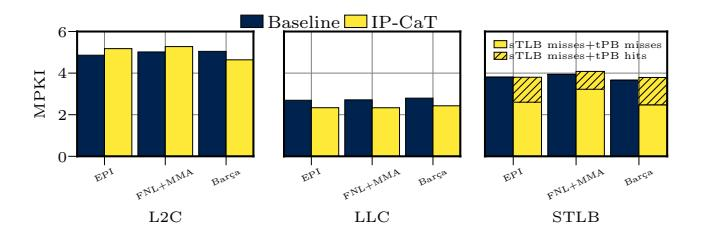
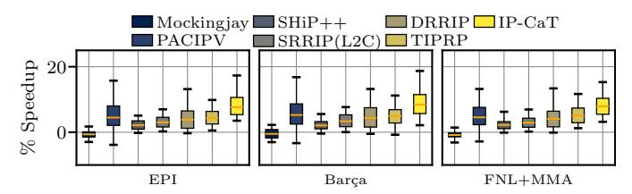
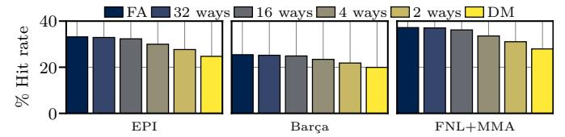
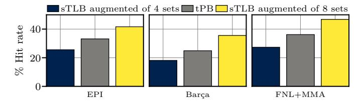

# VI. EVALUATION

To demonstrate the effectiveness of IP-CaT, we evaluate three state-of-the-art L1I prefetchers: EPI [1], Barça [3], and FNL+MMA [2]. All are configured to prefetch across page boundaries, as Section III-B shows that it provides significant performance gains. Across the studies server workloads, these prefetchers exhibit both high accuracy and coverage: EPI achieves 74.1% accuracy and 85.8% coverage, FNL+MMA 72.9% and 85.0%, and Barça 67.7% and 83.7%. Evaluating with such strong L1I prefetchers avoids overstating IP-CaT 's benefits, which could otherwise be inflated by low-accuracy or low-coverage prefetch engines.

#### A. Single-Core Performance Evaluation

This section compares the single-core performance of all schemes in Table II. Figure 8 reports results using EPI, Barça, and FNL+MMA as L1I prefetchers. The x-axis lists the evaluated schemes and the y-axis shows the speedups over the baseline (Table I). Each scheme is represented with a box plot, showing the distribution of speedups across the 105 server workloads, with a red bar indicating the geometric mean.

Regarding the TIPRP component of IP-CaT, we observe that it delivers 2.9%, 4.8%, and 5.0% geomean speedups across the

Fig. 10: L2C, LLC, and STLB MPKIs across all prefetchers.

EPI, Barça, and FNL+MMA prefetchers, outperforming the state-of-the-art cache and replacement policies. We observe such behavior because TIPRP tailors the insertion, promotion, and eviction policies of prefetched code lines in L2C to the underlying execution phase, as explained in Section IV-B.

IP-CaT (tPB combined with TIPRP) improves the performance of EPI, Barça, and FNL+MMA by 6.1%, 8.3% and 7.9% across the EPI, Barça, and FNL+MMA prefetchers, outperforming CHiRP, Morrigan, CLIP, EMISSARY, PACIPV, PACMAN, DRRIP, SHiP++, and Mockingjay across all L1I prefetchers even when these schemes are combined with tPB. IP-CaT's benefits stem from the fact that TIPRP optimizes the management of prefetched code lines in L2C while tPB serves a significant number of demand sTLB misses while improving the timeliness of L1I prefetching, as Section VI-A1 shows.

Non TLB Intensive Workloads. To highlight that IP-CaT does not harm the performance of non TLB intensive applications, we evaluate all server workloads provided by Qualcomm [63], [64] without the sTLB MPKI selection of Section V. For this study, we compare IP-CaT to the best-performing policy of Figure 8: tPB+SRRIP. Figure 9 shows the performance of tPB+SRRIP and IP-CaT across all L1I prefetchers. For EPI, IP-CaT outperforms tPB+SRRIP by 2.9% in geomean, indicating the benefits of our proposal. The trends for FNL+MMA and Barça are similar.

Fig. 11: L2C, LLC, and STLB average miss latency.

1) Performance Analysis: To explain IP-CaT's superior performance, Figure 10 and Figure 11 show its impact on MPKI and average miss latency, respectively, for the L2C, the LLC (excluding misses due to address translations), and the sTLB. We observe that the impact of IP-CaT on the cache and TLB hierarchy is twofold: i) TIPRP reduces the number of LLC misses for all L1I prefetchers, while slightly increasing the L2C misses for EPI and FNL+MMA and simultaneously achieving a significant reduction in the average miss latency for L2C, LLC, and sTLB. The MPKI reduction primarily arises from better management of lines brought in the L2C by L1i prefetch requests and a decrease in traffic due to page walks. At L2C, TIPRP increases instruction MPKI by 6.5%, 5.1%, and -8.1% for EPI, Barça, and FNL+MMA, respectively while reducing the average miss latency by 3.8%, 2.3%, and -0.5%, respectively; ii) tPB substantially reduces both sTLB MPKI and the average miss latency by more effectively managing address translation entries brought in by L1I pagecrossing prefetches. We observe that the sTLB MPKI, defined as the number of accesses that miss in both the sTLB and the tPB, is reduced by 31.6%, 18.2%, and 32.3% for EPI, FNL+MMA, and Barça, respectively. This reduction occurs because a substantial fraction of demand sTLB misses are served by tPB. This reduction in sTLB MPKI also decreases the pressure that sTLB misses put on the cache hierarchy, therefore L2C and LLC average miss latencies experience reductions (Figure 11).

Fig. 12: Comparison against L2C variants of the state-of-theart replacement policies.

2) Comparison with L2C Variants of Prior Policies: This section compares TIPRP and IP-CaT with the state-of-the-art policies of Table II which are originally designed for the LLC (Mockingjay, PACIPV, SHiP++, SRRIP, and DRRIP), now applied to L2C. We exclude PACMAN from this study due to its inferior performance. Figure 12 presents the performance comparison, showing that IP-CaT provides higher speedups than the competing policies owing to the TIPRP and tPB schemes that optimize the management of prefetched code

Fig. 13: Comparing IP-CaT against an augmented sTLB.

lines and code translations in L2C and sTLB, respectively. For example, when EPI is used, IP-CaT outperforms Mockingjay, PACIPV, SHiP++, SRRIP, and DRRIP by 8.0%, 3.0%, 5.3%, 4.4%, and 3.6%, respectively.

3) ISO Storage Comparison: Figure 13 compares tPB and IP-CaT with a scenario that augments the sTLB with IP-CaT's storage overhead. This is done by adding one way to the sTLB, providing 128 extra sTLB entries as opposed to tPB's 64 entries (Section IV-C). The results of Figure 13 show that tPB and IP-CaT outperforms this ISO\_Storage scenario across all considered L1I prefetchers.

| Table Groups    | T0  | T1-T2 | T3-T10 | T11-T15 | Total |
|-----------------|-----|-------|--------|---------|-------|
| Entries         | 4K  | 4K    | 4K     | 2K      | 14K   |
| Tag bits        | 0   | 9     | 13     | 15      |       |
| U bits          | 0   | 1     | 1      | 1       |       |
| bits per entry  | 27  | 37    | 41     | 43      |       |
| Storage (KBits) | 108 | 148   | 164    | 86      | 506   |

TABLE III: Configuration of the ITTAGE's prediction tables.

Fig. 14: Evaluation of IP-CaT considering a baseline with TAGE-SC-L, and a scenario using TAGE-SC-L with ITTAGE.

#### B. Impact of Indirect Branch Target Prediction

Our baseline uses TAGE-SC-L as conditional branch predictor. This section evaluates IP-CaT with and without the state-of-the-art indirect branch predictor ITTAGE [71] to quantify its impact on the performance of our proposal. We consider two configurations: i) the branch prediction unit (BPU) of the baseline uses only TAGE-SC-L, as in prior sections, and ii) the BPU of the baseline uses both TAGE-SC-L and ITTAGE. The ITTAGE configuration is detailed in Table III.

Figure 14 shows the performance of IP-CaT across 15 representative server workloads under both configurations. The results are nearly identical, with a maximum IPC variation of 2.4%. The competing policies of Table II exhibit similar trends in both setups, thus incorporating ITTAGE in the baseline does not reduce the benefits of IP-CaT.

## C. Ablation Study of IP-CaT Components

This section quantifies the contribution of each IP-CaT component. We evaluate: i) tPB; ii) NPIP, iii) BIP, iv) PIP, and v) TIPRP as standalone L2C replacement policies; vi) SRRIP since NPIP, BIP, and PIP are based on it, and vii) IP-CaT, which combines tPB and TIPRP. Figure 15 reports the results. With the EPI prefetcher, tPB, NPIP, BIP, PIP,

Fig. 15: Performance breakdown of IP-CaT.

Fig. 16: Comparison between tPB, TIPRP, and IP-CaT considering the EPI prefetcher across representative workloads.

TIPRP, SRRIP, and IP-CaT achieve 2.9%, 4.8%, 5.5%, -1.5%, 2.9%, 1.7%, and 6.1% geomean speedups, respectively. Notably, IP-CaT outperforms the sum of its components (tPB + TIPRP = 5.8%), reaching 6.1%. This gain comes from the synergy between tPB and TIPRP: since page walks access the L2C, tPB reduces the number of page walks, lowering L2C contention and increasing the effectiveness of TIPRP. Figure 16 corroborates this across 15 representative server workloads (same as the ones used in Figure 14). In particular, tPB reduces L2C MPKI by 3.6% due to the reduction in page walks, enabling larger gains for TIPRP. We observe similar trends with Barça and FNL+MMA prefetchers.

Fig. 17: Comparison to a variation of IP-CaT applying TIPRP to both demand and prefetch code lines in L2C (IP-CaT D+P).

1) Applying TIPRP to Demand Instruction Accesses: Figure 17 compares IP-CaT to a variation of IP-CaT that applies the TIPRP replacement policy not only to lines fetched by L1I prefetches but also to demand instruction accesses; we refer to this scheme as IP-CaT D+P. Figure 17 shows that, when considering the EPI prefetcher, IP-CaT outperforms (in geomean) IP-CaT D+P by 10.1%. This study indicates that applying TIPRP to both prefetch and demand instruction requests harms performance since cache lines fetched by demand instruction accesses show different reuse patterns compared to lines fetched by instruction prefetches.

## D. Sensitivity to tPB Size and Organization

Figure 18 presents a sensitivity analysis of the tPB size in terms of hit rate. In this analysis the tPB is a fully associative standalone structure with capacities ranging from 8 to 128 entries. For the EPI prefetcher the tPB hit rate monotonically increases from 3.1% to 48.3% when its size grows from 8 to 128 entries. We observe similar trends for the other

Fig. 18: Sensitivity to tPB size, assuming fully-associative tPB.

Fig. 19: Sensitivity analysis on the associativity of a 64 entries tPB, varying from fully-associative to direct-mapped.

prefetchers. Based on this trade-off, we select a 64-entry tPB as it represents a practical design point between coverage and hardware complexity; unless otherwise stated, all results presented in the paper use this 64-entry tPB.

Figure 19 presents a sensitivity study of tPB's hit rate as we vary its organization from fully associative to direct-mapped, while keeping the total number of entries fixed at 64. For the EPI L1i prefetcher, the tPB hit rate decreases from 37.2% to 28.0% when moving from a fully associative to a direct-mapped organization. Notably, we observe that the difference in hit rate between the fully-associative, 32-way, and 16-way organizations of tPB is rather small. Although in this paper we consider the fully-associative design as our primary tPB design, the design comprising 4 sets and 16 ways performs similarly and may constitute more practical configuration.

#### E. Integrating tPB in sTLB

This section evaluates two variations of IP-CaT involving a tPB with the same number of ways as the sTLB. Section IV-A1 describes how a tPB with the same number of ways as the sTLB can be seamlessly integrated into it. Specifically, we consider two designs which augment the sTLB with 4 and 8 additional sets of 12 ways each, respectively. For completeness, we also show the fully-associative design which decoupled tPB from sTLB, presented in all previous sections. Figure 20 shows the hit rates of the scenarios which integrate tPB in the sTLB as well as the hit rate of the standalone fullyassociative tPB. The latter exhibits a 36.2% hit rate whereas the two sections of the augmented sTLB exhibit 25.6% and 41.6% hit rate when augmenting the sTLB with 4 and 8 sets dedicated to tPB, respectively. These differences in terms of tPB hit rates across the three designs do not translate into significant IP-CaT performance differences.

## F. Sensitivity to LLC size

Figure 21 presents a sensitivity analysis of IP-CaT performance as the LLC capacity is varied from 1MB to 4MB. With a 1MB LLC, IP-CaT achieves a geometric mean speedup of 12.7% for the EPI prefetcher, while the speedup reduces to 2.6% with a 4MB LLC. The main takeaway is that even with

Fig. 20: Comparing IP-CaT with a 64-entry fully-associative tPB against augmenting sTLB by 4 and 8 sets of 12 ways.

Fig. 21: Sensitivity of IP-CaT's performance to the LLC size.

larger LLCs (e.g., 4MB), IP-CaT continues to provide significant performance improvements. Similar trends are observed for the FNL+MMA and Barc¸a.

An additional observation from [Figure 21](#page-11-3) is that the performance gains of IP-CaT gradually decrease as the LLC size increases across all evaluated L1I prefetchers. This happens because large LLCs can capture a greater portion of application working sets, thereby improving cache locality and reducing miss rates, which in turn makes the L2C replacement policy less critical for performance. Consequently, the relative contribution of TIPRP on IP-CaT speedups becomes less pronounced, resulting in smaller performance improvements.

