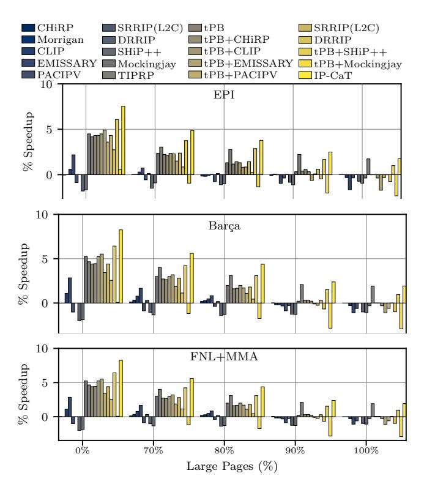

# *G. Multiple Page Sizes*

[Figure 22](#page-11-4) shows the performance improvement of all considered scenarios [\(Table II\)](#page-7-2), excluding PACMAN due to inferior performance, when the baseline uses both 4KB and 2MB pages, as explained in [Section V.](#page-7-0) The top, medium, and bottom plots show results for EPI, Barc¸a, and FNL+MMA, respectively. The x-axis reports the proportion of the memory footprint mapped in large pages as compared to small pages (*e.g.*, 5% refers to a scenario where 5% of the memory footprint is mapped in 2MB pages; the remaining 95% is mapped to 4KB pages). The y-axis shows the geomean speedups over the baseline for each multi-size page scenario.

We observe that IP-CaT consistently outperforms all stateof-the-art approaches for all multi-page size scenarios and L1I prefetchers. For example, with the EPI prefetcher, the geomean speedup of IP-CaT goes from 7.5% to 1.8% as the proportion of the memory footprint mapped to 2MB pages increases from 0% to 100%. The best state-of-the-art scheme moves from 4.5% to -0.4% as the footprint mapped into 2MB pages goes from 0% to 100%. tPB alone does not provide any benefit when the entire memory footprint is mapped in 2MB pages since the number of page-cross prefetch requests missing in the sTLB is minimal in this scenario. Overall, the benefits of IP-CaT (and all competing approaches) diminish as a larger fraction of code and data is mapped to 2 MB pages, since

Fig. 22: Evaluation on multiple page sizes.

Fig. 23: Performance evaluation in 4-core context.

using 2MB pages reduces STLB misses. Nevertheless, even when the entire code and data footprint 2MB pages, IP-CaT still achieves a non-negligible 1.8% speedup over the baseline.

