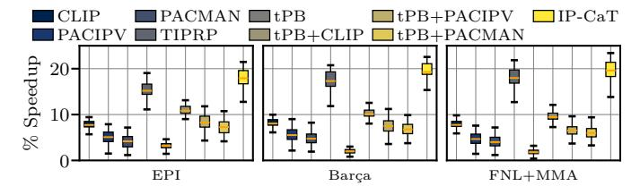

# *I. SMT Evaluation*

[Figure 24](#page-12-0) quantifies the performance of IP-CaT and the other prefetch-aware schemes considering 75 SMT workloads,

Fig. 24: Performance evaluation using SMT workloads.

presented in [Section V.](#page-7-0) We observe that IP-CaT outperforms all competing schemes across all considered prefetchers. The results show similar trends as in the single-thread evaluation, but with larger absolute speedups due to increased contention for structures such as the sTLB and L2C. For example, when considering the EPI, IP-CaT outperforms CLIP, PACIPV, and PACMAN by 7.1%, 9.3%, and 10.3%, respectively.

