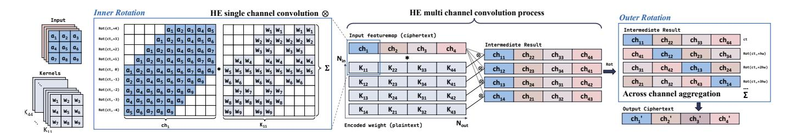

# I. INTRODUCTION

Deep Neural Networks (DNNs) underpin a wide range of modern computer vision tasks, including image classification and object detection [46]. Machine Learning as a Service (MLaaS) platforms (e.g., Amazon SageMaker [1], Google AI Platform [9], Azure ML [3], and OpenAI [2]) enable scalable deployment of such models, but raise significant privacy concerns when sensitive data is processed in untrusted cloud. Fully Homomorphic Encryption (FHE) [10], [12], [13], [22] enables computation directly over encrypted data, providing a foundation for privacy-preserving machine learning.

Despite its promise, encrypted convolutional neural network (CNN) inference remains orders of magnitude slower than its plaintext counterpart, even on modern GPUs and HE accelerators. For instance, Orion, the state-of-the-art HE

inference system [18], takes more than 300 seconds to infer one single encrypted CIFAR-10 image on an Intel Xeon-based server, which represents orders of magnitude slower than plaintext inference. The bottleneck arises not only from the inherent latency of HE primitives, e.g., rotation, key-switching, and number-theoretic transforms (NTT), but also from the *volume and structure* of these operations, which depend on how activations are packed into ciphertexts across layers (i.e., ciphertext packing). By packing scalar values into the vector slots of a single ciphertext, it enables Single Instruction Multiple Data (SIMD)-style HE operations such as SIMD additions and SIMD multiplications, amortizing the high cost of HE primitives across multiple data elements [11], [15], [23], [43], [49].

We argue that the performance of ciphertext packing critically depends on two factors: (1) the number of ciphertext rotations, which cyclically shift encrypted vector elements for SIMD-style aggregation, and (2) slot utilization, which measures how efficiently ciphertext slots are filled with useful data, reflecting hardware-level SIMD efficiency. HE-CNN inference exacerbates both factors: (i) convolutions introduce nested data dependencies, requiring extensive inner- and outer-rotations for intra- and inter-channel aggregation (Sec. III-A). Each rotation incurs costly key-switching and multiple NTTs, similar to large-scale vector shuffles [59], and can account for over 70% of end-to-end latency at the application level (Fig. 1); (ii) layerwise channel reduction and expansion reduce slot utilization, leaving many ciphertext slots idle. Existing packing methods partially address these issues, by reducing either inner- or outer-rotations or increasing initial density, but rely on static, handcrafted layouts that degrade across layers [18], [42]. As channels shrink or feature maps evolve [31], [64], sparsely populated ciphertexts lead to proliferation of ciphertexts, poor SIMD efficiency, and high memory overhead. In short, current HE-CNN frameworks [4], [18] neither jointly optimize rotation cost and slot utilization nor provide a principled manner to generate efficient layouts across diverse models and datasets.

This paper addresses the performance-critical packing problem by introducing  $FEnc^2$ , a unified and automated framework that maximizes slot utilization and minimizes costly rotations for efficient and scalable HE-CNN inference across arbitrary CNN models, datasets, and batch configurations. The key insight is to treat ciphertext packing as an algorithmic degree of freedom that can be optimized using convolutional structure and layer-wise tensor geometry. To this end,  $FEnc^2$  consists of

Fig. 1: (a) Latency comparison of HE primitives under encryption parameter  $N=2^{16}$  on a GPU platform. (b) End-to-end encrypted inference latency breakdown of the SOTA Orion encoding [18] on ImageNet for three CNNs: SqueezeNet, ResNet18, and MobileNet. Note with ciphertext input & plaintext model, #CMult is very limited.

two complementary components. First, Conv-aware Encoding provides a parameterized block decomposition of 4D feature tensors across width, height, channel, and batch dimensions, encoding each block into separate ciphertexts to decouple both adjacent intra-channel and cross-channel data dependencies in convolution. The optimal block size is derived from a convex model that balances inner- and outer-rotation costs, enabling efficient layouts across both small and large batch settings. Second, Architecture-aware Ciphertext Compression maintains high slot utilization across layers by consolidating sparsely filled ciphertexts and preventing fragmentation as the network evolves. Together, these two components allow FEnc2 to dynamically adapt to CNN layer structures and automatically generate ciphertext layouts that reduce rotation complexity while preserving high ciphertext occupancy. By reducing the number and cost of HE operations presented to hardware, FEnc2 amplifies the benefits of existing low-level HE accelerators, including optimized NTT units, key-switching circuits, and SIMD-aware engines [20], [41], [44], [58], [66], without requiring any modification to model architectures, encryption parameters, or hardware. We prototype  $FEnc^2$  on both CPUand GPU-based systems and evaluate it on encrypted inference workloads spanning MNIST, CIFAR10, and ImageNetscale settings with LeNet, VGG5, SqueezeNet, ResNet18, and MobileNet. Across all benchmarks, FEnc2 reduces rotation and key-switch volume relative to prior SOTA schemes while maintaining high ciphertext occupancy. Compared with the latest SOTA, Orion,  $FEnc^2$  achieves up to  $226.06 \times$  and  $228.83\times$  speedup and up to 98.49% and 75.6% memory reduction on CPU- and GPU-based systems, respectively, for LeNet; for MobileNet, it achieves up to  $9.43\times$  and  $4.55\times$ speedup and up to 85.08% and 75.68% memory reduction, respectively. To summarize, our main contributions are:

- We emphasize ciphertext packing as a *long-standing bot-tleneck* in HE-CNNs and formulate a principled, rotation-minimizing fragment layout with theoretical guarantees.
- We introduce a *cross-layer ciphertext consolidation* mechanism that preserves high slot utilization. By mitigating slot waste introduced by layer operations (e.g., 1 × 1 convolutions for feature reduction), *Arch-aware Ct Compression* reduces the number of ciphertexts needed for efficient SIMD processing in subsequent layers.
- We develop the first unified and fully automated HE-CNN packing framework that delivers efficient layouts for any model, dataset, or batch size, without manual tuning or runtime profiling. Its generality is shown by encompassing prior solutions as non-optimal special cases, while its optimality is both analytically and empirically validated.

TABLE I: Notations table

| Notation                  | Description                                                                                  |
|---------------------------|----------------------------------------------------------------------------------------------|
| N N/O                  | Polynomial degree (number of coefficients)                                                   |
| N/2                       | Number of available slots in an encoded message Scale factor used for polynomial encoding |
| $\overline{\overline{Q}}$ | Ciphertext modulus chain $\{q_0, q_1, \dots, q_L\}$                                          |
| $\dot{\alpha}$            | Number of channels packed in one ciphertext                                                  |
| BS                        | Batch size of input sample                                                                   |
| K                         | Convolution kernel size                                                                      |
| H, W                      | Featuremap Height, Width                                                                     |
| $N_{in}, N_{out}$         | Input and Output channel number                                                              |

• We perform comprehensive experiments to evaluate  $FEnc^2$  in terms of throughput and memory efficiency. The results validate our key design choices, showing orders of magnitude speedup for HE-CNN inferences and up to  $226.06 \times$  and  $109.96 \times$  speedup and introduces up to 98.49% and 75.6% memory saving over Orion in CPU and GPU based systems, respectively demonstrating the effectiveness of our approach across platforms.

#### II. BACKGROUND

In this section, we introduce the basics of *Cheon–Kim–Kim–Song (CKKS)*, the encryption scheme used in this work. Table I summarizes the notation used throughout this paper.

**CKKS** is a state-of-the-art homomorphic encryption (HE) scheme widely adopted for encrypted neural network inference due to its support for fixed-point real-number arithmetic [25], [38], [55]. A CKKS ciphertext represents a degree-N polynomial in  $\mathbb{Z}_q[X]/(X^{N-1}+1)$  that encodes up to N/2 complex values, referred to as slots-all processed in parallel for SIMD-style computation. CKKS supports several SIMD-based HE primitives essential for encrypted computation, including ciphertext (ct) addition  $Add(ct_1, ct_2) = ct_1 + ct_2$ , ciphertext multiplication  $CMult(ct_1, ct_2) = ct_1 \circ ct_2$ , plaintext-ciphertext multiplication  $PMult(ct, pt) = ct \circ pt$ , slot rotation Rot(ct, k), which cyclically shifts encrypted vector elements with the offset k, and rescaling  $Rescale(ct, \Delta) = ct/2^{\Delta}$ , which manages noise after multiplications to prevent decryption failure, by dividing the ciphertext by  $2^{\Delta}$  (or truncating  $\Delta$  bits from its modulus), thereby consuming one ciphertext level.

**Rotation.** Among HE primitives, *Rotation*, together with *CMult*, is substantially more expensive than *PMult* or *Add* (e.g., 4.8ms vs. 0.15ms), as shown in Fig. 1 (a). This high cost arises from two components: an automorphism followed by a key-switching operation. The rotation is computed as:

$$Rot(ct,k) = (c(X^{ik}), 0) + P^{-1}(a(X^{ik}) \cdot evk_{rot}^k), \tag{1}$$

where  $evk_{\rm rot}^k$  is the rotation evaluation key with large modulus Q. For a ciphertext  $ct=(c(X^i),a(X^i))$ , the automorphism maps each coefficient index i to  $ik \mod N$ . The second term performs key switching, which dominates the latency, ensuring the output ct remains decryptable by the same secret key [59].

#### III. MOTIVATION

#### A. HE Multi-Channel Convolution

We analyze how excessive rotations arise in multi-channel convolution, the dominant computation pattern in HE-CNN inference. Without loss of generality, we assume HE multichannel convolution (multi-input, multi-output, MIMO) uses

Fig. 2: Illustration of HE multi-channel convolution with 4 input/output channels, 3 × 3 kernels, ciphertext inputs, and plaintext kernels.

baby-step-giant-step (BSGS) [18], [32], [42], a common technique in SOTA HE inference [18], [49] to decouple nested loops and reduce rotation complexity.

Given an input tensor  $\mathbf{X} \in \mathbb{R}^{N_{\text{in}} \times H \times W}$ , weight kernel  $\mathbf{K} \in \mathbb{R}^{N_{\text{out}} \times N_{\text{in}} \times K \times K}$ , and output  $\mathbf{Y} \in \mathbb{R}^{N_{\text{out}} \times H \times W}$ , the standard 2D convolution is:

$$Y_{n_{\rm out},h,w} = \underbrace{\sum_{n_{\rm in}}}_{\text{channel dependency}} \underbrace{\sum_{i,j} X_{n_{\rm in},h+i,w+j} \cdot K_{n_{\rm out},n_{\rm in},i,j}}_{\text{spatial dependency}} \,. \tag{2}$$

Eq. 2 exhibits two nested dependencies: **spatial** (**neighboring pixels within each input channel**) and **channel** (**aggregation across input channels**). In HE convolution, *these dependencies inherently require ciphertext rotations* to align data for multiplication and accumulation (MAC), as illustrated in Figure 2.

- Inner rotations (spatial aggregation): Each input ciphertext undergoes  $(K^2-1)$  rotations to generate shifted copies for  $K \times K$  convolution.
- Outer rotations (channel aggregation): After inner rotations, a ciphertext packing  $\alpha = \lceil \frac{N}{2HW} \rceil$  channels must be aligned for channel-wise aggregation, requiring  $(\alpha-1)$  rotations per output ciphertext.

These rotations dominate runtime in large-scale SOTA HE-CNN inference, contributing  $\sim 70\%$  of total latency (including bootstrapping) for single-image ImageNet inference on MobileNet and ResNet (Fig. 1(b)).

Computational perspective: Optimizing HE convolution requires balancing inner and outer rotations while ensuring high throughput, i.e., producing ciphertexts that accommodate as many output channels as possible per computation, and maintaining efficiency across subsequent layers. Inherent channel and spatial dependencies create complex rotation patterns, so naively packing multi-channel feature maps into a single ciphertext for SIMD parallelism is insufficient.

**Memory perspective:** SIMD throughput directly impacts memory usage. Low slot utilization (e.g., 50%) effectively doubles the number of ciphertexts, increasing memory footprint and inflating the computation required in downstream layers. This issue becomes prominent after feature or channel reduction followed by expansion layers (e.g.,  $1\times1$  convolutions) in modern CNNs such as MobileNet and ResNet.

## B. Limitations of SOTA Ciphertext Encodings

Early HE-CNN frameworks, such as LoLa [11], introduce row-major ciphertext packing and store feature maps as 1D vectors to exploit SIMD parallelism. Later methods focus on improving rotation efficiency or ciphertext utilization: **Inner-rotation optimization.** CHET [15] and HElayers [4] reduce rotations for single-channel convolutions using prerotations, blocking, or batch packing.

Outer-rotation optimization. Gazelle [37], Fast-HEAR [43], Multiplexed [49], Orion [18], and Hyena [62] extend packing to multi-channel convolutions using interleaving and BSGS. However, adjacent pixels often remain in the same ciphertext, limiting rotation reduction.

SIMD efficiency and dense packing. Fast-HEAR, Multiplxed and Orion pack more channels to empty slots to improve the throughput after operations like stride  $\geq 2$  convolutions and pooling. Fhelipe [45] merges sparsely filled slots post-layer but ignores the next layer's computation pattern, yielding suboptimal packing.

Table II provides a high-level comparison between prior methods and our work. While some methods achieve dense packing initially, few are able to preserve this density after channel or feature reduction, and none fully optimize rotation overhead. Overall, current HE-CNN packing methods exhibit three key limitations. **1** Static and heuristic designs: Packings are manually crafted, layer-agnostic, and lack principled guidance. **2** Cross-layer fragmentation: Initially dense packings degrade after channel/feature reduction, yielding poor slot utilization and increased memory overhead. 3 Incomplete rotation optimization: Prior works typically reduce either inner or outer rotations, but rarely addresses both jointly across layers. Overall, these limitations point to a broader gap: prior methods cannot jointly optimize rotation cost and slot utilization within a unified, automated, principled framework (as achieved by  $FEnc^2$  in Table II).

