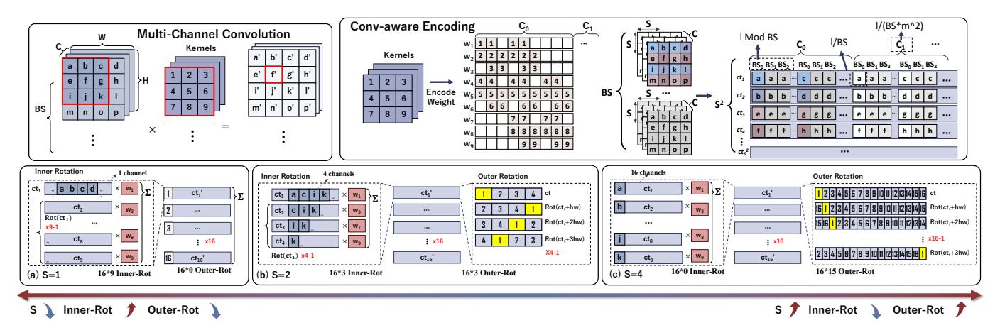

# IV. FEnc2 Framework Design

## A. Design Overview

Building on the aforementioned insights,  $FEnc^2$  provides a unified and automated framework that jointly addresses rotation minimization and slot utilization: two criteria that prior packing strategies optimize only in isolation. Rather than optimizing only the initial input packing or performing ad-hoc reorganization after each layer,  $FEnc^2$  leverages application-level structure (input layout, convolution patterns, and network topology) to generate packing schemes that remain efficient throughout end-to-end CNN inference.

At a high level, *FEnc*2 produces data layouts that (i) minimize rotation operations required for multichannel convolution, and (ii) maintain high slot utilization across layers even under feature expansion or reduction. This enables consistent SIMD throughput and controlled ciphertext growth, improving both latency and memory efficiency on HE accelerators.

 $FEnc^2$  consists of two complementary components:

- Conv-aware Encoding (§IV-B): a convolution-aware fragment encoding that theoretically minimizes rotation cost by partitioning and packing features into independent block-wise ciphertexts. Its generality and optimality are analyzed in §IV-B2. Table III also demonstrates its provable advantages over prior packing strategies in rotation complexity.
- Arch-aware Ct Compression (§IV-C): a cross-layer slotutilization optimizer that densifies sparsely filled ciphertexts via rotation-mask-add and scale-bit-aware ciphertext compression, enabling efficient processing after channel/feature expansion or reduction while preserving the packing format.

Together, they form a coherent pipeline that sustains optimal rotation complexity and high slot utilization across the entire network, delivering robust encrypted inference performance.

How  $FEnc^2$  is Used in Practice? We consider a standard cloud-based inference setting where the client holds **private** input data and the server hosts **pretrained plaintext CNN** models. As Fig. 3 shows, during initialization the client sends only non-sensitive metadata, input dimensions (H, W, C), batch size BS, and the model identifier. This information reflects only tensor shapes and reveals no semantic information about the client's actual input.

Using this metadata and the plaintext model,  $FEnc^2$  automatically determines (i) the optimal block size S for  $Convaware\ Encoding$  and (ii) the model specific layer-wise intermediate ciphertext compression strategy for Arch-aware  $Ct\ Compression$ . These decisions depend solely on tensor dimensions and convolutional structure.  $FEnc^2$  then returns an optimal index-slot mapping to the client.

The client locally performs CKKS encoding and encryption according to this mapping and sends *only ciphertexts* to the server. The client never observes model weights or intermediate activations, and the server never receives plaintext inputs. At runtime, the server executes the optimized HE-CNN circuit entirely over ciphertexts using CPUs, GPUs, or custom HE accelerators, without any data-dependent profiling or adaptation. *Because FEnc*2 *relies only on public metadata* and requires neither architecture modifications no runtime profiling, it provides a drop-in acceleration path for existing MLaaS deployments while preserving the standard CKKS semantic security guarantees.

Why FEnc2 is Hardware-Agnostic Yet Architecturally Transformative? FEnc2 operates entirely at the application level, using convolutional structure and model topology to reduce HE operation counts. Because its packing strategies depend only on tensor dimensions and network structure, not on GPU organization, memory hierarchy, or ASIC microarchitecture. FEnc2 is compatible with any CPU-, GPU-, FPGA-, or ASIC-based HE accelerator. At the same time, by substantially lowering ciphertext count, rotations, keyswitches, and NTTs (See Table V), it reshapes the computation and communication demands placed on hardware, yielding system-level benefits without requiring hardware changes.

Complementing Low-Level Primitive Acceleration. Prior HE accelerators typically optimize individual primitives such as NTT, keyswitching, or bootstrapping [34], [36], [40], [44]. These approaches improve per-kernel efficiency but cannot affect the number of primitives dictated by the HE-CNN computation graph. In contrast, *FEnc*2 reduces the *number* of required rotations, keyswitches, and NTTs across the network. This reduction is complementary to low-level acceleration: it lowers the workload presented to hardware, amplifying the

Fig. 4: Conceptual illustration of *Conv-aware Encoding* demonstrating its generality and optimality for input  $1 \times 16 \times 4 \times 4$  and convolution (16, 16, 3, 1) (BS=1). All ciphertexts are fully packed (16 slots). (a) S=1: non-optimal, no outer rotations (row-major/CHET, Orion-style [15], [18], [42]). (b) S=2: **optimal (ours)**, minimizing rotation cost by balancing inner and outer rotations. (c) S=4: non-optimal, no inner rotations and maximal outer rotations (CryptoNets-style [23]).

effects of optimized primitives and enabling larger end-to-end gains than primitive-level improvements alone.

Overall, *FEnc*2 provides an algorithmically driven architectural optimization that coexists naturally with existing accelerators, improving hardware utilization by structurally reducing HE workload at the source.

