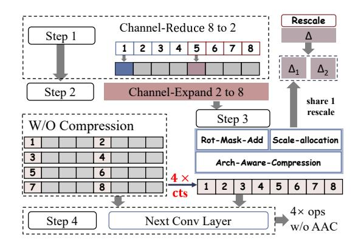

# Algorithm 1 Conv-aware Encoding

Given input feature maps  $X \in \mathbb{R}^{BS \times C \times H \times W}$  and block size S:

- 1) Step 1: Square padding. Compute  $M=\max(\mathrm{pad}(H),\mathrm{pad}(W))$  and zero-pad X to shape (BS,C,M,M).
- 2) Step 2: Block partition. Set m=M/S and partition each  $M\times M$  feature map into an  $m\times m$  grid of  $S\times S$  blocks.
- 3) Step 3: Fragment packing and encryption. For each intra-block coordinate (u,v) with  $0 \le u,v < S$ :
  - a) Collect element (u,v) from all  $m \times m$  blocks to form  $X_{(u,v)} \in \mathbb{R}^{C \times BS \times m^2}$
  - b) Flatten  $X_{(u,v)}$  into a 1D vector of size  $\frac{N}{2}$  by assigning each element  $X_{ijk}^{(u,v)}$

$$\begin{array}{l} X_{ijk}^{(u,v)} \longrightarrow \mathrm{slot}\ l, \\ \mathrm{where}\ i &= \left\lceil \frac{l}{BS \cdot m^2} \right\rceil, \quad j = l \bmod BS, \quad k = \left\lceil \frac{l}{BS} \right\rceil \bmod m^2. \end{array}$$

4) Step 4: Return the fully packed ciphertexts  $\{ct_{(u,v)}\}_{u,v}$ .

#### B. Conv-aware Encoding

As discussed in Section III, an optimal packing strategy must jointly minimize both inner and outer rotations; optimizing only one, as in prior studies, inevitably lead to suboptimal performance. Achieving such a global optimum requires coupling these two rotation costs within a rigorous, tractable formulation-an aspect not addressed in existing methods. *Conv-aware Encoding* addresses this challenge by introducing a 4D subblock-style data layout that deliberately decouples spatial dependencies according to convolutional kernel structure. By effectively leveraging this 4D structure-spanning batch, channel, and the feature map's height and width, and carefully tuning the block size, it balances innerand outer-rotation demands, enabling principled and near-optimal rotation complexity for HE convolution.

1) Unified Encoding Formulation: To achieve a unified encoding formulation that produces fully packed ciphertexts

while maintaining flexibility from the initial input stage, we represent the data as a 4D tensor  $X \in \mathbb{R}^{BS \times C \times H \times W}$ , corresponding to batch size, channels, and feature-map height and width. Algorithm 1 summarizes the packing procedure:

**Step 1**: zero-pad the input to a square size  $M = \max(\operatorname{pad}(H),\operatorname{pad}(W))$ ; **Step 2**: partition each feature map into an  $m \times m$  grid of  $S \times S$  blocks; **Step 3**: for each intrablock position (u,v), gather all elements at that position across all blocks into a tensor  $X_{(u,v)}$ , flatten it, and assign elements to ciphertext slots according to the mapping in Algorithm 1; **Step 4**: the fully-packed ciphertexts  $ct_{(u,v)}$  are generated.

Fig. 4 illustrates the encoding concept. For a  $2 \times 2$  block interacting with a  $3 \times 3$  kernel, neighboring pixels (e.g., a, b, e, f) are assigned to the same slot indices across distinct ciphertexts. Remaining slots are filled first with pixels from other samples (for batching) and then from other channels, if available. By tuning the block size S, Conv-aware Encoding balances innerand outer-rotation costs: smaller S reduces outer rotations by packing less channels together, while larger S reduces inner rotations by distributing pixels from the same kernel window across different ciphertexts. This principled tradeoff yields near-optimal rotation complexity for HE convolution (Section IV-B3).

**Generality:** Conv-aware Encoding provides a unified 4D-aware framework that encompasses prior HE packing schemes as special cases (non-optimal) and generalizes them. **Notably,** S=1,BS=1 recovers row-major encoding and its latest variants (e.g., Orion) [15], [18], [42], while S=M reduces to pixel-wise encoding (CryptoNets) [23]. Illustrative examples in Fig. 4 further demonstrate the impact of block size: (a) S=1 (row-major) yields zero outer rotations, (b) S=2 (ours-optimal) achieves minimal rotation cost by balancing inner and outer rotations, and (c) S=4 (pixel-wise) eliminates inner rotations but increases outer rotations.

This demonstrates that *Conv-aware Encoding* not only unifies and generalizes prior SOTA methods but also enables systematic, near-optimal HE-CNN inference through blocksize tuning and 4D layout exploitation.

2) Analytical Model of Rotation Complexity: Since the total rotation complexity depends critically on the block size S, we next present an analytical model to quantify and optimize the overall rotation complexity.

**Inner-rotation complexity.** Assuming full utilization of ciphertext slots at the initial packing stage, let the number of ciphertexts be  $N_{\rm in}/\alpha$ . We categorize the inner-rotation complexity based on the relationship between block size S and kernel size K:

- CASE 1: K > S. Adjacent sub-blocks overlap (Fig. 4 (a),(b)). In the worst case, each ciphertext requires  $(\lceil K/S \rceil^2 1)$  rotations to compute single-channel convolution results, compared to  $O(K^2 1)$  in prior methods.
- CASE 2:  $K \le S < M$ . The convolution kernel spans at most one block, so inner rotations are generally unnecessary. Only edge computations involve up to 4(S-1) rotations.
- CASE 3: S=M. When the block size equals the feature map size (Fig. 4 (c)), the encoding reduces to pixelwise encoding [23], where each pixel occupies a separate ciphertext. No inner rotations are required.

Hence the inner-rotation complexity can be expressed as:

$$Rot_{inner} = \begin{cases} \frac{N_{in}}{\alpha} \times (\lceil K/S \rceil)^2 - 1, K > S \\ \frac{N_{in}}{\alpha} \times {}^{4(S-1)/S^2}, K \le S < M \\ 0, S = M \end{cases}$$
(3)

Outer-rotation complexity. For inter-channel convolution, consider a convolutional layer with dimensions  $(N_{\rm in}, N_{\rm out}, K)$ . Given an input batch size BS and a chosen block size S, each ciphertext packs  $\frac{\alpha S^2}{BS}$  channels. Based on Figure 2, the corresponding outer-rotation complexity can be expressed as:

$$Rot_{outer} = \frac{N_{out}}{\alpha} \times (\frac{\alpha S^2}{BS} - 1) \tag{4}$$

**Total rotation complexity.** The overall rotation complexity can be expressed by combining inner- and outer-rotation contributions. We consider two primary scenarios based on the block size S and kernel coverage:

$$Rot_{total} = \begin{cases} \frac{BS}{\alpha} (\frac{4(S-1)}{S^2} N_{in} + (\frac{\alpha S^2}{BS} - 1) N_{out}), K \leq S < M \\ \frac{BS}{\alpha} ((\frac{K^2}{S^2} - 1) N_{in} + (\frac{\alpha S^2}{BS} - 1) N_{out}), K > S \end{cases}$$
(5)

**Special Case: Large Batch.** For batch inference with a sufficiently large BS, different inputs within the batch can be packed into ciphertexts instead of packing multichannel data from a single input. This completely eliminates the need for outer rotations, leaving only the inner-rotation cost:

$$Rot_{\text{amortized}} = \begin{cases} \frac{4(S-1)}{S^2} \frac{N_{in}}{\alpha}, & K \leq S < M \\ (\lceil \frac{K}{S} \rceil^2 - 1) \frac{N_{in}}{\alpha}, & S < K \end{cases} \tag{6}$$

As S increases, the amortized rotation complexity (a.k.a rotation per sample)  $Rot_{\rm amortized}$  decreases. We experimentally validate this special case in Section VI-B.

3) Theoretical Foundation for Minimal Rotation Cost: To determine the optimal block size S that minimizes rotation cost, we first constrain S to prevent inefficient ciphertext slot utilization in Conv-aware Encoding. Excessively large S with insufficient data (e.g.,  $S^2 > \frac{BS \cdot N_{in}}{\alpha}$ ) leaves many slots empty, wasting limited memory and SIMD parallel units. For example, a  $4 \times 4$  single-channel feature map with S = 2

TABLE III: Analytical Complexity Comparison (v.s. SOTAs)

| •                                   | Amortized Complexity                                                                                                                                                |
|-------------------------------------|---------------------------------------------------------------------------------------------------------------------------------------------------------------------|
| CHET HElayers Orion Hyena+ | $O(K^2 \cdot \alpha)$ $O((K^2 + K(M/t_1 + M/t_2)) \cdot \alpha/BS)$ $O(K^2 + K \cdot \alpha)$ $O(min((\alpha/BS)^2, 1)K^4 + min(\alpha/BS, 1) \cdot K^2))$ |
| Batchwise+ Ours-optimal             | $O(max(\frac{\alpha M^2}{BS}, N_{out})\lceil M^2/BS \rceil)$ $O(\sqrt{\frac{\alpha \cdot K^2}{BS}})$                                                             |
| ]                                   | HElayers Orion Hyena+                                                                                                                                         |

Table notes: Hyena+ prioritizes the batch dimension over the input channel dimension  $(\alpha)$  during packing, whereas HELayers and  $FEnc^2$  prioritize the batch dimension over both input pixels and input channels. Batchwise+ is much more complex than Hyena+, since the feature map size  $M^2\gg K^2$ ,  $K^4$  (e.g., M=32,K=3).

produces 4 densely packed ciphertexts, each with 4 slots, whereas S=4 results in 16 ciphertexts with only one pixel each, causing a  $3\times$  increase in Multiply-Accumulate (MAC) operations and  $4\times$  memory overhead due to only 25% slot utilization. To prevent this, S is upper-bounded by

$$S \le \sqrt{\frac{BS \cdot N_{in}}{\alpha}}. (7)$$

Within this bound, enlarging S reduces the inner-rotation complexity by  $\frac{1}{S^2}$  but increases the number of channels per ciphertext to  $S^2\alpha$ , raising outer-rotation overhead (Equation 4). This trade-off defines the optimal block size  $S^*$ .

**Theorem 1** (Optimal Block Size). Given a feature map size, encryption parameters, and CNN architecture, for Conv-aware Encoding with block size S and fully packed ciphertexts, the total rotation complexity per convolutional layer is minimized when  $\frac{K^2}{S^2} = \frac{\alpha \cdot S^2 \cdot N_{\text{out}}}{N_{\text{in}}}$ , which defines the optimal block size:

$$S^* = \lceil \left(\frac{K^2 N_{in}}{\alpha N_{out}}\right)^{1/4} \rceil \tag{8}$$

**Proof.** The inner-rotation term decreases with  $1/S^2$ , as each ciphertext packs only  $1/S^2$  of same-channel spatial correlated pixels, while the outer-rotation term increases proportionally with  $S^2\alpha$  due to inter-channel dependency. Based on Equation 5, the total rotation cost is the sum of a term decreasing in  $S^2$  and a term increasing in  $S^2$ . The minimum occurs when these two terms are equal by the Cauchy–Schwarz inequality, yielding the condition above. Solving it gives the optimal S. This establishes the theoretical optimum of S for minimal rotation complexity of Conv-aware Encoding across any CNN model, dataset, and encryption setting-without runtime profiling, and aligns with the empirical results in Table IX.

Analytical Complexity Comparison vs. SOTAs. Table III compares the amortized rotation complexity (per sample) of our optimal Conv-aware Encoding configuration  $(S = S^*)$ with prior packing schemes-CHET, HElayers, Orion, Batchwise+ and Hyena+, using their published analytical models. For single-image inference (BS = 1), our optimal encoding achieves the lowest asymptotic complexity, growing only linearly with the kernel size K, whereas prior schemes scale at least quadratically  $(K^2)$ , even quartically  $(K^4)$  for Hyena+. This extra  $K^2$  overhead arises because Hyena+ re-rotates the input ciphertext on the fly to sequentially generate  $K^2$  output pixels, whereas other packing schemes reuse multiple prerotated ciphertext copies stored in memory to enable parallel output-pixel generation. For Batchwise+, each ciphertext packs a single pixel across multiple channels, resulting in a sparse format (the slot number is often much larger than the batch size, e.g.  $2^{15} > 1024$ ) and increasing the ciphertext count by  $[M^2/BS] \times$  compared to other methods. Moreover, its rotation cost is suboptimal due to increased outer rotations from denser channel packing within each ciphertext. Overall, Batchwise+performs much worse than Hyena+, since  $M^2\gg K^2,K^4$  (e.g., M=32,K=3). This observation is well consistent with the Hyena paper [62] and our experimental results in Fig. 6. Under batch inference, the rotation complexity of HELayers, Batchwise+, Hyena+, and our *Conv-aware Encoding* further decreases as BS increases, benefiting from improved amortization across packed samples. Nonetheless, *Conv-aware Encoding* theoretically outperforms all existing schemes in both single-sample and batched settings, with advantages that become even more pronounced at large batch sizes. These analytical findings are corroborated by our measured results in Fig. 6 and Table V.

#### C. Arch-aware Ct Compression

While Conv-aware Encoding minimizes rotations by tuning S, it assumes ciphertexts remain densely packed-an assumption often violated in modern CNNs. Channel-reduction layers (e.g., 1×1 convolutions in MobileNet [28], SqueezeNet [31], and ResNet [27]) shrink intermediate featuremap channels, leaving many slots in HE-packed ciphertexts empty. Because CKKS applies SIMD operations across all slots, these sparse ciphertexts waste computation and require more ciphertexts in later layers. In a typical bottleneck, reducing channels from  $N_{in}$  to  $N_{DS}$  produces underutilized ciphertexts whenever  $N_{DS} < \alpha$ , where  $\alpha$  is the packing capacity per ciphertext. Passing such ciphertexts into the expansion layer activates only a fraction of the SIMD units, forcing additional ciphertexts and rotations to cover  $N_{out}$  output channels. As these lowutilization ciphertexts propagate through subsequent layers, both computation and memory costs grow unnecessarily.

To address this challenge, we introduce *Arch-aware Ct Compression* (AAC), an architecture-aware ciphertext compression mechanism that restores slot density whenever channel-reduction layers would otherwise create sparsity. AAC reshapes the ciphertext so that each ciphertext entering a convolution contains as many valid channels as possible, maximizing utilization and reducing the number of ciphertexts required downstream. Crucially, AAC operates without altering the packing format and adapts automatically to all intermediate shapes, preserving the rotation bounds established by *Convaware Encoding* and sustaining high-throughput HE execution under aggressive channel-reduction patterns.

AAC performs a lightweight merge that compacts the valid channels into a fully packed ciphertext before the next convolution. In the bottleneck example of Figure 5 (step 1 to step 3,  $8 \rightarrow 2 \rightarrow 8$  channels), the intermediate ciphertext after the  $1 \times 1$ reduction contains only 2 active channels and thus exhibits low slot utilization. AAC applies a small masked rotateand-add sequence to consolidate these channels into a dense ciphertext, enabling the subsequent expansion layer to generate all 8 output channels using only a single ciphertext. Without AAC, the same layer would require 4 sparse ciphertexts, each with only 25% utilization, incurring roughly 4× more HE computation in the next layer (Figure 5 step 4). While prior systems such as Fhelipe [45], Pantheon [5], and Coeus [6] use rot-mask-add patterns for data replication or communication efficiency, AAC repurposes this pattern specifically to preserve slot density across layer-wise dimension changes,

Fig. 5: Architecture-aware ciphertext compression. The example shows a bottleneck block  $(8 \rightarrow 2 \rightarrow 8 \text{ channels})$ , where AAC consolidates the reduced 2-channel ciphertext into a fully packed form before the expansion layer.

TABLE IV: The evaluated models and encryption parameters.

| Model      | # .  | Layers | 3   | N        | Accuracy (%)  | Dataset  | Kernel Size |
|------------|------|--------|-----|----------|---------------|----------|-------------|
| Model      | Conv | FC     | Act | 111      | Accuracy (76) | Dataset  | Kerner Size |
| LeNet      | 2    | 2      | 3   | $2^{15}$ | 98.95         | MNIST    | 5x5         |
| VGG5       | 4    | 1      | 4   | $2^{15}$ | 86.32         | CIFAR-10 | 3x3         |
| SqueezeNet | 10   | 10     | 10  | $2^{16}$ | 81.5          | CIFAR-10 | 3x3 & 1x1   |
| 1 ResNet18 | 17   | 1      | 17  | $2^{16}$ | 66.8          | ImageNet | 3x3 & 1x1   |
| MobileNet  | 55   | 1      | 55  | $2^{16}$ | 72.0          | ImageNet | 3x3 & 1x1   |

maintaining effective SIMD parallelism throughout the HE-CNN pipeline.

Notably, AAC introduces no additional multiplicative depth, even though it applies a plaintext mask. The key observation is that the mask does *not* require a higher plaintext scale than the convolution weights. In standard CKKS practice, each PMult uses a uniform scale  $\Delta$  (e.g., 40 bits) to meet precision requirements [42], [54], [57], regardless of the raw bit-width of the model parameters. Consequently, the two consecutive multiplications with the convolution weights and then by the AAC mask can share the same scale. As illustrated in Figure 5 step 3, the weight AAC mask is binary (0/1) and can be encoded at scale  $\Delta_1$  and  $\Delta_2$  separately so that  $\Delta_1 \cdot \Delta_2 = \Delta$  without inflating precision or noise. Thus, both multiplications can be followed by a *single* rescale applied only after the second multiplication. This avoids the extra multiplicative level that a naive rot-mask-add strategy would incur.

#### V. EVALUATION METHODOLOGY

**Environment:** We conduct our experiments on a machine equipped with an AMD Threadripper 3975WX@3.5 GHz CPU, 256GB 8-Channel RAM running at 3200MT/s, and an RTX A6000 GPU with 48GB RAM.

**Implementation:** We evaluate  $FEnc^2$  on the GPU backend using Liberate-FHE [17], an HE framework optimized for GPU execution. For deeper CNNs that require ciphertext refresh, we adopt the GPU-optimized bootstrapping from NEXUS [68], where each bootstrapping consumes 14 ciphertext levels.

ReLU layers are replaced with the standard polynomial approximation  $ax^2 + bx + c$  [42], [56]. For fully connected layers, we use diagonal-matrix multiplication with BSGS optimization following prior work [18]. Notably, our *Convaware Encoding* eliminates the need for the post-processing required in earlier schemes [43] when handling stride  $\geq 2$  convolutions or average pooling: stride is implemented simply by discarding the unused cts. This avoids introducing vacant slots and reduces unnecessary HE computation. Moreover, if a

Fig. 6: Latency/memory comparison between  $FEnc^2$  and SOTAs across various input/batch sizes, and model scales on GPU. Note that Batchwise+'s results (in blue color) are available for LeNet (a) and VGG5 (b), but not reported for SqueezeNet (c), ResNet (d), and MobileNet (e) since it exhausts GPU memory under all batch size settings.

subsequent convolution layer requires a different optimal block size S, we adapt the pre- or post-processing (rot-mask-add) operations to adjust block size, following techniques similar to HEAR [43]. This adjustment ensures that each layer is executed under its optimal rotation setting.

**Baselines:** We compare our method against four representative encrypted inference baselines: **CHET** [15], **HELayers** [4], and the recently proposed **Batchiwse+** [62], **Hyena+** [62] and **Orion** [18]. Specifically, CHET introduces Toeplitz-based HE convolutions to exploit SIMD parallelism. HELayers, Batchwise+ and Hyena+ reduce rotation cost through block tiling and multi-image packing. Orion further improves slot utilization and rotation efficiency using multi-channel packing with BSGS optimizations. Notably, Batchwise+ is also a variant when S=M with our *Conv-aware Encoding*.

Models and Datasets: We follow prior work [4], [15], [18], [49] and evaluate four representative models with their standard datasets: LeNet [15], [47] on MNIST [48], VGG5 [61] and SqueezeNet [31] on CIFAR10 [46], and ResNet18 [49] and MobileNet [28] on ImageNet [16]. Table IV summarizes the model structures and accuracies. Due to their higher computational depth, SqueezeNet, ResNet18, and MobileNet require bootstrapping, whereas LeNet and VGG5 do not require this step. To ensure a fair comparison, we adopt the bootstrapping placement of Orion [18] and the implementation of [68]; Our end-to-end timing measurements fully incorporate all bootstrapping overhead. Finally, we evaluate  $FEnc^2$  on ImageNet-scale encrypted inference (ResNet and MobileNet), representing one of the largest end-to-end homomorphic encryption workloads demonstrated to date and enabling a realistic assessment of secure deep learning at scale.

**Encryption Parameters.** Table IV provides the encryption parameters N used for evaluation each model adopted in RNS-CKKS. In our experiments, we use a fixed scale factor  $\Delta = 2^{40}$  (40 bits) for ciphertext encoding to maintain numerical precision, and select the appropriate ciphertext modulus Q to guarantee a security level  $\lambda \ge 128$  bits for all evaluated models, sufficient to withstand the known attacks in [7].

#### VI. EVALUATION

