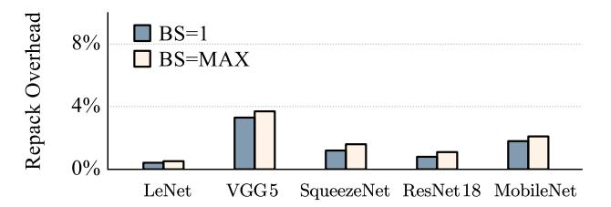

# B. Applicability of FEnc2 across Diverse CNN Configurations

In this section, we investigate how *FEnc*2 performs in different CNN models considering various block size selections. Fig. 7 compares the end-to-end latency under different block sizes across various CNN models and input resolutions.

Large batch size benefit significantly from larger block sizes. Across all five benchmarks, we consistently observe that the benefit of using a larger block size becomes more prominent as the batch size increases. For LeNet and VGG5, the latency gap between small blocks (S=1, 2) and a larger block size (S=4) widens substantially when batch size grows from 1 to 16, with S=4 giving the lowest latency at higher batch sizes. A similar pattern appears in SqueezeNet, where larger S provides minimal gains at batch size 1 but yields significant improvements at batch sizes 4 and 16. This trend is even clearer in ResNet18 and MobileNet: because their 224×224 feature maps incur higher inner-rotation cost, the reduction in rotation complexity brought by a larger block size only dominates when enough images are processed in parallel. Overall, larger batch sizes consistently amplify the advantage of larger block sizes, as the reduced inner-rotation overhead can be better amortized across more inputs.

The benefit of larger block sizes grows with feature-map resolution. For a fixed batch size, models with larger feature maps (e.g., the  $224 \times 224$  feature maps in ResNet and MobileNet) experience substantially greater latency reduction as the block size S increases. This is because, for large M, the computation is dominated by *outer rotations* across the feature map, while the *inner-rotation* cost becomes relatively negligible. Thus, increasing S decreases the number of blocks  $(m^2 = (M/S)^2)$ , directly reducing the total rotation overhead. This trend is prominent in both ResNet and MobileNet, where selecting  $S \in \{4,8\}$  consistently yields lower latency than configurations with smaller block sizes. In contrast, models with smaller feature maps (e.g., LeNet and VGG5, operating

TABLE VIII: CPU-side comparison with Orion at maximum supported batch size (256 GB memory).

| Model            | Method                                                                                             | Mem (GB) | Lat (s) | Speedup | Mem ↓ (%) |  |  |  |
|------------------|----------------------------------------------------------------------------------------------------|----------|---------|---------|-----------|--|--|--|
| LeNet            | Orion                                                                                              | 0.21     | 40.87   | -       | -         |  |  |  |
| LCIVCI           | FEnc 2                                                                                  | 0.013    | 0.18    | 226.06  | 98.49%    |  |  |  |
| VGG5             | Orion                                                                                              | 0.18     | 35.26   | -       | -         |  |  |  |
| V G G 5          | FEnc 2                                                                                  | 0.012    | 0.24    | 146.92  | 73.53%    |  |  |  |
| SqueezeNet       | Orion                                                                                              | 0.29     | 235.2   | -       | -         |  |  |  |
| Squeezeivei      | FEnc 2                                                                                  | 0.016    | 3.98    | 59.10   | 60.62%    |  |  |  |
| ResNet18         | Orion                                                                                              | 10.3     | 3930    | -       | -         |  |  |  |
| Resiretto        | FEnc 2                                                                                  | 1.51     | 442     | 8.93    | 87.13%    |  |  |  |
| MobileNet        | Orion                                                                                              | 8.11     | 3094    | -       | -         |  |  |  |
| Modificati       | FEnc 2                                                                                  | 1.21     | 328     | 9.43    | 85.08%    |  |  |  |
| Table meters Man | Table 11 to Man batch 11 1024 (LaNet) 1024 (VCC5) 512 (Superan Net) 16 (Den Net18) 16 (Mahila Net) |          |         |         |           |  |  |  |

Fig. 7: Sensitivity analysis of the block size S under different input sizes, model scales and batch sizes.

on  $28 \times 28$  or  $32 \times 32$  inputs) exhibit more moderate improvements; their rotation overhead is inherently smaller and less sensitive to variations in block count.

Larger convolution kernels amplify the effect of block-size scaling. Models with larger convolution footprints require more inner-rotations, making them more sensitive to fragment reduction. This trend is clearly reflected in LeNet (K=5), where the latency drops more noticeably as S increases (e.g., between S=1 and S=4 at batch size 1 and 16), compared to VGG5 (K=3), which exhibits a milder improvement across corresponding block sizes. The larger kernel introduces more rotation paths per ciphertext, and thus reducing the number of spatial fragments yields greater savings. Consequently, block-size scaling provides stronger benefits in models with larger convolution kernels.

Optimal Block Size Consistently Obtainable Across Benchmarks. We observe that for each evaluation case there exists a block size S that minimizes latency, and this optimal point shifts depending on feature-map size, kernel size, and batch size. It is consistent with our theoretical optimal block-size analysis (Section IV-B3). For lightweight models with small feature maps (e.g., LeNet, VGG5), the improvement from increasing S is marginal. In contrast, models with larger feature maps or larger kernels (e.g., ResNet18, MobileNet, LeNet) show a clear latency reduction as S increases, especially under larger batch settings. Overall, larger block sizes become increasingly advantageous when the computation becomes heavier, and the minimum latency is consistently achieved at a non-trivial S across all benchmarks.

Block size sensitivity to CNN layers. We also use a series of CNN layers with various input/output channel and kernel combinations to verify our optimal block size selection. Table IX shows our evaluation results with metrics including number of rotation (#Rot), amortized memory usage (per image), amortized latency (per image). We select 3 different block sizes for each convolution layer architecture benchmark -  $Conv(N_{in}, N_{out}, K)$  with corresponding feature map input. To get rid of the impact of ciphertext slot size, we fix the encryption parameter  $N=2^{15}$  here. According to our aforementioned analysis (Section IV-B3), the minimum rotation is achieved when  $\frac{K^2}{S^2} = \frac{\alpha \cdot S^2 \cdot N_{out}}{N_{in}}$ . At these optimal  $S^*$ , the #Rot is minimized with the lowest memory usage and latency. For example, Conv(128,32,9) with input feature map (8,128,32,32) achieves the minimum at S=3.57 theoretically, thus, in real systems we observe the minimum rotation when block size if set to 4. This observation is aligned with our expectation for the optimal block size  $S^*$  and justifies Eq. 8. Efficiency of Architecture-aware Ciphertext Compression

(AAC). We evaluate the effectiveness of our proposed Archaware Ct Compression. For this performance evaluation, we adopt two representative convolutional structures as benchmarks: residual-shortcuts from ResNet18 (also used in MobileNet) and the fire-modules from SqueezeNet. These architectures cover a range of design patterns and input dimensions, enabling a comprehensive evaluation of our compression strategy across various convolutional backbones. Table X shows the execution latencies and slot utilization of 4 fire modules in SqueezeNet and 4 residual-shorts in ResNet18 on a GPU. Within each fire module  $(N_{\rm in}, N_{\rm DS}, N_{\rm out})$ , the input channel  $N_{\rm in}$  is first reduced to a fixed intermediate width  $N_{\rm DS}=32$ , then expanded to half of the output channels via two parallel convolutions, and finally concatenated to form the final output. AAC significantly improves performance by 2.08× by maintaining intermediate cts in a format that maximizes slot utilization. In contrast, non-optimized cts without AAC suffer from increased slot wastage due to dimensional reductions at intermediate stages, leading to degraded slot utilization and higher per-layer latency. The observed speedup ranges from  $1.478 \times$  to  $4.68 \times$  across different layers.

For each residual shortcut module  $(N_{\rm in},N_{\rm DS},N_{\rm out})$ , the input  $N_{\rm in}$  is first projected to  $N_{\rm DS}$  using a  $1\times 1$  convolution, followed by a  $3\times 3$  convolution for transformation, and then expanded to  $N_{\rm out}$  by another  $1\times 1$  convolution. ciphertext-compression yields a total performance gain of  $1.636\times$  by maintaining efficient ciphertext packing throughout the intermediate stages. Without ciphertext-compression, the ciphertexts become increasingly underutilized as channel dimensions shrink, resulting in worse slot utilization and increased latency. In this case, the layer-wise speedup ranges from  $1.016\times$  to  $1.674\times$ . Although the improvement in slot utilization is less pronounced compared to the residual shortcut module, the fire module contains a consecutive  $3\times 3$  convolutional layer, which amplifies the redundancy caused by wasted slots. As a result, AAC achieves a higher latency improvement in this case.

TABLE IX: Block size v.s. various convolution settings.

| Layer $(N_{in}, N_{out}, K)$    | Block Size | #Rot | Amortized   | Amortized   |
|---------------------------------|------------|------|-------------|-------------|
| Input size $(BS, N_{in}, H, W)$ | S          | l "  | Memory (GB) | Latency (s) |
| Conv(64,64,3)                   | 1          | 176  | 0.38        | 0.73        |
| (4, 64, 32, 32)                 | 2          | 288  | 0.63        | 0.78        |
| (4, 04, 32, 32)                 | 4          | 1008 | 2.19        | 1.2         |
| Conv(64,64,3)                   | 1          | 288  | 0.31        | 0.62        |
| (8, 64, 32, 32)                 | 2          | 320  | 0.34        | 0.72        |
| (8, 64, 32, 32)                 | 4          | 992  | 1.08        | 1.12        |
| Conv(128,32,9)                  | 2          | 1648 | 1.79        | 1.89        |
| (8, 128, 32, 32)                | 4          | 1008 | 1.09        | 1.1         |
| (8, 128, 32, 32)                | 8          | 2224 | 2.42        | 1.34        |
| Conv(128,32,3)                  | 1          | 528  | 0.57        | 0.82        |
| (8, 128, 32, 32)                | 2          | 304  | 0.33        | 0.61        |
| (6, 126, 32, 32)                | 4          | 496  | 0.54        | 0.78        |
| Conv(32,128,3)                  | 1          | 192  | 0.21        | 0.76        |
| (8, 32, 32, 32)                 | 2          | 496  | 0.54        | 0.86        |
| (6, 32, 32, 32)                 | 4          | 1984 | 2.16        | 0.98        |

## Repack Overhead Across Benchmarks

Fig. 8: Repack overhead (normalized to total evaluation latency) across various benchmarks. BS = MAX for LeNet, VGG5, SqueezeNet, ResNet18 and MobileNet is 512, 512, 256, 16 and 16, respectively, under 48 GB memory capacity.

Repack Overhead Analysis. We evaluate the latency overhead of additional rot-mask-add operations introduced by AAC and repacking to optimize rotation complexity, shown in Figure 8. Specifically, under batch size 1, overhead ranges from 0.42% (LeNet) to 3.3% (VGG5), with a similar trend at each benchmark's respective maximum batch size (0.52%-3.7%). VGG5 incurs relatively higher overhead due to the more frequent feature map reduction (4/5 layers). While architectures like MobileNet (12/55) and SqueezeNet (2/10) require extensive AAC due to bottleneck modules, the absolute latency contribution of these operations remains marginal. This demonstrates that even for architectures with highly non-uniform layer structures, the overhead of our repacking strategy remains negligible compared to the substantial latency reduction achieved through rotation optimization. Overall, repacking consistently incurs only minimal overhead across all benchmarks.

Scalability Analysis. As Fig. 9 shows, we evaluate the scalability of our method with respect to input resolution and CNN model depth. When increasing the input size from  $224 \times 224$  to  $2048 \times 2048$ , the memory required by Orion grows steeply, whereas  $FEnc^2$  exhibits much slower growth thanks to Conv-aware Encoding with less amortized rotation cost. Similarly, when scaling from ResNet-18 to ResNet-110,  $FEnc^2$  consistently reduces latency with similar performance gap regardless of model depth. Overall,  $FEnc^2$  scales more gracefully to high-resolution inputs and larger CNN models.

#### VII. DISCUSSIONS

