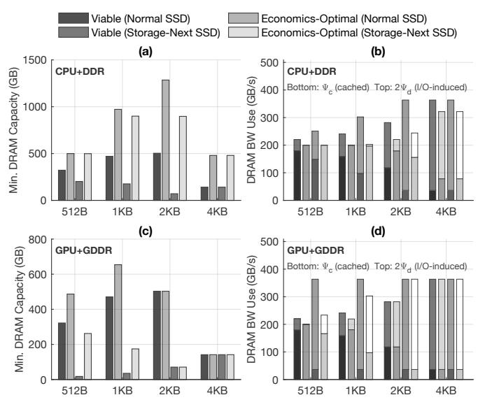
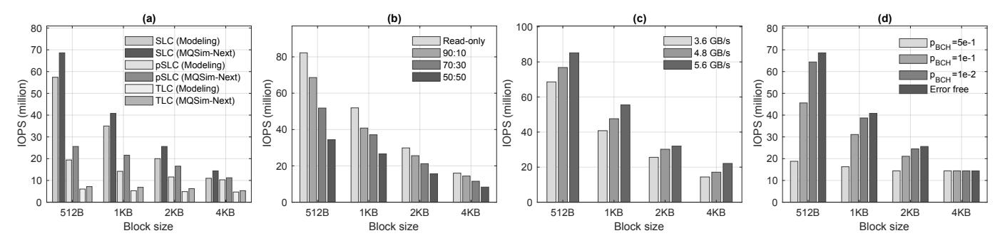
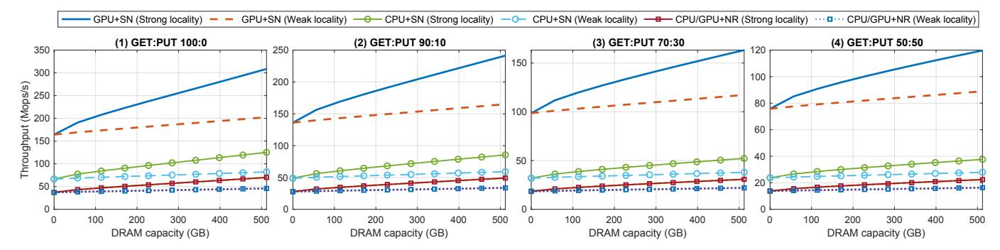
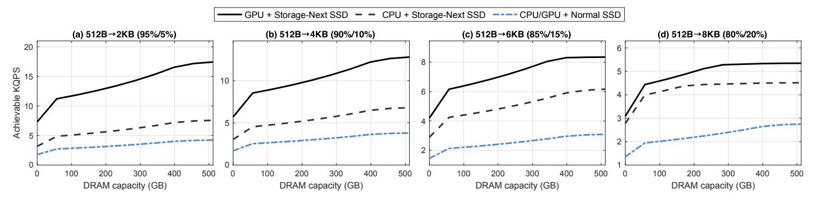
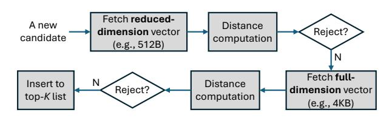

# A. Analysis Framework Development

For simplicity, we assume a single data access granularity  $l_{\rm blk}$ . Let  $N_{\rm blk}$  be the number of size- $l_{\rm blk}$  blocks in the working set (hence total size  $N_{\rm blk} \cdot l_{\rm blk}$ ). To capture the workload data access characteristics, let  $\tau_i$  denote the average access interval of block i, and define  $\mathcal{S}(T) = \{i: \tau_i \leq T\}$ , the set of blocks whose access intervals do not exceed T. The workload also provides mean/tail latency targets and a read:write ratio. A given hardware platform has fixed host-processor IOPS budget, per-SSD peak IOPS, number of SSDs, host-DRAM bandwidth and capacity, and component-cost structure. This work solely focuses on regimes where the working set is much larger than the host-DRAM capacity.

We assume optimal DRAM caching: every block cached in DRAM has a shorter access interval than any uncached block; equivalently, there exists a threshold T with cached set  $\mathcal{S}(T)$ . For any T, the aggregate cached and uncached access throughputs (bytes/s) are

$$\Psi_c(T) = l_{\text{blk}} \sum_{i \in \mathcal{S}(T)} \frac{1}{\tau_i}, \qquad \Psi_d(T) = l_{\text{blk}} \sum_{i \notin \mathcal{S}(T)} \frac{1}{\tau_i}.$$

We assume a zero-copy I/O stack to minimize I/O-induced host-DRAM traffic. Under this model, a DRAM cache miss incurs one SSD→DRAM DMA plus one DRAM read by the processor. The resulting host-DRAM bandwidth demand is

$$B_{\mathsf{DRAM}}^{\mathsf{use}}(T) = \Psi_c(T) + 2\,\Psi_d(T). \tag{4}$$

As T increases,  $\mathcal{S}(T)$  expands,  $\Psi_c(T)$  increases, and  $\Psi_d(T)$  decreases with  $\Psi_c(T) + \Psi_d(T) = l_{\text{blk}} \sum_i 1/\tau_i$  fixed; therefore  $B_{\text{DRAM}}^{\text{use}}(T)$  decreases strictly with T. We now define three thresholds,  $T_B$ ,  $T_S$ , and  $T_C$ , to isolate the impacts of DRAM bandwidth, SSD bandwidth, and DRAM capacity, respectively. Because  $\mathcal{S}(T)$  expands monotonically with T, the thresholds below are thus well defined and unique whenever a solution exists.

• DRAM bandwidth. The DRAM-bandwidth threshold  $T_B$  is the *smallest* access-interval threshold at which the required host-DRAM traffic does not exceed the DRAM bandwidth:

$$T_B \triangleq \min\{T > 0: B_{\mathsf{DRAM}}^{\mathsf{use}}(T) \le B_{\mathsf{DRAM}}\},$$
 (5)

where  $B_{\mathrm{DRAM}}$  denotes the host-DRAM bandwidth. Because  $B_{\mathrm{DRAM}}^{\mathrm{use}}(T)$  decreases strictly with T, the solution, when it exists, is unique, and an existence check is  $B_{\mathrm{DRAM}} \geq l_{\mathrm{blk}} \sum_i 1/\tau_i$ .

• SSD bandwidth. The SSD-bandwidth threshold  $T_S$  is the smallest threshold that confines the uncached throughput to the aggregate usable SSD bandwidth. Given the latency targets and the host-processor IOPS budget, the usable per-SSD IOPSSSD is obtained as in Section IV. We define

$$T_S \triangleq \min\{T > 0: \Psi_d(T) < B_{SSD}\},$$
 (6)

where  $B_{\rm SSD} = l_{\rm blk} \cdot N_{\rm SSD} \cdot {\rm IOPS_{SSD}}$  and  $N_{\rm SSD}$  is the number of SSDs. Since  $\Psi_d(T)$  decreases with T, the solution is unique. Scaling  $N_{\rm SSD}$ , selecting higher-IOPS devices, or increasing the host-IOPS budget raises  $B_{\rm SSD}$  and therefore reduces  $T_S$ .

• DRAM capacity. The capacity threshold  $T_C$  is the largest threshold whose cached set fits within available DRAM:

$$T_C \triangleq \max\{T > 0: |\mathcal{S}(T)| l_{\text{blk}} \le C_{\text{DRAM}} \}, \tag{7}$$

where  $C_{\text{DRAM}}$  denotes host-DRAM capacity. Ordering  $\{\tau_i\}$  increasingly and letting  $K = \lfloor C_{\text{DRAM}}/l_{\text{blk}} \rfloor$ ,  $T_C$  equals the K-th smallest  $\tau_i$ ; operationally, at most the K most frequently accessed blocks can be cached in DRAM.

If  $\max(T_B, T_S) \leq T_C$ , the platform is viable for the workload. When  $T_B = T_S$ , DRAM and SSD bandwidths are balanced. To minimize DRAM cost while maintaining viability, we should select  $C_{DRAM}$  so that  $T_C = \max(T_B, T_S)$ . The platform operates at the economics-optimal point if  $\tau_{\text{break-even}} \in [\max(T_B, T_S), T_C]$ . If this condition is not met, we should diagnose the limiting path and upgrade accordingly: when  $T_B > T_C \ge T_S$ , the system is DRAM-bandwidth limited and we should increase  $B_{DRAM}$ ; when  $T_S > T_C \ge T_B$ , the storage I/O path is limiting and we should raise the aggregate SSD throughput  $B_{SSD}$ , and/or increase the host IOPS budget if  $\mathrm{IOPS^{(peak)}_{proc}}$  is the sub-limiter. When both  $T_B$  and  $T_S$ exceed  $T_C$ , bandwidth and capacity are jointly insufficient, so we should either increase  $C_{DRAM}$  until  $T_C \ge \max(T_B, T_S)$ or reduce  $max(T_B, T_S)$  through bandwidth upgrades, with the choice guided by a price model or stated priority. After any upgrade, we should recompute  $\tau_{\text{break-even}}$ ; if  $\tau_{\text{break-even}} \notin$  $[\max(T_B, T_S), T_C]$ , the configuration remains viable but off the optimum, and we should further adjust the limiting resources to bring the break-even placement within reach.

#### B. Quantitative Study

Extending the study in Sections III-IV, we demonstrate the workload-aware platform analysis framework on CPU+DDR and GPU+GDDR platforms. For CPU+DDR platform, we set 12 channels of DDR5-5600 (hence total 540GB/s DRAM bandwidth); for GPU+GDDR platform, we set 8 channels of GDDR6-20 (hence total 640GB/s DRAM bandwidth). We set the peak CPU IOPS capacity to 100M and peak GPU IOPS capacity to 400M. Each platform deploys four SSDs, and we consider both normal SLC SSD and Storage-Next SLC SSD. We adopt 99th-percentile read-latency constraint of  $13\mu s$  (512B),  $17\mu s$  (1KB),  $26\mu s$  (2KB), and  $44\mu s$  (4KB), corresponding to SSD IOPS utilization  $\rho_{\text{max}}$  of 90% as shown above in Section IV. Given the target workload, we aim to make each hardware platform viable (and economics-optimal if practically possible) by provisioning the DRAM capacity  $C_{DRAM}$ . Since DRAM capacity now is a variable, we only need to calculate the metrics  $T_B$  and  $T_S$ . Accordingly, we obtain  $T_v = \max(T_B, T_S)$  as the viability threshold, and  $C_{\text{DRAM}}^{(V)} = |\mathcal{S}(T_v)| \cdot l_{\text{blk}}$  represents the minimum DRAM capacity for making the hardware platform viable. Given the breakeven interval  $\tau_{\text{break-even}}$ , we obtain  $T_o = \max(\tau_{\text{break-even}}, T_v)$  as the economics-optimal threshold, and  $C_{\mathrm{DRAM}}^{(0)} = |\mathcal{S}(T_o)| \cdot l_{\mathrm{blk}}$ 

represents the minimum DRAM capacity for making the hardware platform economics-optimum.

We assume the workload's access intervals follow a lognormal distribution with total throughput  $l_{\text{blk}} \sum_{i} 1/\tau_i$  of 200GB/s, comparable to the host DRAM bandwidth. The dataset contains one billion blocks, yielding total sizes of 512GB, 1TB, 2TB, and 4TB for block sizes of 512B, 1KB, 2KB, and 4KB, respectively. Fig. 6 shows the minimum DRAM capacities  $C_{\mathrm{DRAM}}^{(\mathrm{V})}$  and  $C_{\mathrm{DRAM}}^{(\mathrm{O})}$  and corresponding DRAM bandwidth usage. In Fig. 6(b) and (d), each bar shows I/O-induced bandwidth for uncached data (top) and cached data (bottom), corresponding to  $2\Psi_d(T)$  and  $\Psi_c(T)$  in Eq. 4. Some bars, such as the economics-optimal case under normal SSD at 512B on CPU+DDR, contain only one component because the DRAM already holds the full dataset, eliminating I/O traffic. Overall, as DRAM capacity increases, more data remain resident, misses decline, and I/O-induced bandwidth drops; with less DRAM, a larger uncached set drives more SSD accesses and higher bandwidth demand.

Fig. 6: Minimum DRAM capacity required for the CPU+DDR or GPU+GDDR hardware platform to be viable or economics-optimal, and the corresponding DRAM bandwidth usage.

On the CPU+DDR platform, whether paired with a normal SSD or a Storage-Next SSD, the break-even interval  $\tau_{be}$  is consistently longer than  $T_v = \max(T_B, T_S)$ . Consequently, the economics-optimal DRAM capacity is set by  $\tau_{be}$ , not by viability. At 512B and 1KB block sizes,  $\tau_{be}$  is so large that achieving the economics optimum requires caching essentially the entire dataset (about 512GB and 1TB, respectively) in DRAM. As block size increases,  $\tau_{be}$  decreases, so the economics-optimal cache constitutes a smaller fraction of the dataset. Because DRAM bandwidth comfortably exceeds the workload bandwidth, we have  $T_v = T_S$ , i.e., SSD IOPS, not DRAM bandwidth, determines the minimum DRAM capacity needed for viability. This explains why the viable DRAM

capacity is lower with Storage-Next SSDs: their higher IOPS reduce  $T_S$  and therefore the required cache for viability.

On the GPU+GDDR platform with Storage-Next SSDs, both  $T_B$  and  $T_S$  are small (<5s) thanks to high GDDR bandwidth, large GPU IOPS capacity, and high usable SSD IOPS. Consequently, the viable DRAM requirement is low—especially at small block sizes, so the workload can remain viable while a larger share of traffic is serviced as I/O through GDDR. By contrast, the economics-optimal DRAM at 512B and 1KB can be much larger because the break-even interval dominates; the cost-optimal point therefore caches a substantial portion of the working set (e.g., 260GB on GPU+GDDR). At 2KB and 4KB,  $\tau_{be}$  shortens and  $T_S$  becomes the governing term, so the viable and economics-optimal DRAM capacities coincide. In short, Fig. 6 highlights the fundamental advantage of combining GPUs with Storage-Next SSDs: both viability and (often) economics-optimal operation are achievable with far less DRAM than CPU+DDR.

### VI. MQSim-Next: Storage-Next SSD Simulator

To study the Storage-Next regime with realistic fidelity, we extend MQSim [9], [47] into MQSim-Next, preserving its validated foundations (e.g., PCIe/TLP and FTL/cache timing, request-fetch control, and steady-state preconditioning), while modernizing its NAND back-end. Specifically, we incorporate three key upgrades reflecting contemporary device practice: First, we add SCA [33] on the NAND channel, so command/address movement incurs a much shorter per-command cost; this sustains effective channel bandwidth as request sizes shrink and mirrors current device practice. Second, we add the support of independent multi-plane reads [24], [43], which can much better exploit intra-die parallelism in modern NAND flash. Third, we add the support of explicit transfersense overlap, allowing array sensing/programming for one request to proceed concurrently with command/address or data movement for another. Together they align MQSim-Next with modern NAND timing and concurrency. The back-end scheduler is correspondingly enhanced with read-prioritized, plane-aware arbitration, allowing short reads to overlap long programs and interleaving SCA bursts before data transfer to maximize small-I/O utilization.

Another key enhancement is an explicit, configurable ECC model. Conventional SSDs protect data in 4KB codewords, flattening random-IOPS for ≤4KB requests because each small read triggers a full-page decode and transfer. To reach Storage-Next small-block IOPS, MQSim-Next adopts a two-layer concatenated code [32], [34]: a BCH inner code per 512B sector and an LDPC outer code spanning eight sectors. Reads touching only a subset of sectors decode the necessary BCH words and skip the LDPC, eliminating intra-SSD read amplification; any BCH failure escalates to a full 4KB LDPC decode that adds transfer and iterative-decode latency. A tunable BCH-error probability parameter allows users to explore small-read tail latency and ECC-induced amplification effects.

We further extend MQSim-Next to support a much larger number of I/O queues, enabling full random-IOPS extraction

Fig. 7: (a) Comparison of modeled and simulated IOPS under 90:10 read-to-write ratios, (b) simulated SLC SSD IOPS under different read-to-write ratios, (c) simulated SLC SSD IOPS under different NAND channel bandwidths, and (d) simulated SLC SSD IOPS under different BCH decoding failure rates,  $p_{\rm BCH}$ .

under deep host parallelism. The simulator is configured using Table I parameters and a Gen7  $\times 8$  PCIe link3. Fig. 7 compares the analytic model and MQSim-Next. The two align closely, with MQSim-Next reporting slightly higher IOPS due to a conservative write-amplification factor ( $\Phi_{WA} = 3$ ) in the model. Both assume a controller-nonlimiting setup, so observed limits stem from NAND and channel behavior. As shown in Fig. 7(b), IOPS decreases from 82M (read-only) to 68M (90:10), 52M (70:30), and 34M (50:50) as GC traffic competes with host I/O. In Fig. 7(c), increasing channel bandwidth raises IOPS from 68M at 3.6GB/s to 85M at 5.6GB/s, highlighting the benefit of wider channels or stacked I/O such as Xtacking [21]. Fig. 7(d) shows that 512B BCH failures triggering 4 KB LDPC decodes reduce throughput modestly, remaining near the error-free plateau for <1% failure rate. Overall, MQSim-Next reproduces the modeled trends (i.e., workload mix, channel bandwidth, and ECC sensitivity) validating the analytical framework and establishing a reliable foundation for the feasibility and design-space studies that follow.

#### VII. RE-THINK DATA-INTENSIVE SOFTWARE (RQ4)

By collapsing the DRAM-SSD caching threshold to seconds, Storage-Next SSDs enable a fundamental rethink of algorithm and data-structure design. Two principles guide this shift: (1) re-architect algorithms to exploit ultra-high random IOPS at small block sizes, favoring fine-grained access and concurrency; and (2) leverage flash's far lower \$/GB than DRAM to use sparse or over-provisioned structures when they improve speed or simplicity, even at higher space cost. Guided by these ideas, this section presents two case studies, i.e., KV (key-value) store and ANN (approximate nearest neighbor) search, to demonstrate practical paths to high throughput and simpler, data-intensive software.

**Methodology for case studies.** The case-study results in this section are obtained by combining the analytical framework developed in Sections III, IV, and V with device-level characterization from MQSim-Next (Section VI). Specifically, MQSim-Next is used to extract peak SSD IOPS and latency

behavior under the configurations in Table I, including block size, read/write ratio, channel bandwidth, and ECC parameters. These device-level characteristics are then incorporated into the analytical feasibility framework to determine usable IOPS under host and tail-latency constraints. Application behavior (e.g., GET:PUT ratios, reuse-interval distributions, and locality profiles) is modeled using calibrated synthetic traces consistent with the workload assumptions described in each case study. The analytical model determines platform-level break-even and feasibility thresholds, while MQSim-Next provides realistic device behavior to anchor these evaluations.

### A. Case Study 1: SSD-Resident KV Store

KV stores anchor modern AI stacks, powering feature lookups in recommenders, embedding caches, LLM memory layers, and session-state in serving pipelines. These workloads often involve billions of unique keys with sparse, unpredictable access patterns. To meet throughput, many systems use in-memory KV stores (e.g., Redis [2], FASTER [7], MICA [31]) with hash indexing for low latency and simplicity, but the DRAM footprint becomes economically untenable at scale. This has driven interest in hybrid DRAM/SSD engines (e.g., RocksDB [3], [13], WiredTiger [4], Bw-tree [30]) that embrace block I/O and tree-like indexing. However, even these hybrid designs often retain substantial DRAM-resident indexing and metadata (e.g., hash directories, filters, block catalogs) to keep lookup latency acceptable, which grows with key cardinality and still limits capacity per dollar. We distinguish these classical KV stores from LLM KV tensor caches used in attention layers. KV tensor caches typically operate at much coarser granularities (e.g., 32-64KB blocks) and are primarily bandwidth-bound rather than IOPS-bound. In contrast, the workloads considered here emphasize smallblock, IOPS-sensitive access patterns common in control-plane state, embedding lookups, long-context reasoning metadata, and agentic execution pipelines. Notably, in the coarse-grained KV tensor regime, the economic break-even interval becomes even shorter than the seconds-scale result derived for small blocks, further strengthening the case for NAND flash as an active tier.

&lt;sup>3Chosen to prevent PCIe bandwidth from bottlenecking 4KB IOPS as NAND channel bandwidth scales from 4.8GB/s to 5.6GB/s.

Fig. 8: Achievable operational throughput of SSD-resident blocked-Cuckoo KV store under different GET:PUT ratio and DRAM capacity. Storage-Next SSDs and normal SSDs are denoted as SN and NR, respectively.

Building on Storage-Next context, we propose an SSDnative KV store that instantiates a blocked Cuckoo hash table [27], [41] on SSDs, eliminating any DRAM-resident index or metadata. Unlike Meta's hash-based CacheLib [1], [6] that discards entries when buckets overflow, we target a persistent KV store that must not drop items, so we adopt Cuckoo hashing, using relocations rather than discards to handle bucket overflows. Each key maps to two candidate SSD-resident buckets, and each bucket matches to one SSD block. Each lookup requires one or two SSD block reads (on average 1.5). To avoid insertion failure, the load factor  $\alpha$  must remain below the critical threshold  $\alpha_{\rm critical}$  determined by the bucket size  $B = |l_{blk}/l_{KV}|$ , where  $l_{blk}$  is the SSD block size and  $l_{KV}$  is the average KV-pair size (e.g., 64B). Prior work [27], [41] shows that even for modest  $B \geq 4$ ,  $\alpha_{\text{critical}}$  typically exceeds 0.95. Insertions may trigger short displacement chains whose expected length can be estimated  $\frac{\alpha^{2B}}{1-\alpha^{B}}$ , so operating well below  $\alpha_{\text{critical}}$  keeps  $\mathbb{E}[L] \ll 1$ , yielding nearly constant insertion latency. We dedicate all available DRAM to caching individual hot KV pairs. We use an SSD-resident write-ahead log (WAL) for persistence and to amortize write cost by consolidating updates that target the same hash bucket. When the WAL exceeds a size threshold, the system commits the consolidated updates into blocked-Cuckoo hash blocks and then recycles the freed log space.

For demonstration, we evaluate throughput in a realistic large-scale setup: a 5TB KV store with 80 billion 64B items, load factor 0.7, and bucket sizes matched to device class (512B on Storage-Next SSDs, 4KB on normal SSDs). All DRAM is devoted to caching hot KV pairs. We considered four different GET:PUT ratios (100:0, 90:10, 70:30, and 50:50), with 20% of PUTs as inserts and the rest updates. Access intervals follow a log-normal distribution under two locality regimes: strong ( $\sigma=1.2$ ) and weak ( $\sigma=0.4$ ). Hardware matches prior sections: CPU+DDR or GPU+GDDR, where CPU and GPU IOPS capacities are 100M and 400M, and DDR and GDDR bandwidths are 540GB/s and 640GB/s, respectively. Each platform uses four SSDs (either Storage-Next or normal), with SSD bandwidth utilization capped at 70% to reduce tail latency. Fig. 8 reports simulated achievable throughput under

both device/host-IOPS and DRAM-bandwidth bounds. With normal SSDs the system is device-limited, so CPU and GPU collapse into a single curve. Reported throughput includes both DRAM-served cache hits and SSD-served misses; the implied SSD IOPS demand is therefore scaled by the cachemiss fraction. The results show clear dependence on data access locality and GET:PUT ratio: strong locality extracts more value from added DRAM capacity because the cache captures a larger hot set, converts more data accesses into cache hits, and collapses distinct KV pair updates and hence SSD read-modify-write operations per WAL flush. In contrast, as the write share grows, the system issues more read-modify-write operations to SSD, increasing I/O traffic and reducing the operational throughput.

Pairing GPUs with Storage-Next SSDs (GPU+SN) is especially advantageous. On read-heavy mixes, GPU+SN sustains 100+ Mops/s, comparable to in-memory KV stores such as FASTER [7]. Switching to a CPU with the same Storage-Next SSDs shifts the bottleneck to host IOPS, so throughput falls even though the Storage-Next SSD can deliver more. Across the GET:PUT mixes, DRAM bandwidth becomes the limiting factor only when cache-hit rates are very high; otherwise host IOPS and SSD throughput dominate. In summary, the combination of GPUs & Storage-Next proves essential for realizing the vision of a fully SSD-resident KV store built on blocked-Cuckoo hashing. By exploiting both the parallelism of GPUs and the IOPS scalability of next-generation SSDs, it transforms NAND flash memory from a passive storage tier into an active, memory-like substrate capable of sustaining inmemory-class KV store throughput.

#### B. Case Study 2: SSD-Resident ANN Search

ANN search is a cornerstone of modern AI services, e.g., recommendation and retrieval-augmented generation (RAG), yet modern workloads often involve TB/PB-scale embedding corpora, well beyond feasible DRAM capacity. Prior SSD-resident systems [16], [22] trade search quality to accommodate low IOPS of conventional SSDs. GPUs paired with Storage-Next SSDs enable a rethink of SSD-resident ANN search. Motivated by widespread use of *dimensionality reduction* in DRAM-resident ANN [11], [14], [15], [29], we propose

Fig. 10: ANN search throughput under different full-vector length with reduced-vector length fixed as 512B.

a *two-stage progressive* SSD-resident design (Fig. 9). Each embedding is stored on SSDs in both a reduced-dimension form (e.g., 512B) and a full-dimension form (e.g., 4KB). At query time, reduced vectors are fetched first to prune unlikely candidates; only a small filtered set is then re-ranked using full vectors. This is effective because most distance computations simply confirm rejection: Gao et al. [15] report that over 90% of comparisons eliminate candidates, so full-dimension evaluation is often unnecessary. Reduced vectors can come from (1) linear transforms such as PCA or random projection [11], [14], [48], (2) a dual-model embedding pipeline, or (3) Matryoshka Representation Learning (MRL) [29], which natively supports multi-resolution vectors. On three MRL-generated corpora (MS MARCO, 20 Newsgroups, DBpedia), our experiments show the progressive scheme sustains recall >98%.

Fig. 9: Illustration of two-stage progressive ANN search.

The two-stage scheme benefits directly from Storage-Next SSDs: because most accesses hit reduced-dimension vectors, the workload issues predominantly small-block random reads (e.g., 512B), which unlocks very high IOPS and lifts endto-end throughput. For demonstration, consider an 8 billionembedding corpus with full-dimension sizes of 2KB, 4KB, 6KB, and 8KB, respectively, while fixing the reduced dimension at 512B. We focus on HNSW (Hierarchical Navigable Small World) [35], widely used in state-of-the-art ANN search. To improve scalability, we co-locate graph-link metadata with each node on SSD and devote available DRAM to caching the hotter upper-layer nodes. HNSW concentrates traversal by layer: layer sizes shrink rapidly with height, per-query visits per layer also decline (though more slowly), and thus per-node access intervals shorten at higher layers, making them DRAMcache friendly. We evaluate using a calibrated, layer-aware synthetic trace that mirrors HNSW's coarse-to-fine pipeline. Under full-dimension sizes of 2KB, 4KB, 6KB, and 8KB, roughly 5%, 10%, 15%, and 20% of candidates are promoted to full-vector re-ranking, respectively. In this regime, reduced-vector fetches are IOPS-bound and benefit most from Storage-Next SSDs, while the small promoted fraction is bandwidth-bound yet amortized by the large rejection rate.

Fig. 10 shows simulated ANN search throughput (KQPS) versus DRAM capacity under four reduced→full vector configurations. We use the same GPU+GDDR and CPU+DDR platforms as before, each with four SSDs. Across all scenarios, GPU with Storage-Next SSDs achieves the highest KQPS. In lighter-promotion cases, i.e., (a)  $512B\rightarrow 2KB$  (95%/5%) and (b)  $512B\rightarrow 4KB$  (90%/10%), the GPU setup remains SSD-IOPS-limited, rising from 7-11 KQPS at small DRAM to 13-17 KQPS at 512GB as caching reduces SSD reads. CPU+Storage-Next lies below, capped by the CPU's 100M IOPS budget. The Normal SSD baseline is always SSDlimited. As the promotion rate increases, DRAM traffic grows and bandwidth ceilings appear. In (c)  $512B\rightarrow 6KB$  (85%/15%), GPU+Storage-Next becomes DRAM-bandwidth-limited beyond 400GB (plateauing near 8.3 KQPS), while the CPU remains host-IOPS-limited (up to 6.2 KOPS). In the heaviest mix (d)  $512B\rightarrow 8KiB$  (80%/20%), GPU+Storage-Next hits the DRAM-bandwidth limit near 300GB, and the CPU transitions from mixed to fully bandwidth-limited beyond 200GB. Overall, Storage-Next SSDs deliver a consistent 2-3× throughput advantage over Normal SSDs: small-block IOPS dominate at low caches, GDDR bandwidth sets the high-cache plateau. and host IOPS capacity determines how much of the SSD's potential is realized.

Overall, these results show that pairing GPU hosts with Storage-Next SSDs makes low-cost fully SSD-resident ANN practical. TB/PB-scale embedding tables can remain on flash while sustaining high recall and high KQPS, avoiding the large DRAM capacity required for in-memory retrieval. For context, DiskANN [22], an SSD-resident system from Microsoft that constructs a pruned on-disk graph and streams neighbor lists, achieves roughly 5 KQPS on billion-scale benchmarks. On our modeled hardware, the GPU+Storage-Next configuration pushes this boundary toward tens of KQPS4. This indicates

&lt;sup>4Our results are illustrative and model-based, not a direct performance comparison with DiskANN.

that the memory hierarchy in the Storage-Next era can match or exceed DiskANN-class throughput while retaining HNSWlevel search quality.

