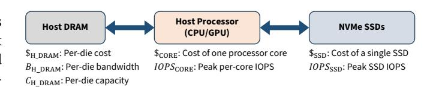
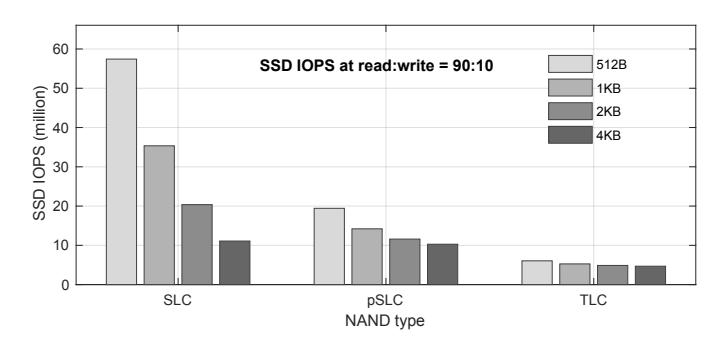
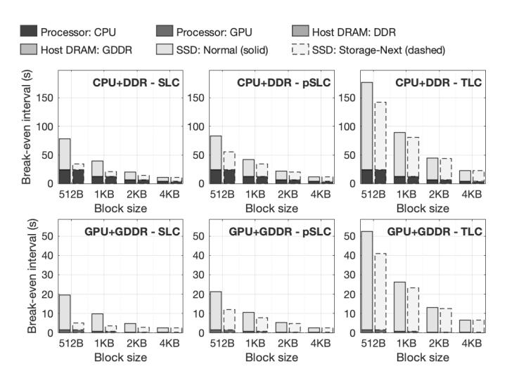

# III. CALIBRATED ECONOMIC MODEL (RQ1)

This section grounds the break-even rule in a calibrated economics view: make host I/O costs explicit, and use architecture-derived SSD IOPS from a first-principles device model. We then present a quantitative case study showing that, under realistic configurations, GPUs paired with Storage-Next SSDs have shrunk the DRAM-flash break-even from minutes toward seconds; feasibility limits (processor IOPS and latency targets) are added in Section IV.

#### A. System Model and Calibrated Economic Break-even

Fig. 1 presents a first-order host-device view of the I/O path: a host processor (CPU or GPU), a directly attached, multichannel DRAM subsystem, and NVMe SSDs. We assume an

optimal zero-copy read path [25] to minimize host DRAM bandwidth usage by avoiding extra kernel $\leftrightarrow$ user copies. Now consider an  $l_{\text{blk}}$ -byte block accessed periodically with reuse interval  $\tau_{\text{intvl}}$ . Absent caching in host DRAM, the system repeatedly retrieves this block from the SSD, incurring cumulative cost across the following three components:

Fig. 1: Simplified system architecture used to derive the new break-even interval formulation.

Host processor cost: Each I/O involves driver-level work such as queue management and interrupt handling. Given the percore IOPS capacity of  $IOPS_{CORE}^1$  and per-core cost  $\$_{CORE}$ , we can express the cost on host processor as  $\frac{\$_{CORE}}{IOPS_{CORE}} \cdot \frac{1}{\tau_{intvl}}$ .

Host DRAM bandwidth cost: Each I/O transfers  $l_{\text{blk}}$  bytes into host DRAM, consuming the DRAM bandwidth. We model its cost as  $\frac{l_{\text{blk}} \$_{\text{H_DRAM}}}{B_{\text{H_DRAM}}} \cdot \frac{1}{\tau_{\text{intvl}}}$ , which is appropriate for bandwidth-bound systems common in modern AI infrastructure. If bandwidth is ample and capacity is the constraint, a capacity-based DRAM cost model would be more appropriate.

**SSD access cost**: Given its cost of \$ssd and peak IOPS of  $IOPS_{SSD}$ , the access cost on SSD is  $\frac{\$_{SSD}}{IOPS_{SSD}} \cdot \frac{1}{\tau_{intvl}}$ .2

Therefore, if we cache a data block being accessed with an interval of  $\tau_{intvl}$  in DRAM, we can express the saved cost as:

$$\$_{\rm saving} = \left( \tfrac{\$_{\rm CORE}}{IOPS_{\rm CORE}} + \tfrac{l_{\rm blk} \cdot \$_{\rm H\_DRAM}}{B_{\rm H\_DRAM}} + \tfrac{\$_{\rm SSD}}{IOPS_{\rm SSD}} \right) \cdot \tfrac{1}{\tau_{\rm intvl}} \ .$$

By caching the block in host DRAM, the system avoids this recurring cost. However, doing so requires reserving a portion of host DRAM capacity over time, which incurs a "rent":

$$\$_{\text{rent}} = \frac{l_{\text{blk}}}{C_{\text{H\_DRAM}}} \cdot \$_{\text{H\_DRAM}}.$$

The break-even interval  $\tau_{\text{break-even}}$  is the access interval at which the memory rent equals the cost saved by avoiding repeated I/O operations. Solving  $\$_{\text{rent}} = \$_{\text{saving}}$  yields:

$$\tau_{\text{break-even}} = \left(\frac{\$_{\text{CORE}}}{IOPS_{\text{CORE}}} + \frac{l_{\text{blk}} \cdot \$_{\text{H} \, \text{DRAM}}}{B_{\text{H}, \text{DRAM}}} + \frac{\$_{\text{SSD}}}{IOPS_{\text{SSD}}}\right) \cdot \frac{C_{\text{H} \, \text{DRAM}}}{l_{\text{blk}} \cdot \$_{\text{H}, \text{DRAM}}} \,. \tag{1}$$

We note that the numerator has units of \$/IO, while the denominator represents \$/MB amortized over capacity, so  $\tau_{\rm break-even}$  has units of time, as expected. This calibrated formulation preserves Gray's intuition: balance the DRAM "rent" against the cost of serving accesses from storage. It (i) explicitly

 $^{1}$ For simplicity, we assume  $IOPS_{CORE}$  is independent of the workload's read-to-write ratio; processing read and write requests incurs similar processor overhead.

2Consistent with the classical economic-only view, we assume the host can fully utilize the SSD's peak random IOPS for given data access block size and read-to-write ratio. Later sections incorporate hardware and workload constraints that bound usable IOPS and can change the effective cost.

charges I/O-induced host resources, and (ii) replaces datasheet peaks with SSD performance and cost derived from device behavior. Thus, it offers a more accurate economic criterion for deciding when DRAM caching is justified. In this model,  $IOPS_{\rm SSD}$  and  $\$_{\rm SSD}$  are parameters rather than constants; Section III-B derives them from first principles using a device-level SSD model.

#### B. First-Principles SSD Modeling

We adopt a first-principles model of SSD performance and cost grounded in NAND device architecture. As illustrated in Fig. 2, an SSD consists of a controller, SSD-internal DRAM for the FTL (flash translation layer), and a NAND subsystem. The channel command time  $\tau_{\rm CMD}$  denotes bus occupancy per command; in conventional NAND with an 8-bit shared command/data bus,  $\tau_{\rm CMD}\approx 1.2\,\mu {\rm s}$  [40], whereas modern devices employ the SCA I/O protocol to reduce it to 100-200ns [33], improving effective bandwidth. We model performance from sensing, programming, and command latencies, and omit erase operations since each erase clears megabytes of data and contributes negligibly in steady state. For broader background on SSD and NAND flash technology, see [10], [36].

Fig. 2: SSD architecture with key parameters for modeling performance and cost.

In our first-principles model, peak SSD performance is bounded by NAND parallelism, channel bandwidth, controller address translation bandwidth, and PCIe packet rate limits. For tractability, all host-issued requests use the same block size  $l_{\rm blk}.$  Let  $IOPS^{\rm (peak)}_{\rm NAND}$  denote the maximum IOPS deliverable by a single NAND die, and  $IOPS^{\rm (peak)}_{\rm CH}$  the maximum IOPS sustainable by a single channel. With  $N_{\rm CH}$  channels and  $N_{\rm NAND}$  dies per channel, we can formulate the memory-device-limited IOPS  $IOPS^{\rm (peak)}_{\rm dev}$  as

$$IOPS_{\text{dev}}^{(\text{peak})} = \frac{\Gamma_{\text{Rw}} + 1}{\Gamma_{\text{Rw}} + 2\Phi_{\text{Wa}} - 1} \cdot N_{\text{CH}} \cdot \min \left( N_{\text{NAND}} \cdot IOPS_{\text{NAND}}^{(\text{peak})}, \ IOPS_{\text{CH}}^{(\text{peak})} \right),$$

where  $\Gamma_{\rm RW}$  denote the read-to-write ratio and  $\Phi_{\rm WA} \geq 1$  captures write-amplification caused by background garbage collection (GC). We further define  $IOPS_{\rm xlat}^{\rm (peak)}$  as the maximum IOPS supported by controller address translation bandwidth, and  $IOPS_{\rm pcie}^{\rm (peak)}$  as the maximum IOPS supported by the PCIe packet rate. Accordingly, the overall peak SSD IOPS is

$$IOPS_{\mathrm{SSD}}^{(\mathrm{peak})} = \min \left( IOPS_{\mathrm{dev}}^{(\mathrm{peak})}, IOPS_{\mathrm{xlat}}^{(\mathrm{peak})}, IOPS_{\mathrm{pcie}}^{(\mathrm{peak})} \right). \tag{2}$$

Formulation of  $IOPS_{\mathrm{NAND}}^{\mathrm{(peak)}}$ : Since a physical page must be programmed as a unit, the controller coalesces host random writes into full-page sequential writes. Thus, within one program interval  $\tau_{\mathrm{prog}}$ , a die can commit  $N_{\mathrm{Plane}} \cdot l_{\mathrm{PG}}/l_{\mathrm{blk}}$  blocks. For reads, within one sense interval  $\tau_{\mathrm{sense}}$ , a die can fetch  $N_{\mathrm{Plane}}$  blocks. Combining the workload read-to-write ratio  $\Gamma_{\mathrm{RW}}$  and intra-SSD write amplification  $\Phi_{\mathrm{WA}}$ , we have that, the read fraction is  $R_r = (\Gamma_{\mathrm{RW}} + \Phi_{\mathrm{WA}} - 1)/(\Gamma_{\mathrm{RW}} + 2\Phi_{\mathrm{WA}} - 1)$  and the write fraction is  $R_w = \Phi_{\mathrm{WA}}/(\Gamma_{\mathrm{RW}} + 2\Phi_{\mathrm{WA}} - 1)$ . Hence, the per-die peak IOPS is

$$IOPS_{\rm NAND}^{\rm (peak)} = R_r \cdot \frac{N_{\rm Plane}}{\tau_{\rm sense}} \; + \; R_w \cdot \frac{N_{\rm Plane} \cdot l_{\rm PG}}{\tau_{\rm prog} \cdot l_{\rm blk}} \; . \label{eq:IOPS}$$

Formulation of  $IOPS_{\text{CH}}$ : With channel bandwidth  $B_{\text{CH}}$ , reading a size- $l_{\text{blk}}$  block occupies the channel for  $\tau_{\text{R}} = \tau_{\text{CMD}} + l_{\text{blk}}/B_{\text{CH}}$ , so one channel can deliver up to  $1/\tau_{\text{R}}$  read IOPS. A program transfers a full physical page of size  $l_{\text{PG}}$ , occupying the channel for  $\tau_{\text{W}} = \tau_{\text{CMD}} + l_{\text{PG}}/B_{\text{CH}}$ . Each program commits  $l_{\text{PG}}/l_{\text{blk}}$  blocks, so each channel can support up to  $l_{\text{PG}}/(l_{\text{blk}} \cdot \tau_{\text{W}})$  write IOPS. Hence, the peak IOPS sustainable by each channel is

$$IOPS_{\text{CH}}^{(\text{peak})} = R_r \cdot \frac{1}{\tau_{\text{CMD}} + \frac{l_{\text{blk}}}{B_{\text{CH}}}} + R_w \cdot \frac{1}{\frac{l_{\text{blk}}}{l_{\text{pc}}} \tau_{\text{CMD}} + \frac{l_{\text{blk}}}{B_{\text{CH}}}}$$

Formulation of  $IOPS_{\mathrm{xlat}}^{\mathrm{(peak)}}$ : Each random request requires a logical-to-physical address translation in the FTL. If each FTL entry is  $b_{\mathrm{FTL}}$  bytes and  $B_{\mathrm{SSD\_DRAM}}$  denotes the bandwidth of the SSD-internal DRAM storing FTL metadata, then under the conservative assumption of no translation-cache hits, the translation-bandwidth-limited peak IOPS is

$$IOPS_{\mathrm{xlat}}^{(\mathrm{peak})} = \frac{B_{\mathrm{SSD\_DRAM}}}{b_{\mathrm{FTL}}}.$$

With  $b_{\rm FTL}=8{\rm B}$  per mapping entry and a controller DRAM bandwidth of  $B_{\rm SSD\_DRAM}=40{\rm GB/s}$ , we obtain  $IOPS_{\rm xlat}^{\rm (peak)}\approx 5{\rm G}$  IOPS, well above the NAND/channel-limited peak in our evaluated Storage-Next configurations (tens of millions of IOPS).

Formulation of  $IOPS_{\text{pcie}}^{(\text{peak})}$ : At small block sizes, the PCIe link may be limited either by aggregate bandwidth or by packet-processing rate. Let  $B_{\text{PCIe}}$  denote the effective PCIe bandwidth,  $PPS_{\text{host}}$  the maximum packet rate supported by the PCIe root complex, and  $n_{\text{pkt}}(l_{\text{blk}})$  the number of PCIe transactions required to serve a request of size  $l_{\text{blk}}$ . The interconnect-limited peak IOPS is therefore

$$IOPS_{\text{pcie}}^{(\text{peak})} = \min\left(\frac{B_{\text{PCIe}}}{l_{\text{blk}}}, \frac{PPS_{\text{host}}}{n_{\text{pkt}}(l_{\text{blk}})}\right).$$
 (3)

For a representative PCIe Gen7 x4 link with nominal bandwidth  $B_{\rm PCIe} \approx 64 {\rm GB/s}$ , the first bandwidth-limited term is over 120M, well above the 50M-class NAND/channel peak studied in this work. For the second packet-rate term, sustaining 50M IOPS requires  $PPS_{\rm host} \geq 50 {\rm M} \cdot n_{\rm pkt} (512 {\rm B})$ . In our evaluated configurations that have fine-grained I/Os, the NAND channel I/O rate limitations are significantly more stringent than the bandwidth of the device's interface to the PCIe.

As shown in Fig. 2, the total SSD cost aggregates the controller, all the NAND dies, and the SSD-internal DRAM used primarily for FTL:

$$\$_{SSD} = \$_{CTRL} + N_{CH} \cdot N_{NAND} \cdot \$_{NAND} + N_{S\_DRAM} \cdot \$_{S\_DRAM}$$
.

Here  $N_{\rm S\_DRAM}$  is the number of SSD-internal DRAM dies. If each FTL entry is  $b_{\rm FTL}$  bytes (e.g., 4-8 bytes) and the minimum access granularity is 512B, the maximum FTL size is

$$C_{\rm FTL} = \frac{N_{\rm CH} \cdot N_{\rm NAND} \cdot C_{\rm NAND}}{512 {\rm B}} \cdot b_{\rm FTL} \, . \label{eq:cftl}$$

Given the capacity per DRAM die  $C_{\rm S\_DRAM}$ , the required SSD-internal DRAM die count is

$$N_{\text{S\_DRAM}} = \left\lceil \frac{C_{\text{FTL}}}{C_{\text{S\_DRAM}}} \right\rceil = \left\lceil \frac{N_{\text{CH}} \cdot N_{\text{NAND}} \cdot C_{\text{NAND}} \cdot b_{\text{FTL}}}{512 \text{B} \cdot C_{\text{S\_DRAM}}} \right\rceil.$$

These formulations make explicit how SSD IOPS and cost scale with architectural choices and operating parameters, and they expose the coupling between performance and capacity. Unlike vendor specifications that reflect a few fixed configurations, this first-principles model supports architecture-aware reasoning across a broad design space and workload settings.

#### C. Quantitative Study

To clarify the origin of the "Storage-Next" IOPS values used throughout this paper, we emphasize that they are not vendorprojected datasheet numbers. Instead, they are derived directly from the formulations presented in Sec. III-B, using representative NAND timing and architectural parameters summarized in Table I for three NAND types: (i) SLC (1bit/cell) devices optimized for low latency and high IOPS (e.g., Kioxia XL-Flash [46] and Samsung Z-NAND [8]); (ii) TLC (3bits/cell) operated in pseudo-SLC (pSLC) mode; and (iii) standard TLC. For example, under the SLC configuration in Table I ( $\tau_{\text{sense}} =$  $5 \,\mu\mathrm{s}, \ \tau_\mathrm{prog} = 50 \,\mu\mathrm{s}, \ N_\mathrm{Plane} = 6, \ N_\mathrm{CH} = 20, \ N_\mathrm{NAND} = 4,$  $B_{\rm CH}=3.6\,{\rm GB/s},\, \tau_{\rm CMD}=150\,{\rm ns}),\,{\rm and\,\,assuming}\,\,\Gamma_{\rm RW}=90{:}10$ and  $\Phi_{WA}=3$ , the model yields  $\mathrm{IOPS_{SSD}^{(peak)}}\approx57M$  at 512B and  $IOPS_{SSD}^{(peak)} \approx 11M$  at 4KB. The high small-block IOPS arises from the combination of short sensing latency, intradie multi-plane parallelism, and channel bandwidth that scales approximately as  $B_{\rm CH}/l_{\rm blk}$  for small blocks when  $\tau_{\rm CMD}$  is reduced via SCA. Therefore, the 50M-class IOPS regime at 512B used in our Storage-Next configuration reflects a direct first-principles evaluation of NAND timing and architectural parallelism, rather than an assumed external projection.

The sensing and programming latencies and the multiplane organization parameters in Table I (e.g.,  $\tau_{\rm sense}$ ,  $\tau_{\rm prog}$ ,

TABLE I: Key SSD parameters. SLC timing values are representative of low-latency NAND devices (e.g., XL-Flash [46], Z-NAND [8]).  $\tau_{\rm CMD}$  reflects SCA protocol timing [33].  $l_{\rm PG}$  and interface bandwidth follow ONFI specifications [40]

|                                         | $\tau_{\rm sense}$ | $\tau_{\texttt{F}}$ | orog                | $l_{\rm PG}$ | ì | $N_{\mathrm{Plane}}$ | $C_{NAND}$       |
|-----------------------------------------|--------------------|---------------------|---------------------|--------------|---|----------------------|------------------|
| SLC                                     | $5 \mu \mathrm{s}$ | 50                  | ) μs                | 4KI          | В | 6                    | 32GB             |
| pSLC                                    | $20\mu\mathrm{s}$  | 150                 | $0  \mu \mathrm{s}$ | 16K          | В | 4                    | 42GB             |
| TLC                                     | $40\mu\mathrm{s}$  | 1ms                 |                     | 16KB         |   | 4                    | 128GB            |
| $\tau_{\mathrm{CMD}}$ $B_{\mathrm{CH}}$ |                    |                     | $N_{\rm CH}$        |              | 1 | V NAND    | $C_{\rm S~DRAM}$ |
| 150ns                                   | 3.6GB              |                     |                     |              |   | 3GB                  |                  |

and  $N_{\text{Plane}}$ ) are representative of published 3D-NAND device characterizations and independent multi-plane implementations (e.g., [8], [23], [43]), and reflect contemporary lowlatency NAND designs. We demonstrate the framework with a quantitative study of break-even intervals across realistic system configurations. In this study, we fix  $\Gamma_{RW} = 90:10$ , reflecting read-heavy AI workloads, and conservatively set  $\Phi_{WA} = 3$ . Fig. 3 shows peak IOPS for SLC, pSLC, and TLC across 512B-4KB blocks. As Eq. 2 indicates, overall SSD IOPS is bounded by the smaller of the device limit  $IOPS_{\mathrm{NAND}}^{\mathrm{(peak)}}$ and the channel limit  $IOPS_{\mathrm{CH}}^{\mathrm{(peak)}}$ . The device term depends mainly on  $\tau_{\text{sense}}$  and  $\tau_{\text{prog}}$  and varies only weakly with  $l_{\text{blk}}$ ; the channel term depends strongly on  $l_{blk}$  and, with small  $\tau_{CMD}$ , scales roughly as  $B_{\rm CH}/l_{\rm blk}.$  For TLC, long  $\tau_{\rm sense}$  and  $\tau_{\rm prog}$  keep  $IOPS_{\rm NAND}^{\rm (peak)}$  low, so the device side limits IOPS for all  $l_{\rm blk}$ , producing only slight variation with block size. For SLC, very short  $\tau_{\rm sense}$  and  $\tau_{\rm prog}$  raise  $IOPS_{\rm NAND}^{({\rm peak})}$ ; small blocks are devicelimited, while larger blocks become channel-limited, yielding a strong, though not perfectly proportional, increase of IOPS as  $l_{\text{blk}}$  decreases. pSLC falls between SLC and TLC across all sizes. Storage-Next SSDs are designed to exploit this regime: they provide scalable small-block IOPS, especially with SLC or pSLC, whereas conventional SSDs remain nearly flat at ≤4KB due to 4KB-oriented ECC/controller architecture.

Fig. 3: Storage-Next SSD peak IOPS under different configurations and workload read-to-write ratio of 90:10.

To further demonstrate that the "50M-class" small-block regime is not tied to a single parameter point, we perform a brief sensitivity sweep over three primary architectural knobs in Eq. 2: the number of channels ( $N_{\rm CH}$ ), dies per channel ( $N_{\rm NAND}$ ), and per-command overhead ( $\tau_{\rm CMD}$ ). Table II reports the resulting peak IOPS for the SLC configuration

under the same workload parameters as Fig. 3 ( $\Gamma_{RW}=90:10$ ,  $\Phi_{WA}=3$ ). Across pessimistic-to-optimistic settings, 512B peak IOPS remains in the tens-of-millions range, indicating that the key small-block scaling trend (and the resulting seconds-scale implications studied in later sections) is robust to moderate variation of these design parameters. Because the break-even expressions depend primarily on IOPS/\$ rather than any single knob, these variations shift absolute thresholds but do not revert the qualitative finding that modern small-block IOPS can push the DRAM $\leftrightarrow$ flash boundary into the seconds regime.

TABLE II: Sensitivity of peak SSD IOPS (SLC) to architectural scaling knobs. All other parameters follow Table I.

| Setting            | $N_{\mathrm{CH}}$ | $N_{\rm NAND}$ | $\tau_{\mathrm{CMD}}$ | IOPS@512B | IOPS@4KB |
|--------------------|-------------------|----------------|-----------------------|-----------|----------|
| Pessimistic        | 16                | 3              | 200ns                 | 39.4M     | 8.5M     |
| Baseline (Table I) | 20                | 4              | 150ns                 | 57.4M     | 11.1M    |
| Optimistic         | 24                | 5              | 100ns                 | 79.3M     | 13.8M    |

Since Eq. 1 includes costs in both numerator and denominator, we normalize all components to the NAND-die cost for fair comparison. Let  $\alpha_{CTRL}$ ,  $\alpha_{S\_DRAM}$ ,  $\alpha_{H\_DRAM}$ , and  $\alpha_{CORE}$ denote normalized costs of the SSD controller, SSD-internal DRAM, host DRAM, and host cores. Table III lists values for CPU+DDR and GPU+GDDR platforms. All numbers derive from manufacturing parameters (e.g., die area and process node), rather than market price, avoiding buyer bias. DDR and NAND have comparable die areas, so DDR's cost is set to 1, GDDR to 2 due to higher pin counts and tighter thermal limits. Based on internal design data,  $\alpha_{CTRL} = 15$ (reflecting controller complexity on 12–7 nm nodes). A serverclass CPU core has cost 4 with 1M IOPS/core, while a GPU SM has cost 3 with 4M IOPS/SM, following NVIDIA's SCADA (SCaled Accelerated Data Access) platform [37] on the NVIDIA Hopper generation of GPUs. Though actual prices vary, this normalized model provides a consistent, architecturebased basis for comparison.

TABLE III: Normalized cost and performance parameters under different compute+memory configurations.

| Platform | $\alpha_{\text{H\_DRAM}}$ | $B_{\mathrm{H\_DRAM}}$ | $C_{\mathrm{H\_DRAM}}$ | $\alpha_{\mathrm{CORE}}$ | $IOPS_{CORE}$ | $\alpha_{\mathrm{CTRL}}$ | $\alpha_{\text{S\_DRAM}}$ |
|----------|---------------------------|------------------------|------------------------|--------------------------|---------------|--------------------------|---------------------------|
| CPU+DDR  | 1                         | 3 GB/s                 | 3 GB                   | 4                        | 1M            | 15                       | 1                         |
| GPU+GDDR | 2                         | 80 GB/s                | 2 GB                   | 3                        | 4M            | 15                       | 1                         |

We then compute the break-even intervals shown in Fig. 4. For each block size, the left bar represents the *Normal-SSD* baseline (flat IOPS for  $\leq 4$  KB), and the right bar the *Storage-Next SSD* whose IOPS increases as block size shrinks. Following Gray's formulation, we assume full utilization of peak SSD IOPS, i.e.,  $IOPS_{SSD} = IOPS_{SSD}^{(peak)}$  in Eq. 1. Each stacked bar decomposes the interval into processor, DRAM, and SSD components, revealing how architectural and device parameters shape placement decisions. As NAND sensing latency grows from  $5\mu s$  (SLC) to  $40\mu s$  (TLC), SSD IOPS/\$ drops and its share in total cost rises. Larger block sizes yield shorter intervals due to higher DRAM "rent": under SLC on CPU+DDR, the interval decreases from  $\sim 34s$  at 512B to  $\sim 10s$  at 4KB. GPU platforms show much shorter intervals; for SLC

at 512 B, the break-even time falls from  $\sim$ 34s (CPU+DDR) to  $\sim$ 5s (GPU+GDDR), a 7× reduction. Across all block sizes, Storage-Next SSDs consistently outperform Normal-SSDs for sub-4 KB requests, with the largest gaps in SLC devices where small-block IOPS scaling dominates. These results confirm that a first-principles framework, grounded in device physics rather than vendor specs, better captures cost-performance trade-offs. Storage-Next SSDs with scalable IOPS cut the break-even interval from minutes to seconds, reaching single digits on GPU platforms, and elevate NAND flash to an active tier of the memory hierarchy. All timing and bandwidth parameters used in this section are grounded in published device characterizations and interface specifications, and can be re-parameterized as technologies evolve. The SSD-only component shown in Fig. 4 corresponds to the classical Gray analysis but with drastically different cost parameters, such that the effective break-even threshold drops dramatically.

Fig. 4: Break-even interval across configurations. Each stack shows contributions from host processor, DRAM, and SSD.

