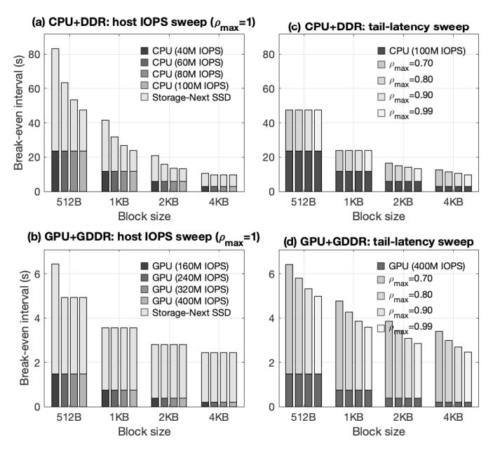

# IV. CONSTRAINT-AWARE BREAK-EVEN (RQ2)

The calibrated economic model above assumes, as in the original 5-minute rule, that system fully utilizes SSD's peak IOPS. Here, we relax this assumption and make the break-even analysis feasibility-aware by introducing two practical constraints that bound usable SSD IOPS: (i) application-level read latency and (ii) the platform's total host IOPS capacity.

To model latency constraints, we treat each NAND flash channel as an M/D/1 queue [20], [28], where read requests follow a Poisson process, service time is deterministic, and one channel serves a single request at a time. Given the peak SSD IOPS  $IOPS_{\rm SSD}^{\rm (peak)}$  (see Eq. 2) and  $N_{\rm CH}$  channels, the perchannel service time is  $N_{\rm CH}/IOPS_{\rm SSD}^{\rm (peak)}$ . We further include NAND sensing latency and define the channel utilization as  $0 \le \rho \le 1$ ; the mean read latency is then expressed as

$$\tau_{\rm mean}(\rho) = \frac{N_{\rm CH}}{IOPS_{\rm SSD}^{\rm (peak)}} \cdot \frac{\rho}{2(1-\rho)} + \tau_{\rm sense} \,. \label{eq:taumout}$$

Following Kingman's heavy-traffic limit [20], [26], the waiting time is well-approximated by an exponential distribution, hence we can approximate the *p*-th percentile tail-latency as

$$\tau_{\rm p}(\rho) = \frac{N_{\rm CH}}{IOPS_{\rm SSD}^{({\rm peak})}} \cdot \frac{\rho}{2(1-\rho)} \cdot \ln\left(\frac{1}{1-p}\right) + \tau_{\rm sense} \,. \label{eq:tau_p}$$

Let  $\{\hat{\tau}_{\text{mean}}, \hat{\tau}_p\}$  denote the application-level constraints on mean and p-th percentile tail read latency. Given  $\{\hat{\tau}_{\text{mean}}, \hat{\tau}_p\}$ , we solve for the largest  $\rho \in (0,1)$  (denoted as  $\rho_{\text{max}}$ ) that satisfies  $\tau_{\text{mean}}(\rho_{\text{max}}) \leq \hat{\tau}_{\text{mean}}$  and  $\tau_p(\rho_{\text{max}}) \leq \hat{\tau}_p$ . Accordingly, we have that the usable SSD IOPS is  $IOPS_{\text{SSD}} = \rho_{\text{max}} \cdot IOPS_{\text{SSD}}^{(\text{peak})}$ . In essence, the scaling factor  $\rho_{\text{max}}$  reflects the impact of application-level read latency constraints on the usable SSD IOPS. Moreover, let  $IOPS_{\text{proc}}^{(\text{peak})}$  denote the maximum total IOPS that the host processor can practically sustain, we can further calibrate the usable SSD IOPS as

$$IOPS_{\text{SSD}} = \min \left( \rho_{\text{max}} \cdot IOPS_{\text{SSD}}^{(\text{peak})}, IOPS_{\text{proc}}^{(\text{peak})} / N_{\text{SSD}} \right),$$

where  $N_{\rm SSD}$  is the number of SSDs. Fig. 5 extends the quantitative study in Section III-C under the feasibility constraints discussed above in this section. We focus on SLC NAND and Storage-Next SSDs (scalable small-block IOPS). Because device service time depends on block size, we specify a separate 99th-percentile read-latency target for each block size, denoted  $\tau_{\rm tail\_512B}$ ,  $\tau_{\rm tail\_1KB}$ ,  $\tau_{\rm tail\_2KB}$ ,  $\tau_{\rm tail\_4KB}$ . For simplicity, we do not set any constraint on mean read latency. Table IV gives four tail-latency tiers chosen so that 512B, 1KB, 2KB, and 4KB all admit the same  $\rho_{\rm max} \in \{0.70, 0.80, 0.90, 0.99\}$ . We assume the host drives four SSDs and sweep CPU capacities  $IOPS_{\rm proc}^{\rm (peak)} \in \{40{\rm M}, 60{\rm M}, 80{\rm M}, 100{\rm M}\}$  (guided by  $\sim 1{\rm M}$  IOPS/core) and GPU capacities  $IOPS_{\rm proc}^{\rm (peak)} \in \{160{\rm M}, 240{\rm M}, 320{\rm M}, 400{\rm M}\}$  (guided by  $\sim 4{\rm M}$  IOPS/SM).

TABLE IV: 99th-percentile tail latency tiers per block size (Storage-Next SSD with SLC NAND), chosen to equalize the admissible utilization  $\rho_{\rm max}$  across block sizes.

| / Hax                   |                        |                        |                        |                  |  |  |
|-------------------------|------------------------|------------------------|------------------------|------------------|--|--|
| $\tau_{\rm tail\_512B}$ | $\tau_{\rm tail\_1KB}$ | $\tau_{\rm tail\_2KB}$ | $\tau_{\rm tail\_4KB}$ | $\rho_{\rm max}$ |  |  |
| $7\mu s$                | $9\mu s$               | $11\mu s$              | $16\mu s$              | 70%              |  |  |
| $9\mu s$                | $11\mu s$              | $15\mu s$              | $23\mu s$              | 80%              |  |  |
| $13\mu s$               | $17\mu s$              | $26\mu s$              | $44\mu s$              | 90%              |  |  |
| $85\mu s$               | $135\mu s$             | $230\mu s$             | $418\mu s$             | 99%              |  |  |

a) Impact of host IOPS capacity: Fig. 5(a)-(b) show the effect of the host-side IOPS ceiling  $IOPS_{\rm proc}^{\rm (peak)}$  without latency limits ( $\rho_{\rm max}=1$ ). In the host-limited regime, increasing  $IOPS_{\rm proc}^{\rm (peak)}$  lets more requests be served within the host's budget, shortening the break-even interval. Once the SSD peak  $IOPS_{\rm SSD}^{\rm (peak)}$  becomes the bottleneck, further increases have no effect. The transition from host- to device-limited behavior depends on both the host budget and block size, since Storage-Next SSD IOPS drop with larger blocks. For example, at 512B on CPU+DDR, raising the CPU budget from 40M to 100M IOPS reduces the interval from 83s to 47s, whereas at 4KB it remains near 10s, indicating a device limitation. GPUs, with far higher  $IOPS_{\rm proc}^{\rm (peak)}$ , operate almost entirely in the device-limited regime and, due to better IOPS/\$, sustain shorter intervals, well below 7s across all block sizes.

Fig. 5: (a) and (b): break-even interval under different host processor IOPS capacity without latency constraint; (c) and (d) break-even interval under different tail latency constraints with fixed processor IOPS capacity.

b) Impact of latency constraint: Fig. 5(c)-(d) hold the host budgets fixed (CPU: 100M IOPS; GPU: 400M IOPS) and vary only the 99th-percentile tail-latency tier from Table IV. Tightening the tier (moving from the 99% row toward 90–70%) lowers the admissible SSD IOPS utilization  $\rho_{\rm max}$  and hence usable SSD IOPS, leading to a longer break-even interval. Conversely, when the fixed host budget is already the limiter for a given block size, adjusting the tail tier has little or no effect (e.g., 512B and 1KB on CPU+DDR platform). Quantitatively, the sensitivity to tail latency is modest: for 512B on GPU+GDDR, relaxing the 99th-percentile from  $7\mu s$  to  $85\mu s$  reduces the break-even interval by only about 1.5s.

In summary, host processor IOPS capacity is the dominant factor in reducing the break-even interval, whereas latency constraints play a minor role. Increasing the host budget moves the system out of the host-limited regime, lowering the SSD term and producing large, steady gains, especially at small block sizes where devices sustain high IOPS. In contrast, adjusting the tail-latency target changes utilization only slightly. This asymmetry underscores the value of GPUs as I/O engines: their higher IOPS capacity, combined with Storage-Next SSD scalability, consistently drives the break-even interval into the few-seconds regime.

#### V. WORKLOAD-AWARE PLATFORM ANALYSIS (RQ3)

Building on Sections III–IV, this section introduces a workload-aware framework for quantitatively evaluating a hardware platform's *viability* and *economic optimality*. Given a workload's access-interval profile and a fixed platform, we further ask: (i) does the system meet throughput and latency

targets, and if so, can it operate at the economics-optimal point? (ii) if not, which hardware resource is the limiting factor, and what upgrade achieves viability or optimality?

