# FlashTFHE: A Scalable Architecture for Efficient Multi-bit Fully Homomorphic Encryption

Jiaao Ma 
Duke University
Durham, NC, USA
jm790@duke.edu

Ceyu Xu Duke University
Durham, NC, USA
ceyu.xu@duke.edu

Ning Liang Duke University
Durham, NC, USA
ning.liang@duke.edu

Lisa Wu Wills Duke University
Durham, NC, USA lisa@cs.duke.edu

Abstract—Fully Homomorphic Encryption (FHE) enables secure processing of encrypted data in untrusted cloud environments, but its computational overhead remains a critical bottleneck. The FHE over Torus (TFHE) scheme, originally designed for Boolean gates that each require a costly bootstrapping operation, has been extended to encrypt multi-bit integers, yielding large end-to-end speedups by amortizing bootstrapping cost across many fast linear operations.

However, current implementations are constrained to narrow numeric representations because securely supporting wider representations (i.e., beyond 4 bits) demands significantly larger cryptographic parameter sets. We reveal that these new parameters expose fundamental scalability barriers in state-of-the-art spatial accelerators by reshaping internal data dimensions and reuse patterns: scaling computation throughput causes severe memory bandwidth bottlenecks, mismatched data reuse patterns reduce hardware utilization, and buffering massive intermediate states becomes area-prohibitive.

To address this, we introduce FlashTFHE, an accelerator featuring a temporal data reuse strategy. By time-multiplexing on-chip key data across parallel bootstrappings, FlashTFHE decouples computational throughput from memory bandwidth constraints. This architecture enables the use of highly efficient functional units and leverages adaptive batching to maximize utilization. FlashTFHE efficiently supports up to 10-bit ciphertexts, achieving speedups of up to  $2529\times$  over CPUs,  $1320\times$  over GPUs, and  $7\times$  over the state-of-the-art TFHE accelerator.

#### I. INTRODUCTION

In a world where data privacy concerns are increasingly significant, particularly with the rise of cloud-based services, there is a critical need to enable efficient privacy-preserving computation offloading.

Fully Homomorphic Encryption (FHE) enables computations to be performed directly on encrypted data. It allows servers operated by untrusted cloud service providers to process sensitive information securely. As illustrated in Figure 1, a typical secure computation offloading scenario involves a client, who encrypts their private data, and a server, which runs the computation without access to the underlying information. The server follows the computation protocol but lacks the secret key needed to decrypt the data. After processing, the encrypted results are sent back to the client for decryption. However, computations on encrypted data are inherently inten-

This work was supported in part by a National Science Foundation CAREER award CCF-2045974.

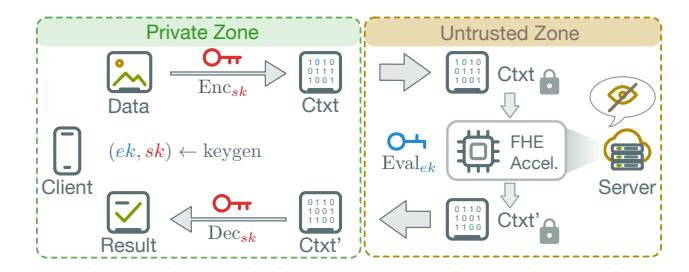

Fig. 1. Secure Computation Offloading with FHE. The client with sensitive data generates a key pair, including the evaluation key ek and the secret key sk. The server uses ek to compute the encrypted data. The sk is used for encrypting and decrypting ciphertexts and never leaves the client, ensuring data confidentiality.

sive due to the complexity of FHE operations, making serverside computation the primary bottleneck in such systems.

An FHE scheme [1], [6], [8], [13], [15] defines a set of fundamental operations that enable secure computations on encrypted data, including encryption, decryption, and evaluation functions. Among the most popular schemes are CKKS [6] and TFHE [8], each suited for different types of computations. CKKS is particularly efficient for vector operations, especially additions and multiplications [18], [29], making it suitable for applications like machine learning and statistical analysis. However, CKKS faces two practical limitations. First, it operates at the granularity of entire vectors, making operations on individual elements indirect and computationally costly. Second, the scheme's computational pattern requires maintaining large auxiliary data throughout execution, which has led existing accelerators [12], [21]-[23], [36], [43] to incorporate substantial on-chip storage (typically 256 MB to 512 MB).

The TFHE scheme [8] is often considered an alternative choice with a better balance between flexibility and performance. TFHE supports the Boolean datatype, as opposed to vectors, with each bit being individually accessible after encryption, allowing for the finest granularity. With TFHE ciphertexts being  $2000 \times$  smaller than CKKS ciphertexts, TFHE accelerators [19], [32], [33] typically require less chip area and modest on-chip storage (generally under 50 MB). Moreover, while CKKS is limited to polynomial operations (addition and multiplication) on vectors, TFHE supports logic gates that op-

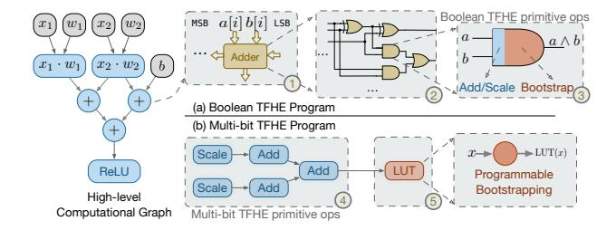

Fig. 2. Breakdown of a Sample Boolean TFHE Program (a) and a Multi-bit TFHE Program (b).

erate on Boolean data. This enables the execution of Boolean programs that combine both polynomial and non-polynomial operations, greatly enhancing versatility. This capability has proven particularly valuable in real-world applications, from implementing convolutional neural networks [7] to realizing a fully homomorphic 5-stage RISC-V processor [30].

Recent works [9], [10] have introduced an extension to the TFHE scheme known as multi-bit TFHE, which allows encrypting multiple bits in a single ciphertext to form an integer. Figure 2 contrasts how a compute graph of add, mul, and non-linear functions [14] is realized in Boolean and multi-bit TFHE. Boolean TFHE supports only logic gates, so even simple arithmetic is decomposed into millions of gates (Figure 2(a)). As each gate requires a bootstrapping, a single program can demand millions of bootstrappings. Multibit TFHE, in contrast, relies on two classes of primitives (Figure 2(b)): First, linear operations (e.g., addition and scalar multiplication) are fast and require no bootstrapping. Second, lookup tables (LUTs) evaluate arbitrary non-linear functions, but each requires a *programmable* bootstrapping (PBS). As a consequence, the workload shifts: multi-bit TFHE programs become dominated by many inexpensive linear operations, interspersed with a few expensive PBS computations.

Profiling across diverse real-world applications confirms that these inexpensive linear operations account for the vast majority of all operations (discussed in Section III-A2). Wider multi-bit representations permit long chains of linear operations before the next PBS, reducing PBS frequency by orders of magnitude and becoming the primary contributor to end-to-end performance improvements.

While multi-bit TFHE brings algorithmic efficiency, enlarging the numerical width (e.g., beyond 4 bits) demands new cryptographic parameter sets to maintain security and correctness (Section III-B). These revised parameters directly impact the dimensions of internal datatypes and computation patterns. Prior state-of-the-art accelerators [28], [32] rely on spatial architectures that excel at Boolean and low-numerical-width TFHE by exploiting: *coefficient* parallelism (co-processing coefficients within a polynomial), *row* parallelism (reusing post-FFT results across independent key data chunks, often mapped to a *row* of parallel processing elements (PEs)), and *ciphertext* parallelism (processing independent bootstrappings for multiple ciphertexts).

However, the new parameter sets of multi-bit TFHE reshape

all three dimensions unfavorably, exposing fundamental limits in spatial designs. First, widening hardware pipelines to exploit the increasingly abundant coefficient parallelism causes percycle key data consumption to scale linearly, quickly saturating memory bandwidth. Second, row parallelism collapses because practical multi-bit configurations restrict post-FFT reuse opportunities, severely undermining hardware utilization. Finally, scaling ciphertext parallelism becomes area-prohibitive, as supporting multiple in-flight bootstrappings requires duplicating full sets of functional units and intermediate data storage that scales to tens of megabytes at large bitwidths. These issues stem from a common underlying cause: spatial architectures tightly couple PE width, FFT throughput, and DRAM bandwidth, creating a rigid scaling barrier well before reaching 8- to 10-bit parameter sets.

To overcome these limitations, FlashTFHE replaces spatial data reuse with a *temporal* round-robin data reuse strategy, where each on-chip key data chunk is time-multiplexed across many parallel bootstrappings flowing through a monolithic, wide, deeply pipelined architecture. This design decouples coefficient throughput from DRAM bandwidth, eliminates dependence on row-level reuse, and turns ciphertext-level parallelism into a software-controlled batch size without duplicating large FFT buffers. These properties enable high-throughput heterogeneous FFT units that are far more storage-efficient than prior designs and allow adaptive batching that improves utilization for serial or irregular workloads.

In summary, we make the following key contributions.

- We provide the first comprehensive characterization of real-world multi-bit TFHE workloads, showing that wider representations reduce PBS frequency and shift execution toward fast linear operations.
- We identify three fundamental scalability barriers in spatial architectures: bandwidth-bound coefficient scaling, collapsed row-level reuse, and cost-prohibitive ciphertext parallelism, and demonstrate that they originate from spatial key reuse.
- We propose FlashTFHE, a temporal key-reuse accelerator that supports up to 10-bit ciphertexts using high-throughput heterogeneous FFT units and adaptive batching to efficiently exploit multi-bit TFHE parallelism.
- We implement FlashTFHE and demonstrate speedups of up to 2529× over CPUs, 1320× over GPUs, and 7× over a state-of-the-art TFHE accelerator.

#### II. BACKGROUND

#### A. TFHE Encryption and Internal Datatypes

FlashTFHE improves FHE program execution performance on cloud servers (Figure 1). Understanding the encryption process and internal datatypes is essential for reasoning about server-side homomorphic evaluations. More detailed discussions can be found in [20], [25].

**Overview of TFHE Encryption** During initialization, the client generates a keypair. The secret key encrypts plaintext data locally and never leaves the client. Public evaluation keys

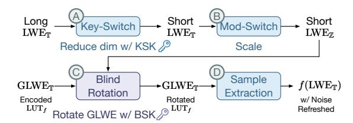

Fig. 3. Outline of TFHE Programmable Bootstrapping.

enable servers to perform homomorphic operations; in TFHE, these comprise the *bootstrapping key* (BSK) and *key-switching key* (KSK).

TFHE's security relies on the hardness of the learning with errors (LWE) problem. The scheme introduces noise during encryption for security and uses bootstrapping to reduce noise while maintaining correctness. TFHE's distinguishing feature is *programmable bootstrapping* (PBS), which evaluates a univariate function (LUT) while reducing noise to acceptable levels.

**Internal Datatypes in TFHE** Torus elements are the fundamental building blocks for TFHE datatypes. A *torus*  $\mathbb{T}$  conceptually represents real values in [0,1), but is implemented as *discretized* w-bit fixed-point fractions (with w typically 32 or 64).

PBS dominates overall runtime; hence, FlashTFHE focuses on improving PBS efficiency. PBS relies on three datatypes: LWE, GLWE, and GGSW. LWE ciphertexts [8] encrypt client messages and are the smallest type, parameterized by dimension n (typically 500–1000). Each has an n-element mask and a single body element. GLWE [8] ciphertexts encode LUTs for PBS and store intermediate results. GLWE generalizes LWE by replacing each torus scalar with a degree-N polynomial (where N is a power of two); a GLWE ciphertext contains k+1 polynomials (where k is the GLWE dimension). GGSW [15] ciphertexts form the BSK; specifically, each BSK consists of n GGSW ciphertexts. GGSW enables the external product (GGSW $\square$ GLWE  $\rightarrow$  GLWE) required for bootstrapping. Each GGSW is a  $(1+k)^2 \times l_b$  polynomial matrix, where  $l_b$  is the decomposition depth.

#### B. TFHE Computation

TFHE programs combine fast linear operations (elementwise additions/multiplications) with PBS operations. This subsection explains how the GLWE (polynomial) and GGSW (bootstrapping key, read-only) ciphertexts interact when performing a PBS operation.

Figure 3 illustrates how PBS is performed. PBS takes an LWE ciphertext as input and outputs an LWE ciphertext with the same dimension, reduced noise, and function f evaluated. PBS consists of four steps:

1) Key-switching (A) uses the KSK to reduce the LWE dimension (long to short), enabling fewer blind rotation iterations (C) and reducing computations (e.g., from  $\sim 30,000$  to

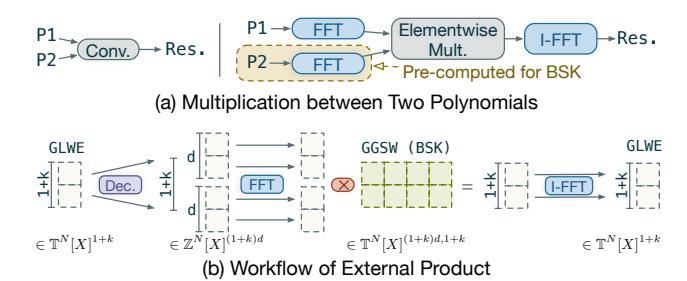

Fig. 4. Multiplication between Polynomials and its Usage in External Product.

- $\sim 1,000).$  This is the second most time-consuming operation (roughly 10% of the total runtime).
- 2) Modulus-switching ( $\widehat{\mathbb{B}}$ ) converts LWE values from  $\mathbb{T}$  to  $\mathbb{Z}$  (torus to integer) for blind rotation, taking <1% of runtime.
- 3) Blind rotation (©) transforms a GLWE ciphertext based on an input LWE ciphertext, and is the most time-consuming step due to iterated multiplications of large polynomials (roughly 90% of the total runtime). Figure 4(a) shows two possible methods: naive discrete convolution (left) or FFT/IFFT (right, used in practice due to lower asymptotic complexity for large polynomials). Blind rotation's core computations are iterative external products between GLWE and GGSW ciphertexts (Figure 4(b)), essentially vector-matrix multiplication with degree-N polynomials.
- 4) Sample extraction ( $\bigcirc$ ) extracts an LWE ciphertext from the constant terms of the GLWE polynomials, restoring the original dimension (< 1% runtime).

PBS has two possible execution orders: key-switching-first  $(\triangle \to (B \to C) \to (D))$  [5] or blind rotation-first  $(B \to C) \to (D) \to (A)$  [8]. While both require equal computation for a single PBS, key-switching-first enables data reuse across sequential PBS operations in multi-bit programs. We adopt the key-switching-first execution order throughout this work.

#### III. MOTIVATION AND OUR APPROACH

- A. Performance Improvement via Wider Numeric Representation
- 1) Improving Linear Operation Performance by Exploiting Wider Numerical Representation: Boolean TFHE evaluates one bit per ciphertext. Consequently, every bit requires a PBS per operation (i.e., NAND). Compared to Boolean, two properties drive the performance of multi-bit TFHE: (1) a single PBS applies to multiple packed bits, and (2) linear operations on packed ciphertexts are LWE-native and incur no bootstrapping. As bitwidth increases, programs can perform longer chains of native linear operations before requiring the next PBS, reducing the total number of PBS required.

To quantify the impact of numeric width on linear operation performance, we compare 6-bit LWE-native operations (addition and ciphertext-to-plaintext multiplication) under three representations: Boolean, 5 bits, and 8 bits. We used Yosys [39] to synthesize a ripple-carry adder (Figure 5-left) and multiplier

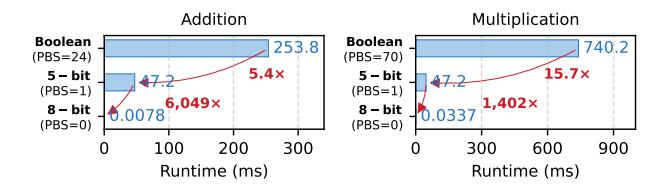

Fig. 5. Runtime of LWE-native addition (left) and multiplication (right) for 6-bit integers across Boolean, 5-bit, and 8-bit datatypes. Wider numerical representation reduces PBS counts, improving performance.

(Figure 5-right) with the most gate-efficient design in Boolean TFHE<sup>1</sup>. Although each Boolean gate takes only 11 ms on a commodity CPU<sup>2</sup>, the full operation requires 253 ms for an addition and 740 ms for a multiplication, respectively. Using 5-bit TFHE (5-bit), each 6-bit integer is split into two radix segments. Segment additions and multiplications are fast, but carry management requires a bivariate LUT, introducing one PBS that dominates the 47 ms total runtime. In contrast, the 8-bit TFHE configuration (8-bit) accommodates the entire integer in a single ciphertext, eliminating carry propagation and reducing runtimes to 0.008 ms for an addition and 0.03 ms for a multiplication, respectively. In fact, this effect is not specific to individual LWE-native operations. Larger-scale components consisting of combined LWE-native operations, such as dot products and small multi-layer perceptron (MLP) inferences, exhibit the same width-PBS scaling behavior.

2) Operation-wise Performance Advantage of Wider Numeric Representation Transfers to Overall Multi-bit Programwise Performance Improvement: While the addition comparison illustrates the benefits of wider representations for LWE-native operations, it remains unclear whether these benefits generalize to complete programs. Therefore, we profiled seven diverse multi-bit TFHE workloads to understand their operation composition<sup>3</sup>.

Figure 6(a) categorizes operations as either LWE-native (executable without bootstrapping) or PBS-required (orders of magnitude slower). Native operations dominate the operation count across all benchmarks, which explains why wider bit-width representations are desirable for application performance.

Figure 6(b) quantifies the cost of emulating 8-bit operations using 4-bit ciphertexts. Native 8-bit operations are denoted as Native<sub>8-bit</sub>. Emulation forces each LWE-native 4-bit operation to include PBS for carry propagation (Emu<sub>4-bit Native</sub>). For DNN workloads (i.e., GPT-2, GPT-2 (12-head), CNN-50, and CNN-20) where native operations comprise  $\sim\!99.5\%$  of total operations, this overhead alone causes a  $6.8\text{--}8.1\times$  slowdown, even before accounting for PBS emulation costs

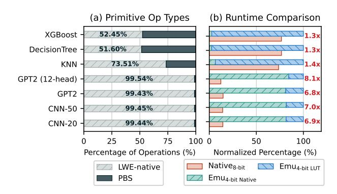

Fig. 6. (a) Profiling on various multi-bit TFHE programs shows that most programs are dominated by LWE-native operations. (b) Normalized runtime comparison between 8-bit programs as baselines and emulations using 4-bit primitives shows that native operations using wider bitwidths perform much better

 $({\rm Emu_{4-bit}}\ _{\rm LUT}).$  For non-DNN workloads (i.e., XGBoost, DecisionTree, and KNN) with higher PBS ratios, emulating a large 8-bit LUT requires at least 32 small 4-bit LUTs (an information-theoretic lower bound), making LUT emulation the dominant performance bottleneck. In both cases, the dramatic increase in PBS count nullifies any potential gains from individually faster 4-bit PBS operations, necessitating wider numerical representations in multi-bit TFHE.

## Takeaway 1: Wider multi-bit representations reduce PBS frequency and improve end-to-end program performance.

#### B. Wider Numeric Representations Enlarge Parameter Sets

Each TFHE program uses a specific parameter set that jointly determines *operation robustness*, *computational cost*, and *message width* under a desired security level. While Boolean TFHE often employs fixed configurations, multi-bit TFHE must search a broader parameter space as ciphertext bit width increases. Using the Lattice Estimator [2], we mapped the relationship between security and common parameter choices for each message width, as shown in Figure 7, marking combinations achieving 80- to 128-bit security levels. These parameters ensure a failure probability of  $p_{\rm err} < 2^{-14}$ , negligible in practice.

Figure 7 shows a consistent trend: as ciphertext bit width increases, both the LWE dimension n and the GLWE degree N must grow to keep security level and noise within given bounds during programmable bootstrapping.

Specifically, prior work such as Morphling [32] supports only limited N, further limiting the message width to 6 bits. Extending message widths, regardless of security level, requires hardware support for an exponentially growing N. Moreover, multi-bit programs often require a larger gadget decomposition level  $l_b$  (often 8–10 rather than 2–3) to suppress noise. The increased  $l_b$ , n, and N together result in larger key sizes up to a few GBs, preventing them from fitting on-chip.

These parameter adjustments have direct algorithmic consequences. First, while the growth of n can be accommodated

<sup>&</sup>lt;sup>1</sup>Other adder architectures, such as carry-lookahead, reduce delay in hardware but use more gates, making them inefficient in TFHE where each gate requires bootstrapping.

<sup>&</sup>lt;sup>2</sup>Unless stated otherwise, all measurements reported use the TFHE-rs library [42] (commit 4c9b081) on an AMD EPYC 7R13 CPU.

<sup>&</sup>lt;sup>3</sup>Programs profiled using MLIR [26] and IR generated by Concrete Compiler v2.7 [41] using LLVM 17 (commit f5aec278e8df).

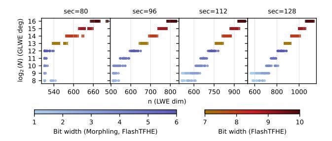

Fig. 7.  $\log_2 N$  and n with respect to bit width for different security levels. Each point represents a parameter set whose noise level satisfies a PBS error rate of  $p_{\rm err} \leq 2^{-14}$ . The supported bit widths of Morphling [32] and FlashTFHE are labeled. A larger width requires larger N and n to maintain the desired noise and security level.

by pure software scheduling changes (increasing the number of iterations of external products), larger N requires hardware changes to existing TFHE accelerators. For example, Morphling [32] and Matrix [28] support N only up to 4096. While Strix [33] takes N up to 16384, it remains  $4 \times$  smaller than the 2<sup>16</sup> requirement for 10-bit ciphertext bootstrapping. Second, the multi-bit TFHE key size scales as  $O(nNl_h)$  and grows dramatically with these parameter increases. For example, keys used by the GPT-2 decoder layer inference are as large as 4.7 GB, compared to only a few megabytes in Boolean TFHE, making it infeasible to fit them entirely on-chip. Moreover, these keys are consumed in a strictly streaming fashion during each bootstrapping operation: each key coefficient is used exactly once, resulting in extremely low arithmetic intensity. As bitwidth increases, TFHE programs therefore become increasingly dominated by large, one-shot key streams rather than polynomial computations. As a result, an efficient keyreuse strategy is crucial for multi-bit TFHE accelerators to increase arithmetic intensity and improve performance.

#### C. Scaling Challenges of Spatial Architectures for Multi-bit Workloads

External products, the core compute kernel in TFHE bootstrapping, expose three sources of parallelism that shape the design of accelerators. Coefficient parallelism arises from the N coefficient-level multiply-accumulate operations within a polynomial. Row parallelism comes from applying the same GLWE polynomial to multiple rows of the GGSW key, yielding up to (k+1) independent dot products. Ciphertext parallelism corresponds to concurrently evaluating multiple PBS for independent LWE ciphertexts. Its degree is program-dependent and varies within a TFHE program.

Spatial architectures [28], [32] map these three dimensions of parallelism onto PE arrays: coefficient-level parallelism within each PE, row parallelism across PEs in a row, and ciphertext parallelism across rows. This organization is effective for Boolean and low-bitwidth workloads. However, multibit TFHE characteristics fundamentally limit the scalability of spatial mapping in the following ways.

1) Large Polynomial Degrees Inflate In-Flight Data Storage Cost, Advocating Coefficient Parallelism Scaling over Ciphertext Parallelism Scaling: For a fixed target throughput, the architecture can scale along two orthogonal dimensions: ciphertext parallelism (by processing more independent ciphertexts) or coefficient parallelism (wider FFT / PolyMult pipelines processing more coefficients). These dimensions trade off multiplicatively as Throughput = (#ciphertexts in flight) × (#coefficients processed per cycle).

When N is small, spatial TFHE designs naturally favor ciphertext-level parallelism: each PE row carries its own FFT pipeline and accumulator, and deeply pipelined R2MDC FFT units [16] keep per-pipeline state small (e.g.,  $\sim$ 16 KB at N=4096). Under these conditions, duplicating pipelines across many ciphertexts is a reasonable way to raise throughput.

As multi-bit TFHE increases polynomial degrees, this balance flips. The intermediate state of an R2MDC pipeline grows linearly with N, and this state must be fully replicated for every independent ciphertext because accumulators and FFT pipelines cannot be shared across parallel PBS executions. At N=65,536, the in-flight storage of a single pipeline reaches tens of megabytes ( $\sim 59.5\,$  MB at throughput<sub>FFT</sub> = 256). Consequently, scaling throughput via ciphertext parallelism becomes prohibitively area-intensive. In contrast, coefficient parallelism scales over a single wide pipeline rather than duplicating it across many narrow ones, and thus becomes more area-efficient for large-degree multi-bit TFHE workloads.

2) Coefficient Parallelism Scaling is Limited by Spatial Architecture: Spatial TFHE accelerators use an output-stationary design: each PE row holds a partially accumulated GLWE polynomial for the entire PBS, while the BSK is streamed across all PEs. Because each BSK coefficient is consumed exactly once during each bootstrapping and the BSK is far too large to store on chip, the architecture must fetch the full BSK as a strict, one-pass stream from DRAM for every bootstrapping. No temporal locality is exploitable.

As discussed previously, multi-bit TFHE makes coefficient parallelism the most valuable scaling dimension. However, in a spatial output-stationary design, widening the coefficient throughput by a factor of c (i.e., processing c times more coefficients per cycle per PE) forces a strictly proportional increase of c times in DRAM bandwidth, as the BSK stream cannot be buffered for later PBS operations.

Concretely, in prior spatial designs such as Morphling, widening a PE modestly beyond its baseline (e.g.,  $2 \times$  coefficient throughput per cycle) drives the BSK streaming requirement above what two HBM2E stacks can supply. At this point, the design becomes entirely bandwidth-bound, making further coefficient scaling impossible. Thus, under output-stationary streaming, spatial architectures fundamentally cannot exploit the abundant coefficient parallelism in multi-bit TFHE.

Takeaway 2: Coefficient parallelism is the most areaefficient scaling dimension for multi-bit TFHE, but spatial designs cannot exploit it: widening coefficient throughput forces a strictly proportional increase in DRAM bandwidth

#### for BSK streaming, quickly saturating off-chip memory bandwidth.

*3) Multi-bit TFHE Collapses the Row-Level Parallelism That Spatial Arrays Depend On:* Spatial TFHE accelerators typically exploit row-level parallelism by broadcasting each post-FFT coefficient across a row of PEs. In low-bitwidth TFHE, typical GLWE dimensions of k = 2 or 3 allow k + 1 independent dot products per post-FFT coefficient, and spatial arrays map these dot products directly onto wide PE rows, achieving high utilization.

However, to control the quadratic growth of bootstrapping cost in O(k 2 ), practical multi-bit parameter sets constrain the GLWE dimension to k = 1, offering each FFT output only 2× reuse: the minimum possible. As a result, spatial architectures that upscale row-level parallelism become increasingly mismatched to multi-bit TFHE workloads.

#### Takeaway 3: The one parallelism dimension that spatial arrays do exploit well, row-level reuse via k+1 dot products, collapses to the minimum (k=1) in multi-bit TFHE and leaves wide PE rows underutilized.

The fundamental upscaling limitation of spatial architectures lies in their spatial key reuse strategy: BSK chunks stream through the PE array with each PE consuming a portion of the BSK chunk as it passes through. This spatial distribution tightly couples three architectural parameters: PE width, FFT Unit throughput, and BSK bandwidth, making widening PEs or adding more PEs either inefficient or impractical. These constraints motivate a *temporal* key-reuse strategy that decouples BSK bandwidth demands from array geometry, while bringing new optimization opportunities that are not applicable to spatial architectures.

#### *D. FlashTFHE: Enabling Scalable Coefficient Parallelism via Temporal Key Reuse*

FlashTFHE introduces a temporal key-reuse strategy that replaces the strict stream-and-discard behavior of spatial architectures. Instead of fetching the entire BSK as a single-pass stream, the architecture loads only the BSK chunk needed for each polynomial multiply-accumulate step. Each chunk is small enough to remain on-chip (∼ 0.8 MB chip-wide), enabling reuse across a batch of ciphertexts. This immediately decouples coefficient-parallel scaling from DRAM bandwidth, as the same chunk feeds a wide pipeline multiple times before being evicted.

To support this reuse model, FlashTFHE moves the GLWE accumulator buffer out of the PE array and into dense per-core SRAM. Abandoning output-stationary execution removes the constraint that partial sums must remain resident in individual PEs, exactly the constraint that prevents BSK locality in spatial designs.

Finally, with key reuse no longer tied to array geometry, FlashTFHE collapses many narrow pipelines into a coefficient-parallel, area-efficient pipeline. Together, temporal key reuse, SRAM-resident accumulators, and a consolidated

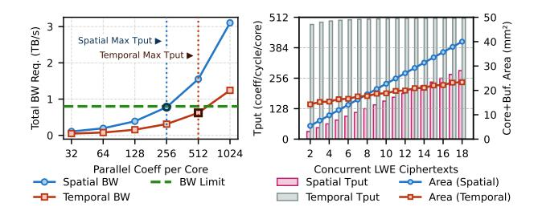

Fig. 8. Quantitative comparison of parallelism scaling on spatial and temporal architectures. Left: required chip-level DRAM memory bandwidth (sufficient for KS-PBS interleaving) rises sharply with PE width in spatial designs, whereas temporal BSK reuse enables 2× throughput under the same bandwidth limit of two HBM2E stacks. Right: x-axis shows the number of parallel ciphertexts, and the y-axis shows the achieved throughput as lines and the hardware area as bars. Temporal design achieves 2.63× higher throughput at a similar area.

wide pipeline unlock scaling behaviors fundamentally inaccessible to spatial architectures.

*1) Temporal Data Reuse Aligns with the Parallelism Structure of Multi-bit TFHE:* Temporal key and accumulator reuse fundamentally shift how the architecture scales with the three forms of parallelism present in multi-bit TFHE. Coefficient parallelism scaling now targets the throughput of the FFT/PolyMult pipeline rather than being restricted by DRAM bandwidth. Restricting row parallelism reduces the number of MAC units and eliminates resource underutilization. Ciphertext parallelism becomes a software-controlled batch size that eliminates the need for duplicating full pipelines.

Figure 8 quantifies how spatial and temporal designs scale along the two TFHE parallelism axes. The left plot shows coefficient-parallel scaling of a representative spatial core (4×4 PE array) and a temporal core with a monolithic wide pipeline. The x-axis shows achievable core throughput (coefficients per cycle), while the y-axis reports the chip-level BSK and key-switching bandwidth required to sustain KS-PBS interleaving. Spatial designs saturate available bandwidth at only 16 coefficients per cycle per PE. In contrast, temporal BSK reuse amortizes each BSK fetch across an entire batch, allowing the core to double the throughput under the same bandwidth limit.

The right panel illustrates the effects of ciphertext-parallel scaling on both throughput (lines) and core- and buffer-area (bars). At eight ciphertexts, both architectures use comparable area, yet the temporal design delivers 2.63× higher throughput, demonstrating better scaling efficiency.

*2) Decoupled Throughput Enables High-Throughput, Storage-Efficient Functional Units That Spatial Designs Cannot Support:* Spatial architectures must synchronize each FFT output with a fixed-width PE row, forcing the FFT pipeline to match PE throughput and inflating in-flight storage as N grows. At multi-bit parameter sets (e.g., N=65k), an R2MDC pipeline requires tens of megabytes of delay buffers, and increasing throughput requires duplicating the entire pipeline for each ciphertext in flight. Temporal scheduling

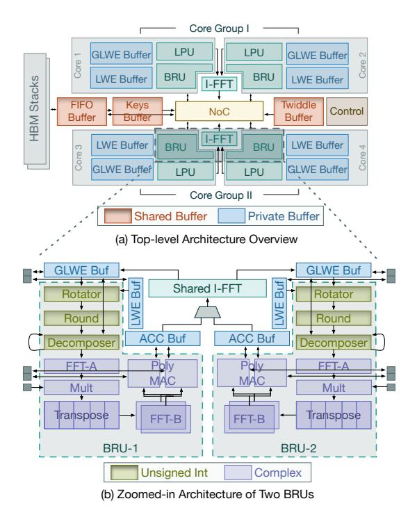

Fig. 9. Logical Organization of FlashTFHE Architecture (a) and Zoomed-in Organization of Two Blind-rotation Units (b).

removes this lockstep constraint by allowing a monolithic pipeline to have a MAC throughput of 512 coefficients per cycle, which is  $8\times$  that of a spatial architecture under the same bandwidth constraints. FlashTFHE exploits this freedom to deploy a heterogeneous, mixed-radix, double-real FFT cluster composed of 256-point and 128-point units, which requires only  $2.31\times$  the area of an 8-parallel R2MDC pipeline but achieves over  $30\times$  the throughput.

3) Adaptive Batching Decreases Latency by Eliminating Idle Pipeline Slots for Serial Workloads: Spatial arrays hardwire ciphertext parallelism into the array geometry, so batch size is fixed at design time. In contrast, FlashTFHE temporally schedules external products over a batch of ciphertexts in round-robin order, tuning batch size to match the program's actual ciphertext-level parallelism. When parallelism is abundant, the batch size increases to 48 to amortize batch launch overhead and maximize BSK reuse. When parallelism is scarce, adaptive batching enables the compiler to reduce the batch size, eliminating idle rounds and reallocating amortized memory bandwidth from underutilized key-switching lanes to the external product pipeline. Adaptive batching reduces single-batch latency by up to 41.7% in low-parallelism batches that are commonly found in non-deep learning workloads.

#### IV. FLASHTFHE ARCHITECTURE

#### A. High-level Organization

FlashTFHE's architecture, shown in Figure 9(a), is built around four vector-core-like compute cores. Each core incor-

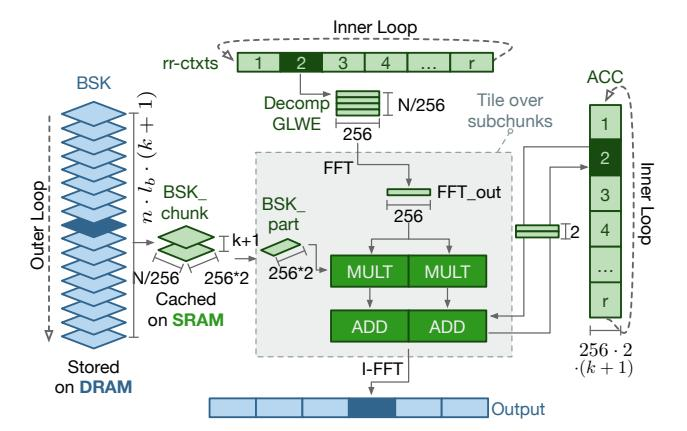

Fig. 10. Data mapping for bootstrapping. Only a portion of the BSK is loaded from DRAM and reused across all on-chip ciphertexts. Per-core functional units tile over subchunks for each ciphertext at a high throughput, exclusive to temporal designs.

porates two specialized functional units: a Blind-rotation Unit (BRU) and an LWE Processing Unit (LPU).

**Blind-rotation Unit** features an efficient monolithic wide pipeline that performs external products at high throughput. As shown in Figure 9(b), two BRUs in each core group share one inverse FFT (I-FFT) unit, as the ratio of FFT and I-FFT operation counts is  $l_b:1$ .

Through extensive testing with both TFHE-rs library parameters and Concrete Optimizer-generated parameters (all maintaining 128-bit security level), we adopted 48-bit fixed-point numbers in the BRU as the optimal datatype for complex-number pipelines.

Takeaway 4: 48-bit fixed-point datatype ensures correctness across all tested parameter sets while maintaining compatibility with both TFHE-rs and Concrete Optimizer.

LWE Processing Unit specializes in operations on LWE ciphertexts that do not involve polynomial arithmetic, including key-switching and LWE-native operations. The LPU operates with a 64-bit width to match the torus modulus of  $2^{64}$ . It includes vector addition and multiplication units for elementwise operations, plus decomposer and rotator units to support key switching. The LPU uses 8 independent lanes, each of which processes 32-wide vectors.

The Memory Subsystem of FlashTFHE employs a hierarchical on-chip memory consisting of global buffers shared by all cores and per-core private buffers. The sequential access patterns enable effective DRAM latency hiding using a modest 16KB read/store FIFO queue. The global buffers store chunks of BSK and KSK that are shared across all cores and distributed via the network-on-chip (NoC). The private buffers consist of a GLWE accumulator buffer (complex datatype) accessed exclusively by the BRU, and GLWE and LWE buffers (unsigned integer datatype) shared between the BRU and LPU.

```
// Outer: load one BSK chunk on-chip, reuse across all
ciphertexts
for bsk_chunk in BSK:
   parallel_for core in num_cores:
        // Inner: iterate over on-chip GLWEs
        for i, decomp_glwe in rr_ctxts[core]:
```

Fig. 11. Pseudo-code for temporal key-reuse scheduling shown in Figure 10. The outer loop iterates over BSK chunks, each held on-chip and reused across all ciphertexts (rr\_ctxts) via round-robin scheduling. I-FFT fires only after all chunks have been accumulated, enabled by SRAM-resident accumulators (acc).

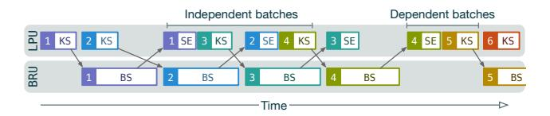

Fig. 12. Scheduling of operations across BRU and LPU modules for independent and dependent ciphertext batches. Batch number and operation type are annotated on each block.

#### B. Data Mapping in BRU

FlashTFHE carefully schedules each hierarchy of iteration in blind rotation and maps them to hardware resources according to the parallelism structure of multi-bit TFHE (Section III-C). Figure 11 shows the pseudo-code; Figure 10 illustrates the corresponding data mapping onto hardware.

Multi-bit TFHE requires a BSK that can be as large as a few GBs, far exceeding on-chip capacity. Rather than streaming the entire BSK in a single pass as in spatial designs, the outer loop loads only a single chunk (up to 0.8 MB chip-wide) from DRAM (labeled blue in Figure 10) into on-chip SRAM (labeled green). This chunk is then reused across all ciphertexts in all cores before being evicted, amortizing DRAM bandwidth across the entire batch.

Unlike spatial architectures whose BSK reuse is tightly coupled with array geometry, the inner loop processes ciphertexts in round-robin order. For each ciphertext, the FFT pipeline produces a chunk of output per cycle, which is tiled and multiplied by the corresponding BSK subchunk and accumulated into partial results stored in the Acc Buffer. At the end of  $(k+1) \cdot l_b$  accumulations, the results are forwarded to the I-FFT units. This shift from the spatial design's singlepass BSK streaming to temporal key reuse allows FlashTFHE to sustain a per-core MAC throughput of 512 coefficients per cycle,  $8\times$  that of a spatial core under the same bandwidth budget (Figure 8, left).

#### C. Lane-partitioned LPU Enables Adaptive Batch Sizing

FlashTFHE's LPU is designed as an 8-lane vector engine, where each lane processes 32 parallel 64-bit values. Unlike

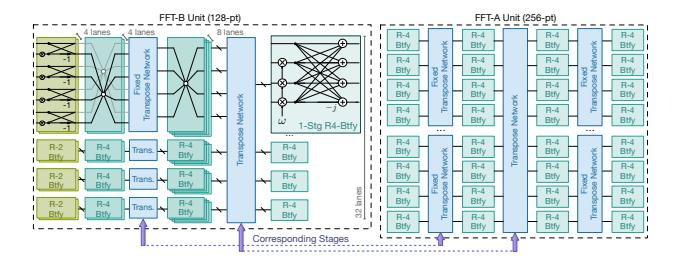

Fig. 13. TFHE-tailored FFT unit design. Two types of FFT units are used to match the decomposition requirement of multi-bit TFHE parameters. The 256-pt unit has a symmetric design, whereas the 128-pt unit is asymmetric. The correspondence between the stages is indicated.

prior monolithic key-switching pipelines [32], [33], these lanes are individually addressable and independently clock-gated. The LPU lane partitioning serves two purposes: (1) supporting efficient execution of both large power-of-two key-switching vectors and small non-power-of-two native LWE operations, and (2) enabling adaptive batching that dynamically balances bandwidth and latency according to available parallelism.

Figure 12 illustrates how FlashTFHE interleaves BRU and LPU operations across batches. The compiler groups ciphertexts into batches respecting data dependencies, and schedules key-switching (KS), sample extraction (SE), and native LWE operations onto the LPU while PBS is executed on the BRU. Real multi-bit workloads often contain batches where the available parallelism is limited. Lane partitioning allows FlashTFHE to adjust batch size in these phases and eliminate idle rounds, which is an optimization unavailable in fixed-width pipelines.

- 1) Case 1: Batches without Interleavable Key-switching: Some batches consist primarily of bootstrappings. In these cases, key-switching for the next batch cannot overlap due to data dependencies (e.g., batch 4 in Figure 12). Lane partitioning allows batch sizes to shrink, improving BRU utilization and reducing single-batch latency.
- 2) Case 2: Key-switching Requires Fewer Lanes than Provisioned: The LPU's 8-lane width is sized for the worst-case parameter sets to ensure key-switching never becomes the bottleneck for external products. Profiling shows, however, that many practical multi-bit workloads require fewer active lanes. FlashTFHE uses compile-time lane masking to disable unused lanes, reducing the batch size and redirecting the reclaimed bandwidth to the PBS pipeline. This mechanism is particularly beneficial for workloads with little ciphertext-level parallelism, such as KNN, where it reduces end-to-end latency by up to 41.7%.

Takeaway 5: While external products benefit from a monolithic high-throughput pipeline, lane-partitioned keyswitching pipelines enable adaptive batching that real-locates bandwidth and reduces latency when program parallelism is limited.

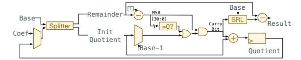

Fig. 14. Microarchitecture of the Decomposer Unit.

#### D. Tiled Heterogeneous Mixed-Radix FFT Units

A key challenge in multi-bit TFHE is handling the significantly larger polynomial degrees required to support wide numeric representations. FlashTFHE supports polynomials up to degree 2<sup>16</sup>, sufficient for ciphertexts that encrypt up to 10 bits with 128-bit security.

Our design employs double-real FFT [16], which efficiently processes up to  $2^{16}$ -degree polynomials using only  $2^{15}$ -point complex vectors. However, the  $2^{15}$ -point sequence presents a unique challenge. Prior work [21], [35], [36] relies on decomposition that applies to perfect-square vector lengths (e.g., CraterLake's [36] choice of  $256 \times 256$ , which is a perfect square). Yet, a  $2^{15}$ -point sequence cannot be evenly divided into equal-sized parts (like  $\sqrt{N} \times \sqrt{N}$ ) and mapped to homogeneous functional units. This constraint led us to develop a novel heterogeneous functional unit design, which is a key distinguishing feature of FlashTFHE compared to previous FFT/NTT implementations. Each FFT cluster employs two types of functional units: FFT-A processes 256-point sequences and FFT-B processes 128-point sequences, interconnected by a transpose unit.

As shown in Figure 13, the FFT-A unit uses a symmetric design with  $\sqrt{256}$  lanes and is divided into tiles. The FFT-B unit features an asymmetric design that decomposes into four 32-point sequences; each is further split into four 8-point tiles. Both units use mixed-radix butterfly units, with radix-4 requiring 25% fewer complex multiplications than radix-2. Unlike CKKS workloads, which often use a fixed maximum sequence length  $N=65,536,\ N$  in TFHE workloads may vary. To support various workloads, FFT units adopt early-exiting, which allows bypassing unused stages to improve latency.

Compared to an 8-parallel R2MDC design used by the state-of-the-art TFHE accelerator [32], our heterogeneous FFT units use  $1.38\times$  the area while achieving  $32\times$  better throughput.

#### E. Transpose and Decomposer Units

**Transpose Unit:** Transpose operations occur in two contexts: within individual FFT units (where intermediate data are available in the same cycle and require only muxing) and between FFT-A and FFT-B units (where divide-and-conquer is applied for large inputs, requiring intermediate data caching). For the latter case, we adopted two-port SRAM banks for high-density storage of rotated FFT intermediate data. Each complex number requires 96 bits (48 bits each for real and imaginary components) to maintain decryption correctness. The rectangular structure (128 rows × 256 columns) of intermediate data creates a throughput imbalance since reading 256

columns takes twice as long as reading 128 rows. We address this by grouping pairs of consecutive complex numbers to create 128 logical columns, then distributing the outputs to two FFT-B units based on even/odd indices for parallel processing.

**Decomposer Unit:** The decomposition process converts each element in a torus polynomial into a vector of integers by representing the element in a power-of-two base B across decomposition depth  $l_b$ . As shown in Figure 14, our hardware implementation consists of two components: an initial scaling unit that may introduce stalls for decomposition depths greater than one, and a continuous digit-extraction unit that outputs one integer per cycle with built-in rounding logic to maintain the required FFT unit throughput.

### V. MULTI-LEVEL OPERATION DEDUPLICATION THROUGH COMPILER OPTIMIZATION

FlashTFHE's compiler integrates directly with the Concrete toolchain, inheriting its parameter selection, quantization flow, and established software ecosystem. It accepts MLIR-based [26] intermediate representations expressed in Concrete's FHELinAlg dialect, which captures TFHE operations with precise types and parameter sets. Starting from this MLIR dialect, our compiler expands batched operations (e.g., matmul, multi-LUT) into per-ciphertext primitives and performs dependence analysis to expose opportunities for program-level optimizations, such as operation deduplication and adaptive batching. The resulting instruction stream is scheduled to match FlashTFHE's temporal-reuse execution model.

We identified two deduplication optimizations: key-switching deduplication (*KS-dedup*) and GLWE accumulator deduplication (*ACC-dedup*). KS-dedup enables reusing key-switching results as inputs for multiple subsequent blind rotations when fanout structures exist. Unlike Boolean TFHE, which performs blind rotation first, FlashTFHE performs key-switching first to enable this optimization. Multi-bit TFHE programs commonly apply multiple different LUTs to the same ciphertext, allowing KS-dedup to broadcast key-switching results to multiple BRUs. This reduces key-switching operations by up to 47.12% in our evaluated work-loads.

Takeaway 6: Moving key-switching prior to blind rotation in a PBS and treating PBS as non-atomic operations create opportunities for deduplication in real-world TFHE workflows.

ACC-dedup leverages the pattern where multi-bit TFHE programs frequently apply the same accumulator across multiple tensor elements. By sharing accumulators among tensor elements, this optimization reduces GLWE storage requirements by 91.54%, significantly shrinking program size and DRAM capacity requirements.

#### VI. EVALUATION

A. Design Space Exploration

Off-chip Memory Bandwidth Sensitivity

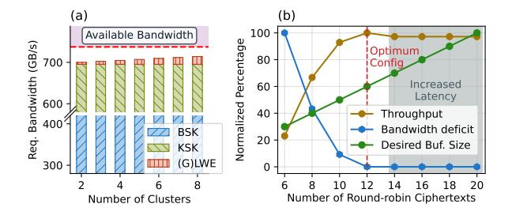

Fig. 15. Architectural Analysis: (a) The impact of the number of cores on the required bandwidth. The maximum bandwidth of two HBM2E stacks can satisfy the requirements of more than 8 cores. (b) The impact of the number of round-robin ciphertexts on throughput, bandwidth deficits, and buffer sizes. 12 round-robin ciphertexts achieve maximum throughput with the smallest buffer size.

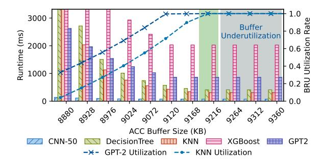

Fig. 16. Impact of Accumulator Buffer Size on Wall-clock Runtime of Various Workloads and Utilization Rates.

We analyze two key architectural parameters: the number of computation cores and the number of round-robin ciphertexts per batch (48 ciphertexts scheduled simultaneously).

Figure 15(a) shows that increasing from 2 to 8 cores linearly increases bandwidth requirements for GLWE and LWE ciphertexts, while BSK and KSK bandwidths remain constant as keys are shared across cores. Two HBM2E stacks provide sufficient bandwidth for up to 8 cores. This invariance also enables technology scaling: denser nodes can pack additional cores beyond our 16 nm default of 4 with negligible bandwidth overhead.

Figure 15(b) demonstrates that 12 round-robin ciphertexts achieve optimal performance by eliminating bandwidth deficits while minimizing buffer requirements. Beyond 12 ciphertexts, throughput plateaus while buffer size continues growing linearly, and excessive ciphertexts can cause underutilization when parallel operations are insufficient.

#### Impact of Buffer Size on Performance

Although the full BSK can reach several GBs, FlashTFHE does not need to fit it on-chip. As shown in Figure 10, the outer loop of the bootstrapping dataflow loads only one BSK chunk at a time (up to  $0.8~\mathrm{MB}$  chip-wide) and reuses it across all in-flight ciphertexts before eviction. The total on-chip SRAM (45 MB) is therefore dominated by accumulator storage rather than key storage, and is still significantly smaller than that of accelerators with comparable N support (180 MB for Trinity

TABLE I Area and Power Consumption Breakdown of FlashTFHE

| Component            | Area $(mm^2)$ | Power $(W)$ |
|----------------------|---------------|-------------|
| Decomposer           | 0.24          | 0.65        |
| 2× FFT-A             | 1.57          | 2.95        |
| FFT-B                | 1.88          | 4.12        |
| VecMAC               | 4.27          | 8.41        |
| Rotator              | 0.18          | 0.63        |
| Transpose            | 0.79          | 1.44        |
| VecMult              | 2.06          | 4.06        |
| ModSwitch            | < 0.01        | < 0.01      |
| BRU                  | 11.01         | 22.29       |
| LPU                  | 1.32          | 0.61        |
| I-FFT                | 4.25          | 12.59       |
| Acc buf. (9.2MB)     | 9.83          | 3.11        |
| GLWE buf. (1.5MB)    | 1.88          | 0.52        |
| LWE buf. (24KB)      | 0.02          | < 0.01      |
| Core Group           | 52.40         | 65.65       |
| GGSW buf. (0.8MB)    | 1.22          | 0.91        |
| KSK buf. (0.5MB)     | 0.50          | 0.07        |
| Twiddle buf. (0.8MB) | 1.39          | 0.27        |
| NoC                  | 0.16          | 0.43        |
| Total                | 108.08        | 132.98      |

#### at 7 nm, 256 MB for SHARP at 7 nm).

Figure 16 shows that reducing the accumulator buffer size below 9216 KB forces data swapping to DRAM, stalling the BRU pipeline. The runtimes where two HBM stacks cannot meet bandwidth requirements vary by polynomial degree. Utilization rates remain above 99% in the 9120–9168 KB range, indicating relatively small swapping penalties. Increasing the buffer size beyond 9216 KB shows no utilization improvement but leads to underutilization unless the round-robin ciphertexts are also increased.

#### B. Hardware Implementation

We implemented the FlashTFHE architecture in Chisel HDL [4] and verified the RTL-level correctness of the functional-unit implementations on a Xilinx Virtex VU47P FPGA using the Beethoven framework [24]. We compiled the verified Chisel into Verilog HDL and synthesized it using Synopsys Design Compiler [38] with the TSMC N16 process.

We modeled all scratchpad memories with the Arm Artisan physical IP compiler [3] and obtained all activity factors based on the worst-case parameter set. We used DRAMSim3 [27] to simulate two HBM2E stacks. We pipelined the NoC and all functional units to achieve the design target of 1 GHz frequency, ensuring all reported worst-case negative slacks are 0.00 ns. Table I shows the total area and power consumption of FlashTFHE, with breakdowns by major component.

#### C. Performance Evaluation

1) Real-world Workloads: We built a cycle-accurate simulator based on the verified implementation to evaluate the

TABLE II
WALL-CLOCK EXECUTION TIME COMPARISON

| Workload $n, l_b, (N, k)$ , Width             | CPU (s)<br>w/ GPUs (s) | FlashTFHE (ms) | Speedup        |
|-----------------------------------------------|------------------------|----------------|----------------|
| CNN-20 (PTQ)<br>737, 3, (2048, 1), 6          | 3.85<br>6.096          | 11.60          | 331×<br>525×   |
| CNN-50 (PTQ)<br>828, 4, (4096, 1), 6          | 15.31<br>49.714        | 74.27          | 206×<br>669×   |
| <b>Decision Tree</b> 1070, 8, (65536, 1), 9   | 645.40<br>522.2351     | 409.19         | 1577×<br>1276× |
| <b>GPT-2</b> 1003, 6, (32768, 1), 3           | 1218.13<br>721.14      | 860.94         | 1414×<br>837×  |
| <b>GPT-2 (12-head)</b> 1009, 3, (32768, 1), 6 | 23685.14<br>OOM        | 10649.33       | 2224×          |
| <b>KNN</b> 1058, 8, (65536, 1), 9             | 284.69<br>204.6        | 306.66         | 928×<br>667×   |
| <b>XGBoost Reg</b> 1025, 3, (32768, 1), 8     | 1793.27<br>912.11      | 689.29         | 2601×<br>1323× |

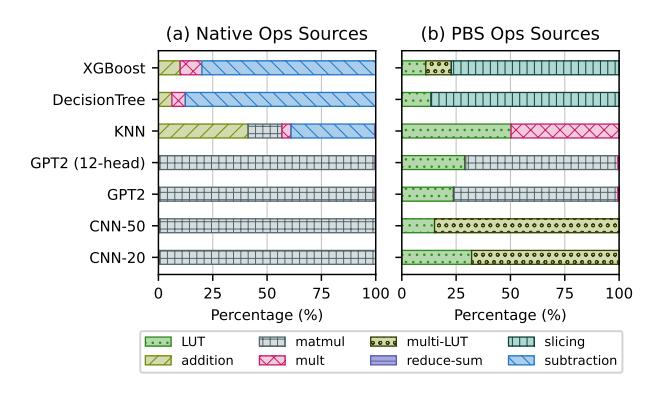

Fig. 17. Workload characteristics for (a) LWE-native operations and (b) PBS operations.

performance of full TFHE programs. We used the state-of-the-art Concrete toolchain<sup>4</sup> for CPU and GPU comparison.

Our evaluation spans low-precision workloads (two CNN models with 20 and 50 layers respectively and post-training quantization (PTQ) [7]) and high-precision workloads, including a KNN classifier<sup>5</sup>, XGBoost regressor<sup>6</sup>, decision tree classifier<sup>7</sup>, and quantized GPT-2 decoder layers<sup>8</sup>. Parameter sets are listed in Table II.

The detailed breakdown of LWE-native and PBS operation sources is shown in Figure 17. Generic LUTs and multi-LUTs are usually used for activation functions, divisions, and step functions.

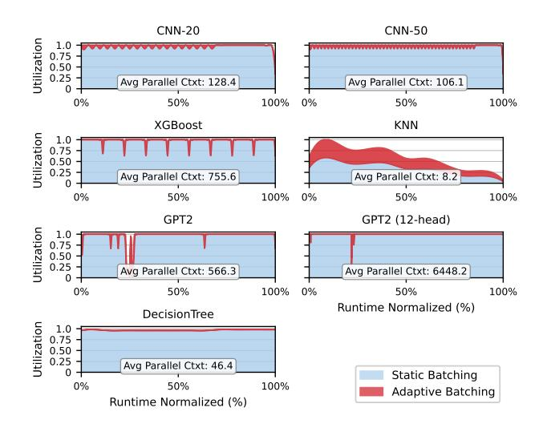

Fig. 18. Hardware utilization comparison between static and adaptive batching across workloads. Time (x-axis) is normalized to 100%. Adaptive batching improves utilization, especially for workloads with limited ciphertext-level parallelism (i.e., KNN). The average numbers of parallelizable ciphertexts (labeled as "Avg Parallel Ctxt") reflect abundant ciphertext-level parallelism for most real-world TFHE workloads.

2) Real-world Workloads Result Analysis: Performance comparisons used an AMD EPYC 7R13 system (48 Zen3 cores at 3.4 GHz, 256 GB DDR4-3200, SMT enabled) with dual NVIDIA RTX A5000 GPUs.

**Low bit-width Workloads:** CNN models achieve up to  $277 \times$  speedup with single-batch bootstrapping latencies of 0.28 ms (CNN-20) and 0.85 ms (CNN-50). Compared to Morphling, CNN-20 improves from 0.34 s to 0.0139 s, and CNN-50 improves from 1.72 s to 0.0925 s, through compiler optimizations and enhanced polynomial multiplication throughput.

**High bit-width Workloads:** High bit-width workloads show dramatic improvements of up to  $2529\times$  over CPU and  $1320\times$  over GPU, with single-ciphertext bootstrapping latencies ranging from 6.16 ms to 34.67 ms. XGBoost achieved the highest utilization through highly parallel LUT evaluations. This work demonstrates the first TFHE-based GPT-2 decoder layer inference at usable speeds.

3) Utilization and Ciphertext-level Parallelism: Figure 18 compares hardware utilization (y-axis) under static batching (shaded blue) and adaptive batching (shaded red) over normalized runtime (x-axis) for each workload.

Most real-world workloads, such as DNN and XGBoost, expose abundant ciphertext-level parallelism (average 106–6448 parallel ciphertexts), keeping utilization near 100% regardless of batching strategy. In contrast, Decision Tree and KNN contain phases with as few as 8–46 parallel ciphertexts due to sequential decision paths. Under static batching, these low-parallelism phases force the BRU pipeline to run at full batch size, leaving mostly idle slots and sometimes dropping utilization below 50%. Adaptive batching (Section IV) shrinks the batch to match available parallelism in these

<sup>&</sup>lt;sup>4</sup>Concrete-ML [40] v1.6.1, Commit 8681124. Concrete Compiler [41] v2.7.0, Commit b7793aeb. Concrete Optimizer [41] with Commit 1da7347

<sup>&</sup>lt;sup>5</sup>Scikit-learn based [31], 3 neighbors, 30 leaves.

<sup>&</sup>lt;sup>6</sup>50 estimators, max depth 4, predicting Ames Housing prices [11] with 6-bit quantization.

<sup>&</sup>lt;sup>7</sup>Scikit-learn based [31], classifying Bioresponse dataset [17], 18 max depth, 91 nodes, 7-bit quantization.

<sup>&</sup>lt;sup>8</sup>Hugging Face pre-trained [34], 7-bit quantization, 6-bit rounding, single and 12-headed (denoted as MT for multi-heads) versions.

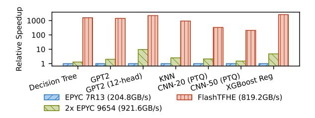

Fig. 19. Normalized Speedup Comparison Across Platforms (Log Scale).

TABLE III
TFHE-COMPATIBLE ASIC ACCELERATORS COMPARISON

|                                                                                    | FlashTFHE | Strix  | Morphling | MATCHA | Trinity | UFC    |
|------------------------------------------------------------------------------------|-----------|--------|-----------|--------|---------|--------|
| Schemes                                                                            | TFHE      | TFHE   | TFHE      | TFHE   | Hybrid  | Hybrid |
| Word Len                                                                           | 48-bit    | 32-bit | 32-bit    | 32-bit | 36-bit  | 32-bit |
| Tech Node                                                                          | 16 nm     | 28 nm  | 28 nm     | 16 nm  | 7 nm    | 7 nm   |
| $\begin{array}{c} \textbf{Reported} \\ \textbf{Area} \ (\text{mm}^2) \end{array}$  | 108.08    | 141.37 | 74.79     | 36.96  | 157.26  | 197.7  |
| $\begin{array}{c} \textbf{16nm Norm} \\ \textbf{Area} \ (\text{mm}^2) \end{array}$ | 108.08    | 52.69  | 24.95     | 25.08  | 411.81  | 637.74 |

phases, reclaiming idle pipeline slots and reallocating the freed memory bandwidth from underutilized key-switching lanes to the external product pipeline. This improves KNN average utilization from 32.7% to 56.2% and reduces its end-to-end latency by 41.7%.

## Takeaway 7: The ciphertext parallelism offered by TFHE hardware accelerators can be effectively harnessed in most real-world multi-bit TFHE workloads.

#### D. Quantifying Architectural Contributions

1) Isolating Microarchitectural Benefits: To rule out memory bandwidth alone as the source of speedup, we additionally measured workload performance on dual AMD EPYC 9654 CPUs with 921.6 GB/s total memory bandwidth, exceeding FlashTFHE's two HBM stacks (819 GB/s). Figure 19 compares the normalized speedup of dual EPYC 9654 and FlashTFHE relative to EPYC 7R13 (baseline). Since dual-9654 provides even higher memory bandwidth, the additional FlashTFHE improvement demonstrates the lower bound of its microarchitectural benefits.

2) Ablation Study: Figure 20 quantitatively shows how incrementally applying each optimization improves delay, energy-delay-product (EDP), and energy-delay-area-product (EDAP) over a well-optimized spatial baseline.

#### E. Comparison with Prior TFHE-compatible Accelerators

Table III compares FlashTFHE against existing ASIC accelerators [12], [19], [32], [33], [43], with all areas scaled to 16 nm [37] and memory controllers and PHY excluded. We perform detailed performance analysis on Morphling, a state-of-the-art TFHE accelerator, and Trinity, a state-of-the-art hybrid accelerator with a smaller area than FlashTFHE. Figure 21 additionally compares energy per PBS across hardware

platforms, showing FlashTFHE's energy advantage throughout the representable parameter range.

- 1) Comparison with Morphling (Pure TFHE SOTA): To isolate the architectural impact independent of other system design choices, we implemented a variant that extends R2MDC FFT units to support our multi-bit TFHE workloads, and verified through simulation that key-switching is not a bottleneck for the XPU configuration. We denote this scaled Morphling as Morphling' in Figure 22, showing that FlashTFHE achieves consistent speedups across all benchmarks.
- 2) Comparison with Trinity (Hybrid SOTA): We developed a cycle-accurate simulator and validated against Trinity's reported numbers (throughput differences < 0.1%). Figure 22 shows FlashTFHE achieves comparable or better performance while occupying only 26.3% of Trinity's area. Trinity adopted NTT, which undermines area efficiency<sup>9</sup>, and multi-bit TFHE's parallelism characteristics limit post-NTT coefficient reuse across MAC resources, causing Trinity's MAC units to be under-utilized.

To further isolate the effects of architectural design, we modeled a TFHE-tailored Trinity (denoted as Trinity' in Figure 22) by replacing NTT with FFT pipelines and removing all CKKS-exclusive functional units that are not utilized in TFHE computation. The comparison shows FlashTFHE's better area efficiency even though Trinity' has been tailored specifically for TFHE.

Our analysis reveals that Trinity's reconfigurability, while beneficial for CKKS and traditional TFHE, does not efficiently support multi-bit TFHE workloads. Multi-bit TFHE's parameter characteristics (k=1) limit how post-FFT/NTT coefficients can be reused across MAC resources, causing Trinity's MAC units to be under-utilized (dropping to 33% for degrees  $>2^{14}$ ). Additionally, Trinity's design choice to time-multiplex inverse-NTT operations through the same units further reduces MAC availability by 5.8–14.3% depending on workload decomposition depth.

Figure 23 shows the PBS throughput comparison for representative parameter sets of various message widths, which also reveals that Trinity's reconfigurability becomes less efficient for multi-bit TFHE. Trinity's architecture provides significantly more MAC capacity than it can effectively utilize, resulting in lower throughput for wider-width workloads.

#### VII. RELATED WORK

Table III compares TFHE-compatible ASIC accelerators. MATCHA [19] was the first Boolean TFHE accelerator, using on-chip key unrolling and integer FFT. Its key unrolling cost grows exponentially with message width, and its maximum polynomial degree of 1024 precludes multi-bit workloads.

Strix [33] introduced multi-level parallelism to increase PBS throughput. However, it does not propose an efficient data

<sup>9</sup>Under matched specifications at 16 nm, an NTT block is approximately 2.73× larger in area and 3.79× higher in power than an FFT block. Synthesis used identical I/O widths, throughput targets, and pipeline depth using Cadence Genus and TSMC N16 at 1 GHz. NTT unit employed Montgomery multiplication, matching Trinity/UFC design choices.

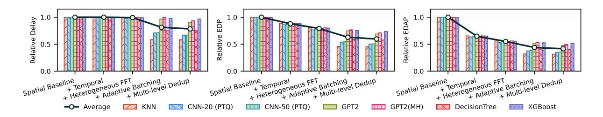

Fig. 20. Ablation Study: How (a) Delay, (b) EDP, and (c) EDAP change when incrementally applying temporal design, heterogeneous FFT units, adaptive batching, and multi-level deduplications to a baseline spatial architecture that incorporates all optimizations from prior TFHE accelerators with identical throughouts and memory bandwidth requirements. Lower is better.

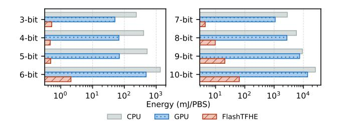

Fig. 21. Energy per PBS operation comparison across hardware platforms for representable parameter sets at each plaintext bit width. Lower is better.

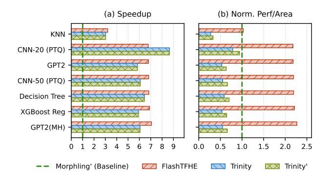

Fig. 22. (a) Speedup and (b) Normalized performance per unit area for FlashTFHE, Trinity, and Trinity' with respect to Morphling'. Compared to an extended Morphling architecture (denoted as Morphling'), original Trinity, and TFHE-tailored Trinity (denoted as Trinity'), FlashTFHE shows comparable or superior performance and area efficiency.

reuse strategy. Morphling [32] and Matrix [28] adopt spatial, output-stationary architectures that stream the bootstrapping key through PE arrays. As analyzed in Section III-C, spatial designs have three scaling limitations for multi-bit workloads: they tightly couple coefficient throughput to DRAM bandwidth, preventing efficient coefficient-parallel scaling; they replicate per-ciphertext in-flight FFT state, making ciphertext-parallel scaling area-prohibitive at large N; and they provision wide PE rows for row-level parallelism that collapses in multi-bit parameter sets. Trinity [12] and UFC [43] are hybrid CKKS/TFHE accelerators that provision 191–272 MB of on-chip SRAM, resulting in substantially larger areas than

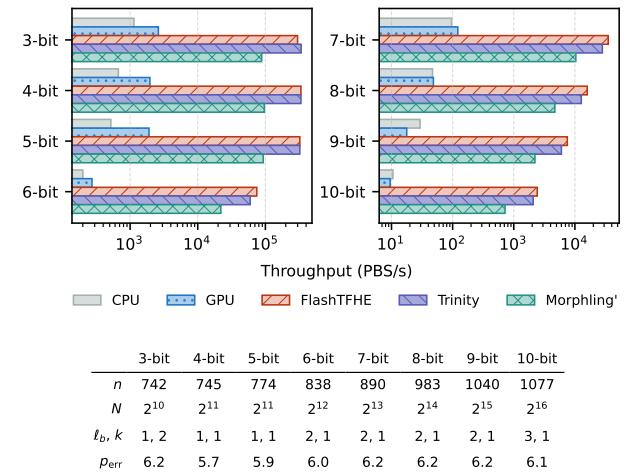

Fig. 23. Throughput comparison across hardware platforms for representable parameter sets at each plaintext bit width.  $p_{\rm err}~(\times 10^{-5})$  denotes the PBS error probability, which is negligible in practice.

#### dedicated TFHE designs.

FlashTFHE extends architectural support to 10-bit ciphertexts with 128-bit security, while achieving the highest normalized throughput per unit area among all TFHE accelerators (Table III). It demonstrates that an architecture with temporal key reuse scales more efficiently as ciphertext width grows.

#### VIII. CONCLUSION

This paper presented FlashTFHE, an accelerator designed to overcome the scalability barriers of multi-bit TFHE workloads. We revealed that the large parameter sets required for wide ciphertexts cause prior spatial architectures to suffer from severe bandwidth, utilization, and area bottlenecks. FlashTFHE resolves these issues through a novel temporal round-robin data reuse strategy that decouples computational throughput from memory bandwidth. FlashTFHE supports up to 10-bit ciphertexts and delivers speedups of up to  $2529\times$  over CPUs,  $1320\times$  over GPUs, and  $7\times$  over the state-of-the-art TFHE accelerator, advancing the practicality of fully homomorphic encryption.

#### REFERENCES

- [1] A. Al Badawi, Y. Polyakov, K. M. M. Aung, B. Veeravalli, and K. Rohloff, "Implementation and Performance Evaluation of RNS Variants of the BFV Homomorphic Encryption Scheme," *IEEE Transactions on Emerging Topics in Computing*, vol. 9, no. 2, pp. 941–956, Apr. 2021.
- [2] M. R. Albrecht, R. Player, and S. Scott, "On the concrete hardness of Learning with Errors," *Journal of Mathematical Cryptology*, vol. 9, no. 3, pp. 169–203, Oct. 2015. [Online]. Available: https://www.degruyter.com/document/doi/10.1515/jmc-2015-0016/html
- [3] Arm Limited, "Arm Artisan IP: Boost SoC Design Efficiency," https: //www.arm.com/products/silicon-ip-physical/artisan-ip, 2024.
- [4] J. Bachrach, H. Vo, B. Richards, Y. Lee, A. Waterman, R. Avizienis, ˇ J. Wawrzynek, and K. Asanovic, "Chisel: Constructing hardware in a ´ Scala embedded language," in *Proceedings of the 49th Annual Design Automation Conference*. San Francisco California: ACM, Jun. 2012, pp. 1216–1225.
- [5] F. Bourse, M. Minelli, M. Minihold, and P. Paillier, "Fast Homomorphic Evaluation of Deep Discretized Neural Networks," in *Advances in Cryptology – CRYPTO 2018*, H. Shacham and A. Boldyreva, Eds. Cham: Springer International Publishing, 2018, vol. 10993, pp. 483– 512.
- [6] J. H. Cheon, K. Han, A. Kim, M. Kim, and Y. Song, "A Full RNS Variant of Approximate Homomorphic Encryption," in *Selected Areas in Cryptography – SAC 2018*, C. Cid and M. J. Jacobson, Eds. Cham: Springer International Publishing, 2019, vol. 11349, pp. 347–368.
- [7] B. Chevallier-Mames and K. Celia, "Making FHE Faster for ML: Beating our Previous Paper Benchmarks with Concrete ML," https://www.zama.ai/post/making-fhe-faster-for-ml-beating-ourprevious-paper-benchmarks-with-concrete-ml, Jul. 2024.
- [8] I. Chillotti, N. Gama, M. Georgieva, and M. Izabachene, "TFHE: Fast ` Fully Homomorphic Encryption Over the Torus," *Journal of Cryptology*, vol. 33, no. 1, pp. 34–91, Jan. 2020.
- [9] I. Chillotti, M. Joye, and P. Paillier, "Programmable Bootstrapping Enables Efficient Homomorphic Inference of Deep Neural Networks," in *Cyber Security Cryptography and Machine Learning*, S. Dolev, O. Margalit, B. Pinkas, and A. Schwarzmann, Eds. Cham: Springer International Publishing, 2021, vol. 12716, pp. 1–19.
- [10] I. Chillotti, D. Ligier, J.-B. Orfila, and S. Tap, "Improved Programmable Bootstrapping with Larger Precision and Efficient Arithmetic Circuits for TFHE," in *Advances in Cryptology – ASIACRYPT 2021*, M. Tibouchi and H. Wang, Eds. Cham: Springer International Publishing, 2021, vol. 13092, pp. 670–699.
- [11] D. De Cock, "Ames, Iowa: Alternative to the Boston Housing Data as an End of Semester Regression Project," *Journal of Statistics Education*, vol. 19, no. 3, p. 8, Nov. 2011.
- [12] X. Deng, S. Fan, Z. Hu, Z. Tian, Z. Yang, J. Yu, D. Cao, D. Meng, R. Hou, M. Li, Q. Lou, and M. Zhang, "Trinity: A General Purpose FHE Accelerator," Oct. 2024.
- [13] L. Ducas and D. Micciancio, "FHEW: Bootstrapping Homomorphic Encryption in Less Than a Second," in *Advances in Cryptology – EU-ROCRYPT 2015*, E. Oswald and M. Fischlin, Eds. Berlin, Heidelberg: Springer Berlin Heidelberg, 2015, vol. 9056, pp. 617–640.
- [14] K. Fukushima, "Neocognitron: A self-organizing neural network model for a mechanism of pattern recognition unaffected by shift in position," *Biological Cybernetics*, vol. 36, no. 4, pp. 193–202, Apr. 1980.
- [15] C. Gentry, A. Sahai, and B. Waters, "Homomorphic Encryption from Learning with Errors: Conceptually-Simpler, Asymptotically-Faster, Attribute-Based," in *Advances in Cryptology – CRYPTO 2013*, R. Canetti and J. A. Garay, Eds. Berlin, Heidelberg: Springer Berlin Heidelberg, 2013, vol. 8042, pp. 75–92.
- [16] A. X. Glittas, M. Sellathurai, and G. Lakshminarayanan, "A Normal I/O Order Radix-2 FFT Architecture to Process Twin Data Streams for MIMO," *IEEE Transactions on Very Large Scale Integration (VLSI) Systems*, vol. 24, no. 6, pp. 2402–2406, Jun. 2016.
- [17] B. Hamner, dcthompson, and Jorg, "Predicting a biological response," https://kaggle.com/competitions/bioresponse, 2012.
- [18] K. Han, S. Hong, J. H. Cheon, and D. Park, "Logistic Regression on Homomorphic Encrypted Data at Scale," *Proceedings of the AAAI Conference on Artificial Intelligence*, vol. 33, no. 01, pp. 9466–9471, Jul. 2019.
- [19] L. Jiang, Q. Lou, and N. Joshi, "MATCHA: A fast and energyefficient accelerator for fully homomorphic encryption over the torus,"

- in *Proceedings of the 59th ACM/IEEE Design Automation Conference*. San Francisco California: ACM, Jul. 2022, pp. 235–240.
- [20] M. Joye, "Guide to Fully Homomorphic Encryption over the [Discretized] Torus," https://eprint.iacr.org/2021/1402, Oct. 2021.
- [21] J. Kim, S. Kim, J. Choi, J. Park, D. Kim, and J. H. Ahn, "SHARP: A Short-Word Hierarchical Accelerator for Robust and Practical Fully Homomorphic Encryption," in *Proceedings of the 50th Annual International Symposium on Computer Architecture*. Orlando FL USA: ACM, Jun. 2023, pp. 1–15.
- [22] J. Kim, G. Lee, S. Kim, G. Sohn, M. Rhu, J. Kim, and J. H. Ahn, "ARK: Fully Homomorphic Encryption Accelerator with Runtime Data Generation and Inter-Operation Key Reuse," in *2022 55th IEEE/ACM International Symposium on Microarchitecture (MICRO)*. Chicago, IL, USA: IEEE, Oct. 2022, pp. 1237–1254.
- [23] S. Kim, J. Kim, M. J. Kim, W. Jung, J. Kim, M. Rhu, and J. H. Ahn, "BTS: An accelerator for bootstrappable fully homomorphic encryption," in *Proceedings of the 49th Annual International Symposium on Computer Architecture*. New York New York: ACM, Jun. 2022, pp. 711–725.
- [24] C. Kjellqvist, B. Peercy, A. R. Lebeck, and L. W. Wills, "Beethoven: A Heterogeneous Multi-Core Accelerator System Composer," in *2025 IEEE International Symposium on Performance Analysis of Systems and Software (ISPASS)*. Ghent, Belgium: IEEE, May 2025, pp. 297–308.
- [25] J. Klemsa, "Hitchhiker's Guide to the TFHE Scheme," https://eprint.iacr. org/2022/1315, Oct. 2022.
- [26] C. Lattner, M. Amini, U. Bondhugula, A. Cohen, A. Davis, J. Pienaar, R. Riddle, T. Shpeisman, N. Vasilache, and O. Zinenko, "MLIR: Scaling compiler infrastructure for domain specific computation," in *2021 IEEE/ACM International Symposium on Code Generation and Optimization (CGO)*, 2021, pp. 2–14.
- [27] S. Li, Z. Yang, D. Reddy, A. Srivastava, and B. Jacob, "DRAMsim3: A Cycle-Accurate, Thermal-Capable DRAM Simulator," *IEEE Computer Architecture Letters*, vol. 19, no. 2, pp. 106–109, Jul. 2020.
- [28] L. Liang, Z. Gu, F. Zhang, Z. Chen, Z. Li, X. Fan, D. Niu, M. Li, Z. Li, Z. Wang, H. Zheng, Y. Cai, and Y. Xie, "Matrix: Multi-Cipher Structures Dataflow for Parallel and Pipelined TFHE Accelerator," *ACM Transactions on Architecture and Code Optimization*, vol. 22, no. 3, pp. 1–23, Sep. 2025.
- [29] C. Marcolla, V. Sucasas, M. Manzano, R. Bassoli, F. H. P. Fitzek, and N. Aaraj, "Survey on Fully Homomorphic Encryption, Theory, and Applications," *Proceedings of the IEEE*, vol. 110, no. 10, pp. 1572–1609, Oct. 2022.
- [30] K. Matsuoka, R. Banno, N. Matsumoto, T. Sato, and S. Bian, "Virtual Secure Platform: A Five-Stage pipeline processor over TFHE," in *30th USENIX Security Symposium (USENIX Security 21)*. USENIX Association, Aug. 2021, pp. 4007–4024, https://www.usenix.org/conference/ usenixsecurity21/presentation/matsuoka.
- [31] F. Pedregosa, G. Varoquaux, A. Gramfort, V. Michel, B. Thirion, O. Grisel, M. Blondel, A. Muller, J. Nothman, G. Louppe, P. Pretten- ¨ hofer, R. Weiss, V. Dubourg, J. Vanderplas, A. Passos, D. Cournapeau, M. Brucher, M. Perrot, and E. Duchesnay, "Scikit-learn: Machine ´ learning in python," https://arxiv.org/abs/1201.0490, Jan. 2012.
- [32] Prasetiyo, A. Putra, and J.-Y. Kim, "Morphling: A Throughput-Maximized TFHE-based Accelerator using Transform-domain Reuse," in *2024 IEEE International Symposium on High-Performance Computer Architecture (HPCA)*. Edinburgh, United Kingdom: IEEE, Mar. 2024, pp. 249–262.
- [33] A. Putra, Prasetiyo, Y. Chen, J. Kim, and J.-Y. Kim, "Strix: An endto-end streaming architecture with two-level ciphertext batching for fully homomorphic encryption with programmable bootstrapping," in *Proceedings of the 56th Annual IEEE/ACM International Symposium on Microarchitecture*, ser. Micro '23. New York, NY, USA: ACM, 2023, pp. 1319–1331.
- [34] A. Radford, J. Wu, R. Child, D. Luan, D. Amodei, and I. Sutskever, "Language Models are Unsupervised Multitask Learners," *OpenAI blog*, vol. 1, no. 8, p. 9, 2019.
- [35] N. Samardzic, A. Feldmann, A. Krastev, S. Devadas, R. Dreslinski, C. Peikert, and D. Sanchez, "F1: A fast and programmable accelerator for fully homomorphic encryption," in *MICRO-54: 54th Annual IEEE/ACM International Symposium on Microarchitecture*, ser. Micro '21. New York, NY, USA: Association for Computing Machinery, 2021, pp. 238–252.
- [36] N. Samardzic, A. Feldmann, A. Krastev, N. Manohar, N. Genise, S. Devadas, K. Eldefrawy, C. Peikert, and D. Sanchez, "CraterLake: A

- hardware accelerator for efficient unbounded computation on encrypted data," in *Proceedings of the 49th Annual International Symposium on Computer Architecture*. New York New York: ACM, Jun. 2022, pp. 173–187.
- [37] A. Stillmaker and B. Baas, "Scaling equations for the accurate prediction of CMOS device performance from 180 nm to 7 nm," *Integration*, vol. 58, pp. 74–81, Jun. 2017.
- [38] Synopsys, Inc., "Design Compiler: RTL Synthesis Solution," https://www.synopsys.com/implementation-and-signoff/rtl-synthesistest/dc-ultra.html, Mountain View, CA, USA, Sep. 2024.
- [39] C. Wolf, J. Glaser, and J. Kepler, "Yosys-a free verilog synthesis suite," 2013. [Online]. Available: https://api.semanticscholar.org/CorpusID: 202611483
- [40] Zama, "Concrete ML: A privacy-preserving machine learning library using fully homomorphic encryption for data scientists," https://github. com/zama-ai/concrete-ml, 2022.
- [41] Zama, "Concrete: TFHE Compiler that converts Python programs into FHE equivalent," https://github.com/zama-ai/concrete, 2022.
- [42] Zama, "TFHE-rs: a pure rust implementation of the TFHE scheme for boolean and integer arithmetics over encrypted data," 2022. [Online]. Available: https://github.com/zama-ai/tfhe-rs
- [43] M. Zhou, Y. Nam, X. Wang, Y. Lee, C. Wilkerson, R. Kumar, S. Taneja, S. Mathew, R. Cammarota, and T. Rosing, "UFC: A Unified Accelerator for Fully Homomorphic Encryption," in *2024 57th IEEE/ACM International Symposium on Microarchitecture (MICRO)*. Austin, TX, USA: IEEE, Nov. 2024, pp. 352–365.