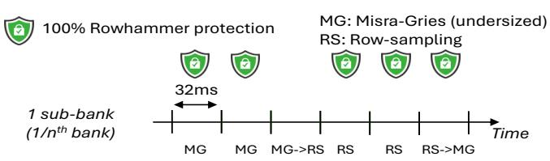

# *A. Our Novel Insights*

The following three insights guided our design.

Insight #1: Even when under-provisioned, Misra-Gries stops Rowhammer attacks as long as its spillover counter remains below the Rowhammer threshold. Perhaps unexpectedly, under-provisioning does not eliminate all Misra-Gries's security guarantees. As long as the spillover counter stays below the threshold, Misra-Gries blocks all Rowhammer attacks. Combined with its strong performance characteristics, this makes Misra-Gries well suited for common-case conditions, such as when the system is not under attack or when attacks are unsophisticated (e.g., involving only a small number of aggressor rows).

Insight #2: Under-provisioned counter tables do not need to track an entire bank, but they can track portions of it, called *sub-banks*. It is more practical to implement k smaller, under-provisioned counter tables with c entries each—one per sub-bank—than to build a single large table with k ×c entries for the entire bank.

Insight #3: When the spillover counter value approaches the Rowhammer threshold, it can act as an early warning that the system *might be* under attack. This triggers our hybrid scheme to transition to a more resource-intensive defense than what is used during normal operation. In Sigries, these transitions occur independently per sub-bank, meaning different sub-banks within the same bank can be in different modes at the same time, thereby reducing performance overhead.

Sigries leverages these insights to implement a hybrid scheme with two modes. In *light mode*, Sigries uses an underprovisioned Misra-Gries scheme. If a workload *overwhelms*

Fig. 1: Sigries switching from light (MG) to heavy (RS) mode in the third 32ms window and back to light in the sixth.

the counters (indicated by the spillover counter value approaching the Rowhammer threshold), Sigries switches to *heavy mode*, employing row-sampling. These switches are per-sub-bank-only, and different sub-banks can be in different modes. Figure [1](#page-5-0) shows a timeline of a sub-bank when switching from light to heavy mode (third window) and back to light mode (sixth window).

