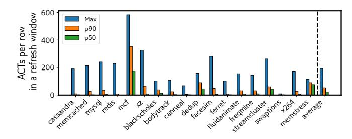
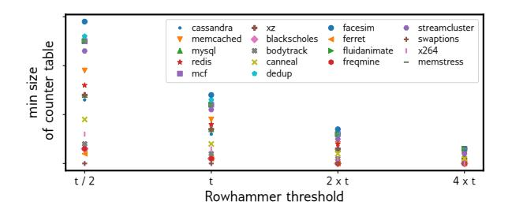
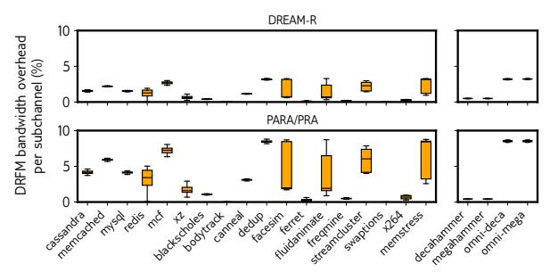
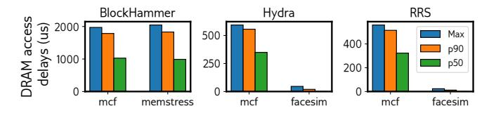

# D. Transitions from Light to Heavy Mode

Commodity workloads. When a spillover counter reaches the Rowhammer threshold, Sigries transitions the corresponding sub-bank from light to heavy mode. In heavy mode, Sigries issues a DRFM command for every sampled row activation, resulting in a constant bandwidth overhead over time on

Fig. 8: Row activations for "hot" rows: max, p90, and p50.

Fig. 9: Minimum counter table size to ensure no sub-bank is overwhelmed. Number of sub-banks is kept constant in all experiments.

average, regardless of whether the system is under attack. A well-tuned Sigries configuration minimizes the frequency of transitions from light to heavy mode.

With our Rowhammer threshold, *commodity workloads* never enter heavy mode. Further, no row counter reaches the Rowhammer threshold to trigger a DRFM command, so there is no DRAM bandwidth overhead.

We ran extensive experiments to determine whether Sigries's counter tables are sized adequately. Figure 9 presents the minimum counter table size required for different Rowhammer thresholds. We omit the numeric axis values due to confidentiality. The y-axis shows the smallest table that prevents Sigries from transitioning from light to heavy mode for a given workload. In all these experiments, the number of sub-banks is kept constant.

The figure shows two trends: (1) the minimum size of the counter table decreases roughly linearly as the Rowhammer threshold increases, and (2) workloads differ in their behavior. In all cases, tables with a low number of counters are sufficient to support conservative Rowhammer thresholds.

**Takeaway:** For commodity, non-adversarial workloads Sigries never transitions from light to heavy mode and has no DRAM bandwidth overhead.

**Rowhammer workloads.** On the left, Figure 10 shows the number of sub-banks that transition into heavy mode. *Decahammer* and *omni-deca* are fully contained by light mode: the under-provisioned Misra-Gries is sufficient to stop 10-sided attacks. However, *megahammer* and *omni-mega* overwhelm the targeted sub-banks. In each bank, the targeted sub-bank transitions into heavy mode.

On the right, Figure 10 shows the bandwidth overhead from DRFMs across a DDR5 sub-channel. Two points stand

Fig. 10: Fraction of sub-banks overwhelmed in a refresh window for an artificially low Rowhammer threshold t.

Fig. 11: Row-sampling-based defenses issue DRFMs for all commodity workloads (left) and Rowhammer attacks (right).

out. First, the overhead is not linear in the number of aggressor rows. *Decahammer* and *omni-deca* incur only light mode overhead, while *megahammer* and *omni-mega* include both light and heavy mode overheads. Second, the overhead can be large, up to 6.8% for *omni-mega*, which targets all banks. However, Sigries pays this cost only under worst-case Rowhammer attacks.

**Takeaway:** Sigries remains in light mode for some Rowhammer attacks; only targeted sub-banks switch to heavy mode under stronger attacks.

## E. Performance Comparison to Prior Defenses

Of the seven defenses we implemented, two match Sigries's performance: Graphene [62] and PRAC [31]. This outcome is expected, as Graphene and Sigries's light mode are both based on Misra-Gries. The difference is that Sigries under-provisions its tables, while Graphene does not. In theory, Graphene is an ideal defense, but its reliance on many large-sized CAM tables makes it impractical. On the other hand, PRAC keeps a per-row counter. Because no row is activated more than a few hundred times per refresh window, PRAC never takes any action.

Two of the defenses, DREAM-R [82] and PARA/PRA [35], [41] consume DRAM bandwidth due to issuing DRFMs. This is also expected—these two sampling-based defenses will issue DRFMs even when the system is not under attack. Figure 11 shows the DRFM bandwidth overhead of these two defenses for both commodity workloads (on the left) and Rowhammer attacks (on the right).

The remaining three defenses, BlockHammer [95], Hydra1 [67], and RRS [71], do not issue DRFMs but they

&lt;sup>1Hydra could issue a DRFM if a row's counter reached the Rowhammer threshold, but this never occurs in our commodity workloads.

Fig. 12: The max, p90, and p50 DRAM access delays for BlockHammer, Hydra, and RRS. Delay is measured as the difference between the access time with no defense and the access time with the defense enabled.

suffer from performance outliers. BlockHammer stalls CPU instructions that access "hot" rows. Hydra keeps counters for all rows in DRAM and must issue extra DRAM accesses to update them. RRS swaps a hot row with a cold one; a swap copies data between rows, and in some cases RRS must unswap and re-swap rows. To evaluate "stall", we compare DRAM access timestamps with and without each defense. For many commodity workloads, the timestamps are identical because no defense is triggered and no stall occurs. For others, the defenses trigger and, thus, some DRAM accesses encounter delays.

Figure 12 shows the two workloads that cause the largest DRAM access delays for each mitigation, reporting max, p90, and p50 delays. BlockHammer can delay accesses by up to 1.97 ms on commodity workloads (our production Rowhammer threshold is well below the thresholds used when BlockHammer was published). Hydra and RRS also show DRAM delays, albeit at sub-millisecond levels.

Table VI summarizes the performance comparison of Sigries to these seven prior defenses.

**Takeaway:** Sigries, Graphene, and PRAC are the only three Rowhammer defenses that issue no DRFMs and suffer from no DRAM access delays for all commodity workloads.

