# From Memorization to Generalization: A Practical Neural Network Prefetching Framework

Xuan Tang\*, Zicong Wang\*, Shuiyi He, Hao Tang, Dezun Dong†, Xiangke Liao *College of Computer Science and Technology National University of Defense Technology* Hunan, China {tangxuan19, wangzicong, heshuiyi24, tanghao, dong, xkliao}@nudt.edu.cn

*Abstract*—Data prefetchers are instrumental in mitigating the memory wall by anticipating future memory accesses. The firstlevel (L1) cache is the ideal location for prefetching, as it observes the complete, unfiltered stream of memory requests. However, its severely limited hardware resources have historically restricted L1 prefetchers to simple, pattern-based strategies, which struggle with complex access patterns. Conversely, recent machine learning (ML) based prefetchers like Pythia and Pathfinder demonstrate broader coverage but their prohibitive storage and computational costs relegate them to the L2 or last-level cache, making them too slow to be effective for the L1. This creates a critical design tension: the most powerful prefetching intelligence is stranded far from where it is needed most.

To resolve this tension, we propose Moirai, a practical neural network prefetching framework designed specifically for the L1 data cache. Moirai's core is *CaPNet*, a highly compact Binarized Neural Network we designed to achieve high-accuracy predictions within a tiny hardware footprint. Our evaluation shows that Moirai delivers competitive performance against state-of-theart prefetchers while consuming only 780 Bytes of storage, an area reduction of over 97% compared to recent ML-based designs. Moirai thus charts a practical path forward for deploying powerful, generalization-based predictors in the most resourcesensitive parts of a modern processor.

## I. INTRODUCTION

Data prefetching is a cornerstone technique for hiding memory access latency, a primary performance bottleneck in modern processors [47]. The effectiveness of a prefetcher is heavily influenced by its location within the cache hierarchy. The first-level data (L1D) cache is widely regarded as the most powerful position for prefetching [34]. Its proximity to the core provides three distinct advantages: it observes the complete and unfiltered stream of memory requests, it can issue prefetches with the lowest possible latency, and it has direct access to crucial core-level context, such as the program counter (PC) [34], [36].

However, this ideal location is also the most resourceconstrained. With typical capacities of just a few tens of kilobytes (e.g., 32KB in Intel's Alder Lake [41]), the L1D cache imposes a strict hardware budget that prefetchers must adhere to. This creates a fundamental design paradox: the location with the highest potential for sophisticated prediction is precisely where hardware resources are most scarce.

Existing approaches to this challenge fall into one of two paradigms: memorization or generalization. Prefetchers based on memorization, such as state-of-the-art (SOTA) tablebased designs [3], [6], [7], [23]–[25], [30], [33], [34], [36], [42], are compact enough to fit within the L1D cache. However, they operate by matching the current access stream to exact, previously observed patterns. This makes them inherently brittle, limiting their coverage to simple, repetitive sequences and failing to capture more complex memory correlations. While they are practical, they do not unlock the full predictive power of the L1D location.

The generalization paradigm, primarily embodied by recent machine learning models [11], [29], [38], [43], [46], [49], offers a more powerful alternative. By learning underlying features from access history, these models can predict novel patterns not seen before. However, this power comes at the cost of prohibitive hardware complexity and storage, confining these sophisticated designs to the L2 or LLC caches [10], [18], [50]. From the L1D cache's perspective, they are too large to be implemented and too slow to be effective. This spatial detachment creates a critical capability gap. Because the L1D cache filters out the vast majority of memory requests, prefetchers residing at the L2 or LLC only observe a decimated, non-contiguous stream of L1 misses, fundamentally depriving them of the full temporal context. Furthermore, the physical distance delays prefetch injections, rendering many accurate predictions too late to hide the access latency. Therefore, the isolated benefit of L1-resident learning is twofold: it grants a model unfiltered visibility into the core's groundtruth semantic sequence, and it ensures the timeliness required to immediately hide latency. Consequently, neither paradigm in its current form resolves the L1D prefetching paradox: memorization is practical but weak, while generalization is powerful but impractical.

This paradox prompts a fundamental architectural question: given an acceptable budget of a few kilobytes, what is the most effective way to utilize this critical L1D resource? One path is to expand memorization tables, pursuing incremental gains within the existing paradigm. A different philosophy, however, suggests investing that budget in a radically more efficient, generalization-based model. The value of such an approach would lie not merely in area savings, but in the significant architectural opportunity cost it frees up, enabling designers to

<sup>\*</sup>Both authors contributed equally to this work.

<sup>†</sup>Corresponding author

reallocate scarce resources to other critical core components.

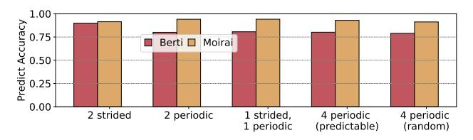

Fig. 1: Prefetcher accuracy on synthetic workloads of increasing complexity. *Predictable* indicates streams with short, simple repeating periods. *Random* refers to streams with long, complex periods that appear pseudo-random.

To bridge the gap, we introduce **Moirai**, a prefetching framework designed to deliver the **power of generalization** within practical constraints of the L1D cache. Our goal is to demonstrate that a carefully designed neural architecture can overcome the trade-offs that have limited prior works.

To quantitatively demonstrate the advantage of Moirai's generalization-based approach, we use a set of synthetic workloads with increasing pattern complexity from the work of Braun and Litz [4]. As illustrated in Figure 1, the performance of the SOTA, memorization-based prefetcher Berti is strong on simple patterns but degrades as the patterns become more complex. In contrast, Moirai's generalization-based approach allows it to maintain a consistently high accuracy across all workloads, from simple strides to complex random periodic patterns. This result highlights the fundamental advantage of learning a robust underlying model of program behavior and motivates the need for a new approach capable of generalization.

However, architecting a neural network for the L1D environment requires solving a formidable set of technical challenges that have previously stalled progress:

- Extreme Hardware Constraints: The L1D operates on a budget of several clock cycles and mere kilobytes, immediately invalidating conventional neural network designs. The challenge is to fundamentally design a model for small-scale latency and area.
- The Prediction vs. Complexity Dilemma: Effective generalization demands representational power that is directly at odds with the extreme simplicity mandated by the hardware budget. The challenge is to achieve high predictive accuracy from a radically compressed model.
- Feasibility of On-Chip Training: An L1D prefetcher must adapt to changing access patterns in real-time, necessitating on-chip backpropagation, notoriously complex and resource-intensive in hardware.

To overcome these challenges, we propose **Moirai**, a complete prefetching framework that makes generalization practical for the L1D cache. At its core, Moirai leverages a customized, binarized Temporal Convolutional Network (TCN), which we name *CaPNet*, to learn and predict future memory accesses from a stream of address deltas. This entire approach is made feasible by the following key contributions:

- 1) We propose **Moirai**, the first practical framework for deploying a neural network prefetcher in the L1D cache, built around a hardware-first Binarized TCN, *CaPNet*. It delivers competitive performance with only **780 Bytes** of storage, over 97% less than prior ML designs [11].
- 2) A Low-Cost, Global-Stream Pre-processing Technique: We propose a lightweight window-based extended delta algorithm that filters two key sources of feature corruption (delta sparsity and alternating page access) from the global address stream, providing high-quality input features without expensive PC-based stream splitting tables.
- 3) A Lightweight Online Learning and Control Mechanism: We design a controller that orchestrates *CaPNet*'s on-chip training and inference, and dynamically tunes prefetching aggressiveness based on model confidence.

## II. DESIGN SPACE EXPLORATION FOR L1D NEURAL NETWORK PREFETCHING

#### A. Feature Space: Why a Delta-based Representation?

A neural network prefetcher's effectiveness hinges on its input feature representation. Using raw 64-bit addresses is inefficient, as it lacks translation invariance, which forces the model to redundantly learn identical patterns at different memory locations and creates a vast, sparse feature space that is difficult for a compact model to learn. To overcome this, we use the sequence of address **deltas** (the difference

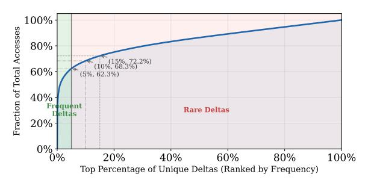

(a) CDF Curve: The X-axis represents the top percentage of unique delta values (sorted from most to least frequent). The Y-axis represents the cumulative percentage of total memory accesses they account for. The data comes from the average value of different traces.

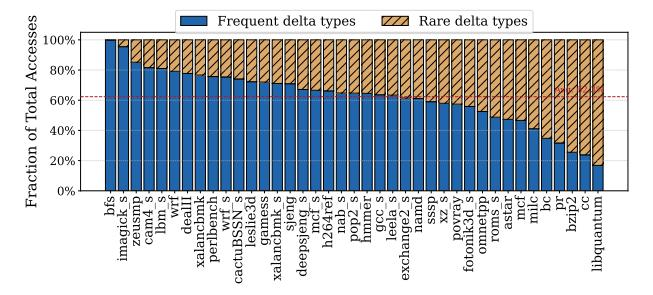

(b) Per-trace Breakdown: The percentage of total accesses accounted for by the *frequent delta* across individual workloads.

Fig. 2: Distribution of memory access deltas.

between consecutive accesses) [22], [34], [35], [37]. This representation is inherently translation-invariant and, crucially, creates a highly structured feature space.

Our analysis of SPEC benchmarks reveals a key property we term *delta sparsity*. As illustrated by the cumulative distribution function (CDF) in Figure 2a, memory accesses exhibit a heavily skewed distribution. When unique delta values<sup>1</sup> are sorted by occurrence frequency, the top 5%, which we define as *frequent deltas*, account for 62.3% of all accesses. The remaining types, defined as *rare deltas*, exhibit low individual frequencies. This skewed distribution, also leveraged by prior work [34], is critical because it shows that core memory behavior is dominated by a few key patterns. This allows a lightweight network to focus its limited resources on these patterns for effective generalization.

Figure 2b details this concentration across individual traces: in  $cam4\_s$ , the top 5% of deltas cover about 82% of total accesses. While a few irregular traces (e.g., pr, bc) show a flatter distribution, the overwhelming majority exhibit this severe imbalance. For irregular workloads where concentrated patterns are absent, our dynamic control mechanism (Section III-B3) halts prefetching to prevent pollution. For the common case, this concentration means a prefetcher can focus entirely on learning transitions among the frequent deltas. Therefore, we establish our first design principle: to build an efficient and generalizable neural network L1D prefetcher, it is a favorable option to model based on the delta sequence.

#### B. Model Space Exploration: Why a TCN-Based Model?

Given the delta sequence, prefetching becomes a sequence modeling problem. To select the optimal architecture, we evaluated RNNs, LSTMs, and TCNs under a strict L1D parameter budget ( $\approx 380$  parameters) [5], [21], [31].

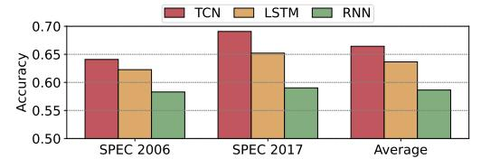

Fig. 3: Prediction accuracy comparison of three sequence models (RNN, LSTM, TCN) configured with a similar parameter budget. The TCN consistently shows the highest accuracy.

The results, shown in Figure 3, demonstrate that the TCN architecture consistently achieves the highest prediction accuracy. While RNNs and LSTMs possess theoretically infinite temporal receptive fields, which allow them to capture highly complex access patterns, they suffer from a fundamental microarchitectural mismatch with the L1D cache. The strictly sequential nature of their state updates creates a critical latency bottleneck. In the latency-sensitive L1D context, this inflated inference time renders most predictions "late", entirely negating the coverage benefits of discovering longer-range patterns.

In contrast, TCN's superior performance stems from two key characteristics. First, its convolutional nature allows parallel processing of the entire input sequence, a crucial advantage for low-latency hardware implementation over the sequential nature of RNNs and LSTMs. Second, its use of dilated convolutions enables a large receptive field with few layers, allowing it to capture the long-range dependencies common in delta sequences efficiently. Based on this empirical evidence, we establish our second design principle: for a hardware-constrained prefetching context, the TCN architecture provides an effective and efficient predictive backbone.

#### C. Implementation Space Exploration: Why Binarization?

Implementing the TCN within the L1D's draconian area and power budgets remains a formidable challenge. Traditional fixed-point models incur prohibitive multiply-accumulate (MAC) overheads that quickly violate these constraints. Therefore, we aggressively apply binarization, constraining both weights and activations to 1-bit. This transformation radically shifts the computation paradigm, replacing costly arithmetic multipliers with highly area-efficient bitwise logic.

This transformation offers two profound advantages for a hardware implementation. First, it yields an order-of-magnitude storage reduction. More importantly, it fundamentally changes the computation paradigm, replacing expensive MAC operations with highly efficient, bitwise XNOR and popcount logic. This makes both fast inference and on-chip training feasible on a small-scale logic budget. While this aggressive quantization poses accuracy challenges, they are largely mitigated by advanced training techniques [16], [17], [27]. Therefore, we establish our third design principle: embracing binarization is the key enabling strategy for a practical L1D neural sequence model, as it aligns the model's computational demands with the hardware's capabilities.

#### III. MOIRAI: DESIGN AND IMPLEMENTATION

#### A. High-Level Overview

As illustrated in Figure 4, Moirai's operation is a three-stage pipeline<sup>2</sup>. First, in **Data Preprocessing**, incoming addresses are converted into a noise-filtered delta feature stream. This stream is then fed to *CaPNet* for **Model Training and Inference**, where it either updates weights or predicts future deltas. Finally, in the **Prefetch Request Generation** stage, these predictions are used to generate and issue prefetch addresses under the controller's policy.

These stages are executed by two learned units. The Input Processing Unit handles Data preprocessing, and the *CaPNet* Predictive Engine handles training and inference. Orchestrating both, the Adaptive Control Unit switches phases and governs prefetch request generation.

<sup>&</sup>lt;sup>1</sup>For instance, given a delta sequence  $\{+1, +2, +3, +1, +3, +1\}$ , the set of unique deltas is  $\{+1, +2, +3\}$ .

<sup>&</sup>lt;sup>2</sup>The *Delay* block represents hardware pipeline registers used to synchronize the base address with inference output. *Const. Offsets* are hardcoded fixed values used to control prefetch aggressiveness. In addition, the Prefetch Request Generation stage hardwires a block+1 offset issued on every L1D demand miss, with no extra storage.

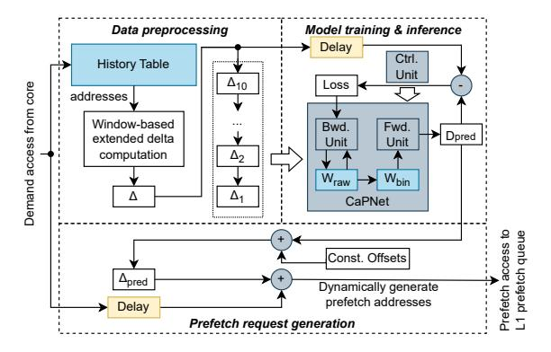

Fig. 4: Moirai's high-level workflow.

#### B. Moirai's Core Components

The core architecture of Moirai is composed of three tightlycoupled components that work in concert to implement the workflow described in Section III-A. We detail the design of each component in the following sections.

1) Delta Stream Pre-processing: While the delta-based representation established in Section II-A is theoretically superior, a naive delta computation, simply taking the difference between two adjacent addresses, suffers from practical flaws. Through an in-depth analysis of real program traces, we identified two key challenges that can severely corrupt the delta feature stream and mislead the neural network.

The first challenge is *Delta Sparsity*. As demonstrated in Figure 2a, while a small set of frequent deltas dominates the access stream, the execution flow is inevitably populated by a long tail of diverse, low-frequency deltas. These rare deltas, particularly large outliers caused by atypical control flow, act as noise that can disrupt the neural network's training process, forcing it to expend its limited capacity on statistically insignificant events.

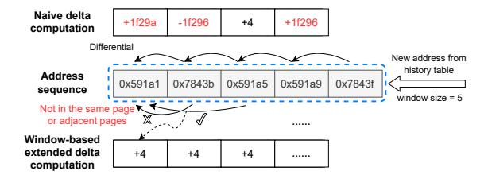

Fig. 5: An example of Window-based Extended Delta computation. (Top) A naive delta calculation may produce large, meaningless deltas during alternating page access. (Bottom) Our proposed algorithm ignores the jump to the distant page and computes the true, local delta.

The second challenge arises when the memory access sequence is effectively composed of multiple, interleaved logical streams, a common pattern we term *Alternating Page Access*. Our analysis shows this pattern is significant, accounting for approximately 60% of total memory references in SPEC.

```
Algorithm 1: Window-based extended delta computation
```

```
Input: aw: address sequence in window,
         ws: window size
Output: \Delta: extended delta of the first address
\Delta \leftarrow 0
for i \leftarrow 1 to ws - 1 do
   /* Judge whether the two addresses
       meet the page limitation
   if \&((aw[0] \gg 13) \odot (aw[i] \gg 13)) == 1 then
       /\star Only the difference of the
           low bits of the addresses
           needs to be calculated
       \Delta \leftarrow aw[i] - aw[0]
       return \Delta
   end
end
return abnormal
```

As illustrated in the top half of Figure 5, this pattern often occurs when the processor alternates its accesses between two (or more) data structures, resulting in jumps across distant memory pages. A naive delta calculation in this multistream scenario generates a series of large, oscillating, and meaningless delta values. These "false" deltas, created by the interleaving of streams, often mask the true, smaller-scale access patterns that may exist within each individual stream, such as simple strides.

A common approach to mitigate the challenges of *Delta Sparsity* and *Alternating Page Access* is to perform PC-based stream splitting [23], [34]. However, this method incurs hundreds of bytes to kilobytes to store and manage the state for numerous PCs, representing a significant design trade-off within the tight budget of the L1D cache.

To effectively solve the core challenges at a lower hardware cost by focusing on local stream reconstruction, we propose a lightweight mechanism: the Window-based Extended Delta computation, detailed in Algorithm 1. This approach represents a different design trade-off: instead of paying the high cost of PC tables, we tackle the noisy global stream directly. The core idea is to search within a small sliding window for the next semantically relevant access. This approach handles boundary conditions (e.g., multi-page accesses) by filtering long-distance jumps to focus on accesses on the same or adjacent page (Figure 5), implicitly assuming the primary value lies in spatial locality. This spatial constraint is a deliberate design trade-off: a stricter single-page limit would truncate data structures crossing page boundaries, while a spatial constraint would expand the delta vocabulary size (increasing neural network input complexity) and risk crosspolluting the sequence with independent streams. Through empirical evaluations, we determined that an 8KB spatial constraint represents an optimal balance between bounding computational overhead and maintaining a highly informative input feature dimension. This represents a targeted tradeoff: instead of incurring the high cost of PC-based stream splitting, Moirai focuses on common local patterns within its low budget, though we acknowledge this may miss certain large cross-page stride patterns.

The effectiveness of this algorithm is visualized in Figure 5 (bottom). It successfully filters the inter-page jump and instead bridges the two accesses within the same page, computing the true, meaningful delta. This single mechanism elegantly solves both issues: it correctly interprets the *Alternating Page Access* pattern and, by its nature, filters out the large, abnormal values that contribute to *Delta Sparsity*. The result is a cleaner, denser, and more semantically meaningful feature stream. Furthermore, as the algorithm only requires simple bitwise and arithmetic operations, it is extremely lightweight and can be efficiently implemented in hardware.

We acknowledge the theoretical limitation that our heuristic could generate "false deltas" from unrelated streams interleaved within the same page. However, the TCN's generalization capability mitigates this: if the interleaving is regular, the "false delta" sequence forms a new, learnable complex pattern, and if irregular, our sequence-based model is robust to the resulting noise. Unlike table-based prefetchers that suffer catastrophic chain-breaking from a single noisy access, our TCN processes a broader temporal receptive field, treating an irregular "false delta" as an isolated perturbation that convolutional layers smooth over using surrounding valid context. Furthermore, because irregular false deltas lack consistent recurring patterns, the network's training naturally deemphasizes them, allowing the filters to focus on the dominant underlying memory streams.

*2) CaPNet: The Binarized TCN Engine:* Following the principles in Section II-B, Moirai's core predictive engine, *CaPNet*, is a binarized Temporal Convolutional Network tailored to the L1D's area, power, and latency constraints.

To understand our design rationale, we first consider the baseline: a standard TCN takes a sequence of historical address deltas as input, using 1D convolutional layers to extract spatialtemporal features. However, this baseline is prohibitively expensive for the L1D, as floating-point MAC operations in both forward inference and backward training violate the cache's area and power budgets.

The primary design goal for *CaPNet* is to maximize predictive accuracy on delta sequences while adhering to the stringent hardware budget of the L1D cache. To achieve this, we had to address two core challenges: (C1) How to ensure the model can still learn effectively despite the significant information loss from binarization? (C2) How to design a concrete, hardware-friendly microarchitecture to efficiently execute both training and inference?

To overcome these challenges, we applied a series of targeted optimizations:

• 1) Binarization for inference: To eliminate floating-point MACs, we heavily quantize both weights and activations to 1-bit, replacing them with simple XNOR and popcount logic gates (addressing C2).

- 2) Mixed-precision for training: To overcome the severe information loss of binarization during online training, we introduce mixed-precision latent weights (Wraw), allocating 7-bit to the sensitive first layer and 4-bit to others, ensuring accurate gradient accumulation (addressing C1).
- 3) STE-enabled gradient computation: To perform backpropagation in the BNN, we adopt the Straight-Through Estimator (STE), allowing gradients to flow to the latent weights despite the 1-bit forward path (addressing C2).

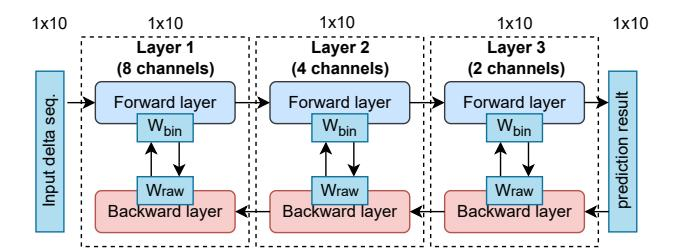

Fig. 6: The overall architecture of *CaPNet*, a 3-layer TCN with a [8,4,2] channel structure.

The overall microarchitecture of *CaPNet* is illustrated in Figure 6, a shallow network composed of three stacked TCN layers with channel configuration [8,4,2].Here, channels refer to parallel convolutional filters, not hardware routing paths. Moirai operates on a unified global delta sequence: the entire input window is broadcast to all channels in a layer, and each channel independently learns a distinct spatial-temporal pattern from this shared context. It takes a sequence of 10 processed deltas as input and outputs a prediction for the subsequent delta. Each layer in *CaPNet* is comprised of a *Forward Layer* for inference and a *Backward Layer* for weight updates during backpropagation. The key to *CaPNet*'s success lies in its training strategy and its hardware-centric implementation.

*a) Training Strategy:* To overcome the accuracy challenge of on-chip training, *CaPNet* employs a co-designed training strategy that combines three key techniques: mixedprecision latent weights, Straight-Through Estimator (STE) backpropagation, and gradient sharing. First, we adopt a mixed-precision representation for the latent "raw weights" (Wraw). Recognizing that the first layer is the most sensitive to feature fidelity, we allocate a 7-bit representation for its weights, while the subsequent, less sensitive layers use a more area-efficient 4-bit representation.

Second, to enable backpropagation through the nondifferentiable binarization function, we use the STE technique [9]. STE allows the gradient to bypass the binarizer of the whole network. Consequently, the gradient updates are successfully applied to the latent weights (Wraw) of all layers (both the 7-bit and 4-bit weights), allowing all layers to be updated online. Finally, to further reduce the hardware cost of the update logic, we employ a gradient sharing strategy, where multiple weights within the same convolutional filter share a common set of gradient calculation and storage units. This

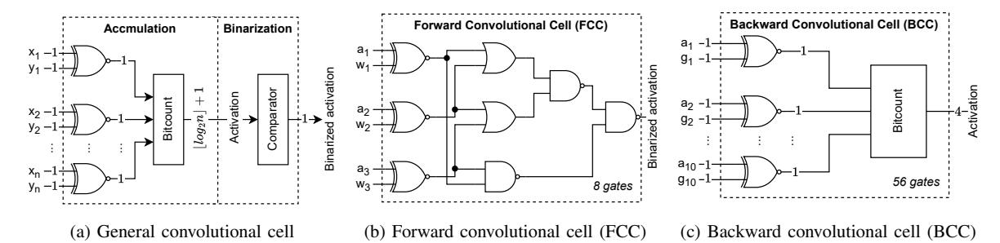

Fig. 7: 1D convolution structures in *CaPNet*. (a) illustrates a general convolutional cell. (b) and (c) depict the hardware-centric Forward Convolutional Cell (FCC) and Backward Convolutional Cell (BCC), respectively.

combined strategy allows *CaPNet* to retain sufficient highprecision information for effective learning, while benefiting from the extreme hardware efficiency of binarized operations during forward pass.

b) Hardware-Centric Convolutional Units: Another core innovation of CaPNet is its hardware-centric design, which replaces expensive arithmetic operations with simple logic. By binarizing weights and activations, the MAC operations central to conventional neural networks are transformed into highly efficient, bitwise XNOR and bitcount (popcount) operations [32], [40], [48]. Based on this principle, we designed two fundamental compute cells shown in Figure 7: the Forward Convolutional Cell (FCC) for inference and the Backward Convolutional Cell (BCC) for backpropagation. These two cells are specialized from the general convolution cell (shown in Figure 7a). These cells are composed into the full Forward and Backward Layers illustrated in Figure 8. Structurally, the sizes of these cells reflect the network dimensions: the FCC (Figure 7b) takes 3 inputs corresponding to the convolutional kernel size, while the BCC (Figure 7c) takes 10 input pairs corresponding to the entire temporal sequence length, efficiently accumulating the gradient updates for the shared weights across all time steps. During a forward pass, as shown in Equation 1, the i-th layer's FCC convolves the incoming activation  $Al_{i-1}$  with the binarized filter  $W_{bin}^k$  to produce the channel activation  $Ac_i^k$ . During backpropagation, as shown in Equation 2, the BCC uses the incoming gradient  $G_{i+1}$  and the forward-pass activation  $Ac_i^k$  to compute the gradient update  $\Delta W_{raw}^k$  for the latent raw weights. The backpropagation process must also compute the gradients to be passed down to the preceding layer. In Figure 8b, this is abstracted as the "Gradient Computation" block. Crucially, because CaPNet's forward weights are binarized, this block avoids all complex multiplication. In hardware, it is synthesized simply as an array of conditional sign-flippers, coupled with a shallow adder tree to accumulate the results across the K channels.

$$Ac_i^k = \operatorname{bitcount}(Al_{i-1} \odot W_{bin}^k) \tag{1}$$

$$\Delta W_{raw}^k = G_{i+1} * Ac_i^k \tag{2}$$

This design decomposes the entire neural network computation into simple, bitwise operations, making the hardware implementation extremely lightweight and efficient.

- 3) Adaptive Control Unit: While the CaPNet engine provides powerful predictive capabilities, the Adaptive Control Unit governs CaPNet's training/inference lifecycle to ensure stability and adaptability. Its design is centered around two core objectives: 1) Stability: It must guarantee that issued prefetches originate from a converged, reliable model, avoiding cache pollution from a volatile model undergoing rapid weight changes. 2) Adaptability: It must monitor real-time program behavior and trigger retraining when the model's accuracy degrades, allowing it to adapt to new memory access patterns. The controller achieves both objectives via a two-level mechanism: an outer phase-switching loop and an inner in-inference aggressiveness tier.
- a) Mechanism 1: Dynamic Training and Inference Phasing: To achieve both stability and adaptability, the control unit employs a dual-metric policy using both average loss  $(L_{avg})$ and an access counter to dynamically manage the transition between training and inference phases, as depicted in Figure 9. The logic is governed by a set of configurable thresholds ( $N_{inf}$ ,  $L_{\rm inf}$ ,  $N_{\rm train}$ ,  $L_{\rm train}$ ). A transition from training to the stable inference phase occurs only when the model has converged  $(L_{avg} < L_{inf})$  on a sufficient number of samples (counter >  $N_{\rm inf}$ ), or after a training timeout that prevents stalled convergence from blocking inference indefinitely. Conversely, a new training phase is triggered whenever the controller detects that program behavior has shifted, causing prediction accuracy to drop ( $L_{avg} > L_{train}$ ), or after a long period of inference  $(counter > N_{train})$ . During the training phase, prefetching from CaPNet is paused to ensure stability. This pause is a deliberate trade-off for stability. Unlike fully asynchronous predictors, our phased approach avoids the cache pollution from unreliable predictions that volatile, intermediate weight states can cause. During this brief retraining gap, the auxiliary prefetcher acts as a fallback mechanism, capturing simple stride patterns to ensure a baseline level of performance.
- b) Mechanism 2: Confidence-Based Dynamic Prefetch Aggressiveness: The controller's most sophisticated adaptive feature is its ability to dynamically adjust prefetching aggressiveness based on the model's real-time confidence. During the inference phase, the average loss  $L_{avg}$  serves as an indicator

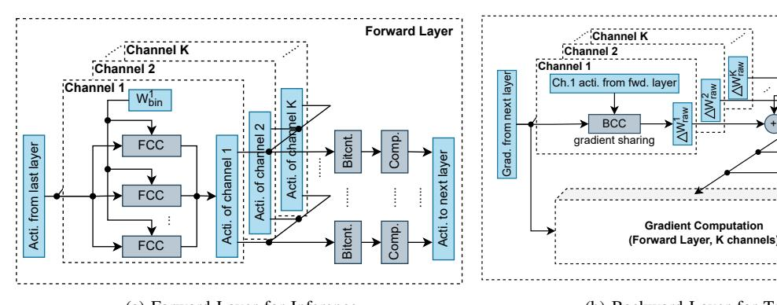

(a) Forward Layer for Inference (b) Backward Layer for Training

Fig. 8: Layer structures in *CaPNet*. The forward layer uses binarized weights for efficient inference, while the backward layer uses gradients to update the higher-precision latent weights, enabling effective online learning.

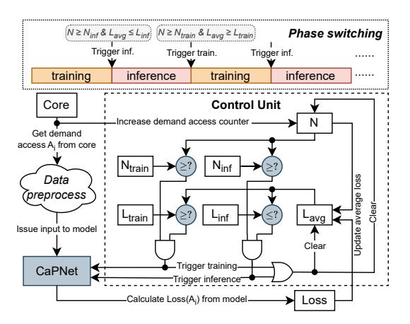

Fig. 9: The workflow of the Adaptive Control Unit, governed by a dual-metric policy of access counts and average loss.

of the model's confidence in its predictions. We define two loss thresholds to create a three-tiered aggressiveness policy:

- High Confidence: When  $L_{avg}$  is below a low threshold, the model is highly reliable. The controller adopts a conservative policy, issuing only the single prefetch corresponding to the primary predicted delta  $(D_{\rm pred})$  to maximize accuracy.
- Medium Confidence: When  $L_{avg}$  is between the two thresholds, the controller balances coverage and accuracy by issuing five prefetches  $(D_{\text{pred}}, \ldots, D_{\text{pred}} \pm 2)$ .
- Low Confidence: When  $L_{avg}$  exceeds a high threshold, the model is likely struggling. The controller adopts the most aggressive policy, issuing nine prefetches ( $D_{\rm pred}$ ,  $D_{\rm pred}\pm 1,\ldots,D_{\rm pred}\pm 4$ ) to maximize coverage before a full retrain is triggered.

It is crucial to distinguish this intra-inference aggressiveness scaling from the phase-based throttling mechanism. This policy of increasing prefetch degree (up to 9 prefetches) operates only when the model is still in the inference phase (i.e.,  $L_{avg}$  is high but still below the  $L_{train}$  threshold). It is a short-term

strategy to maximize coverage before the model is deemed fully unreliable. Once the loss crosses the higher  $L_{train}$  threshold, the controller triggers a transition to the training phase, at which point all CaPNet prefetching is paused, representing the system's primary throttling mechanism.

This dynamic adjustment allows Moirai to intelligently balance the potential performance gains from prefetching against the risk of cache pollution.

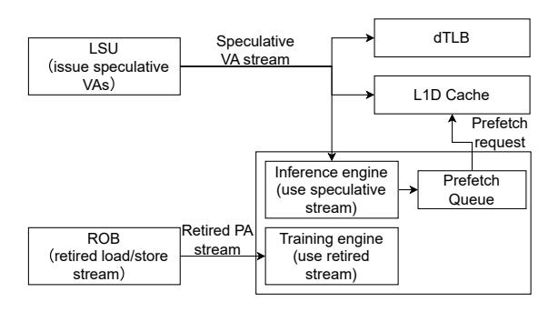

Fig. 10: Moirai's integration into the CPU core's memory pipeline, showing parallel access to the speculative VA stream and a retired PA stream for training.

#### C. Microarchitectural Integration

Figure 10 illustrates Moirai's integration into a modern out-of-order core. The design ensures timely prediction on speculative data while maintaining high training accuracy on retired instructions. Moirai operates on Virtual Addresses (VAs) to enable pattern detection immediately upon address generation. To ensure timeliness, it receives the speculative VA from the LSU in parallel with the L1D cache and dTLB, adding no latency to the critical path. To maintain accuracy, the training engine uses a separate, non-speculative address stream from the Re-Order Buffer (ROB). Generated prefetch VAs are placed in a Prefetch Request Queue (PRQ) before being issued through the standard pipeline to bring data into the L1D cache. To strictly account for the neural computation

overhead, we enforce a 3-cycle microarchitectural delay for the pipelined *CaPNet* forward pass before placing a prediction into the PRQ, based on our synthesis results (Section V-H). The phase-control logic adds no further latency; its state (Lavg and counters) is updated asynchronously, gating *CaPNet*'s output via shallow combinational logic within the same cycle. Backward compute is also asynchronous, utilizing the retired stream from the ROB.

## IV. METHODOLOGY

## *A. Experimental Setup*

We implement and evaluate Moirai using ChampSim [20], a widely-used trace-based simulator for detailed cache and memory system studies. To ensure fairness and reproducibility, we use a standard core configuration representative of a modern out-of-order processor, detailed in Table I. Regarding the branch predictor, we use TAGE-SCL, a SOTA configuration representative of modern processors. Since data prefetching and branch prediction address orthogonal bottlenecks, the relative speedups reported here are robust across prefetchers. Moirai's specific hyperparameters, used throughout the evaluation, are listed in Table II. The thresholds governing phase transitions, such as Ntrain and Ltrain (listed in Table II), are pre-determined hyperparameters. These values were calibrated empirically based on the memory access behaviors commonly observed across representative benchmarks. The chosen configuration represents a robust baseline that balances stability (ensuring convergence before inference) and adaptability (triggering retraining quickly when a phase change is detected), thereby avoiding the need for per-application tuning.

TABLE I: ChampSim simulator configuration

| Core           | Out-of-order, TAGE-SCL branch predictor, 4 GHz with<br>6-issue width, 5-retire width, 352-entry ROB |  |
|----------------|-----------------------------------------------------------------------------------------------------|--|
| TLBs           | L1 iTLB/dTLB: 16 sets, 4-way, 1 cycle<br>STLB: 128 sets, 16-way, 8 cycles latency                   |  |
| L1I            | 32 KB, 8-way, 4 cycles latency                                                                      |  |
| L1D            | 48 KB, 12-way, 5 cycles latency, LRU replacement policy                                             |  |
| L2             | 512 KB, 8-way, 10 cycles latency, LRU replacement policy                                            |  |
| LLC            | 2 MB/core, 16-way, 20 cycles, LRU replacement policy                                                |  |
| Main<br>Memory | Single channel, 1 rank/channel, 8 banks/rank, 3200 MTPS,<br>tRP=12.5ns, tRCD=12.5ns, tCAS=12.5ns    |  |

TABLE II: Moirai parameters configuration

| Parameter                          | Value                         |
|------------------------------------|-------------------------------|
| model input length                 | 10                            |
| entries of HT                      | 16                            |
| window size                        | 5                             |
| access train threshold (Ntrain)    | 131072                        |
| access inference threshold (Ninf ) | 2048                          |
| model layer structure              | [8,4,2]                       |
| weight bit width                   | 7 for 1st layer, 4 for others |
| high loss threshold (Ltrain)       | 0.5                           |
| low loss threshold (Linf )         | 0.01                          |

Crucially, our ChampSim implementation strictly enforces the microarchitectural latencies of *CaPNet* (Section III-C), penalizing Moirai's prefetch timeliness realistically compared to other baselines that often assume zero-cycle prefetcher latency [11], [12], [34].

## *B. Compared Prefetchers*

- *a) SOTA Memorization Prefetchers:* We select IPCP [3], [36] and Berti [34]. IPCP, the winner of the 3rd Data Prefetching Championship (DPC3), introduces a hardware prefetching technique based on an instruction pointer classifier. Berti is an accurate local delta data prefetcher. It employs the IPlocalization method to analyze delta sequence characteristics for each IP. As an L1 data prefetcher, Berti requires only 2.55KB of space, making it a SOTA solution that delivers excellent performance with minimal overhead.
- *b) SOTA Generalization Prefetcher:* We select the combination of Pythia+Hermes [10], [11]. Pythia employs reinforcement learning for L2C prefetching, dynamically adjusting prefetches based on system state and bandwidth. Hermes is a SOTA on-chip predictor, enhancing performance with low overhead in the L1D cache through on-chip memory access prediction using perceptrons. We combine these two works as the SOTA intelligent prefetcher, which represents the combination of an intelligent prefetcher in L2C and an intelligent auxiliary component in L1D.
- *c) Hybrid Prefetcher:* We also include SPP-PPF [12], which is a hybrid prefetcher that combines SPP with PPF, an intelligent perceptron-based filter. We selected SPP-PPF for its use of intelligent techniques to enhance prefetching efficiency.
- *d) Rationale for Baseline Selection:* The core design objective of Moirai is general-purpose prefetching in the L1D. Therefore, our evaluation strictly selects SOTA baselines viable for inner-cache deployment. High-latency neural models tailored for the LLC are structurally incompatible with the stringent timeliness and area constraints of the L1D. Furthermore, highly specialized prefetchers targeting singular access patterns are orthogonal to our primary focus on generalpurpose L1D delta modeling.

## *C. Workloads*

To conduct a comprehensive and rigorous evaluation, our evaluation suite includes workloads from two widely recognized benchmark suites with distinctly different memory access characteristics.

First, we use a set of 43 memory-intensive workloads (MPKI > 3) from the DPC3 suite, derived from the SPEC 2006 [44] and SPEC 2017 [15] benchmarks. The SPEC suite provides a diverse set of general-purpose applications, ensuring the baseline generality of our conclusions. Final SPEC performance is calculated by taking the weighted average of these traces using official Simpoint weights [3], with nonsimulated traces assuming a speedup of 1.0.

Second, to specifically test Moirai's generalization capabilities on the irregular, pointer-chasing access patterns that are a known weakness of traditional prefetchers, we also incorporate the GAP Benchmark Suite [8]. GAP consists of large-scale graph processing applications whose memory access patterns are fundamentally different from those in SPEC.

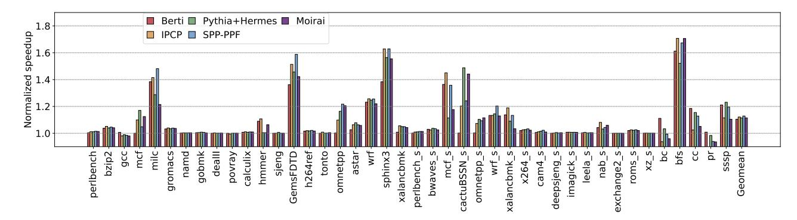

Fig. 11: Single-core IPC performance of Moirai and SOTA baselines, normalized to a no-prefetching configuration, across all evaluated SPEC and GAP benchmarks.

For multi-core experiments, we created 20 four-core mixes by randomly combining traces from this entire collection.

#### D. Evaluation Metrics

We evaluate Moirai's system-level performance using the geometric mean of Instructions Per Cycle (IPC) speedup over a no-prefetching baseline. To analyze underlying prefetcher behavior, we report arithmetic means for standard prefetching metrics: Accuracy, Coverage, Timeliness, and Memory Traffic.

#### V. EVALUATION

We evaluate Moirai in three parts. We first analyze single-core performance, generalization capability, and prefetcher quality. We then assess multi-core scalability and system-level traffic. Finally, we validate the robustness of Moirai through sensitivity analysis and quantify the hardware cost.

#### A. Overall Single-core Performance

We first evaluate Moirai's single-core performance to demonstrate its core value proposition: achieving speedups competitive with SOTA prefetchers, but at a hardware cost practical for the L1D cache. Figure 11 presents the detailed IPC speedup of Moirai and the selected baselines over a no-prefetching baseline across the suite of SPEC and GAP. Overall, across all workloads, Moirai achieves an average speedup of 11.48%. This result is competitive with the SOTA prefetcher, SPP+PPF (12.87%) and IPCP (12.12%), while outperforming other prefetchers like Berti (10.48%).

A deeper analysis of the per-benchmark results reveals that Moirai's competitiveness stems from its ability to handle complex memory access patterns where memorization-based approaches falter. It delivers its most significant speedups on workloads with difficult-to-predict, pointer-chasing behavior, such as *omnetpp\_s* (11.53% speedup). Furthermore, its generalization capability was stress-tested on the irregular graph traversal patterns of the GAP Benchmark Suite, where it also demonstrated competitive performance on workloads like *bfs* (70.65% speedup). This is noteworthy as these workloads are dominated by indirect accesses and pointer chasing, where addresses depend on loaded data values. Our results demonstrate

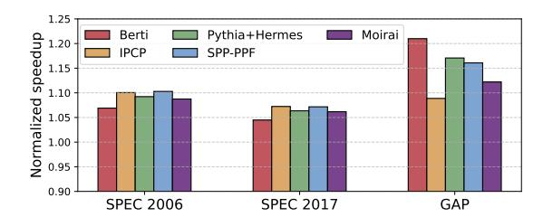

Fig. 12: Average single-core performance breakdown by benchmark suite, demonstrating Moirai's consistent effectiveness across different generations of SPEC.

that such patterns still exhibit statistical regularities in their delta distributions that Moirai's generalization-based model can capture, unlike memorization-based approaches requiring exact pattern matches. To confirm its robustness on traditional workloads, Figure 12 breaks down the performance by SPEC suite, showing that Moirai delivers consistent speedups of 8.75% on SPEC 2006 and 6.17% on SPEC 2017.

Most critically, Moirai achieves this performance with unprecedented hardware efficiency. Its total storage overhead of only 780 Bytes is over 97% smaller than the 29.5KB Pythia+Hermes and 70% smaller than the 2.55KB Berti. This result establishes a new and compelling design point for neural network prefetchers, proving that the powerful generalization of machine learning can be brought to the L1D cache without prohibitive cost. Moirai thus provides a feasible and practical path forward for the next generation of prefetchers.

#### B. Prefetching Quality Analysis

To understand the source of the IPC gains, Figure 13 analyzes Moirai's behavior across the three pillars of prefetcher quality: coverage, accuracy, and timeliness. The results reveal a unique and effective design trade-off. Moirai achieves a coverage of 18.18%, a competitive result that is substantial for its compact size. Its accuracy of 43.63%, while not the highest, proves sufficient to deliver the net positive performance reported in Section V-A, highlighting an efficient

balance between precision and cost. Most critically for an L1D prefetcher, Moirai achieves the high timeliness, with 92.37% of all its issued prefetches categorized as 'timely' (i.e., arriving before the demand access), demonstrating that its low-latency architecture is effective at converting predictions into useful memory accesses. This is primarily due to predictive lookahead; the sequence-based TCN can proactively identify a pattern's inception, unlike traditional methods that must reactively wait to confirm a stable pattern.

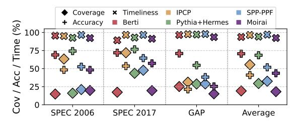

Fig. 13: Prefetcher quality metrics. Moirai achieves the highest timeliness while maintaining competitive coverage and sufficient accuracy for a net performance gain.

Further, we classify every L1D eviction caused by a prefetch fill as harmless (never accessed again) or harmful (later demanded, causing true pollution). As shown in Figure 14a, the vast majority of Moirai's prefetch-induced evictions are harmless, at a rate comparable to IPCP. This confirms that despite moderate raw accuracy, Moirai's inaccurate prefetches predominantly displace blocks that have left the active working set. Since Moirai operates at L1D, each prefetch traverses the hierarchy from L2. If the block resides in L2 or LLC, it is resolved without off-chip traffic (L2 Hit or LLC Hit); only complete misses result in a DRAM Access. As shown in Figure 14b, the majority of useless prefetches are absorbed on-chip, with DRAM access rate lower than IPCP, demonstrating that Moirai does not exacerbate off-chip bandwidth pressure.

This combination of metrics positions Moirai as a new, highly efficient design point. Rather than maximizing a single metric at a high hardware cost, Moirai's value proposition is in delivering a balanced profile of competitive coverage, sufficient accuracy, and best-in-class timeliness, all within a practical sub-1KB budget. This underscores a pragmatic approach to bringing generalization-based prefetching to the most resource-constrained environments.

#### C. In-depth Analysis: Generalization vs. Memorization

To provide a concrete, micro-level demonstration of Moirai's generalization capability, we perform a case study on page 0x1c757cf8000 with complex access behavior from the 429.mcf-192B benchmark. Figure 15 visualizes the true access trace (light blue squares) within a time window, along-side the useful predictions generated by the memorization-based Berti (dark blue squares) and the generalization-based Moirai (red squares). The access trace is clearly not a simple, linear stride. It exhibits a complex, multi-phase stride pattern with significant noise. This dynamic and imperfect real-world

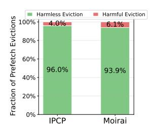

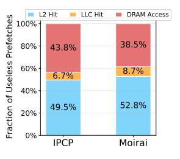

(a) Breakdown of L1D (b) Traffic breakdown of useprefetch-induced evictions less prefetches

Fig. 14: Detailed analysis of prefetch-induced L1D evictions and useless prefetch traffic.

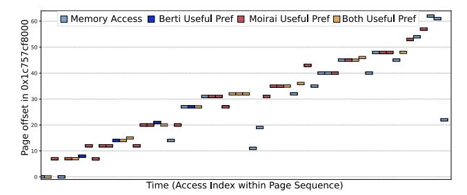

Fig. 15: A case study of the memory access pattern to page 0x1c757cf8000 from 429.mcf-192B. The plot shows the true memory accesses (light blue) versus the useful predictions from Berti (dark blue), Moirai (red), and both (yellow).

pattern poses a significant challenge to the adaptability and robustness of any prefetcher.

The figure visually confirms the different capabilities of the two paradigms. In the relatively clean, linear stride portions of the trace, both Berti and Moirai are effective at landing useful prefetches. However, a key difference emerges in the more chaotic and less structured phases of the trace. In these regions, Berti's useful prefetches become sparse, indicating its localized, memorization-based model struggles with the noise and non-linearity. In contrast, Moirai continues to land a significant number of useful prefetches in these same difficult regions. This provides direct visual evidence that Moirai's generalization-based approach is more robust to the pattern noise and imperfections common in real-world applications, a direct result of its TCN architecture's ability to learn from a longer, more complex history.

This case study provides the mechanistic insight for our macro-level results: Moirai's generalization on complex, noisy patterns, where memorization falters, is the foundational explanation for its competitive average performance.

#### D. Multi-core Performance

We conducted simulations on a 4-core system using 20 randomly generated workload mixes. As shown in Figure 16, Moirai remains competitive in the multi-core scenario, achieving an average speedup of 7.8%. This performance is comparable to that of Pythia+Hermes (8.3%), which is specifically

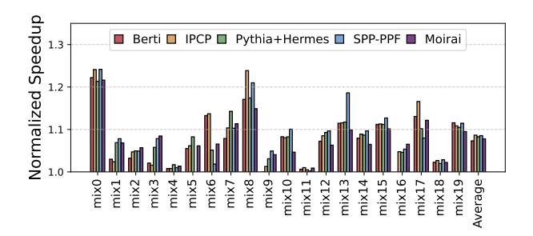

Fig. 16: Multi-core performance on 20 randomly generated 4-core mixes, normalized to a no-prefetching baseline.

designed for multi-core contention, and outperforms other baselines like Berti (7.3%).

Moirai's robustness under contention stems from its Adaptive Control Unit (Section III-B3). The controller uses the model's real-time average loss as an effective proxy for system pressure; as increased contention degrades prediction accuracy, the rising loss automatically causes the controller to throttle its prefetching aggressiveness. Specifically, when thread interference degrades prediction accuracy to the point where the average loss exceeds the  $L_{train}$  threshold, the controller triggers a retraining phase, pausing all CaPNet prefetching. This powerful phase-based throttling directly enhances prefetch-line liveness by preventing an unreliable model from polluting the cache and evicting useful data. This lightweight, self-regulating feedback loop prevents harmful memory bus pollution and achieves a similar outcome to the more complex, explicit bandwidth-aware agent in Pythia. This result reinforces Moirai's primary value proposition: delivering competitive performance in contended scenarios at an ultralow, L1D-practical hardware budget.

## E. System Overhead: Memory Traffic

Figure 17 shows the memory traffic overhead. Because bandwidth costs vary drastically across the hierarchy, we report the traffic exclusively at the L1-L2, L2-LLC, and LLC-DRAM boundaries, with the latter being the most critical metric. The results highlight two efficient designs: Berti is the most conservative, increasing DRAM traffic by a mere 6.5%, while Moirai increases traffic by 56.6%, comparable to IPCP (58.9%). To understand the composition of this traffic, we examine the demand-prefetch breakdown. Moirai reduces demand traffic to  $0.56 \times$  of the no-prefetching baseline, on par with IPCP (0.54  $\times$ ), confirming that its predictions effectively eliminate demand misses. The additional prefetch traffic is a direct consequence of the Adaptive Control Unit's tiered aggressiveness policy. This design ensures that the extra traffic is concentrated in transient uncertain phases rather than sustained throughout execution, as confirmed by Moirai's competitive IPC performance despite the higher aggregate traffic.

These differing traffic profiles reveal a key design tradeoff. Berti's ultra-low traffic reflects a conservative strategy that prioritizes minimal bandwidth usage over coverage. In

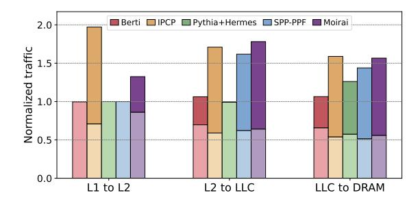

Fig. 17: Increase in memory traffic at different cache levels, normalized to a no-prefetching baseline. The lighter (lower) portion of each bar represents demand traffic; the darker (upper) portion represents prefetch traffic.

contrast, Moirai and IPCP adopt a more aggressive coverageoriented approach, accepting higher bandwidth overhead in exchange for greater demand miss elimination. Critically, Moirai achieves a traffic profile comparable to the well-established IPCP while requiring over 20× less storage, demonstrating that a sub-1KB neural network prefetcher does not exacerbate memory bandwidth pressure beyond what established designs already incur.

#### F. Sensitivity Analysis

To evaluate the robustness of Moirai's design, we analyze its sensitivity to key architectural and environmental parameters, with the results summarized in the Figure 18 and Figure 19.

First, we evaluate Moirai's robustness to external system conditions. Figure 18 shows that its performance remains competitive across a wide range of realistic per-core DRAM bandwidths, demonstrating the effectiveness of its adaptive control unit in contended environments.

Second, we validate Moirai's key internal design choices, with results summarized in Figure 19. An ablation study (Figure 19a) confirms the auxiliary prefetcher has a negligible impact (<0.1%) on average performance, proving Moirai's gains are attributable to its core *CaPNet* engine. Despite this, we retain it as a low-cost safety net: when the Adaptive Control Unit halts *CaPNet* during phase changes or cold starts, the auxiliary prefetcher maintains baseline spatial locality, preventing performance cliffs. The analysis of model size

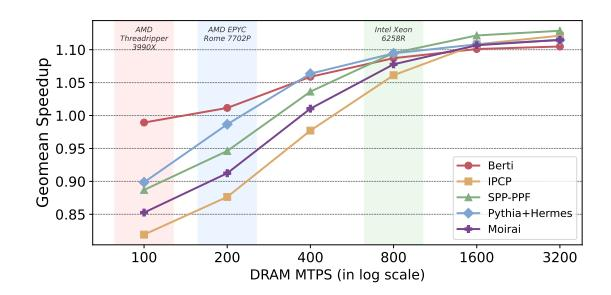

Fig. 18: Sensitivity to Memory Bandwidth

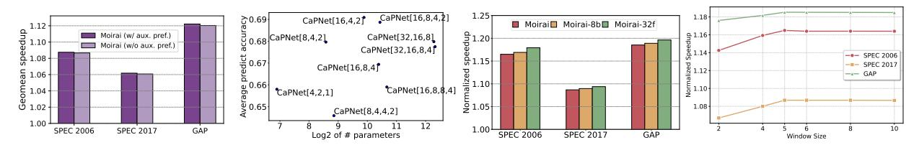

(a) Impact of Auxiliary Prefetcher (b) Sensitivity to Model Structure(c) Sensitivity to Model bit-width (d) Sensitivity to window size

Fig. 19: Sensitivity analysis of Moirai's performance with respect to (a) the contribution of the auxiliary prefetcher, (b) internal *CaPNet* model structure, (c) model quantization bit width, and (d) window size.

(Figure 19b) shows a clear point of diminishing returns, justifying our compact [8,4,2] structure to avoid overfitting. Furthermore, we quantify two critical design trade-offs. The impact of binarization (Figure 19c) is a modest accuracy degradation of less than 2% compared to an INT8 baseline and full precision baseline, a highly favorable trade-off for the > 8x and > 32x storage reduction it enables. Finally, our analysis of the delta computation window size (Figure 19d) confirms that our chosen value of 5 is an optimal balance between filtering noise and minimizing the risk of generating false deltas. These results collectively validate the hardware-efficient design principles central to Moirai.

#### G. Performance under Same Storage Constraints

To fully demonstrate Moirai's architectural efficiency under the draconian hardware limits of the L1D cache, we conducted a storage evaluation. To ensure a fair comparison within Moirai's ultra-low footprint, we constrained both Berti and IPCP to an  $\approx 0.8$  KB storage budget (matching Moirai's 780 Bytes) by proportionally scaling down their table entries.

As illustrated in Figure 20, under this strict storage constraint, the performance of the table-based baselines degrades substantially. This degradation highlights the fundamental vulnerability of the memorization paradigm: heavily constrained tables suffer from massive capacity misses and entry aliasing, rendering them ineffective for complex workloads. This confirms that *CaPNet*'s binarized neural representation is not merely a smaller alternative, but a fundamentally superior method for compressing complex memory access patterns into a sub-1KB footprint.

#### H. Hardware Overhead

1) Storage Overhead: Moirai's primary storage costs are detailed in Table III. The core CaPNet model requires only

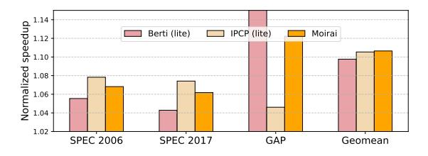

Fig. 20: Storage constrains comparison with prefetchers

818 bits for its weights and intermediate results, of which 648 bits are for the higher-precision latent weights ( $W_{raw}$ ) used for training. Including the History Table (HT) and other state registers, the core Moirai logic without an auxiliary prefetcher has a total storage footprint of only  $\approx$ 0.27 KB. When paired with a standard 0.5 KB stride prefetcher, the total overhead is  $\approx$ 0.77 KB (780 Bytes). This sub-1KB footprint stands in sharp contrast to the multi-kilobyte budgets of the baselines compared in Section V-A, underscoring Moirai's extreme space efficiency. Table IV compares the storage overhead of different prefetchers.

TABLE III: Storage overhead breakdown of Moirai.

| Structure                                            | Storage Overhead (bits) |
|------------------------------------------------------|-------------------------|
| Latent Weights $(W_{raw})$ for Training              | 648                     |
| Binarized Weights $(W_{bin})$ & Activations          | 170                     |
| History Table (HT)                                   | $16 \times 64 = 1024$   |
| Misc. state $(A_{i+1}, A_i, \Delta_i, \text{ etc.})$ | 110                     |
| Demand access counter $(N)$                          | 32                      |
| Counter thresholds $(N_{train} \& N_{inf})$          | $2 \times 32 = 64$      |
| Average loss $(L_{avg})$                             | 32                      |
| Loss thresholds ( $L_{train} \& L_{inf}$ )           | $2 \times 32 = 64$      |
| Auxiliary prefetcher                                 | 4096                    |
| Total (w/o auxiliary prefetcher)                     | ≈ 0.27 KB               |
| Total (w/ auxiliary prefetcher)                      | ≈ 0.77 KB               |

TABLE IV: Storage overhead comparison

| Prefetchers     | Storage Overhead |
|-----------------|------------------|
| Moirai          | 0.77 KB          |
| Berti           | 2.55 KB          |
| IPCP            | 16.7 KB          |
| Pythia + Hermes | 29.5 KB          |
| SPP-PPF         | 39.34 KB         |

2) Computation Overhead: To accurately estimate Moirai's chip area and power overheads, we implement the CaPNet neural engine using Verilog HDL. We synthesize the RTL design using the ASAP7 [14] 7-nm predictive FinFET process library to evaluate the microarchitecture at a 4.0 GHz clock frequency. The CaPNet circuit consumes just 1178  $\mu m^2$  of area and 8.5 mW of power. With respect to the die area and power consumption of a high-performance Apple A13 Bionic core in a comparable 7-nm process (which occupies  $\approx$ 2.61 mm² and consumes  $\approx$ 3W peak power [1]), the CaPNet incurs virtually negligible area and power overheads of only 0.05% and 0.28%, respectively. We conclude that our performance

benefits are achieved at a fundamentally lower microarchitectural cost than existing ML prefetchers, whose multi-megabyte capacities render them impossible to deploy at the L1D level.

*3) Timing Analysis:* When a one-cycle-per-layer design is adopted (i.e., pipeline stages are inserted between layers), the *CaPNet* circuit can operate at a maximum frequency of 4.0 GHz. In this configuration, *CaPNet*'s forward unit generates prefetch addresses within three clock cycles. For processors with stricter requirements for prefetch timeliness, a singlecycle forward unit design can be employed. In this case, the *CaPNet* circuit can optimally run up to 2.5 GHz, enabling the prefetch address calculation to complete within one clock cycle. These evaluations indicate that, benefiting from *CaPNet*'s lightweight design, it can be effectively integrated into high-frequency L1D and processor cores. Furthermore, *CaPNet*'s design offers flexibility to be tailored to the specific requirements of the processor. The backward pass for training, which involves the BCC, exhibits a similarly low latency, also completing within three clock cycles in a pipelined design. This confirms that our choice of a phased update mechanism was driven by the need for model stability, rather than being a constraint imposed by high training latency.

## VI. RELATED WORK

Prior work in data prefetching falls into two paradigms, creating a design gap that Moirai addresses.

## *A. Memorization: Practical but Limited*

Traditional table-based prefetchers are practical for the L1D but are fundamentally limited by their "memorization" philosophy, making them brittle against complex or novel patterns. This paradigm ranges from simple next-line [37] and commercial prefetchers [2], [13], [39] to sophisticated SOTA designs like IPCP [3], [36], Berti [34]. Orthogonal to these general-purpose table-based designs, DMP [19] and Prodigy [45] target indirect memory access patterns through specialized mechanisms: DMP uses differential matching between index and data streams, while Prodigy employs a software-hardware co-design with compiler-extracted data indirection graphs. These approaches address pattern types complementary to Moirai's general-purpose delta sequence modeling.

## *B. Generalization: Powerful but Impractical*

ML-based prefetchers offer "generalization", learning underlying features to predict novel patterns. This paradigm includes early work with LSTMs [22], Voyager [43], and context-sensitive models [38], as well as recent designs using reinforcement learning (Pythia [11]), ensemble learning (Resemble [50]), spiking neural nets (Pathfinder [29]), costoptimizations (Twilight/T-LITE [18]), and hybrid filters (PPF [12]).However, these extremely powerful models typically target the LLC. Their megabyte-scale storage and multi-cycle inference latency make them microarchitecturally impractical for the stringent L1D environment, where high latency directly translates to useless late prefetches.

## *C. Differentiation from Prior TCN-based Prefetchers*

To our knowledge, Moirai is the first neural prefetcher architected from the ground up for L1D deployment. BTCP [26] also explores B-TCNs for prefetching, applying the B-TCN as an algorithmic drop-in atop conventional design choices (PCbased stream tracking, no on-chip backpropagation, no explicit pollution control), resulting in 4.5 KB storage and 134-cycle latency that confine it to the L2 cache. In contrast, Moirai codesigns the model, training mechanism, and control logic from the ground up for the L1D's physical constraints, replacing PC tables with global-stream delta filtering, enabling true onchip learning via STE, and adding phase-based throttling as a pollution fail-safe, compressing the entire design to 780 Bytes and 1–3 cycle latency.

## *D. Situating Moirai's Contribution*

Prior art thus presents a clear dichotomy: practical-butlimited L1D memorization, and powerful-but-impractical LLC generalization. Moirai is designed to directly address this gap, creating the first practical, generalization-based neural prefetcher for the L1D cache. Furthermore, Moirai's standalone philosophy provides a distinct alternative to recent multi-level cache optimizations. While SOTA frameworks like Hermes and the Two-Level Predictor (TLP) [10], [28] rely on downstream lightweight perceptrons to predict off-chip DRAM accesses and filter requests from base prefetchers, Moirai natively prevents cache pollution at its source. By tightly coupling highly accurate sequence generation with a real-time, loss-based throttling mechanism entirely within a 780-Byte footprint, Moirai eliminates the need for complex cross-level synchronization, offering a robust, self-contained solution at the top of the memory hierarchy.

## VII. CONCLUSION

The prohibitive hardware cost of machine learning-based prefetchers has historically prevented their deployment in the resource-constrained L1D cache. This paper confronted this challenge by introducing Moirai, a practical prefetching framework enabled by *CaPNet*, our ultra-lightweight Binarized Neural Network. Our evaluation shows that Moirai's performance is highly competitive with that of SOTA solutions, while using only 780 Bytes of storage. This represents a cost reduction of over 97% compared to other learning-based prefetchers. Moirai thus establishes a new, highly-efficient design point, proving the feasibility of deploying generalization-based predictors in resource-sensitive microarchitectural contexts and opening new avenues for their application in areas like branch prediction and cache replacement.

#### ACKNOWLEDGMENT

We thank the anonymous reviewers of ISCA 2026 for their encouraging feedback. This work is supported by the National Natural Science Foundation of China under Grant No.62421002 and No.U24B20151, and the National University of Defense Technology Research Project under Grant ZK22- 23.

## REFERENCES

- [1] "Apple a13," https://en.wikipedia.org/wiki/Apple A13.
- [2] "Bios & workload tuning guide," https://www.amd.com/content/dam/ amd/en/documents/epyc-technical-docs/tuning-guides/58467 amdepyc-9005-tg-bios-and-workload.pdf, 2024.
- [3] M. F. Alaa R. Alameldeen, Seth Pugsley, "Dpc3: The third data prefetching championship," 2019. [Online]. Available: https: //dpc3.compas.cs.stonybrook.edu/
- [4] G. Ayers, H. Litz, C. Kozyrakis, and P. Ranganathan, "Classifying memory access patterns for prefetching," in *Proceedings of the Twenty-Fifth International Conference on Architectural Support for Programming Languages and Operating Systems*, ser. ASPLOS '20. New York, NY, USA: Association for Computing Machinery, 2020, p. 513–526. [Online]. Available: https://doi.org/10.1145/3373376.3378498
- [5] S. Bai, J. Kolter, and V. Koltun, "An empirical evaluation of generic convolutional and recurrent networks for sequence modeling," *arXiv: Learning,arXiv: Learning*, Mar 2018.
- [6] M. Bakhshalipour, P. Lotfi-Kamran, and H. Sarbazi-Azad, "Domino temporal data prefetcher," in *2018 IEEE International Symposium on High Performance Computer Architecture (HPCA)*, Feb 2018. [Online]. Available: http://dx.doi.org/10.1109/hpca.2018.00021
- [7] M. Bakhshalipour, M. Shakerinava, P. Lotfi-Kamran, and H. Sarbazi-Azad, "Bingo spatial data prefetcher," in *2019 IEEE International Symposium on High Performance Computer Architecture (HPCA)*, Feb 2019. [Online]. Available: http://dx.doi.org/10.1109/hpca.2019.00053
- [8] S. Beamer, K. Asanovic, and D. Patterson, "The gap benchmark suite," ´ 2015.
- [9] Y. Bengio, N. Leonard, and A. Courville, "Estimating or propagating ´ gradients through stochastic neurons for conditional computation," 2013. [Online]. Available: https://arxiv.org/abs/1308.3432
- [10] R. Bera, K. Kanellopoulos, S. Balachandran, D. Novo, A. Olgun, M. Sadrosadat, and O. Mutlu, "Hermes: Accelerating long-latency load requests via perceptron-based off-chip load prediction," in *2022 55th IEEE/ACM International Symposium on Microarchitecture (MICRO)*, 2022, pp. 1–18.
- [11] R. Bera, K. Kanellopoulos, A. Nori, T. Shahroodi, S. Subramoney, and O. Mutlu, "Pythia: A customizable hardware prefetching framework using online reinforcement learning," in *MICRO-54: 54th Annual IEEE/ACM International Symposium on Microarchitecture*, Oct 2021. [Online]. Available: http://dx.doi.org/10.1145/3466752.3480114
- [12] E. Bhatia, G. Chacon, S. Pugsley, E. Teran, P. V. Gratz, and D. A. Jimenez, "Perceptron-based prefetch filtering," in ´ *Proceedings of the 46th International Symposium on Computer Architecture*, Jun 2019. [Online]. Available: http://dx.doi.org/10.1145/3307650.3322207
- [13] M. Bruce, "Arm neoverse v2 platform: Leadership performance and power efficiency for next-generation cloud computing, ml and hpc workloads," in *2023 IEEE Hot Chips 35 Symposium (HCS)*, 2023, pp. 1–25.
- [14] L. T. Clark, V. Vashishtha, L. Shifren, A. Gujja, S. Sinha, B. Cline, C. Ramamurthy, and G. Yeric, "Asap7: A 7-nm finfet predictive process design kit," *Microelectronics Journal*, vol. 53, pp. 105–115, 2016. [Online]. Available: https://www.sciencedirect.com/science/article/pii/ S002626921630026X
- [15] S. P. E. Corporation, "Spec cpu 2017," 2023, https://www.spec.org/ cpu2017/.
- [16] M. Courbariaux and Y. Bengio, "Binarynet: Training deep neural networks with weights and activations constrained to +1 or - 1," *CoRR*, vol. abs/1602.02830, 2016. [Online]. Available: http: //arxiv.org/abs/1602.02830
- [17] M. Courbariaux, Y. Bengio, and J.-P. David, "Binaryconnect: training deep neural networks with binary weights during propagations," in *Proceedings of the 29th International Conference on Neural Information Processing Systems - Volume 2*, ser. NIPS'15. Cambridge, MA, USA: MIT Press, 2015, p. 3123–3131. [Online]. Available: https://dl.acm.org/doi/10.5555/2969442.2969588
- [18] Q. Duong, A. Jain, and C. Lin, "A New Formulation of Neural Data Prefetching," in *2024 ACM/IEEE 51st Annual International Symposium on Computer Architecture (ISCA)*. IEEE, pp. 1173–1187. [Online]. Available: https://ieeexplore.ieee.org/document/10609631/
- [19] G. Fu, T. Xia, Z. Luo, R. Chen, W. Zhao, and P. Ren, "Differentialmatching prefetcher for indirect memory access," in *2024 IEEE International Symposium on High-Performance Computer Architecture (HPCA)*, 2024, pp. 439–453.

- [20] N. Gober, G. Chacon, L. Wang, P. V. Gratz, D. A. Jimenez, E. Teran, S. Pugsley, and J. Kim, "The championship simulator: Architectural simulation for education and competition," 2022. [Online]. Available: https://arxiv.org/abs/2210.14324
- [21] K. Greff, R. K. Srivastava, J. Koutnik, B. R. Steunebrink, and J. Schmidhuber, "Lstm: A search space odyssey," *IEEE Transactions on Neural Networks and Learning Systems*, vol. 28, no. 10, p. 2222–2232, Oct. 2017. [Online]. Available: http://dx.doi.org/10.1109/TNNLS.2016. 2582924
- [22] M. Hashemi, K. Swersky, J. A. Smith, G. Ayers, H. Litz, J. Chang, C. Kozyrakis, and P. Ranganathan, "Learning memory access patterns," March 2018.
- [23] M. He, H. Wang, K. Zhou, K. Cui, H. Yan, C. Guo, and R. He, "Dsdp: Dual stream data prefetcher," in *Proceedings of the International Conference on Parallel Architectures and Compilation Techniques*, ser. PACT '22. New York, NY, USA: Association for Computing Machinery, 2023, p. 372–383. [Online]. Available: https://doi.org/10.1145/3559009.3569677
- [24] S. He, Z. Wang, X. Tang, Q. Sun, and D. Dong, "Chimera: Leveraging hybrid offsets for efficient data prefetching," in *Proceedings of the International Conference on Parallel Architectures and Compilation Techniques*, ser. PACT '24. Association for Computing Machinery, 2024, pp. 144–155. [Online]. Available: https://doi.org/10. 1145/3559009.3569677
- [25] S. He, Z. Wang, X. Tang, H. Tang, D. Dong, and L. Xiao, "Elevating temporal prefetching through instruction correlation," in *Proceedings of the 58th IEEE/ACM International Symposium on Microarchitecture*, ser. MICRO '25. New York, NY, USA: Association for Computing Machinery, 2025, p. 915–928. [Online]. Available: https://doi.org/10.1145/3725843.3756133
- [26] C. Ho Ryu and T. H. Han, "Btcp: Binary temporal convolutional network-based data prefetcher for low inference latency and storage overhead," *IEEE Access*, vol. 13, pp. 115 048–115 062, 2025.
- [27] N. Ishiura and R. Saimyoji, "Compact fpga implementation of popcounter for bnn using linear feedback shift register," in *Proc. the Workshop on Synthesis And System Integration of Mixed Information Technologies (SASIMI 2021)*, Mar 2021, pp. 179–180.
- [28] A. V. Jamet, G. Vavouliotis, D. A. Jimenez, L. Alvarez, and M. Casas, ´ "A Two Level Neural Approach Combining Off-Chip Prediction with Adaptive Prefetch Filtering," in *2024 IEEE International Symposium on High-Performance Computer Architecture (HPCA)*. Edinburgh, United Kingdom: IEEE, Mar. 2024, pp. 528–542.
- [29] L. Jia, J. P. Mcmahon, S. Gudaparthi, S. Singh, and R. Balasubramonian, "Pathfinder: Practical real-time learning for data prefetching," in *Proceedings of the 29th ACM International Conference on Architectural Support for Programming Languages and Operating Systems, Volume 3*, ser. ASPLOS '24. New York, NY, USA: Association for Computing Machinery, 2024, p. 785–800. [Online]. Available: https: //doi.org/10.1145/3620666.3651332
- [30] S. Jiang, Q. Yang, and Y. Ci, "Merging similar patterns for hardware prefetching," in *2022 55th IEEE/ACM International Symposium on Microarchitecture (MICRO)*, 2022, pp. 1012–1026.
- [31] M. I. Jordan, "Chapter 25 serial order: A parallel distributed processing approach," in *Neural-Network Models of Cognition*, ser. Advances in Psychology, J. W. Donahoe and V. Packard Dorsel, Eds. North-Holland, 1997, vol. 121, pp. 471–495. [Online]. Available: https://www.sciencedirect.com/science/article/pii/S0166411597801112
- [32] J. H. Kim, J. Lee, and J. H. Anderson, "Fpga architecture enhancements for efficient bnn implementation," in *2018 International Conference on Field-Programmable Technology (FPT)*, 2018, pp. 214–221.
- [33] P. Michaud, "Best-offset hardware prefetching," in *2016 IEEE International Symposium on High Performance Computer Architecture (HPCA)*, Mar 2016. [Online]. Available: http://dx.doi.org/10.1109/hpca. 2016.7446087
- [34] A. Navarro-Torres, B. Panda, J. Alastruey-Benede, P. Ib ´ a´nez, V. Vi ˜ nals- ˜ Yufera, and A. Ros, "Berti: an accurate local-delta data prefetcher," in ´ *2022 55th IEEE/ACM International Symposium on Microarchitecture (MICRO)*, 2022, pp. 975–991.
- [35] K. Nesbit and J. Smith, "Data cache prefetching using a global history buffer," *IEEE Micro*, vol. 25, no. 1, pp. 90–97, 2005.
- [36] S. Pakalapati and B. Panda, "Bouquet of instruction pointers: Instruction pointer classifier-based spatial hardware prefetching," in *2020 ACM/IEEE 47th Annual International Symposium on*

- *Computer Architecture (ISCA)*, May 2020. [Online]. Available: http://dx.doi.org/10.1109/isca45697.2020.00021
- [37] H. S.-A. Pejman Lotfi-Kamrana, "Data prefetching techniques in computer systems," *Advances in Computers*, 2022. [Online]. Available: https://api.semanticscholar.org/CorpusID:247095552
- [38] L. Peled, U. Weiser, and Y. Etsion, "A neural network prefetcher for arbitrary memory access patterns," *ACM Transactions on Architecture and Code Optimization*, p. 1–27, Dec 2019. [Online]. Available: http://dx.doi.org/10.1145/3345000
- [39] A. Pellegrini, "Arm neoverse n2: Arm's 2nd generation high performance infrastructure cpus and system ips," in *2021 IEEE Hot Chips 33 Symposium (HCS)*, 2021, pp. 1–27.
- [40] M. Rastegari, V. Ordonez, J. Redmon, and A. Farhadi, "Xnor-net: Imagenet classification using binary convolutional neural networks," 2016.
- [41] E. Rotem, A. Yoaz, L. Rappoport, S. J. Robinson, J. Y. Mandelblat, A. Gihon, E. Weissmann, R. Chabukswar, V. Basin, R. Fenger, M. Gupta, and A. Yasin, "Intel alder lake cpu architectures," *IEEE Micro*, vol. 42, no. 3, pp. 13–19, 2022.
- [42] M. Shakerinava, M. Bakhshalipour, P. Lotfi-Kamran, and H. Sarbazi-Azad, "Multi-lookahead offset prefetching," 2019. [Online]. Available: https://arxiv.org/pdf/1911.10349v1
- [43] Z. Shi, A. Jain, K. Swersky, M. Hashemi, P. Ranganathan, and C. Lin, "A hierarchical neural model of data prefetching," in *Proceedings of the 26th ACM International Conference on Architectural Support for Programming Languages and Operating Systems*, Apr 2021. [Online]. Available: http://dx.doi.org/10.1145/3445814.3446752
- [44] S.P.E.Corporation, "Spec cpu 2006," 2023, https://www.spec.org/ cpu2006/.
- [45] N. Talati, K. May, A. Behroozi, Y. Yang, K. Kaszyk, C. Vasiladiotis, T. Verma, L. Li, B. Nguyen, J. Sun, J. M. Morton, A. Ahmadi, T. Austin, M. O'Boyle, S. Mahlke, T. Mudge, and R. Dreslinski, "Prodigy: Improving the memory latency of data-indirect irregular workloads using hardware-software co-design," in *2021 IEEE International Symposium on High-Performance Computer Architecture (HPCA)*, 2021, pp. 654– 667.
- [46] X. Tang, Z. Wang, S. He, D. Dong, and X. Liao, "Amphi: Practical and intelligent data prefetching for the first-level cache," in *2025 Design, Automation and Test in Europe Conference (DATE)*, 2025, pp. 1–2.
- [47] W. A. Wulf and S. A. McKee, "Hitting the memory wall: implications of the obvious," *ACM SIGARCH Computer Architecture News*, p. 20–24, Mar 1995. [Online]. Available: http://dx.doi.org/10.1145/216585.216588
- [48] Z. Xian, H. Li, and Y. Li, "Based on 1 or 0 bnn accelerator with array architecture," in *2019 IEEE International Conference on Integrated Circuits, Technologies and Applications (ICTA)*, 2019, pp. 79–80.
- [49] P. Zhang, R. Kannan, and g.-i. family=Prasanna, given=ViktorK., "Phases, modalities, temporal and spatial locality: Domain specific ML prefetcher for accelerating graph analytics."
- [50] P. Zhang, R. Kannan, A. Srivastava, A. V. Nori, and V. K. Prasanna, "Resemble: Reinforced ensemble framework for data prefetching," in *SC22: International Conference for High Performance Computing, Networking, Storage and Analysis*, 2022, pp. 1–14.

## APPENDIX A ARTIFACT APPENDIX

## *A. Abstract*

This artifact provides the source code and configuration files for Moirai. It includes the modified ChampSim simulator infrastructure, the implementation of the Moirai prefetcher, and the experiment definitions used for evaluation. The goal of this artifact is to promote open science by making our evaluation infrastructure publicly available, providing a robust baseline for future neural-network-based prefetching studies.

## *B. Artifact check-list (meta-information)*

- Program: Modified ChampSim simulator with the Moirai prefetcher.
- Dataset: Memory access traces.
- Run-time environment: Linux-based operating systems.

- Execution time: Several hours per simulation.
- Output: Standard ChampSim simulation logs containing performance metrics.
- License: MIT License.

## *C. Description*

- *1) How to access:* The artifact is permanently archived on Zenodo and is organized into two separate repositories due to file size limits. They can be accessed via the following DOIs:
  - Workload Traces: https://doi.org/10.5281/zenodo. 19447159
  - Source Code: https://doi.org/10.5281/zenodo.19450687
- *2) Contents:* The repository includes the following key components:
  - prefetcher/ and inc/: Source code for the proposed Moirai prefetcher (moirai.cc and moirai.h) and other evaluated baselines.
  - inc/uarch/isca\_config.h: Processor configuration files for reproducing the evaluation environments.
  - libbf/: Required Bloom Filter library source code for the state-of-the-art *Hermes* prefetcher.
  - ISCA26\_AE.exp & ISCA26\_AE.tlist: Definitions of the evaluated experiments and workload traces.
  - build\_champsim.sh: Compilation script for the simulator.

## *D. Installation and Workflow*

- 1) Source the required environment variables via source setvars.sh.
- 2) Compile the simulator using the provided build\_champsim.sh script for either 0-latency or 3-latency configurations, as detailed in the README.md.
- 3) Download and prepare the required workload traces as instructed in the repository (following the README.md).
- 4) Generate job scripts using the provided Python automation tool in the scripts/ directory.
- 5) Execute the simulations using the generated shell scripts. The simulation results will be stored as text files in the output/ directory, where performance metrics (e.g., IPC) can be extracted.

## *E. Evaluation and Expected Results*

This artifact allows users to evaluate the performance of Moirai under various microarchitectural constraints. The primary output is the simulation log file, which provides the instruction throughput (IPC) and prefetching statistics. The results obtained from these simulations form the basis of the performance analysis presented in the paper.