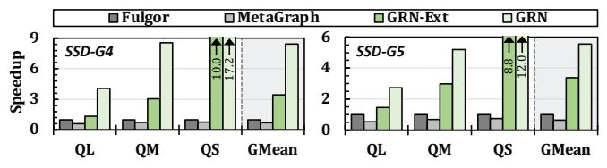
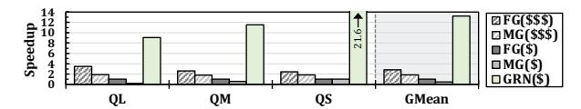
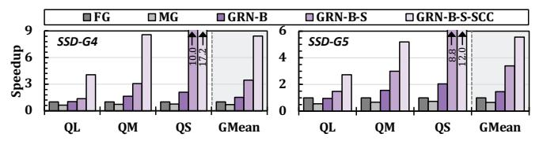
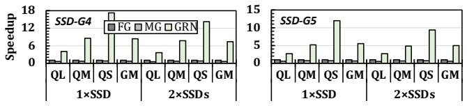
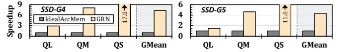
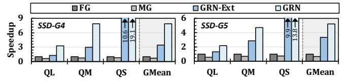
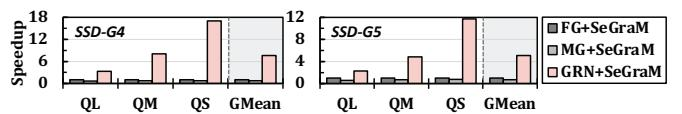

# **11. Methodology**

**Performance.** We design a simulator that models all of GRAINS's components, including host operations, internal DRAM, accessing flash dies, in-storage hardware units (on flash dies and on the SSD controller), and SSD-host interfaces. We then feed the latency and throughput of each component to this simulator. Using this methodology, as also leveraged in prior SCC works (e.g., [301,313,315,369,392,429]), enables

us to flexibly incorporate state-of-the-art system configurations in our evaluations. For **hardware-based** components (e.g., when querying the graph): We implement GRAINS's IS-P/IFP logic units in Verilog and synthesize them with a 22nm library [430] using the Synopsys Design Compiler [431]. We use two state-of-the-art simulators, MQSim [367,432] to model SSD's internal operations, and Ramulator [433,434] (new version introduced in [435,436]) to model internal DRAM. For **software-based** components (e.g., when preparing queries), we measure their performance on a real system with 1.5-TB DRAM (in all experiments unless mentioned otherwise) and AMD® EPYC® 7742 CPU [383] with 128 physical cores. We use SSD-G4 [385] and SSD-G5 [386] as described in §3 and Table 1 in our real system experiments. In our MQSim simulations for the ISP/IFP steps, we faithfully model these SSDs with configurations summarized in Table 1. For the software baselines, we measure performance using the best-performing thread counts on the same real system used for GRAINS's software-based components. In an extended version [427], we provide further details regarding our methodology and how it manages correct timing composition between host-side and SSD-side time.

**Area and Power.** For GRAINS's logic units, we use our Design Compiler synthesis results. SSD power is based on values of a Samsung 3D NAND flash-based SSD [382]. DRAM power is based on values from a DDR4 model [384,440]. For the CPU cores, we measure power with AMD µProf [441].

**Evaluated Systems.** We evaluate three key tasks: (*i*) k-mer set lookup, (*ii*) alignment-free read mapping, and (*iii*) alignmentbased read mapping. We evaluate the following tools for analysis with large-scale genome graphs:8 (*i*) Fulgor [151] (FG), as a state-of-the-art node-centric software tool (which uses SSHash [341]), (*ii*) the MetaGraph framework [148,260–262] (MG) as a state-of-the-art edge-centric software tool; (*iii*) an *idealized* hardware-accelerated baseline (IdealAccMem) where all genome graph query operations execute *without* main memory overheads (i.e., zero latency, infinite bandwidth, infinite capacity). This configuration can represent an *ideal* PIM baseline as well. IdealAccMem still incurs the I/O overhead of bringing the large, low-reuse data from the storage system to main memory. Comparing against this baseline demonstrates the impact of storage I/O as a fundamental problem that persists even when main memory overhead is alleviated; (*iv*) GRAINS with all its optimizations, but with its lightweight hardware as an accelerator outside the SSD (GRN-Ext), to show the benefits of GRAINS's

Table 1: Evaluated SSD configurations.

| TLC NAND flash-based SSD General PCIe Gen4 interface [438]; PCIe Gen5 interface [439]; Bandwidth 7 GB/s sequential-read BW; 14.8 GB/s sequential-read BW; (BW) | SSD-G5                                  |  |  |
|-------------------------------------------------------------------------------------------------------------------------------------------------------------------------------------|-----------------------------------------|--|--|
|                                                                                                                                                                                     | 4 TB capacity, 4 GB internal DRAM [437] |  |  |
| 1.2-GB/s channel I/O rate                                                                                                                                                           | 2.4-GB/s channel I/O rate               |  |  |
| NAND Config 16 channels, 8 dies/channel, 4 planes/die                                                                                                                            |                                         |  |  |

8As discussed in §2.2, DBGs scale substantially better than other genome graph structures as the genetic diversity in the database increases. Other tools (e.g., VG [442] and minigraph [354]) that use variation graphs as their graph structure do not scale as well and, hence, are not typically used in scenarios with large-scale, genetically diverse databases [148,338].

optimizations without ISP/IFP, but with more storage-friendly execution/data flow. The lightweight hardware is connected to the host system via a PCIe interface with 16 GB/s bandwidth, and leverages the host DRAM to store its scheduling metadata (§7.2). Similar to GRAINS's full implementation, GRN-Ext performs input query processing on the host (§6), but instead of relying on its ISP/IFP logic units to query the graph (§7), it uses the same lightweight accelerator logic units outside the SSD; (v) GRAINS's full implementation, including ISP and IFP (GRN). All these tools achieve the same accuracy since their underlying graphs are *lossless* encodings of the database's k-mer sets [148,151,260–262]. For the alignment-based mapping, we integrate all tools with SeGraM, a state-of-the-art sequence-to-graph alignment accelerator [231].

**Datasets.** We build graphs as described in §3. The graph (with colors) is 659 GB for FG, GRN, and IdealAccMem, and 822 GB for MG. We evaluate query read sets with 10M (QL), 1M (QM), and 100K (QS) reads. Note that smaller queries are also critical, as detailed in §3.

#### 12. Evaluation

#### 12.1. Performance

K-mer Set Lookup. Fig. 13 shows the speedups of different systems over FG for k-mer set lookups. We make three key observations. First, GRAINS provides significant speedups. In systems with SSD-G4 (SSD-G5), GRN provides  $8.4 \times (5.5 \times)$  and  $11.9 \times (8.5 \times)$  average speedups over FG and MG, respectively. Second, by making the execution/data flow more storagefriendly, GRAINS's implementation outside the SSD also provides large benefits. GRN-Ext provides to  $3.4 \times$  and  $5.0 \times$  average speedup over FG and MG, respectively, across all inputs and SSDs. Third, GRAINS's full implementation provides significantly larger benefits over GRAINS's implementation outside SSD. GRN provides  $2 \times$  average speedup over GRN-Ext. While GRN-Ext exploits locality across queries by merging requests to the same regions of each graph structure and improving access patterns, the locality it captures cannot amortize the cost of transferring the large volume of low-reuse data across the storage-to-host interface. Thus, GRAINS's full implementation provides additional, significant benefits by alleviating the large I/O overheads through its SCC design. We further evaluate the execution time breakdown of different GRAINS steps in an extended version [427].

Fig. 13: Speedups with different input query sets and SSDs.

**Impact on Cost Efficiency.** GRAINS improves system cost-efficiency since it analyzes large amounts of data in the SSD and does *not* rely on either large host DRAM or high host-SSD interface bandwidth. We show this by evaluating two systems: a cost-optimized system (\$) with 64-GB host DRAM and SSD-G4, and a costlier, performance-optimized system (\$\$\$) with 1.5-TB host DRAM and SSD-G5. Fig. 14 compares

Fig. 14: Speedup of GRAINS on a low-cost system, i.e., GRN(\$), over baselines on low-cost and performance-optimized systems.

GRAINS on the cost-optimized system with the baselines on both systems (with a representative query set, QM). To fairly evaluate the baselines when host DRAM is smaller than the graph, we reduce I/O overheads as much as possible in software for this scenario. To this end, we partition the graph such that each subgraph fits in the host DRAM, so random accesses to the graph do not repeatedly access the SSD. We partition the graph using database entry metadata to guide partitioning choices, placing entries that likely share many k-mers into the same partition. Despite the benefits of this optimization, two sources of overhead remain: (i) the I/O overhead of transferring subgraphs, and (ii) the need to query against each subgraph. We make two observations. First, GRAINS on the cost-optimized system significantly outperforms the baselines even on the performance-optimized system. GRN(\$) provides  $4.7 \times$  and  $5.2 \times$  average speedup over FG(\$\$\$) and MG(\$\$\$), respectively. Second, the performance of baselines on the costoptimized system suffers significantly. When compared on the same cost-optimized system, GRN(\$) provides  $13.2 \times$  and  $26.9 \times$ average speedup over FG and MG, respectively. We conclude that GRAINS improves both system cost-efficiency and system performance, which is critical for facilitating (i) the wide adoption of graph-based genome analysis, and (ii) analysis on low-cost, portable devices, a scenario rising in importance with the development of portable sequencing devices [443-446] for on-site genome analysis [159,160,447,448].

Effect of Different GRAINS Optimizations. Fig. 15 demonstrates the benefits of different GRAINS optimizations. GRN-B is a GRAINS configuration including only the batching optimization (§6). GRN-B-S is a GRAINS configuration including both the batching and scheduling (§7.2) optimizations (equivalent to GRN-Ext, §11). GRN-B-S-SCC is GRAINS's full configuration, including its SCC. Please note that we do not show a configuration with naive SCC and without batching and scheduling. This is because simply using SCC without these techniques leads to performance loss due to the irregular access patterns to genome graphs, which are inefficient due limitations of the SSD's hardware (e.g., costly conflicts in internal SSD resources such as channels and NAND flash chips [319– 321] during random and dependent accesses). We make three observations. First, GRN-B provides  $1.5 \times$  and  $2.2 \times$  average speedup over FG and MG, respectively. This is due to more efficient accesses to the Offsets data structure. Second, GRN-B-S provides 2.3× average speedup over GRN-B as it enables more

Fig. 15: Ablation tests of different GRAINS optimizations.

storage-friendly accesses to Strings and Colors as well. Finally, through its efficient SCC, GRN-B-S-SCC provides 2.0× and 4.6× average speedup over GRN-B-S and GRN-B, respectively. Effect of the Number of SSDs. GRAINS can benefit from multiple SSDs in two ways: First, different graphs can be stored on separate SSDs and analyzed concurrently, each benefiting from GRAINS (as shown in Fig. 13). Second, a single graph can be partitioned across SSDs to increase throughput. This is enabled by GRAINS's execution flow supporting efficient graph partitioning, as detailed in an extended version [427]. We evaluate this scenario in Fig. 16. We observe that GRAINS maintains large speedups. This is because, as the external bandwidth increases for the baselines with more SSDs, the internal bandwidth also increases. Although there is a slight decrease in speedup when moving to two SSDs in QS, the speedup is still significant (14.2 $\times$  and 9.4 $\times$  with SSD-G4 and SSD-G5). This decrease is because, after increasing internal bandwidth, the impact of software query processing becomes relatively larger. Therefore, we can further accelerate these steps (e.g., with a sorting accelerator) to increase benefits even further. We conclude that GRAINS can efficiently leverage

multiple SSDs, making it also suitable for distributed systems.

Fig. 16: Speedups with different numbers of SSDs.

Comparison to IdealAccMem. Fig. 17 shows speedups over IdealAccMem. Despite IdealAccMem's benefits, it still incurs I/O accesses to transfer data to main memory, even when DRAM is larger than data size (as in our evaluation). Through its storage-aware design, with efficient ISP/IFP operations, we observe that on the system with SSD-G4 (SSD-G5), GRAINS provides  $7.4 \times (4.3 \times)$  average speedup over IdealAccMem.

Fig. 17: Speedup over IdealAccMem.

**Alignment-Free Read Mapping.** Fig. 18 shows speedups over FG when performing alignment-free read mapping. In this case, as discussed in §6, GRAINS sends the colors of all k-mers to the host system, and the host system determines the colors of each read based on the colors of its k-mers. We observe that on systems with SSD-G4 (SSD-G5), GRN provides  $7.9 \times (5.2 \times)$  and  $11.2 \times (8.0 \times)$  average speedups over FG and MG, respectively.

Fig. 18: Speedups for read mapping.

**Alignment-Based Mapping.** We integrate GRN, FG, and MG with SeGraM [231] to perform alignment on the candidate

graph regions identified by each tool (we use the throughput of alignment operations reported by SeGraM [231]). Fig. 19 shows the speedups of different systems over FG +SeGraM. We observe that SeGraM+GRN provides  $6.2\times$  and  $9.0\times$  average speedup over SeGraM+FG and SeGraM+MG.

Fig. 19: Speedups for read mapping with alignment.

#### 12.2. Area and Power Overheads

Table 2 summarizes area and power for GRAINS's logic units at 333MHz. While these units can operate at higher frequencies, their throughput is already sufficient since GRAINS's ISP/IFP pipelines are bottlenecked by flash reads. We use area/power values of ECCLITE from the original work [322]. GRAINS's hardware overhead is very small. On-controller units are 0.0025 mm² (0.7% of the four ARM cores [450] on an SSD controller). GRAINS's on-die logic area is mainly (99%) for ECCLITE, which, as reported by [322], takes only 0.2% of the flash chip area and fits well within its power budget.

As detailed in §7, GRAINS's SCC can execute on either (i) our lightweight, specialized ISP/IFP units or (ii) general-purpose ISP (e.g., [406–420]) and IFP (e.g., [403,404]). Choosing between these GRAINS configurations is a design tradeoff: general-purpose units facilitate earlier adoption, while specialized units offer better area and power efficiency. For example, GRAINS's ISP units on the SSD controller consume two orders of magnitude lower area and  $60.1 \times$  lower power than hardware units of a state-of-the-art general-purpose ISP.  $^{10}$ 

Table 2: Area and power consumption of GRAINS's logic units.

| Logic unit                    | Area [mm 2 ] | Power [mW] |
|-------------------------------|-------------------------|------------|
| On SSD Controller             | 0.0025                  | 0.21       |
| On Die (ECC LITE ) | 0.036                   | 18.04      |
| On Die (Others)               | 0.000093                | 0.01       |

#### 12.3. Energy

We find the energy consumption of each evaluated graph-based genome analysis tool (when performing k-mer set lookups) based on the energy consumption of different components (e.g., host processor, host DRAM, host-SSD communication, SSD components, and logic units). We calculate each component's energy based on its dynamic/idle power and execution time. We observe that across our evaluated input queries and SSDs, GRAINS provides 4.4– $21.0\times$ , 12.2– $31.6\times$ , and 3.1– $20.7\times$  energy reduction over FG, MG, and IdealAccMem, respectively, when performing k-mer set lookups.

#### 13. Related Work

To our knowledge, GRAINS is the first storage-centric computing (SCC) system designed to significantly reduce I/O

 $^9$ Since we do not have access to the larger technology node used in [322], we scale ECCLITE's area to the lower node with the methodology in [449].

&lt;sup>10Note that the power/area of GRAINS's IFP units are mainly dominated by ECCLITE, needed in both GRAINS and other IFP systems (e.g., [322,403]).

data movement overheads and improve end-to-end performance, energy-efficiency, and cost-effectiveness of graphbased genome analysis.

**Analysis with Genome Graphs.** Many works (e.g., [265,331,344–354]) propose software tools for genome graphs. Several works propose hardware tools for querying genome graphs by alleviating computation (e.g., [231–240]) and/or memory overheads (e.g., [231,241–244]). However, these works do not alleviate storage I/O overheads, whose impact on endto-end performance becomes even larger as other overheads are alleviated. As shown in Fig. 19, GRAINS can flexibly integrate with these designs to alleviate their I/O overhead. Some works (e.g., [245–257]) accelerate genome graph *construction*, which is an important, but orthogonal task.

**Accelerating Graph Analysis.** Many works accelerate graph analysis by alleviating computation (e.g., [360,451–466]), main memory (e.g., [465,467–481]), or I/O (e.g., [297–305]) overheads. However, they are neither sufficient for nor target the unique demands of genome graphs (as detailed in §2.3).

**Accelerating Genome Analysis.** Many works (e.g., [116,158– 203,205–214,217,225,227,229,313,315,482–511]) propose hardware optimizations for conventional genome analysis on linear sequences, including SCC systems (e.g., [204,241,313–318]) for these analyses. However, none of them are suitable for graphbased genome analyses due to fundamentally different data structures, execution flow, and irregular and dependent access patterns.

Particularly, GRAINS exploits the properties of graph-based genome analyses in three ways. First, since GRAINS needs to handle *dependent accesses* across *large data structures residing in the SSD*, it needs to handle scheduling directly in the SSD. To do so, GRAINS introduces a novel data/execution flow and lightweight scheduling (§7), fundamentally different from prior approaches that regularize accesses purely through query scheduling in the host [315] or via offline preprocessing [313]. Second, GRAINS's batching and task partitioning efficiently exploit the underlying properties of genome graphs (§6), which no prior work considers. Third, GRAINS performs end-to-end sequence-to-graph read mapping (which is more complex than traditional sequence-to-sequence mapping).

Several works propose techniques for batching k-mer queries to improve access patterns to genomic data structures (e.g., [512–514]). Despite their benefits, these techniques cannot be directly adopted in SCC designs for genome graphs due to the dependent and random accesses to different data structures. A purely host-side approach would require a separate round trip to the SSD for each dependent access stage, undermining the locality benefits of batching. On the other hand, directly adopting these techniques within the SSD stresses the limited available hardware resources in modern SSDs. GRAINS addresses these limitations with a co-designed approach. First, we perform lightweight, genome-graph-aware batching on the host (exploiting the small Sizes metadata in the host, §6). Second, once these batched requests are dispatched to the SSD, our new, lightweight in-storage scheduling orchestrates all subsequent dependent accesses to large data structures inside the SSD, without any further round-trips to the host (§7).

**SCC Designs.** Various works propose SCC for different applications (e.g., in AI/ML [299,300,309,322,392,393,396,397,515– 523], string matching and read mapping [204,313,316,317,524], k-mer counting [314], graph analytics [296,297,306], and others [307,405,525–545]). Several works propose general-purpose SCC in storage [406–421,429,546], SSDs integrated closely with FPGAs [395,547–552], or with GPUs [553]. None of these works targets analysis with genome graphs.

Some works (e.g., [554,555]) propose performing sub-page reads to avoid unnecessary data movement from the flash dies. However, they focus solely on reducing data transfer granularity and do not perform computation within the dies. Several works propose performing computation in the dies [322,403,404], or using flash memory [369,405,556,557]. However, directly applying these techniques to genome graph analysis is undesirable due to the irregular, data-dependent accesses, which hinders leveraging die-level parallelism. GRAINS addresses this challenge through its genome-graph-aware algorithm-architecture co-design.

Several works (e.g., [397,421,558]) propose SCC designs that combine ISP, IFP, and PIM. However, these works are not sufficient to handle the unique properties of graph-based genome analysis, which pose challenges absent from prior SCC work. We address these challenges via our genome-graph-aware query reordering techniques and lightweight scheduling, enabled via GRAINS's holistic co-design of data/execution flow, data layout, and FTL integration.

