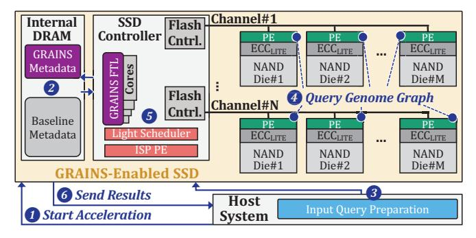
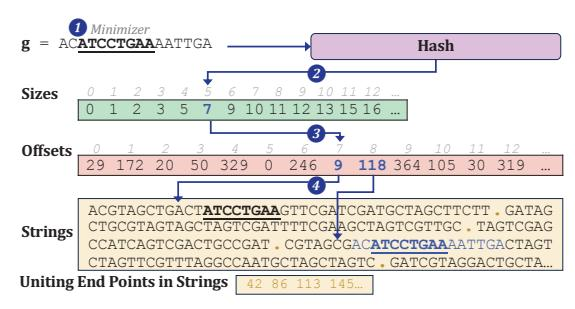
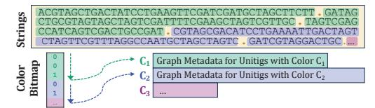
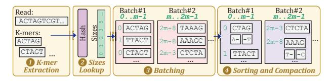
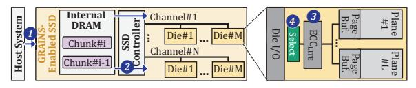
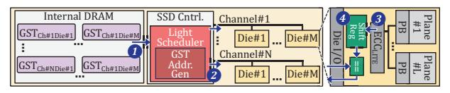
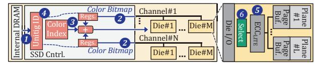

# **4. GRAINS**

We propose *GRAINS*, a versatile storage-centric system for graph-based genome analysis. GRAINS supports major operations in analysis with genome graphs (e.g., k-mer set lookup and read mapping), and for alignment-based workflows, it flexibly integrates with existing alignment accelerators. GRAINS is primarily designed as a system to accelerate analysis with genome graphs. GRAINS augments the existing SSD controller, flash dies, and FTL, and when not in the analysis acceleration mode, the SSD remains available for other applications, like a conventional general-purpose SSD.

We address the challenges of designing a SCC system for graph-based genome analysis via storage-aware algorithm architecture co-design based on our detailed examination of typical analysis pipelines that operate on genome graphs. To this end, we (*i*) make these pipelines more storage-friendly and (*ii*) further improve their performance, energy-efficiency, and cost-effectiveness via ISP and IFP.

GRAINS's algorithm-architecture co-design comprises three key aspects. First, we design *efficient batching and reordering techniques and pipelined execution flow* specialized to the properties of genome graphs to reduce the number of random accesses to the graph. Second, we devise *lightweight IFP units* to process the needed parts of each page's graph data in the flash die. This IFP design avoids transferring lowreuse or unused parts of flash pages outside the die, thereby preventing bandwidth waste. Third, to fully exploit die-level parallelism during IFP, we design an *effective yet lightweight SCC scheduling technique*, enabled by repurposing existing SSD structures. GRAINS's data placement (§8) drastically reduces the required in-DRAM mapping metadata, allowing us to use the freed-up internal DRAM space to maintain small per-die scheduling tables. We devise small ISP units on the SSD controller to interface with these tables and schedule IFP operations at low cost. To efficiently realize these aspects, while guaranteeing correctness and integrity, we apply simple changes to the FTL and adopt a lightweight ECC [322].

Leveraging our optimizations, GRAINS's SCC steps require only simple operations and small buffer spaces, enabling execution on either (*i*) our lightweight, specialized IFP and ISP hardware units or (*ii*) general-purpose IFP (e.g., [369,403–405]) and ISP (e.g., [406–421]) units. Efficient genome graph analysis on both stems from GRAINS's specialized batching, scheduling, and data/computation flow coordination. Execution on specialpurpose lightweight hardware leads to higher power efficiency (§12.2), while execution on existing general-purpose cores on the SSD controller or general-purpose IFP and ISP units facilitates near-term adoption. Ultimately, choosing between these GRAINS configurations is a design decision.

Fig. 6 shows an overview of GRAINS, with its lightweight IFP processing elements (PEs) on NAND flash dies and the lightweight ISP PE and scheduler on the SSD controller. GRAINS FTL (§8) orchestrates host communications and data flow across the SSD components. After receiving a request through GRAINS's interface commands (§9) for accelerating

Fig. 6: Overview of GRAINS.

graph-based genome analysis (1) in Fig. 6), GRAINS prepares (2) for SCC execution by flushing the conventional FTL metadata and loading the GRAINS FTL metadata (§5). When execution starts, in the *first step* (§6), GRAINS prepares input queries in the host via efficient batching and pipelined execution, and transfers the query batches to the SSD (3). In the *second step* (§7), GRAINS accesses graph data structures via its IFP (4) and ISP (5) units and sends the query results to the host (6). These two steps are pipelined, with efficient coordination between resources to avoid writes during SCC. Through its efficient execution flow and by avoiding frequent management tasks (by not needing writes during SCC), GRAINS effectively leverages the SSD's large internal bandwidth.

#### 5. Data Structures

GRAINS uses a node-centric DBG representation based on an associative dictionary to compactly represent graph sequences and their associated colors. Similar to prior large-scale genome graph analysis tools (e.g., [151,422–424]), we use SSHash [341] as our dictionary since, by exploiting the statistical features of k-mers, it achieves a substantially better space-time trade-off over prior sequence dictionaries.5

Graph Sequences. We store DBG's unitigs (i.e., maximal nonbranching paths) as contiguous strings in a predetermined order, so that a k-mer occurring in any unitig can be quickly located using a minimal perfect hash function [425] built for the set of k-mers.6 Fig. 7 shows an overview of the DBG structures. The unitigs are stored in Strings, and are indexed via Offsets and Sizes. Given a query read R, k-mers from the read are extracted and looked up. Consider k-mer g. First, its minimizer (i.e., the first m-mer with the smallest hash value) is extracted ( $\mathbf{1}$  in Fig. 7). Second, with the minimizer's minimal perfect hash value (h), Sizes is indexed (2). Third, with the Sizes values at locations h, Offsets is indexed (3). Sizes[h] from Sizes[h+1]is then subtracted to find how many Offsets elements to read at Sizes[h]. Fourth, with the Offsets values, Strings is indexed (4), and a window of length k-m+1 [341] in Strings is checked to find the minimizer and check if the rest of the k-mer matches.

**Graph Colors.** For storing graph colors, we adopt an approach similar to [151]. As shown in Fig. 8, we sort the unitigs in Strings based on their colors (i.e., the ID pointing to the metadata for

Fig. 7: Overview of the DBG structures and k-mer query.

that graph unitig), and use a simple *Color Bitmap* to mark the start of each new color. This encoding efficiently stores repeated colors at low storage overhead.

Fig. 8: Graph color encoding used in GRAINS.

## 6. Input Query Processing

In this step, GRAINS prepares reads for efficient graph queries in the next step (§7). We perform two new optimizations inspired by the characteristics of genome graphs and queries.

Cross-Read K-Mer Batching. Instead of querying each read in a read set individually, we analyze k-mers across different reads together. This way, we can batch k-mers to reduce the number of random accesses to the graph. To enable this, GRAINS populates a lightweight data structure associating each k-mer with the reads it originates from. When graph queries return the colors of matched k-mers, GRAINS assigns colors to each read. We perform this step in the host since extracting k-mers from reads incurs frequent writes, which would reduce the SSD's lifetime if performed inside the SSD.

Genome-Graph-Aware Query Reordering. We leverage a common property of minimal-perfect-hash-based k-mer dictionaries in DBGs: The metadata required for identifying the small per-minimizer lookup ranges (i.e., the Sizes array, as shown in Fig. 7) is much smaller than the graph's Offsets and Strings. Although the full graph is far too large and incurs large I/O overhead to access it in the host (as shown in §3), Sizes occupies only a small fraction of the total space (e.g., <4% in our large-scale graphs). This enables a powerful opportunity: We perform k-mer lookups on Sizes in the host and use the resulting Offsets indices to sort and batch k-mers before sending them to the SSD, thereby reducing the number of accesses and improving the access patterns to Offsets. To execute this step efficiently, as detailed below, we ensure that the time spent sorting the data and transmitting it to the SSD does not introduce significant overheads.

Fig. 9 shows an overview of GRAINS's query processing. GRAINS starts by extracting k-mers from each read (1) in Fig. 9) and looking them up in Sizes (2). To reduce the overhead of sorting and transferring k-mers to the SSD, we take two measures. First, we propose a new k-mer processing scheme by improving upon k-mer processing in [315,426]. We par-

 $^5 Since$  our techniques rely on general DBG properties, they are also applicable to other k-mer dictionaries that may be used as DBG backbones [148–151,329,344,422–424].

 $^6$  Note that in DBGs, edges between unitigs are represented implicitly via (k-1) -mer overlaps (§2.2).

Fig. 9: Overview of GRAINS's query processing.

tition the k-mers into batches corresponding to equal, disjoint ranges of Sizes values (3). Since these values serve as indices into Offsets, this partitioning enables an efficient pipeline: the sorting of one batch overlaps with the data transfer and Offsets lookups of the previous batch. Second, during sorting, we further compact k-mers by exploiting the fact that consecutive k-mers sorted by Sizes share the same minimizer (4). Thus, we store the minimizer once and keep only the differences, thereby significantly reducing the transferred data size (e.g., by  $2.3 \times$  on average across our evaluated datasets).

## 7. Graph Query

In this step, GRAINS looks up the query k-mers in the graph and, for k-mers that match a graph unitig, retrieves the associated colors. GRAINS executes this step inside the SSD since it involves accessing large graph structures with low reuse and requires only lightweight computation. This enables us to leverage the SSD's high internal bandwidth and reduce the burden of moving and analyzing large, low-reuse data on the rest of the system. In particular, GRAINS performs IFP to avoid transferring unnecessary parts of pages out of flash dies and to leverage multiple dies in parallel. To efficiently execute this step, GRAINS needs to leverage the large internal bandwidth without requiring expensive hardware resources in the SSD (e.g., costly logic units or large DRAM capacity/bandwidth). We demonstrate how GRAINS meets these requirements when accessing genome graph Offsets (§7.1), Strings (§7.2), and Colors (§7.3). A lightweight FSM control unit in the SSD controller coordinates execution flow between these stages.

## 7.1. Accessing Graph Offsets

Fig. 10 provides an overview of GRAINS's Offsets lookups. GRAINS receives Offsets indices and compacted k-mers from the host in chunks (1). The internal DRAM holds two small chunks: one incoming from the host and one used for querying Offsets. For an SSD with 16 channels, 8 dies/channel, 4 planes/die, and 4-KiB pages, GRAINS needs two 2-MiB chunks. GRAINS reads the values from DRAM, maps them to physical addresses using its simple mapping (§5), and accesses Offsets (2). Since the Sizes values are sorted by the host (§6) and Offsets are uniformly placed across dies (as detailed in §5), the lookups lead to sequential accesses that fully exploit the internal bandwidth. After loading a page into a die's page buffer, GRAINS applies ECCLITE [322] to correct errors (3). The IFP units then select and extract only the targeted Offsets entry

Fig. 10: Overview of GRAINS's Offsets lookups.

and send it to the controller (4), avoiding the transfer of full pages. GRAINS caches the extracted values in internal DRAM for subsequent Strings queries. Although full pages are read inside each die, only a small part of each page is written to internal DRAM, avoiding the internal DRAM bandwidth from becoming a bottleneck.

#### 7.2. Accessing Graph Strings

We also aim for the accesses to the large Strings structure to also fully exploit the SSD's large internal bandwidth; however, unlike Offsets, the indices into Strings (i.e., the retrieved Offsets entries) arrive unsorted, preventing simple streaming.

**Lightweight Scheduling.** We introduce a lightweight scheduler that (*i*) avoids redundant page accesses, and (*ii*) maximizes die-level parallelism, without relying on sorting accelerators in the SSD, which are inefficient, given the large number of elements and the limited bandwidth of internal DRAM [420].

As shown in Fig. 11, GRAINS maintains a small per-die table, called GRAINS Scheduler Table (*GST*) in the internal DRAM, with one row per Strings page. Each row stores the bit address within the page (as marked by Offsets entries), the k-mer minimizer and its suffixes/prefixes (Fig. 9), a flag indicating whether the row is full (and if so, a pointer to an extension table), and a small one-hot encoded bitmap marking the target plane in the die. The bitmap allows GRAINS issue *multi-plane* SSD operations, so that multiple planes of the same die serve different accesses concurrently. When accessing Strings, GRAINS schedules requests by simply reading one row per GST sequentially and issuing requests across all dies and planes in a round-robin manner. This naturally coalesces accesses to the same page, avoids redundant page accesses, and achieves high parallelism with small metadata and no complex logic.

GRAINS can store GSTs in the internal DRAM because (i) its efficient address mapping (§8) frees most of the DRAM, and (ii) our compact k-mer representation (§6) keeps GST entries small. Internal DRAM is sufficient even for large read sets and graphs (e.g., our large evaluated read set with  $\sim$ 10 million query reads on a large-scale genome graph7 requires only 2.9 GB, well within the 4-GB internal DRAM in a typical 4-TB SSD). Furthermore, to ensure efficient functionality even when usage exceeds the internal DRAM's capacity, GRAINS keeps some Sizes batches (§6) in host DRAM until the SSD finishes processing the current batch.

Fig. 11 shows an overview of Strings lookups. First, GRAINS's scheduler reads Strings addresses and corresponding k-mers from each GST (1) and sends the k-mers to the corresponding dies (2), incrementing each GST's row pointer for the next access. Second, GRAINS reads the corresponding Strings page, and after ECCLITE (3), the IFP unit performs a comparison between the Stringsin the indexed window and the incoming k-mer from the controller (4). Finally, GRAINS sends the comparison result and the unitig IDs of the matching k-mers back to the SSD controller.

&lt;sup>7The graphs we evaluate (§11) are among the largest single graphs constructed in practice. Graph-based databases that encode even larger volumes of data typically consist of several graphs that need to be queried. This is because graph construction time scales super-linearly, making construction of a single very large graph prohibitively slow [342,425].

Fig. 11: Overview of GRAINS's Strings lookups.

#### 7.3. Accessing Graph Colors

For each query k-mer that matches a unitig (§7.2), GRAINS retrieves the color of that unitig. Due to GRAINS's efficient scheduling (§7.2), unitig IDs are already retrieved in the internal DRAM in page order. Thus, given the underlying color encoding (§5), the unitigs' colors can be obtained via efficient sequential scans of the Color Bitmap (§5). Fig. 12 illustrates this. GRAINS's ISP units stream the next unitig ID from the internal DRAM into a small register (1) while concurrently scanning the Colors Bitmap from NAND flash dies (2). Given that the bitmap is consumed immediately, GRAINS's ISP units directly operate on NAND flash streams (as in prior work [420]), without buffering them in the internal DRAM. This avoids bottlenecking the internal DRAM's bandwidth. GRAINS uses only two small, 32-bit registers per channel: one for the current and one for the incoming bitmap chunk. As the bitmap is processed, each time a "1" is encountered (i.e., a new color is encountered), GRAINS increments Color Index (3). Once the bitmap position matches the unitig ID, GRAINS uses the Color Index to index the Colors (4). To access Colors, GRAINS uses the same approach as Offsets (§7.1), where, after light ECC (**5**), the IFP units select and transmit only the relevant portion of each page (**6**). The retrieved color entries are returned to the host, where each color identifies the database entries (e.g., species or samples) containing the matched sequence.

Fig. 12: Overview of GRAINS's Colors lookups.

#### 7.4. Detailed Design of the IFP Processing Elements

GRAINS's IFP PEs follow a high-level flow: (i) a page is read into the die's page buffer, (ii) the page's content goes through ECCLITE, and (*iii*) the PE operates on the page buffer contents. IFP Hardware Units. GRAINS's IFP PEs implement two lightweight functions: (i) selection, which extracts a targeted window of a page, and (ii) comparison, which performs a bitwise match between a k-mer and a targeted window. The page buffer in a standard NAND flash die is already organized as a byte- or word-addressable latch-based array with existing sense amplifiers and column select logic. GRAINS's selection mechanism repurposes this column decoding circuitry. Given an offset, the column logic isolates the targeted bytes. Instead of streaming the full page over the channel bus, this targeted window is either routed directly to the die's I/O interface or fed internally into the IFP comparison unit. The comparison unit itself consists of a small shift register and a bitwise comparator that checks the k-mer against the targeted window.

**Interaction with Flash Controllers.** The flash controller sends a small parameter (an offset or a k-mer) to the on-die PE

via the existing channel bus. This parameter is stored in a small register on the die and is delivered alongside the standard page read command. After the IFP operations, the controller reads back only the result (instead of the full page).

## 8. FTL Integration and Reliability Support

GRAINS FTL requires only minor changes to the baseline FTL. It designates each block as either genomic or non-genomic, and identifies genomic accesses through GRAINS commands (§9). For all non-genomic data, vendor-specific FTL features remain untouched, and the SSD behaves conventionally. At the start of its SCC operations, since GRAINS does not perform writes during them, it flushes the standard L2P metadata to the flash and loads the much smaller GRAINS L2P metadata (as detailed below) into internal DRAM, while also keeping the other metadata of a conventional FTL.

**Physical Allocation.** Since GRAINS regularizes accesses, GRAINS's data placement is simple and enables (*i*) efficiently leveraging the SSD's internal bandwidth and (*ii*) minimizing mapping metadata. We uniformly distribute the blocks of the underlying graph data structures and the query reads across different channels, dies, and planes in a round-robin way. For efficient multi-plane operations, active blocks across different planes are aligned to the same page offset.

This placement works synergistically with GRAINS's batching and scheduling, enabling well-balanced, parallel accesses across all internal SSD resources. That said, for workloads with persistently skewed query distributions (e.g., when specific genomic regions are queried disproportionately often), profileguided placement could offer additional benefits. Such an optimization would integrate seamlessly with GRAINS, affecting only the initial data layout. We describe this optimization further in an extended version [427].

FTL Metadata Size. GRAINS reduces the required FTL metadata size due to two reasons. First, instead of page-level L2P mappings (which, with 4 KiB pages, leads to ~4 GB of metadata for a 4-TB SSD), GRAINS stores L2P metadata at block granularity. This is possible because GRAINS performs no writes during SCC, and thus, no fine-grained remapping is needed. For a 1-TB graph with 12-MB blocks, this requires only 0.35 MB. Second, GRAINS's uniform data placement makes physical locations computable from base addresses and stride, minimizing per-block metadata needed for the SSD's reliable operations (e.g., read-disturbance counters). With per-block metadata, overall metadata size is 0.7 MB, freeing most of the internal DRAM for GRAINS's SCC and scheduling tables.

**Error Correction.** For data accessed by GRAINS's ISP units on the SSD controller (e.g., Color Bitmap), accesses occur after the regular ECC. For structures accessed by GRAINS's on-die hardware units, we adopt a lightweight on-die ECC technique, *ECCLITE*, along with its associated *Bias Error Encoding* [322].

**Other Management Tasks.** Since in SCC mode, GRAINS does not incur writes, it does not require write-related management such as GC and wear-leveling. GRAINS performs other tasks for ensuring reliability before or after SCC since (*i*) the duration of each GRAINS process is significantly shorter than the manufacturer-specified threshold for reliable retention age

(e.g., a year [428]), and (*ii*) GRAINS avoids read-disturbance errors [290,291,362,363,377,380] during SCC since, due to its efficient execution, each block is read at most once. After SCC steps, to prevent read disturbance errors in the future, GRAINS refreshes blocks whose read count exceeds a specific threshold.

