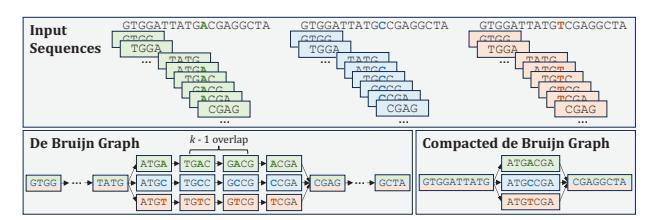
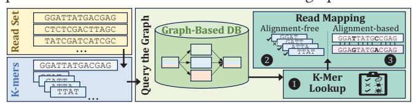
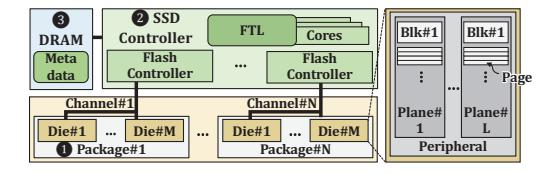
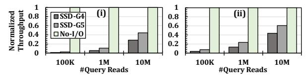
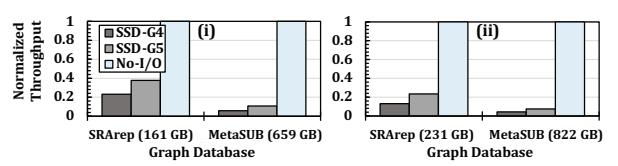

# GRAINS: Enabling High-Performance and Low-Cost Graph-Based Genome Analysis via Storage-Aware Algorithm-Architecture Co-Design

Nika Mansouri Ghiasi $^1$  Harun Mustafa $^{2,1}$  Talu Güloglu $^1$  Rakesh Nadig $^1$  Konstantina Koliogeorgi $^1$  Susana Rebolledo Ruiz $^{1,3}$  Marc Rautmann $^1$  Furkan Eris $^1$  Mohammad Sadrosadati $^1$  Jisung Park $^4$  Onur Mutlu $^1$ 

1ETH Zürich 2Johns Hopkins University 3University of Cantabria 4POSTECH

Graph-based representations of genome sequences have emerged as a powerful approach for representing massive genomic databases in an expressive and efficient way. Compared to traditional, linear genome sequences, genome graphs enable more accurate and efficient genome analyses, particularly in complex, population-scale settings (e.g., public health, precision medicine, and agriculture). Despite their benefits, analysis on large-scale genome graphs incurs significant data movement overhead from the storage system due to accessing large amounts of low-reuse data. Processing data directly inside the storage device, where data originally resides, can be a fundamental solution for mitigating this overhead. However, none of the existing tools for graph-based genome analysis can be efficiently used inside the storage system due to the limited internal hardware resources in modern SSDs. At the same time, prior storage-centric systems developed for (i) traditional, linear non-graph-based genome analysis or (ii) conventional, non-genomic graph analysis are not suitable for the unique data structures and access patterns of graph-based genome analysis.

We propose GRAINS, the first system for analysis with largescale genome graphs in storage. Through our detailed examination  $\overline{of}$  typical analysis pipelines that operate on genome graphs, we perform storage-aware algorithm-architecture co-design to (i) make the graph-based genome analysis pipelines more storagefriendly and (ii) further improve performance, energy-efficiency, and cost via in-storage and in-flash processing. GRAINS's codesign is based on three key aspects. First, we propose a new batching technique and execution flow, based on unique features of genome graphs, that reduces the number of random accesses to graph nodes. Second, via in-flash and in-storage processing, we avoid transferring low-reuse or unused flash pages, preventing SSD channel and external I/O bandwidth waste. Third, to leverage the full parallelism of flash dies during in-flash processing, we design an effective, yet lightweight, scheduling technique, enabled by re-purposing the existing SSD structures. GRAINS's design is versatile and flexible as it supports key operations on genome graphs and can be integrated in various analysis pipelines. GRAINS provides  $2.7 \times -47.8 \times$  speedup  $(4.4 \times -31.6 \times$ energy reduction) over the state-of-the-art software baselines, and  $1.5 \times -17.0 \times$  speedup (3.1 $\times -20.7 \times$  energy reduction) over a hardware-accelerated baseline.

#### 1. Introduction

Genome sequence analysis, which examines the genomic information of living organisms and other biological entities, is fundamental to many critical fields, including personalized medicine [1-28], disease outbreak tracing [29-54], cancer research [55–101], maintenance of food resource safety [102,103], agriculture [104-119], scientific discovery [120-122], biodiversity conservation [123,124], evolutionary biology [125-142], and antimicrobial resistance surveillance [143-145]. To enable the computational analysis of an organism's genomic information (typically encoded in DNA or RNA that has been reverse-transcribed into DNA [146,147]), a process called sequencing converts the information of DNA molecules in the organism's biological sample to digital data. Since current sequencing technologies cannot process a DNA molecule as a whole, a sequencer generates randomly sampled, inexact fragments of genomic information, called *reads*. Common genome analysis workflows then involve querying reads from a sample against a single reference genome or large-scale databases (e.g., containing reference genomes from many species or previously sequenced samples) to determine species or genomic features present in the sample [148-153] and/or to find their differences from genomes in the database [154,155]. These queries either involve k-mer set lookups (where subsequences of length k, i.e., k-mers, in a read set are matched against the database) or read mapping (where each read is analyzed individually). The importance of genome analysis, along with rapid improvements in sequencing technology (i.e., reduced costs and increased throughput [156,157]), has led to its increasing adoption [22-24,26-28,49,54]. This growth has, in turn, motivated a large body of work (e.g., [29,116,158-257]) on accelerating these analyses to keep pace with rapidly growing sequencing throughput and data volumes.

Genome Graphs have emerged as a powerful approach for representing and querying massive and complex genomic databases [148,151,258–264]. Unlike traditional models, which represent genomic databases as a collection of disjoint, linear sequences, sequences in a graph are represented by graph walks [259]. Genome graphs provide two fundamental benefits, making them indispensable, particularly in modern, population-scale genomics [143,148,265–267]. First, the graph topology, along with its associated metadata1 offer vastly greater expressive power [266–269]. A graph naturally encodes the evolutionary history and diversity of the organisms in a database, revealing their shared and distinct se-

 $^1\mathrm{Metadata}$  can include the original species or samples of a graph node's sequence [258,259], associations with patient outcomes [148], and more.

quences [263,266,268,270]. This leads to reduced bias and improved analysis accuracy. For example, genome graphs improve disease diagnosis by capturing population-specific variants often missed by traditional, linear sequences [155,266]. Second, genome graphs leverage the inherent redundancy of genomic data to *avoid redundant computation* on shared sequences. This is because shared genomic regions across database entries are stored only once and do not need to be queried separately. This is essential in settings like populationscale pathogen surveillance, where public health systems must rapidly match new pathogen genomes against large national databases [143,148,264,271–273].

**Data Movement Overhead.** Due to the significance of graphbased genome analysis and its computational challenges, many works (e.g., [231–257]) propose techniques to alleviate these challenges by mitigating computational and main memory bottlenecks. However, to our knowledge, none of them mitigates the I/O cost of reading large amounts of graph data from the storage system to main memory and computation units. Our motivational analysis (§3) shows that the end-to-end performance of analysis with large-scale genome graphs suffers significantly from the data movement overhead of accessing large amounts of low-reuse data (exacerbated by reduced access locality due to the graph structure).

The I/O overhead of moving large amounts of low-reuse genome graph data is hard to avoid. One might think it is possible to eliminate this overhead by (*i*) shrinking graphs through sampling (e.g., [274–279]) or (*ii*) maintaining all required graphs completely and always in main memory. However, neither solution is suitable. The first approach necessarily reduces accuracy [156], making it inapplicable for many use cases (e.g., [156,160,280–287]). The second approach is not suitable since (*i*) genome graph databases, which are already large (tens to hundreds of terabytes [148,288]), grow in size rapidly due to increasing demands in biomedicine [22–24,26–28,49,54] and the exponentially decreasing cost of sequencing [289], and (*ii*) regardless of individual graph sizes, different analyses need to access different graphs. Therefore, it is energy-inefficient, unsustainable, costly, and unscalable to maintain *all* data required for *all possible* analyses in DRAM at all times.

**Storage-centric computing (SCC)** refers to processing data inside the storage device, either on the SSD2 controller (instorage processing, i.e., ISP) or on the flash dies (in-flash processing, i.e., IFP). SCC can be a fundamental solution for alleviating data movement overheads in graph-based genome analysis by processing data where it originally resides. This is due to three reasons. First, SCC reduces unnecessary data movement between the storage system and compute units by handling large amounts of low-reuse data within the storage system. Second, SCC alleviates the overall execution burden of moving and analyzing low-reuse data from the rest of the system (e.g., processing units and main memory), such that these components can be used for other purposes or be turned off to save energy. Third, SCC exploits the large internal bandwidth of the SSD, which is particularly advantageous when

computation is performed within the flash dies.

**Limitations of Prior Work.** To our knowledge, no prior work alleviates the I/O overheads of graph-based genome analysis. Some works (e.g., [231–244]) accelerate graph-based genome analysis by alleviating its computation or main memory bottlenecks. However, they do not alleviate I/O overheads, whose impact on end-to-end performance gets even larger as other overheads are alleviated. Several works propose SCC to alleviate the I/O overheads of (*i*) *non-genomic* graph analysis (e.g., [296–312]) or (*ii*) genome analysis on conventional, *linear sequences* (e.g., [204,241,313–318]). However, as detailed in §13, they are not directly applicable to the unique structures, access patterns, and operations on genome graphs.

**Challenges.** Despite the benefits of SCC, no existing tool for graph-based genome analysis can be efficiently implemented in the SSD due to the limitations of hardware resources in modern SSDs. This is because graph-based genome analyses involve extensive random, irregular accesses to genome graphs, causing costly contention in internal SSD components (e.g., channels and NAND flash dies [319–321]). This hinders leveraging the SSD's internal bandwidth, thereby diminishing the benefits of SCC.

**Our goal** in this work is to improve the performance and energy efficiency of graph-based genome analysis by reducing the large data movement overhead from the storage system in a low-cost way. To this end, we propose GRAINS, the *first* system for analysis with large-scale **g**enome g**ra**phs **in s**torage. GRAINS is versatile and flexible as it supports major operations on genome graphs (e.g., k-mer set lookup and read mapping) and can be integrated into various analysis pipelines. Through our detailed examination of typical graph-based genome analysis pipelines, we perform storageaware algorithm-architecture co-design to (*i*) make the graphbased genome analysis pipelines more storage-friendly and (*ii*) further improve performance, energy-efficiency, and costeffectiveness via SCC.

**Key Mechanism.** GRAINS's algorithm-architecture co-design is based on three key aspects. First, we design an efficient batching technique and pipelined execution flow specialized to the properties of genome graphs and queries to reduce random accesses to the genome graph structure. Second, we devise lightweight hardware units in the flash dies to process the needed parts of each page's graph data. This simple IFP design avoids unnecessarily transferring low-reuse or unused parts of flash pages outside the flash die, preventing SSD channel and external I/O bandwidth waste. Third, to fully exploit die-level parallelism in IFP, we design an effective, yet lightweight, scheduling technique, enabled by repurposing existing SSD structures. GRAINS's data layout drastically reduces the required in-DRAM mapping metadata, allowing us to use the freed-up internal DRAM space to maintain small per-die scheduling tables. We devise small ISP units on the SSD controller to interface with these in-DRAM tables and schedule IFP operations at low cost. To efficiently realize this SCC design, while guaranteeing correctness and integrity, we apply simple changes to the flash translation layer (FTL) and adopt a lightweight error correction scheme [322].

2In this work, we focus on the predominant NAND flash-based SSDs [290,291]. We expect that our designs and insights would benefit storage systems with other emerging technologies (e.g., [292–295]) as well.

Key Results. On systems with two state-of-the-art SSD configurations, we compare GRAINS against state-of-the-art software and hardware tools for graph-based genome analysis: (i) Fulgor: a node-centric tool [151], (ii) the MetaGraph framework: an edge-centric tool [148,260-262], and (iii) an idealized hardware-accelerated tool without main memory overheads (IdealAccMem) to query the graph. We show that when performing k-mer set lookups and alignment-free read mapping (two core operations in large-scale genome graph analyses), GRAINS provides  $6.8 \times (11.2 \times)$ ,  $10.7 \times (21.5 \times)$ , and  $5.6 \times (9.8 \times)$ average speedup (energy reduction) over Fulgor, MetaGraph, and IdealAccMem, respectively. GRAINS's workflow also seamlessly supports alignment-based mapping, where the candidate graph regions identified by GRAINS are fed to an alignment engine. We integrate GRAINS, Fulgor, and MetaGraph with SeGraM, a state-of-the-art sequence-to-graph alignment accelerator [231]. SeGraM+GRAINS performs  $6.2 \times$  and  $9.0 \times$  better than SeGraM+Fulgor and SeGraM+MetaGraph.

This work makes the following **key contributions**:

- We demonstrate the impact of I/O overheads on the end-toend performance of graph-based genome analysis.
- We introduce GRAINS, the first system for analysis with large-scale genome graphs in storage.
- We perform storage-aware algorithm-architecture co-design to make graph-based genome analysis more storage-friendly, and further improve performance, efficiency, and costeffectiveness via storage-centric computing (SCC).
- We show that GRAINS improves performance and energy efficiency over the state-of-the-art graph-based genome analysis tools and accelerators, without relying on costly resources throughout the system, thereby enabling wider adoption of graph-based genome analysis.

## 2. Background

## 2.1. Genome Sequence Analysis

Given a genomic sample, a typical workflow consists of three key steps: (*i*) sequencing, (*ii*) basecalling, and (*iii*) analysis. The first step, *sequencing*, reads and converts the sample's DNA3 to digital signals. Modern sequencers cannot read long DNA molecules as complete sequences. Instead, they produce many shorter, overlapping sequences called *reads*. The second step, *basecalling*, converts each raw read signal into a string, encoded using A, C, G, T [323]. The third step is *genome analysis* on a set of reads (i.e., a *read set*). Common genome analysis workflows then involve querying reads from samples against a single *reference* genome or large-scale databases (e.g., containing reference genomes from many species or previously sequenced samples) to determine species or genomic features present in the sample [148–153] and/or to find their differences from genomes in the database [154,155].

In this work, we focus on the analysis performance for two reasons. First, sequencing and basecalling are typically performed once per read set, whereas analysis of the same read set can be performed *many times* or at *different times*. For example, read sets from prior disease-association studies are commonly reanalyzed as human or microbial genome databases improve [154,267,324–326] or expand [264,267], or when new personalized databases can be tailored to the study cohort [266,327]. Second, modern sequencing throughput far outpaces Moore's law [156,289,328], which poses significant computational challenges for analysis on conventional systems. This is why genome analysis tasks have been a key acceleration target in a large body of works (e.g., [29,116,158–230]).

## 2.2. Graph-Based Genome Analysis

Genome Graphs have emerged as a powerful approach for representing and querying massive and complex genomic databases [148,150,151,231,258–264,329]. Unlike traditional models, which represent genomic databases as a collection of disjoint, linear sequences, sequences in a graph are represented by graph walks [258,259]. Genome graphs collapse subsequences shared across different database entries into single nodes and indicate adjacent subsequences with edges, compacting sequence sets (by up to thousand-fold [148]). A node's metadata then indicates which entries contain the represented sequence.

Genome graphs provide two fundamental benefits, which make them indispensable, particularly in modern, populationscale genomics [143,148,265–267]. First, the graph topology, along with its metadata, offer vast expressive power [266-269,330]. A graph naturally encodes the evolutionary history and diversity of a cohort of organisms, revealing their shared and distinct sequences [263,266,268,270]. This leads to reduced bias and improved accuracy in analyses. For example, genome graphs improve disease diagnosis by capturing populationspecific variants often missed by analyses on traditional, linear sequences [155,266,331,332]. Second, genome graphs leverage the inherent redundancy of genomic data to avoid redundant computation. This is because shared genomic regions across database entries are stored only once and do not need to be queried separately. This is essential in settings such as population-scale pathogen surveillance, where public health systems must rapidly match new pathogen genomes against large national databases [143,148,264,271-273], enabling timely detection of local outbreaks and limiting broader spread.

De Bruijn Graphs. To efficiently represent large-scale genome graphs, de Bruijn graphs (DBGs), which are a type of overlap graph [148,150,151,231,258-263,329,333,334], have been adopted by many recent works [148-151,258,260-While other genome graph classes ex-263,329,335]. ist [270,336,337], DBGs scale much better with both the entries' size and genetic diversity of genomic databases [148,261,338,339], which is why they are preferred in these contexts. Fig. 1 shows an example of a DBG, where each node is a unique k-mer (i.e., a subsequence of length k) that is observed in the input, and there is a directed edge from node uto node v if the suffix (k-1)-mer of u is equal to the prefix (k-1)-mer of v. Each node is then assigned a color, representing its metadata. A common strategy to reduce a DBG's size is to instead store its corresponding compacted DBG, where all k-mers from a maximal non-branching path are merged into a single node. There are two common ways to represent (compact) DBGs [340]. A node-centric DBG of order k

 $^3$ Even if an organism's genome is RNA-based, it is typically converted to DNA before being sequenced [146,147].

Fig. 1: An example de Bruijn graph and its compacted form.

(e.g., [149,151,341]) stores all k-mers observed in the entries and defines its edges implicitly (Fig. 1). An *edge-centric* DBG of order k (e.g., [148,150,260–262,342,343]) stores observed (k-1)-mers as nodes and only stores the edges that represent observed k-mers. In the rest of this paper, we refer to compact DBG as DBG for short.

Graph-based genome analysis involves querying reads against the graph to determine what species or genomic features are present in the sample [148–153] and/or to find their differences from genomes in the database [154,155]. As shown in Fig. 2, queries fall into two categories: **1** k-mer set lookups (where k-mers in a read set are matched against the graph to determine the species present in a sample), and read mapping (where each read is analyzed individually). Read mapping can be done by either **2** alignment-free or **3** alignment-based approaches. Alignment-free approaches (more common for large-scale studies [148,260]) match all k-mers of a read to the graph, retrieve the metadata associated with the graph nodes to which the k-mers match, and classify the read using this metadata. Alignment-based approaches introduce an additional, computationally expensive approximate string matching step, where candidate regions identified by k-mer matches are refined via dynamic programming to determine precise differences between the read and the graph.

Fig. 2: High-level overview of graph-based genome analysis.

#### 2.3. Unique Characteristics of Genome Graphs

The type of data encoded in genome graphs and the underlying goals of querying genome graphs exhibit unique features not encountered in conventional, non-genome graphs (e.g., social networks, web graphs, road networks). General-purpose graph data structures and methods do not account for these features, leading to significant inefficiencies in storage and computation requirements and missed opportunities. This has led to significant efforts in both software (e.g., [265,331,344–354]) and hardware (e.g., [231–244]) to develop specialized techniques for genome graphs.

The unique semantic characteristics in genome graphs manifest in three key aspects regarding the graph structure, storage (e.g., sparsity and degree distribution), and access patterns. First, in a traditional graph with N nodes, there are  $\mathcal{O}(N)$  to  $\mathcal{O}(N^2)$  edges that must all be stored explicitly (e.g., adjacency lists [355,356], compressed sparse row formats [357,358]). Genome graphs, most commonly represented as DBGs, are

structurally constrained in that they either store nodes or edges (as detailed in §2.2) and the other is obtained implicitly. This is a feature necessitated by the massive scale of genome graphs and enabled by the inherent overlap structure of the sequences they encode.

Second, traditional graphs typically exhibit power-law distributions, in which a small number of nodes have very high degree and many graph-processing optimizations (e.g., [359–361]) exploit this skew. However, DBG node outdegrees and indegrees are at most four (determined by the fixed alphabet size, A, C, G, T, in the underlying data) regardless of the overall graph size. Therefore, optimizations that exploit skewed degree distributions, a common strategy in conventional graph processing systems, are not well-suited to genome graphs, necessitating different optimization approaches.

Third, due to the differences in underlying graph structures, access pattern optimization opportunities vary between genome graphs and non-genome graphs. The compressed data structures used in large-scale genome graphs enforce specific node orderings and, thus, restrict node reordering, a technique commonly used in non-genome graphs to improve access patterns [341,342]. However, the fact that genome graphs encode biological sequences, and that queries are themselves biological sequences, opens new avenues for improving access pattern locality that are unavailable in conventional graph workloads. For example, k-mers from different query reads that share common substrings map to nearby regions in the graph's index structures. In contrast, most conventional non-genome graph queries do not exhibit this kind of structural coupling between the queries and the graph, limiting opportunities for analogous locality-aware optimizations.

#### 2.4. SSD Organization

Fig. 3 depicts the organization of a modern SSD.

Fig. 3: Organizational overview of a modern SSD.

**1** NAND Flash Memory. A NAND package consists of multiple *dies* or *chips* that share the NAND package's I/O. One or multiple packages share a command/data bus or *channel* to communicate with the SSD controller [290,291,319,362–367]. Each channel can be used by only one die at a time, to communicate with the controller, whereas dies can operate independently. Each die has multiple (e.g., 2 or 4) *planes*, each with thousands of *blocks*, and each block has hundreds to thousands of 4–16 KiB *pages*.

Read/write operations take place at page granularity; erase operations at block granularity. The planes in each die share the peripheral circuitry for access to pages. Thus, planes in a die can operate concurrently when accessing pages (or blocks) at the same offset via *multiplane* operations [291,313,362,368,369].

**2 SSD Controller.** An SSD controller consists of two key components: the *flash translation layer (FTL)* and the

flash controllers. The FTL, executed on multiple cores, is responsible for communication with the host, internal I/O scheduling, and various SSD management tasks. The *perchannel hardware flash controllers* manage the request handling [290,291,319,362–367,370] and error correction for the NAND flash chips [290,291,363–366,370–381].

**3** DRAM. Modern SSDs employ low-power DRAM to store metadata crucial for SSD management, e.g., logical-to-physical (i.e., L2P) mappings. L2P mappings are typically maintained at a granularity of 4KiB to enhance random access performance. The required capacity for L2P mappings is about 0.1% of the SSD's capacity, considering a 32-bit architecture, with 4B of metadata for every 4KiB of data. This translates to a 4-GB LPDDR4 DRAM for a 4-TB SSD [382].

## 3. Motivational Analysis

We conduct experimental analyses to assess the impact of I/O overheads on graph-based genome analysis performance.

#### 3.1. Data Movement Overheads

**Tools and Datasets.** We use two state-of-the-art tools for large genome graph analysis: (*i*) Fulgor [151], a node-centric tool, and (*ii*) the MetaGraph framework [148,260–262], an edge-centric tool. For each, we use the best-performing thread count and color encoding scheme. We evaluate k-mer set lookup, a fundamental task on genome graphs (§2). Graphs are built from a pilot subsample of the global MetaSUB Consortium [143] dataset. The resulting graph (with colors) is 659 GB for Fulgor and 822 GB for MetaGraph. We evaluate queries with varying read counts, ranging from 100K reads4 to 10M reads (35 MB to 3.5 GB). §11 provides further methodology details.

**System Configurations.** Our experiments run on a high-end server with an AMD EPYC 7742 CPU [383] and 1.5 TB of DDR4 DRAM [384]. DRAM capacity *exceeds* the total size of all data accessed during the analysis. This ensures that we capture the intrinsic I/O overhead of transferring large, low-reuse data from the storage system to main memory, without being constrained by memory capacity. We analyze I/O overheads using two state-of-the-art SSDs: (*i*) SSD-G4, with a PCIe Gen4 interface [385] and (*ii*) SSD-G5, with a PCIe Gen5 interface [386].

**Observations.** Fig. 4 shows throughput (#queries/sec) of the tools, normalized to that of a hypothetical configuration with zero performance overhead due to storage I/O (No-I/0). We observe that in all cases, I/O leads to large overheads, even with the state-of-the-art SSDs. Compared to SSD-G4 (SSD-G5), No-I/O leads to  $16.7 \times (9.3 \times)$  and  $7.5 \times (4.5 \times)$  better average performance in Fulgor and MetaGraph, respectively.

Fig. 4: Normalized throughput of (i) Fulgor and (ii) MetaGraph under different storage configurations and query sizes.

4Note that smaller queries are also critical, as some applications (e.g., searching for antimicrobial resistance [143,148,264,271] or for a single gene of interest [121]) require searching a single or a few genes within a large graph.

Fig. 5 shows the throughput of the tools normalized to No-I/O, across different database sizes. The larger graph (G\_MetaSUB) is the one discussed earlier. The smaller graph (G\_SRArep) is generated from a representative subset of the Sequencing Read Archive's [157] public portion. The resulting graph (with colors) is 161 GB for Fulgor and 231 GB for Meta-Graph. We observe that, in all cases, I/O overhead is substantial and increases with database size. For example, the speedup of No-I/O over SSD-G5 increases from  $2.7\times$  to  $9.2\times$  (as the graph database size grows from 161 GB to 659 GB) in Fulgor and from  $4.3\times$  to  $13.4\times$  (as the graph database size grows from 231 GB to 822 GB) in MetaGraph.

Fig. 5: Normalized throughput of (i) Fulgor and (ii) MetaGraph under different storage configurations and graph sizes.

Based on these observations, we conclude that storage I/O leads to large overheads in graph-based genome analysis, an overhead that is expected to exacerbate in the future. This I/O overhead is due to moving large amounts of *low-reuse* data from the storage system all the way to main memory, caches, and computational units. Due to its low reuse, caching this data in DRAM during analysis (even if DRAM is larger than the data size, as evaluated in our analyses) does not significantly amortize this overhead. While several works (e.g., [156,160,280–287]) accelerate analysis with genome graphs, to our knowledge, they do not address storage I/O overheads. Although mitigating other bottlenecks (e.g., main memory or computation) leads to large benefits, doing so does not alleviate I/O overheads, whose impact on end-to-end performance becomes even larger as other bottlenecks are alleviated.

This I/O overhead, due to moving large amounts of lowreuse data, is hard to avoid. One might think it is possible to avoid it by (i) producing smaller databases through sampling (e.g., [274–279]) or (ii) maintaining all required graph data completely and always resident in main memory. However, neither of these is suitable. The first approach necessarily reduces accuracy [156], rendering it inapplicable for many use cases (e.g., [156,160,280-287]). The second approach is energy-inefficient, unsustainable, costly, and unscalable for two reasons. First, the sizes of graph-based databases (which are already large, i.e., tens to hundreds of TBs in some recent examples [148,288]) have been growing rapidly [157,289,328,387]. Second, independent of the sizes of individual graphs, different analyses need different graphs, constructed from different sets of genomes and/or with varying parameters. For example, clinical studies may require graphs with patients' genomes kept separately for privacy [388], while metagenomic studies and wastewater monitoring require highly diverse genome sets [277,282,389,390]. Therefore, keeping all data for all possible analyses in DRAM at all times is prohibitively inefficient and ultimately unsustainable.

Several works (e.g., [204,313–315]) have already demonstrated significant I/O overheads in non-graph-based genome

analysis. While genome graphs enable a more compact representation of population-scale databases (thereby making it feasible to analyze databases that would be prohibitively large under traditional, linear representations), they still suffer from large I/O overheads. This is because the massive and continually growing scale of these databases still leads to very large graphs with low data reuse, and the graph topology introduces irregular, dependent access patterns, further reducing locality.

## **3.2. Alleviating Data Movement Overheads**

**3.2.1. Storage-Centric Computing (SCC).** Processing data in the storage device can be a fundamental approach for reducing the I/O overheads for three reasons. First, SCC eliminates unnecessary data movement of low-reuse data across the system. Second, SCC reduces the computational burden imposed by low-reuse data on the rest of the system (e.g., main memory and computational units), such that these components can be used for other purposes or be turned off to save energy, or can be made simpler or less costly [315,391]. Third, as highlighted by many prior works (e.g., [307,309,313,392– 397]), SCC can leverage the high internal bandwidth of SSDs. In modern SSDs, the internal bandwidth often surpasses the external bandwidth. For example, a state-of-the-art SSD controller [398] delivers 14 GB/s of external bandwidth and up to 57.6 GB/s of internal bandwidth (achieved via 16 channels, each with a peak of 3.6 GB/s). Over-provisioning internal bandwidth in modern SSDs is important to protect user-perceived external I/O performance, mitigating the effects of (*i*) channel contention [319,320,399,400] and (*ii*) the SSD's internal data migration for management tasks [290,321,401,402] and refresh [375,377]. The effective internal bandwidth increases even further when processing directly in the NAND flash dies [322,369,403]. This is because in-flash processing exploits the aggregate bandwidth across all dies, a bandwidth that grows with the number of dies and significantly exceeds both (*i*) the bandwidth available to processing units on the SSD controller and (*ii*) the external SSD bandwidth.

**3.2.2. Challenges and Goal.** Designing a SCC system for graph-based genome analysis is challenging because none of the existing approaches can be directly implemented inside storage effectively due to modern SSDs' constrained hardware resources. Both node- and edge-centric representations of genome graphs require many random accesses during analysis. These random and irregular accesses cause costly contention in internal SSD components (e.g., channels and NAND flash chips [319–321]), which hinder leveraging the SSD's internal bandwidth. Therefore, directly adopting existing approaches inside storage leads to performance and energy overheads.

Some SCC systems in other domains regularize accesses by performing sorting in either the SSD or the host. However, these approaches are not effective for graph-based genome analysis. Sorting the large number of accesses is impractical within the SSD due to resource constraints. Sorting on the host also fails to fully address access irregularity, as graph-based genome analysis involves dependent accesses. Coordinating sorting between the host and the SSD for each round of dependent accesses incurs significant data movement overhead.

**Our goal** in this work is to improve the performance and

efficiency of graph-based genome analysis by alleviating its data movement overheads from storage cost-effectively.

