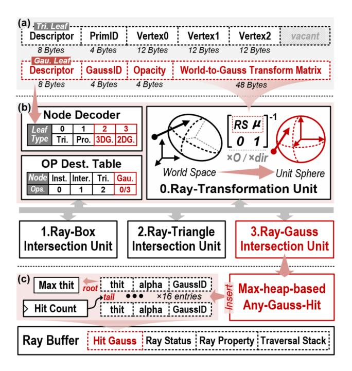
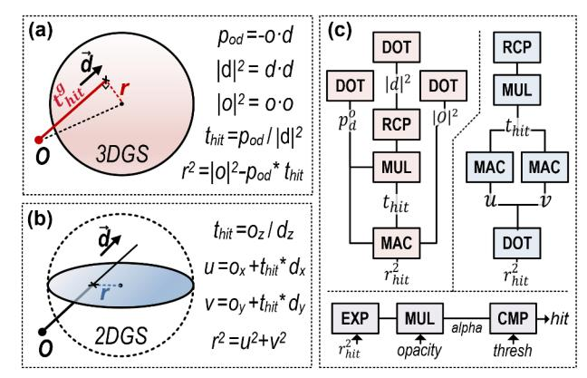
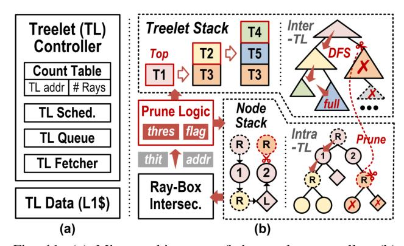

# *A. RTA Modification*

Fig. 8 highlights the modification to the baseline RTA in red, which covers the following components:

Fig. 8: Modifications to RTA. (a) Node encoding of Gaussian leaf. (b) Operation arbiter and units. (c) Ray buffer.

**Leaf Node Encoding:** The leaf node encodes the geometry and properties required for intersection tests. For a Gaussian primitive, its geometry can be represented by a  $4\times4$  homogeneous transformation matrix T (Eq. 5), which maps a standard normal Gaussian, shaped as a unit sphere, to an arbitrary ellipsoid in the world space.

$$T = \begin{bmatrix} M & \vec{\mu} \\ 0 & 1 \end{bmatrix}, \quad M = RS = \begin{bmatrix} s_0 \vec{r_0} & s_1 \vec{r_1} & s_2 \vec{r_2} \end{bmatrix} \quad (5)$$

To simplify the ray-Gauss intersection test, we encode the leaf node with the inverse transformation matrix, T' (Eq. 6), instead of storing the original decomposition factors (i.e., scale S, rotation R, and center  $\mu$ ).

$$T' = \begin{bmatrix} M^{-1} & -M^{-1}\vec{\mu} \\ 0 & 1 \end{bmatrix}, \ M^{-1} = S^{-1}R^T$$
 (6)

This allows rays to be directly transformed from world space to a unit-sphere space centered at the Gaussian and aligned with its principal axes, as illustrated in Fig. 8(b). Operating in this normalized space enables straightforward computation of intersection distances and responses (Sec. IV-B), eliminating the need for additional translations or covariance matrix inversions. It is worth noting that 2DGS differs from 3DGS in that the third scaling component  $s_z$  is effectively zero. To avoid singularities, we set this component to a constant while restricting intersection tests to the z=0 plane. Since the T' is also homogeneous (Eq. 6), only 12 elements (48B) need to be stored. Combined with the opacity, a Gaussian ID, and a 2-byte descriptor, each Gaussian leaf occupies 64B in total,

Fig. 9: Reconfigurable Ray-Gauss Intersection Unit (RGIU). (a) Principle of the ray-3DGS intersection test. (b) Principle of the ray-2DGS intersection test. (c) Computing units and data flows: red denotes 3DGS mode, blue denotes 2DGS mode, and purple denotes the shared part.

matching the size of a conventional triangle leaf, enabling seamless integration into BVH construction and node access. Appearance parameters such as spherical harmonics or colors are stored separately as texture data and accessed via the Gaussian ID in the programmable closest-hit shader, providing flexibility for shading.

Operation Arbiter and Units: During traversal, fetched nodes are forwarded to the operation arbiter, where a node decoder interprets their descriptors. The decoded information is then passed to the operation destination table, routing each request to the appropriate operation unit based on the node type. To support the introduced Gaussian leaf, the node type field in the leaf descriptor is extended from one bit to two bits, enabling explicit differentiation among triangle, procedural, 3D Gaussian, and 2D Gaussian primitives. Correspondingly, additional operation flows are integrated into the operation destination table to handle these Gaussian types. To efficiently support built-in intersection test for Gaussian primitives, we repurpose the existing Ray Transformation Unit (TRAN), which was originally designed to map rays from world space to object space using instance nodes' transformation matrices. Upon processing a Gaussian node, the TRAN reads its inverse transformation matrix T' (Eq. 6) and performs two matrixvector multiplications to transform the ray's origin and direction into the normalized unit-sphere space. These transformed ray attributes are then stored in the Ray Buffer and passed to the RGIU for intersection test and response evaluation. Notably, the impact of Gaussian primitives on the arbiter is limited to extending the routing path in the destination table and enabling a sequential dispatch (TRAN → RGIU) within the existing framework, without introducing new arbitration stages or modifying the arbitration policy.

**Ray Buffer:** The ray buffer is extended with a Hit Gauss Buffer, which maintains up to 16 entries of ray-Gauss intersections. Each entry records the hit distance, alpha value, and primitive ID. Additionally, a hit counter is introduced to

track the number of hit Gaussians in buffer, which is reset before each traceRay invocation. The Hit Gauss Buffer is implemented as per-thread register and its maintenance during Gaussian ray tracing is detailed in Sec. IV-C.

#### B. Reconfigurable Ray-Gauss Intersection Unit

Unlike traditional ray-triangle or ray-box intersection tests, which rely on explicit geometric boundaries, a ray-Gauss hit is determined by evaluating the response at the intersection candidate point (i.e., alpha value) and comparing it against a threshold (typically 1/255). The definition of the intersection candidate differs between 3D and 2D Gaussian primitives, which are illustrated in Fig. 9 (a) and (b), respectively.

For 3D Gaussian, the intersection point is defined as the position along the ray where the Gaussian response is maximized. In the normalized unit-sphere space, this is equivalent to projecting the coordinate origin onto the ray. The resulting projection distance,  $t_{hit}^g$ , is computed as the dot product between the transformed ray origin  $\vec{O}$  and the normalized direction d/|d|. This value is further scaled by |d| to restore the corresponding world-space hit distance  $t_{hit}$ . Finally, the squared radial distance  $r_{hit}^2$  from the hit point to the center is derived from the Pythagorean theorem. For 2D Gaussian, the candidate is directly the intersection point of the ray with the 2D ellipse. Since the z-axis is perpendicular to the 2D planar after transformation,  $t_{hit}$  can be computed as the ratio between the z-component of the transformed ray origin and that of the transformed ray direction. The 2D coordinates of the intersection point (u, v) are then obtained by marching the origin along the ray by  $t_{\rm hit}$ .

To support both scenarios with minimal overhead, our reconfigurable hardware unit maximizes the reuse of computational resources. For 3DGS, the computation requires three dot-product units (vec3), one reciprocal unit and one scalar multiplier (together forming a floating-point divider), and one multiply-accumulate (MAC) unit. This configuration fully adapts to 2DGS, where the MAC operation can be realized via a dot-product unit. Reconfigurability is achieved through lightweight multiplexers that redirect the dataflow of computation units, driven by a single-bit flag switching between 3DGS and 2DGS modes.

Regarding the response evaluation, both 2DGS and 3DGS follow the same computation flow as shown in Fig. 9(c): the  $r_{hit}^2$  is halved, passed through an exponential activation, and further weighted by the Gaussian opacity to obtain the alpha value. If the alpha value exceeds the threshold, the Gaussian is hit. To support this, we integrate an exponent unit based on a piecewise linear approximation. A lookup table stores the slope and bias for sampled segments of the exponential function. To balance accuracy with hardware overhead, the approximation is restricted to a limited interval. Inputs outside this interval are directly pruned: values less than or equal to zero are considered numerically unstable, while the value beyond the upper bound is certain to yield a result below the threshold. To eliminate repetitive computation of alpha, the RGIU directly forwards its alpha result to the Hit Gauss Buffer.

Fig. 10: Max-heap-based Any-Gauss-Hit Unit. (a) Circuit schematic, where P and C denote the parent and child nodes, respectively. (b)-(d) Behavior under three cases. The manipulations on both the heap and the corresponding buffer are illustrated; hollow arrows indicate rejected swaps, while solid arrows denote accepted ones.

## C. Max-Heap-based Any-Gauss-Hit Unit

The Hit Gauss Buffer is organized as a max-heap, forming a complete binary tree that can be linearly mapped in memory without explicit indexing. This layout allows parent—child relationships to be efficiently derived through lightweight bit-shift and increment operations. Each entry in the heap is keyed by its intersection distance  $t_{hit}$  field, ensuring that the farthest hit always resides at the root while parent nodes hold values no smaller than their children. This organization supports rapid insertion when new hits occur during traversal, and allows direct selection-based sorting for alpha blending in the closest-hit shader. Both functions are managed by the Any-Gauss-Hit Unit (AGHU), the schematic of which is illustrated in Fig. 10(a). The corresponding behaviors are detailed below.

Any-hit Behavior: When the RGIU forwards the hit attributes to the AGHU, two scenarios are distinguished: 0 When the heap is not yet full (Fig. 10(b)), a newly hit Gaussian is appended to the end of the array by assigning it the index  $N_{hit}$ , after which  $N_{hit}$  is incremented. The FSM then performs a recursive shift-up procedure to restore the parent-child ordering. At each step, it reads the parent value and compares it with the inserted entry, which is retained in a register to minimize memory accesses. If the parent is smaller, its value is swapped down to the child's position while the index is updated upward. This process continues until the heap property is satisfied or the root is reached, at which point the inserted entry is written back to its final location. **2** Once the heap reaches its maximum capacity (Fig. 10(c)), each newly hit Gaussian is first compared with the maximum  $t_{hit}$  value stored at the root. If the new hit has a larger  $t_{hit}$ , it is immediately discarded. Otherwise, it replaces the root entry, and a shift-down procedure is invoked to restore the max-heap property. In contrast to shift-up, the FSM traverses child nodes, performing comparisons and propagating values downward as necessary until the heap property is reestablished.

Notably, since Vulkan imposes no ordering requirements on intersection tasks, RGIU's output can be buffered and processed by AGHU asynchronously. This allows BVH traversal to proceed concurrently with hit buffer management, effectively hiding the latency of heap operations.

Closest-hit Behavior: After the BVH traversal completes, the  $N_{hit}$ -closest hit Gaussians are blended to update the ray state. The max-heap data structure facilitates the sorting of the valid entries in the hit buffer (Fig. 10(d)). In each iteration, the FSM pops the maximum entry at the root and initiates a shift-down procedure to fill the vacant parent position. This produces a far-to-near Gaussian sequence, which is opposite to the original front-to-back blending order. To avoid additional reordering overhead, we adopt a back-to-front blending scheme for the partial color sum  $C^p$  of each traceRayEXT invocation. Instead of attenuating each Gaussian's color contribution  $\alpha_i c_i$  by its preceding transmittance  $T_i$  (as described in Eq. 3), we recursively attenuate the partial sum  $C_i^p$  by the factor  $1-\alpha_i$ , accumulating the occlusion effect of foreground Gaussians, as described in Eq. 7.

$$C_{i+1}^p = \alpha_i c_i + (1 - \alpha_i) C_i^p, \quad i = 0 \to N_{hit}, \quad C_0^p = 0$$
 (7)

The resulting partial color is then blended into the pixel accumulation by attenuating it with the transmittance value recorded in the ray buffer:  $C += T \cdot C^p$ . Regarding the transmittance computation, since it is independent of the blending order, the partial product can be directly evaluated as  $T^p = \prod (1-\alpha_i)$ . The ray's transmittance is then updated once per iteration using this factor,  $T *= T^p$ , enabling early termination at the round level rather than on a per-Gaussian basis. This approximation introduces negligible deviation from the original formulation, as the contributions of highly attenuated Gaussians are already negligible.

## D. Efficient BVH Traversal

With the shader inefficiency resolved by the hardware support, the performance bottleneck shifts back to BVH traversal. We thereby adopt the following techniques for further acceleration, combining treelet prefetching and far-node pruning.

Treelet Prefetching: To reduce per-node memory access latency, GauTracer builds upon a treelet-based RTA architecture [48]. In this paradigm, the global BVH is partitioned into a collection of compact sub-trees (treelets), each sized to fit within an SM core's L1 cache. The nodes belonging to a treelet are stored contiguously in memory, enabling efficient bulk fetching from global memory. We construct treelets in a breadth-first manner to capture a broader set of traversal paths and improve data reuse. For each internal node, its children are either included within the same treelet or promoted as roots of their own child treelets. Leaf nodes are merged into their parent treelets following the strategy in [49]. During BVH

Fig. 11: (a) Micro-architecture of the treelet controller. (b) Principle of treelet-based traversal with far-node pruning. Dashed circles mark the roots of individual treelets (distinguished by color), while squares denote leaf nodes.

traversal, rays in the warp buffer fully process the current treelet before moving on to the next, with scheduling driven by a counter table that tracks the ray population of each treelet, as shown in Fig. 11(a). This scheme improves the spatial locality of node accesses and increases the reuse of cached treelet data, thereby accelerating BVH traversal. Regarding the traversal stack, each ray now maintains a two-level hierarchy comprising a treelet stack and a node stack. During traversal, the node decoder pushes children of the current treelet onto the node stack, and child-treelet roots onto the treelet stack. Both stacks are maintained in per-ray registers to minimize memory access latency. When traversal depth exceeds the available register space, bottom entries are spilled to local memory, following a short-stack strategy [50].

Far-Node Pruning: Traversal also suffers from redundant node visits, an inefficiency that conventional treelet approaches leave unaddressed. To this end, we augment treelet-based optimization with far-node pruning, which reduces unnecessary node visits and further alleviates traversal overhead. The key idea is to utilize the current maximum hit distance as a geometric barrier to prune future node visits. Given the limited capacity of the Gauss buffer, nodes outside the closest-k range can be safely discarded. To enable the pruning function, we introduce a barrier flag that is maintained during each traceRayEXT round. Once the hit buffer becomes full, this flag is raised, and the current maximum hit distance (i.e., the buffer head) is designated as the pruning threshold. This threshold is continuously updated as nearer hits are discovered. As illustrated in Fig. 11(b), nodes whose ray-box hit distance exceeds this threshold are excluded from the traversal stack, preventing traversal into their corresponding sub-trees. This mechanism substantially reduces node visits and computation overhead in dense Gaussian scenes.

Whether to prioritize the closest node? With the farnode pruning applied, one intuition is to trigger the barrier flag earlier and enable more aggressive pruning. This can be achieved by sorting the children nodes by hit distance and prioritizing the visit of the closest node. Notably, we can

TABLE I: Scene BVH Information

| Scene       | ❶ Lego | ❷ Chair | ❸ Drums | ❹ Ficus | ❺ Hotdog | ❻Material | ❼ Mic  | ❽ Ship |
|-------------|--------|---------|---------|---------|----------|-----------|--------|--------|
|             |        |         |         |         |          |           |        |        |
| Gaussian    | 276679 | 413150  | 444636  | 189907  | 135344   | 255352    | 195310 | 273661 |
| Inter. Node | 91225  | 135366  | 146307  | 62946   | 44607    | 84062     | 64296  | 89769  |

reuse the existing AGHU to support the sorting. However, our evaluation finds that the bonus of the closest-first policy is little, and this will be discussed in Sec. VI-B.

#### V. EVALUATION SETUP

#### *A. Methodology*

Designed as an extension to the RTA architecture, Gau-Tracer is evaluated in terms of its performance gains and overheads against a baseline RTA design. The baseline is assumed to incorporate treelet prefetching and scheduling schemes as proposed in [48], which represent fundamental techniques for optimizing memory access in RTAs, and are complementary to our contributions on shader and traversal optimization. Notably, our work focuses on ray-wise Gaussian tracing efficiency, while system-level concerns such as ray scheduling and SIMT utilization are studied in orthogonal research [51]–[53]. Due to the lack of publicly available implementation details for commercial RTAs, we adopt Vulkan-Sim [44] as our evaluation platform. Vulkan-Sim is a cycleaccurate GPU simulator that provides a configurable RTA model for ray tracing applications using the cross-vendor Vulkan API, and has been widely employed in prior RTA architectural research [54]–[56]. To evaluate our techniques, we extend Vulkan-Sim by integrating a treelet-based stack loop into its traversal logic, modifying the BVH node packing and decoding routines, and implementing the full set of ray-Gauss interaction functions described in Sec. IV. For functional testing, we evaluate the design at full resolution to collect detailed statistics. For performance evaluation, we sample a subset of rays within the central effective rendering region to reduce simulation time.

TABLE II: Vulkan-Sim Configuration

| # Streaming Multiprocessors (SM) | 30                                |  |  |
|----------------------------------|-----------------------------------|--|--|
| Max Warps / SM                   | 32                                |  |  |
| Warp Size                        | 32                                |  |  |
| Warp Scheduler                   | GTO                               |  |  |
| # Registers / SM                 | 65536                             |  |  |
| Instruction Cache                | 128KB, 16-way assoc., 20 cycles   |  |  |
| L1 Data Cache + Shared Memory    | 64KB, full assoc., LRU, 20 cycles |  |  |
| L2 Unified Cache                 | 3MB, 16-way, LRU, 160 cycles      |  |  |
| Core, interconnect, L2 Clock     | 1365 MHz                          |  |  |
| Memory Clock                     | 3500 MHz                          |  |  |
| # RT Units / SM                  | 1                                 |  |  |
| RT Unit Warp Buffer Size         | 4                                 |  |  |

## *B. Configuration*

The overall configuration of Vulkan-Sim, including GPU, RTA, and memory subsystem parameters, is listed in Table II, matching a mid-range NVIDIA GPU, RTX2060 [57]. Vulkan-Sim allows custom definition of operation latencies for various node types, including the ray-Gauss intersection test, which is the primary focus of this work. We derive the latencies of operation units (detailed in Table III) from Agner Fog's instruction tables [58], which documents instruction-level latencies across multiple processor architectures.

Regarding the specific configuration of our proposed techniques, the size of the Hit Gauss Buffer is set to 16 to balance performance gains with per-thread register overhead, as discussed in Sec. VI-C. Each treelet is configured to contain 256 nodes. With 64B per node, this corresponds to a 16KB treelet size, which fits within the L1 cache and allows pingpong buffering to further hide memory access latency.

## *C. Benchmark*

We evaluate our proposed design on eight representative object-centric scenes from the NeRF-Synthetic dataset [8]. For rendering quality evaluation, we use Gaussian point clouds obtained at the 30,000th training iteration of the 3DGRT [27] and render at a resolution of 800×800. The BVH trees are constructed using Intel Embree [59] with a branching factor of six. The corresponding scene statistics are summarized in Table I. For hardware performance evaluation, we instead use Gaussian point clouds from early training iterations, where scene geometry is established while the number of Gaussians remains moderate. This choice significantly reduces simulation time while preserving sufficient geometric structure for evaluation.

