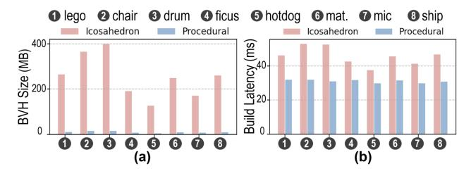

# GauTracer: Extending Ray Tracing Accelerator for Gaussian-based Scene Representation

Lizhou Wu, Kunchen Zou, Yuzheng Lin, Chixiao Chen, Xiaoyang Zeng, Haozhe Zhu∗ *State Key Laboratory of Integrated Chips and Systems (SKLICS), Fudan University, Shanghai 200433, China* ∗ E-mail: zhuhz@fudan.edu.cn

*Abstract*—Gaussian splatting has emerged as a promising paradigm in 3D vision, enabling instant scene reconstruction and photorealistic rendering. However, integrating rasterizationoriented Gaussian representations into ray tracing pipelines remains challenging. Existing ray tracing accelerators (RTAs) lack native support for Gaussian primitives, forcing reliance on software shader, which incurs significant instruction overhead, thread divergence, and excessive memory traffic. To address this, we present GauTracer, a ray tracing accelerator with efficient hardware support for Gaussian primitives. GauTracer elevates Gaussians to first-class primitives via lightweight microarchitectural extensions, including a dedicated Ray-Gauss Intersection Unit (RGIU). To improve versatility, the RGIU adopts a reconfigurable design supporting both 3D ellipsoidal and 2D planar Gaussian primitives with minimal overhead. In addition, a maxheap-based Any-Gauss-Hit Unit (AGHU) maintains a per-ray hit buffer for efficient volumetric blending of Gaussian primitives. To further optimize traversal performance, GauTracer employs a treelet-based BVH traversal scheme with a far-node pruning scheme, reducing unnecessary node visits beyond the buffer's capacity. Simulation results based on Vulkan-Sim show that GauTracer achieves average performance improvements of 5.8× for 3D Gaussians and 7.3× for 2D Gaussians over the baseline GPU-RTA. It also enhances energy efficiency by 6.6× and 7.5×, respectively.

### I. INTRODUCTION

Ray tracing [1] (RT) is a fundamental technique in modern 3D graphics, capable of modeling complex lighting effects such as global illumination, shadows, reflections, and refractions, which are often beyond the reach of rasterization. As a result, RT has been widely adopted in high-end graphics applications, including augmented and virtual reality (AR/VR) [2], [3] and computer-aided design (CAD) [4]. To sustain the heavy demand of RT, modern GPUs integrate dedicated Ray Tracing Accelerators (RTAs) [5]–[7], which operate in tandem with general-purpose shader cores to efficiently perform primitive traversal and intersection tests in complex 3D scenes.

Conventional RTAs primarily target mesh-based representations, which rely on explicit surface connectivity and UVmapped textures. Such representations exhibit a visual gap with respect to real-world appearance, manifesting as oversaturation and limited material fidelity. They are also inher-

∗ Haozhe Zhu is the corresponding author.

This work is supported in part by the National Natural Science Foundation of China (NSFC) under Grant No. 62488101 and 62304047, and in part by Fundamental and Interdisciplinary Disciplines Breakthrough Plan of the Ministry of Education (MoE) of China under Grant No. JYB2025XDXM120, and in part by supported by the State Key Laboratory of Integrated Chips and Systems (SKLICS) under Grant No. SKLICS-Z20502.

Fig. 1: Principle of ray tracing, e.g., global illumination is modeled through the spawning of secondary rays. While boxes and triangles are natively supported by ray tracing accelerators (RTAs), Gaussian primitives still lack efficient hardware support.

ently unsuitable for volumetric phenomena such as smoke or translucent media, where no explicit surfaces exist. These shortcomings have motivated the development of learningbased scene representations, such as Neural Radiance Fields (NeRF) [8]. NeRF leverages a multi-layer perceptron (MLP) to fit a scene and achieve photorealistic reconstruction, but its implicit nature incurs a high computational cost.

Recently, 3D Gaussian Splatting (3DGS) [9] has emerged as a promising paradigm for intelligent 3D reconstruction and rendering. 3DGS represents a scene as a set of anisotropic Gaussian ellipsoids [10], which are splatted and blended in screen space to produce high-fidelity images. Its explicit, point-based representation and trainable parameters enable high-fidelity scene modeling and fast rendering, making it suitable for a wide range of applications [11]–[13]. Beyond 3DGS, several Gaussian variants have emerged, among which 2DGS [14] stands out due to its view consistency and surface-aligned reconstruction. 2DGS has become a popular choice for geometry-sensitive tasks [15], [16], and recent approaches [17]–[20] explore hybrid 3D-2D Gaussian representations, combining the volumetric expressiveness of 3DGS with the geometric precision of 2DGS.

Although Gaussian Splatting has gained significant attention, Gaussian models have largely been developed within a tile-based rasterization pipeline, which inherently limits their support for ray-oriented rendering. This poses challenges for advanced graphics applications, particularly those involving distorted camera models [21], [22] or secondary light transport effects [23], [24]. Several efforts have been made to overcome these challenges. Lukas Radl et al. [25] introduced StopThe-Pop, a ray-wise sorting method that mitigates popping artifacts and improves view consistency for 3DGS. Q. Wu et al. [26] presented 3DGUT, which leverages sigma-point sampling to overcome the limitations of linear-approximated projection, aligning rasterization and ray tracing. N. Moenne-Loccoz et al. [27] proposed 3DGRT, which enables true ray tracing of 3D Gaussian primitives through the NVIDIA OptiX API, leveraging a mesh-agent-based intersection test and volumetric ray marching. C. Gu et al. [28] further proposed 2DGRT, which leverages the explicit intersection evaluation of 2D Gaussians to provide a fully differentiable framework for inverse rendering.

Despite algorithmic progress, the hardware efficiency of Gaussian ray tracing remains largely underexplored. This stands in sharp contrast to its rasterization counterpart, where extensive software-hardware co-optimization has already been investigated [29]–[38]. In conventional mesh-oriented RTA architectures, Gaussian primitives are treated as second-class citizens, with only limited hardware support. Consequently, execution relies heavily on software shaders, incurring substantial instruction overhead and memory traffic. As reported in [26], 3DGRT [27] achieves a rendering frame rate approximately 7× slower than the baseline 3DGS [9], despite substantial programming optimization.

To address these limitations, we propose GauTracer, a micro-architectural design that elevates Gaussian primitives to first-class citizens within RTAs, enabling efficient Gaussian ray tracing through dedicated hardware support. Our main contributions are summarized as follows:

- We implement Gaussian ray tracing with Vulkan API, integrating Gaussian primitives into the acceleration structure and programming model, and profile the inefficiencies of software-based solution using Vulkan-Sim.
- We promote Gaussian as built-in primitives in the RTA through lightweight modifications and a specialized Ray-Gauss Intersection Unit (RGIU). For generalization concerns, the RGIU is designed to be reconfigurable, supporting both 3D ellipsoidal and 2D elliptical Gaussians.
- We propose an Any-Gauss-Hit Unit (AGHU) that leverages a max heap to insert and sort the Gaussian hits by distance, efficiently supporting the volumetric blending of Gaussian primitives. Combined with the RGIU, Gau-Tracer eliminates the overhead of software shaders.
- We propose a far-node pruning scheme that further accelerates the treelet-optimized BVH traversal. By pruning nodes outside the current closest-hit range, it effectively reduces the number of visited nodes per trace.

The rest of this paper is organized as follows. Section II introduces the background of ray tracing and Gaussian splatting, and explains our motivations. Section III presents a detailed approach for implementing Gaussian ray tracing using Vulkan API, followed by profiling and analysis of the main bottlenecks based on Vulkan-Sim. Section IV elaborates on the design

Fig. 2: (a) Typical ray tracing pipeline. (b) Acceleration structure in Vulkan, consisting of a top-level structure (TLAS) for the scene and bottom-level structures (BLAS) for objects.

of our proposed Gaussian Tracing Accelerator, including modifications to the existing RTA architecture and dedicated intersection and any-hit units. The evaluation methodology and experimental results are reported in Section V and Section VI, respectively. Finally, Section VIII concludes this paper.

#### II. BACKGROUND

#### *A. Preliminary of Ray Tracing*

Principle: Ray tracing physically simulates the transport of light, as depicted in Fig. 1. A primary ray is cast from the camera through each pixel to determine visible surfaces, while secondary rays are recursively spawned to capture indirect lighting and global illumination effects. Unlike rasterization, which projects geometry directly onto the image plane, ray tracing performs geometric intersection tests in object space, enabling physically accurate effects such as soft shadows, reflections, and caustics. This unified formulation provides the foundation for photorealistic rendering.

Pipeline: Modern ray tracing pipelines, standardized by APIs such as Vulkan [39], NVIDIA OptiX [40], and DirectX Raytracing (DXR) [41], adopt a programmable framework where shader stages are explicitly defined and implemented in languages such as GLSL [42] and CUDA [43]. Fig. 2(a) illustrates the typical ray tracing pipeline specified in Vulkan. The *Ray Generation* shader is responsible for casting primary rays per pixel, initializing ray properties (e.g., origin and direction), and initiating the traversal of primitives in the scene. During traversal, the *Intersection* shader and the *Any-Hit* shader are invoked as needed when candidate primitives are visited, enabling custom intersection tests for non-builtin types and visibility checks. After traversal completes, either the *Closest-Hit* shader is executed to compute shading for the effective hit primitive, or the *Miss* shader is called to handle rays that intersect no geometry. Rays can recursively spawn additional rays from within shaders, triggering subsequent

Fig. 3: Microarchitecture of a ray tracing accelerator and its integration into the GPU.

tracing until the termination condition specified in the Ray Generation is satisfied.

**Acceleration Structure:** To enable high-performance ray tracing, large numbers of scene primitives are organized into an acceleration structure (AS), typically implemented as a bounding volume hierarchy (BVH). The AS reduces the number of intersection tests required during ray traversal by hierarchically culling non-relevant geometry. In Vulkan, the AS is defined in two levels, as illustrated in Fig. 2(b). There is a single top-level AS (TLAS) per scene, which constructs all the objects within it. Its internal nodes are hierarchical boxes, and each leaf node references an object instance, where its corresponding transformation matrix is stored. The bottomlevel AS (BLAS) is constructed for each unique object's geometry, with leaf nodes representing either triangle meshes or procedural primitives (e.g., sphere, cylinder). The procedural leaves are non-builtin and are handled by the general shader cores for intersection and response evaluation.

#### B. Ray Tracing Accelerator

Modern GPUs, such as NVIDIA RTX [5] and Imagination PowerVR Photon [3], integrate dedicated RTAs to accelerate ray tracing workloads. RTAs work in tandem with generalpurpose cores to perform two primary functions: (1) AS traversal, which efficiently walks through the BVH tree, and (2) Intersection tests for builtin geometries (i.e., box and triangle), efficiently handled by specialized fixed-function operation units. Fig. 3 illustrates a typical RTA architecture modeled in Vulkan-Sim [44], where one RTA is deployed per streaming multiprocessor (SM). Rays are grouped into warps aligned with the GPU"s general-purpose shader cores, and the RTA's control flow proceeds as follows: • When the SM scheduler issues a traceRay instruction, the corresponding ray metadata (e.g., origin and direction) is enqueued into the RTA's warp buffer. 2 Each cycle, the RTA's internal warp scheduler selects an active warp to process, fetching the top node from its traversal stack. 3 After the memory response, node data is decoded by an operation arbiter, which determines its type and forwards it, along with the associated ray data, to the appropriate operation unit. • The operation units handle fixed functions based on node type: ray transformation for instance nodes, ray-box intersection tests for internal nodes, and ray-triangle intersection tests for mesh leaf nodes. • The computed results (e.g., hit point and distance) are either written back to update ray state, or dispatched to the general-purpose cores for shading.

#### C. Prevailing Gaussian Primitive

**3DGS:** Kerbl et al. [9] propose representing scenes with 3D Gaussian ellipsoids, where each primitive follows Eq. 1 and is parameterized by its center  $\mu$ , 3D covariance matrix  $\Sigma$ , and an opacity term o indicating its weight.

$$G(x) = o \cdot \exp(-\frac{1}{2}(x - \mu)^T \Sigma^{-1}(x - \mu))$$
 (1)

The 3D covariance is factorized into a scaling matrix  $S \in \mathbb{R}^{3 \times 3}$  and a rotation matrix  $R \in SO(3)$  as expressed in Eq. 2. Both matrices are stored in their compact vector representations: a quaternion  $q \in \mathbb{R}^4$  for the rotation and a vector  $s \in \mathbb{R}^3$  for the scaling.

$$\Sigma = RSS^T R^T \tag{2}$$

To render an image, a 3D Gaussian is first transformed into camera coordinates using the world-to-camera transform, and then projected onto the image plane through a local affine transformation. By discarding the third row and column of the transformed 3D covariance matrix, a 2D Gaussian splat with its corresponding covariance is obtained. The final image is generated by performing volumetric alpha blending, integrating the alpha-weighted color of Gaussians from front to back along the ray, as described in Eq. 3). The parameters of the 3D Gaussian primitives are trained through a photometric loss to match the ground-truth images.

$$C = \sum_{i=1}^{N} T_i \alpha_i c_i, \ T_i = \prod_{i=1}^{i-1} (1 - \alpha_i)$$
 (3)

**2DGS:** 2D Gaussian [14] is derived from 3D Gaussian by setting the z-component of the scaling vector to zero, effectively degenerating the 3D ellipsoid into a planar ellipse. Unlike conventional approaches that approximate depth at the Gaussian centroid, 2DGS explicitly computes the precise intersection point (u,v) of the pixel (x,y) on the 2D ellipse, following Eq. 4. Specifically,  $h_u = [-1,0,0,x] \cdot P$  and  $h_v = [0,-1,0,y] \cdot P$ , where  $P \in \mathbb{R}^{4\times 4}$  denotes the transformation matrix from the elliptical space to the world space.

$$u = \frac{h_u^{[2]} h_v^{[4]} - h_u^{[4]} h_v^{[2]}}{h_u^{[1]} h_v^{[2]} - h_u^{[2]} h_v^{[1]}}, v = \frac{h_u^{[4]} h_v^{[1]} - h_u^{[1]} h_v^{[4]}}{h_u^{[1]} h_v^{[2]} - h_u^{[2]} h_v^{[1]}}$$
(4)

This formulation ensures view-consistent depth evaluation. Compared to 3D Gaussian models, the 2D Gaussian is inherently better suited for representing surface-aligned geometry, enabling reliable normal estimation. This, in turn, improves geometry-aware scene reconstruction.

Fig. 4: Gaussian primitive representations. Left: Polyhedronapproximate mesh agent [27]. Right: Procedural leaf.

Fig. 5: Comparison between Icosahedron-agent and procedural Gaussian. (a) Memory footprint of the BVH tree. (b) Latency of building the tree tested on RTX3090.

#### *D. Ray-oriented Gaussian Rendering*

Beyond splatting, Gaussian models have been extended to be ray-oriented, which currently follows two main directions. First is the visual alignment of tile-wise rasterization and ray-wise rendering. Traditional splatting relies on a Jacobianbased linear approximation and uses the centroid depth for intersection estimation. However, this introduces geometric inconsistencies and does not account for non-linear camera distortions. To address these issues, StopThePop [25] proposes a hierarchical tile-to-pixel depth sorting scheme that reduces popping artifacts and enhances view consistency. Moreover, 3DGUT [26] introduces the 3D Gaussian Unscented Transform, which evaluates the 2D splat through statistical sampling of sigma points, thereby capturing the underlying nonlinearity of the projection process. The second direction is incorporating Gaussian into ray tracing pipeline. 3DGRT [27] is the first framework to realize 3D Gaussian ray tracing on NVIDIA OptiX. It adopts a mesh-agent representation for fast intersection testing and a k-buffer scheme for volumetric ray marching. 2DGRT [28] further exploits the explicit intersection formulation of 2DGS to build a differentiable inverse rendering framework, enabling joint learning of scene geometry and lighting.

## *E. Challenges and Motivations*

Challenge 1 - Inefficient Software Shader: Shader invocations cause thread divergence and data exchange between the RTA and shader core. The intersection shader incurs high latency from redundant instructions, while the any-hit shader adds memory traffic for global buffer operations.

Motivation 1 - Specialized Hardware Shader: By treating Gaussian primitives as native leaf nodes and equipping dedicated intersection and any-hit units, ray-Gauss evaluation can be executed directly in RTA, eliminating shader invocation, general instruction and global memory access.

Challenge 2 - Divergence Between 3D/2D Gaussian: Both 3D Gaussian and 2D Gaussian are prevailing primitive candidates. However, supporting both of them with separate hardware pipelines incurs significant overhead, as their distinct intersection tests lead to duplicated units, increasing both area overhead and power consumption.

Motivation 2 - Reconfigurable Intersection Unit: By identifying shared computational patterns between 3DGS and 2DGS and reusing functional units via mode switching, the hardware overhead can be reduced, achieving efficient support for heterogeneous Gaussian primitives.

Challenge 3 - Inefficient BVH Traversal: In Gaussian ray tracing, some hit nodes are visited but eventually discarded due to buffer limitation or early termination. Such redundant traversal leads to excessive memory access and computation overhead, thereby increasing overall latency.

Motivation 3 - Pruning Redundant Visit: By maintaining the maximum hit distance as a geometric barrier, nodes farther than this bound can be safely pruned, reducing redundant traversal and improving overall pipeline efficiency.

## III. GAUSSIAN RAY TRACING IN VULKAN

This section presents our implementation of Gaussian ray tracing using the Vulkan API [44]. We describe the methodology for integrating Gaussian primitives into the BVH structure and outline the corresponding programming model, which faithfully follows the algorithmic workflow in [27], a widely adopted best practice in Gaussian ray tracing. Our implementation is introduced to enable fine-grained profiling of the baseline in Vulkan-Sim and to facilitate controlled evaluation of our architectural modifications in the Sec IV, rather than to propose algorithmic changes.

