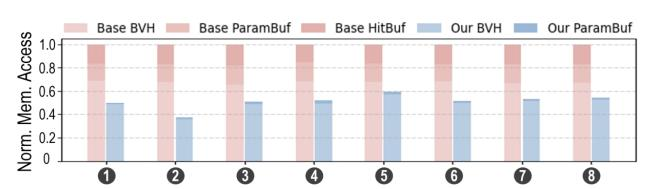
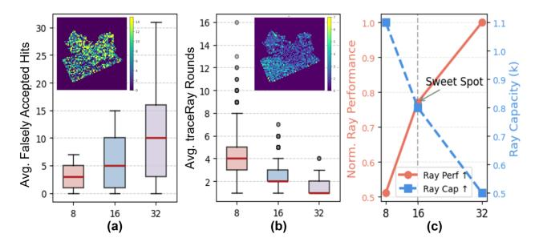
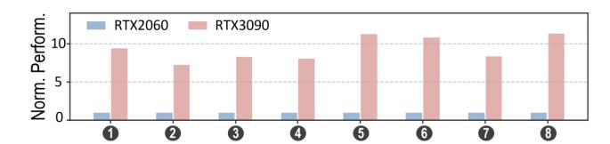

# VI. EXPERIMENTAL RESULT

## *A. Performance Gain by Hardware Shader*

We analyze the performance gains contributed by the proposed Ray-Gauss Intersection Unit (RGIU) and Any-Gauss-Hit Unit (AGHU) using an incremental evaluation approach, denoted as RGIU and RGIU+AGHU, respectively. Fig. 12 presents both the reduction in instruction count and the resulting performance improvement tested under 3DGRT mode. The results show that deploying the RGIU reduces the shader instructions by an average of 14.7×, primarily due to the elimination of costly Gaussian leaf evaluations through the built-in µ-operation. This reduction is further enhanced by an additional 38.9× with AGHU integration, as it avoids sort

Fig. 12: Gain by the hardware shader: instruction reduction and traceRay speedup.

insertions of hit Gaussians into the global buffer. The remaining instructions mainly belong to the ray-gen and closest-hit shaders, which handle the update of ray states and blending of hit Gaussians, rather than traversal of numerous BVH nodes. In terms of performance, the RGIU achieves a 2.3 ∼ 2.6× speedup to the baseline. Although the BVH traversal latency slightly increases due to the built-in intersection test, the overall runtime still improves substantially by eliminating the software intersection shader. The AGHU further raises the speedup ratio to 3.1 ∼ 3.3×. Since the RGIU's outputs are streamed directly to the AGHU, the heap operation latency is effectively overlapped with traversal, introducing negligible additional overhead.

#### *B. Performance Gain by Pruning*

Fig. 13 compares the effectiveness of the proposed farnode pruning (PRUNE) with the baseline BVH traversal. To further assess the influence of the closest-first policy (i.e., sort child nodes and prioritize traversal of the nearer one), we also include a third configuration, PRUNE+SORT. Results show that PRUNE reduces the number of visited nodes per ray by 1.2 ∼ 1.9×, yielding a 1.4 ∼ 3.0× reduction in traversal latency. These improvements arise from fewer node memory accesses and intersection evaluations. Performance variation across scenes is mainly attributed to viewing perspective and the initial BVH layout, which determine the baseline traversal cost. Since the pruning introduces negligible hardware overhead, its effectiveness is well justified. In contrast, enabling child sorting does not yield considerable benefits, and in some cases, even degrades performance. We attribute this to the highly interleaved bounding volumes of upperlevel nodes, where ambiguous spatial overlaps often lead to incorrect judgment on the nearer Gaussian sets, negating the intended advantage of the closest-first policy. To address this limitation, future work may investigate improved BVH construction for a higher-quality spatial distribution, or explore adaptive closest-first traversal strategies that consider local BVH dispersion, dynamically prioritizing nodes to effectively advance the closest hits.

#### *C. Analysis on Divergence and Memory Traffic*

Fig. 14 reports the warp divergence measured as active thread ratio per warp, together with the average Gaussian hit

Fig. 13: Gain by the far-node pruning: visited node reduction and traversal speedup.

count per ray. Across the evaluated scenes, the warp active ratio ranges from 27.5% to 40.1%, indicating scene-dependent divergence behavior. Scenes with compact geometry or volumetrically dense structures (e.g., hotdog, materials, and ship) exhibit higher hit counts and lower divergence. In such cases, our far-node pruning provides relatively smaller gains (Fig. 13) because traversal paths are already locally coherent. We note that the average hit count is also influenced by the number of non-miss rays, which depends on object scale and camera viewpoint. Together, these factors affect traversal coherence and warp divergence.

Fig. 15 compares the memory traffic between the baseline and GauTracer. GauTracer reduces overall memory traffic by 1.7× to 2.7×, primarily due to the significant reduction in BVH node accesses enabled by node pruning. Furthermore, the proposed hardware shader eliminates explicit global memory accesses during shading, as primitive geometry is embedded within BVH nodes and the Gauss Buffer is maintained in registers. The remaining memory accesses are associated with the parameter buffer, specifically the spherical harmonic (SH) coefficients of the hit Gaussian primitives. Although each Gaussian stores 48 SH coefficients under degree-3 configuration, their contribution to total memory traffic is minor compared to the substantial cost of BVH node traversal.

#### *D. Sensitivity Study on Hit Gauss Buffer Size*

We evaluate the impact of the Gauss Buffer size K, which determines how many hit Gaussians are temporarily recorded

Fig. 14: Warp divergence and average hit count per ray.

Fig. 15: Breakdown of GauTracer's memory traffic reduction.

Fig. 16: Sensitivity study on the hit buffer size. (a) Falsely accept hits. (b) traceRay invocation rounds. (c) Trade-off between per-ray performance and SIMT efficiency.

during traversal. Two sub-metrics are analyzed on the Lego scene, with pixel-wise values annotated on the corresponding statistical box plots for illustration.

- ❶ Falsely Accepted Hits refer to those Gaussians that are inserted into the buffer but contribute little, as the accumulated transmittance has already fallen below the termination threshold. As shown in Fig. 16(a), the number of falsely accepted hits grows nearly linearly with the buffer size and varies randomly across rays. This redundancy becomes significant when K reaches 32, undermining the effectiveness of far-node pruning as the barrier flag becomes harder to trigger.
- ❷ TraceRay Rounds denotes how many times traceRayEXT is invoked to complete a single ray rendering. As shown in Fig. 16(b), the trace round decreases as the buffer size increases, since more Gaussians can be blended per iteration. Nevertheless, the benefit diminishes when K exceeds 32, indicating limited additional gain from further enlargement.

It is noteworthy that a larger hit buffer occupies more registers per ray, thereby limiting the number of warps per SM core. Such reduced ray concurrency weakens the effectiveness of treelet prefetching and limits the ability to hide memory latency. As illustrated in Fig. 16(c), a buffer size of 16 achieves a balance between per-ray performance and SIMT efficiency, the latter benefiting from the adequate ray capacity.

#### *E. Rendering Quality*

Fig. 17(a) presents an example rendering output of Gau-Tracer with secondary ray effects, including refraction and reflection. Quantitative evaluation on rendering quality is attached, which compares GauTracer with the OptiX+Ico baseline under the 3DGRT setting. Across eight datasets, the base-

TABLE III: Latency and Area Comparison of Operation Units

| Components | Latency       | Area (µm2 ) |  |
|------------|---------------|----------------|--|
| RBIU       | 13 cycles     | 48630.3        |  |
| RTIU       | 37 cycles     | 74577.4        |  |
| TRAN       | 5 cycles      | 35942.1        |  |
| RGIU       | 27 cycles     | 34710.2        |  |
| AGHU+PRUNE | 2 ∼ 12 cycles | 825.6          |  |

Fig. 17: (a) An example output with secondary ray effects (refraction and reflection). (b) Comparison of rendering quality with original algorithm [27].

line achieves an average PSNR of 33.40 dB, while GauTracer attains 33.32 dB, indicating negligible quality degradation. The slight difference can be attributed to the AGIU accumulation strategy: all primitives stored in the Gauss Hit Buffer are accumulated, including those that would have been excluded by the original early-termination criterion. However, these additional contributions correspond to transmittance weights below 0.001 and therefore have an insignificant impact on the final radiance. Overall, despite architectural modifications, GauTracer preserves the original logical ray tracing semantics. The numerical precision, intersection formulation, and BVH coverage remain consistent with the baseline design, ensuring rendering fidelity.

#### *F. Performance, Energy Efficiency and Area Overhead*

The Ray-Gauss Intersection Unit (RGIU) follows a modular design, consistent with existing units such as the Ray-Box Intersection Unit (RBIU), Ray-Triangle Intersection Unit (RTIU), and Ray Transformation Unit (TRAN). To ensure a fair comparison, we evaluate the RGIU's area overhead against a baseline configuration consisting of one set of RBIU, RTIU, and TRAN. All modules are synthesized using a commercial 28 nm standard-cell library under identical timing constraints that match the requirements of the GPU core. As summarized in Table III, one RGIU incurs an area overhead of 21.8% relative to the baseline operational unit set. Further taking AGHU and pruning logic (PRUNE) into consideration, the incremental overhead is merely 0.7% since it is composed of a simple FSM and registers. Regarding the modification to the ray buffer, both the Hit Gauss Buffer and the traversal stack

Fig. 18: Comparison of performance and energy efficiency between baseline and GauTracer.

Fig. 19: Performance scaling from RTX2060 to RTX3090.

are implemented using per-thread registers, thus incurring no explicit hardware area overhead.

Fig. 18 compares the overall performance and energy efficiency of GauTracer against the baseline running 3DGRT/2DGRT. Under the 3DGRT case, across the eight evaluated scenes, GauTracer delivers a speedup of 4.1 ∼ 9.6×, averaging 5.8×, derived from the combined benefits of hardware-accelerated Gaussian processing and far-node pruning. Under the 2DGRT setting, GauTracer achieves an average speedup of 7.3×. The larger gain mainly stems from the hardware shader contribution of 5.6×, as 2DGRT involves more intersection invocations, while the gain from node pruning varies slightly across scenes due to BVH characteristics. Overall, the results demonstrate the effectiveness of the proposed architecture under its reconfigurable support for different Gaussian primitives without structural modification. Regarding energy efficiency, we employ a trace-driven power model [60] to estimate energy consumption. Results show that GauTracer achieves 6.6× and 7.5× improvements for 3DGRT and 2DGRT, respectively.

## *G. Scalability Discussion*

To evaluate GauTracer's scalability beyond the baseline NVIDIA RTX2060 configuration modeled in Vulkan-Sim, we scale the simulator parameters to approximate an RTX3090 class GPU [61]. In this setup, the number of SM/RT cores increases from 30 to 82, and the L1/L2 cache capacities are doubled. We then evaluate the performance of GauTracer under these configurations. Fig. 19 shows that the scaled configuration achieves a 7.2 ∼ 11.3× speedup over the RTX2060 baseline. Notably, the modifications brought with GauTracer are confined within the RT core, with the throughput of the RGIU/AGHU aligned to the existing RTIU pipeline. By treating Gaussians as built-in primitives, the proposed design follows scaling trends similar to conventional ray tracing workloads on modern GPUs.

## VII. RELATED WORK

#### *A. Hardware for Non-mesh Primitives*

While modern RT cores are primarily optimized for triangle meshes and BVH traversal, there has been sustained interest in extending hardware support to non-mesh primitives, including curves, swept volumes, and neural representation.

NVIDIA has introduced Micro-Mesh [62] to mitigate BVH expansion from displacement-heavy geometry by encoding micro-geometry compactly and resolving it within the RT core. Subsequent RTX architectures also provide native support for linear swept spheres (LSS) [63], enabling efficient curve

and hair intersection without dense triangle proxies. More recently, RTX Neural Shaders [64] leverage Tensor Cores to accelerate small trainable neural networks inline with the shader pipeline [65], broadening the class of rendering tasks that benefit from hardware acceleration.

Other GPU vendors and APIs also provide more generalized intersection mechanisms. AMD's HIP RT on RDNA2/3 exposes BVH traversal and hit routines for custom intersection functions [66], while Intel's programmable ray tracing architectures support user-defined intersection shaders during hardware traversal [67]. Together, these programmable stages reflect a broader trend of extending hardware-accelerated traversal beyond traditional triangles.

#### *B. Order-independent Rendering Techniques*

Order-independent transparency (OIT) was introduced in rasterization to eliminate dependence on primitive order during alpha compositing. Exact methods such as A-buffer [68] and per-pixel linked lists [69] collect all fragments per pixel and locally resolve visibility, incurring substantial memory overhead. Approximate approaches like weighted blended OIT [70] remove explicit sorting by estimating blending weights, but sacrifice compositing accuracy. For Gaussian Splatting, Local-GS [71] proposes an approach that replaces depth-sorted alpha compositing with a polynomial blending weight approximation. Duplex-GS further alleviates the transparency artifact by introducing proxy cells [72].

However, OIT is fundamentally incompatible with ray tracing. In ray tracing, the exact hit distance and intersection order determine where secondary rays are spawned, which is essential for physically correct light transport [73]. Therefore, enforcing order independence in ray tracing inevitably sacrifices geometric accuracy and rendering fidelity.

#### VIII. CONCLUSION

We presented GauTracer, a ray tracing accelerator that introduces native hardware support for Gaussian primitives, boosting the performance of Gaussian ray tracing. The proposed Ray-Gauss Intersection Unit (RGIU) enables efficient intersection computation for both 3D ellipsoidal and 2D planar Gaussians, while the Any-Gauss-Hit Unit (AGHU) employs a max-heap structure to support high-throughput volumetric blending. In addition, a treelet-based BVH traversal enhanced with far-node pruning reduces memory latency and redundant traversal. Through simulation on Vulkan-Sim using representative NeRF-Synthetic scenes, GauTracer achieves significant performance and energy-efficiency gains over conventional RTAs, demonstrating the benefits of hardware-level optimizations for Gaussian ray tracing workloads.

## REFERENCES

- [1] T. Whitted, "An improved illumination model for shaded display," in *ACM Siggraph 2005 Courses*, 2005, pp. 4–es.
- [2] A. L. Dos Santos, D. Lemos, J. E. F. Lindoso, and V. Teichrieb, "Real time ray tracing for augmented reality," in *2012 14th Symposium on Virtual and Augmented Reality*. IEEE, 2012, pp. 131–140.

- [3] Imagination Technologies. (2022) Introducing the rac: The ray acceleration cluster. [Online]. Available: https://www.imaginationtech. com/products/gpu/graphics-architecture/powervr-photon/
- [4] I. Wald, A. Dietrich, C. Benthin, A. Efremov, T. Dahmen, J. Gunther, V. Havran, H.-P. Seidel, and P. Slusallek, "Applying ray tracing for virtual reality and industrial design," in *2006 IEEE symposium on interactive ray tracing*. IEEE, 2006, pp. 177–185.
- [5] Nvidia Corporation. (2018) Nvidia turing gpu architecture. [Online]. Available: https://images.nvidia.com/aem-dam/en-zz/Solutions/designvisualization/technologies/turing-architecture/NVIDIA-Turing-Architecture-Whitepaper.pdf
- [6] Advanced Micro Devices Inc. (2022) Amd rdna architecture. [Online]. Available: https://www.amd.com/en/technologies/rdna
- [7] Intel Corporation. (2022) Introduction to the xe-hpg architecture. [Online]. Available: https://www.intel.com/content/www/us/en/developer/ articles/technical/introduction-to-the-xe-hpg-architecture.html
- [8] B. Mildenhall, P. P. Srinivasan, M. Tancik, J. T. Barron, R. Ramamoorthi, and R. Ng, "Nerf: Representing scenes as neural radiance fields for view synthesis," *Communications of the ACM*, vol. 65, no. 1, pp. 99–106, 2021.
- [9] B. Kerbl, G. Kopanas, T. Leimkuhler, and G. Drettakis, "3d gaussian ¨ splatting for real-time radiance field rendering." *ACM Trans. Graph.*, vol. 42, no. 4, pp. 139–1, 2023.
- [10] M. Zwicker, H. Pfister, J. Van Baar, and M. Gross, "Ewa splatting," *IEEE Transactions on Visualization and Computer Graphics*, vol. 8, no. 3, pp. 223–238, 2002.
- [11] Z. Chen, J. Yang, J. Huang, R. de Lutio, J. M. Esturo, B. Ivanovic, O. Litany, Z. Gojcic, S. Fidler, M. Pavone *et al.*, "Omnire: Omni urban scene reconstruction," *arXiv preprint arXiv:2408.16760*, 2024.
- [12] R. Li, W. Ke, D. Li, L. Tian, and E. Barsoum, "Monogs++: Fast and accurate monocular rgb gaussian slam," *arXiv preprint arXiv:2504.02437*, 2025.
- [13] M. Kocabas, J.-H. R. Chang, J. Gabriel, O. Tuzel, and A. Ranjan, "Hugs: Human gaussian splats," in *Proceedings of the IEEE/CVF conference on computer vision and pattern recognition*, 2024, pp. 505–515.
- [14] B. Huang, Z. Yu, A. Chen, A. Geiger, and S. Gao, "2d gaussian splatting for geometrically accurate radiance fields," in *ACM SIGGRAPH 2024 conference papers*, 2024, pp. 1–11.
- [15] Y. Zhang, A. Chen, Y. Wan, Z. Song, J. Yu, Y. Luo, and W. Yang, "Refgs: Directional factorization for 2d gaussian splatting," in *Proceedings of the Computer Vision and Pattern Recognition Conference*, 2025, pp. 26 483–26 492.
- [16] D. Chen, L. Chen, Z. Zhang, and L. Zhang, "Generalized and efficient 2d gaussian splatting for arbitrary-scale super-resolution," *arXiv preprint arXiv:2501.06838*, 2025.
- [17] J. Lin, J. Gu, L. Fan, B. Wu, Y. Lou, R. Chen, L. Liu, and J. Ye, "Hybridgs: Decoupling transients and statics with 2d and 3d gaussian splatting," in *Proceedings of the Computer Vision and Pattern Recognition Conference*, 2025, pp. 788–797.
- [18] M. Taktasheva, L. Goli, A. Fiorini, D. Rebain, A. Tagliasacchi *et al.*, "3d gaussian flats: Hybrid 2d/3d photometric scene reconstruction," *arXiv preprint arXiv:2509.16423*, 2025.
- [19] J. Park, J.-W. Suh, and Y. Ban, "Dual-dimensional gaussian splatting integrating 2d and 3d gaussians for surface reconstruction," *Applied Sciences*, vol. 15, no. 12, p. 6769, 2025.
- [20] K. Wu, K. Zhang, Z. Zhang, M. Tie, S. Yuan, J. Zhao, Z. Gan, and W. Ding, "Hgs-mapping: Online dense mapping using hybrid gaussian representation in urban scenes," *IEEE Robotics and Automation Letters*, 2024.
- [21] Z. Liao, S. Chen, R. Fu, Y. Wang, Z. Su, H. Luo, L. Ma, L. Xu, B. Dai, H. Li *et al.*, "Fisheye-gs: Lightweight and extensible gaussian splatting module for fisheye cameras," *arXiv preprint arXiv:2409.04751*, 2024.
- [22] S. Lee, J. Chung, J. Huh, and K. M. Lee, "Odgs: 3d scene reconstruction from omnidirectional images with 3d gaussian splattings," *Advances in Neural Information Processing Systems*, vol. 37, pp. 57 050–57 075, 2024.
- [23] Z. J. Tang and T.-J. Cham, "3igs: Factorised tensorial illumination for 3d gaussian splatting," in *European Conference on Computer Vision*. Springer, 2024, pp. 143–159.
- [24] Z. Cui, X. Chu, and T. Harada, "Luminance-gs: Adapting 3d gaussian splatting to challenging lighting conditions with view-adaptive curve adjustment," in *Proceedings of the Computer Vision and Pattern Recognition Conference*, 2025, pp. 26 472–26 482.

- [25] L. Radl, M. Steiner, M. Parger, A. Weinrauch, B. Kerbl, and M. Steinberger, "Stopthepop: Sorted gaussian splatting for view-consistent realtime rendering," *ACM Transactions on Graphics (TOG)*, vol. 43, no. 4, pp. 1–17, 2024.
- [26] Q. Wu, J. M. Esturo, A. Mirzaei, N. Moenne-Loccoz, and Z. Gojcic, "3dgut: Enabling distorted cameras and secondary rays in gaussian splatting," in *Proceedings of the Computer Vision and Pattern Recognition Conference*, 2025, pp. 26 036–26 046.
- [27] N. Moenne-Loccoz, A. Mirzaei, O. Perel, R. de Lutio, J. Martinez Esturo, G. State, S. Fidler, N. Sharp, and Z. Gojcic, "3d gaussian ray tracing: Fast tracing of particle scenes," *ACM Transactions on Graphics (TOG)*, vol. 43, no. 6, pp. 1–19, 2024.
- [28] C. Gu, X. Wei, Z. Zeng, Y. Yao, and L. Zhang, "Irgs: Inter-reflective gaussian splatting with 2d gaussian ray tracing," in *Proceedings of the Computer Vision and Pattern Recognition Conference*, 2025, pp. 10 943– 10 952.
- [29] J. Lee, S. Lee, J. Lee, J. Park, and J. Sim, "Gscore: Efficient radiance field rendering via architectural support for 3d gaussian splatting," in *Proceedings of the 29th ACM International Conference on Architectural Support for Programming Languages and Operating Systems, Volume 3*, 2024, pp. 497–511.
- [30] Z. Ye, Y. Fu, J. Zhang, L. Li, Y. Zhang, S. Li, C. Wan, C. Wan, C. Li, S. Prathipati, and Y. C. Lin, "Gaussian blending unit: An edge gpu plug-in for real-time gaussian-based rendering in ar/vr," in *2025 IEEE International Symposium on High Performance Computer Architecture (HPCA)*, 2025, pp. 353–365.
- [31] C. Zhang, Y. Feng, J. Zhao, G. Liu, W. Ding, C. Wu, and M. Guo, "Streaminggs: Voxel-based streaming 3d gaussian splatting with memory optimization and architectural support," *arXiv preprint arXiv:2506.09070*, 2025.
- [32] L. Wei, J. Tang, F. Fei, B. Shi, R. Wang, and M. Li, "No redundancy, no stall: Lightweight streaming 3d gaussian splatting for real-time rendering," *arXiv preprint arXiv:2507.21572*, 2025.
- [33] M. Pei, G. Li, J. Si, Z. Zhu, Z. Mo, P. Wang, Z. Song, X. Liang, and J. Cheng, "Gcc: A 3dgs inference architecture with gaussian-wise and cross-stage conditional processing," in *Proceedings of the 58th IEEE/ACM International Symposium on Microarchitecture®*, 2025, pp. 1824–1837.
- [34] Y. Sun, Q. Zhi, Y. Jing, L. Ye, R. Huang, and T. Jia, "Local-gs: An order-independent gaussian splatting training accelerator exploiting splat locality," in *2025 62nd ACM/IEEE Design Automation Conference (DAC)*. IEEE, 2025, pp. 1–7.
- [35] H. He, G. Li, F. Liu, L. Jiang, X. Liang, and Z. Song, "Gsarch: Breaking memory barriers in 3d gaussian splatting training via architectural support," in *2025 IEEE International Symposium on High Performance Computer Architecture (HPCA)*. IEEE, 2025, pp. 366–379.
- [36] L. Wu, H. Zhu, S. He, J. Zheng, C. Chen, and X. Zeng, "Gauspu: 3d gaussian splatting processor for real-time slam systems," in *2024 57th IEEE/ACM International Symposium on Microarchitecture (MICRO)*. IEEE, 2024, pp. 1562–1573.
- [37] L. Li, J. Qin, J. Peng, Z. Wan, H. Qu, Y. Han, P. Zheng, H. Zhang, Y. Cao, T. Chen *et al.*, "Rtgs: Real-time 3d gaussian splatting slam via multi-level redundancy reduction," in *Proceedings of the 58th IEEE/ACM International Symposium on Microarchitecture®*, 2025, pp. 1838–1851.
- [38] Y. Feng, W. Lin, Y. Cheng, Z. Liu, J. Leng, M. Guo, C. Chen, S. Sun, and Y. Zhu, "Lumina: Real-time neural rendering by exploiting computational redundancy," in *Proceedings of the 52nd Annual International Symposium on Computer Architecture*, 2025, pp. 1925–1939.
- [39] K. Group, *Vulkan Ray Tracing*, 2020. [Online]. Available: https: //www.khronos.org/assets/uploads/apis/Vulkan-Ray-Tracing-Nov20.pdf
- [40] N. Corporation, *NVIDIA OptiX 8.1 Programming Guide*, 2024. [Online]. Available: https://raytracing-docs.nvidia.com/optix8/guide/index.html
- [41] M. Corporation, *DirectX 12 Ray Tracing Functional Spec*, 2020. [Online]. Available: https://microsoft.github.io/DirectX-Specs/ d3d/Raytracing.html
- [42] Khronos Group. (2023) Opengl shading language specification, version 4.60. [Online]. Available: https://registry.khronos.org/OpenGL/specs/gl/ GLSLangSpec.4.60.html
- [43] NVIDIA Corporation. (2025) Cuda toolkit documentation. [Online]. Available: https://docs.nvidia.com/cuda/
- [44] M. Saed, Y. H. Chou, L. Liu, T. Nowicki, and T. M. Aamodt, "Vulkansim: A gpu architecture simulator for ray tracing," in *2022 55th*

- *IEEE/ACM International Symposium on Microarchitecture (MICRO)*. IEEE, 2022, pp. 263–281.
- [45] M. Pharr, C. Kolb, R. Gershbein, and P. Hanrahan, "Rendering complex scenes with memory-coherent ray tracing," in *Proceedings of the 24th annual conference on Computer graphics and interactive techniques*, 1997, pp. 101–108.
- [46] D. Kopta, K. Shkurko, J. Spjut, E. Brunvand, and A. Davis, "Memory considerations for low energy ray tracing," in *Computer Graphics Forum*, vol. 34, no. 1. Wiley Online Library, 2015, pp. 47–59.
- [47] Y. H. Chou, T. Nowicki, and T. M. Aamodt, "Treelet prefetching for ray tracing," in *Proceedings of the 56th Annual IEEE/ACM International Symposium on Microarchitecture*, 2023, pp. 742–755.
- [48] Y. H. Chou and T. M. Aamodt, "Treelet accelerated ray tracing on gpus," in *Proceedings of the 30th ACM International Conference on Architectural Support for Programming Languages and Operating Systems, Volume 2*, 2025, pp. 1334–1347.
- [49] X. Li, J. Jiang, Y. Feng, Y. Gan, J. Zhao, Z. Liu, J. Leng, and M. Guo, "Sltarch: Towards scalable point-based neural rendering by taming workload imbalance and memory irregularity," *arXiv preprint arXiv:2507.21499*, 2025.
- [50] D. R. Horn, J. Sugerman, M. Houston, and P. Hanrahan, "Interactive kd tree gpu raytracing," in *Proceedings of the 2007 symposium on Interactive 3D graphics and games*, 2007, pp. 167–174.
- [51] H.-Y. Kim, Y.-J. Kim, and L.-S. Kim, "Mrtp: Mobile ray tracing processor with reconfigurable stream multi-processors for high datapath utilization," *IEEE Journal of Solid-State Circuits*, vol. 47, no. 2, pp. 518–535, 2011.
- [52] H. Kim, A. Wang, S. Zhang, and S. Shao, "Cost of divergence in ray tracing: Performance characterization on cpu and gpu," in *Int'l Workshop on Domain Specific System Architecture (In conjunction with Int'l Symp. on Computer Architecture (ISCA))*, 2023.
- [53] Y. S. Tozlu and H. Zhou, "Cooprt: Accelerating bvh traversal for ray tracing via cooperative threads," in *Proceedings of the 52nd Annual International Symposium on Computer Architecture*, 2025, pp. 166–179.
- [54] M. Saed, P. J. Nair, and T. M. Aamodt, "Rayn: Ray tracing acceleration with near-memory computing," in *Proceedings of the 58th IEEE/ACM International Symposium on Microarchitecture®*, 2025, pp. 277–291.
- [55] D. Ha, L. Liu, Y. H. Chou, S. Go, W. W. Ro, H.-W. Tseng, and T. M. Aamodt, "Generalizing ray tracing accelerators for tree traversals on gpus," in *2024 57th IEEE/ACM International Symposium on Microarchitecture (MICRO)*. IEEE, 2024, pp. 1041–1057.
- [56] Y. Feng, Y. Li, J. Lee, W. W. Ro, and H. Jeon, "Heliostat: Harnessing ray tracing accelerators for page table walks," in *Proceedings of the 52nd Annual International Symposium on Computer Architecture*, 2025, pp. 122–136.
- [57] NVIDIA Corporation. (2019) Rtx 2060. [Online]. Available: https: //www.techpowerup.com/gpu-specs/geforce-rtx-2060.c3310/
- [58] Agner Fog. (2022) Instruction tables: Lists of instruction latencies, throughputs and micro-operation breakdowns for intel, amd, and via cpus. [Online]. Available: https://www.agner.org/optimize/instruction tables.pdf
- [59] I. Wald, S. Woop, C. Benthin, G. S. Johnson, and M. Ernst, "Embree: a kernel framework for efficient cpu ray tracing," *ACM Transactions on Graphics (TOG)*, vol. 33, no. 4, pp. 1–8, 2014.
- [60] V. Kandiah, S. Peverelle, M. Khairy, J. Pan, A. Manjunath, T. G. Rogers, T. M. Aamodt, and N. Hardavellas, "Accelwattch: A power modeling framework for modern gpus," in *MICRO-54: 54th Annual IEEE/ACM International symposium on microarchitecture*, 2021, pp. 738–753.
- [61] NVIDIA Corporation. (2020) Rtx 3090. [Online]. Available: https: //www.techpowerup.com/gpu-specs/geforce-rtx-3090.c3622
- [62] NVIDIA Corporation, "Nvidia rtx micro-mesh," https://developer.nvidia. com/rtx/ray-tracing/micro-mesh, accessed: 2026-03-01.
- [63] NVIDIA Corporation, "Rtx linear swept spheres (lss) for hair rendering," https://developer.nvidia.com/blog/render-path-traced-hair-in-realtime-with-nvidia-geforce-rtx-50-series-gpus/, accessed: 2026-03-01.
- [64] NVIDIA Corporation, "How to get started with neural shading for your game or application," https://developer.nvidia.com/blog/nvidiartx-neural-rendering-introduces-next-era-of-ai-powered-graphicsinnovation/, accessed: 2026-03-01.
- [65] T. Zeltner\*, F. Rousselle\*, A. Weidlich\*, P. Clarberg\*, J. Novak\*, ´ B. Bitterli\*, A. Evans, T. Davidovic, S. Kallweit, and A. Lefohn, ˇ "Real-time neural appearance models," *ACM Transactions on Graphics*, vol. 43, no. 3, pp. 1–17, 2024.

- [66] AMD GPUOpen, "Introducing hip rt for gpu ray tracing," https:// gpuopen.com/learn/introducing-hiprt/, accessed: 2026-03-01.
- [67] Intel Corporation, "Programmable custom primitives in ray tracing hardware," https://freepatentsonline.com/y2025/0111579.html, accessed: 2026-03-01.
- [68] L. Carpenter, "The a-buffer, an antialiased hidden surface method," in *Proceedings of the 11th annual conference on Computer graphics and interactive techniques*, 1984, pp. 103–108.
- [69] J. C. Yang, J. Hensley, H. Grun, and N. Thibieroz, "Real-time concurrent ¨ linked list construction on the gpu," in *Computer Graphics Forum*, vol. 29, no. 4. Wiley Online Library, 2010, pp. 1297–1304.
- [70] M. McGuire and L. Bavoil, "Weighted blended order-independent transparency," *Journal of Computer Graphics Techniques*, vol. 2, no. 4, 2013.
- [71] Y. Sun, Q. Zhi, Y. Jing, L. Ye, R. Huang, and T. Jia, "Local-gs: An order-independent gaussian splatting training accelerator exploiting splat locality," in *2025 62nd ACM/IEEE Design Automation Conference (DAC)*. IEEE, 2025, pp. 1–7.
- [72] W. Liu, Y. Li, Y. Li, J. Yu, and X. Lou, "Duplex-gs: Proxy-guided weighted blending for real-time order-independent gaussian splatting," *IEEE Transactions on Circuits and Systems for Video Technology*, 2026.
- [73] M. Pharr, W. Jakob, and G. Humphreys, *Physically Based Rendering: From Theory to Implementation*, 4th ed. MIT Press, 2023.