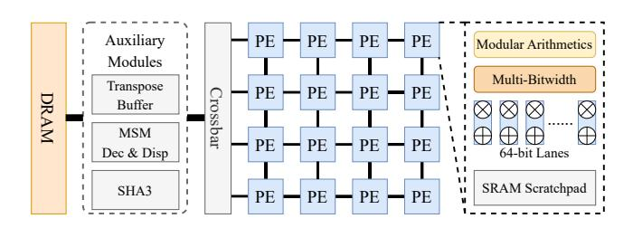
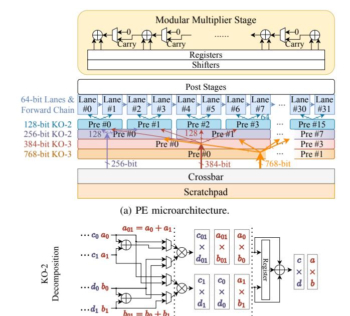
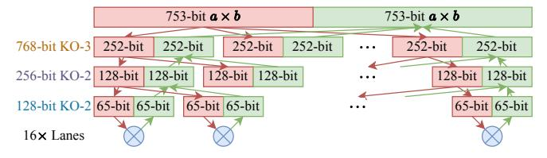
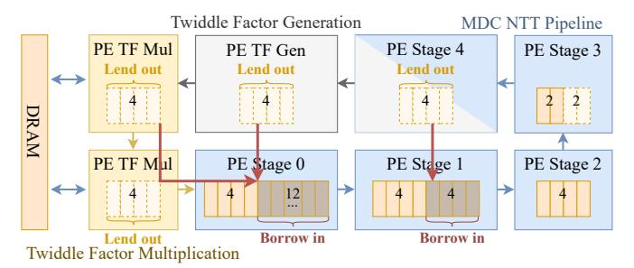
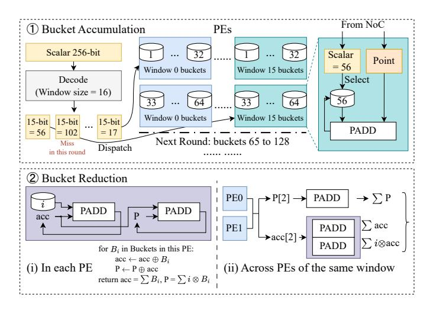
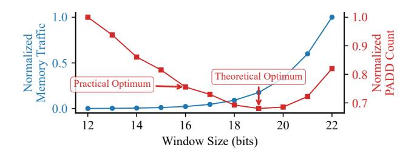

# *A. Related Work*

ASICs using kernel-specialized functional units. Several previous ASIC designs accelerated the aforementioned ZKP kernels. PipeZK [\[87\]](#page-14-7) built fixed-function, deeply-pipelined units for NTTs and MSMs in Groth16. It offloaded other computations to the host CPU, thus lacking an end-to-end solution. Also its fixed-function units could not support various EC bitwidths. SZKP [\[19\]](#page-13-10) presented an end-to-end Groth16 prover, incorporating structured modules for NTTs and MSMs, with special optimizations leveraging the sparsity in the MSM. zkSpeed [\[18\]](#page-13-9) implemented a complete HyperPlonk prover, featuring specialized units for sumcheck, MSM, and other kernels. NoCap [\[67\]](#page-14-4) instead targeted hash-centric SNARKs, i.e., Spartan and Orion, with the 64-bit Goldilocks field. It used vector-style units and other specialized functional units to accelerate the entire proof generation on a single chip.

ASICs using unified architectures. More recently, efforts have been shifting towards reusing a unified architecture across different computations to improve hardware utilization. LegoZK [\[85\]](#page-14-6) composed finite-field arithmetic units via hierarchical on-chip interconnects to form reconfigurable pipelines, accelerating witness generation, NTT, and MSM kernels. It used simple bit splitting to support multiple bitwidths. UniZK [\[80\]](#page-14-5) targeted Plonky2. It proposed a unified systolic array enhanced with additional links and a vector mode, along with novel mapping strategies for NTTs, hash functions, and general polynomial operators. ReZK [\[89\]](#page-14-8) and Chen et al. [\[14\]](#page-13-8) proposed reconfigurable multiplier designs adaptable between 256-bit and 384-bit EC bitwidths, which could be configured to execute either NTTs or MSMs in Groth16.

Other acceleration methods. A large body of work also explored accelerating end-to-end proof generation or specific kernels using CPUs and clusters [\[22\]](#page-13-26), [\[82\]](#page-14-21), GPUs [\[34\]](#page-13-27), [\[35\]](#page-13-28), [\[42\]](#page-13-29), [\[45\]](#page-13-30), [\[46\]](#page-13-31), [\[51\]](#page-14-22), [\[88\]](#page-14-23), and FPGAs [\[2\]](#page-12-0), [\[3\]](#page-13-32), [\[48\]](#page-13-33), [\[59\]](#page-14-24), [\[62\]](#page-14-25), [\[72\]](#page-14-26), [\[79\]](#page-14-27), [\[83\]](#page-14-28). While these platforms offer flexibility, they often lag behind ASICs in performance and energy efficiency. CGRAs [\[5\]](#page-13-34), [\[37\]](#page-13-35), [\[50\]](#page-14-29) target general-purpose workloads with word-level (typically 32-bit) functional units and either static or dynamic scheduling that maps arbitrary dataflow graphs at the instruction level. While our work follows a similar highlevel approach that maps diverse ZKP kernels to a unified hardware, we seek a domain-specific solution, with specially designed wide modular multiplier units, and novel mapping strategies specialized at the kernel level.

## *B. Design Goals and Prior Work Limitations*

As introduced in [Section II,](#page-1-1) modern ZKPs are still rapidly developing, with multiple protocols used by different applications in practice. To effectively adapt to the various computations involved in these protocols, an ideal ZKP accelerator should meet the following design goals.

- 1) Efficient support for multiple bitwidths and field arithmetics. The underlying functional units should be able to conduct 64-bit arithmetics as well as wide-integer operations of 256/384/768 bits. The modular operations should support both special moduli like Goldilocks and general moduli in ECs.
- 2) Efficient support for diverse computational kernels. The accelerator should be able to execute all the dom-

- inant kernels listed in [Table II,](#page-2-1) i.e., NTT, MSM, sumcheck, Merkle tree, polynomial operations, and hashing.
- 3) High utilization of on-chip hardware resources. The accelerator should follow a unified design that is reconfigurable across diverse bitwidths and kernels with high utilization, rather than directly combining separate, kernel/bitwidth-specialized functional units.

While the first two goals are intuitive based on our observations in [Section II-B,](#page-2-2) the last one needs a bit elaboration. A straightforward way to support diverse kernels is to design separate functional units specialized to each kernel type, and put them together on the same accelerator chip. This is the approach used in early ZKP accelerators, including PipeZK [\[87\]](#page-14-7), SZKP [\[19\]](#page-13-10), and zkSpeed [\[18\]](#page-13-9). However, many of these kernelspecialized functional units, e.g., an MSM unit or a sumcheck unit, are quite complex and may occupy a substantial fraction of the chip area [\[18\]](#page-13-9), [\[87\]](#page-14-7). They would sit idle whenever the currently running protocol does not involve this kernel, wasting significant silicon resources (not satisfying Goal [3\)](#page-3-0). For example, an MSM unit is idle when running Plonky2, and a sumcheck unit is idle when running Groth16. Even within a single protocol (e.g., Groth16), one kernel's input usually depends on the output of others (e.g., an MSM depends on an NTT), causing idle waiting. Recent unified architectures, such as LegoZK [\[85\]](#page-14-6) and UniZK [\[80\]](#page-14-5), improve the hardware utilization with resuable units. But they mainly focus on *intra*protocol reuse and are limited to a single protocol (Groth16 for LegoZK, Plonky2 for UniZK), lacking support for other critical kernels *across* different kernels (not satisfying Goal [2\)](#page-3-1).

For the field bitwidth requirement, most prior designs only support a single bitwidth, usually the largest one (e.g., 768 bits), and then pad all data to this width, causing wastes (not satisfying Goal [1\)](#page-3-2). LegoZK [\[85\]](#page-14-6) also provisions the maximum 768-bit arithmetics, but additionally allows splitting it into two 384-bit or three 256-bit multipliers. This reduces resource wastes, but we show the utilization can be further improved with better bit decomposition methods. Both Chen et al. [\[14\]](#page-13-8) and ReZK [\[89\]](#page-14-8) only support two bitwidths of 256-bit and 384-bit. Chen et al. [\[14\]](#page-13-8) uses the simple padding approach discussed above. ReZK [\[89\]](#page-14-8) leverages the Karatsuba-Ofman (KO) algorithm [\[36\]](#page-13-11), and focuses on a single-level spatial decomposition of KO-2 or KO-3 (i.e., 256/384-bit to 128-bit). However, this design is not scalable to wider bitwidth ranges (e.g., 64 bits to 768 bits), which would require both spatial and temporal mappings as we show in our design.

## IV. GENZA OVERVIEW

To meet the three goals in [Section III-B,](#page-3-3) we propose GenZA, a general and efficient accelerator for diverse ZKP protocols. The key design philosophy of GenZA inherits from previous designs [\[80\]](#page-14-5), [\[85\]](#page-14-6), *using a unified and reconfigurable hardware architecture with novel and flexible kernel mapping strategies*, to achieve high utilization and efficiency (Goal [3\)](#page-3-0). GenZA further improves upon prior unified ZKP accelerators with *more efficient support for various bitwidths and field*

Fig. 1. Overview of GenZA's hardware architecture, including  $16 \times 8$  PEs and several auxiliary modules like a transpose buffer, etc.

arithmetics (Goal 1), and with newly proposed, better mappings for additional computational kernels (Goal 2).

Hardware. As Figure 1 shows, GenZA adopts a 2D array of homogeneous processing elements (PEs), by default 16×8. Crucially, each PE is not a fixed-function block specialized to a kernel, but a flexible and reconfigurable unit. It supports *multibitwidth arithmetics*, e.g., 64-, 256-, 384-, 768-bit, through efficient Karatsuba-Ofman decomposition [36] and novel *hybrid spatial-temporal mapping*. It also supports customized modular reduction *for both general and special field moduli*. We introduce the detailed PE microarchitecture in Section V. As previous work pointed out [80], [85], in modern ZKP protocols, the underlying basic operations are modular arithmetics on algebraic fields, and the data structures are usually polynomial groups which are essentially vectors/tensors. These characteristics fit perfectly with the above spatial architecture.

The PEs are connected by a 2D mesh network-on-chip (NoC), with  $32 \times 64$ -bit links at 2 GHz. Data are sent between PEs and to/from memory in lightweight packets, routed across the NoC following the statically determined mappings (see below), similarly to prior spatial accelerators [11], [26], [73]. Instead of a global shared buffer, each PE in GenZA contains a local 128 kB SRAM scratchpad to exploit data locality.

In addition, we instantiate several globally shared, auxiliary modules adjacent to the DRAM interface, for special data processing and control tasks not covered by the PEs. First, an SRAM-based, highly banked *data transpose buffer* reorganizes data streams between the DRAM and the PE array [65], [80], [87]. Second, an *MSM decoder & dispatcher* decodes the fetched MSM data from off-chip memory and sends them to the appropriate PEs (Section VI-B). Third, a special SHA3 core supports the Fiat-Shamir transform required by Hyper-Plonk1, which only takes < 1% time. The last two modules either have simple logic or are not performance critical, and thus may be replaced by a small general core like RISC-V.

**Software.** The core innovations of GenZA lie in the kernel mapping strategies, which orchestrate how the kernels execute on the PE array. We leverage the deterministic behaviors of ZKP protocols to implement a static scheduler for kernel mappings. The process contains two stages. First, the ZKP protocols are translated into computational graphs by referencing their original implementations [21], [58], [69]. This

is now done manually, but can also be easily handled by modifying a standard ZKP compiler. Then, our scheduler automatically (1) selects the kernel mapping settings (e.g., NTT pipeline length, MSM window size) via analytical cost models, (2) allocates PEs to each kernel and determines dataflow within the PEs, and (3) generates a static execution schedule describing the parallelism and pipelining schemes across multiple kernels.

We introduce our novel mapping strategies in Section VI, which incorporate further optimizations upon previous unified accelerators [80], [85], in order to minimize off-chip memory traffic (for NTTs, polynomial operations, and sumchecks), reduce inter-PE communication (for NTTs), balance computations and memory accesses (for MSMs), increase parallelism (for MSMs and polynomial operations), and improve PE utilization (for hashing and kernel-level pipelining). From an implementation perspective, these mapping strategies are realized into a set of hand-crafted kernel templates, analogous to hand-optimized kernels in GPU libraries like cuDNN. Each template contains several parameters that are fully automated by the backend scheduler. At runtime, each PE receives a mode configuration specifying the kernel type, the bitwidth and field modulus, and the dataflow pattern (e.g., lane mapping, pipeline depth). Because the kernel types are bounded and domainspecific, this configuration mechanism is highly feasible.

#### V. PE MICROARCHITECTURE

The detailed microarchitecture of a GenZA PE is illustrated in Figure 2a. It consists of 32 lanes, each equipped with a 64-bit multiplier2 and two 64-bit modular adders/subtractors. These parallel lanes natively support both element-wise vector operations and NTT butterfly operations (i.e.,  $a \pm b \cdot \omega$ ) [80], [85]. All the lanes connect to a 128 kB SRAM-based data scratchpad through a crossbar. A dedicated, short-range, interlane forward chain enables direct data transfers between neighbor lanes, allowing the adders in the lanes to form wider units. Alternatively, we can also use the forward chain to compose a deep pipeline between these lanes. This capability is essential for operations like EC point additions (PADDs) in MSMs, which require 12 to 14 dependent modular multiplications.

GenZA PE is designed to support basic arithmetics (additions and multiplications) for various bitwidths, as well as their modular operations for various fields, e.g., 64-bit Goldilocks or 768-bit EC operations. We propose two techniques to handle these two kinds of diversity. First, we use efficient *Karatsuba-Ofman (KO) decomposition* [36] to split various bitwidths into multiple chunks of 64-bit and map them to the PE lanes. In this way, we effectively use multiple (e.g., *M*) lanes to compose a wider multiplier, and the whole PE contains 32/*M* such wide multipliers. We carefully decide the *temporal and spatial mapping* from sub-multiplications to lanes, to ensure both high parallelism and high resource utilization (Section V-A), Second, using these multi-bitwidth multipliers, we further

&lt;sup>1While GenZA PEs natively support Poseidon hashing (Section VI-C) that can also be used for the Fiat-Shamir transform, we include SHA3 to faithfully match the original HyperPlonk implementation; its area cost is minimal.

&lt;sup>2The multipliers are physically implemented with a width of 66 bits, in order to capture intermediate data overflow and carry propagation. We omit these minor width variations in our description.

(b) Pre and Post stages for KO-2 decomposition.

Multiply

(c) Detailed datapath of Pre (downwards in red) and Post (upwards in green) stages for 753-bit multiplication on MNT4-753.

Fig. 2. GenZA PE microarchitecture and KO decomposition.

leverage Montgomery modular operations to support field arithmetics, for both general and special moduli (Section V-B).

### A. Multi-Bitwidth Multiplications

The Karatsuba-Ofman (KO) algorithm [36] allows more efficient bit decomposition than the schoolbook multiplication, by trading some additions/subtractions for fewer multiplications. Specifically, the KO-n scheme splits each of the two large operands into n equal-size chunks. It performs a lightweight pre-processing (Pre) step involving some additions and subtractions, followed by several small, chunk-level multiplications, and finally combines the products via simple postprocessing (Post). Taking KO-2 in Figure 2b as an example, we split two 2*m*-bit operands  $a = a_1 | a_0$  and  $b = b_1 | b_0$ . The Pre step computes  $a_{01} = a_0 + a_1, b_{01} = b_0 + b_1$ . Then we perform three multiplications,  $r_0 = a_0 \times b_0, r_1 = a_1 \times b_1, r_{01} = a_{01} \times b_{01}$ . Note that the schoolbook method needs four multiplications. Finally, the Post step calculates  $r' = r_{01} - r_0 - r_1$ , and computes  $(r_1|r_0) + (r' << m)$  as the final result. Similarly, KO-3 performs six multiplications between the operand chunks and their sums, instead of nine in schoolbook.

We mainly use KO-2 and KO-3 in GenZA, and apply them recursively to decompose large bitwidths down to 64-bit arithmetics supported by the PE lanes. Specifically, 128-bit and 256-bit data only use KO-2; 384-bit uses KO-3→KO-2; and 768-bit uses KO-3→KO-2→KO-2. We correspondingly add four Pre/Post stages before/after the lanes, as in Figure 2a, to realize these recursive decompositions. Figure 2c gives an example of how 753-bit multiplications on the MNT4-753 curve use these Pre/Post stages. Note that such Pre/Post logic is cheap compared to the multiplier-based lane units. They mainly contain simple adders, as well as multiplexers and split wires to reorganize bits.

Lane mapping. However, a challenge raises when we map chunk-level multiplications to PE lanes. Previous designs like ReZK [89] use fully spatial decomposition, mapping n multiplications to n lanes/multipliers. But the irregular numbers of three and six for KO-2 and KO-3 would lead to resource fragmentation when using power-of-two allocation in the 32 lanes. Alternatively, we can also map the decomposed multiplications to a single lane in a fully temporal manner, and execute independent computations on different lanes. This has two major flaws. First, it incurs long latencies for wide bitwidths; e.g., a 768-bit multiplication takes 54 cycles. Second, some kernels may not always have sufficient independent work to fully occupy the 32 lanes × 64 PEs. For instance, the MSM bucket reduction stage (Section VI-B) may only support two parallel PADD operations per window; the tree-style sumcheck and Merkle tree operations also have fewer parallel tree nodes towards the root (Section VI-E).

We therefore propose a *hybrid spatial-temporal mapping* scheme in GenZA. We allocate two lanes for KO-2 decomposition to execute its three chunk-level multiplications, and four lanes for KO-3's six multiplications. Then, each single decomposition will take 2 cycles with 75% utilization  $(3/(2\times2))$  for KO-2,  $6/(4\times2)$  for KO-3), the same as fully spatial mapping. However, as long as we have two independent computations and interleave them on the allocated lanes (Figure 2b), we can achieve 100% utilization. Compared to fully temporal mapping, we need the same amount of parallelism for KO-2, but only half for KO-3, to reach this ideal utilization. In summary, our hybrid scheme achieves the best of both worlds, with utilization never lower than fully spatial, and required parallelism no more than fully temporal.

Why not Toom-Cook. Toom-Cook [17], [77] is another efficient bit decomposition method for wide multiplications. Toom-2 is the same as KO-2. Toom-3 only needs five chunk-level multiplications, instead of six in KO-3. However, Toom-3 uses a few constant divisions, which require non-trivial specialized logic. Also, five multiplications are more difficult to map to lanes. Therefore, although GenZA PEs can also use Toom-Cook, we choose KO to keep hardware simple.

## B. Montgomery Modular Arithmetics

The multi-bitwidth integer adders/subtractors and multipliers can be further combined to realize modular arithmetics. This is done by the final modular multiplier stage of the PE in Figure 2a. Thanks to the flexible reconfigurability of PE lanes, GenZA efficiently supports both general and special field moduli with different configurations.

For general fields with large prime moduli of 256 to 768 bits common in ECs, we implement the Montgomery algorithm [\[54\]](#page-14-33), which avoids costly divisions by transforming operands into the Montgomery domain. It only uses integer multiplications and cheap, division-free reductions. A complete Montgomery modular multiplication is done by scheduling the KO-based multipliers and the configurable adder chain over multiple cycles. Shifters are used to select the higher or lower halves of the intermediate products from the multipliers for Montgomery reduction.

For special moduli like the 64-bit Goldilocks field, we leverage the special value of the modulus to avoid general Montgomery reduction and use specialized simplified computations. For example, with Goldilocks *p* = 2 64 −2 32 +1, modular reduction is achieved with a few additions/subtractions executing simply within each lane.

## VI. KERNEL MAPPING

Now we introduce how to map each dominant kernel in ZKP protocols to our GenZA accelerator presented above. For each kernel, we first briefly describe its computation pattern, and then detail the mapping scheme. We particularly highlight our proposed novel and optimized mapping strategies.

## *A. Number Theoretic Transform (NTT)*

NTT is a common kernel accelerated by many previous hardware designs for ZKP and homomorphic encryption [\[39\]](#page-13-39), [\[40\]](#page-13-40), [\[65\]](#page-14-31), [\[66\]](#page-14-34), [\[79\]](#page-14-27), [\[80\]](#page-14-5), [\[85\]](#page-14-6), [\[87\]](#page-14-7), [\[90\]](#page-14-35). An NTT applied to *N* elements requires log2*N* stages, where *N* can reach 223 in practical ZKP applications. Each stage conducts butterfly operations between each pair of elements, e.g., *a*±*b*·ω where ω is a twiddle factor. The irregular strided data shuffling required between stages, e.g., stride 2*N*−1−*i* for stage *i*, presents a major challenge for off-chip data accesses for large *N* values.

In GenZA, we start by adopting the well-known *2D-NTT decomposition* (a.k.a., four-step NTT) [\[16\]](#page-13-41), which treats the data as 2D and applies sub-NTTs to each dimension of a smaller size √ *N* (e.g., 213, a few hundreds of kB) that can fit on-chip. The transpose between dimensions is done by the auxiliary global transpose buffer. For the sub-NTTs, we use the classic *Multipath Delay Commutator (MDC)* pipeline [\[27\]](#page-13-42), [\[80\]](#page-14-5), [\[85\]](#page-14-6), widely favored for its high-throughput streaming accesses and regular structure. In this pipeline, each logical stage consists of a radix-2 butterfly unit, and a FIFO delay buffer whose size is proportional to the stride to handle the inter-stage strided shuffling. We instantiate the pipelines along each row of PEs in GenZA. One PE row contains multiple parallel MDC pipelines equal to the number of wide modular multipliers configured in each PE, which is determined by the required bitwidth [\(Section V\)](#page-4-1). The PE's scratchpad is partitioned and used as the corresponding FIFO delay buffers.

Folded pipeline and scratchpad space borrowing. With 2D (or generally *n*D) NTT decomposition, each switch of dimensions forces a complete off-chip data access pass. Therefore, it is better to use fewer dimensions, i.e., a larger sub-NTT size with a longer MDC pipeline length *L*. In previous designs,

Fig. 3. Folded NTT pipeline to lend/borrow scratchpad space across PEs.

LegoZK [\[85\]](#page-14-6) is limited to *L* = 8 and requires 3D decomposition with three off-chip passes for a 223 NTT. UniZK [\[80\]](#page-14-5) concatenates two *L* = 6 pipelines within its systolic array with a dedicated transpose buffer to support 212 sub-NTTs, but such transpose buffers are expensive and occupy significant area within each array (which are *in addition to* the global transpose buffer). The key limiting factor for *L* is the on-chip SRAM size. When scaling to a large *L*, the initial PEs would need exponentially larger FIFOs, e.g., 212 elements for the first PE with *L* = 13. However, the latter PEs use few or even no FIFOs. Such imbalanced resource usage is challenging to realize in our homogeneous PE array. Provisioning PE scratchpads for the largest needs would cause significant wastes for others.

To support long *L* = 13 MDC pipelines and minimize offchip passes even for large *N* = 2 23, we propose a *folded pipeline* mapping that maps the 13 stages plus 3 auxiliary PEs onto two rows (2 × 8) of physical PEs, and allow PEs to *lend/borrow scratchpad space* between each other via the NoC. The auxiliary PEs perform on-the-fly twiddle and coset factor generation [\[39\]](#page-13-39), [\[66\]](#page-14-34), [\[80\]](#page-14-5), as well as element-wise twiddle multiplications between decomposed dimensions [\[16\]](#page-13-41). They may be fused with the last MDC stage whose twiddle factors are always ω 0 = 1 [\[79\]](#page-14-27).

[Figure 3](#page-6-1) illustrates this concept with a simplified 5-stage pipeline mapped onto 2 × 4 PEs. This folded layout ensures the SRAM-hungry initial stages (e.g., 0 and 1) are physically adjacent to the auxiliary PEs and final-stage PEs who need small or no FIFOs. Therefore, the initial stages borrow the unused scratchpad space from these nearby PEs. Since the access pattern is FIFO, data transfers across PEs are simple and efficient, and limited within short distances due to physical adjacency. This alleviates the high routing cost and complexity of global shuffle networks in BTS [\[40\]](#page-13-40) and UFC [\[90\]](#page-14-35).

Consolidated intra-PE mapping for small bitwidths. For small 64-bit fields, the computational cost of each butterfly stage is drastically lower (i.e., a single 64-bit multiplication). Spreading these lightweight stages across the PE array would unnecessarily introduce high communication cost, making the NoC a bottleneck. We therefore adopt a different strategy that *consolidates* the entire MDC pipeline within a single physical PE. The PE's 32 lanes are sufficient to implement two *L* = 13 pipelines, using only its internal crossbar and inter-lane interconnects. This mapping utilizes the PE's abundant internal bandwidth and completely avoids the NoC pressure.

Fig. 4. MSM bucket accumulation and bucket reduction phases, with windowmajor mapping.

## B. Multi-Scalar Multiplication (MSM)

MSM is a fundamental operation in EC cryptography and a dominant kernel in ZKPs. It computes an inner-product  $R = \sum_{i=0}^{N-1} s_i \otimes P_i$  between *n* scalar values  $s_0, \dots, s_{N-1}$  and *n* EC points  $P_0, \dots, P_{N-1}$ , with EC point additions (PADDs) and multiplications (PMULs). MSM is implemented using Pippenger's algorithm [57] to reduce expensive PMULs with cheaper PADDs. It proceeds in three main phases. First, in bucket accumulation (Figure 4 1), the scalar s is split into multiple c-bit windows, whose values determine which buckets the point P is dispatched to. Points received in each bucket i are accumulated via PADDs into a sum  $B_i$ . This phase is highly parallelizable, as each point and window can be processed independently. We apply the signed-digit optimization [59] to halve the number of buckets from  $2^c - 1$  to  $2^{c-1}$ . We also use the sparse MSM optimization [19], [69], adding an initial step to pre-accumulate all points paired with scalar 1.

Each PE implements several (e.g., 32) buckets using the local scratchpad, and a few PADD units shared by these buckets. We use complete addition formula [64] for homogeneous projective coordinates to avoid expensive modular inversions and handle exceptional cases (e.g., points at infinity). A single PADD requires 12 modular multiplications plus another 2 with curve constants. For the 768-bit MNT4-753 curve, all 32 lanes in a PE form a single PADD unit with 2 wide multipliers, on which the required 14 modular multiplications are temporally executed. For BN128, one PE contains 2 PADD units with 4 wide multipliers each, and the 2 constant multiplications' constants are small (e.g., ×3) and can be reduced to additions.

The auxiliary MSM decoder & dispatcher in GenZA sends points to their corresponding buckets' PEs via packets over the NoC. Although a single point may map to multiple windows and thus multiple destination PEs, the fanout is resolved *before* entering the NoC; the dispatcher replicates the point internally and injects each copy into the corresponding PE row through the crossbar at the mesh edge. This replication is light; for

Fig. 5. Normalized PADD counts and memory traffic amounts under different window sizes when performing a 223-point MSM on 768-bit MNT4-753.

a typical configuration of BN128 with c=16, only a subset of buckets reside on-chip in each round (see below), so each point is sent to about 4 PEs on average. Since scalar values are cryptographically uniform, bucket hits are evenly spread across windows and PEs, yielding a naturally balanced injection with no systematic hotspots. We quantitatively evaluate MSM NoC performance in Section VIII-D.

Then, bucket reduction (Figure 4 ②) aggregates the accumulated bucket values  $B_i$  within each window, weighted by the bucket IDs, as  $\sum i \otimes B_i$ . We can avoid expensive PMULs and optimize this into two sequential PADD-based summations as in Figure 4 ② [59]. Following these equations, we first reduce within each PE in parallel (i), and then across the PEs of the same window (ii), using the same PADD units as in ①. The reduction across PEs during (ii) has limited parallelism as it is a sequential summation. Finally, window aggregation combines the sums of all the windows, weighted by the corresponding powers of  $2^c$ , to get the final result. This phase takes negligible time, and is omitted in the figure.

Dynamic window size configuration. Selecting the window size c involves a critical tradeoff between PADD computation amounts and memory traffic. Larger windows lead to fewer PADDs but exponentially increase the number of buckets  $(2^{c-1} \times \lceil \text{bitwidth}/c \rceil, \text{ e.g.}, 524,288 \text{ for } 256\text{-bit and}$ c = 16). If not all the buckets for all windows can fit onchip together, we need multiple rounds, each loading all the data from off-chip memory and processing a subset of buckets. This may shift MSMs from compute-bound to memory-bound. Figure 5 illustrates this tradeoff. While a window size of c = 19minimizes the total PADD count, it requires an impractical 8× increase in off-chip memory traffic compared to a more balanced choice like c = 16. The optimal c varies significantly based on the MSM size N and the scalar bitwidth. For example, with MNT4-753, the optimal window size is c = 11for  $N = 2^{14}$ , but increases to c = 16 for  $N = 2^{23}$ . Prior fixedfunction accelerators [18], [19], [87] hard-wire a single, static window size c, which is suboptimal. The reconfigurability of GenZA uniquely allows dynamic window size configuration. Our scheduler offline selects the best window size using a cost model that considers the curve bitwidth, the MSM size N, the available on-chip SRAM capacity, and the off-chip memory bandwidth constraints. The hardware then configures the numbers of windows and buckets accordingly.

Window-major mapping. As mentioned above, when the number of windows x the number of buckets per window exceeds the on-chip SRAM space, we use multiple rounds each processing a subset of these buckets. Prior designs often map all the buckets of a subset of windows in each round. In contrast, GenZA distributes a subset of buckets from all the windows each time, i.e., window-major mapping. As shown in Figure 4 ①, there are 16 windows, each with 215 buckets. In the first round, we map 64 buckets from each window across PEs. The second round maps the next 64 buckets, and so on. With the same amount of PEs, window-major and bucketmajor mappings need the same number of rounds and thus the same memory traffic. But window-major mapping improves parallelism during bucket reduction. Specifically, in Figure 4 ② (ii), after all PEs complete their internal reduction, the PEs of the same window conduct a sequential reduction. Thus the parallelism is proportional to the number of windows onchip, which is increased by our window-major mapping. This mapping also avoids the need of the tree-style reduction in LegoZK [85], which would significantly increase the necessary number of buckets. Since we are already heavily bound by onchip SRAM space, their method is unsuitable.

#### C. Poseidon Hash

The Poseidon hash function [29] is used by the Merkle tree kernel in ZKPs and delivers high efficiency. We follow the settings of Plonky2 [58], using the 64-bit Goldilocks field, an input state of width t = 12, and the  $x^7$  S-box. It contains a series of full and partial rounds, in which the underlying primitives include S-boxes and dense/sparse matrix-vector multiplications. UniZK [80] has demonstrated that these primitives can be mapped to a 2D systolic array in a vector style. In contrast, GenZA uses 1D vector units, as it is more compact and achieves higher utilization for matrix-vector multiplications. Indeed, the 2D array in UniZK underutilizes some columns in the full round, losing 25% utilization.

Specifically, each GenZA PE is partitioned into eight 1D Poseidon units, each with four 64-bit multipliers that match the Goldilocks field. The above primitives are mapped to such four-multiplier units. First, the **S-box** uses the four multipliers to form a fast exponentiation chain to compute  $x^7$ . Second, the **dense MDS matrix-vector multiplication** between a  $t \times t$  matrix and the state vector is treated as t = 12 independent dot products. Each dot product of length t = 12 is computed by the four multipliers and the reduction chain between them in three rounds. Multiple dot products are pipelined. Third, the **sparse MDS matrix-vector multiplication** is divided into a few dot products and element-wise multiplications [80], supported similarly to above. The needed constant data and MDS matrices are pre-populated to the PE local scratchpads.

