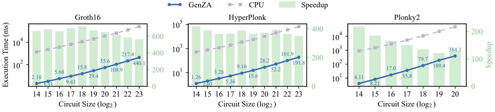

# VII. METHODOLOGY

Hardware implementation and modeling. We develop comprehensive RTL implementations for the key components of GenZA, particularly the PE and its reconfigurable arithmetic unit. We synthesize them using the ASAP 7 nm [\[78\]](#page-14-38) technology. We use FN-CACTI [\[61\]](#page-14-39) to model SRAM area and power.

TABLE III AREA AND POWER OF GENZA AND COMPARISON WITH BASELINES.

| GenZA                       | Area (mm2 ) | Power (W) |
|-----------------------------|----------------|-----------|
| 128 PEs (16×8 array)        | 21.2           | 21.0      |
| NoC & crossbar              | 6.6            | 8.3       |
| Global transpose buffer     | 0.9            | 3.1       |
| SHA-3 core + MSM dec & disp | 0.01           | 0.04      |
| 2 HBM2e PHYs                | 29.8           | 31.7      |
| Total                       | 58.5           | 64.1      |
| PipeZK [87] (7 nm scaled)   | 8.5            | 1.27      |
| SZKP [19] (7 nm scaled)     | 25.3           | 10.87     |
| LegoZK [85] (7 nm scaled)   | 24.2           | 17.67     |
| zkSpeed [18]                | 366.5          | 170.88    |
| UniZK [80]                  | 57.8           | 96.4      |

We equip GenZA with two HBM2e interfaces [\[33\]](#page-13-45), [\[55\]](#page-14-40) for a total of 1 TB/s off-chip bandwidth. [Table III](#page-9-1) shows the area and power breakdown. The default configuration uses 16×8 PEs, with each PE containing 128 kB SRAM. The overall chip operates at 1 GHz and consumes 58.5 mm2 and 64.1 W.

We also build a cycle-accurate simulator for GenZA to evaluate end-to-end complex workloads. It is validated against our RTL designs for kernel-level correctness and performance. Specifically, the simulator analytically models the on-chip computation latency of each kernel. To accurately model the memory accesses, Ramulator2 [\[49\]](#page-14-41) is used. The dependencies between computations and memory accesses are explicitly considered to faithfully derive the overall performance.

Baselines. We compare GenZA against CPUs, GPUs, and state-of-the-art ASIC accelerators. For CPUs, we use a server with two 20-core Intel Xeon Gold 5218R processors at 2.1 GHz, with 8-channel DDR4 of approximately 200 GB/s. We use established, optimized software libraries: Jsnark [\[1\]](#page-12-2) with libsnark [\[69\]](#page-14-12) for Groth16, and the official implementations for Plonky2 [\[58\]](#page-14-3) and HyperPlonk [\[21\]](#page-13-24). All CPU benchmarks use all 80 available hardware threads. For GPUs, we compare with GZKP [\[51\]](#page-14-22) for Groth16 on an NVIDIA V100 GPU, and with a Plonky2 CUDA implementation [\[60\]](#page-14-42) on an A100 GPU. For ASICs, we compare with PipeZK [\[87\]](#page-14-7), SZKP [\[19\]](#page-13-10), and LegoZK [\[85\]](#page-14-6) for Groth16, zkSpeed [\[18\]](#page-13-9) for HyperPlonk, and UniZK [\[80\]](#page-14-5) for Plonky2, using their reported numbers in the papers for the same workloads. To fairly compare area and power, we scale all the ASIC baselines to 7 nm following the literature [\[63\]](#page-14-43), as in [Table III.](#page-9-1)

Workloads. First, we use synthetic *mock circuits* [\[21\]](#page-13-24) of various sizes for all three protocols. These circuits are designed to stress-test the prover while reflecting realistic workload characteristics. Following zkSpeed [\[18\]](#page-13-9), we make the control selector polynomials as binary, and the witness and constant polynomials with 90% sparsity (containing only 0 or 1) and 10% dense, full bit-width values in HyperPlonk and Groth16. For Groth16 and Plonky2, we also adopt established benchmarks from prior studies [\[80\]](#page-14-5), [\[87\]](#page-14-7), covering cryptographic primitives (e.g., SHA-256, AES, ECDSA) and arithmetic workloads (e.g., matrix multiplication).

Fig. 6. Execution time and speedup comparison between GenZA and the CPU baselines with various mock circuit sizes.

Fig. 7. Area-time product (ATP) comparison between GenZA and the ASIC baselines.

TABLE IV
GROTH16 PROVING TIME (MS) COMPARISON BETWEEN GENZA, THE
ASIC BASELINES, AND THE GPU. THE FIRST SIX BENCHMARKS USE
CURVE MNT4-753, AND THE OTHERS USE BLS12-381.

| Benchmark                      | GenZA | PipeZK | LegoZK | SZKP | GZKP |
|--------------------------------|-------|--------|--------|------|------|
| AES (2 14 )         | 2.1   | 97     | 11     | 17   | 103  |
| SHA (2 15 )         | 2.0   | 102    | 9      | 33   | 71   |
| RSA-ENC (2 17 )     | 5.9   | 1230   | 19     | 98   | 142  |
| RSA-SHA (2 17 )     | 6.8   | 822    | 21     | 128  | 154  |
| Merkle tree (2 19 ) | 13.3  | 2697   | 39     | 301  | 280  |
| Auction $(2^{20})$             | 23.6  | 2053   | 54     | 573  | 520  |
| Sprout (2 21 )      | 16.0  | 1687   | 27     | -    | 299  |
| Sap-Spend (2 17 )   | 1.1   | 354    | 7      | -    | 93   |
| Sap-Output (2 13 )  | 0.2   | 77     | 2      | -    | 34   |

TABLE V
HYPERPLONK PROVING TIME (MS) COMPARISON BETWEEN GENZA AND
THE ASIC BASELINE. USING CURVE BLS12-381.

| Benchmark    | Zcash           | Auction 2 20 | Res-Inv         | Rec-Cir         | Rollup          |
|--------------|-----------------|-------------------------|-----------------|-----------------|-----------------|
| Circuit size | 2 17 |                         | 2 21 | 2 22 | 2 23 |
| GenZA        | 5.4             | 28.2                    | 52.2            | 101.9           | 191.8           |
| zkSpeed      | 2.0             | 11.4                    | 18.3            | 43.5            | 86.2            |

TABLE VI PLONKY2 PROVING TIME (MS) COMPARISON BETWEEN GENZA, THE ASIC BASELINE, AND THE GPU.

| Benchmark     | Factorial 2 20 135 | Fibonacci       | ECDSA           | SHA-256         | MVM             |
|---------------|-------------------------------|-----------------|-----------------|-----------------|-----------------|
| Circuit size  |                               | 2 16 | 2 17 | 2 20 | 2 18 |
| Circuit width |                               | 135             | 136             | 135             | 400             |
| GenZA         | 384                           | 17              | 54              | 398             | 247             |
| UniZK         | 828                           | 23              | 65              | 908             | 320             |
| GPU [60]      | 26,673                        | 736             | 2,063           | 26,845          | 33,383          |

## VIII. EVALUATION

In this section, we conduct overall comparison between GenZA and the CPU, GPU, and ASIC baselines, and also analyze the effectiveness of individual kernel mapping optimizations we propose. We further show the scalability of GenZA, and specifically examine the NoC efficiency.

#### A. Overall Comparison

First, we compare GenZA relative to the 80-thread CPU baseline. We construct mock circuits with sizes from  $2^{14}$  to  $2^{23}$  for Groth16 and HyperPlonk, and up to  $2^{20}$  for Plonky2. Because a Plonky2 gate can encode multiple arithmetic operations depending on the configured width, its effective gate count (i.e., circuit size) is typically smaller than the other two. Figure 6 details the results. GenZA achieves substantial average speedups of  $644\times$ ,  $374\times$ , and  $156\times$  for Groth16, HyperPlonk, and Plonky2, respectively. The execution time of the prover is roughly linearly with the circuit size, while GenZA keeps robust speedups across all circuit sizes.

We next compare with prior (scaled) ASIC baselines for each protocol. Tables IV to VI report the end-to-end proving time, and Figure 7 shows the area-time product (ATP, c.f. Table III) as a normalized way to fairly assess the area efficiency. First, for **Groth16**, GenZA achieves significant gains over previous fixed-function accelerators PipeZK and SZKP, with speedups of  $181.79\times$  and  $17.94\times$ , respectively. Although the GenZA chip is larger, it still exhibits substantial ATP advantages of  $24.64\times$  and  $7.75\times$ . These area efficiency improvements are mainly due to the higher hardware utilization from our unified architecture and better mapping schemes. When compared to 7 nm LegoZK which also uses unified

TABLE VII AREA AND POWER BREAKDOWN OF A GENZA PE.

| GenZA PE                           | Area (µm2 ) | Power (mW) |
|------------------------------------|----------------|------------|
| 32 64-bit multipliers              | 31 k           | 25         |
| 128-bit KO stage                   | 13 k           | 20         |
| 256-bit KO stage                   | 13 k           | 20         |
| 384-bit KO stage                   | 16 k           | 21         |
| 768-bit KO stage                   | 17 k           | 21         |
| Modular multiplier stage           | 6 k            | 11         |
| Modular adders/subtractors         | 10 k           | 25         |
| 128 kB scratchpad                  | 51 k           | 8          |
| Crossbar & wires                   | 9 k            | 13         |
| Total                              | 166 k          | 164        |
| Fully pipelined modular multiplier |                |            |
| 384-bit                            | 69 k           | 156        |
| 768-bit                            | 263 k          | 503        |

PEs, GenZA still achieves a 4.79× speedup and a 1.98× ATP improvement. These advantages are mainly from our dynamic MSM window size configuration [\(Section VI-B\)](#page-7-0), as well as the capability to pipeline multiple kernels [\(Section VI-F\)](#page-9-2). Small circuits benefit more from these optimizations, as they suffer from the fixed, sub-optimal window size in the baseline, and cannot fully utilize all the PEs without cross-kernel pipelining.

Then, for HyperPlonk, zkSpeed uses very large on-chip SRAM and many PEs for MSMs, achieving high performance with large chip area. As GenZA has much smaller area, its endto-end performance is lower, but it shows 2.51× better ATP than zkSpeed. This stems directly from our architectural flexibility: our dynamic MSM window size selection optimizes the MSM performance [\(Section VI-B\)](#page-7-0), while our sumcheck optimizations achieve high memory efficiency without requiring large, dedicated on-chip SRAM for the MLEs [\(Section VI-D\)](#page-8-2).

Finally, for Plonky2, GenZA is 1.66× faster and has a 1.64× better ATP than UniZK. Plonky2 has much more polynomial operations which are memory-bound, so it benefits significantly from GenZA's polynomial operator fusion and pipelined execution [\(Sections VI-E](#page-8-1) and [VI-F\)](#page-9-2). In addition, our longer on-chip NTT pipelines reduce the area cost compared to UniZK's dedicated transpose buffers [\(Section VI-A\)](#page-6-2).

We additionally compare with two GPU implementations for Groth16 and Plonky2. As shown in [Tables IV](#page-10-1) and [VI,](#page-10-2) GenZA achieves 36.6× and 63.7× speedups over the respective GPU baselines.

## *B. Detailed Analysis of Proposed Optimizations*

Multi-bitwidth PEs. The GenZA PE uses KO decomposition to enable multi-bitwidth support [\(Section V\)](#page-4-1). [Table VII](#page-11-0) shows its area breakdown. The area excluding scratchpad is in between 384-bit and 768-bit fully pipelined modular multipliers. However, our PE only supports modular multiplication throughput of 0.2 per cycle for 768-bit. So we achieve 0.53× throughput/area compared to the dedicated 768-bit design, which is the cost for the multi-bitwidth flexibility.

Folded pipelines for NTT. [Table VIII](#page-11-1) demonstrates the significant advantages of our folded pipeline NTT mapping ("w/",

TABLE VIII IMPACT OF FOLDED NTT PIPELINES ON EXECUTION TIME, OFF-CHIP MEMORY TRAFFIC, AND PE UTILIZATION.

| NTT size | Time (ms) |      |     | Memory traffic (GB) | PE utilization |     |
|----------|-----------|------|-----|---------------------|----------------|-----|
|          | w/o       | w/   | w/o | w/                  | w/o            | w/  |
| 20 2  | 1.6       | 1.1  | 0.7 | 0.4                 | 29%            | 45% |
| 21 2  | 4.7       | 2.4  | 1.9 | 0.7                 | 21%            | 42% |
| 22 2  | 14.1      | 5.5  | 3.7 | 1.5                 | 14%            | 38% |
| 23 2  | 27.1      | 11.4 | 7.4 | 3.0                 | 16%            | 38% |

TABLE IX IMPACT OF DYNAMIC MSM WINDOW SIZING ON EXECUTION TIME.

| MSM size              | 14      | 17      | 20      | 23       |
|-----------------------|---------|---------|---------|----------|
|                       | 2       | 2       | 2       | 2        |
| Fixed window (c = 9)  | 0.14 ms | 1.08 ms | 8.64 ms | 69.02 ms |
| Dynamic window sizing | 0.13 ms | 0.63 ms | 3.14 ms | 23.78 ms |
| Speedup               | 1.08×   | 1.71×   | 2.75×   | 2.90×    |

[Section VI-A\)](#page-6-2) when compared with a simple mapping onto a short, 8-PE pipeline ("w/o"). For the largest 223 instance, by decreasing the off-chip memory traffic from 7.4 GB to 3.0 GB, folded pipelines improve the performance by 2.4×, with more than doubled PE utilization from 16% to 38%. The utilization remains at 38% because NTT is fundamentally memorybound; its low arithmetic intensity (one modular multiplication per element) limits further gains. Nevertheless, our inter-kernel fusion and pipelining [\(Section VI-F\)](#page-9-2) can further alleviate this memory pressure by eliminating intermediate data transfers between consecutive kernels, thereby improving the effective utilization in end-to-end protocol execution.

Dynamic MSM window sizing. [Table IX](#page-11-2) compares the performance of a fixed MSM window size (*c* = 9, as used in zkSpeed [\[18\]](#page-13-9)) against our dynamic window sizing approach. Our dynamic scheduler is able to choose larger window sizes up to *c* = 16 for larger MSMs, significantly reducing the total number of PADDs and resulting in speedups of up to 2.90×.

Sumcheck. The two sumcheck optimizations [\(Sec](#page-8-2)[tion VI-D\)](#page-8-2) mainly save the memory traffic. We quantify their impact on a 223 instance in [Table X.](#page-11-3) Without optimizations, the kernel accesses 2.9 GB data from off-chip memory. Applying equality-polynomial space reduction provides a moderate 1.3× traffic reduction by avoiding materialization of the *eq*e polynomials. The delayed binding optimization has much larger benefits, further saving another 3.1× down to 0.7 GB.

Inter-kernel fusion & pipelining. [Table XI](#page-12-3) presents the impact of our inter-kernel optimizations to alleviate the mem-

TABLE X IMPACT OF SUMCHECK OPTIMIZATIONS ON OFF-CHIP MEMORY TRAFFIC FOR A 2 23 INSTANCE.

| Optimization              | Memory Traffic (GB) | Reduction |
|---------------------------|---------------------|-----------|
| Base                      | 2.9                 |           |
| + Eq-poly space reduction | 2.2                 | 1.3×      |
| + Delayed binding         | 0.7                 | 4.1×      |

TABLE XI IMPACT OF FUSION AND PIPELINING ON OFF-CHIP MEMORY TRAFFIC.

| Protocol   | LRU       | Fusion   | Fusion+Pipe. | Sched. time |
|------------|-----------|----------|--------------|-------------|
| Groth16    | 247.9 GB  | 244.9 GB | 237.5 GB     | 0.02 s      |
| HyperPlonk | 196.7 GB  | 171.8 GB | 117.0 GB     | 0.5 s       |
| Plonky2    | 1220.0 GB | 150.0 GB | 128.3 GB     | 517.8 s     |

TABLE XII GENZA SCALABILITY W.R.T. PE COUNT AND MEMORY BANDWIDTH.

| Resource  | Protocol   | Time (ms) |       |       |       |
|-----------|------------|-----------|-------|-------|-------|
|           |            | 0.5×      | 1×    | 2×    | 4×    |
| PE count  | Groth16    | 114.0     | 64.9  | 43.0  | 31.1  |
|           | HyperPlonk | 313.5     | 191.8 | 127.8 | 99.2  |
|           | Plonky2    | 546.9     | 384.1 | 312.5 | 247.0 |
| Bandwidth | Groth16    | 97.8      | 64.9  | 57.4  | 52.4  |
|           | HyperPlonk | 254.9     | 191.8 | 157.3 | 139.8 |
|           | Plonky2    | 572.0     | 384.1 | 310.1 | 285.4 |

ory access bottleneck. We gradually enable kernel fusion [\(Section VI-E\)](#page-8-1) and inter-kernel pipelining [\(Section VI-F\)](#page-9-2) for the three protocols. These optimizations are highly effective on Plonky2, which is characterized by its numerous sequential, low-arithmetic-intensity polynomial operations. Compared to a simple LRU policy for data caching, fusion alone reduces the memory traffic by 8.1× via merging kernels and eliminating intermediate data transfers. Pipelining provides an additional 1.2× reduction by forwarding data directly between PEs, resulting in a 9.5× total traffic reduction. Achieving this traffic reduction requires 517.8 s of offline scheduling on Plonky2's complex computational graph. However, this is a one-time cost, amortized across multiple proof instances.

HyperPlonk sees a moderate but still significant 1.7× total reduction. However, Groth16 benefits marginally. With our dynamic window size selection, the MSM becomes computebound and offers few opportunities for further reduction. The scheduling overheads of these two protocols are much smaller due to their simpler computational graphs.

## *C. Scalability*

The two key resources of GenZA are the PE count (computation) and HBM bandwidth (memory). [Table XII](#page-12-4) analyzes the performance scalability of GenZA w.r.t. them. We use a 223 circuit size for Groth16 and HyperPlonk, and 220 for Plonky2. The performance, particularly for Groth16 and HyperPlonk, is highly sensitive to the on-chip PE count. This is because these protocols are dominated by compute-intensive, large-field kernels (e.g., MSMs). Increasing the PE count yields dual benefits of higher arithmetic throughput and larger aggregate on-chip SRAM, which further improves performance by reducing the off-chip memory traffic.

## *D. NoC Analysis*

NTT. We evaluate the worst-case NoC bandwidth demand of our folded NTT pipelines. For 64-bit fields, the MDC pipeline is consolidated within a single PE and therefore incurs no inter-PE traffic. For larger bitwidths *w*, we use the folded pipeline mapping, where the SRAM-hungry early stages are placed close to the PEs with spare scratchpad capacity. As a result, the distance between a borrowing PE and its lending PE is at most 2 hops. Moreover, due to the FIFO access pattern, at most one borrow-lend PE pair is active at a time, so the maximum total NoC traffic is at most twice the forward data traffic. Assume each pipeline stage performs one butterfly every *II* PE cycles, where *II* accounts for both the KO multiplications and Montgomery reduction: *II* ≈ 6.75 for 256/384-bit and *II* ≈ 10.125 for 768 bit fields. Since each butterfly processes two elements, and accounting for scratchpad borrowing, the traffic per pipeline is conservatively capped at 4*w*/*II* bytes per cycle. Each PE row carries *P* = 32/*M* parallel pipelines (*M* lanes per wide multiplier: 4, 8, and 16 for 256-, 384-, and 768-bit fields, respectively), so the aggregate per-link demand is 4*Pw*/*II*. In the worst case (256-bit), this evaluates to approximately 152 GB/s, i.e., only 30% of the per-hop NoC capacity (32×64 bit links at 2 GHz). Wider fields are even lower: 22% for 384 bit and 15% for 768-bit. Since the traffic is fully deterministic and the worst-case utilization remains low, the NoC sustains NTT operations with little congestion.

MSM. We build a cycle-accurate, packet-level NoC simulator for the 2D mesh. We feed it with realistic MSM dispatch traffic, where scalars are randomly sampled from a uniform distribution. For the representative BN128 configuration (*c* = 16), the simulation shows a dispatch stall rate of only 3.97%, with an average link utilization of 5.9% and a peak utilization of 44.51% on the hottest link. During the reduction phase, each PE retains only two EC points after the intra-PE reduction of [Figure 4](#page-7-1) ② (i); aggregating these partial sums across PEs imposes negligible NoC pressure.

