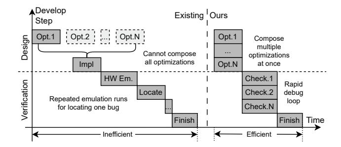
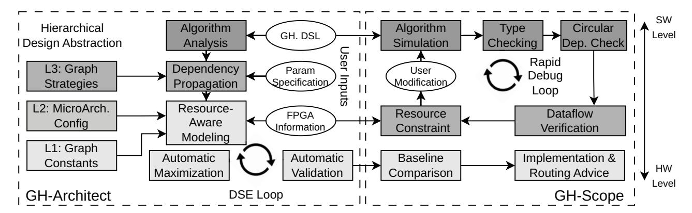
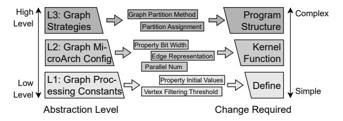
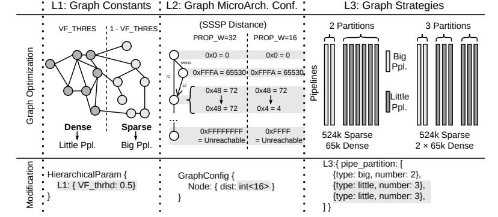
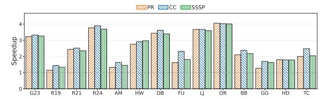
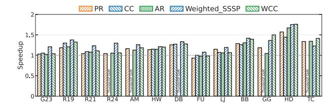
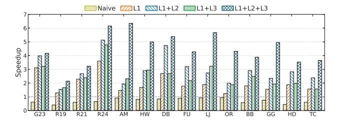
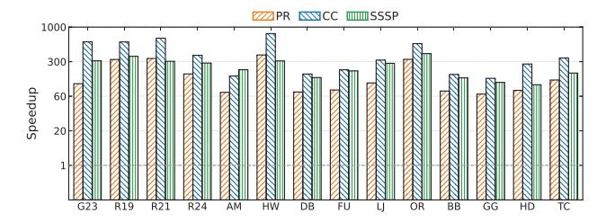

# Graph.hls: A Compiler Framework for Composable Graph Accelerator Design

Feiyang Wu∗, Xuxiao Yang∗, Zhuohang Bian∗, Jing Wang†, Ruifan Xu∗, Guangyu Sun∗ Yun Liang∗, and Youwei Zhuo(卓有为) ∗

∗Peking University, Beijing, China †East China Normal University, Shanghai, China {fywu25, valinor, zhbian26}@stu.pku.edu.cn {xuruifan, gsun, ericlyun, youwei}@pku.edu.cn wangjing@cs.ecnu.edu.cn

*Abstract*—FPGAs offer superior performance for graph processing, but existing High-Level Synthesis (HLS) frameworks face two critical bottlenecks: (1) optimization techniques scattered across incompatible frameworks cannot be composed—a simple 16-bit data type change requires modifying 200+ lines across 10+ files, and (2) developers lack systematic validation tools, forcing reliance on slow hardware emulation taking 50+ minutes per iteration. We present Graph.hls, a domain-specific compiler framework that addresses these challenges through hierarchical abstraction and automated workflows. Graph.hls organizes graph accelerator parameters into three levels by modification cost, enabling composition of multiple optimizations through unified configuration. Graph.hls's GH-Architect automatically generates optimized hardware by propagating dependencies and performing resource-aware code generation, while GH-Scope provides rapid verification through IR-level simulation and baseline comparison, completing validation in under 1 second. Our DSL naturally expresses graph algorithms beyond the traditional GAS model, and the hierarchical abstraction enables composing optimizations across algorithms and FPGA platforms without manual code integration. Evaluation shows Graph.hls achieves 2.6× average speedup over ReGraph and 1.2× over ThunderGP with fair parameter-matched comparison, and up to 4.48× speedup with full multi-level design space exploration. GH-Scope accelerates simulation by 301.6× over vendor C-Sim and reduces debugging time by up to 455,000× over hardware emulation, enabling composable, high-performance graph accelerator design.

*Index Terms*—FPGA, high-level synthesis, graph processing, graph accelerators, compiler framework, design space exploration, hardware debugging

#### I. INTRODUCTION

Graph processing is essential for many applications, including social network analysis, recommendation systems, and scientific computing [1], [2]. As graphs continue to grow in size and complexity [3], there is increasing demand for highperformance energy-efficient graph processing solutions. Conventional architectures like CPUs [4] and GPUs [5] struggle with the irregular memory access patterns and data-dependent parallelism of graph workloads. FPGAs are a compelling alternative, offering customizable memory hierarchies and finegrained parallelism that can be tailored to specific graph algorithms. Recent FPGA accelerators [6]–[9] have demonstrated significant performance and efficiency gains over CPUs and GPUs.

However, the primary drawback of FPGAs has always been their challenging design process. Historically, developing hardware required low-level Hardware Description Languages



Fig. 1: Workflow comparison between existing graph accelerator development and Graph.hls. Existing frameworks suffer from two bottlenecks: inability to compose multiple optimizations due to implementation complexity, and slow verification requiring repeated hardware emulation runs. Graph.hls addresses both through composable multi-level abstraction and fast IR-level verification, transforming hours-long debugging into sub-minute iterations.

(HDLs) like Verilog or VHDL. This Register Transfer Level (RTL) design paradigm is time-consuming, error-prone, and presents a steep learning curve, requiring significant hardware expertise that most graph algorithm researchers do not possess. High-Level Synthesis (HLS) tools have emerged as a higher level of abstraction, allowing developers to specify hardware from algorithmic descriptions in familiar languages like C++. In theory, HLS automates the complex translation to hardware, allowing domain experts to focus on algorithm design while the toolchain handles RTL generation. This makes HLS an attractive approach for building graph accelerators.

Despite these advantages, building high-performance graph accelerators with HLS remains challenging. The core difficulty lies not in a lack of optimization ideas, but in the absence of a framework to systematically explore and validate them. We identify two critical gaps:

Challenge 1: The Design Exploration Gap. Graph processing presents a richer design landscape shaped by both the algorithm and the input graph's characteristics. The research community has made substantial progress exploring these optimizations: vertex property bitwidths adapted to value ranges, memory hierarchies tuned to access patterns [8], partition strategies and big-little pipeline configurations [9] tailored to

degree distributions. However, these optimizations exist as isolated implementations, each deeply embedded within its respective framework. A developer cannot easily combine the techniques across multiple works. For example, the trade-off of a 16-bit data path versus an 8-bit one is not a simple configuration change. It is an invasive refactoring task spanning over 200 lines across 10+ files. Current HLS approaches lack the abstraction layers that would allow developers to compose, combine, and evaluate these known architectural patterns systematically within a unified, flexible framework.

Challenge 2: The Verification and Debugging Gap. Graph algorithms are difficult to debug and profile due to inherent data dependence. For example, in shortest path algorithm, changing one edge weight can lead to a different frontier sequence, touching thousands of different vertices in a new order. While there is a wide range of open-source wellvalidated implementations, current tools provide no systematic way to leverage these implementations as correctness oracles, as performance baselines and as diagnostic references. Developers are often forced into a slow and manual binary search across the codebases. To locate the bug, they must: (1) comment out a pipeline stage, (2) re-run the entire hardware emulation to see if the bug disappears, and (3) repeat this process iteratively, recompiling and re-emulating the entire system for each step. Locating a single error requires hours of waiting across multiple emulation runs.

These challenges expose a common flaw in existing HLS frameworks: the entanglement of algorithm, hardware, and verification. Parameters controlling data types, memory configurations, and resource allocation are scattered across multiple files without centralized management or validation. As a result, developers cannot state what they want—a PageRank accelerator with heterogeneous pipelines and 16-bit properties—and have the toolchain figure out how to build it. They are forced to manually engineer every detail, an approach that fails to scale with the complexity of the graph design space.

Our key insight is that graph accelerator development requires domain-specific parameterization at multiple abstraction levels. Instead of manually modifying a rigid codebase, developers should declare their design intent—algorithm, configuration, and constraints—in a structured format. An intelligent compiler can then automatically materialize this specification into optimized, correct-by-construction hardware. It transforms the development process from low-level engineering to highlevel design space exploration, closing the exploration and verification gaps.

We present Graph.hls, a compiler framework that structures graph accelerator development through multi-level abstraction, code generation and verification. Graph.hls is built upon two components: (1) a Hierarchical Design Abstraction that defines design space by partitioning all tunable parameters—from basic constants to high-level strategies, and (2) an Automated Generation and Debugging Workflow that leverages this abstraction to enable rapid, correct-by-construction development. The abstraction defines what can be tuned, while the workflow defines how these abstractions are implemented and verified

through two engines: **GH-Architect** for automated hardware generation with resource-aware design space exploration, and **GH-Scope** for fast IR-level verification and simulation with comprehensive systematic comparison.

Graph.hls delivers substantial productivity and performance benefits. The same bit-width optimization that requires 200+ line changes in ReGraph needs only a single-line update in Graph.hls. GH-Scope accelerates simulation by  $301.6\times$  over vendor C-Sim and reduces debugging time by up to  $455,000\times$  over hardware emulation. Our DSL Graph.hls Frontend provides expressiveness beyond the traditional GAS model, and the compiler's hierarchical abstraction makes optimizations composable across various graph algorithms and distinct FPGA platforms. Our evaluation shows that Graph.hls achieves  $2.6\times$  average speedup over ReGraph and  $1.2\times$  over ThunderGP under fair parameter-matched comparison, and up to  $4.48\times$  speedup when full multi-level design space exploration is enabled.

This paper makes the following contributions:

- A hierarchical design abstraction that systematically organizes the graph accelerator design space by modification cost, from graph basic constants to graph accelerator strategies (Section III-A).
- GH-Architect, an automated design space exploration and code generation engine that transforms DSL into optimized graph accelerator through dependency propagation and resource-aware refinement (Section III-B2).
- GH-Scope, a fast IR-level simulation and validation framework that enables sub-second verification cycles with 301.6× speedup over vendor C-Sim, up to 455,000× faster debugging than hardware emulation, and systematic baseline comparison against validated reference implementations (Section III-B3).
- A comprehensive evaluation covering six graph algorithms across two distinct FPGA platforms, demonstrating 2.6× average speedup over ReGraph and 1.2× over ThunderGP under fair comparison, up to 4.48× with full multi-level design space exploration, 301.6× simulation speedup over vendor C-Sim, and up to 455,000× debugging speedup over hardware emulation (Section V).

The rest of this paper is organized as follows. Section II provides background on graph processing and FPGA acceleration, and uses ReGraph as a case study to demonstrate the two fundamental pitfalls in current graph accelerator design workflows. Section III presents the Graph.hls overview, introducing our hierarchical design abstraction and the automated generation and debugging workflow with GH-Architect and GH-Scope. Section IV describes the implementation of Graph.hls. Section V evaluates Graph.hls on productivity and performance metrics. Section VI discusses related work, and Section VII concludes

#### II. BACKGROUND AND MOTIVATION

We examine limitations of existing HLS frameworks using ReGraph [9], a state-of-the-art graph processing framework,

Node Property Type: ap\_uint<32> to ap\_uint<16> **Host Changes Kernel Changes** #define MAX\_I 2147483647 typedef ap\_uint<32> prop\_t typedef ap\_uint<16> prop\_t data types #define MAX\_I 32767 algorithm constants cacheline\_idx = src[i] >> 4 cacheline\_idx = src[i] >> 5 Icache index calculation 仚 a.range(31 + (i << 5), i << 5) a.range(15 + (i << 4), i << 4) URAM word

Fig. 2: The cascade of changes required for a 32-to-16-bit data type modification in ReGraph. A single logical change requires invasive modifications across over 10 files and 200+ lines of code, spanning data definitions, packing logic, kernel dataflow, computation constants, and host code.

| bit-level packing logic

choose logic

data packing

identifying two fundamental pitfalls that hinder productivity in graph accelerator development.

## A. Pitfall I: Tight coupling between graph semantics and hardware implementation

Graph accelerator development faces an extremely large design space with many optimization opportunities. Past research has demonstrated diverse optimization techniques scattered across different frameworks [8]–[10], yet it's very hard for developers to compose these techniques from different works.

Consider optimizing Single-Source Shortest Path (SSSP) for road networks. Initially using 32-bit distance values ( $\leq 2.1 \times 10^9$  km), analysis reveals 16-bit integers suffice ( $\leq 65535$  km). This optimization doubles memory bandwidth utilization and on-chip vertex property cache sizes, increases throughput for high-degree vertices dominating execution.

Ideally, this should require only a simple parameter change. However, in ReGraph, this modification cascades across the graph processing dataflow, as shown in Figure 2. The graph property structures require updating definitions in vertex arrays, edge properties, and message types across header files; HBM packing logic needs bit-range recalculations in locations spanning host-side graph loading, device-side reads, scatter writes, and processing pipelines; gather dataflow requires adjusting the number of vertices processed per cycle, propagating through neighbor buffer sizes, reduction trees, and scatter interfaces; algorithm constants need updating maximum distance from 2, 147, 483, 647 to 32, 767 across initialization, termination detection, and relaxation conditions; host-device transfers require modifying allocation sizes, padding boundaries, and verification unpacking logic.

This lack of abstraction prevents developers from composing multiple optimizations together. A developer wanting to combine 16-bit optimization with a new partition strategy cannot simply merge these techniques—each requires incompatible code structures. Instead, developers must choose one optimization path and manually implement it, losing the potential benefits of combining complementary techniques.

The design space is very large, yet past designs remain locked in separate, non-composable codebases.

These limitations are compounded by framework-specific assumptions about memory resources, pipeline architectures, and algorithm models that prevent merging optimizations across sources. Without composable abstractions, developers face a harsh choice: implement only one technique, or attempt prohibitively expensive manual integration across incompatible frameworks.

#### B. Pitfall II: Slow verification cycles prevent rapid iteration

The complexity from Pitfall I makes bugs inevitable, yet developers lack systematic tools for debugging. Graph algorithms present unique verification challenges: failures are data-dependent, manifesting only on graphs with specific topological characteristics. Even though developers can compare their implementation against existing frameworks to identify divergence points and validate correctness, no systematic comparison mechanism exists. Instead, they must manually instrument both their code and baseline implementations, then correlate results across expensive hardware emulation runs.

Consider implementing the 16-bit conversion from Pitfall I. Testing on a small uniform random graph (graph500-scale19 [11], 500K vertices) produces correct distances. However, testing on a real-world social network (LiveJournal [12], 4.8M vertices) yields incorrect results: some vertices show distances exceeding graph diameter while others remain at infinity despite being reachable.

The bug is indirect: when graph diameter exceeds 65535, distances overflow and wrap around. A vertex at true distance 65540 wraps to 4 and wrong distances propagate throughout the graph. On small uniform graphs (diameter < 1000), overflow never occurs. On large networks (diameter > 100K due to long chains), overflow corrupts the results for thousands of vertices. Some reachable vertices remain at infinity distance because their predecessors' distances equal the maximum value and are therefore treated as unreachable. This data-dependent failure pattern is characteristic of graph algorithm bugs: code works on some topologies and fails on others depending on structural properties.

Debugging this requires comparing intermediate results between the 16-bit implementation and a validated 32-bit baseline. However, C-Sim's sequential execution model hangs on ReGraph's concurrent pipeline architecture, and it cannot model finite stream depths or detect deadlocks. Developers must instead rely on hardware emulation (Co-Sim), requiring ~50 minutes per iteration. As Figure 1 illustrates, locating a single bug requires multiple Co-Sim iterations of instrumentation and binary search, consuming hours in total.

Beyond slow debugging, two verification gaps exist: (1) late-stage routing failures from cross-SLR congestion appear only after >3-hour synthesis runs, and (2) no rapid algorithm correctness validation exists independently from hardware synthesis. This forces a "synthesize and hope" workflow where expensive runs proceed without correctness confidence.



Fig. 3: Overview of Graph.hls.

These examples highlight that graph accelerator development faces dual verification challenges absent in traditional HLS. First, graph algorithm correctness must be validated across diverse topologies with different structural properties. Second, graph-specific hardware constraints must be validated Without addressing both challenges, developers face prohibitively slow iteration where bugs appear after expensive Co-Sim and synthesis. And some of them cannot be diagnosed without expert FPGA knowledge.

#### III. GRAPH.HLS OVERVIEW

To realize the composable design paradigm proposed in Section II, we present Graph.hls. The Graph.hls workflow is built upon two integral components designed to systematically address the productivity bottlenecks identified in Section II. As illustrated in Figure 3, these components are: (1) a novel Hierarchical Design Abstraction that structures the vast and chaotic HLS design space, and (2) an Automated Generation and Debugging Workflow that leverages this abstraction to enable rapid, correct-by-construction development. The abstraction layer defines what optimizations can be composed, partitioning all parameters by their modification cost. The automation workflow defines how these compositions are implemented and verified, leveraging two key engines to concretely resolve the fundamental pitfalls of monolithic HLS frameworks:

GH-Architect solves the Design Exploration Gap (Pitfall I). In monolithic designs, merging optimizations—such as 16-bit data types and custom partitioning—requires invasive manual integration across incompatible codebases. GH-Architect addresses this by automatically generating unified hardware from multiple optimization specifications, enabling developers to merge strategies from different research works through configuration rather than manual refactoring.

**GH-Scope** solves the **Verification Gap** (**Pitfall II**). Traditional flows force developers to rely on slow hardware emulation without systematic validation tools. GH-Scope addresses this by enabling rapid **reference comparison**, allowing developers to compare their user implementations against validated reference codes in seconds instead of hours. By verifying

intermediate results against a trusted reference, GH-Scope detects divergence points and implementation risks early.

Together, these components transform isolated, noncomposable optimization implementations into systematic composition and validation workflows.

#### A. A Hierarchical Design Abstraction

The design space for graph accelerators is large, encompassing numerous optimization opportunities: vertex/edge property bitwidths, graph partitioning strategies, pipeline configurations, memory hierarchies, and scheduling policies. Past research has proposed valuable optimization techniques scattered across different frameworks. However, these optimization designs are not composable. In ReGraph [9] alone, parameters scatter across 5 makefiles, 21 headers and 14 source files with complex dependencies, making integration with other frameworks' techniques prohibitively expensive.

To enable composing multiple optimization strategies, we organize this graph-specific design space through a hierarchical design abstraction classifying parameters by modification cost in traditional HLS frameworks: Level 1 (Graph Processing Constants) for single-line algorithm behavior changes, Level 2 (Graph Algorithm Configuration) for multi-file propagation through graph data structures, and Level 3 (Graph Architecture Strategies) for complete graph processing pipeline redesign. This cost-based hierarchy transforms unstructured, non-composable optimization attempts into systematic, automatable workflow enabling merging techniques from multiple sources, as illustrated in Figure 4.

1) Level 1: Graph Processing Constants: Level 1 parameters control graph algorithm execution without changing hardware dataflow structure. These affect how vertices and edges are processed—vertex property initialization, convergence thresholds, active vertex filtering threshold—but not pipeline organization or memory hierarchy. Modifications remain isolated within graph processing kernels without propagating through bit-packing logic or memory interfaces. Representative parameters include: vertex property initial values (PageRank's initial rank 1.0/|V|, SSSP's initial distance  $+\infty$ ),



Fig. 4: The hierarchical design abstraction organizing graph accelerator parameters by modification cost. L1 requires single-line changes, L2 demands multi-file propagation, L3 necessitates complete redesign. Deeper shading indicates higher cost and broader impact.

convergence threshold (ε determining when iterative algorithms terminate), and active vertex filtering threshold (minimum degree for "big" versus "little" pipeline assignment).

The key characteristic is *graph-semantic locality*: they change what values flow through the processing pipeline but not how the pipeline processes them. For example, modifying the active vertex filtering threshold—the little-big partition ratio determining which vertices route to high-throughput little pipelines versus big pipelines—directly impacts load balance across heterogeneous processing units. However, this modification is isolated within the partitioning logic without affecting memory interfaces, data packing, or overall pipeline structure. This isolation enables developers to iterate using GH-Scope's fast simulation without invoking full HLS toolchain, providing sub-minute feedback loops.

*2) Level 2: Graph Microarchitecture Configuration:* Level 2 parameters expose graph data structure and processing configurations that propagate through the entire accelerator. Unlike Level 1's isolated changes, Level 2 affects how graph vertices, edges, and properties are represented in memory, packed for burst transfers, and processed per cycle. Representative parameters include: vertex property bit width (16-bit vs 32-bit distances in SSSP, interacting with graph value ranges), edge property representation (whether edges carry weights, affecting CSR structure and fetch logic), and parallel number (parallel compute units requiring replicated vertex caches and edge buffers).

As shown in Section II-A (Figure 2), even a simple bitwidth change (32-bit to 16-bit) triggers 200+ line modifications across 10+ files. GH-Architect automates this: L2 operates within fixed dataflow structures, so the pipeline remains constant while internal modules adapt, and setting one configuration parameter propagates all cascading changes automatically.

*3) Level 3: Graph Dataflow Strategies:* Level 3 parameters represent fundamental dataflow decisions about how graphs are decomposed, distributed, and processed across FPGA resources. These determine the top-level graph processing model affecting every component from preprocessing to aggregation, including both FPGA kernel organization and hostside coordination code. Unlike Level 1 (tuning behavior) and Level 2 (configuring microarchitecture), Level 3 changes alter fundamental assumptions about the entire processing pipeline. Representative parameters include: graph partitioning strategy (how vertices/edges are distributed across processing pipelines, affecting load balance and memory access patterns); vertexcentric versus edge-centric execution model (affecting memory access patterns, pipeline organization, and load balancing); and partition assignment to FPGA resources (SLR and HBM channel mapping affecting routing and bandwidth).

Critically, ReGraph's partition strategy cannot be merged with other designs because these frameworks make mutually incompatible architectural assumptions. ReGraph assumes two-class big-little partitioning with shared destination sets, ThunderGP assumes single unified partition with elaborate vertex caching, and GraphLily assumes overlay-based reconfigurable processing. Developers wanting to combine ReGraph's benefits with another strategy face complete architectural redesign—no composition mechanism exists at this fundamental level.

Consider the graph partition strategy as an example. Re-Graph employs a fixed two-class partitioning strategy: dense partitions processed by all little pipelines and sparse partitions processed by all big pipelines. Critically, all pipelines within each class share the same destination node set—all little pipelines process one partition with 65, 536 destination nodes, while all big pipelines process another partition with 524, 288 destination nodes. This rigid design creates severe load imbalance across diverse graph topologies. For sparse graphs, big pipelines are underutilized since they all process the same limited destination set when they could independently handle different partitions with many nodes. Conversely, for large dense graphs where the single 65, 536 node partition is insufficient, if half the little pipelines can handle this shared partition, the remaining half underutilized. To address these limitations, we generalize the partition logic to allow arbitrary partition classes, where each class processes independent destination node sets using configurable pipeline counts. This modification requires major changes affecting over 1, 000 lines of code across both FPGA kernels and host code: generalizing the partition preprocessor from 2 to N classes, adjusting destination buffer sizes per class, generating variable pipeline counts, creating N independent mergers instead of 2 shared ones, updating host code for multi-class scheduling, and modifying host-side memory allocation and data transfer logic to handle variable partition configurations.

The host code changes are particularly significant at Level 3. While Level 1 and Level 2 modifications primarily affect FPGA kernel code with minimal host-side changes, Level 3 dataflow strategy changes require substantial host code modifications. For the partition strategy example, the host must: allocate different HBM buffers for each partition class, schedule data transfers coordinating multiple partition classes, track partition boundaries and vertex mappings across classes, and synchronize pipeline execution across heterogeneous processing units. These host-side modifications are tightly coupled with the FPGA dataflow organization—changing from 2-class

```
 Ƈ
 śƇśɏśʳɪɩʴƈ
 śƇƈ
 Ƈ
 ɨśƇɏśɩɭɩɨɫɫƈ
 ɪśƇɏśƃƇśřśɩƈř
 ƇśřśɪƈƄƈ
 Ƈ
 ʰɏſ
         Ŝ
          ƀ
 ɏʰſƃƄřśŜƀ
 ʰſƃƄřśŜŜƀ
 ʰſʰɏřʰƃƄř
 ʰřśʫƀ
 ɏʰſƃƄř
 śɥŜɨɬʫɥŜɯɬƋſŵŜɏƀƀ
 ɏ ɏɏŜ
ɨ
ɪ
ɫ
ɬ
ɭ
ɮ
ɯ
ɰ
ɨɥ
ɨɨ
ɨɩ
ɨɪ
ɨɫ
ɨɬ
ɨɭ
ɨɮ
ɨɯ
ɨɰ
```



- (a) PageRank algorithm in Graph.hls DSL.
- (b) Example graph optimizations and corresponding code changes using Graph.hls abstraction.

Fig. 5: Graph.hls's front-end and abstractions.

to N-class partitioning requires rewriting host scheduling logic to coordinate variable numbers of partition classes, each with different resource assignments and execution characteristics.

In Graph.hls, specifying partition strategy with class definitions causes GH-Architect to generate appropriate multipartition architecture automatically. This enables composing different architectural strategies from past works: the generalized partition strategy can be composed with other strategies without strict restrictions. The key characteristic is systemwide impact—L3 changes fundamentally alter both FPGA dataflow organization and host-side coordination logic, requiring comprehensive design knowledge of the entire hardwaresoftware interface. Without Level 3 flexibility, developers commit to single strategies early, suffering sub-optimal performance when graphs don't match assumptions, and cannot merge architectural innovations from different research works. Graph.hls's elevation of these to first-class configuration parameters enables composing architectural strategies through configuration changes, using GH-Scope's baseline comparison to evaluate composed designs against individual techniques from ReGraph, ThunderGP, or GraphLily before HLS synthesis.

*4) Cross-Level Parameter Dependencies:* The hierarchical design abstraction reflects fundamental dependencies in graph processing parameter interactions. Unlike matrix processing where parameters often compose independently, graph parameters exhibit complex cross-level dependencies from irregular data structures and data-dependent execution. Convergence threshold (L1) determines required vertex property bit width precision (L2)—PageRank with ε = 10−<sup>6</sup> requires 32-bit floats while ε = 10−<sup>3</sup> may suffice with 16-bit fixed-point. Vertex property bit width (L2) affects partition granularity (L3)—16-bit properties enable 2× larger partitions (1M vs 512K vertices) fitting in URAM. Partition strategy (L3) determines edge property representation (L2)—vertex-cut replicating vertices requires decisions about weight replication versus separate storage. This cross-level inference is graphspecific, requiring understanding how structural properties (degree distribution, value ranges, topology) propagate through algorithm choices, data structure decisions, and architectural strategies.

#### *B. Automated Generation and Debugging Workflow*

The hierarchical design abstraction defines *what* can be tuned, but organizing parameters alone does not solve the two pitfalls. We need to address how these parameters are actually implemented in hardware code (Pitfall I) and how designs are verified without slow Co-Sim (Pitfall II). Graph.hls solves these challenges through an automated workflow that enables rapid development of graph accelerator design. This workflow consists of two key components: GH-Architect for automatic code generation and GH-Scope for fast verification. Together, these components transform our structured parameter space into a practical development flow: GH-Architect turns configuration changes into working hardware code, while GH-Scope catches errors early before any slow hardware synthesis begins.

*1) Domain-Specific Graph.hls Frontend Interface:* Unlike existing frameworks that restrict expressiveness through rigid models like GAS (Gather-Apply-Scatter), Graph.hls provides a DSL (Graph.hls Frontend) with rich stream-based functional primitives. This Graph.hls Frontend naturally supports complex graph processing patterns that cannot be expressed in traditional abstractions, including algorithms with irregular dataflow such as Belief Propagation. Table I summarizes the core dataflow primitives and keywords used to construct these graph hardware kernels within the Iteration block.

Graph.hls Frontend is a superset of the GAS model, since we can represent GAS as a special case of our map/reduce/filter primitives. As illustrated in Figure 5a, the standard GAS pattern maps directly onto Graph.hls Frontend primitives: Scatter corresponds to iteration\_input followed by map over edge streams, Gather corresponds to reduce with a commutative-associative lambda, and Apply corresponds to a post-reduction map referencing self properties. Any algorithm expressible in GAS can therefore be implemented in Graph.hls Frontend using this mapping.

TABLE I: Algorithmic Keywords and Dataflow APIs inside the Graph.hls Iteration Block.

| Keyword / API                                                                                                                                    | Return / Data Type                                                                                                                                            | Description                                                                                                                                                                                                                                                                                                                               |  |  |  |
|--------------------------------------------------------------------------------------------------------------------------------------------------|---------------------------------------------------------------------------------------------------------------------------------------------------------------|-------------------------------------------------------------------------------------------------------------------------------------------------------------------------------------------------------------------------------------------------------------------------------------------------------------------------------------------|--|--|--|
| 1. Lambda Expressions                                                                                                                            |                                                                                                                                                               |                                                                                                                                                                                                                                                                                                                                           |  |  |  |
| lambda args: expr                                                                                                                                | Callable                                                                                                                                                      | Anonymous functions for computations, conditions, and custom reductions.                                                                                                                                                                                                                                                                  |  |  |  |
| 2. Context Accessors & Update Targets                                                                                                            |                                                                                                                                                               |                                                                                                                                                                                                                                                                                                                                           |  |  |  |
| self. <prop><br/>e.src, e.dst, e.<prop><br/>result_node_prop.<p></p></prop></prop>                                                               | Property Type<br>Node / Edge Object<br>Hardware Target                                                                                                        | Reads the vertex's current property (used in post-reduction maps).<br>Reads properties of the source vertex, destination vertex, or the edge itself.<br>Specifies the target node property for final results.                                                                                                                             |  |  |  |
| 3. Dataflow Primitives & Pipeline Control                                                                                                        |                                                                                                                                                               |                                                                                                                                                                                                                                                                                                                                           |  |  |  |
| iteration_input(src)<br>map([stream], lambda)<br>filter([stream], lambda)<br>reduce(key, val, lambda)<br>return <obj> as <target></target></obj> | Stream <edge node=""><br/>Stream<inferred type=""><br/>Stream<origin type=""><br/>Stream<key, val=""><br/>Void (Terminator)</key,></origin></inferred></edge> | Generates an initial stream from graph structural data (e.g., G.EDGES).<br>Applies lambda to every element in the stream.<br>Filters out stream elements where lambda returns false.<br>Aggregates values by key using the lambda reduction function.<br>Writes the final <obj> stream to the specified <target> property.</target></obj> |  |  |  |

Beyond GAS, Graph.hls Frontend supports algorithms with fundamentally irregular dataflow through flexible composition of its primitives. For example, Belief Propagation requires aggregating messages from all incoming neighbors *except* the target neighbor when updating each directed edge message—a selective exclusion that GAS's undifferentiated Gather cannot express. In Graph.hls Frontend, this is naturally implemented by inserting a filter primitive before reduce to exclude the target edge, then chaining the result through a map to compute the outgoing message. We evaluate Graph.hls Frontend across a broad range of graph algorithms including PageRank (PR), Weakly Connected Components (WCC), ArticleRank (AR), and weighted Single-Source Shortest Path (SSSP) in Section V.

Figure 5a illustrates a complete algorithmic implementation in our DSL. Developers build custom hardware pipelines seamlessly: execution begins with iteration\_input generating the initial edge stream (Line 13). Instead of manually coordinating complex memory fetches, developers use context accessors within map functions to concurrently extract properties, such as e.src.rank (Lines 14–15). The dataflow is then aggregated via custom reduce logic (Lines 16–17). Using self.out\_deg (Line 18), developers can effortlessly reference a vertex's prior static state for post-reduction updates. Finally, the return ... as ... terminator explicitly bounds the pipeline, directing the hardware compiler to route the output stream into the designated memory target (Line 19).

To ensure that these highly expressive specifications synthesize correctly into deeply pipelined, parallel FPGA hardware, the Graph.hls DSL relies on three fundamental algorithmic assumptions. First, the data streams passed between operators are unordered. This relaxation of strict sequential dependencies allows the underlying hardware to process edges out-oforder and maximize memory bandwidth utilization. Second, to support scalable, multi-partition spatial aggregation, the lambda function provided to the reduce primitive must be both commutative and associative. Third, the algorithmic behavior must be entirely expressible within a singleiteration boundary. The DSL defines the hardware datapath for one complete processing pass, and relies on the host system to iteratively invoke this unified kernel until graphlevel convergence is achieved. Consequently, for algorithms with inherently sequential dependencies, such as Dijkstra's algorithm, we deliberately advocate for equivalent concurrentrelaxation formulations. For instance, Bellman-Ford-style edge relaxation exposes the spatial parallelism necessary to fully saturate the generated hardware pipelines.

Beyond algorithmic logic, users can optionally specify architectural parameters directly within the definition or declare them separately, as shown in the HierarchicalParam block in Figure 5a. When parameters are not explicitly defined, GH-Architect automatically infers appropriate values. Critically, if GH-Architect detects that a user-specified parameter is sub-optimal for the target graph workload or FPGA platform, it raises warnings with specific optimization suggestions. This Graph.hls Frontend design balances simplicity for algorithm expression with flexibility for performance tuning, making graph accelerator development accessible to domain experts without requiring deep hardware knowledge. Concretely, users specify the algorithm body (the Iteration block) and the data schema (Node/Edge property declarations); L2 and L3 parameters such as vertex property bitwidth and pipeline grouping strategy may be optionally supplied in the HlsConfig block but are otherwise inferred by GH-Architect, while L1 parameters (e.g., partition ratio, buffer sizing) are always inferred automatically from the target graph dataset and hardware platform.

Figure 5b illustrates concrete examples of optimizations enabled by our hierarchical abstraction, demonstrating how parameters at different levels translate to actual hardware modifications. At Level 1, adjusting the vertex filtering threshold changes the data distribution ratio between big and little pipelines, affecting the partitioning logic without structural changes. At Level 2, reducing vertex property bit width from 32-bit to 16-bit halves memory requirements and doubles bandwidth utilization, requiring propagation through data structures but maintaining the same dataflow organization. At Level 3, generalizing the partition strategy from ReGraph's fixed 2-class configuration (one 524K sparse partition and one

#### Algorithm 1 Graph Parameter Dependency Propagation

```
Require: Dependency graph G, user specification U, L3 strategy s_{L3}
Ensure: Valid parameter combinations C
 1: Initialize all node available sets from full domains
 2: Apply U to constrain corresponding nodes
 3: Set root constraints from s_{L3}
 4: repeat
        changed \leftarrow FALSE
        for each node v in topological order do
 6:
           A'(v) \leftarrow A(v) \cap \bigcap_{u \in parents(v)} Analyzer_u(A(u), v)
 8:
           if A'(v) = \emptyset then
 9.
              return Ø
10:
           end if
11:
           if A'(v) \neq A(v) then
               A(v) \leftarrow A'(v); changed \leftarrow TRUE
13:
        end for
14:
15.
        {\bf for} each node v in reverse topological order {\bf do}
16:
           A'(v) \leftarrow A(v) \cap \bigcap_{w \in \text{children}(v)} \text{BAnalyzer}_w(A(w), v)
17:
           if A'(v) = \emptyset then
18.
               return Ø
19.
            end if
20:
           if A'(v) \neq A(v) then
21:
               A(v) \leftarrow A'(v); changed \leftarrow TRUE
22.
           end if
23.
        end for
24: until ¬changed
25: return CartesianProduct(\{A(v) \mid v \in V\})
```

65K dense partition) to a multi-class configuration (two 65K dense partitions and one 524K sparse partition) requires complete architectural redesign. These examples validate that our hierarchical abstraction accurately captures the modification cost range from simple constant changes to complete system reorganization, enabling developers to compose optimizations at appropriate abstraction levels.

2) GH-Architect: Automated Hardware Generation: GH-Architect is the core automated design space exploration and code generation engine that transforms high-level graph algorithm specifications into optimized hardware. Initially, GH-Architect accepts the Graph.hls DSL and transforms it into the Graph.hls Intermediate Representation (Graph.hls-IR), structured as a spatial dataflow DAG where nodes represent fundamental graph computations and edges represent data dependencies corresponding to hardware streams in the generated accelerator pipeline. Concretely, the IR comprises five node types corresponding to the DSL primitives in Table I: iteration\_input (stream source), map (perelement transform), filter (conditional selection), reduce (keyed aggregation), and return (output sink).

After building the IR, GH-Architect applies standard compiler optimizations like constant folding and dead code elimination. The IR remains structurally stable after these passes; the core optimization is the parameter-space search below, which uses the IR's dataflow structure to guide dependency propagation and resource allocation rather than rewriting the graph. It then resolves parameters across all three levels through a two-phase procedure: first, L3 parameters are determined via a heuristic selection informed by graph structural statistics; then, L1 and L2 parameters are resolved through dependency propagation conditioned on the fixed L3 con-

figuration. Using these finalized parameters, GH-Architect directly generates a ready-to-compile Vitis project, completely packaging the required HLS C++ source code, Makefiles, and configuration scripts.

For L3 parameters, the design space is substantially larger than that of L1 and L2, and selecting an effective configuration requires reasoning about graph data characteristics and algorithm behavior that is graph-topology-dependent and difficult to search exhaustively. Therefore, GH-Architect employs a heuristic for L3 selection. For parameters such as pipeline grouping strategy, it analyzes graph structural statistics, including degree distribution and average vertex degree, to estimate load balance across candidate partition configurations, and selects the configuration with the highest predicted pipeline utilization.

For L1 and L2 parameters, GH-Architect resolves their values through dependency propagation conditioned on the fixed L3 configuration. As established in Section III-A4, these parameters exhibit cross-level dependencies flowing in both directions: parent-to-child constraints (e.g., L1 convergence threshold constraining L2 property bit width) and child-toparent constraints (e.g., L2 memory layout constraining L1 buffer sizing). In principle, fully propagating all constraints requires two full BFS traversals, one from root to leaf and one from leaf to root. Algorithm 1 improves upon this by interleaving the forward and backward passes within each iteration, reducing the total number of traversals needed to reach a fixed point. This propagation procedure is entirely deterministic and involves no heuristic. Given the fixed L3 configuration and the hardware constraints provided by either built-in FPGA templates (e.g., AMD Alveo) or custom user inputs, the algorithm produces a unique valid parameter assignment through constraint intersection alone.

To resolve parameters efficiently, GH-Architect assigns an Analyzer to each parameter node. Each analyzer performs two distinct roles: a constraint filter and a final selector. First, during the dependency propagation (Algorithm 1), the analyzer acts as a filter by pruning incompatible values from a parent's feasible set before passing it to child nodes. Second, once propagation finishes, the analyzer acts as a selector, choosing the exact instantiation value from the remaining valid options. While every parameter node is equipped with a Default Analyzer that simply passes values along and picks an arbitrary valid option, GH-Architect additionally provides hand-crafted Specialized Analyzers for key parameters, which actively exploit hardware-specific rules and graph structural statistics to make performance-optimal decisions. For instance, consider the specialized analyzer for the L2 parameter Parallel Lane Count. During the filtering phase, it automatically discards any lane count that does not fully utilize the hardware's memory bus width. During the selection phase, it evaluates the remaining valid lane counts and confidently selects the configuration that maximizes parallel throughput without exceeding the available URAM and HBM capacities.

The combination of heuristic-driven L3 selection and deterministic L1/L2 dependency propagation directly resolves

Pitfall I. Instead of manually integrating optimizations across 200+ lines and 10+ files, developers simply declare their desired strategies and GH-Architect automatically resolves all cross-level dependencies and generates a globally consistent hardware implementation, reducing weeks of expert-level integration to a single configuration change.

a) Worked End-to-End Example: PageRank.: To make the compilation flow concrete, we trace the PageRank program from Figure 5a through GH-Architect on a representative target (Alveo U55C, 960 URAMs, 32 HBM channels) running on rmat-21-32. (1) **DSL to IR.** GH-Architect parses the DSL (Figure 5a) into a spatial dataflow DAG where each node maps to a hardware stream segment. (2) L3 Selection (heuristic). The U55C's 3 SLRs admit 14 pipeline slots. GH-Architect groups these into one big and one little partition class based on rmat-21-32's power-law degree distribution (average degree  $\sim$ 30, but  $\sim$ 5% of vertices attract over 60% of edges): 11 little pipelines for the high-degree dense partition, 3 big pipelines for the sparse tail. This L3 configuration is fixed before L1/L2 resolution begins. (3) L1/L2 Propagation (deterministic). Conditioned on L3, Algorithm 1 resolves L1/L2 via bidirectional constraint intersection. Forward (L3 \rightarrow L2 \rightarrow L1): each pipeline has 8 PEs, each with a URAM-backed reduce buffer. At 32-bit, each 72-bit URAM row holds |72/32| = 2 values, so 65,536 destinations require 65,536/2/8 PEs = 4,096 rows = 8 URAMs per PE, giving  $8 \times 8 = 64$  URAMs per pipeline and  $14 \times 64 = 896$  of 960 total (93%). This fixes L1 max partition size at 65,536. Backward (L1→L2): the forward pass admits both 16-bit and 32-bit as physically feasible. However, PageRank rank contributions are ~ rank/out\_deg; for a typical vertex with out-degree 1,000, each contribution is  $\sim 10^{-3}$ . At 16-bit fixed-point the smallest representable delta is  $2^{-8} \approx 0.004$ , which rounds these contributions to zero and causes false convergence; at 32-bit the smallest delta is  $2^{-16} \approx 1.5 \times 10^{-5}$ , sufficient to accumulate them correctly. The backward pass thus eliminates 16-bit, fixing L2 bitwidth at 32. Neither pass alone suffices: forward determines what fits in hardware, backward determines what is algorithmically correct. (4) Code Generation. GH-Architect emits a complete Vitis project—HLS C++ for all kernels, host code, Makefile, and system.cfg with SLR/HBM bindings—all consistent by construction. If the user later switches to SSSP (integer distances), the backward pass relaxes bitwidth to 8-bit (|72/8| = 8 values per row), quartering per-pipeline URAMto 16 and quadrupling the feasible buffer depth-all re-derived automatically without manual code changes.

3) GH-Scope: Rapid Verification and Performance Prediction: GH-Scope is a fast simulation and verification framework designed specifically for graph processing. Rather than relying on slow hardware emulation or conventional C-level simulation, GH-Scope runs simulation directly at the Graph.hls IR level. Beyond simulation, GH-Scope also compares the user's results against pre-validated golden references, which are separate HLS implementations maintained within the framework as trusted reference points, providing systematic correctness validation that existing tools lack entirely. To-

gether, these two mechanisms directly address the comparison and debugging bottleneck demonstrated in Pitfall II (Section II-B).

At the start of the verification flow, GH-Scope receives the optimized IR from GH-Architect and performs type checking to verify that data types for all graph elements, including vertices, edges, and their properties, are consistent throughout the computation graph. At the same time, GH-Scope performs a circular dependency check to verify that the generated computation graph forms a valid DAG. Rather than detecting traditional runtime deadlocks, this static structural check identifies illegal feedback cycles among pipeline stages at the IR level before any hardware synthesis begins, eliminating an entire class of costly late-stage failures.

Once the IR passes structural validation, GH-Scope executes fast simulation using a custom interpreter that operates directly on the Graph.hls IR. The interpreter evaluates the dataflow DAG on the concrete input graph: each iteration processes all edges through the IR's map/reduce/filter nodes using actual property values, updates vertex states, and repeats until convergence or a maximum iteration count is reached. This IR-level simulation is fundamentally different from conventional HLS C-level simulation. Standard HLS pipelines compile graph models down to C arrays and forloops, completely erasing structural graph semantics in the process. For example, a gather operation over nodes becomes a for-loop with nested gather logic in C, introducing crossiteration pointer conflicts that are difficult to trace. When such a conflict occurs, a C-level simulator reports only a raw pointer collision at a specific array address, which the developer must manually reverse-engineer back to the corresponding graph topology, and which often requires restructuring the C code entirely. In contrast, because GH-Scope simulates at the IR level where graph semantics are preserved, it directly identifies the exact source and destination vertices responsible for the conflict. Meanwhile, as detailed in Section V, GH-Scope completes simulation orders of magnitude faster than Clevel simulation. During simulation, GH-Scope also performs two critical runtime checks: overflow detection monitors all arithmetic operations and immediately reports when computed values exceed the specified property bitwidth, and infinite loop detection tracks iteration counts to identify non-converging graph algorithms that would otherwise cause the accelerator to stall indefinitely.

The hardware-level validation component of GH-Scope provides systematic comparison between the user's implementation and the golden reference. Graph processing presents unique verification challenges because performance and resource utilization vary dramatically with input graph structure, making designs difficult to validate through static analysis alone. GH-Scope addresses this by automatically comparing a set of graph-specific architectural metrics between the user's configuration and the golden reference, derived from both static code analysis and Vitis synthesis reports. These metrics include cross-SLR connection counts and vertex partition sizes, extracted directly from code analysis; and SLR uti-

TABLE II: Comprehensive L1–L3 Parameter Design Space Supported in the Graph.hls Evaluation.

| Parameter Name                                                                                                                                 | Example Values                                                                 | Description                                                                                                                                                                                                                                                                                                                                                                                                                               |
|------------------------------------------------------------------------------------------------------------------------------------------------|--------------------------------------------------------------------------------|-------------------------------------------------------------------------------------------------------------------------------------------------------------------------------------------------------------------------------------------------------------------------------------------------------------------------------------------------------------------------------------------------------------------------------------------|
| Level 3: Graph Dataflow Strategies                                                                                                             |                                                                                |                                                                                                                                                                                                                                                                                                                                                                                                                                           |
| Pipeline Grouping Strategy                                                                                                                     | (2 big, 3 little, 3 little)                                                    | Determines the top-level partition assignment and execution model across compute units.                                                                                                                                                                                                                                                                                                                                                   |
| Level 2: Graph Microarchitecture Configuration                                                                                                 |                                                                                |                                                                                                                                                                                                                                                                                                                                                                                                                                           |
| Vertex Property Bitwidth<br>Parallel Lane Count (PE)<br>Memory Bus Width<br>On-chip Buffer Sizes                                               | 16-bit, 32-bit<br>4, 8, 16<br>256-bit, 512-bit<br>4096, 8192                   | Controls processing precision, memory bandwidth utilization, and on-chip cache capacity.<br>Determines the number of parallel processing elements in the reduction network per pipeline.<br>Defines the data transfer granularity between external HBM memory and on-chip kernels.<br>Sets the capacity of internal buffers and prefetch structures to mitigate memory latency.                                                           |
| Level 1: Graph Processing Constants                                                                                                            |                                                                                |                                                                                                                                                                                                                                                                                                                                                                                                                                           |
| Max Partition Capacity<br>Graph Partition Ratio<br>Vertex Property Initial Value<br>Convergence Threshold<br>Active Vertex Filtering Threshold | 65536, 524288<br>1:1, 2:1, 3:1<br>0, +∞, 1.0/ V  <br>10−3, 10−6<br>16, 64, 256 | Defines the maximum number of vertices or edges processed within URAM.<br>Controls the workload split between dense and sparse partitions across heterogeneous pipelines.<br>Sets algorithm-specific initial values for vertex properties before iterative processing.<br>Controls termination sensitivity for iterative graph algorithms.<br>Sets the degree threshold used to route vertices between dense and sparse processing paths. |

lization distributions and per-module LUT and FF utilization, extracted from synthesis reports; as well as FIFO depth allocations for edge buffers and vertex queues, which reveal excessive buffering. Consider a developer who aligns their accelerator architecture with ReGraph [9] but introduces custom optimizations. GH-Scope automatically compares the modified design against the ReGraph golden reference and reports, for instance, that the new vertex partition strategy introduces 40% more cross-SLR data transfers due to sub-optimal graph partitioning, directly identifying the root cause and suggesting corrective actions such as adjusting the partition method or reducing the partition count.

The combination of IR-level simulation, structural validation, and systematic golden reference comparison directly resolves Pitfall II. Instead of spending hours manually comparing implementations against a validated reference, GH-Scope automatically compares the user's results against the golden reference across multiple graph topologies, identifies divergent results, and correlates them with graph structural properties, replacing slow hardware emulation with a subsecond debugging loop.

#### *C. Optimization Scope*

Graph.hls's IR-based design makes extending the framework straightforward. Each new optimization parameter requires only defining its value domain, dependency edges in the DAG, and constraint logic connecting it to existing parameters, typically 50–100 lines of code. This stands in sharp contrast to monolithic HLS codebases where a single new optimization often forces edits across a dozen files due to the entanglement of algorithm, data structure, and hardware concerns.

The current Graph.hls implementation covers the parameters listed in Table II, but the framework's structure naturally accommodates further extensions. For example, energyefficiency optimizations from prior work [13] such as BRAM power-gating can be expressed as an L2 parameter: when enabled, GH-Architect annotates each BRAM array with enableport control logic that activates a given module only during the iteration over the partition whose data it holds, with the dependency propagation automatically deriving each BRAM's enable signal from the partition index. Similarly, the CGRAstyle spatial mapping model from prior work [14] can be captured as an L3 parameter specifying cluster construction method, target cluster size, and lane distribution policy, causing GH-Architect to emit the corresponding preprocessing step and automatically propagate the change into dependent L2 parameters such as on-chip buffer sizes and parallel lane count.

#### *D. Limitations*

Graph.hls has several clear boundaries: it supports only static graphs (no dynamic topology mutations), and algorithms requiring centralized global coordination such as Maximum Flow cannot be natively handled (sequential-dependency limitations such as Dijkstra's are discussed in Section III-B1). Extending the framework with new features is straightforward in specification (50–100 lines per parameter, as described in Section III-C) but reconciling cross-level dependencies remains non-trivial.

## IV. IMPLEMENTATION

### *A. Implementation Framework and Scope*

We have implemented the Graph.hls framework with 10k+ lines of Rust code, encompassing the DSL frontend, the GH-Architect generation engine, and the GH-Scope simulation environment. The framework is designed to be platformagnostic, seamlessly generalizing across physical hardware to natively support both conventional DRAM-based FPGAs and modern High-Bandwidth Memory (HBM) FPGA architectures without requiring user-level code modifications.

#### *B. Implemented Design Space*

To test the effectiveness of GH-Architect's design space exploration, we implemented a comprehensive set of tunable parameters spanning all three abstraction levels. Table II summarizes the full supported list of L1, L2, and L3 parameters evaluated in our experiments.

In existing frameworks, co-tuning parameters across levels requires extensive manual code rewrites—changing a data type format (L2) while altering the pipeline grouping strategy (L3) alone breaks dataflow interfaces and memory packing logic.

TABLE III: Statistics for the FPGA platforms used in experiments.

| Platform   | #LUTs  | #URAMs | #SLRs | Bandwidth | #CH | #Port | TDP  |
|------------|--------|--------|-------|-----------|-----|-------|------|
| Alveo U55C | 1,304K | 960    | 3     | 460 GB/s  | 32  | 32    | 115W |
| Alveo U200 | 1,182K | 960    | 3     | 77 GB/s   | 4   | 4     | 215W |

TABLE IV: Graph Datasets Used in Experiments (|D| denotes average degree).

| Graph                       | V      | E      | D  | Type       | Category      |
|-----------------------------|--------|--------|----|------------|---------------|
| graph500-scale23 (G23) [11] | 4.6M   | 258.5M | 56 | Directed   | Synthetic     |
| rmat-19-32 (R19) [15]       | 524.3K | 16.8M  | 32 | Directed   | Synthetic     |
| rmat-21-32 (R21) [15]       | 2.1M   | 67.1M  | 32 | Directed   | Synthetic     |
| rmat-24-16 (R24) [15]       | 16.8M  | 268.4M | 16 | Directed   | Synthetic     |
| amazon-2008 (AM) [11]       | 735.3K | 5.2M   | 7  | Directed   | Social        |
| ca-hollywood-2009 (HW) [11] | 1.1M   | 56.3M  | 53 | Undirected | Collaboration |
| dbpedia-link (DB) [11]      | 18.3M  | 172.2M | 9  | Directed   | Social        |
| soc-flickr-und (FU) [11]    | 1.7M   | 15.6M  | 9  | Undirected | Social        |
| soc-LiveJournal1 (LJ) [12]  | 4.8M   | 68.9M  | 14 | Undirected | Social        |
| orkut (OR) [11]             | 3.1M   | 117.2M | 38 | Undirected | Social        |
| web-baidu-baike (BB) [11]   | 2.1M   | 17.8M  | 8  | Directed   | Web           |
| web-Google (GG) [11]        | 916.4K | 5.1M   | 6  | Directed   | Web           |
| web-hudong (HD) [11]        | 2.0M   | 14.9M  | 7  | Directed   | Web           |
| wiki-topcats (TC) [12]      | 1.8M   | 28.5M  | 16 | Directed   | Web           |

Graph.hls instead exposes these as decoupled knobs, with GH-Architect automatically resolving dependencies and generating consistent hardware. The following subsections demonstrate the resulting performance benefits.

#### V. EVALUATION

We first assess the overall efficiency of code generated by Graph.hls against state-of-the-art frameworks. We then evaluate the design space exploration results of GH-Architect through experiments on L1, L2, and L3 parameters.

#### *A. Experimental Setup*

Hardware platforms. We evaluate Graph.hls on two distinct FPGA platforms: the memory-bound Alveo U55C (HBM-based) and the Alveo U200 (DDR-based), to demonstrate our framework's versatility across different memory architectures.

Table III details the hardware statistics for both platforms. Both boards are hosted on a server equipped with an AMD EPYC 7C13 CPU. All hardware synthesis and code evaluations are developed using Xilinx Vitis 2024.1.

Datasets. Table IV shows the details of the used graph datasets, including synthetic graphs and real-world large-scale graphs.

Applications and Baselines. We evaluate Graph.hls using six graph algorithms: PageRank (PR), Single-Source Shortest Path (SSSP), Weighted SSSP, Closeness Centrality (CC), ArticleRank (AR), and Weakly Connected Component (WCC). Since ReGraph [9] supports only PR, CC, and SSSP, and ThunderGP [8] supports PR, Weighted SSSP, CC, AR, and WCC, we compare against each framework using its respective supported algorithm subset.

## *B. Comparison with State-of-the-arts*

We compare Graph.hls against ReGraph [9] on U55C (HBM-based) and ThunderGP [8] on U200 (DRAM-based)



Fig. 6: Performance comparison between Graph.hls and Re-Graph across PR, CC, and SSSP on all benchmark graphs. Graph.hls restricts L2 and L3 parameters to match ReGraph's configuration for fair comparison.

across all datasets. For the HBM platform, we select ReGraph as the baseline since it outperforms ThunderGP on HBM, making it the stronger competitor. For the DRAM platform, ReGraph does not support DRAM-based architectures, so ThunderGP serves as the baseline. To ensure a fair comparison, we fix the L2 and L3 parameters to match each baseline's configuration, specifically using 32-bit vertex properties and the same fixed pipeline structure, and apply GH-Architect's design space exploration only over the L1 parameters listed in Table II.

Figure 6 demonstrates that Graph.hls consistently outperforms ReGraph across all three algorithms and all 14 graphs, achieving an average speedup of 2.6× with L1-only exploration. This result is notable because L2 and L3 are fixed to match ReGraph's configuration, meaning the gains come from only GH-Architect's L1 parameter tuning—without any structural hardware modification. Graphs with skewed degree distributions such as R24, AM, and LJ benefit most, as better partition ratio selection directly improves load balance across pipelines. Even on more uniform graphs such as R19, Graph.hls still achieves meaningful gains, confirming that L1 tuning is broadly effective.

Figure 7 shows that Graph.hls consistently matches or exceeds ThunderGP across all five algorithms on the DDRbased U200 platform, achieving an average speedup of 1.2×. Beyond performance, Graph.hls supports a broader algorithm set: ThunderGP runs out of memory on five large graphs, while Graph.hls handles them without issue. This highlights Graph.hls's wider coverage across both algorithms and graph scales. Even with L1-only tuning, Graph.hls achieves consistent speedups, demonstrating that GH-Architect's design space exploration generalizes across different memory architectures.

#### *C. Ablation Study*

To understand the individual and combined contributions of Graph.hls's multi-level design space exploration, we conduct an ablation study on three representative parameters using SSSP: (1) L1: graph partition ratio, (2) L2: vertex property bit width, and (3) L3: pipeline grouping strategy. We evaluate five configurations: a Naive baseline using no parameter tuning, L1 only, L1+L2, L1+L3, and L1+L2+L3 (full), and report speedup over ReGraph on SSSP across all benchmark graphs.



Fig. 7: Performance comparison between Graph.hls and ThunderGP across PR, Weighted SSSP, CC, ArticleRank (AR), and WCC on all benchmark graphs. Graph.hls restricts L2 and L3 parameters to match ThunderGP's configuration for fair comparison.

Figure 8 presents the results. The Naive configuration uses Graph.hls with default parameters, no design space exploration, and a homogeneous pipeline set without heterogeneous big-little grouping. It achieves only  $0.71\times$  average speedup over ReGraph, confirming that raw framework expressiveness alone does not translate to performance gains and that parameter tuning is essential.

L1-only tuning already achieves consistent speedups over ReGraph across all graphs, with an average speedup of  $1.99\times$ , as optimizing the partition ratio improves hardware utilization without modifying the hardware structure—effectively unlocking latent throughput in the existing pipeline. L1+L2 (vertex property bit width) yields the largest incremental gain, reaching 2.95× by improving both memory bandwidth and on-chip cache capacity. L1+L3 (pipeline grouping strategy) instead achieves 2.52×, with topology-dependent gains favoring skewed graphs (G23, LJ, OR) over uniform ones (R19, TC). The full L1+L2+L3 configuration achieves 4.48× average speedup, confirming that all three levels are complementary and super-additive over any individual or pairwise combination. This confirms that Graph.hls successfully composes multiple optimization techniques that previously could not be jointly applied in any single existing framework.

The behavior arises because each level removes a different bottleneck. L1 alone improves load balance but leaves memory bandwidth underutilized. Adding L2 (8-bit) utilizes bandwidth, but the fixed 2-class pipeline cannot adapt to the faster dataflow. Adding L3 (heterogeneous grouping) reshapes the pipeline to match the new throughput profile. This validates the central thesis of Graph.hls: graph accelerator optimizations are deeply interdependent, and only a framework that resolves cross-level dependencies can realize their full combined benefit.

#### D. GH-Scope Verification and Simulation Efficiency

We evaluate the verification efficiency of GH-Scope across two dimensions: (1) catching rapid development errors via hardware-level debugging, and (2) algorithmic simulation speed on large-scale graphs against vendor software emulation (C-Sim) and prior simulation frameworks.



Fig. 8: Ablation study showing speedup over ReGraph on SSSP for Naive (No search) and 4 configurations (L1, L1+L2, L1+L3, L1+L2+L3). L1: graph partition ratio; L2: vertex property bit width; L3: pipeline grouping strategy.

TABLE V: Debugging time comparison for common error scenarios (32K nodes, 512K edges, SSSP).

| Error Type                                 | <b>HLS Emulation</b> | GH-Scope                  | Speedup                        |
|--------------------------------------------|----------------------|---------------------------|--------------------------------|
| Algorithm failure (6 iter.)                | ~6 hours             | ~0.04s                    | ~455,000×                      |
| Stream type mismatch<br>Parameter mismatch | 73m 40s<br>13m 13s   | $\sim$ 0.02s $\sim$ 0.02s | $\sim$ 186,000× $\sim$ 33,000× |

Hardware-level Debugging Efficiency. We first evaluate GH-Scope's baseline comparison capability using a 32K-node, 512K-edge synthetic graph across three common accelerator development error scenarios. This smaller graph size is necessitated by the fact that traditional Vitis hardware emulation (Co-Sim) suffers from exorbitant execution times and memory limits on larger datasets. Table V compares hardware emulation against GH-Scope validation.

GH-Scope completes comprehensive validation, including type checking, deadlock detection, algorithm verification, and baseline comparison, in just  $\sim\!\!0.02$  seconds. In contrast, HLS emulation requires 13 to 74 minutes per iteration depending on the error type, and offers no mechanism to compare implementations against validated baselines. For algorithm failures that require multiple debugging iterations, hardware emulation consumes  $\sim\!\!6$  hours versus just  $\sim\!\!0.04$  seconds with GH-Scope, a  $\sim\!\!455,\!000\times$  speedup. Stream type mismatches are especially costly in traditional workflows, taking 73.7 minutes as errors appear only during execution, while GH-Scope detects them almost instantly, achieving a  $\sim\!\!186,\!000\times$  speedup.

**Large-scale Simulation Speed.** Beyond catching hardware bugs, developers need to simulate algorithmic correctness on real-world workloads. To place our simulation speed in context, we would ideally compare GH-Scope against the conventional HLS C simulator [16], which correctly models concurrent pipeline behavior. However, as this simulator is not open-sourced, we instead use Vitis C-Sim as a proxy, given that the authors of [16] report its speed to be approximately on par with standard C-Sim ( $\sim$ 1×). A speedup over Vitis C-Sim therefore reflects an equivalent speedup over this class of conventional parallel simulators.

We benchmarked one iteration of PR, CC, and SSSP across our dataset suite. As shown in Figure 9, GH-Scope achieves



Fig. 9: Simulation speedup of GH-Scope IR Simulator over Vitis C-Sim for PR, CC, and SSSP across all benchmark graphs.

consistent speedups over C-Sim across all graphs and algorithms. For example, processing the R24 graph with PageRank requires 1,779s in C-Sim, whereas GH-Scope completes the same workload in 8.29s, a 215× speedup. This demonstrates that GH-Scope's IR-level interpretation bypasses the sequential execution bottlenecks of C-Sim.

These results demonstrate that GH-Scope effectively resolves Pitfall II. By operating at the IR level, it provides developers with a fast verification engine that replaces slow emulation cycles, allowing them to rapidly iterate and validate behavior against baselines.

#### VI. RELATED WORK

FPGA-Based Graph Processing Frameworks. Early FPGA graph processing frameworks [7], [17]–[20] established foundational techniques but required extensive manual hardware design. Recent frameworks improved performance through sophisticated optimizations: ThunderGP [8] achieves high bandwidth utilization through elaborate caching, ReGraph [9] introduces heterogeneous big-little pipelines for HBM platforms, and GraphLily [10] provides graph linear algebra primitives with overlay architectures. A comprehensive survey [13] identifies programmability as a key bottleneck for architecture exploration. Graph.hls directly addresses this gap through hierarchical abstraction and automated code generation.

Landscape Coverage of Graph Accelerators. Graph.hls covers the existing landscape of FPGA graph accelerators across both algorithmic and architectural dimensions [13], [14]. On the algorithmic front, the Graph.hls DSL transcends the traditional Gather-Apply-Scatter (GAS) model, naturally supporting edge-centric and weighted formulations. On the architectural front, the L1–L3 abstraction models the full structural design space previously scattered across isolated frameworks, allowing users to explore diverse physical architectures through configuration changes alone rather than manual hardware rewrites.

Domain-Specific Languages for Graph Processing. Prior graph DSLs such as Green-Marl [21] and GraphIt [22] target CPUs and GPUs, optimizing software thread scheduling, cache blocking, and loop unrolling. These instructionbased abstractions do not map onto spatial FPGA pipelines, which require streaming dataflow and specialized memory hierarchies. Graph.hls introduces a spatial programming model with an explicit dataflow IR that decouples algorithmic logic from physical hardware transformations, enabling correct-byconstruction FPGA code generation.

Hardware Compilation and Design Space Mapping. Generic HLS tools [23], floorplanning and broadcast optimizations [24], [25], and abstract-to-hardware mapping methods based on manual constraints [26] or mathematical solvers [27] improve parts of the FPGA design flow, but do not provide graph-specific composition. Graph.hls instead decouples algorithm logic from hardware constraints and resolves design choices through lightweight dependency propagation over a finite discrete parameter space.

Composable Accelerator Generation and IRs. Recent hardware synthesis frameworks improve accelerator design productivity through reusable IRs, parameterized generators, and domain-specific compilation flows. HECTOR provides multilevel IRs for hardware synthesis methodologies [28], while TensorLib and Rubick generate or analyze spatial accelerators by decomposing tensor dataflows into reusable hardware structures [29], [30]. Full-stack GNN acceleration frameworks combine partitioning, compilation, and architecture co-design under sparse graph access patterns [31]. These works target tensor or GNN-specific computation rather than general graph analytics; Graph.hls instead exposes graph accelerator parameters as composable L1–L3 abstractions and materializes them into HLS implementations.

Performance Modeling and Verification. Roofline and regression-based models [8], [32], [33] estimate performance but require manual analysis or struggle with graph-dependent behavior. HLS simulation [23], cycle-accurate C simulation [16], and cross-level debuggers such as Hestia [34] improve verification at different levels. Graph.hls instead performs graph-specific IR simulation, type checking, structural validation, and baseline comparison before HLS lowering.

## VII. CONCLUSION

Graph.hls shows that FPGA graph accelerators can be built as composable compiler-generated configurations rather than hand-integrated HLS code, reaching up to 4.48× speedup through multi-level design space exploration. The key insight is that choices such as data width, partitioning, pipeline grouping, memory layout, and validation targets only become practical to combine when their cross-level dependencies are represented and resolved before synthesis. The released compiler, DSL specifications, dataset metadata, and artifact scripts provide a reproducible path for validating these results and extending the same L1–L3 abstraction to additional graph algorithms and FPGA platforms. Overall, Graph.hls turns graph accelerator design from isolated manual rewrites into a systematic compose-generate-verify workflow.

## ACKNOWLEDGMENT

The authors thank the anonymous reviewers and our shepherd for their valuable feedback. This work is supported by National Key R&D Program of China under Grant No. 2024YFB4504300. Youwei Zhuo is the corresponding author.

#### APPENDIX

#### A. Abstract

Graph.hls is a domain-specific compiler framework for FPGA-based graph accelerators, implemented in approximately 10,000 lines of Rust. The artifact includes the full Graph.hls compiler (DSL frontend, GH-Architect code generation engine, and GH-Scope IR-level simulation engine), DSL specifications for all six evaluated graph algorithms (PageRank, SSSP, Weighted SSSP, Closeness Centrality, ArticleRank, Weakly Connected Component), dataset metadata, baseline conversion utilities, and automation scripts to reproduce every figure in the evaluation section.

Key results that can be reproduced: (1) performance comparison against ReGraph on U55C (Figure 6,  $2.6\times$  average speedup), (2) performance comparison against ThunderGP on U200 (Figure 7,  $1.2\times$  average speedup), (3) ablation study across L1/L2/L3 parameter levels (Figure 8, up to  $4.48\times$  speedup), (4) GH-Scope simulation speedup over Vitis C-Sim (Figure 9,  $301.6\times$  average), and (5) debugging time comparison against hardware emulation (Table V, up to  $455,000\times$  speedup).

Reproducing FPGA execution results requires Alveo U55C and U200 boards with Xilinx Vitis 2024.1. GH-Scope simulation and code generation results can be validated on any Linux machine with the Rust toolchain installed.

#### B. Artifact check-list (meta-information)

- Algorithm: Domain-specific compiler for graph accelerator design space exploration using hierarchical L1/L2/L3 parameters.
- Program: Rust compiler, graph algorithm DSLs, HLS code generator, IR simulator, and Bash/Python evaluation scripts.
- Requirements: Rust 1.85+; Python 3 with plotting packages;
   Xilinx Vitis 2024.1 + XRT only for FPGA synthesis/execution.
- Hardware: Commodity Linux machine for GH-Scope and code generation; Alveo U55C and U200 boards for FPGA results.
- Data set: 14 public graphs from SNAP, Network Data Repository, and synthetic R-MAT/Graph500 sources; dataset use follows the original providers' terms.
- Experiments: Automated scripts generate HLS projects, run FPGA/simulation experiments, collect CSV files, and plot figures.
- Time: Compiler build <5 minutes; software-only checks complete in minutes; FPGA runs take ∼1–10 minutes per graph after bitstream generation; FPGA synthesis takes ∼4–6 hours per design point.
- License and archive: Code is released under the MIT license and archived at https://doi.org/10.5281/zenodo.19451706.

#### C. Description

1) How to access: The Graph.hls source code, DSL algorithm specifications, and experiment automation scripts are available at:

https://github.com/pku-lemonade/Graph.hls

The archived artifact is available at https://doi.org/10.5281/zenodo.19451706.

#### 2) Hardware dependencies:

- For full FPGA experiments: Xilinx Alveo U55C (HBM-based) and/or Alveo U200 (DDR-based), hosted on a server with a multi-core x86 CPU (e.g., AMD EPYC 7C13).
- For GH-Scope simulation and code generation only: Any x86-64 Linux machine with ≥16 GB RAM (no FPGA required).
- 3) Software dependencies:
- **Rust toolchain:** Edition 2024, minimum rustc 1.85+ (tested with rustc 1.94.1). All dependencies managed via cargo.
- Xilinx Vitis 2024.1 + XRT: Required for FPGA synthesis, hardware emulation, and on-board execution.
- **Python 3:** Required for plotting, result conversion, and test graph generation scripts.
- **Baselines:** ReGraph and ThunderGP are separate opensource projects; the artifact provides conversion scripts for their benchmark outputs.
- 4) Data sets: The evaluation uses the 14 graph datasets listed in Table IV, including synthetic R-MAT/Graph500 graphs and real-world graphs from SNAP (https://snap.stanford.edu/data/) and the Network Data Repository (https://networkrepository.com/). The artifact README lists exact filenames and expected locations. Dataset files and generated graphs remain subject to the terms of their original providers. Small synthetic graphs can be generated with the included scripts for quick functional testing.

#### D. Installation

#### Local installation.

- 1) Install Rust 1.85+ via https://rustup.rs/
- 2) Clone the repository from https://github.com/pku-lemonade/Graph.hls and build:

```
git clone <artifact-repo-url>
cd Graph.hls
cargo build --release
cargo test
```

3) (Optional) Install Xilinx Vitis 2024.1 + XRT if FPGA execution is desired.

#### E. Experiment workflow

Each figure and table in the evaluation section has a corresponding automation script. The general workflow is:

- Write algorithm in DSL → Already provided for all 6 algorithms.
- 2) GH-Architect generates HLS code  $\rightarrow$  Compiler emits optimized HLS C++ in  $\sim$ 100 ms.
- 3) **(Optional) Vitis synthesis**  $\rightarrow$  Builds FPGA bitstream ( $\sim$ 4–6 hours).
- 4) Execute on FPGA or simulate via GH-Scope  $\rightarrow$  Runtime experiments take  $\sim$ 1–10 minutes per graph.
- 5) Collect results → Scripts output CSV files and generate figures.

The public repository provides scripts for the three hardware plots (Figures 6, 7, and 8), GH-Scope simulation (Figure 9), and debugging (Table V); the corresponding script names are listed below for each paper result.

#### F. Evaluation and expected results

Figure 6: Graph.hls vs. ReGraph (U55C). Run ae\_emit\_fig7.sh, build with ae\_build.sh, execute with ae\_run.sh --figure 7, and plot with ae\_plot.py --fig7. Expected result: Graph.hls achieves 2.6× average speedup over ReGraph across PR, CC, and SSSP on all 14 graphs with L1-only exploration.

Figure 7: Graph.hls vs. ThunderGP (U200). Run ae\_emit\_fig8.sh, build with ae\_build.sh, execute with ae\_run.sh --figure 8, and plot with ae\_plot.py --fig8. Expected result: Graph.hls achieves  $1.2\times$  average speedup across PR, Weighted SSSP, CC, AR, and WCC.

Figure 8: Ablation study (U55C). Run ae\_emit\_fig9.sh, build with ae\_build.sh, execute with ae\_run.sh --figure 9, and plot with ae\_plot.py --fig9. Expected result: Naive  $0.71\times$ , L1-only  $1.99\times$ , L1+L2  $2.95\times$ , L1+L3  $2.52\times$ , L1+L2+L3  $4.48\times$  average speedup over ReGraph on SSSP.

**Figure 9: GH-Scope simulation speedup.** Run ae\_fig10.sh. Expected result:  $301.6 \times$  average speedup over Vitis C-Sim across PR, CC, and SSSP. Note: reproducing the C-Sim baseline requires Vitis 2024.1.

**Table V: Debugging time comparison.** Run ae\_tab3.sh using the provided 32K-node synthetic graph setup. Expected results: GH-Scope completes validation in  $\sim 0.02 - \sim 0.04$  seconds vs. minutes/hours for hardware emulation.

Acceptable variation: FPGA execution times may vary by  $\pm 5\%$  across runs due to runtime system overhead. GH-Scope simulation times are deterministic. Speedup ratios should be within  $\pm 10\%$  of reported values.

#### REFERENCES

- [1] "Graph 500," Graph 500, 2025, accessed: Nov. 13, 2025. [Online]. Available: https://graph500.org/
- [2] Y. Low, D. Bickson, J. Gonzalez, C. Guestrin, A. Kyrola, and J. M. Hellerstein, "Distributed graphlab: a framework for machine learning and data mining in the cloud," *Proc. VLDB Endow.*, vol. 5, no. 8, p. 716–727, Apr. 2012. [Online]. Available: https://doi.org/10.14778/2212351.2212354
- [3] S. Sahu, A. Mhedhbi, S. Salihoglu, J. Lin, and M. T. Özsu, "The ubiquity of large graphs and surprising challenges of graph processing," *Proc. VLDB Endow.*, vol. 11, no. 4, p. 420–431, Dec. 2017. [Online]. Available: https://doi.org/10.1145/3186728.3164139
- [4] J. Shun and G. E. Blelloch, "Ligra: a lightweight graph processing framework for shared memory," in *Proceedings of the 18th ACM SIGPLAN Symposium on Principles and Practice of Parallel Programming*, ser. PPoPP '13. New York, NY, USA: Association for Computing Machinery, 2013, p. 135–146. [Online]. Available: https://doi.org/10.1145/2442516.2442530
- [5] Y. Wang, A. Davidson, Y. Pan, Y. Wu, A. Riffel, and J. D. Owens, "Gunrock: a high-performance graph processing library on the gpu," in Proceedings of the 21st ACM SIGPLAN Symposium on Principles and Practice of Parallel Programming, ser. PPoPP '16. New York, NY, USA: Association for Computing Machinery, 2016. [Online]. Available: https://doi.org/10.1145/2851141.2851145

- [6] M. Asiatici and P. Ienne, "Large-scale graph processing on fpgas with caches for thousands of simultaneous misses," in 2021 ACM/IEEE 48th Annual International Symposium on Computer Architecture (ISCA), 2021, pp. 609–622.
- [7] S. Zhou, R. Kannan, V. K. Prasanna, G. Seetharaman, and Q. Wu, "Hitgraph: High-throughput graph processing framework on fpga," *IEEE Transactions on Parallel and Distributed Systems*, vol. 30, no. 10, pp. 2249–2264, 2019.
- [8] X. Chen, F. Cheng, H. Tan, Y. Chen, B. He, W.-F. Wong, and D. Chen, "Thundergp: Resource-efficient graph processing framework on fpgas with hls," ACM Trans. Reconfigurable Technol. Syst., vol. 15, no. 4, Dec. 2022. [Online]. Available: https://doi.org/10.1145/3517141
- [9] X. Chen, Y. Chen, F. Cheng, H. Tan, B. He, and W.-F. Wong, "Regraph: Scaling graph processing on hbm-enabled fpgas with heterogeneous pipelines," in 2022 55th IEEE/ACM International Symposium on Microarchitecture (MICRO), 2022, pp. 1342–1358.
- [10] Y. Hu, Y. Du, E. Ustun, and Z. Zhang, "Graphlily: Accelerating graph linear algebra on hbm-equipped fpgas," in 2021 IEEE/ACM International Conference On Computer Aided Design (ICCAD), 2021, pp. 1–9.
- [11] R. A. Rossi and N. K. Ahmed, "The network data repository with interactive graph analytics and visualization," in *Proceedings of the Twenty-Ninth AAAI Conference on Artificial Intelligence*, ser. AAAI'15. AAAI Press, 2015, p. 4292–4293.
- [12] J. Leskovec and A. Krevl, "SNAP Datasets: Stanford large network dataset collection," http://snap.stanford.edu/data, Jun. 2014.
- [13] C.-Y. Gui, L. Zheng, B. He, C. Liu, X.-Y. Chen, X.-F. Liao, and H. Jin, "A survey on graph processing accelerators: Challenges and opportunities," *Journal of Computer Science and Technology*, vol. 34, pp. 339–371, 03 2019.
- [14] V. Dadu, S. Liu, and T. Nowatzki, "Systematically understanding graph accelerator dimensions and the value of hardware flexibility," *IEEE Micro*, vol. 42, no. 4, pp. 87–96, 2022.
- [15] J. Leskovec, D. Chakrabarti, J. Kleinberg, C. Faloutsos, and Z. Ghahramani, "Kronecker graphs: An approach to modeling networks," *J. Mach. Learn. Res.*, vol. 11, p. 985–1042, Mar. 2010.
- [16] Y. Chi, Y.-k. Choi, J. Cong, and J. Wang, "Rapid cycle-accurate simulator for high-level synthesis," in *Proceedings of the 2019 ACM/SIGDA International Symposium on Field-Programmable Gate Arrays*, ser. FPGA '19. New York, NY, USA: Association for Computing Machinery, 2019, p. 178–183. [Online]. Available: https://doi.org/10.1145/3289602.3293918
- [17] G. Dai, T. Huang, Y. Chi, N. Xu, Y. Wang, and H. Yang, "Foregraph: Exploring large-scale graph processing on multi-fpga architecture," in *Proceedings of the 2017 ACM/SIGDA International Symposium on Field-Programmable Gate Arrays*, ser. FPGA '17. New York, NY, USA: Association for Computing Machinery, 2017, p. 217–226. [Online]. Available: https://doi.org/10.1145/3020078.3021739
- [18] Z. Shao, R. Li, D. Hu, X. Liao, and H. Jin, "Improving performance of graph processing on fpga-dram platform by two-level vertex caching," in *Proceedings of the 2019 ACM/SIGDA International Symposium* on *Field-Programmable Gate Arrays*, ser. FPGA '19. New York, NY, USA: Association for Computing Machinery, 2019, p. 320–329. [Online]. Available: https://doi.org/10.1145/3289602.3293900
- [19] T. Oguntebi and K. Olukotun, "Graphops: A dataflow library for graph analytics acceleration," in *Proceedings of the 2016 ACM/SIGDA International Symposium on Field-Programmable Gate Arrays*, ser. FPGA '16. New York, NY, USA: Association for Computing Machinery, 2016, p. 111–117. [Online]. Available: https://doi.org/10.1145/2847263.2847337
- [20] E. Nurvitadhi, G. Weisz, Y. Wang, S. Hurkat, M. Nguyen, J. C. Hoe, J. F. Martínez, and C. Guestrin, "Graphgen: An fpga framework for vertex-centric graph computation," in 2014 IEEE 22nd Annual International Symposium on Field-Programmable Custom Computing Machines, 2014, pp. 25–28.
- [21] S. Hong, H. Chafi, E. Sedlar, and K. Olukotun, "Green-marl: a dsl for easy and efficient graph analysis," SIGPLAN Not., vol. 47, no. 4, p. 349–362, Mar. 2012. [Online]. Available: https://doi.org/10.1145/2248487.2151013
- [22] Y. Zhang, M. Yang, R. Baghdadi, S. Kamil, J. Shun, and S. Amarasinghe, "Graphit: a high-performance graph dsl," *Proc. ACM Program. Lang.*, vol. 2, no. OOPSLA, Oct. 2018. [Online]. Available: https://doi.org/10.1145/3276491
- [23] Xilinx, "Vitis unified software development platform 2024.1

- documentation," 2024. [Online]. Available: https://www.xilinx.com/ html docs/xilinx2024 1/vitis doc/index.html
- [24] L. Guo, Y. Chi, J. Wang, J. Lau, W. Qiao, E. Ustun, Z. Zhang, and J. Cong, "Autobridge: Coupling coarse-grained floorplanning and pipelining for high-frequency hls design on multi-die fpgas," in *The 2021 ACM/SIGDA International Symposium on Field-Programmable Gate Arrays*, ser. FPGA '21. New York, NY, USA: Association for Computing Machinery, 2021, p. 81–92. [Online]. Available: https://doi.org/10.1145/3431920.3439289
- [25] L. Guo, J. Lau, Y. Chi, J. Wang, C. H. Yu, Z. Chen, Z. Zhang, and J. Cong, "Analysis and optimization of the implicit broadcasts in fpga hls to improve maximum frequency," in *2020 57th ACM/IEEE Design Automation Conference (DAC)*, 2020, pp. 1–6. [Online]. Available: https://doi.org/10.1109/DAC18072.2020.9218718
- [26] R. Nigam, S. Atapattu, S. Thomas, Z. Li, T. Bauer, Y. Ye, A. Koti, A. Sampson, and Z. Zhang, "Predictable accelerator design with time-sensitive affine types," in *Proceedings of the 41st ACM SIGPLAN Conference on Programming Language Design and Implementation*, ser. PLDI 2020. New York, NY, USA: Association for Computing Machinery, 2020, p. 393–407. [Online]. Available: https://doi.org/10.1145/3385412.3385974
- [27] G. H. Smith, B. Kushigian, V. Canumalla, A. Cheung, S. Lyubomirsky, S. Porncharoenwase, R. Just, G. L. Bernstein, and Z. Tatlock, "Fpga technology mapping using sketch-guided program synthesis," in *Proceedings of the 29th ACM International Conference on Architectural Support for Programming Languages and Operating Systems, Volume 2*, ser. ASPLOS '24. New York, NY, USA: Association for Computing Machinery, 2024, p. 416–432. [Online]. Available: https://doi.org/10.1145/3620665.3640387
- [28] R. Xu, Y. Xiao, J. Luo, and Y. Liang, "Hector: A multi-level intermediate representation for hardware synthesis methodologies," in *Proceedings of the 41st IEEE/ACM International Conference on Computer-Aided Design*, ser. ICCAD '22. New York, NY, USA: Association for Computing Machinery, 2022, pp. 1–9. [Online]. Available: https://doi.org/10.1145/3508352.3549370
- [29] L. Jia, Z. Luo, L. Lu, and Y. Liang, "Tensorlib: A spatial accelerator generation framework for tensor algebra," in *2021 58th ACM/IEEE Design Automation Conference (DAC)*, 2021, pp. 865–870.
- [30] L. Lu, Z. Luo, S. Zheng, J. Yin, J. Cong, Y. Liang, and J. Yin, "Rubick: A unified infrastructure for analyzing, exploring, and implementing spatial architectures via dataflow decomposition," *IEEE Transactions on Computer-Aided Design of Integrated Circuits and Systems*, vol. 43, no. 4, pp. 1177–1190, 2024. [Online]. Available: https://doi.org/10.1109/TCAD.2023.3337208
- [31] Y. Zhou, Z. Zhang, S. Lu, C. Guo, J. Leng, F. Zhang, Y. Ma, Y. Liang, and M. Guo, "A full-stack framework for gnn acceleration via partition–compiler–architecture co-design," *IEEE Transactions on Computer-Aided Design of Integrated Circuits and Systems*, vol. 45, no. 5, pp. 2348–2361, 2026.
- [32] S. Williams, A. Waterman, and D. Patterson, "Roofline: an insightful visual performance model for multicore architectures," *Commun. ACM*, vol. 52, no. 4, p. 65–76, Apr. 2009. [Online]. Available: https://doi.org/10.1145/1498765.1498785
- [33] B. da Silva, A. Braeken, E. H. D'Hollander, and A. Touhafi, "Performance modeling for fpgas: Extending the roofline model with high-level synthesis tools," *International Journal of Reconfigurable Computing*, vol. 2013, pp. 1–10, 01 2013, art. no. 428078. [Online]. Available: https://doi.org/10.1155/2013/428078
- [34] R. Xu, J. Luo, Y. Zhang, Y. Lin, R. Wang, R. Huang, and Y. Liang, "Hestia: An efficient cross-level debugger for high-level synthesis," in *Proceedings of the 2024 57th IEEE/ACM International Symposium on Microarchitecture*, ser. MICRO '24, 2024, pp. 765–779. [Online]. Available: https://doi.org/10.1109/MICRO61859.2024.00062