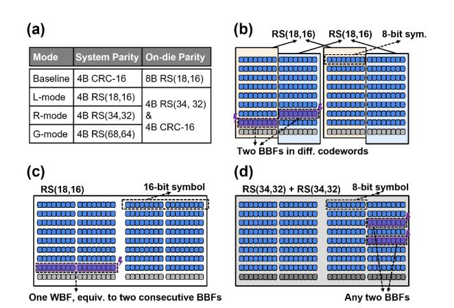
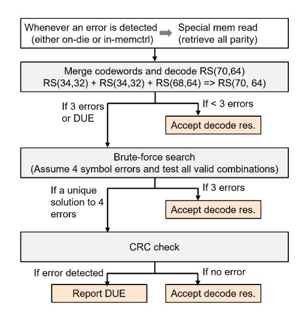
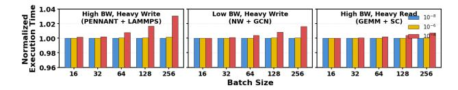
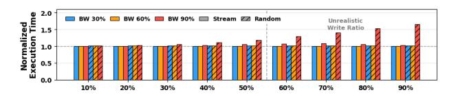
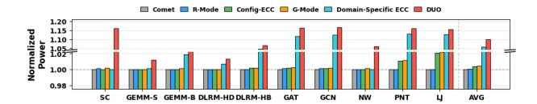

# *C. Decoupled Read Protection*

To tackle challenge ➌ (Section III-B), i.e., enabling HBM to verify internally fetched data during read operations, we employ a decoupled decoding process for read accesses (similar to [79]). The key idea is straightforward: separate the ECC decoding process into distinct error detection and correction phases. In most cases, only error detection is necessary and affects read latency, because correction is not needed unless an error is actually detected. We apply this detection-only strategy within HBM to verify read data, which is now encoded as regional codewords. This is enabled by a key observation: when an ECC scheme is used solely for error detection, the encoding logic can be reused to perform the decoding process, eliminating the need for a full decoder. A simple method is to regenerate the parity and compare it with the stored parity. As such, the same codeword Merging Unit can be reutilized during reads to perform error detection.

Specifically, when a regional codeword is fetched from the memory arrays, both the ODECC and CRC units perform error detection. If any error is detected, HBM does not attempt correction; instead, an alarm signal is sent to the processor4 . This also ensures that HBM-CASO remains compatible with the error scrubbing mechanism built inside the stack, which periodically scans the storage space to identify errors. On the memory controller side, if no alarm signal is received (i.e., no error is detected), global parity is used to perform an additional verification of the data, which also covers potential transmission errors. If an error is detected, the memory controller initiates a special memory access to retrieve all parity information, including both regional ECC parity and CRC parity. Under this special scenario, parity and metadata can be transferred through the regular data channel along with the data block by extending the burst length (similar to DUO [18]). Finally, with all data and parity collected, error correction is carried out in the memory controller. However, the hybrid organization of global and regional codewords results in an irregular decoding process for error correction. To tackle this problem, we propose a tiered error correction procedure in Section V-C.

#### *D. Diverse Protection Modes*

Recall that HBM-CASO is an augmented, additional mode that enables the above key functions, including codeword merging, delayed write verification, and decoupled read protection. This new mode can be added to the DRAM mode register, which already defines multiple DRAM operational modes, such as the power-down mode, self-refresh mode, etc [24], [25]. In particular, there are two approaches to managing the HBM-CASO mode: it can either be enabled globally for the whole memory (in a static manner), or enabled per memory block dynamically. In the static case, HBM-CASO must remain enabled until the HBM device is turned off. In the dynamic case, a flag stored in metadata indicates whether a block should be accessed using HBM-CASO or normal HBM modes, allowing the memory controller and ODECC logic to choose the appropriate resources.

In addition to using global codewords as system ECC, we can fine-tune the utilization of local and regional codewords to accommodate a variety of deployment scenarios. For example, if a processor supports only simple local codes (RS(18, 16)), HBM-CASO can be configured with 4B local SysECC parity and 4B regional ODECC parity. Compared to the baseline mode where systems only provide basic CRC protection, this configuration increases the Hamming distance and improves error correction capability in the presence of a small number of errors (see Section II-C). We refer to this configuration as the L-mode, where "L" denotes a *local* system codeword. In HPC environments with high reliability requirements, processors

4 If this alarm signal is not available, one can send a special data pattern to indicate the issue, similar to the "catchword" in [52].

may support stronger ECC schemes. In such cases, regional (RS(34, 32)) and global (RS(68, 64)) codes can be used, referred to as R-mode and G-mode, respectively. Based on the system's ECC capability, ordered from low to high, the configurations are summarized in Figure 4(a).

Fig. 4. (a) Available modes in HBM-CASO. (b)–(d) Codeword organizations according to the subarray layout: (b) Baseline(8b), (c) Baseline(16b), and (d) HBM-CASO (R-mode).

#### E. Compatibility with 16-bit Symbols

Some modern HBM designs propose using 16-bit symbols to better align with burst errors occurring within each 16-bit sub-wordline [20], [56], [62]. This expands a "local" RS(18, 16) codeword to 288 bits, comprising 256 bits of data and two 16-bit check symbols. HBM-CASO remains applicable to this 16-bit-based RS(18, 16). One approach is to reduce each 16-bit parity to 8 bits by linearly combining its lower and upper bytes over  $GF(2^8)^5$ . This forms a regional RS(34, 32) code and frees 2B parity space for system ECC, enabling the same merging process as in Section IV-A. Accordingly, the merging expression becomes:  $p_{regional\_0} = p_{local\_0L} + \alpha^8 * p_{local\_0H}$ , where  $p_{local\_0L}$  and  $p_{local\_0H}$  denote the lower and upper 8 bits of the 16-bit parity, respectively.  $\alpha^8$  is the binary value  $100000000_2$  under the polynomial representation of  $GF(2^8)$ .

Note that the baseline discussed in prior subsections, based on 8-bit-symbol RS(18, 16) and referred to as Baseline(8b), is actually more efficient than the 16-bit-symbol scheme, referred to as Baseline(16b) (see simulation results in Section VI-A1). As illustrated in Figure 4(b) and (c), both Baseline(8b) and Baseline(16b) can correct up to 16-bit burst errors. However, Baseline(16b) requires the errors to be within a contiguous 16-bit span (i.e., one WBF), whereas Baseline(8b) can correct any two-byte errors (BBFs) as long as they occur in separate 16B data blocks. Our proposed HBM-CASO offers stronger protection than Baseline(8b). For example, R-mode can correct any two-byte errors occurring within the same 32B data block (Figure 4(d)).

 $^5$ Mathematically, the RS code is based on a specific polynomial over  $GF(2^m)$ , where m is the symbol size. The above folding process requires the polynomial over  $GF(2^{16})$  to be reducible to a polynomial over  $GF(2^8)$ .

#### V. DISCUSSION

#### A. Extending HBM-CASO to Other ECC Schemes

Even though RS codes are a primary option in modern HBM [62], [68], other ECC schemes may be adopted in future designs [57]–[59]. Accordingly, HBM-CASO is designed to be extensible and not restricted to RS codes.

Recall that the first critical step of HBM-CASO is to use lightweight logic to merge ODECC so as to free parity space for SysECC. Once this step is completed, the remaining proposed techniques in HBM-CASO, e.g., delayed write verification, can be applied in the same manner. Specifically, other popular coding schemes, such as Hamming codes, residue codes [46], and certain algorithm-oriented ECC designs [4], [22], [81], can also be merged, since they all preserve linear properties that allow algebraic composition of parity information. For example, let  $p_{a,i}$  and  $p_{b,i}$  be the i-th parity bits of two SEC(71, 64) codewords a and b, respectively. They can be merged into a larger SEC(136, 128) codeword c as follows:

$$p_{c,i} = p_{a,i} \oplus p_{b,i}, \quad i \in \{0, 1, 2, \dots, 6\}$$

$$p_{c,7} = d_{c,0} \oplus d_{c,1} \oplus d_{c,2} \oplus \cdots \oplus d_{c,63}$$

Note that an SEC(136, 128) has one more parity bit than an SEC(71, 64). This additional bit  $p_{c,7}$  can be constructed by checking the parity of the first 64 data bits in c (which originally came from a). During decoding, if  $p_{c,7}=1$ , the error lies in the first 64-bit half of c. This reduces to an SEC(71,64) decoding, where the remaining parity bits ( $p_{c,0}$  to  $p_{c,6}$ ) can be used to complete the correction. Otherwise, if  $p_{c,7}=0$ , the error lies in the second half of c and can be corrected similarly. Consequently, this merging approach enables a larger SEC(136, 128) at minimal cost by reusing the existing SEC(71, 64) parity results instead of recomputing parity from the original data. The same concept can be extended to SEC-DED constructions, which we omit here for brevity.

This merging strategy can also be applied to non-binary codes. Taking residue codes as an example, a common way to compute the parity of a data word  $d_a$  is  $p_a = d_a \mod m$ , where m is a predefined constant. Consider two 64-bit words  $d_a$  and  $d_b$ . Their corresponding parities can be merged as6:

$$p_c = (p_a + C \cdot p_b) \bmod m$$

where C is a precalculated constant  $2^{64} \mod m$ , as the second 64-bit block is effectively shifted by 64 bits in the concatenated 128-bit word. Following the same principle, the parity of the 128-bit word can be obtained by combining the two smaller codeword parities rather than recomputing it from the original data.

6Specific implementations may use different algebraic forms. For example, [46] computes parity as  $p=m-a << r \mod m$ . But these variants preserve the same property of codeword merge.

## B. Access Granularity Impact

The choice of a protection mode is also determined by HBM access granularity. For smaller 32B access granularity (e.g., in modern GPUs), HBM-CASO is typically limited to L- and R-modes. For larger 64B accesses (e.g., in CPUs), G-mode is preferred. Notably, G-mode can still be applied in 32B scenarios when applications are not write-intensive. Benefiting from the decoupled read strategy (Section IV-C), for each 32B read access, one can use the associated 2B regional parity to solely perform error detection (across both on-die and system decoding processes). The global parity does not need to be read unless errors are actually detected. However, for write operations, the mismatched access and ECC encoding granularity can lead to read-modify-write (RMW) overhead, a challenge commonly seen in NVM designs. In fact, there is an intrinsic trade-off between fine access granularity (i.e., small codeword size) and strong ECC capability (i.e., high coding efficiency). This leads to a longstanding challenge in memory design, where improved error correction often comes at the cost of coarser access granularity, such as [19], [80]. The focus of our work is not on resolving this fundamental trade-off. Instead, we advocate the necessity of providing a flexible interface that allows modern HBM to accommodate advanced ECC schemes (in case the system can manage to provide such ECC).

Moreover, future memory subsystems are likely to benefit from supporting coarser access granularities. HBM is increasingly adopted across a broad spectrum of processors, including CPUs (server-class), GPUs, TPUs [32], and other emerging NPUs [21], [23], [40]. Many of these processors operate with larger access granularity (64B~512B) to meet the large dataaccess pattern demands of prevalent AI applications. HBM-CASO is scalable to support such granularity. For example, if a system is configured with larger 128B access granularity providing a 24B parity space that includes 8B system ECC, 8B ODECC, and 8B CRC — the global system codeword can be scaled to an even larger one (e.g., RS(136, 128)) to enable more robust protection. Also, HBM-CASO can be upgraded as ODECC advances. For instance, if future HBM scales its ODECC to the regional level, the same merging strategy can be applied. In that case, the on-die parity column in Figure 4(a) would be upgraded to 4B RS(68, 64) (along with an additional 4B for CRC).

## C. Suggested Error Correction Flow

In this subsection, we provide suggestions, instead of directives, for the processor-side error correction. Unlike traditional RS decoding with a fixed codeword size, our scheme combines global and regional codewords. We propose a tiered correction flow that adapts to error severity. As shown in Figure 5, the initial step in the correction phase is to merge two received regional RS(34, 32) codewords into RS(66, 64). This extends the global RS to RS(70, 64) with 6 check symbols. This standard codeword form corrects up to 3 symbol errors within a 64B block, and more importantly, allows us to use the standard Berlekamp-Massey algorithm [64] to perform error

Fig. 5. The error correction flow for G-mode

correction efficiently. Recall that using the maximum correction capability is not always suggested due to the increased risk of miscorrection (see Section II-C). Therefore, if RS(70,64) decoding yields exactly 3 errors (or a DUE), the result is discarded, and decoding reverts to the combined global and regional codewords.

Theoretically, with 4 global and 4 regional check symbols, up to 4 symbol errors can be corrected. We employ a brute-force search by assuming that 4 specific symbols are erroneous and testing all  $\binom{72}{4}$  error positions (excluding cases where all four lie in the same 32B region, totaling 956,870 combinations). If the best match contains fewer than four actual errors, that solution is adopted. If exactly four errors are found, a CRC check is applied, and the result is accepted only upon passing.

In short, correction latency scales with error count. Cases with  $\leq 2$  errors can be efficiently handled by hardware in the memory controller, while rarer multi-error cases should be offloaded to software to avoid the cost of additional hardware.

#### D. Theoretical Analysis

In memory subsystems, an RS(N, K) code with an m-bit symbol size is defined over  $GF(2^m)$  [43], where  $N \leq 2^m - 1$ . This linear code is uniquely characterized by a Vandermonde matrix [61], a.k.a., H-matrix, which governs parity checking and dictates the structure of the encoder/decoder and the error correction and detection capabilities of the code. For instance, a baseline RS(18, 16) code can be constructed using a  $2 \times 18$  H-matrix:

$$H_{local} = \begin{bmatrix} H_{L0} & H_{L1} \end{bmatrix}^\mathsf{T} = \begin{bmatrix} \alpha^0 & \alpha^1 & \cdots & \alpha^{17} \\ \alpha^0 & \alpha^2 & \cdots & \alpha^{34} \end{bmatrix}$$

where  $\alpha$  is typically a primitive element of the finite field. The encoding for a set of data symbols is a process of finding a few appropriate parity symbols that make  $H \times \vec{w} = 0$ , where  $\vec{w}$  is the codeword that contains both data and parity symbols.

Fig. 6. H matrices over a 64B data block under (a) Baseline, (b) R-mode, and (c) G-mode. (d) a subset of the G-mode matrix

For RS(18, 16),  $\vec{w} = (d_0, d_1, \dots, d_{15}, p_0, p_1)$ . Similarly, the H-matrix for a regional RS(36, 32) code can be expressed as:

$$H_{regional} = \begin{bmatrix} H_{R0} & H_{R1} & H_{R2} & H_{R3} \end{bmatrix}^{\mathsf{T}}$$
$$H_{Ri} = \begin{bmatrix} \alpha^0 & \alpha^i & \cdots & \alpha^{35*i} \end{bmatrix}, \quad i \in \{0, 1, 2, 3\}$$

Based on the property of Vandermonde matrices, the first two rows of the above regional H-matrix can be expressed as  $H_{Ri} = \begin{bmatrix} H_{Li} & \alpha^{18*i} * H_{Li} \end{bmatrix}, \quad i \in \{0,1\}$ . This demonstrates that a subset of a regional H-matrix is a linear combination of two local H-matrices. Accordingly, the associated codewords, linearly generated from these H-matrices, inherit the same linear structure.

To carry out decoding, the codeword needs to be multiplied by the H-matrix to produce a set of syndromes  $\vec{s}$ . Then the error pattern  $\vec{e} = (0, \dots, e_i, \dots, 0)$ , where i denotes the location of the error, can be derived from  $H \times \vec{e} = \vec{s}$ . For instance, the local RS(18, 16) codeword can produce two syndromes  $s_0$  and  $s_1$ , which can be used to solve two variables, i.e., the error location (i) and the error value itself.

To cover a 64B data block, it requires four local H-matrices, which form a diagonal matrix, as shown in Figure 6(a). For  $\vec{e}=(0,\ldots,e_i,\ldots,e_j,\ldots,e_k,\ldots,e_l,\ldots,0)$ , this matrix can only correct errors in a distributed pattern  $\textcircled{1}: i \in [0,17], j \in [18,35], k \in [36,53],$  and  $l \in [54,71],$  that is, each error element is confined within one 18B codeword. In contrast, as shown in Figure 6(b), for R-mode using regional H-matrices, the shaded areas expand. As a result, a more flexible error pattern 2 can be corrected:  $i,j \in [0,35]$  and  $k,l \in [36,71],$  that is, each pair of error elements is confined within one 36B codeword. In other words, since the diagonal matrix in the baseline is a subset of the R-mode matrix, every error pattern that the local code can correct is also correctable by the regional R-mode code.

In line with this concept, G-mode uses a hybrid of global and regional codes to further extend coverage, as shown in Figure 6(c). Consequently, the error patterns ① and ②, which

the R-mode code can already correct, are also correctable in G-mode. Moreover, this G-mode enables correction of an additional error pattern  $\textcircled{3}: i \in [0,35]$  and  $j,k,l \in [36,71]$ , that is, one 36B codeword contains a single symbol error while the other has three symbol errors (or vice versa). This specific pattern can be completely corrected using the matrix shown in Figure 6(d), which is a subset of the G-mode matrix. However, for the error pattern  $\textcircled{4}: i,j,k,l \in [0,35]$ , where all 4 errors concentrate in one 36B codeword, G-mode cannot correct the errors since the matrix in Figure 6(c) still contains zero entries.

#### VI. EXPERIMENT

We evaluate HBM-CASO in terms of reliability, hardware overhead, performance, and power.

 $\label{thm:table in the configuration} TABLE\ I$  Comparison of ECC schemes and their configurations.

| Scheme          | On-die ECC             | System ECC      |
|-----------------|------------------------|-----------------|
| Baseline(8b)    | RS(19, 17)* + CRC-8    | CRC-8           |
| Baseline(16b)   | $RS(19, 17)^* + CRC-8$ | CRC-16          |
| R-mode          | RS(36, 34)*            | RS(34, 32)      |
| G-mode          | RS(36, 34)*            | RS(68, 64)      |
| DUO [18]        |                        | RS(72, 64)      |
| Config-ECC [10] | CRC-24                 | RS(72, 70)      |
| COMET [3]       | SECDED(76, 68)*        | SECDED(104, 96) |
| Domain-ECC [78] | CRC-16                 | RS(544, 512)    |

\* denotes codes that further include metadata space on DRAM dies.

#### A. Experimental Methodology

Table I summarizes the evaluated ECC schemes. In addition to the two baselines, HBM-CASO is further compared against four representative schemes that cover four ECC study categories.

- Baseline(8b) and Baseline(16b): two default protection baselines following prior HBM studies [20], [39], [56], [62].
- **DUO** [18]: a representative of schemes that expose on-die ECC redundancy to the memory controller and coordinate it with stronger system-level protection, as also explored in prior work such as XED [52] and Bamboo ECC [36].
- Config-ECC [10]: a representative of tiered ECC designs for HBM. It employs a two-tier protection structure to support different access granularities, capturing a line of work on multi-level memory protection [31], [51], [74].
- **COMET** [3]: a representative of stronger bit-level ECC designs. It combines on-die and system ECCs and mitigates the silent miscorrection risk of conventional SEC-based on-die ECC through redesigned local coding [13].
- **Domain-Specific ECC** [78]: a representative of controller-level large-codeword ECC designs. It captures recent protection approaches for modern AI workloads by expanding the ECC coverage domain, similar to prior large-codeword studies [29], [30], [80].
- 1) Reliability Evaluation: We first assess error coverage and correction capability at data-block granularity. We use the four fault types defined in Section II-B and simulate 15

representative patterns (combinations of the four types). This experiment is motivated by the fact that modern HBM failures often manifest not only as isolated bit upsets, but also as burstor region-level corruptions at the data interface, which directly determine the effective protection capability of different ECC schemes. Following prior reliability studies [35]–[37], we perform 109 Monte Carlo injections for each error scenario. In each trial, fault locations are randomly placed within the protected data block, and the decoding result is classified as DCE, DUE, or SDC. For burst faults (BBF/WBF/SAF), we adopt the same randomized corruption methodology commonly used in prior work [36]: each bit within the affected burst region is flipped with 50% probability, conditioned on at least one bit flip. This models a worst-case random corruption scenario where each bit may independently flip to a random value, which statistically results in 50% bit flips. For example, under a 1BBF injection, the 8 bits in the affected byte are each flipped with 50% probability, so one injected BBF may produce anywhere from 1 to 8 flipped bits, capturing diverse corruption patterns within the same burst-fault granularity.

We also evaluate transmission error detection using the same fault models and Monte Carlo injection framework, following prior work [5], [35]–[37]. Since transmission protection only requires error detection (detected errors trigger retransmission), we report the *undetected* error rate (UE%). Baseline(8b) and Baseline(16b) use CRC-8 and CRC-16, respectively. In contrast, R-mode and G-mode reuse their regional and global protection mechanisms for transmission detection. For read transfers, the received data is verified by reconstructing the corresponding regional or global codewords in the memory controller. For write transfers, recall that HBM accumulates parity, and a similar process is performed on the memory controller side. Any mismatch between the accumulated parity triggers retransmission of the entire batch.

We further examine the impact of cumulative faults on long-term reliability (i.e., lifetime), where faults occur across the entire memory space and accumulate over time. Such effects cannot be fully captured by data-block-level coverage analysis alone. This is particularly important for HBM in HPC systems, where even low fault rates can scale to a large number of devices [44]. We simulate a six-year HBM deployment using a fault-mode-aware injection framework, following the modeling methodology in DUO [18] and RATT [11]. Failure rates (FIT) and fault-type distributions (e.g., bit/ word/row/bank) are derived from DRAM fault studies on real-world HPC systems [17], [72]. Following the operational model of FaultSim [50], we use a 3-hour simulation interval for fault injection and ECC checking, and invoke memory scrubbing every 12 hours. Transient faults are cleared by scrubbing, while permanent faults persist unless corrected. In each simulated hour, faults are injected into randomly selected cachelines and each affected cacheline is decoded and classified as DCE, DUE, or SDC. To capture rare but impactful events such as SDC, we simulate 1012 cachelines per configuration, enabled by FaultSim's event-driven engine that bypasses unnecessary state updates during fault-free periods.

We evaluate two representative injection configurations: *Permanent-only* (p = 10−4 , t = 0) and *Mixed (with moderate transient)* (p = 10−5 , t = 10−5 ), where p and t denote the permanent and transient fault rates, respectively. Their values are derived from FIT rates and conservatively scaled by 10× to reflect HBM's increased vulnerability [11], [27].

TABLE II SIMULATION SETUP

| Processor            | GPU: 80 CUs, 4 SIMD/CU, Max 10 Wavefronts/SIMD L1 16 KB/CU; L2 4 MB; Lat. 50/125/225 cycles                                                                                                                         |
|----------------------|------------------------------------------------------------------------------------------------------------------------------------------------------------------------------------------------------------------------|
| Memory Controller | Scheduler: FR-FCFS Read buffer: 64; Write buffer: 64 Address mapping: RoBaRaCoCh                                                                                                                                 |
| DRAM Memory       | HBM3, 16 channels, 16 banks, Row 1024 B, BL=16 Peak Bandwidth: 819.2 GB/s tRC-tRCD-tRP-tRAS: 45-18-16-29 tCL-tFAW-tBURST: 16-16-1.25 tCCDS-tCCDL-tRRD: 1.25-2.5-2 IDD4R=839 mA; IDD7=958 mA; Iact=36 mA |
| Workloads            | Rodinia [9]: StreamCluster, NW GNN [77]: GAT Cora, GCN Cora HPC [75]: LAMMPS LJ, PENNANT GEMM [54]: GEMM Softmax, GEMM Base DLRM [53]: High Batch, High Dimension                                          |

*2) Performance Evaluation:* We evaluate performance using Ramulator2 [45]. The timing parameters of HBM3 are derived from [1], as listed in Table II. Memory traces are collected through the state-of-the-art GPU dynamic binary instrumentation tool [76]. The memory controller uses the default open-page and FR-FCFS scheduling policy. The read- /write buffer size is 64 cache lines. Note that the adoption of R-mode or G-mode introduces only a slight increase in access latency. Based on hardware simulation results (Table V), we model this as an additional 0.25ns and 0.51ns added to the tCL parameter of HBM when switching from the baseline to R-mode and G-mode, respectively.

In addition to basic performance evaluation, we further explore the impact of batch sizes and write ratios. To study the batch-size impact, we sweep the verification batch size from 16 to 256 under three raw bit error rates (BERs): 10−8 , 10−6 , and 10−4 . To study the write-ratio impact, we sweep the write ratio using self-developed microbenchmarks with both streaming and random access patterns, and evaluate the worstcase performance overhead of G-mode under fine-grained (32B) access granularity. This fine-grained setting is not the recommended configuration for G-mode, which prefers 64B granularity, but serves to quantify its upper-bound overhead.

*3) Hardware Overhead and Power Evaluation:* We synthesize all ECC encoders and decoders using Synopsys Design Compiler [14] with a 45 nm process. On-die ECC pipelines are designed for the full correction path, so the detection latency on the on-die side is subsumed and omitted. On the memory-controller side, full correction is triggered only after an error is detected, which is rare in normal operation. On the other hand, power is evaluated using DRAMSim3 [42] with consistent per-scheme timing parameters. The latency

TABLE III COVERAGE COMPARISON OF ECC SCHEMES

|                             |                        | Baseline(8b) |       | Baseline(16b) | R-mode G-mode |       |       | DUO   |       | Config-ECC |       | COMET |        | Domain-ECC |       |       |
|-----------------------------|------------------------|--------------|-------|---------------|------------------|-------|-------|-------|-------|------------|-------|-------|--------|------------|-------|-------|
| Error Type                  | DCE                    | DUE          | DCE   | DUE           | DCE              | DUE   | DCE   | DUE   | DCE   | DUE        | DCE   | DUE   | DCE    | DUE        | DCE   | DUE   |
|                             | Simple Fault Scenarios |              |       |               |                  |       |       |       |       |            |       |       |        |            |       |       |
| 1SBF                        | 100.0                  | 0.000        | 100.0 | 0.000         | 100.0            | 0.000 | 100.0 | 0.000 | 100.0 | 0.000      | 100.0 | 0.000 | 100.0  | 0.000      | 100.0 | 0.000 |
| 1BBF                        | 100.0                  | 0.000        | 100.0 | 0.000         | 100.0            | 0.000 | 100.0 | 0.000 | 100.0 | 0.000      | 100.0 | 0.000 | 3.153  | 81.34      | 100.0 | 0.000 |
| 1WBF                        | 100.0                  | 0.000        | 100.0 | 0.000         | 100.0            | 0.000 | 100.0 | 0.000 | 100.0 | 0.000      | 0.850 | 99.15 | 0.042  | 78.76      | 99.99 | 0.000 |
| 2SBF                        | 76.57                  | 23.43        | 56.27 | 43.73         | 100.0            | 0.000 | 100.0 | 0.000 | 100.0 | 0.000      | 1.564 | 98.44 | 100.0  | 0.000      | 100.0 | 0.000 |
| 2BBF                        | 76.50                  | 23.50        | 56.31 | 43.69         | 100.0            | 0.000 | 100.0 | 0.000 | 100.0 | 0.000      | 0.000 | 100.0 | 0.135  | 72.19      | 99.99 | 0.000 |
| 1SBF+1WBF                   | 51.63                  | 48.37        | 54.81 | 45.19         | 51.59            | 48.41 | 100.0 | 0.000 | 100.0 | 0.000      | 0.000 | 100.0 | 0.0260 | 77.54      | 99.99 | 0.000 |
| 2WBF                        | 0.000                  | 100.0        | 50.02 | 49.98         | 50.03            | 49.97 | 100.0 | 0.000 | 100.0 | 0.000      | 0.000 | 100.0 | 0.000  | 64.84      | 99.99 | 0.000 |
| Complicated Fault Scenarios |                        |              |       |               |                  |       |       |       |       |            |       |       |        |            |       |       |
| 3SBF                        | 41.02                  | 58.98        | 9.748 | 90.25         | 77.27            | 22.73 | 100.0 | 0.000 | 100.0 | 0.000      | 0.024 | 99.98 | 100.0  | 0.000      | 100.0 | 0.000 |
| 1SBF+2BBF                   | 40.93                  | 59.07        | 9.723 | 90.28         | 77.42            | 22.58 | 100.0 | 0.000 | 100.0 | 0.000      | 0.000 | 100.0 | 0.096  | 70.29      | 99.99 | 0.000 |
| 3BBF                        | 41.04                  | 58.96        | 9.772 | 90.23         | 77.32            | 22.68 | 100.0 | 0.000 | 100.0 | 0.000      | 0.000 | 100.0 | 0.006  | 62.90      | 99.99 | 0.000 |
| 2SBF+1WBF                   | 14.17                  | 85.83        | 6.729 | 93.27         | 26.61            | 73.39 | 100.0 | 0.000 | 100.0 | 0.000      | 0.000 | 100.0 | 0.018  | 78.33      | 99.99 | 0.000 |
| 4SBF                        | 13.03                  | 86.97        | 1.397 | 98.60         | 42.16            | 57.84 | 98.95 | 1.042 | 100.0 | 0.000      | 0.000 | 100.0 | 27.66  | 72.34      | 99.99 | 0.000 |
| 4BBF                        | 13.06                  | 86.94        | 1.401 | 98.60         | 42.17            | 57.83 | 98.96 | 1.036 | 100.0 | 0.000      | 0.000 | 100.0 | 0.000  | 55.54      | 99.99 | 0.000 |
| 3SBF+1WBF                   | 0.659                  | 99.34        | 0.696 | 99.30         | 1.264            | 98.73 | 4.754 | 95.25 | 4.787 | 95.21      | 0.000 | 100.0 | 0.004  | 77.36      | 99.99 | 0.000 |
| 1SAF                        | 0.000                  | 100.0        | 0.000 | 100.0         | 0.000            | 100.0 | 0.000 | 100.0 | 0.000 | 100.0      | 0.000 | 100.0 | 0.000  | 25.49      | 0.000 | 99.99 |

*SDC is omitted and can be derived as SDC(%) = 100%* − *DCE(%)* − *DUE(%)*

overhead from hardware evaluation is incorporated into tCL to ensure timing consistency.

#### *B. Experimental Results*

*1) Reliability:* Table III shows the error coverage and correction capability of different schemes. Both R-mode and Gmode substantially improve coverage over the baselines, especially under complex faults. For example, under 2SBF, R-mode and G-mode both achieve 100% DCE, while Baseline(8b) and Baseline(16b) drop to 76.57% and 56.27%, respectively. Under 4SBF, G-mode still maintains 98.95% DCE with only 1.042% DUE, whereas R-mode drops to 42.16% DCE and the two baselines fall to 13.03% and 1.397% DCE, respectively. In all evaluated scenarios, R-mode and G-mode show no observable SDC.

Among prior designs, DUO provides the strongest error correction capability, achieving 100% DCE in all listed scenarios except 3SBF+1WBF and 1SAF. Config-ECC degrades sharply beyond its narrow correction range, with only 1.564% DCE on 2SBF and 0% on 4SBF. COMET is particularly vulnerable to burst faults, with only 3.153% DCE on 1BBF and 0.135% on 2BBF. Domain-ECC achieves near-perfect DCE in most scenarios, but still fails on 1SAF, where it reports 99.99% DUE. Overall, G-mode provides clearly stronger protection than the baselines, Config-ECC, and COMET, while R-mode remains an effective middle ground with strong correction capability and negligible SDC.

Table IV shows the transmission error detection capability. All schemes achieve a zero undetected error rate (UE%) for single-fault cases. Under multi-fault patterns, however, the baselines begin to expose non-zero UE. Specifically, Baseline(8b) reaches up to 0.096% UE, while Baseline(16b) reaches up to 0.021%. In contrast, R-mode significantly reduces undetected errors, with only 0.001% UE observed under the 1SAF case, while G-mode eliminates undetected errors

TABLE IV UNDETECTED TRANSMISSION ERROR RATES (UE%)

| Error Type                  | Base.(8b) | Base.(16b) | R-mode | G-mode |  |  |  |  |  |
|-----------------------------|-----------|------------|--------|--------|--|--|--|--|--|
| Simple Fault Scenarios      |           |            |        |        |  |  |  |  |  |
| 1SBF                        | 0.000     | 0.000      | 0.000  | 0.000  |  |  |  |  |  |
| 1BBF                        | 0.000     | 0.000      | 0.000  | 0.000  |  |  |  |  |  |
| 1WBF                        | 0.000     | 0.000      | 0.000  | 0.000  |  |  |  |  |  |
| Complicated Fault Scenarios |           |            |        |        |  |  |  |  |  |
| 2SBF                        | 0.000     | 0.000      | 0.000  | 0.000  |  |  |  |  |  |
| 3SBF                        | 0.024     | 0.000      | 0.000  | 0.000  |  |  |  |  |  |
| 4SBF                        | 0.003     | 0.001      | 0.000  | 0.000  |  |  |  |  |  |
| 1SBF+1BBF                   | 0.096     | 0.001      | 0.000  | 0.000  |  |  |  |  |  |
| 2BBF                        | 0.095     | 0.002      | 0.000  | 0.000  |  |  |  |  |  |
| 3BBF                        | 0.036     | 0.021      | 0.000  | 0.000  |  |  |  |  |  |
| 1SAF                        | 0.003     | 0.001      | 0.001  | 0.000  |  |  |  |  |  |

across all evaluated cases. This improvement comes from the stronger regional/global codewords used on reads and the accumulated parity verification used on writes, which together provide more reliable transmission protection than CRC-only designs. Compared to R-mode, G-mode benefits from its larger global verification domain, and therefore achieves the strongest detection capability.

Figure 7 shows the lifetime DUE/SDC trends under two fault settings: permanent-only stress (p = 10−4 , t = 0) and mixed faults (p = 10−5 , t = 10−5 ). Under permanentonly stress, both R-mode and G-mode substantially improve reliability over the baselines, Config-ECC, and COMET, with G-mode providing the stronger protection. By Year 6, Gmode reduces DUE to 1.6 × 10−3 and SDC to 1 × 10−10 , while remaining competitive with the strongest prior schemes. Although Domain-Specific ECC achieves the lowest DUE and DUO attains the lowest SDC, G-mode still offers a strong overall balance between the two metrics and clearly outperforms

Fig. 7. Lifetime DUE (top) and SDC (bottom) over six years under two fault settings:  $p=10^{-4}$  (left) and  $p=10^{-5}, t=10^{-5}$  (right).

Domain-Specific ECC in long-term SDC behavior. Under mixed faults, the relative ranking remains similar, but both the absolute error rates and their growth trends become lower. For example, G-mode's SDC further drops to  $5\times10^{-12}$  at Year 6. This reduction is because the permanent-fault rate is lower and transient faults are periodically removed by scrubbing.

TABLE V
AREA AND LATENCY COMPARISON OF DIFFERENT ECC SCHEMES

| Scheme    | Log  | ic (cell o | count) | Area | $(\mu \mathbf{m}^2)$ | Latency (ns) |       |       |  |
|-----------|------|------------|--------|------|----------------------|--------------|-------|-------|--|
|           | OD   | MC-D       | мс-с   | OD   | MC                   | OD           | MC-D  | мс-с  |  |
| Base.(8b) | 4027 | 163        | _      | 1113 | 97                   | 1.40         | 0.39  | _     |  |
| R-mode    | +61  | 5576       | 1837   | +17  | 2100                 | +0.04        | +0.21 | 2.52  |  |
| G-mode    | +61  | 15K        | 5256   | +17  | 5910                 | +0.04        | +0.47 | 4.56  |  |
| Config    | 184  | 8637       | 1918   | 53   | 3176                 | 0.43         | 0.41  | 1.87  |  |
| DUO       | _    | 35K        | 7488   | _    | 9637                 | _            | 2.77  | 4.77  |  |
| Domain    | 486  | 163        | 729K   | 141  | 169K                 | 0.62         | 0.39  | 19.84 |  |
| COMET     | 868  | 683        | 718    | 242  | 381                  | 0.46         | 0.56  | 0.73  |  |

&quot;+" denotes overhead over baseline. "MC-D" and "MC-C" denote error detection and correction units in MC, respectively.

2) Hardware Overhead: Table V shows that HBM-CASO preserves near-baseline on-die cost while moving stronger protection logic to the memory controller (MC). Compared to the baseline on-die (OD) logic (4027 cells,  $1113 \, \mu m^2$ ), the proposed design adds only 61 cells and  $17 \, \mu m^2$  of on-die area, keeping the on-die correction latency nearly unchanged. The merged-codeword logic is implemented in the memory controller: R-mode introduces moderate overhead ( $2100 \, \mu m^2$ ,  $0.21 \, ns$  detection latency, and  $2.52 \, ns$  correction latency) in the controller, while G-mode further increases logic ( $5910 \, \mu m^2$ ,  $0.47 \, ns$ , and  $4.56 \, ns$ ) to provide stronger protection. Despite these additions, the overall latency overhead remains small, adding only  $0.25 \, ns$  for R-mode and  $0.51 \, ns$  for G-mode under normal conditions (i.e., when no errors are detected).

Compared to prior work, lightweight schemes such as Config-ECC and COMET maintain low hardware cost but provide weaker protection. Domain-Specific ECC incurs substantially higher memory-controller-side complexity due to its very large codeword, requiring  $169 \mathrm{K} \, \mu \mathrm{m}^2$  of MC area and  $19.84 \, \mathrm{ns}$  correction latency. DUO also introduces larger mem-

ory controller logic than HBM-CASO, requiring  $9637 \, \mu m^2$  of MC area and 4.77 ns correction latency. However, the hardware overhead of Domain-Specific ECC and DUO is not the primary limitation of the design; their performance implications are analyzed in the next subsection. In comparison, HBM-CASO achieves strong reliability while keeping memory controller overhead moderate and preserving near-baseline ondie timing.

Fig. 8. (a) Basic performance comparison among different ECC schemes. (b) Impact of error rate on performance.

3) Performance Results: Figure 8(a) shows the performance of the evaluated ECC schemes. R-mode, COMET, and Config-ECC achieve near-baseline performance (< 0.5%overhead) across all workloads. As discussed in Section V-B, G-mode is recommended for processors (e.g., CPUs) with 64B memory access granularity. However, to maintain consistency with our GPU-centric setup, we employ RMW (read-modifywrite) to adapt G-mode to the finer 32B granularity. Despite this, G-mode still delivers near-baseline performance across most workloads. In contrast, DUO incurs significant overhead in most workloads (up to 12%) due to additional bandwidth consumption for parity transfer. Domain-Specific ECC also shows substantial overhead in specific workloads (more than 25%) due to its extremely large access granularity. Figure 8(b) shows the error-rate impact on performance over two representative workloads. When the error rate is below  $10^{-6}$ , the overhead of R-mode, G-mode, COMET, and Config-ECC remains negligible. Noticeable overhead appears only when the error rate rises to an extreme level (e.g.,  $10^{-4}$ ), reaching around 2\% and 5\% for R-mode and G-mode, respectively. However, such an error rate already indicates a device that is effectively unusable [67].

Fig. 9. Normalized execution time of G-mode as a function of batch size (16–256) under different error rates across three representative workloads.

Figure 9 shows the batch-size impact on performance. Recall that the proposed delayed write verification scheme retransmits an entire batch of writes if an error is detected in any write (Section IV-B). As the error rate and batch size increase, the retransmission overhead becomes noticeable. However,

even in the worst case, i.e., high error rate, large batch size, and write-intensive workloads, the overhead remains moderate (∼3%).

Fig. 10. Read-modify-write overhead of G-mode under varying write ratios.

Figure 10 shows the performance under different write ratios. This experiment is to further study the RMW overhead when HBM-CASO is not aligned with the underlying access granularity, although such a configuration is not recommended. We design two microbenchmarks, *Stream* and *Random*, to control the write ratio. With extremely high write ratios (e.g., 90%), the overhead can become significant. However, in practice, the write ratio rarely exceeds 40% [12]. Within this practical range, the overhead remains modest. At a representative 20% write ratio, even under high bandwidth utilization (BW 90%) with the more stressful *Random* trace, the overhead is only around 1%.

Fig. 11. Normalized power overhead of different ECC schemes.

*4) Power:* Figure 11 shows that our schemes introduce almost no additional power overhead. On average, R-mode incurs less than 0.1% power overhead, while G-mode incurs about 0.2%. In contrast, prior schemes show noticeably higher power cost. Domain-Specific ECC typically introduces around 5–8% overhead due to increased memory traffic, while DUO reaches up to 15%. These results indicate that R-mode and Gmode maintain near-baseline power efficiency while enabling stronger ECC protection.

#### VII. RELATED WORK

Previous studies have investigated numerous optimizations for memory ECC. Employing larger codewords is a widely adopted strategy. For instance, Kim *et al.* [36] proposed Bamboo ECC, which extended the capability of traditional AMD Chipkill through the use of cacheline-sized RS(72, 64) codes. But this also came with a substantially higher computational complexity (∼16× that of AMD Chipkill). Zhang *et al.* [80] exploited even larger ECC codewords (e.g., 256B) to improve protection efficiency for non-volatile memory. They also developed a smart cache strategy to tackle the RMW problem induced by large codewords. More recently, Xie *et al.* [78] proposed Domain-Specific ECC, which leveraged large codewords to align with AI workloads, the dominant use case for HBM. This design eliminates ODECC and relies solely on SysECC.

The large-codeword strategy is often coupled with another important ECC optimization known as tiered ECC. For instance, Udipi *et al.* [74] proposed LOT-ECC, which achieved Chipkill-like protection for DDR using only a single ECC chip (traditional Chipkill requires two). LOT-ECC used a tiered structure: small codewords with detection-only parity (e.g., checksums) were grouped into a larger codeword with correction parity (e.g., XOR parity). Building on similar tiered ECC ideas, Jian *et al.* proposed Multi-ECC [29], which used larger codewords to further reduce correction-parity overhead. They later extended this approach and introduced ECC Parity [30], enabling cross-channel protection, covering up to a singlechannel failure. The above ECC strategies have also been applied to HBM protection [10], [11], [31], [49], [51]. For instance, Chen *et al.* proposed Configurable-ECC [10], which used two-tier ECC protection to address both small- and largegranularity faults. Jian *et al.* developed Helix ECC [31], which safeguarded channel- or die-level corruption using a more comprehensive multi-dimensional tiered ECC design.

Some prior studies also optimized ODECC for DIMMs. For example, Gong *et al.* [18] proposed DUO, which used SysECC to take over ODECC. This improved the protection capability but induced bandwidth overhead, since DIMMs do not allocate channel width for on-die parity. Nair *et al.* [52] repurposed ODECC exclusively for error detection, termed XED. This enabled efficient localization of a faulty chip, thereby facilitating more effective correction. However, XED becomes ineffective if a write transfer encounters an error. Jeong *et al.* introduced PAIR [28], which aligned both ODECC and SysECC codeword layouts with DQ pin lines to reduce pin-induced miscorrection risk. Similarly, Alam *et al.* introduced Comet [3], which leveraged both ODECC and SysECC to mitigate the silent miscorrection risk in bit-level errors.

Our proposed HBM-CASO also explores ODECC with the use of larger codewords. *But we target two new challenges: (1) how to effectively reorganize the existing ODECC resources in HBM to provide stronger protection, and (2) how to enable HBM to verify larger, stronger codewords despite its limited ODECC resources.* To address these challenges, HBM-CASO incorporates several new techniques, such as Codeword Merge, Delayed Verification, and Symbol Size Conversion (16b → 8b), that have not been proposed before.

## VIII. CONCLUSION

In conclusion, we proposed HBM-CASO, an efficient interface for advanced system ECC. In particular, it provides enhanced protection modes, e.g., G-mode, which reorganizes ODECC resources to supplement stronger ECC parity and facilitate transmission checking for SysECC.

