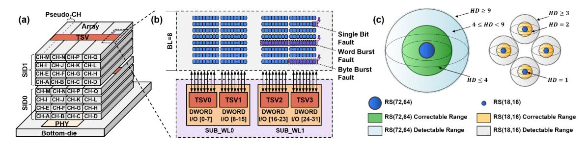
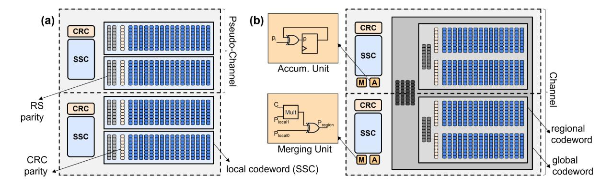

# HBM-CASO: A Coordinated Approach to HBM System-Level and On-Die ECC

Ruizhi Zhu Yanan Guo Huize Li

Orlando, USA Rochester, USA Orlando, USA ruizhi.zhu@ucf.edu yanan.guo@rochester.edu huize.li@ucf.edu

University of Central Florida University of Rochester University of Central Florida

Weidong Cao Qian Lou Xin Xin\* The George Washington University University of Central Florida University of Central Florida

Washington, D.C., USA Orlando, USA Orlando, USA weidong.cao@gwu.edu qian.lou@ucf.edu xin.xin@ucf.edu

*Abstract*—HBM (High-Bandwidth Memory) has progressively strengthened its reliability by employing more advanced ECC (Error Correction Code) techniques, such as Reed-Solomon (RS) codes, to meet the increasing reliability challenges raised from continued technology scaling. Over time, the protection paradigm has shifted from a system-centric approach (i.e., system ECC), where the processor primarily manages error correction, to a memory-centric approach (i.e., on-die ECC), where HBM handles errors independently. Although this shift generally reduces the ECC burden on the processor side, it constrains the flexibility to implement stronger protection schemes, particularly when the processor is capable of supporting more advanced ECC.

To address this problem, we propose HBM-CASO, a new protection mode designed to accommodate advanced system ECC. It strategically reorganizes the on-die ECC resources to generate a stronger on-die codeword as a supplement to the system ECC. Furthermore, due to limited on-die computing resources, HBM cannot directly verify the advanced system ECC. HBM-CASO therefore introduces a delayed verification strategy, which accumulates on-die parity across a batch of writes, rather than verifying each write individually, and validates the entire batch as a whole. Our extensive evaluation results demonstrate that HBM-CASO has effectively enhanced error correction capability, allowing the system to correct a broader range of error patterns with minimal performance and bandwidth overhead.

*Index Terms*—High-Bandwidth Memory, on-die ECC, systemlevel ECC, Reed-Solomon codes, memory reliability

#### I. INTRODUCTION

HBM has emerged as a vital component in High-Performance Computing (HPC) systems, delivering extremely high bandwidth along with a flexible capacity range (16∼192Gb) [56], [62], [63]. This unique advantage makes it well-suited for a broad spectrum of data-intensive tasks, such as machine learning and big data analytics. However, as the technology node scales and architectural complexity increases, HBM faces escalating reliability challenges [16], [17], [41]. Accordingly, protection schemes for HBM have been progressively shifted toward on-die ECC (denoted as ODECC) [13], [33], [56], [62], [71], since memory vendors

In particular, early HBM often relied on system ECC (denoted as SysECC). Unlike ODECC, SysECC refers to ECC implemented and managed by the processor's memory controller. Early SysECC was based on simple bit-level ECC schemes such as SEC-DED (Single-Error Correction, Double-Error Detection). Beginning with HBM2E, on-die bitlevel ECC was introduced to complement the controller-side protection. This trend continues in more recent generations (i.e., HBM3 [25], HBM3E [39], and HBM4 [26]), which advance the approach by augmenting the ODECC with stronger symbol-level schemes (i.e., Reed-Solomon (RS) ECC). Consequently, the controller's role in protection is reduced to error detection only, using lightweight CRC (Cyclic Redundancy Check) through a narrow parity channel solely to ensure transmission correctness. Besides the imperative to manage escalating reliability challenges, this transition to ODECC is further driven by multiple advantages: (1) it standardizes a unified interface, (2) it improves channel bandwidth efficiency by mitigating the overhead of parity transfer, and (3) it also enables proactive error management techniques, such as error scrubbing, which periodically scans the storage space to identify and correct any errors [34], [62].

However, this ODECC-centric strategy compromises the ability to tailor ECC schemes for specific deployment scenarios. This raises a question: *if an HPC processor requires stronger ECC and is capable of providing it, how can modern HBM efficiently extend its fixed ODECC mechanism to meet this need?* Previous studies introduced two approaches to tackle this problem. The first, represented by DUO [18], is to employ advanced SysECC to directly replace simple ODECC. However, this is challenging because only a limited parity channel width (4 bits per 64-bit data) and parity storage space (8 bits per 64-bit data) are available. Relying exclusively on SysECC requires extra bandwidth for parity transfer, leading to significant performance degradation. It also underutilizes the existing ODECC and compromises HBM's built-in error-

are expected to deliver sufficiently robust chips that can operate reliably out of the box.

\*Corresponding author: Xin Xin.

scrubbing capability. The second, represented by XED [52], is to partially transfer SysECC and coordinate it with the ODECC. For instance, it may transfer 4-bit SysECC while the remaining 4-bit space is supplied by the ODECC. This remains suboptimal, as ODECC resources that were designed for an 8-bit space are not fully utilized. More critically, HBM lacks sufficient resources to decode the advanced SysECC, whose decoding logic is considerably more complex. This leads to a write-verification issue: transmission errors during write operations can no longer be detected (recall that this was protected by CRC), and the generated ODECC cannot be trusted without verification.

To tackle these challenges, we propose HBM-CASO, a new protection mode for modern HBM. Specifically, the baseline protection mode is preserved, with existing ODECC remaining fully operational. When stronger reliability is required, HBM-CASO is enabled to elevate protection levels.

First, to avoid the extra bandwidth overhead for parity transfer and fully utilize ODECC resources, HBM-CASO repurposes the original 4-bit CRC channel to deliver advanced SysECC, which fills half of the 8-bit parity space. The remaining 4-bit space is still supplied by ODECC, but in a more efficient manner. Specifically, we propose a codeword merge approach that converts each 4B ODECC parity into a 2B form. This frees space to store SysECC parity. While the reduced ODECC alone is weaker than its original 4B form, it still maintains the same protection range. More importantly, when combined with SysECC, the overall protection capability is significantly enhanced.

Second, to address the write-verification issue, HBM-CASO introduces a delayed verification technique, which verifies writes in batches rather than each write separately. To reduce read-write turnaround costs, memory systems commonly batch writes. Unlike the baseline, which uses CRC to verify each write before generating on-die parity, HBM-CASO directly generates on-die parity, but it additionally accumulates the parity in a 64-bit register using simple XOR operations. On the memory controller side, an identical accumulation process is performed in parallel. The final accumulated result in the memory controller is transmitted alongside the last write in the batch and is then compared with the accumulated result within HBM to verify the integrity of the entire batch. Note that although the verification process is deferred until the last write, it does not impact performance since write operations do not lie on the critical path (they do not block program execution). This approach also incurs negligible bandwidth overhead, as it only adds a small parity transfer to the last write in the batch.

In addition, HBM-CASO is not limited to RS codes. It can be extended to other ECC schemes, e.g., Hamming codes, residue codes [46], [47], and algorithm-oriented ECC [4], [22], [81]. In this paper, we use RS codes as a representative scheme because they are a popular choice in modern HBM [48], [65], [69]. The contribution of this work is summarized as follows:

1) We introduce HBM-CASO, a new SysECC-ODECC coordination strategy that enables processors to participate

- in HBM ECC management with minimal changes.
- 2) We propose a cost-effective technique that frees parity space for SysECC. It merges smaller codewords into a larger one by reusing existing ODECC parities.
- 3) We propose a delayed verification technique to address the write-verification issue caused by SysECC. It verifies writes in batches, with negligible bandwidth overhead.

#### II. BACKGROUND

#### *A. HBM Basics*

HBM delivers extremely high bandwidth based on advanced die-stacking and through-silicon via (TSV) technologies. As shown in Figure 1(a), an HBM stack comprises multiple core DRAM dies, which are vertically stacked on a base die and interconnected via TSVs [56], [62]. The core die in HBM is similar to conventional DRAM, comprising cell arrays and peripheral circuits, except that it is organized into multiple channels. Cell arrays have a hierarchical structure consisting of bank groups, banks, subarrays, and mats. The peripheral area is dedicated to address/command buffers (AWORD), data buffers (DWORD), TSVs, and on-die ECC (ODECC) logic. Taking HBM3 as an example, each core die contains 4 channels, forming a total of 16 channels in a four-high stack. Each channel is further divided into two pseudo-channels that share a common command bus. The access granularity of a pseudochannel is 38B, including 32B data, 2B metadata (CRC), and 4B parity data, which are transmitted via 38 TSV I/Os with an 8-bit burst (Figure 1(b) shows 32 data TSV I/Os). To support the conventional 64B cacheline size, one can operate at channel granularity, i.e., using two pseudo-channels in tandem.

## *B. Faults and Protection Schemes*

- *1) Terminology and Taxonomy:* Following [5], [72], a *fault* refers to the underlying cause of a malfunction (e.g., stuckat fault or single-event effect), while an *error* denotes its visible manifestation, such as an incorrect value returned to the processor. Based on modern DRAM field studies and HBM3 documentation [20], [34], [41], HBM faults can be classified into four representative types:
- Single-Bit Fault (SBF) the most common fault type in DRAM systems.
- Byte-size Burst Fault (BBF) affects 8 contiguous bits, typically due to TSV or mat failures.
- Word-sized Burst Fault (WBF) corrupts 16 contiguous bits, usually caused by a sub-wordline (SWL) failure.
- Subarray-level Fault (SAF) large-scale faults impacting entire subarrays or banks.

For example, as shown in Figure 1(b), each 8-bit TSV burst aligns with half of a 16-bit sub-wordline, so TSV-induced faults often appear as BBFs. It is also worth noting that no ECC scheme can perfectly detect or correct all fault types. Rather, the goal of an ECC scheme is to reduce residual faults to an acceptable level. Under a given ECC scheme, HBM errors are categorized into Detectable and Correctable Errors (DCEs), Detectable but Uncorrectable Errors (DUEs),

Fig. 1. (a) HBM organization. (b) Detailed array structure and data layout with three representative data error types (for simplicity, parity data is not shown). (c) Codespace comparison: RS(18, 16) vs. RS(72, 64). Four small balls represent RS(18, 16). The larger ball represents RS(72, 64) with expanded coverage.

and Silent Data Corruptions (SDCs) [35], [36]. SDCs stem from two cases: undetectable and uncorrectable errors (UUEs), or detectable but miscorrected errors (DMEs).

- *2) Transmission-Centric Protection:* Cyclic Redundancy Check (CRC) is a polynomial-based error detection method widely used in communication systems [70], including memory channels and interconnects. Since transmission errors can be recovered through retransmission, CRC focuses solely on error detection. Typically, CRC provides strong bursterror detection capability. For instance, CRC-8 can guarantee detection of all burst errors up to 8 bits [38].
- *3) Bit-Level Error Correction:* Single Error Correction–Double Error Detection (SEC-DED) [15] is the most prevalent ECC in memory systems due to its simplicity and low overhead. Derived from the Hamming code, it typically adds 8 parity bits to a 64-bit data word, forming a 72-bit codeword with 12.5% redundancy. However, it can handle only a limited number of bit errors and remains vulnerable to multibit and burst errors.
- *4) Symbol-Level Error Correction:* To more effectively handle multi-bit and burst errors, symbol-level ECC schemes were developed. These schemes group multiple bits into a single unit (*symbol*) and typically employ the Reed–Solomon (RS) algorithm [60]. A representative design is AMD Chipkill [2], widely deployed in high-performance DDR systems. For example, DDR4 Chipkill ECC uses RS(18, 16), distributing 18 symbols across 18 DRAM chips, to tolerate an entire chip failure. RS codes have become the standard ODECC mechanism in modern HBM (see Section III-A). We next analyze their error coverage and trade-offs.
- *5) Arithmetic-Based Error Correction:* In addition to the above bit-level and symbol-level ECC schemes, which are primarily based on XOR operations, a number of arithmetic-based ECC schemes have been proposed, such as residue codes [46] and redundant residue number systems (RRNS) [73]. Beyond these schemes, there are also algorithmoriented ECC designs, such as [4] and [81], which provide matrix-structure-aware protection. A key advantage of these approaches is their compatibility with arithmetic operations. As a result, they can provide protection not only for storage but also for computation, which is particularly important for emerging computing-in-memory (CIM) architectures. How-

ever, these schemes often incur significantly higher encoding and decoding overhead compared to traditional XOR-based ECC. For instance, [46] shows that residue codes can outperform traditional RS codes under certain scenarios, but at the cost of orders-of-magnitude increases in hardware overhead.

#### *C. Code Coverage and Tradeoff*

The Hamming distance [6] measures the dissimilarity between two codewords of equal length by counting the number of positions where their corresponding symbols differ. It determines the code's capability: a code with distance d can either correct up to (d − 1)/2 symbol errors or detect up to d − 1. An RS code with 2t redundant (check) symbols yields a Hamming distance of 2t + 1, allowing correction of up to t symbol errors (with the constraint that the codeword length does not exceed 2m − 1, where m is the symbol bit width).

With the same redundancy, larger codewords provide higher protection efficiency due to their greater Hamming distance. For example, using one large RS(72, 64) codeword is more effective than using four small RS(18, 16) codewords (Figure 1(c)). In the large codeword, any 4 errors can be fixed regardless of where they land. In the smaller codewords, the capability is still limited to 4 total errors, but the errors must land "perfectly" (i.e., one in each block) to be fixed. Since real-world errors are rarely that even [67], [72], the larger codeword provides much better protection. In this paper, we refer to these large, powerful codewords as advanced ECC. Beyond higher correction strength, larger codewords also offer superior error detection. When errors exceed the correction limit, the decoder may return either a DUE or an SDC. A larger codeword provides a larger syndrome space for error detection. For instance, RS(72, 64) consists of eight 8-bit check symbols, yielding a syndrome space of up to 2 64, of which only 0.02% correspond to correctable error patterns, as reported in [35]. By contrast, RS(18, 16) has a much smaller 2 16 syndrome space, with roughly 7% occupied by correctable patterns, thus increasing the likelihood of undetected or miscorrected errors. From another view, larger codewords foster greater confidence in error correction. For small error counts, their higher Hamming distance offers additional margin. In contrast, smaller codewords are more likely to operate near

their correction limit, where even one extra error can exceed their capability and lead to SDC.

#### III. MOTIVATION

#### *A. Evolution of HBM Protection*

As aforementioned, new HBM generations increasingly rely on ODECC to handle internal errors, reducing dependence on host-side ECC (SysECC). Accordingly, less channel bandwidth is available for system parity (e.g., 4 bits per 64 bit channel). As shown in Figure 2(a), initial HBM generations, i.e., HBM1 and HBM2, typically relied on system ECC without any on-die protection1 . HBM2E, an intermediate generation, introduced ODECC that operates jointly with system ECC [13]. As shown in Figure 2(b), each 64B data block, already protected by 8B of system ECC, is further strengthened within HBM2E by an additional 6B of ODECC.

Fig. 2. (a)–(c) show the protection strategies adopted by HBM2, HBM2E, and modern HBM, i.e., HBM3, HBM3E, and HBM4. (d) presents our design, which enables modern HBM to accommodate the advanced system ECC.

Modern HBM generations (HBM3, HBM3E, and HBM4) enhance ODECC by adopting the symbol-based RS code [25], [26], [39], [56], [62], while shifting the ECC responsibility from the system to memory. As shown in Figure 2(c), the processor-side memory controller employs only a lightweight CRC (no correction capability) to safeguard channel transmission. Accordingly, the required parity channel width is reduced from 8 bits to 4 bits (per 64-bit channel). When data successfully reaches HBM (i.e., the CRC check passes), the RS-based ECC parity is generated within the stack. Otherwise, if the CRC check fails, the data is retransmitted.

1ECC was optional in HBM1 [55]. HBM2 typically used the (72, 64) SEC-DED scheme with a dedicated parity channel [33].

This shift of protection resources onto DRAM dies enables HBM to manage error risk independently — for example, setting up error scrubbing for a die that exhibits higher error susceptibility [50], [66]. But it also introduces inflexibility challenges, as discussed below.

## *B. The Demand for ECC Flexibility*

HBM can be deployed in various systems (Section V-B). Different systems may require different ECC standards. However, it is impractical to implement an all-encompassing ODECC that meets all reliability requirements. In addition, relying solely on lightweight CRC at the system level provides limited protection. During write operations, any undetected transmission errors missed by the simple CRC will compromise the entire ODECC effort, as the ODECC units will generate parity based on already-corrupted data.

We advocate that the shift to on-die protection should not reduce the opportunity for system-level protection. Instead, if the system is capable and willing to employ more advanced ECC mechanisms, HBM should provide flexibility, i.e., the ability for processors to reuse or repurpose on-die ECC resources to implement different or stronger systemlevel protection schemes. But this introduces new challenges. As shown in Figure 2(d), we summarize these challenges in terms of ➊ parity storage, ➋ write verification, and ➌ read decoding. Specifically, the 8B ECC parity space (per 64B data block) was originally dedicated entirely to ODECC. To allow SysECC (4B) to partially occupy this space, an optimal approach is required for ODECC to efficiently "compress" its parity (*Challenge* ➊), so as to free part of this 8B space. In addition, because the parity channel is now used by the advanced 4B SysECC, no bandwidth remains for CRC. As a result, data arriving at HBM during write operations cannot be verified, since no on-die resource can decode such advanced SysECC. Consequently, incorrectly received data may cause ODECC to generate faulty parity (*Challenge* ➋), compounding the problem. Finally, during read operations, ODECC may lack sufficient resources to fully decode the 'compressed' ODECC (*Challenge* ➌), impacting the error detection capability and making the built-in error-scrubbing function in HBM no longer feasible.

#### IV. DESIGN

To tackle the above three challenges, we propose HBM-CASO, which comprises three associated techniques (Section IV-A, IV-B, and IV-C). We introduce HBM-CASO by considering three RS codeword candidates, referred to as local, regional, and global codewords. The local codeword refers to the baseline ODECC, which uses RS(18, 16) to protect each 128-bit data block (16 data symbols), as shown in Figure 3(a). The regional codeword extends the protection range to 256 bits by using RS(34, 32), with 2 check symbols for every 32 data symbols (Figure 3(b)), which corresponds to the pseudo-channel access granularity. The global codeword further expands the coverage to 512 bits by employing RS(68,

Fig. 3. (a) Baseline codeword organization in modern HBM. (b) HBM-CASO codeword organization. (Note that pseudo-channels (PCs) might not be physically aligned. HBM-CASO's ODECC logic, i.e., merging and accumulation units, does not span across PCs.)

64), with 4 check symbols for every 64 data symbols (Figure 3(b)), which aligns with the channel access granularity (the default cacheline size). A system may adopt local, regional, or global codewords as SysECC, depending on its capability. In the following, we use the global codeword case to illustrate the design. Other local and regional options are discussed in Section IV-D.

#### *A. Codeword Merge*

To tackle challenge ➊ (Section III-B), i.e., efficiently compressing the ODECC parity space, we slightly reorganize ODECC resources to merge two small local codewords into a stronger regional codeword. In particular, we employ a lightweight logic unit, termed the Merging Unit (Figure 3(b)), to combine the smaller codewords. Observe that two local codewords (RS(18, 16)) cover the same 32B data region as one regional codeword (RS(34, 32)), but incur twice the parity overhead. Based on the linear property of RS codes, these two RS(18, 16) parities can be combined into one RS(34, 32) parity. Mathematically, the process can be expressed as pregional 0 = plocal 0 + C ∗ plocal 1, where plocal i denotes the parity in the i-th local codeword and C is a constant value derived from the code algorithm (i.e., the H matrix). Since the most computationally intensive part, i.e., generating plocal i , is already handled by existing ODECC, implementing this combination itself is lightweight2 (1.51% logic overhead over the baseline ODECC) (see Section VI-A3). Consequently, for each 64B write, its original 4B local codeword parity (generated by ODECC) can be merged into 2B regional parity. This reduces the parity overhead by half and frees 2B of space for the global-sized system ECC. Figure 3(b) shows the associated hybrid structure integrating both regional ODECC and global SysECC.

Two additional points are worth noting. First, this merging process does not require cross-pseudo-channel operations, as plocal 0 and plocal 1 originate from the same 32B region. Second, CRC is essential in the baseline design for protecting channel transfers (Figure 2(c)), but storing CRC parity is optional. Prior work [62] suggests using the HBM metadata space to store CRC parity for stronger protection3 . Our design supports both options: whether CRC parity is stored or not. When CRC parity is stored, the CRC unit operates in a reversed manner: during memory write operations, the CRC unit generates parity for the received data to fill the 4B metadata space, rather than performing error checking as in the baseline. Conversely, during read operations, it performs error checking instead of generating parity. In addition, to protect the metadata space, modern HBM typically uses RS(19, 17) instead of RS(18, 16) to integrate the 1B metadata (e.g., CRC) into each 19B local codeword. Similarly, in our design, regional and global codewords should employ RS(36, 34) and RS(72, 68) to include the metadata. However, for illustrative simplicity, we refer to them as RS(34, 32) and RS(68, 64), with the main focus remaining on data protection.

#### *B. Delayed Write Verification*

To tackle challenge ➋ (Section III-B), i.e., the lack of resources to validate received data on the HBM side, we propose postponing the verification. This is inspired by two key observations. First, unlike memory reads, write operations do not risk exceeding the ECC's correction capability, since the memory controller maintains an original, uncorrupted copy of the data. Second, write operations often occur in batches, and their latency does not impact system execution. Based on these observations, we adopt a detection-only protection strategy for a batch of write operations, i.e., collecting multiple received data blocks and verifying them together as a group.

Specifically, each 64B memory write can generate 8B of on-die parity, consisting of 4B regional and 4B CRC parities. We incorporate two independent accumulation units (evenly distributed across two pseudo-channels, as shown in Figure 3(b)) to aggregate each 2B regional + 2B CRC parity pair over a batch of write operations using simple bitwise XOR

2The multiplication in the unit operates over small finite fields (e.g., GF(28 )), using bitwise logic, and is much simpler than regular integer multiplication.

3Note that this metadata space can be managed by the system to support both RAS and non-RAS uses [20].

operations. The resulting 64-bit XOR value is then employed to verify the correctness of all write transfers in the batch. Meanwhile, the memory controller performs the same process: generating 8B parity for each write and accumulating them into a 64-bit XOR result. After the final write in the batch, verification is carried out by comparing the two copies of the 64-bit XOR result. This comparison process requires an extra transmission from the memory controller to the HBM. However, the overhead is negligible compared to an entire write batch, which typically consists of 32∼64 transfers [7], [8] (equivalent to a burst length of 256∼512), whereas the 64-bit XOR transmission occupies only one burst. A slight optimization for this transmission is to perform it during the write-to-read turnaround time, which is allocated for internal memory arrays to switch back to the read mode. Since the XOR result is generated in peripheral circuits rather than fetched from internal arrays, according to [8], it can be transmitted directly.

Any mismatch of the XOR results, indicating transmission faults during the write batch, will prompt the memory controller to repeat the entire write batch. This requires the memory controller to extend the write buffer by the batch size, so as to hold the writes until the batch completes verification successfully. With a 64-bit accumulated parity result, the probability of an undetectable error pattern, e.g., two faulty transfers producing on-die parities with exactly the same error pattern, is already negligible; in other words, the conflict rate is only 2 −64. This provides even stronger transmission protection than the baseline approach, which protects data locally using only a 16-bit CRC (for every 32B data). As a result, it mitigates the risk that an undetected faulty write transfer causes ODECC to operate on corrupted data, undermining its effectiveness and compounding the problem. In addition, given that DRAM errors are rare (typically well below 10−8 ) [5], even with multiple transfers per batch, the retransmission overhead (or the mismatch rate) remains low. Even if the error rate were unrealistically high, say above 10−4 , the retransmission overhead is still manageable by appropriately adjusting the batch size for each XOR result.

