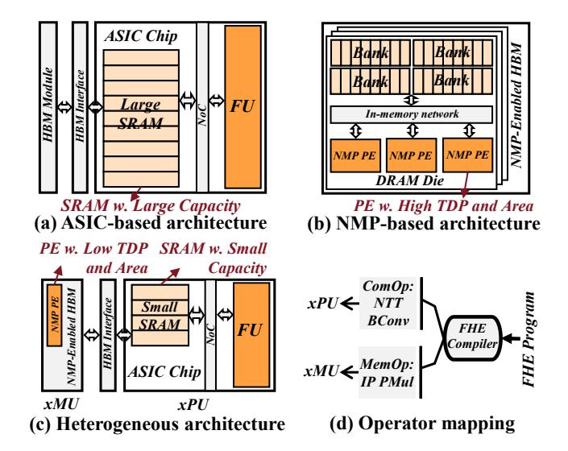
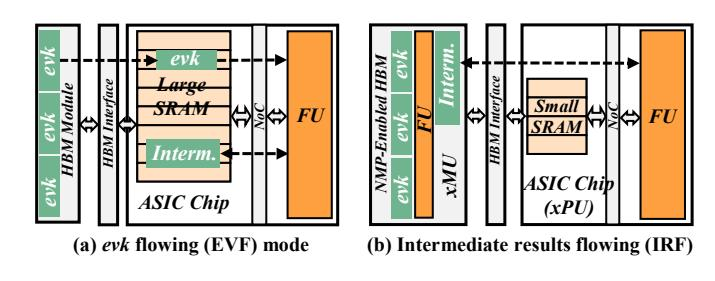
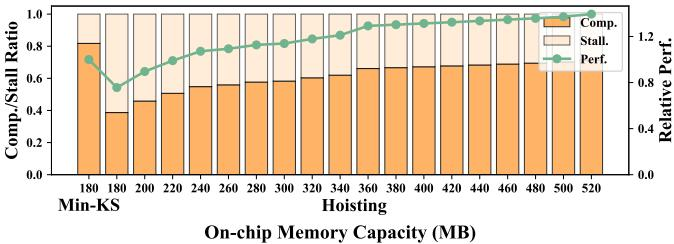
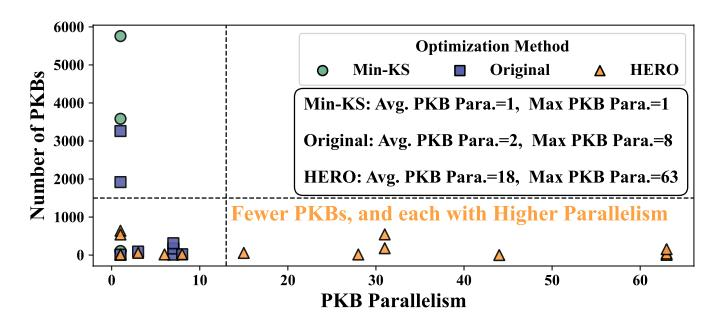

# HE2: A Communication-Light Heterogeneous Architecture for Efficient Fully Homomorphic Encryption

Shangyi Shi1,2,3, Husheng Han1, Zhaoxuan Kan1,2,3, Yinghao Yang1, Jianan Mu1, Tenghui Hua1, Ge Yu1,2,4, Xinyao Zheng1,2,3, Ling Liang5, Zidong Du1,2, Xing Hu1,2

1State Key Laboratory of Processors, Institute of Computing Technology, CAS, Beijing, China

2University of Chinese Academy of Sciences, Beijing, China

3Cambricon Technologies

4School of Advanced Interdisciplinary Sciences, CAS, Beijing, China

5School of Integrated Circuits, Peking University, Beijing, China

{shishangyi22s, hanhusheng, kanzhaoxuan23z, yangyinghao}@ict.ac.cn

{mujianan, huatenghui24s, yuge23s, zhengxinyao22s}@ict.ac.cn

lingliang@pku.edu.cn {duzidong, huxing}@ict.ac.cn

Abstract—CKKS, an emerging fully homomorphic encryption (FHE) scheme, has been promising in privacy-preserving applications by enabling SIMD fixed-point computations on ciphertexts. Despite its strong security guarantees, CKKS involves both compute-intensive operators (ComOps) with high computational cost and memory-intensive operators (MemOps) with large memory footprints, making existing ASIC-based or NMP-based acceleration approaches suffer from high hardware overhead and limited efficiency. This observation motivates the integration of the architectural advantages of both paradigms into a heterogeneous xPU (ASIC)-xMU (NMP) architecture. However, in such a design, frequent and long-latency heterogeneous communication caused by the dominant keyswitch operator remains a key performance bottleneck.

In this paper, we propose HE2, a communication-light xPUxMU heterogeneous FHE accelerator with dataflow graph (DFG) optimization and architecture co-design. First, we observe that the majority of communication arises at the interface between ModUp/ModDown and neighboring MemOps. To address this, we propose a DFG-level optimization framework to fully exploit the ModUp/ModDown reduction potential of the hoisting algorithm by identifying parallel keyswitch blocks and fusing them for reduced communication frequency. Second, we design an efficient heterogeneous architecture that adopts a group-level pipelined execution to effectively hide communication latency by leveraging the inherent parallelism across decomposed groups. End-toend evaluation results show that HE2 achieves 1.66× speedup and 9.23× lower EDAP (Energy-Delay-Area Product) compared to the state-of-the-art accelerator, with communication stalls accounting for only 6.67% of the total latency.

Index Terms—Fully Homomorphic Encryption (FHE), Heterogeneous Architecture, Dataflow Graph Optimization.

#### I. Introduction

Fully Homomorphic Encryption (FHE) has attracted significant attention due to its ability to enable computation on encrypted data in wide privacy-preserving cloud scenarios. Among existing FHE schemes [3], [7], [8], CKKS stands out

Corresponding author is Husheng Han.

Fig. 1. Both ASIC and NMP architectures suffer from high hardware overhead due to large on-chip SRAM (a) and near-memory compute integration (b); the heterogeneous design exploits the strengths of both computation and memory access to achieve a more practical trade-off (c), by mapping ComOps to the ASIC side and MemOps to the NMP side (d).

for supporting approximate arithmetic and efficient SIMD-style computations, making it particularly suitable for privacy-preserving machine learning [5], [21], [30], [31], [53].

CKKS is characterized by both computation-intensive operators (ComOps) with complex computation patterns like ModUp and ModDown, and memory-intensive operators (MemOps) like Inner Product (IP) and Plaintext Multiplication (PMul). Prior works have explored two monolithic accelerator paradigms. First, the ASIC designs [2], [12], [25], [26], [43], [44], [55] employ customized modules to accelerate complex ComOps, but require large on-chip memory to alleviate the memory bottleneck, resulting in substantial area and power costs (Fig. 1(a)). Second, the Near-Memory Processing (NMP)

designs [14], [40], [54] leverage high near-memory bandwidth for MemOps but require integrating large computing cores for ComOps (Fig. 1(b)). The integration of a massive complex logic circuit incurs substantial area and power overheads, which hinder its feasibility for implementation [23], [32]. Both design methodologies face the dilemma of efficiency and hardware costs.

The heterogeneous ASIC-NMP architecture (Fig. 1(c)) is a promising solution to exploit the complementary strengths of both approaches: high-performance ASIC-based modules (xPU) accelerate ComOps, and high-bandwidth NMP modules (xMU) alleviate memory bottlenecks for MemOps.

However, a key challenge of the heterogeneous architecture is the significant communication overhead between the xPU and xMU due to the computation pattern of the core operation keyswitch (occupies 80% computation in CKKS). The dataflow of keyswitch consists of an alternating sequence of ComOps and MemOps (ModUp-IP-ModDown), leading to **0** frequent communication when ComOps are mapped onto the xPU and MemOps onto the xMU. In addition, the data exchanged between ComOps and MemOps-ciphertexts output from ModUp and IP-are @ large in size, resulting in considerable single-transfer latency. Unlike monolithic ASIC designs, where off-chip data can be preloaded to hide latency, the communication for the on-the-fly intermediate results in the heterogeneous architecture lies on the critical path, posing a fundamental bottleneck. In our evaluation, a heterogeneous accelerator, combining a state-of-the-art monolithic xPU [25] with bank-level PE-integrated xMU via a 1 TB/s HBM interface, achieves 1.11× reduction in the bootstrapping computation latency but incurs 8.65× increase in communication stalls.

In this paper, we propose a communication-light heterogeneous CKKS accelerator with dataflow graph (DFG) optimization and architecture co-design. To address the frequent heterogeneous communication, we propose HERO, a DFG optimization framework to *maximize the communication-reduction benefits of hoisting*. The hoisting algorithm [4] reduces ComOps and communication in heterogeneous systems. Nonetheless, its benefit is constrained by the limited keyswitch parallelism in the CKKS DFG. To circumvent this bottleneck, HERO identifies parallel keyswitch blocks, expands and fuses them to enhance parallelism and maximize hoisting's communication-reduction potential.

To alleviate the on-critical-path communication stall, we propose  $HE^2$ , an <u>he</u>terogeneous  $F\underline{HE}$  architecture, *utilizing* the group-granularity pipeline design to hide the communication latency and improve computation efficiency. For the xPU, we design dual-level pipelined computation modules to enable both computation-communication overlap and interoperator overlap for efficient communication hiding. For the xMU, we design highly parallel yet lightweight modules that exploit the high bank-level bandwidth of HBM.

Our main contributions are as follows:

• We construct the first xPU (ASIC)-xMU (NMP) heterogeneous architecture to fully exploit the efficiencies of

TABLE I
ARITHMETIC INTENSITY (AI) (OPS PER BYTE) OF CKKS OPERATORS.
EVALUATED UNDER THE SHARP [25]'S PARAMETERS.

|   |    | (      | Compute | Intensive | Memory Intensive Ops |      |      |      |         |  |
|---|----|--------|---------|-----------|----------------------|------|------|------|---------|--|
| O | )p | (I)NTT | BConv   | ModUp     | ModDown              | IP   | PMul | CAdd | Rescale |  |
| A | I  | 0.89   | 1.60    | 3.38      | 2.92                 | 0.12 | 0.09 | 0.07 | 0.11    |  |

the xPU for complex ComOps and the high-bandwidth xMU for MemOps, and identify that the bottleneck lies in the intermediate results communication between ComOps and MemOps with detailed profiling.

- To address the heavy communication, we propose a codesign that includes a DFG optimization framework for communication-reduction and an inter-group dual-level pipelined hardware for communication-hiding.
- Compared to the state-of-the-art CKKS accelerator SHARP [25], end-to-end evaluation results show that HE2 achieves 1.66× speedup and 9.23× EDAP improvement. Specifically, DFG optimization enables hoisting to reduce computation workload and communication volume by an average of 1.64× and 3.27×, and the pipelined hardware reduces communication stalls to 6.67%.

#### II. BACKGROUND

#### A. Basic operators

CKKS is composed of fundamental polynomial-level operators, which are the primary module for acceleration, including computation-intensive (ComOps) and memory-intensive operators (MemOps), with arithmetic intensity shown in Table I.

**NTT** (Number-Theoretic Transform) transforms an input polynomial of degree N from the coefficient to the slot domain through  $O(N \log N)$  butterfly operations.

**BConv** (Basis Conversion) transforms polynomials within one RNS basis into another. By performing a constant multiplication under the original basis with  $l_1$  moduli, followed by another constant multiplication and reduction under  $l_2$  target moduli bases, BConv incurs a complexity of  $O(l_1 \cdot l_2 \cdot N)$ .

**IP** (Inner Product) involves multiplying a group of polynomials with two groups of *evk* polynomials, followed by a sum reduction. IP incurs a substantial memory footprint and a small computation intensity.

**EWO** (Element-Wise Operation) encompasses operations such as ciphertext-ciphertext addition (CAdd), plaintext-ciphertext addition (PAdd), and multiplication (PMul). EWO exhibits low computation intensity and only involves element-wise addition or multiplication.

**Autom** (Automorphism) permutes the polynomial, with each coefficient index i mapped to  $ik \mod N$ .

#### B. Critical primitive in CKKS

1) keyswitch: In keyswitch [24], the ciphertext under modulus Q is decomposed into dnum groups, lifted to  $PQ \cdot dnum$  via  $\mathbf{ModUp}$ , multiplied with the evk ( $\mathbf{IP}$ ), and reduced back

Fig. 2. The original PKB performs eight ComOp-MemOp communications (a). Min-KS reduces the number of *evk* but not the communication frequency (b). Hoisting removes redundant ModUps and ModDowns, lowering the ModUp→IP and IP→ModDown communications, respectively (c).

to Q by **ModDown**. This result is added to the original ciphertext to complete the keyswitch. In CKKS, both ciphertext multiplication and rotation depend on this core primitive.

2) Modulus-Commutative Property: All EWOs and Autom can exchange their execution order with ModUp and ModDown [1], [4], [27]. We denote such operators as **Commutative Operators**. Taking PMul and CAdd as examples, for ciphertexts ct, ct', and plaintext pt, the following Equations (1) and (2) hold. Note that in the right-hand side of Equation (1), the plaintext must be lifted via PModUp as described in [1] to stay in the same domain as ModUp(ct).

$$\begin{split} \operatorname{ModUp}(\operatorname{PMul}(ct,pt)) &= \operatorname{PMul}(\operatorname{ModUp}(ct),\operatorname{PModUp}(pt)) \\ \operatorname{ModUp}(\operatorname{CAdd}(ct,ct')) &= \operatorname{CAdd}(\operatorname{ModUp}(ct),\operatorname{ModUp}(ct')) \\ \end{aligned} \tag{2}$$

#### C. Algorithmic Optimizations for PKB

Multiplication between a plaintext matrix and a ciphertext vector is the key computation in machine learning and C2S/S2C of bootstrapping [7]. In state-of-the-art implementations [6], [22], it uses parallel keyswitches with varying rotation steps, followed by linear combinations via PMul and CAdd. We define blocks of parallel keyswitches as PKBs, as shown in Fig. 2(a). In plaintext-matrix-ciphertext multiplication, the rotation steps in PKB form an arithmetic progression.

**Baby-Step Giant-Step (BSGS)** [22], [26] algorithm divides the PKB into groups of smaller PKBs shown in Equation (3) and reduces both the computational complexity and the number of evk from  $O(n_1 \cdot n_2)$  to  $O(n_1 + n_2)$ .

$$\sum_{i=1}^{n_1 \cdot n_2} \text{PMul}(\text{Rot}(ct, s_i), pt_i)$$

$$= \sum_{i=1}^{n_1} \text{Rot}(\sum_{j=1}^{n_2} \text{PMul}(\text{Rot}(ct, s_j), pt_{i,j}), s_i)$$

$$= \sum_{i=1}^{n_1} \text{Baby step}$$
(3

The *Min-KS* [26] approach further reduces the required *evk* number by converting the PKB to serial rotations to ensure that each rotation step is uniform (Fig. 2(b)).

Fig. 3. Two dataflow schemes exist in an ASIC chip equipped with HBM. An *evk* flowing dataflow preloads *evk* to the chip for IP computation (a). An intermediate results flowing scheme transfers intermediates of keyswitch to xMU for IP computation, where data transfers are on the critical path (b).

The **hoisting** technique [4] exchanges ModUps/ModDowns with commutative operators and merges those from different keyswitches, as shown in Fig. 2(c). By reducing the number of ComOps, hoisting lowers communication frequency between ComOps and MemOps. However, while it lessens the ComOps workload, it increases that of MemOps, whose computation order is swapped, shifting their modulus domain from Q to PQ or  $PQ \cdot dnum$ .

#### III. MOTIVATION

A. Existing ASIC-/NMP-based Architectures Face Dilemma of Performance and Hardware Costs

The coexistence of compute-intensive operators (ComOps) and memory-intensive operators (MemOps) in CKKS poses major challenges for hardware-efficient acceleration. Prior studies have explored ASIC-based [2], [12], [25], [26], [29], [36], [43], [44] and NMP-based [14], [40], [54] monolithic architectures, both incurring substantial hardware overhead. First, ASIC accelerators achieve efficient ComOps acceleration with low area and power consumption by using advanced process nodes [9] and employ customized computation modules. However, CKKS workloads demand large on-chip SRAM for MemOps, which can consume up to half of the total area and power consumption in ASIC accelerators [26], [29]. Second, NMP designs exploit high near-memory bandwidth to accelerate MemOps and integrate deeply pipelined compute units within low hierarchies in DRAM for ComOps [40], [45], but this results in complex and costly designs. Specifically, pure in-die NMP cannot provide adequate computational capability for FHE within the area budget (25% suggested by SK Hynix AiM [23], [32]), owing to the scarcity of logic resources in DRAM's technology that transistors operate roughly 3× slower and the density is 10× lower than CMOS at the same technology node [13]. Additionally, the support for complex FHE ComOps leads to considerable power overhead, necessitating customized high-end-server active heat sink thermal management [20], [40], thereby further complicating industrial tape-out. These two paradigms inspire us to propose a hardware-efficient ASIC (xPU)-NMP (xMU) heterogeneous architecture featuring an xPU with small on-chip memory and an xMU supporting only simple MemOps, which introduces low extra logic integration.

Fig. 4. Baseline adopts Min-KS as in [25], [26]. SHARP-xMU is an xPU-xMU heterogeneous accelerator, in which the xPU is aligned with SHARP with detailed configurations provided in Sec. VI-A. Communication is the primary bottleneck in IRF-based heterogeneous architectures, and hoisting can partially reduce communication overhead.

#### B. Frequent and Large Communication Traffic is the Key Challenge in Heterogeneous Architectures

According to prior ASIC designs [25], [29], large on-chip SRAM stores preloaded *evks* for IP and baby-step ciphertexts for PMul in the BSGS phase of bootstrapping. To lower the on-xPU memory demand, an efficient mapping of IPs and PMuls is essential.

IP appears exclusively in the keyswitch. In an xPU-xMU heterogeneous system, keyswitch admits two dataflow design choices: the *evk flowing* (EVF) dataflow used in existing ASIC monolithic accelerators (Fig. 3(a)) and a new *intermediate results flowing* (IRF) dataflow (Fig. 3 (b)). The EVF dataflow offloads the entire keyswitch to the xPU. It allows *evk* to be reused and preloaded to reduce the cost of offchip memory access. However, when the program exhibits sequential keyswitches with low *evk* reuse, its performance remains constrained by large on-xPU memory [26]. The IRF dataflow maps IPs to the xMU to avoid loading *evk* to the xPU. In this mode, the ModUp output is sent to the xMU for IP, and the result is then returned to the xPU for ModDown.

Although IRF reduces xPU memory use and exploits xMU near-memory bandwidth, it introduces two additional data transfers per keyswitch, i.e., between ModUp IP and IP Mod-Down. Considering the dominance of keyswitch in CKKS, • the communication between xPU and xMU becomes frequent and degrades the overall performance when IRF is *applied.* Furthermore, this communication lies on the critical path, involving up to 144 MB of intermediate ciphertext per transfer. We extend a state-of-the-art ASIC design [25] by integrating an xMU component into a heterogeneous xPU-xMU architecture. In this architecture, **2** the existing xPU design cannot effectively balance communication and computation, making it difficult to hide the latency of intermediate result transfers along the critical path. In our experiments, this communication stall accounts for 68.2% and 68.7% of the total latency in bootstrapping [6] and ResNet-20 [30], as shown in the left region of Fig. 4.

#### C. Communication Optimization Potential of Hoisting and Its Limitation under Low Kevswitch Parallelism

Hoisting [4] extracts shared ModUps and ModDowns from multiple parallel keyswitches. Although the corresponding *evks* differ, the ModUp results can be reused across IPs

Fig. 5. Bootstrapping performance of SHARP with hoisting across varying on-chip memory capacities. Increasing on-chip memory allows *evk* preloading to mitigate off-chip stalls, but reduced *evk* reuse under hoisting yields diminishing performance gains.

after hoisting, and the aggregated results from multiple IPs require only one ModDown. Thus, hoisting trades *evk* reuse for improved reuse of intermediate results.

Due to reduced evk reusability, hoisting causes memory access stalls and performance loss in EVF-based architectures. As depicted in Fig. 5, directly applying hoisting to SHARP leads to performance degradation and offers only a 39.4% speedup despite a  $2.89\times$  increase in on-chip memory. In contrast, hoisting improves intermediate result reuse, reducing communication frequency in IRF-based heterogeneous architectures and thus boosting performance. Consequently, the IRF-based system achieves moderately higher performance than its EVF-based counterpart when hoisting is applied, as shown in the right region of Fig. 4. Moreover, hoisting enables PMul in BSGS of the bootstrapping to be reordered and offloaded to the xMU along with adjacent IPs (Fig. 2). Consequently, the substantial on-chip memory footprint of baby-step ciphertexts described in Sec. III-B can be avoided. For bootstrapping and ResNet-20, hoisting can reduce the communication stall of IRF-based systems by 2.00× and 1.61× compared to the two baseline benchmarks, respectively.

Nevertheless, **3** the optimization effect of hoisting on communication is limited due to the low keyswitch parallelism of CKKS programs. Specifically, through hoisting, redundant ModUps and ModDowns within the PKB can be reduced to a level proportional to the PKB's input and output degrees. Since the saved communication volume scales with the reduction in ModUp and ModDown, a PKB with higher parallel keyswitches and lower in/out-degree can achieve more communication savings. In CKKS programs, many fragmented PKBs with a limited keyswitch-parallelism (less than 10) exist, as shown in Fig. 6, which restricts the hoisting effect. Therefore, in Sec. IV, we propose a program graph level optimization method (HERO) to fuse multiple low-parallelism PKBs into a few PKBs with higher parallelism (more than 30), to fully exploit the potential of hoisting.

#### D. New Heterogeneous-Specific Performance Model is Needed

Since this work marks the first attempt at an ASIC-NMP heterogeneous acceleration for CKKS, and prior studies have not thoroughly explored the potential of hoisting, we observe that the performance models for existing monolithic CKKS accelerators, which are primarily based on computation volume

Fig. 6. Parallelism and number of PKBs in the bootstrapping, ResNet20, and HELR. CKKS program contains numerous segments with low keyswitch parallelism. Min-KS further increases the number of PKBs while producing PKBs with lower parallelism. By applying our algorithmic optimization introduced in Sec. IV, low-parallelism PKBs are fused into a smaller number of highly parallel PKBs, thereby unveiling the benefits of hoisting.

and off-chip memory access stall under the EVF dataflow, are insufficient to accurately assess the impact of hoisting and IRF in heterogeneous systems. In prior work on BSGS of bootstrapping with EVF dataflow, the baby-step (*bs*) and giant-step (*gs*) are jointly optimized to minimize computation cost and off-chip memory traffic. The computation cost is lowest when *bs* and *gs* are equal (i.e., both 8), but this exceeds the on-chip memory for baby-step ciphertexts [25], causing frequent intermediate swaps. Thus, the optimal configuration of [25] adopts a smaller *bs* of 4 (Fig. 7(a)).

In contrast, with hoisting and IRF, choosing larger gaps between bs and gs exposes more parallelism for hoisting, reducing communication and computation. However, such configurations increase the evk storage demand and may exceed HBM capacity, as depicted in Fig. 7(b). This motivates the need to develop a new heterogeneous-specific performance model that jointly considers computation, communication, and the size of evk working set for general CKKS applications.

## IV. HERO: A HOISTING-ENHANCED DFG OPTIMIZATION FRAMEWORK

To tackle the critical communication challenges on heterogeneous systems, and to explore the optimization potential of hoisting, we abstract dataflow graphs (DFGs) from applications, where nodes represent operators and edges denote data dependencies. Based on this, we propose **HERO**, a hoistingenhanced communication reduction DFG optimization framework. The input to HERO is a DFG generated by an FHE compiler [10], [11], [35]. To enable the generality of hoisting in arbitrary CKKS programs, we identify and locally expand PKBs for degrees fine-tuning (Sec. IV-A). This preprocessing stage reshapes the local DFG, thereby enhancing the effectiveness of hoisting on subgraphs. Furthermore, to enhance the keyswitch-level parallelism that hoisting can leverage, we introduce, for the first time, a novel technique called PKB fusing, which fuses PKBs at the global DFG level and leverages a fusion evaluator to derive the optimal fusion scheme (Sec. IV-B). Finally, we map the restructured DFG onto the proposed heterogeneous accelerator based on the parallelism of each PKB (Sec. IV-D).

Fig. 7. BSGS parameter exploration. EVF-based monolithic architectures (e.g., SHARP) consider computation load and off-chip memory access stalls. In contrast, the performance model of IRF-based heterogeneous accelerators (e.g., SHARP-xMU) incorporates computation load, communication volume, and the *evk* workset size. The difference in the considered factors leads to distinct optimal parameter configurations.

