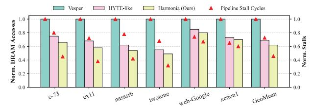

# *C. Memory Access Analysis*

Off-chip Traffic and On-chip Congestion. Fig. 11 illustrates the normalized off-chip DRAM accesses (bars) alongside the resulting on-chip pipeline stall cycles (triangles) for massive matrices exceeding the 1 MB SRAM capacity. Static schedulers like Vesper suffer from severe cache thrashing; their fixed tile shapes cannot adapt to regional sparsity fluctuations, forcing repeated off-chip reloading of stationary matrices (hence high DRAM access).

HYTE-like inter-tile orchestration successfully mitigates this by resizing global tiles dynamically to fit within the SRAM, dramatically reducing off-chip DRAM traffic. However, this reveals a secondary microarchitectural bottleneck. Because HYTE assumes a rigid intra-tile dataflow, it forces the hardware to process highly irregular nonzero distributions using suboptimal spatial mapping. For instance, encountering

Fig. 11. Normalized off-chip DRAM accesses (bars, left axis) and Onchip pipeline stall cycles (red triangles, right axis) for large-scale matrices exceeding the 1 MB on-chip SRAM capacity.

a dense cluster while locked in a Row dataflow causes massive partial-sum (psum) buffer overflows. To resolve these internal structural hazards, the hardware must freeze the execution datapath, resulting in skyrocketing on-chip pipeline stall cycles.

Harmonia elegantly resolves this dilemma. By actively monitoring hardware feedback, it dynamically switches to a more suitable dataflow (e.g., transitioning to Row to mitigate psum pressure) without altering the global tile footprint. As shown in Fig.11, Harmonia achieves the best of both worlds: it maintains the minimal DRAM traffic of dynamic tiling while virtually eliminating dataflow-induced on-chip stalls, unlocking the true potential of the versatile hardware substrate.

On-chip SRAM Traffic. Fig. 12 reports the normalized A/B/C SRAM traffic and the resulting operation intensity (Operations/Byte) under different scheduling strategies, normalized to the static baseline. Across most workloads, Harmonia achieves both the lowest memory traffic and the highest operation intensity by jointly adapting the tile shape and intra-tile dataflow guided by runtime feedback. On average, Harmonia reduces SRAM accesses by 32% over the static baseline, while Misam-like and HYTE-like schedulers provide only a marginal 10% improvement. Unlike single-level approaches that can occasionally inflate traffic by 30% ∼ 50% due to mismatched tile and dataflow choices, Harmonia maintains consistently low traffic across diverse sparsity patterns.

For example, on bcsstk10, Misam-like scheduling increases SRAM traffic by 39% because it adjusts the dataflow without modifying the tile shape, causing excessive partial-

Fig. 12. Normalized SRAM access breakdown (A/B/C operands) and normalized operation intensity (OPs/Byte) under different scheduling strategies. Harmonia achieves the lowest A/B/C traffic and the highest operation intensity by jointly adapting the tile shape and intra-tile dataflow using runtime feedback.

Fig. 13. Energy reduction of Harmonia compared to the Vesper baseline (red triangles, right y-axis), and the energy breakdown of Harmonia into computation, data routing and sparsity control, and SRAM access (bars, left y-axis).

sum spilling. Conversely, for the highly irregular orani678, HYTE-like scheduling incurs ∼ 50% extra traffic when its fixed dataflow becomes incompatible with the dynamically adjusted tile boundaries, destroying operand reuse. Harmonia eliminates these isolated blind spots by cross-optimizing both layers, ensuring that on-chip traffic remains strictly bounded.

