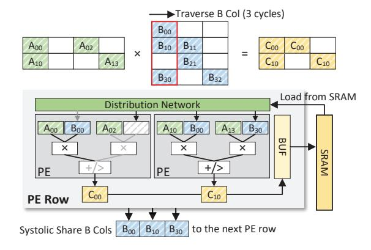
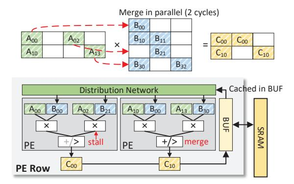
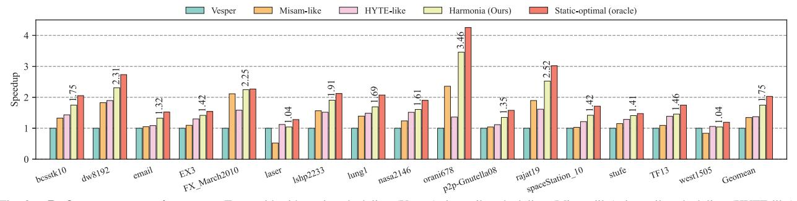
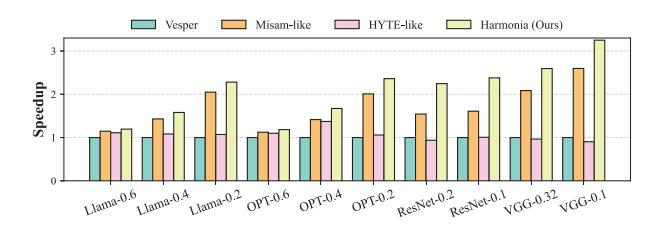

# V. HARDWARE ARCHITECTURE

#### A. Architecture Overview

Fig.5 illustrates the overall architecture of Harmonia. Built upon the row-parallel templates of prior versatile accelerators [16], [18], we adopt the core computational structures: semi-independent PE rows equipped with a Distribution Network (DN) and a merge-reduction network (MRN). Harmo-

Fig. 6. Inner Product (InP) dataflow implementation. Each PE row consumes a stationary A-row while the corresponding B-column fragment is streamed through the distribution network (DN) and forwarded systolically to subsequent PE rows to maximize B reuse across rows. PEs produce partial products which the MRN merges before storing (merge-before-store), yielding high PE utilization under moderate sparsity.

nia introduces the software-hardware (SW-HW) scheduling interface and runtime logic required to unlock logical heterogeneity. These include Feedback Counters, a Reconfiguration Engine, and a Tiling Controller.

**PE-row Microarchitecture.** Each row contains a horizontal chain of PEs processing independent nonzero pairs, accumulating partial results through a configurable MRN. The DN routes operands to PEs, enabling InP/Row/OutP dataflows via reprogrammable routing schedules and reduction patterns at tile boundaries without modifying the datapath.

**Buffers and Feedback.** Local on-row buffers stage operands and psums, with spill counters and occupancy monitors exposing pressure events to the runtime. The global SRAM stores tiles and metadata, including per-tile nnz, supporting pre-execution profiling.

Control Extensions. Harmonia adds only lightweight control structures: feedback counters and a reconfiguration engine for dataflow and tile-shape updates. The PE datapath, MRN add/compare logic, and distribution pipeline remain unchanged, preserving the efficiency of row-parallel architecture while enabling per-tile adaptivity at negligible cost.

Overall, Harmonia transforms hardware configurability into dynamic system intelligence using minimal metadata and control enhancements, maintaining high efficiency and simplicity.

#### B. Intra-tile Management

Harmonia supports three intra-tile dataflows (InP, Row, and OutP), corresponding to the scheduler decisions outlined in SectionIV. All share the same datapath; differences arise solely from DN, MRN, and on-row buffer routing and reduction, which are reconfigured via the Reconfiguration Engine without altering PE logic.

**Data Format and Dynamic Alignment.** To maintain versatility and minimize memory bandwidth, Harmonia supports standard representations, utilizing Compressed Sparse Row/Column (CSR/CSC) with explicit coordinate lists for

Fig. 7. **Row-based (Row) dataflow implementation.** Each PE row keeps one A-row stationary, while the DN selectively routes only the required B-row fragments based on the nnz indices of that A-row. This reduces psum merge depth, allows B fragments to be buffered once in the local BUF and shared across PEs, and mitigates workload imbalance under highly uneven row densities

highly sparse tiles, and bitmask-based formats for mildly sparse regions. Before entering the PE datapath, nonzero elements must be aligned to ensure only values with matching coordinates are multiplied (i.e., intersection). Harmonia leverages the reconfigurable DN paired with lightweight on-row indexmatching logic to dynamically orchestrate the intersection, packing only effectual, nonzero pairs into the multipliers.

Inner Product (InP) Mode. As illustrated in Fig.6, the InP dataflow keeps each A-row stationary within a PE row, while the corresponding B-column fragments are streamed through the distribution network (DN) and forwarded systolically to downstream rows. This broadcasting pattern maximizes crossrow reuse of B operands and maintains a steady operand supply across the pipeline. Each PE generates partial products that are forwarded into the per-row MRN, which operates in a merge-before-store configuration to aggressively compress partial sums prior to buffering. The resulting reduction behavior minimizes psum traffic and enables high PE utilization when sparsity is moderate and row densities are well-balanced, making InP a strong baseline for dense or mildly sparse tiles.

Row-based (Row) Mode. As shown in Fig.7, Row binds one A-row to each PE row and selectively routes only the required B fragments according to the nnz pattern of that A-row. This operand gating significantly reduces redundant B traffic and allows each B fragment to be buffered once in the on-row BUF and shared across all PEs in the row. Compared to InP, Row-based dataflow produces a shallower and more predictable merge depth, since each row accumulates partial sums along a single A-row trajectory. This makes Row particularly effective for tiles with highly uneven or bursty row densities, where selective routing mitigates load imbalance across rows. Row is realized by reprogramming DN routing rules, allocating per-row buffer slices, and configuring the MRN to follow a row-sequential reduction schedule, without modifying the underlying datapath.

Outer Product (OutP) Mode. As shown in Fig. 8, OutP

Fig. 8. Outer Product (OutP) dataflow implementation. Columns of A and rows of B form rank-1 update streams, with DN distributing  $(A_{*k}, B_{k*})$  pairs and MRN operating in column-accumulate mode. This minimizes distribution pressure and is effective under highly sparse and irregular matrices.

processes one column of A and the corresponding row of B as a rank-1 update stream. The DN broadcasts each  $(A_{*k}, B_{k*})$  pair to all rows, enabling wide reuse of both operands and significantly reducing distribution pressure compared to InP or Row. Each PE generates contributions to an entire output column, and the MRN operates in a column-accumulate mode, which yields extremely shallow merge depth and minimizes psum buffering requirements. Under highly sparse topologies or strong nonzero clustering, these characteristics naturally balance the workload, making OutP exceptionally effective as rank-1 updates prevent unnecessary operand movement. OutP requires no datapath modification; it is realized by programming DN broadcasts of  $(A_{*k}, B_{k*})$ , configuring the MRN for column-accumulate reduction, and coordinating buffer control to prevent premature psum spills under highly sparse tiles.

## C. Feedback Path and Dynamic Tuning

The Dynamic Tuning Layer relies on lightweight runtime signals that characterize actual execution behavior. Harmonia collects these via feedback counters and flags without modifying the underlying datapath.

**Feedback Collection.** Each PE row maintains a small set of counters that track MRN merge events; a 128-row array requires only 128 counters, occupying < 0.5% of the PE-array area. Counters are aggregated through a lightweight metadata crossbar and forwarded to the Tiling Controller. Crucially, the feedback path is fully decoupled from the main datapath, ensuring that DN and MRN operations proceed without any timing or routing perturbation.

**Dataflow Switching.** Dataflow transitions occur strictly at *tile boundaries*, as the global matrix is executed as a sequence of independent tiles. Tile-level logical heterogeneity is achieved through a pipeline flush, followed by the reprogramming of:

- DN route tables and the MRN operating mode (mergebefore-store vs. column-accumulate),
- Address generation units (AGUs) and buffer controller policies (allocation, eviction, reset).

TABLE II
PE CONFIGURATION AND AREA BREAKDOWN.

| Component | Configuration            | $Area(\mu m^2)$ | Area% |
|-----------|--------------------------|-----------------|-------|
| MUL       | 16× FP32 multipliers     | 37,382          | 46.4% |
| MRN       | radix-16 FP32 adder tree | 23,234          | 28.8% |
| DN        | 16-to-16 Benes & Ctrl.   | 7,001           | 8.7%  |
| BUF       | 1 KB, 64B-wide SRAM      | 13,003          | 16.1% |
| PE        | Support InP/Row/OutP     | 80,620          | 100%  |

TABLE III
ACCELERATOR CONFIGURATION AND AREA BREAKDOWN.

| Component | Configuration                | Area(mm 2 ) | Area% |
|-----------|------------------------------|------------------------|-------|
| Compute   | 2 PEs × 32 Rows              | 5.16                   | 68.7% |
| SRAM      | 1 MB, $32 \times 64$ B line  | 1.89                   | 25.2% |
| Schedule  | Feedback & Reconfig.         | 0.25                   | 3.3%  |
| NoC       | 32-to-32 crossbars           | 0.21                   | 2.8%  |
| Overall   | <b>0.5 GHz,</b> 32 × 32 MACs | 7.51                   | 100%  |

Closing the Scheduling Loop. Feedback counters directly trigger runtime policies: abnormal psum spilling or deep merge depth invokes dataflow switching or micro-retiling if the analytical cost model predicts a net gain. This cleanly closes the software—hardware scheduling loop, preserving worst-case robustness while maximizing overall throughput.

#### VI. METHODOLOGY

**System Configuration.** The Harmonia architecture features 32 PE rows, each containing 32 FP32 multipliers and adders, delivering 1 TFLOPS peak throughput at 0.5 GHz. To ensure a fair comparison, all baseline scheduling frameworks evaluated in this paper are simulated on this exact same 32-row hardware configuration, rather than their originally published accelerator scales. The memory hierarchy consists of 1 MB on-chip SRAM and 32 KB of distributed local buffers. Off-chip memory is modeled as HBM with 2 TB/s bandwidth, representative of contemporary GPU/TPU-class systems.

Area and Energy Modeling. The Harmonia accelerator datapath (vector multipliers, merge-reduction tree, distribution network, sparse-control logic) is implemented in RTL and synthesized in TSMC 28 nm using Synopsys Design Compiler; switching activity is used to estimate compute energy. On-chip SRAM is modeled using CACTI 7 [32], and HBM energy is derived from vendor-provided datasheets [33]. Detailed PE- and full-accelerator area breakdowns are summarized in TABLE II and TABLE III. The total area of Harmonia is 7.51 mm², with 68.7% for compute and 25.2% for SRAM.

**Simulation Details.** We developed a cycle-accurate simulator to evaluate Harmonia, explicitly modeling MAC units, the merge-reduction tree, distribution networks, local buffers, SRAM, and HBM. To ensure high fidelity, we model PE stalls, partial-sum spills, and routing congestion faithfully. When dynamic tuning is triggered, the simulator explicitly injects the required pipeline flushes and reconfiguration overheads detailed in Section V-C into the execution timeline.

Workloads. Harmonia is evaluated on diverse SpMSpM workloads from the SuiteSparse Matrix Collection [31] and four representative DNNs with widely varying sparsity levels. For generative LLMs (LLaMA-7B [34] and OPT-1.3B [35]), we assume a sequence length of 1024 and apply SparseGPT [36] to achieve overall density levels of 0.2, 0.4, and 0.6. For vision models, we prune ResNet-50 [37] to average weight densities of 0.1 and 0.2 using STR [38], and apply magnitude-based pruning to VGG-16 [39] to target densities of 0.1 and 0.32. Throughout the evaluation, models are denoted by their architecture and density (e.g., Llama-0.6 refers to the LLaMA-7B model pruned to a 0.6 density).

#### VII. EVALUATION

#### A. Overall Performance

Fig. 9 compares Harmonia with three representative schedulers on Trapezoid: Vesper-style static scheduling, Misamlike intra-tile scheduling, and HYTE-like inter-tile scheduling, along with the oracle per-tile optimum. All results are normalized to the Vesper baseline, and Harmonia's absolute speedups are shown above the bars.

Across all 16 workloads, Harmonia consistently delivers the highest performance and closely follows the oracle bound. On geometric mean, Harmonia achieves a  $1.75\times$  speedup over static scheduling, clearly outperforming both Misam-like and HYTE-like approaches. These results highlight the critical importance of coordinating inter-tile traversal with intra-tile dataflow selection. Specifically, Misam-like scheduling optimizes local dataflows but ignores shared SRAM pressure, while HYTE-like approaches adjust tile boundaries but remain bottlenecked by rigid intra-tile execution. In contrast, Harmonia's tile-level adaptivity, realized through the software-hardware (SW-HW) scheduling interface, synergizes both dimensions to effectively close the gap between practical schedulers and the oracle.

The matrix orani678, which features extreme sparsity imbalance and highly irregular nonzero clustering, perfectly highlights Harmonia's advantage. All three baselines (static, Misam-like, and HYTE-like) suffer from inconsistent reuse and poorly aligned tile boundaries. Conversely, Harmonia achieves a  $3.46\times$  speedup, closely tracking the oracle. This significant improvement stems from Harmonia's ability to (i) adapt tile shapes to fine-grained sparsity variations, (ii) dynamically switch intra-tile dataflows to avoid deep reductions during density spikes, and (iii) reorder tiles to eliminate outlier-heavy long-tail regions.

#### B. End-to-End Evaluation

Fig. 10 illustrates the end-to-end performance of running four representative DNN workloads with varying sparsity levels. Harmonia consistently achieves the highest performance across all end-to-end pipelines, delivering a geometric mean speedup of  $1.87\times$  over the static Vesper baseline.

Unlike single-layer microbenchmarks, end-to-end execution exposes the accelerator to highly heterogeneous layer topologies. For generative LLMs (Llama and OPT), the sparsity

Fig. 9. Performance comparison across Trapezoid with static scheduling (Vesper), intra-tile scheduling (Misam-like), inter-tile scheduling (HYTE-like), our hierarchical scheduling (Harmonia), and a static-optimal oracle for SpMSpM. All bars are normalized to the static-scheduled Trapezoid baseline, and the numbers above the Harmonia bars report its absolute speedups over this baseline. All evaluated approaches are executed on the identical 32-row architecture to ensure a fair comparison.

Fig. 10. End-to-end performance speedup of Harmonia across modern DNN pipelines on generative LLMs and vision models under various sparsity ratios.

patterns in attention mechanisms and MLP projections exhibit severe skewness and dynamic variations across tokens. Similarly, for vision models (ResNet-50 and VGG-16), weight pruning often introduces uneven nonzero clustering and channel-wise sparsity fluctuations.

Harmonia efficiently mitigates these topological shifts by dynamically leveraging its lightweight hardware feedback to adjust tile shapes and intra-tile dataflows on the fly. This proves that Harmonia's analytical cost model successfully prevents thrashing while maintaining robust, high-utilization execution across the entire network.

