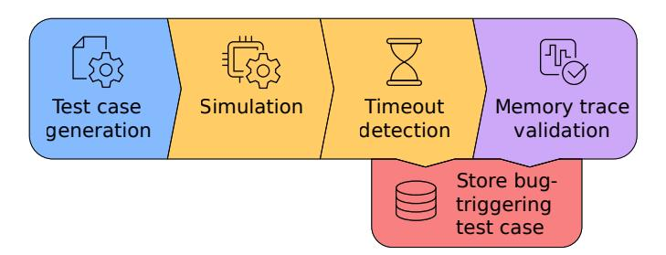
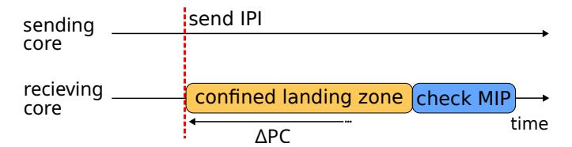
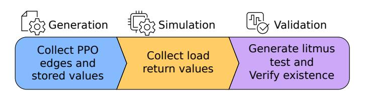

# *B. RISC-V Multi-Hart Features*

RISC-V is a free and open ISA, popular in both academia and industry. It consists of a base ISA, and a set of optional extensions that add more advanced or specialized functionalities like floating-point or atomic instructions. In RISC-V, a hart (hardware thread) is an execution unit that can independently fetch and execute instructions. Inter-hart communication in RISC-V primarily occurs through shared memory and Inter-Processor Interrupts (IPIs).

Shared memory. RISC-V relies on the RVWMO for memory consistency, introduced earlier. RVWMO builds upon the load value axiom which specifies the value that a load may return, defined through 13 Preserved Program Order (PPO) rules. For instance, the first PPO rule forbids the reordering of two consecutive stores to the same address as shown in Figure [1.](#page-1-1) Other rules preserve data and control dependencies, or enforce synchronization through fence instructions. We include an exhaustive list of all PPO rules, as well as the 2 other axioms in the RISC-V manual, page 93 [8].

Inter-processor interrupts. An interrupt is an asynchronous event typically generated by an external source such as a different hart or a peripheral. The interrupt requests the (receiving) hart to suspend its current program execution and transfer control to a designated interrupt handler. An IPI is a special interrupt triggered by software running in another hart, setting the MSIP bit of the mip Control and Status Register (CSR) of the target hart to 1. IPIs are generally sent through a memory-mapped peripheral, usually the RISC-V-specified Core Local INTerrupt controller (CLINT). Since RISC-V does not specify a delay in which an interrupt must be evaluated or even liveness, the time between when an interrupt is sent and when it is evaluated is non-deterministic.

#### <span id="page-2-2"></span>C. Hardware Fuzzers

Hardware fuzzers [5], [7], [17], [23], [26], [31], [39], [41], [43], [46], [47], [50] generate randomized test cases to evaluate the correctness of a design dynamically. These test cases are executed on the target design, and typically validated against a reference implementation. While hardware fuzzing has proven to be an effective strategy for finding RISC-V CPU bugs in single-hart settings, it so far remained unclear how the inherent non-determinism of multi-hart systems can be effectively tackled.

#### III. OBSERVATIONS AND CHALLENGES

We first quantitatively analyze existing single- and multihart testing approaches to expose the gap for effectively testing multi-hart CPUs. We then discuss the high-level design of HARTBREAKER to address this gap and introduce the challenges that such a design introduces.

#### A. Testing Multi-Hart CPUs

We analyze existing single- and multi-hart testing methods on two aspects. First, previous work [20], [40] has shown that CPU bugs often appear under specific microarchitectural conditions, hence we are interested in the ability of testing techniques to effectively explore the microarchitectural state space. Second, we consider the expandability of existing single-hart testing techniques to multi-hart systems.

**Litmus tests.** Litmus tests highlight specific aspects of memory consistency models in multi-hart settings [14], [21]. They focus on clearly expressing subtle tolerated and non-tolerated non-deterministic interaction patterns. Due to their focus on testing specific memory consistency scenarios, we raise the question: is the distribution of instructions in litmus tests diverse enough to trigger complex microarchitectural scenarios?

**Hardware fuzzers.** Conversely, state-of-the-art CPU fuzzers [5], [17], [26], [39], [43], [48] can generate complex instruction streams with balanced instruction distributions, allowing them to reach arbitrary microarchitectural states. However, they are designed for single-hart scenarios and rely on deterministic program execution, raising another

<span id="page-2-0"></span>TABLE II: Instruction coverage comparison between litmus tests and Cascade.

| Test Type                  | Litmus test [21] | Cascade [39] |
|----------------------------|------------------|--------------|
| Shared Memory              | ✓                |              |
| Atomics                    | $\checkmark$     |              |
| Fences                     | $\checkmark$     | ✓            |
| Interrupts                 |                  |              |
| Inter Processor Interrupts |                  |              |
| Exceptions                 |                  | ✓            |
| Independent Memory         |                  | ✓            |
| Branches                   | $\checkmark$     | ✓            |
| ALU operations             | $\checkmark$     | ✓            |
| FPU operations             |                  | ✓            |
| Privilege switches         |                  | ✓            |

<span id="page-2-1"></span>TABLE III: Comparison of fuzzing tools verification strategies. Tools marked with † means that the CHERI version [3], [4] is also supported. Custom methods are methods proprietary to the fuzzer, such as undisclosed golden models or differential testing with another CPU

| Fuzzer name         | Spike [10]   | Sail [9]     | Whisper [13] | Custom       |
|---------------------|--------------|--------------|--------------|--------------|
| DifuzzRTL [26]      | <b>√</b>     |              |              |              |
| Cascade [39]        | $\checkmark$ |              |              |              |
| Trippel et al. [43] |              |              |              | $\checkmark$ |
| TestRIG [5]         | <b>√</b> †   | <b>√</b> †   |              |              |
| ProcessorFuzz [17]  | $\checkmark$ |              |              |              |
| INSTILLER [50]      | $\checkmark$ |              |              |              |
| TheHuzz [44]        | $\checkmark$ |              |              |              |
| MorFuzz [48]        | $\checkmark$ |              |              |              |
| RISCVuzz [41]       |              |              |              | ✓            |
| RISCV-DV [7]        | $\checkmark$ | $\checkmark$ | $\checkmark$ |              |

question: can techniques from single-hart fuzzing be applied to multi-hart systems?

**Methodology.** We analyze the instruction diversity of all 5000 litmus tests from the non-mixed-size (same size memory accesses) RISC-V suite [21] and 1000 programs generated by Cascade [39], a state-of-the-art CPU fuzzer.

**Results.** Table II compares the capabilities of both tools, and confirms that litmus tests have very restricted capabilities compared to fuzzers. Litmus tests cannot generate exceptions, floating point operations or privilege switches and only support a small subset of the instructions available in the other exercised categories. This low instruction diversity implies that litmus tests are unlikely to trigger MCM violations associated with very specific microarchitectural conditions as they fail to effectively explore the microarchitectural state space. To validate this hypothesis, we ran 1,314 bare-metal litmus tests from the PULP group [6] and CHERI project [2] repositories on all CPU designs in our study. These tests did not trigger any of the bugs identified by HARTBREAKER since these bugs, as discussed in Section VII-E, require specific microarchitectural conditions that are not exercised by these tests.

Cascade [39], a hardware fuzzer, on the other hand, generates programs with more balanced instruction distributions, exercising the microarchitecture in diverse conditions. Hard-

ware fuzzers like Cascade, however, rely on deterministic program execution for verification via differential testing using either an instruction set simulator (ISS) or a reference hart, as summarized by the evaluation of popular fuzzers shown in Table [III.](#page-2-1) Hence, *current RTL fuzzers cannot verify nondeterministic program execution* which fundamentally limits their application to multi-hart CPUs where the execution is inherently non-deterministic.

## *B.* HARTBREAKER *Design*

Ideally, we need a fuzzer that can exercise multi-hart interactions under diverse microarchitectural conditions which is currently missing. HARTBREAKER fills this gap by generating multi-hart test cases with high instruction diversity and throughput while triggering non-deterministic behavior in multi-hart settings. Before diving into the challenges specific to HARTBREAKER, we present our initial design decisions. Fuzzers, in general, are attractive testing tools due to their good performance in terms of instruction throughput. Insights from previous work [\[7\]](#page-14-14), [\[39\]](#page-14-8) show that to maximize throughput, every generated instruction should be executed. As such, the generated test cases need a known execution path, from a predetermined start to a predetermined end state. This test program construction strategy allows a straightforward detection of the occurrence of functional bugs that contaminate the control flow, revealed by deviations from the expected final state.

Limiting dead code. Non-deterministic programs can be modeled using non-deterministic finite automata, where each executed instruction corresponds to a state transition. A deterministic instruction has exactly one successor state, while a non-deterministic instruction can lead to multiple possible successor states. Each non-deterministic instruction therefore introduces multiple possible transitions, increasing the number of possible execution paths. As a result, the number of reachable accepting states might grow exponentially with the number of non-deterministic instructions. One could, in principle, enumerate the legal accepting states at test-generation time and accept any of them at runtime. However, deciding whether an observed trace is consistent with the memory consistency model, i.e., the *testing problem*, is NP-complete [\[18\]](#page-14-28), and therefore intractable for programs of fuzzing-relevant length. Yet in a single instance of a program execution, only one path is taken, leading to an exponential amount of dead code in the program. To avoid this path explosion problem resulting in prohibitive amounts of dead code, and thus low performance, we will introduce techniques for generating programs with a well-defined accepting state.

## *C. Overview of Challenges*

HARTBREAKER thus opts for generating random programs that exercise unconstrained non-determinism in bounded regions, but enforces that those regions return to a deterministic state before exiting, thus connecting many non-deterministic regions using a deterministic path. To generate such programs, we must first understand the core mechanisms that introduce

<span id="page-3-0"></span>

Fig. 2: Overview of HARTBREAKER's pipeline.

non-determinism in multi-hart settings. This introduces our first challenge.

Challenge 1. Determine the root causes of nondeterminism in multi-hart programs.

In Section [IV,](#page-4-0) we analyze the sources and effects of nondeterministic execution in multi-hart settings. We observe that non-determinism can fundamentally only manifest in three ways: (1) *control flow non-determinism*, (2) *data flow nondeterminism*, and combinations thereof.

Given these observations of non-deterministic behaviors, we implement HARTBREAKER based on the design in Figure [2.](#page-3-0) The next challenge concerns the first step of HART-BREAKER: the efficient generation of test cases that exhibit non-deterministic behavior, while allowing for high instruction diversity and throughput.

Challenge 2. Efficiently generate effective nondeterministic test cases.

In Section [V,](#page-5-0) we present the core of HARTBREAKER: *control* and *data flow anchors*. They bound non-deterministic effects within selected program regions, prohibiting their propagation into control flow decisions. Within these regions, there is no restriction on the non-determinism that may occur during execution. As such, all possible behaviors can be observed while avoiding path explosion. Given efficient mechanisms to generate effective multi-hart test cases, HARTBREAKER then needs to verify that the observed program executions are valid. This is our final challenge which addresses detecting bugtriggering programs in the design of HARTBREAKER depicted in Figure [2.](#page-3-0)

Challenge 3. Enable efficient verification of nondeterministic test cases.

In Section [VI,](#page-6-0) we introduce *synchronization anchors*. Synchronization anchors allow efficient verification of nondeterministic programs by periodically resetting parts of the architectural state that must be verified post-simulation. This effectively bounds non-determinism in a controllable manner to avoid *state explosion*.

```
1 la x4, 0x80001000
```

- (a) Hart 0 instructions.
- (b) Hart 1 instructions.

Fig. 3: Example of data-flow non-determinism in multi-hart programs.

```
1 # send an IPI to
2 # hart 1
2 sub x8, x3, x4
3 la x4, CLINT_BASE
4 li x5, 1
5 sw x5, 4(x4)
1 add x2, x4, x8
2 sub x8, x3, x4
3 final:
4 csrr x2, MIP
5 beq zero, x2, final
```

- (a) Hart 0 instructions.
- (b) Hart 1 instructions.

Fig. 4: Example of control-flow non-determinism in multi-hart programs.

#### IV. PROFILING MULTI-HART NON-DETERMINISM

<span id="page-4-0"></span>We formalize the sources of non-determinism in multihart systems. We then present a strategy for generating nondeterministic test cases that can be validated against a deterministic model.

#### A. Root Causes of Non-determinism

To understand non-determinism in multi-hart programs, we distinguish the root causes that lead to non-determinism. *Data-flow non-determinism* occurs when concurrent interactions produce non-deterministic values in registers or memory, while *control-flow non-determinism* occurs when inter-hart events affect the execution path. Both can produce similar observable effects, but require different handling strategies.

Consider the code in Figure 3 executed on two different harts. The value in  $\times 5$  in hart 1 at the end of the execution is non-deterministic. It may hold the value  $0\times 80000000$ ,  $0\times 0$ , or  $0\times 80000001$ , depending on the interleaving of the instructions, due to the absence of synchronization primitives. This is an example of *data-flow non-determinism*.

In Figure 4, since there is no synchronization, hart 1 receives the interrupt at an unknown location, causing a trap. Hart 1 could trap on any of the four lines of the program, leaving the subsequent state of the system undetermined. This is an example of *control-flow non-determinism*.

The following section formalizes both forms of nondeterminism, allowing us to reason about both their individual and conjunctive effects.

#### B. Formalizing Non-determinism

We reason about non-determinism either on an instruction level (Section IV-B1) or on a program level (Section IV-B2).

<span id="page-4-3"></span>1) Instruction-level non-determinism: We define a hart's architectural state and its instruction-level transition relation. **States and transitions.** We call s the observable state of a hart, including its general-purpose registers R(s) and program

counter PC(s). The environmental state e is the remaining architectural and microarchitectural components, including the CSR registers C(e) and the hart's view of memory M(e). Let S be the set of all possible observable states, E the set of all environmental states, and I the set of all executable instructions of a hart.  $E_{reach}(s) \subseteq E$  is the set of environmental states reachable when the observable state is s. Informally,  $E_{reach}(s)$  is the set of environmental states consistent with a valid execution history leading to s.

We define the transition relation of the hart as a set of triples  $\delta\subseteq (S\times E)\times I\times (S\times E)$ . A triple  $((s,e),i,(s',e'))\in \delta$  captures the transition from one *architecturally committed* state (s,e) where s is fully determined even if e is not, to the next committed state (s',e') upon retirement of i, abstracting away all intermediate pipeline behavior. For ease of notation, we denote triples  $((s,e),i,(s',e'))\in \delta$  as transitions  $(s,e)\stackrel{i}{\to} (s',e')$ .

```
Instruction-level non-determinism. An instruction i is non-deterministic in the observable state s if there exist distinct e_0, e_1 \in E_{reach}(s) and s_0', s_1' \in S such that (s, e_0) \xrightarrow{i} (s_0', e_0'), \quad (s, e_1) \xrightarrow{i} (s_1', e_1') and s_0' \neq s_1'.
```

Instruction-level non-determinism originates when executing an instruction i from a given observable state s may lead to multiple possible observable states s', depending on the (unobservable) environmental state e, which captures the sources of non-determinism such as memory interleavings, CSR values, or interrupt timing. This instruction-centric view allows us to formally define control-flow and data-flow non-determinism.

Control-flow non-determinism occurs when different environmental states cause execution to diverge at an instruction that is not itself the source of non-determinism. For example, when an interrupt arrives during an otherwise deterministic instruction (see Figure 4b).

**Control-flow non-determinism.** Instruction i induces control-flow non-determinism in the observable state s if there exist  $e_0, e_1 \in E_{reach}(s)$  and  $s_{c0}, s_{c1} \in S$  such that  $(s, e_0) \xrightarrow{i} (s_{c0}, e'_0), \ (s, e_1) \xrightarrow{i} (s_{c1}, e'_1), \ \text{and} \ PC(s_{c0}) \neq PC(s_{c1}).$ 

Data-flow non-determinism occurs when different environmental states cause an instruction to produce different register values for the same observable state. For example, when a load returns different values depending on the interleaving of concurrent stores from another hart (see Figure 3b).

**Data-flow non-determinism.** Instruction i induces data-flow non-determinism in observable state s if there exist  $e_0, e_1 \in E_{reach}(s)$  and  $s_{d0}, s_{d1} \in S$  such that  $(s, e_0) \xrightarrow{i} (s_{d0}, e'_0), \ (s, e_1) \xrightarrow{i} (s_{d1}, e'_1), \ \text{and} \ R(s_{d0}) \neq R(s_{d1}).$ 

Control and data-flow non-determinism can also occur *si-multaneously*: control-flow non-determinism can induce data-flow non-determinism, and vice versa. For example, consider a scenario where a program uses virtual addresses, and has just changed address space. If the Translation Lookaside Buffer (TLB) is not flushed, a subsequent load might either cause a trap if the buffered virtual address is invalid, or load a (non-deterministic) value and continue otherwise. As such, the load introduces both data- and control-flow non-determinism simultaneously.

<span id="page-5-1"></span>2) Program-level non-determinism: We define a program P as a directed graph G whose nodes and edges are architectural states and their transitions, respectively, expressed by  $\delta$  (see Section IV-B1). Let  $\phi: S \to \{\text{true}, \text{false}\}$  be a termination predicate that determines when the execution halts. An execution Exec(P) of a program P is the traversal of G from an initial state  $s_i$  until the first state  $s_f$  for which  $\phi(s_f) = \text{true}$ , called the final state of the execution. For a single program, there may be multiple valid executions resulting in different final states depending on non-deterministic behavior.

**Program-level non-determinism.** A program P is said to be *program-level non-deterministic* if there exist two executions  $\operatorname{Exec}(P)$  and  $\operatorname{Exec}'(P)$  with distinct final states  $s_f \neq s_f'$ .

Conversely, a program is program-level deterministic if all executions, regardless of the path taken through G, reach the same final state  $s_f$ . A program can be non-deterministic at the instruction level, but deterministic on program level. Assume, for example, that a program is exposed to data-flow-, but not to control-flow non-determinism. The program never conditions its control flow on the non-deterministic data and overwrites all registers with fixed values just before terminating. The program is then instruction-level non-deterministic, but remains program-level deterministic.

## C. Determinism Anchors

Determinism anchors enable the generation of program-level deterministic test cases in the presence of controlor data-flow non-determinism at an instruction level. A determinism anchor bounds a region of potentially non-deterministic instructions and provides a sequence that restores a unique observable state. Let  $\Pi(i,s)=\{s'\in S\mid \exists e\in E_{reach}(s),\ e'.\ (s,e)\xrightarrow{i}(s',e')\}$  be the set of the observable states reachable by executing the non-deterministic instruction i in the observable state s.

**Determinism Anchors.** A sequence of instructions  $A = (i_1, \ldots, i_n)$  is a *determinism anchor* for i at s if, for every  $s' \in \Pi(i,s)$  and every  $e \in E_{\text{reach}}(s')$ , executing A from (s',e) yields the same observable state; that is, there exists a unique  $s_d \in S$  such that all such executions terminate in  $(s_d,\cdot)$ .

<span id="page-5-2"></span>

Fig. 5: Interrupt transmission diagram. The sender sends an interrupt, which the receiver evaluates within a bounded, yet non-deterministic number of cycles  $\Delta PC$ . A branch at the tail of the confined landing zone evaluates the MIP register. Unless the interrupt has been processed, execution resumes at the head of the landing zone.

The anchors do not impose restrictions on the nondeterministic instructions. Instead, they allow the nondeterminism to occur naturally but ensure that its effects do not propagate beyond predetermined boundaries.

#### <span id="page-5-0"></span>V. GENERATING EFFECTIVE MULTI-HART PROGRAMS

In the following, we present two core techniques for exerting instruction-level non-determinism while preserving program-level determinism in multi-hart systems: control and data-flow anchors.

#### A. Control-Flow Anchors

Control-flow anchors (in short, *cf-anchors*) handle non-deterministic control-flow variations that may arise from asynchronous events such as inter-processor interrupts (IPIs). Control-flow non-determinism can involve two harts that must be synchronized: a *sender*, which triggers the event, and a *receiver*, which observes the resulting non-determinism. Figure 5 shows the outline of the cf-anchor mechanism.

**Implementation.** The set of instructions A that defines the cf-anchor is composed as follows. The receiver executes an instruction that prepares the target address of the trap handler along with a subsequent store to an address shared with the sending hart. This sequence signals the sender that the receiver has entered the confined landing zone. Once the sending hart observes that the receiving hart has entered the landing zone, it may initiate the interrupt by executing the respective nondeterministic instruction i. At initiation of the interrupt by the sender, the receiver traps some (non-deterministic number of) cycles later, resulting in control-flow non-determinism (i.e.,  $PC(s_{c0}) \neq PC(s_{c1})$ . An interrupt handler subsequently marks the interrupt as processed and returns execution to the next instruction in the landing zone. The receiving hart may now exit the landing zone when executing the concluding branch at its boundary. Within the landing zone, the receiving hart performs random computations that regenerate the same data throughout an arbitrary number of iterations. Therefore, independent of the (valid) arrival time of the interrupt, the architectural state remains identical upon the exit from the confined zone.

**Preserving bug detection capabilities.** Because of the architectural invariance after the execution of confined landing zone

with respect to the arrival time of the interrupt, we can exploit program-level determinism for bug detection. As explained in Section [II-C,](#page-2-2) prior work [\[7\]](#page-14-14), [\[39\]](#page-14-8) exploits the fact that hardware bugs invalidate the data flow, which subsequently breaks the control flow when executing a valid program on faulty hardware. An architectural bug that occurs during interrupt handling thus breaks the architectural invariance upon exiting from the landing zone. The invalid data can therefore propagate into the control flow and cause the hart to jump into arbitrary memory regions, causing a hang and eventually timing out which HARTBREAKER detects.

## *B. Data-Flow Anchors*

Data-flow anchors (in short, *df-anchors*) prevent nondeterministic data from contaminating control-flow decisions, while maintaining instruction-level data variability to expose hardware memory-consistency bugs. They isolate and reset ambiguous data values only, hence have minimal impact on the overall program structure.

Implementation. Contrary to control-flow non-determinism, data-flow non-determinism does not rely on a timely senderreceiver setting. A hart can issue load and store operation with no synchronization without affecting the control-flow, and thus the validity of programs. Hence, exerting data-flow nondeterminism does not require any cross-hart synchronization. Executing the respective instruction ind that initiates nondeterminism has no preconditions and can execute from any state s. After ind's execution, its effects become observable and its destination register r holds an ambiguous value that is only determined at runtime, producing multiple possible states {s ′ 0 , s′ 1 , . . . } during program generation.

The register r is flagged as *non-deterministic* within the program generation algorithm. Flagged registers are isolated: they cannot be used as explicit sources for control-flow decisions until the determinism anchor resets them to a predictable state. In this case, the set of instructions A corresponding to the df-anchor contains only a single instruction that restores determinism by overwriting r with a predictable value, either by assigning zero to r or by using it as a destination for an operation with a deterministic output.

This restoration step is local to the hart and requires no interhart synchronization. We apply this method to the registers used as output registers for load operations, and to the mepc CSR register after an interrupt has been received.

Preserving bug detection capabilities. Resetting registers does not imply breaking the syntactic dependencies that determine re-ordering of memory operations. Instead, we can enable arbitrary dependencies by zeroing out registers using instructions such as xor or sub. Such operations neutralize the dependency carrier, while maintaining the syntactic dependency relations. This allows safe usage of the registers to create dependencies.

Because non-deterministic data is isolated and the set of behaviors is unconstrained, we can observe and verify the outcomes of a test case from the execution traces obtained during simulation. HARTBREAKER isolates memory operations,

<span id="page-6-1"></span>

Fig. 6: MCM load return value computation flow.

gather the data returned by all loads, and validate the observed execution using a memory consistency solver presented in Section [VI.](#page-6-0)

## <span id="page-6-0"></span>VI. DETECTING BUGS IN NON-DETERMINISTIC EXECUTION

Having established mechanisms to maintain program-level determinism, we now address the third and last challenge: verifying the execution of non-deterministic programs. The verification of control- and data-flow non-determinism requires orthogonal approaches.

Control-flow non-determinism. Control-flow nondeterminism is bounded within the landing zones. However, resulting faulty computations may leak into the data flow. As such, invalid forms of control-flow non-determinism likely break program-level validity, resulting in trivially detectable timeouts during RTL simulation.

Data-flow non-determinism. However, df-anchors block dataflow non-determinism from affecting program-level validity. Hence, we follow an alternative approach to verify that some instance of a non-deterministic data-flow execution trace does not violate memory ordering rules. The following details our approach.

#### *A. Validating Non-Deterministic Data Flows*

We verify the realized ordering of memory operations observed *during execution* against the RVWMO model. Figure [6](#page-6-1) provides an overview of our approach. In the first two steps, we extract relevant properties from the generated test case and its execution trace to construct an equivalent litmus test. Subsequently, we generate the minimal litmus test and leverage it for verification accordingly. A key insight is that we can *construct an equivalent litmus test from any generated test case* following this method, allowing us to leverage existing high-performance verification tools [\[14\]](#page-14-21), [\[37\]](#page-14-11) in the backend of HARTBREAKER.

Transforming programs into litmus tests. Existing weakmemory model analysis tools [\[14\]](#page-14-21), [\[37\]](#page-14-11) input litmus tests that express some instance of memory orderings. To leverage these tools, the derived litmus test must preserve *equivalency* in terms of the RVWMO model (as formally specified in [\[8\]](#page-14-13)) with respect to the original test case. However, litmus tests support only a restricted set of instructions, preventing direct translation of our complex test cases into litmus assembly. All properties relevant to the verification of the litmus test, with the exception of syntactic dependencies, are fully defined by the memory operations alone. By expressing syntactic

<span id="page-7-0"></span>

| x1 = addr2; x4 = addr1          |   |                | dependent registers |
|---------------------------------|---|----------------|---------------------|
|                                 | 1 | lw x2, 0(x4)   | x2 = *addr1         |
| syntactic address<br>dependency | 2 | xor x2, x2, x2 | x2 = 0              |
|                                 | 3 | or x1, x2, x1  | x1 = addr2, x2=0    |
|                                 | 4 | sw x5, 0(x1)   | x1 = addr2, x2=0    |

Fig. 7: Example of the method we use to create arbitrairy syntactic address dependencies between two memory operations. In step 1 , x2 picks up a dependency on the load. In step 2 , x2 is zeroed but the dependency survives. In step 3 , the dependency is transferred from x2 onto x1. Finally, in step 4 , the store reads x1, giving its address a syntactic dependency on the load.

dependencies using the method introduced in Figure [7,](#page-7-0) we can fully express the RVWMO relations in a litmus test, guaranteeing equivalency with respect to the original program.

Given this insight, we exploit three key properties to concretely translate arbitrary HARTBREAKER programs into equivalent litmus tests. First, data-flow anchors ensure deterministic data flows with respect to store operations, allowing us to obtain store values from a deterministic ISS. Second, the test cases statically define all syntactic dependencies between memory operations, which we can extract during generation. Third, the traces reveal the concrete load return values, which we gather after simulation.

We thus iterate through all memory operations of a test case as follows. Because we already know the store values, we generate each store with an associated instruction that ensures the store instruction in the litmus test commits the same value as the original program to memory. Furthermore, when an instruction initiates a syntactic dependency, we carry the dependency in a temporary register. We then zero out the temporary register, while keeping the dependency active, as in step 2 in Figure [7.](#page-7-0) And for each instruction that has a dependency to a previous instruction, we transmit the dependency, mirroring step 3 of Figure [7](#page-7-0) to propagate the respective relation. This way, the solver observes relations between the memory operations in the litmus test that are identical to the memory operations of the original test case. Finally, we construct an exists statement using the load return values for the verification by the solver in the HARTBREAKER's backend to check if this outcome exists given the memory consistency model.

