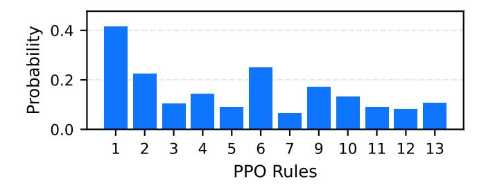
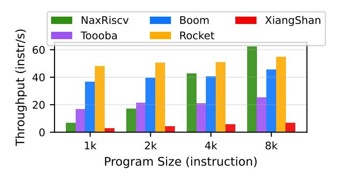
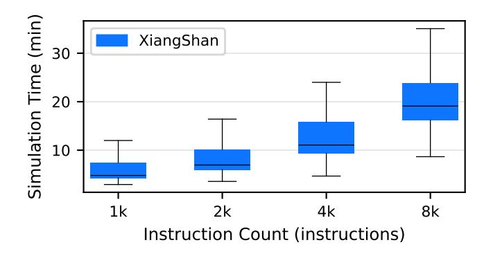
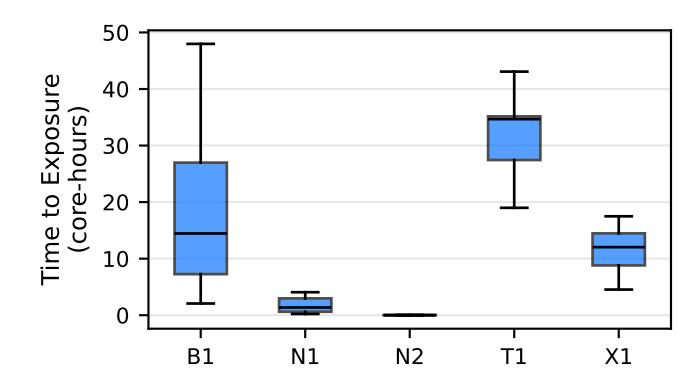

# *B. Synchronization Anchors*

To ensure that the complexity of validating the data flow of test cases remains bounded, we must control the number of memory operations the solver must process. Instead of bounding the number of instructions in a test case, we bound the number of instructions that can be re-ordered, allowing us to verify large test cases in smaller sections. To reset the state of the shared memory, synchronization anchors perform two operations. First, they *synchronize* the cores, such that each section of a test case has a single corresponding section in all harts. Second, they *fence* loads and stores between these sections to ensure the re-orderings remain local within the respective sections. Contrary to control- and data-flow anchors that ensure program-level determinism, synchronization anchors reset non-determinism to keep verification tractable.

#### VII. EVALUATION

We evaluate HARTBREAKER by first investigating whether the generated test programs can sufficiently exercise multi-hart communication channels in Section [VII-A.](#page-7-1) We then evaluate the fuzzing performance of HARTBREAKER, with respect to its instruction throughput in Section [VII-B](#page-8-0) and achieved coverage when compared with the industry standard RISCV-DV [\[7\]](#page-14-14) in Section [VII-C.](#page-9-0) We finally look at the concurrency bugs that HARTBREAKER has discovered in Section [VII-D.](#page-9-1)

Testbed and targets. The evaluation is performed on a machine equipped with two AMD EPYC 7H12 processors at 2.6 GHz containing 256 logical cores and 1 TB of DRAM. We use Verilator [\[12\]](#page-14-29) to simulate designs, and Spike [\[10\]](#page-14-23) as a golden model. We adapt the Verilator version based on the design's requirements if necessary. The experiments involving RISCV-DV [\[7\]](#page-14-14) were run using the UVM framework with a commercial simulator. We tested HARTBREAKER on Rocket [\[16\]](#page-14-30), a simple, in-order CPU, and four out-of-order, superscalar CPUs: BOOM [\[51\]](#page-15-1), Toooba [\[1\]](#page-13-4), NaxRiscv [\[11\]](#page-14-31) and XiangShan [\[49\]](#page-15-2).

## <span id="page-7-1"></span>*A. Multi-Hart Feature Coverage*

To evaluate how well HARTBREAKER can exercise multihart functionalities, we analyze 10'000 generated test programs. We use a default set of parameters that allow a reasonable number of shared memory operations and interrupts, while leaving space for other instructions for maximizing the exploration of microarchitectural states.

Interrupts. We first test the interrupt capabilities of HART-BREAKER. We look for a high frequency of interrupts such that we put the subsystems under stress. We found that interrupts are used in 100% of the generated test cases, with an average of 12.1 IPIs per test case, each consisting of 1600 instructions on average.

Shared memory. We further investigate the *PPO rule coverage* to ensure we can detect all possible forbidden re-orderings. Since the bugs we aim to discover are violations of these rules, it is also critical to cover all of them to avoid masking bugs. We plot the probability that a memory instruction is subject to a given rule in Figure [8.](#page-8-1) We observe that all rules are covered, meaning we can discover bugs related to all rules. Notice that PPO rule number 8 is not included in the plot. This rule enforces the ordering of load-reserve (LR) with respect to its paired store-conditional (SC). LR/SC ordering could be treated as standard loads and stores, with the MCM solver verifying their ordering. We exclude them by choice, as the ISA permits spurious SC failures, making it impossible to

<span id="page-8-1"></span>

Fig. 8: Probability that a memory instruction exercises a given PPO rule. The x axis is the index of a PPO rule as defined in the RISC-V manual [\[8\]](#page-14-13).

<span id="page-8-2"></span>

Fig. 9: Distance between memory operations accessing shared memory.

distinguish legal behavior from liveness bugs without designspecific knowledge.

An additional important factor in exercising the underlying memory consistency implementations is memory operation frequency since CPUs have a bounded re-ordering window depending on the size of hardware structures such as store buffers and queues. Because we want to maximize the amount of re-orderings of memory operations we observe, it is crucial to have a high density of memory operations such that instructions are not too far apart to be re-ordered. Figure [9](#page-8-2) plots the distance between memory operations that access addresses used at least once by both harts in a test case. We observe a good density of memory operations, with reasonable distances between memory operations, enabling many possibilities for the re-ordering of memory operations.

#### <span id="page-8-0"></span>*B. Fuzzing Throughput*

We first investigate what impact the verification of the dataflow has on throughput using the triple-hart Rocket CPU shown in Figure [10.](#page-8-3) We observe that without verification, the throughput converges to a stable value for larger program sizes, creating an optimal program size for fuzzing. However, verification of valid data flows is comparably slow and has a significant impact on the end-to-end throughput when considering both verification and simulation, resulting in a rather stable throughput across all program sizes. The optimal size is therefore a program that is as long as possible to maximize throughput, while keeping the simulation time of the program reasonable for detecting bugs.

<span id="page-8-3"></span>

Fig. 10: HARTBREAKER instruction throughput of the triplehart Rocket CPU with verification enabled and disabled.

<span id="page-8-4"></span>

Fig. 11: HARTBREAKER instruction throughput for each supported CPU, across program sizes. Each CPU uses three harts.

Figure [11](#page-8-4) shows the end-to-end instruction throughput with verification enabled across all supported CPUs, for different program sizes. With the exception of NaxRiscv, we observe that the throughput does in fact stay fairly constant, with only a very slow increase in throughput over the program size. The sharp increase in throughput for the NaxRiscv CPU is due to NaxRiscv's simulator. All CPUs use Verilator [\[12\]](#page-14-29) as a simulator, producing a compiled RTL binary with very short startup time. In contrast, NaxRiscv simulations run through Scala and bind to a Verilator binary via the Java Native Interface, which leads to significantly longer startup times since the simulator must be rebuilt from cached artifacts. As a result, generating longer programs helps amortize this startup cost. Furthermore, we observe that the size of the CPU impacts the throughput, as larger CPUs tend to have much slower simulation performance, as depicted in Figure [12.](#page-9-2) XiangShan [\[49\]](#page-15-2) takes multiple minutes to perform a single simulation, with larger programs increasing simulation times even further. All CPUs we tested followed a similar trend at different scales, e.g., Rocket [\[16\]](#page-14-30) simulation time is measured in seconds.

To further understand the performance impact of each of the components of HARTBREAKER, we evaluate their individual runtime contribution in Figure [13.](#page-9-3) The first step is the generation stage, where the assembly programs are generated. After

<span id="page-9-2"></span>

Fig. 12: XiangShan simulation time in minutes.

<span id="page-9-3"></span>

Fig. 13: Fraction of time spent in each step of the testing pipeline.

the generation, we run the binaries on the Spike ISS [\[10\]](#page-14-23) to gather some values unknown at generation time, such as the values that the stores will commit to memory. The binary is then executed on the RTL simulator of the design under test. Finally, if MCM verification is enabled, we gather the values returned by concurrent loads from the simulator's commit logs, translate the trace into a litmus test that expresses the exact behavior observed, and verify if there exists a valid execution that returns the same values for all loads. We observe that verification makes up the bulk of the runtime overhead across all program sizes, and its share slightly increases for larger programs. However, with verification disabled, we observe that ISS and RTL simulation have the largest remaining impact on performance for smaller programs. For large programs, the bottleneck shifts to RTL simulation alone, showcasing the amortizing effects of larger programs which we have previously observed in Figure [10.](#page-8-3)

#### <span id="page-9-0"></span>*C. Coverage Comparison*

We compare HARTBREAKER against RISCV-DV [\[7\]](#page-14-14), a widely-used random instruction generator for RISC-V verification. To the best of our knowledge, RISCV-DV is the only tool capable of automated generation of multi-hart test programs.

<span id="page-9-4"></span>

Fig. 14: Multiplexer select coverage achieved by HART-BREAKER vs. RISCV-DV on triple-hart Boom v3. 15,872 coverage points.

TABLE IV: Summary of discovered bugs.

<span id="page-9-5"></span>

| CPU name       | Bug Type                      | Bug Alias |
|----------------|-------------------------------|-----------|
|                | Illegal Load-Load re-ordering | N1        |
| NaxRiscv [11]  | CLINT access size             | N2        |
| Toooba [1]     | IPI evaluation timing bug     | T1        |
| BOOM (v4) [51] | Illegal Load-Load re-ordering | B1        |
| Rocket [16]    | None                          |           |
| XiangShan [49] | Out-of-order MIP read         | X1        |

RISCV-DV uses pre-defined test scenarios, which guide random programs towards specific features of a CPU. We ran RISCV-DV using its default multi-hart target, configured for 64-bit designs with three harts. We evaluated coverage on the triple-hart BOOM CPU.

To ensure a fair comparison, we included RISCV-DV test cases that timed out (we use a five-minute timeout) in the coverage calculation, but excluded their execution time from the core-hour count. We ran RISCV-DV and HARTBREAKER with verification for a total of 858 core-hours, and then ran HARTBREAKER without verification until we reached similar coverage. Figure [14](#page-9-4) shows that HARTBREAKER achieved similar coverage to RISCV-DV, while additionally providing multi-hart verification capabilities including IPI support, memory model checking, and deterministic interrupt injection that RISCV-DV lacks. Without verification, HARTBREAKER reached the same coverage as RISCV-DV in a significantly shorter time.

#### <span id="page-9-1"></span>*D. Discovered Bugs*

HARTBREAKER has found five bugs dealing exclusively with shared memory and interrupts across the tested CPUs, summarized in Table [IV.](#page-9-5) HARTBREAKER triggers some of these bugs within minutes, while others require very specific microarchitectural conditions and only surface after several core hours of fuzzing. Figure [15](#page-10-1) displays the Time-to-Exposure (TTE) statistics for each bug accordingly, collected over 20 fuzzing runs each. The NaxRiscv and XiangShan bugs (N1, N2, X1) have been confirmed and fixed by the respective

<span id="page-10-2"></span>TABLE V: Outcome x1=0, x2=1, x3=0 is forbidden.

| Address x initialized to 0 |            |  |
|----------------------------|------------|--|
| P0                         | P1         |  |
|                            | (2) x1 ← x |  |
| (1) x ← 1                  | (3) x2 ← x |  |
|                            | (4) x3 ← x |  |

developers. The other bugs (B1, T1) have been reported to their respective project platforms. Furthermore, the absence of multi-hart bugs in Rocket is not surprising. Rocket implements an in-order pipeline with only limited optimizations in its memory subsystems. The following provides an overview of the individual bugs discovered by HARTBREAKER.

Illegal load-load re-ordering (B1, N1). The B1 and N1 bugs are very similar in nature. Both bugs violate the Coherence of Read-Read (CoRR) ordering, a fundamental memory consistency requirement.

In the example presented in Table [V,](#page-10-2) the outcome (x1 = 0, x2 = 1, x3 = 0) implies that the second and third loads of x on P1 returned values written by different stores, even though there was no intervening store to x between them in program order. Under RVWMO, this case falls under the same-address load–load preserved program order (PPO) rule [\[8\]](#page-14-13):

If two loads to the same byte return values written by different stores and no store to that byte occurs between them, the first load must precede the second in the global memory order (GMO).

Since the younger load (x3) observes an older value than the earlier load (x2), this PPO ordering is not preserved. As a result, the execution violates the load value axiom, which as we discussed in Section [II,](#page-1-2) mandates that each load returns the value of the most recent store that precedes it in both program order and the GMO. Hence, the observed outcome represents a violation of Coherence of Read–Read (CoRR): the hart observes memory that "goes backward in time", i.e., a younger load returns a value older than a previous load from the same address.

IPI evaluation timing bug (T1). T1 is an interrupt handling bug in Toooba's implementation of the mret instruction. The bug occurs when a hart has a pending interrupt while interrupts are currently disabled, but were previously enabled before entering the trap handler. When returning from a trap using mret, the processor should restore the previous interruptenabled state and immediately check if any interrupts are pending. According to the RISC-V specification, if an interrupt is pending after re-enabling interrupts, the processor must handle it immediately. However, Toooba incorrectly proceeds to fetch the next instruction from an invalid address (stored in the exception program counter) before checking for pending interrupts. This causes the processor to trap due to the invalid address instead of the pending interrupt, writing the wrong cause into the trap cause register.

Out-of-order MIP read (X1). XiangShan allows out-oforder reads of the interrupt pending register. This causes the

<span id="page-10-1"></span>

Fig. 15: Time to exposure statistics over 20 runs for each bug. NaxRiscv INT is the measurement for the NaxRiscv interrupt bug, and NaxRiscv MCM for the memory consistency bug.

```
2 # Write(x)
3 sd s1, 0(a1)
5 ...
                        1 lw s7,0(sp) # Load(x) id=0
                        2 ...
                        3 lwu t1,0(s2) # Load(x) id=1
                        4 ...
                        5 lwu s0,0(tp) # Load(x) id=2
```

(a) Hart 0 instructions.

(b) Hart 1 instructions.

Fig. 16: B1 test case excerpt. Hart 0 performs a store to an address and hart 1 concurrently reads from it with three consecutive loads. The resolution of load 1's address is delayed by complex computations, creating a race condition that results in load 2 reading a stale value.

processor to miss newly-arrived interrupts that should have been visible, violating the expected ordering between interrupt updates and their observation.

CLINT access size restriction (N2). To send an IPI, a hart cannot directly modify another hart's interrupt registers. Instead, it must write to a memory-mapped register managed by the CLINT using a regular memory store instruction. The RISC-V specification requires the CLINT to support store operations of any size (byte, halfword, or word). However, we found that NaxRiscv's CLINT implementation only accepts full-word stores, incorrectly raising an exception when a program attempts to use a store-byte instruction.

## <span id="page-10-0"></span>*E. Microarchitectural root cause analysis*

In the following, we discuss the specific microarchitectural root causes for two particularly interesting bugs discovered by HARTBREAKER. Notably, triggering them requires complex structural and computational dependencies, as well as exercising the involved microarchitectural components. HART-BREAKER is capable of generating such programs for the first time, revealing edge cases that could not be detected by existing tooling. Figure [16](#page-10-3) and Figure [17](#page-11-0) show simplified versions of the test cases, where interleaving instructions have been removed for clarity. A complete version can be found in the Appendix Figure [19](#page-12-0) and Figure [18.](#page-12-1)

```
4 # Write(x)
5 sw x2, 0(a1)
7 ...
                        1 sd a0, 0(a1) # Write(x)
                        2 ...
                        3 lb s2, 0(a1) # Load(x) id=0
                        4 ...
                        5 lbu s5, 0(a1) # Load(x) id=1
                        6 ...
                        7 lwu sp, 0(a1) # Load(x) id=2
```

(a) Hart 0 instructions.

(b) Hart 1 instructions.

Fig. 17: N1 test case excerpt. Hart 1 is writing to an address x and subsequently reads from it using three consecutive loads of different widths. Hart 0 concurrently writes to that address. The last load returns a stale value.

Bug B1. The bug manifests when a hart stores to an address, and another hart has three concurrent in-flight loads, see Figure [16.](#page-10-3) Because load 1's address computation is delayed (e.g., by a multi-cycle instruction), load 2 succeeds *beforehand*, ahead of load 1. Simultaneously, a concurrent store from hart 0 triggers a coherency probe. This invalidates the cache line, but no corrective action is taken on load 2, which has already succeeded. Load 1, however, returns the newer data, as it has not yet succeeded. When the older load's address is unresolved, the younger load can bypass the coherency check and succeed with a stale value.

Bug N1. This bug involves a same-hart store followed by three loads to the same address, while another hart concurrently stores to that address, see Figure [17.](#page-11-0) A size mismatch between the same-hart store and the subsequent loads on hart 1 prevents store-to-load forwarding, forcing the loads to wait until the store's entry is freed from the store queue. Intervening instructions between the loads spread their dispatch across multiple cycles, such that the store queue entry is freed after load 0 and load 1 check for pending stores but before load 2. Load 0 and load 1 are therefore scheduled to replay, while load 2 is marked as succeeded and has no more replay path. Before load 1 replays, the store on hart 0 becomes available and sends a probe to invalidate the cache line. When load 1 then replays, it will use the updated cache line. However, the load-store unit provides no mechanism to invalidate already-completed loads when a coherency event changes the underlying cache line. Load 2 is therefore never replayed and commits with the stale value.

