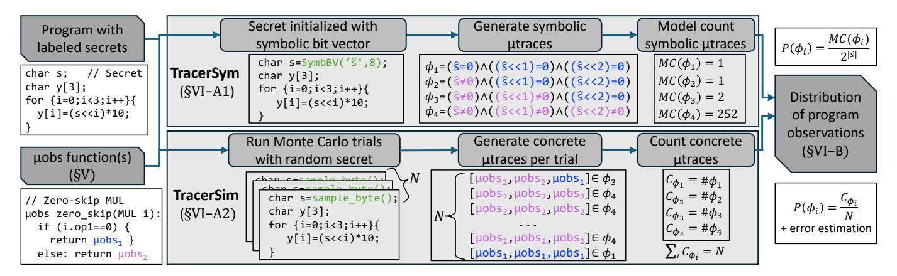

# VI. TRACER: DERIVING ATTACKER OBSERVATIONS OF PROGRAMS WITH $\mu$ OBS FUNCTIONS

To quantify side-channel leakage of a program's secret inputs when it runs on a microarchitecture (modeled by a set of  $\mu$ obs functions), Helium introduces Tracer (§VI-A). Tracer computes the probability distribution of program-level attacker observations, termed  $\mu$ traces, which are sequences of instruction-level  $\mu$ obs produced when the program runs due to  $\mu$ obs functions. Given Tracer's output, Helium derives parameters for PML tail-bound privacy guarantees (§VI-B).

#### A. Computing Program-Level µtrace Distributions

Tracer features two methods for computing program-level  $\mu$ trace probability distributions: TracerSym (§VI-A1) and TracerSim (§VI-A2). Both accept as inputs: a binary program P, a list of P's secret inputs, and a set of  $\mu$ obs functions  $F = \{f_{xp_0}^{\mu obs}, f_{xp_1}^{\mu obs}, ...\}$ , where  $f_{xp_i}^{\mu obs}$  denotes the  $\mu$ obs function for a transponder (intrinsic transmitter, §III-A) with opcode  $xp_i$ . The following explanations of both Tracer variants assume P is the program in Fig. 5, which accepts one secret input s and runs on a microarchitecture with one  $\mu$ obs function,  $f_{MUL}^{\mu obs} = \{i.op1 = 0, i.op1 \neq 0\}$ .

1) TracerSym: SymbEx and Model Counting Approach: TracerSym is an exact method for computing  $\mu$ trace probabilities using symbolic execution and model counting.

Symbolic execution runs a program with symbolic inputs, maintaining the symbolic state of execution. This state consists

Fig. 5: Helium's two approaches to compute the probability distribution of  $\mu$ traces. Top: TracerSym uses symbolic execution to generate symbolic  $\mu$ traces and model counting to compute the probability of each concrete  $\mu$ trace. Bottom: TracerSim uses simulation with inputs sampled from a user-specified distribution (uniformly random by default) to estimate the probability of concrete  $\mu$ traces. N is the number of Monte Carlo trials.

of a mapping of variables to symbolic expressions, known as a *symbolic store*, and a formula encoding the branch conditions of the control-flow path being explored, known as a *path constraint*. Upon reaching a conditional branch with symbolic operands, symbolic execution forks the symbolic state and explores each reachable control-flow path. The taken (not taken) path is reachable if the path constraint conjuncted with the branch condition (its negation) is satisfiable. Non-branches simply update the symbolic store.

TracerSym extends the symbolic state to incrementally build a set of symbolic  $\mu$ trace constraints that characterize all possible symbolic  $\mu$ traces, as shown in Fig. 6. Execution begins by initializing the secret input to P as a symbolic bitvector  $\hat{s}$  and defining an initial  $\mu$ trace constraint set  $C_0 = \{True\}$ . During symbolic execution, TracerSym incrementally generates a sequence of  $\mu$ trace constraint sets  $C_1, ... C_n$  per program control-flow path, where n is the number of dynamic secret-dependent transponders encountered along that path.

To do this, TracerSym intercepts transponders (multiplies in Fig. 6) during symbolic execution. Upon reaching the  $j^{th}$ secret-dependent transponder along a control-flow path, TracerSym retrieves its symbolic operand list,  $O_j$ , and constructs  $C_i$  by conjuncting each constraint in  $C_{i-1}$  with each constraint in the transponder's  $\mu$ obs function (i.e., each  $c \in f_{op(j)}^{\mu obs}$ ) evaluated over  $O_j$ . It then only includes the observable, i.e., satisfiable, resulting formulas (black nodes in Fig. 6) in  $C_j$ :  $C_j = \{\phi \land c(O_j) \mid (\phi, c) \in C_{j-1} \times f_{op(j)}^{\mu obs}, \mathrm{SAT}(\phi \land c(O_j))\}$ where  $C_{j-1} \times f^{\mu obs}_{op(j)}$  is the cross product of  $C_{j-1}$  and  $f_{op(j)}^{\mu obs}$ . Unsatisfiable formulas are discarded (white nodes in Fig. 6). Thus, each  $\phi \in C_j$  describes a partial observable symbolic  $\mu$ trace covering the first j dynamic transponders. When symbolic execution reaches the end of a control-flow path, TracerSym has produced a set of constraints  $C_n$ , where each  $\phi \in C_n$  is a complete symbolic  $\mu$ trace. In other words, a symbolic  $\mu$ trace is a formula that captures the set of secret input values that produce some concrete  $\mu$ trace, where a

concrete  $\mu$ trace is a concrete sequence of  $\mu$ obs.

Fig. 6: TracerSym executing a program with one control-flow path, assuming one  $\mu$ obs function for MUL transponders. Secret-dependent transponders are highlighted. TracerSym constructs a tree per control-flow path. The root denotes initializing the secret input and  $\mu$ trace constraint set  $C_0$ . Black (white) nodes denote partial reachable (unreachable)  $\mu$ traces, expressed as the conjunction of edge labels along the path from the root to the node. Black leaves denote complete  $\mu$ traces. Tree level j corresponds to the  $j^{th}$  dynamic secret-dependent transponder along a control-flow path. To construct level j, TracerSym separately conjuncts the partial  $\mu$ trace corresponding to each black node in tree level j-1 with each observation constraint from the  $j^{th}$  secret-dependent transponder's  $\mu$ obs function applied to its symbolic operands. Resulting formulas that are SAT (UNSAT) instantiate black (white) nodes in level j.  $C_j$  contains all reachable symbolic  $\mu$ traces in level j.

When symbolic execution reaches a symbolic control-flow divergence and forks the program's symbolic state, TracerSym forks the  $\mu$ trace constraint sets as part of the symbolic state. When symbolic execution finishes exploring a control-flow path, TracerSym conjuncts the path constraint with each  $\phi \in C_n$ . Thus, each  $\mu$ trace includes  $\mu$ obs function constraints and the symbolic execution path constraint. However, the programs considered in §VII do not have secret-dependent control flow, such that the symbolic path constraint is trivially satisfiable.

To compute  $\mu$ trace probabilities, TracerSym bit-blasts each symbolic  $\mu$ trace in  $C_n$  to yield a boolean SAT formula, which it model counts (i.e., counts the satisfying assignments of) to determine the number of concrete input values that produce the concrete  $\mu$ trace it describes [69], [83], [86]. Assuming a uniform distribution of the secret input, the probability of each concrete  $\mu$ trace is the model count result divided by the size of the input space,  $2^{|\hat{s}|}$ , as shown in Fig. 5.

Using model counting to compute  $\mu$ trace probabilities requires a uniform distribution over the symbolic input. This assumption often holds for security-critical inputs such as cryptographic keys. When program inputs follow a known, non-uniform distribution, Helium uses TracerSim to sample inputs from the desired distribution.

2) TracerSim: Monte Carlo Simulation Approach: For some applications, symbolic execution and model counting are not tractable for computing leakage. For example, if an instruction's operand is the output of a cryptographic hash, an SMT solver would need to reason about a function designed to resist inversion. Although this is a limitation of symbolically executing cryptographic programs, as security researchers, we appreciate that cryptographic guarantees are strong.

Instead, TracerSim estimates probabilities of concrete  $\mu$ traces by executing P with random secret inputs for N trials, sampled from a user-provided distribution, as shown in Fig. 5. Using dynamic binary instrumentation, TracerSim records the dynamic transponder operand values at runtime to produce a concrete  $\mu$ trace per trial. It estimates  $\mu$ trace probabilities by dividing the frequency of each  $\mu$ trace by N.

