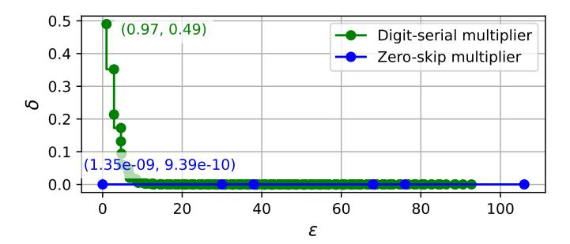

# B. Leakage Quantification

Using the  $\mu$ trace probability distribution output by Tracer, Helium computes PML for each observation by finding  $x \in X$  that maximizes  $\log \frac{P_{X|Y=y}(x)}{P_X(x)}$ . When considering deterministic  $\mu$ traces (due to our focus on deterministic channels, §III-A), the PML of an observation simplifies to:  $\ell(y) = -\log P_Y(y)$ .

PML allows defining a range of privacy guarantees [79]. Helium outputs tail-bound guarantees, which are most useful when high-probability observations leak little information, but low-probability observations leak a lot. Recall that tail-bound guarantees partition observations into two sets—those with PML below and above a threshold  $\epsilon$ —where the total probability of observations with PML above  $\epsilon$  must be at most  $\delta$  (§IV-D). For some program- $\mu$ obs function combinations, this partition arises naturally: one or a few  $\mu$ traces carry most of the probability mass (and therefore exhibit low leakage), while the remaining traces occur rarely and correspond to high leakage. We call this a "tolerable partition" of  $\mu$ traces.

When a tolerable partition exists, Helium selects the  $\mu$ trace with the lowest probability in the tolerable (low leakage) set. We call this the  $\epsilon$ - $\mu$ trace. Equivalently, the  $\epsilon$ - $\mu$ trace has the highest tolerable PML. Helium sets  $\epsilon$  to the PML of the  $\epsilon$ - $\mu$ trace. Thus, all other  $\mu$ traces in the tolerable set have PML less than  $\epsilon$ . Helium then computes  $1-\delta$  as the total probability of all tolerable  $\mu$ traces. Although there are infinitely many possible tail-bound guarantees, this novel construction yields

one that is particularly interpretable: the program leaks no more than a tolerable amount with probability  $1-\delta$ , where both  $\epsilon$  and  $\delta$  are relatively small. However, it is not guaranteed that such a partition, and thus a meaningful tail-bound guarantee, exists for all programs: every  $\mu$ trace may exhibit leakage exceeding what a programmer determines is tolerable.

Monte Carlo Sampling Error (TracerSim): While Tracer-Sim offers substantial scalability advantages over TracerSym by avoiding symbolic execution, Monte Carlo sampling can only estimate  $\mu$ trace probabilities. To account for sampling error, Helium defines tail-bound guarantees with an associated confidence level. TracerSim uses Clopper–Pearson confidence intervals [29] to produce conservative tail bound parameters,  $\epsilon$  and  $\delta$ . This requires two rounds of sampling, i.e., running TracerSim twice. As a result, TracerSim's tail-bound guarantees hold with a chosen confidence level (95% by default).

In round one, TracerSim runs  $N_1$  trials, and the empirical distribution is used to identify a tolerable leakage partition. Helium selects the  $\epsilon$ - $\mu$ trace from the tolerable partition and sets  $\epsilon$  to the PML of the Clopper–Pearson lower bound on the  $\epsilon$ - $\mu$ trace probability. Since smaller probabilities yield higher PML, this gives a conservative  $\epsilon$  that accounts for sampling error.  $\epsilon$  is then fixed to avoid selection bias in round two.

The second round runs  $N_2$  trials and classifies  $\mu$ traces by whether their PML exceeds  $\epsilon$ . We set  $1-\delta$  to the Clopper–Pearson lower bound on the total probability of  $\mu$ traces with PML below  $\epsilon$ , conservatively overestimating the mass above  $\epsilon$ . Thus, using 95% Clopper–Pearson intervals yields a 95% confidence that the tail-bound guarantee holds.

The two sample sizes may differ: larger  $N_1$  tightens the bound on  $\epsilon$ , while larger  $N_2$  tightens the bound on  $\delta$ . Thus, larger  $N_1$  and  $N_2$  produce more precise statistical guarantees at the cost of increased runtime. In practice, when all  $\mu$ traces have similar probabilities, small N suffices to demonstrate that all traces leak substantially, indicating mitigation is warranted. Larger N is useful for tightening bounds on rare, high-leakage  $\mu$ traces. In either round, if TracerSim observes only a single  $\mu$ trace, instead of using Clopper-Pearson, we apply the Rule of Three [45]: with 95% confidence, any unobserved event has probability less than  $\frac{3}{N}$ . Thus, TracerSim estimates the single observed  $\mu$ trace's probability as at least  $1-\frac{3}{N}$ , which is a tighter lower bound than provided by Clopper-Pearson.

#### C. Practical Considerations: TracerSym vs. TracerSim

TracerSym computes the exact  $\mu$ trace distribution, yielding precise tail-bound guarantees. However, it inherits the well-known scalability limitations of symbolic execution: large programs can induce path explosion, and complex path constraints can quickly overwhelm the engine [12]. Further, TracerSym introduces additional constraints for each transponder. Consequently, TracerSym is practical when the number of  $\mu$ traces remains manageable and symbolic operand expressions stay tractable under the program's semantics. Its performance degrades when execution generates many  $\mu$ traces or operand expressions contain thousands to millions of clauses. For some workloads, especially cryptographic code, the resulting

SMT queries can become intractable, since solving them may amount to breaking the underlying cryptographic primitives.

TracerSim is applicable in cases where symbolic execution is infeasible, such as large programs and cryptographic workloads, demonstrated by the large programs evaluated in Case Study IV ([§VII-D\)](#page-10-0). TracerSim trades precision for scalability by producing conservative statistical guarantees. Beyond its scalability benefits, TracerSim supports arbitrary input distributions, offers the user a runtime-precision tradeoff via N1 and N2 tuning, and can be parallelized due to its independent Monte Carlo trials.

Helium is not intended to provide cryptographic proofs of security. In cases where symbolic execution is tractable, TracerSym can in principle compute leakage probabilities small enough for cryptographic security (≤ 2 −80). For TracerSim, sampling large enough N to obtain cryptographic guarantees is intractable, effectively amounting to brute-force search. Helium instead targets an impactful design space in which programmers are willing to sacrifice absolute security for performance. Helium enables principled navigation of securityperformance trade-offs with greater precision and more conservative guarantees than prior average leakage approaches ([§IX\)](#page-12-0).

#### VII. CASE STUDIES: APPLYING HELIUM TO WEIGH SECURITY-PERFORMANCE TRADE-OFFS

We evaluate Helium through four case studies, which highlight the benefits and limitations of each approach. The first two ([§VII-A,](#page-8-1) [§VII-B\)](#page-9-0) demonstrate TracerSym in cases where it is feasible, including cryptographic code under certain circumstances and non-cryptographic programs, respectively. These two case studies produce privacy guarantees for two programs assuming two alternative µobs functions for multiply transponders. We show that no data-dependent hardware optimization is universally more or less secure than another for all programs. The third case study ([§VII-C\)](#page-9-1) evaluates the scalability of TracerSym. Lastly, the fourth case study ([§VII-D\)](#page-10-0) examines sets of µobs functions modeling computation simplification optimizations targeted by a recent zeroleakage software defense [\[37\]](#page-13-15). Helium uses TracerSim to evaluate the same programs as this prior work. We show that allowing a small probability of leakage can substantially reduce the defense's runtime overhead. This last case study demonstrates applicability and scalability to real-world reasoning about security-performance trade-offs.

For all experiments, we use Helium to compute leakage for a single random, public input value. It is not guaranteed that leakage remains conservative for all public input values; however, in some of the evaluated programs, it is in fact conservative, because the µtrace distribution is independent of public inputs ([§VII-A\)](#page-8-1). Identifying the public input that maximizes leakage—known as attack synthesis [\[59\]](#page-14-32), [\[73\]](#page-14-33), [\[75\]](#page-14-26)—requires quantifying leakage. A natural extension of our work is using Helium to drive attack synthesis ([§VIII\)](#page-11-0).

Helium's TracerSym implementation extends the Angr [\[85\]](#page-14-34) symbolic execution engine. It uses the Bitwuzla [\[69\]](#page-14-29) and CSB [\[84\]](#page-14-35) SMT solvers for constraint solving. For model

Fig. 7: Tail-bound guarantees of Poly1305 under two multiply optimizations. Each point defines (ϵ, δ), where ϵ is the PML of a µtrace and δ is the sum of probabilities of µtraces with PML > ϵ.

counting, Helium uses Ganak [\[83\]](#page-14-30), which guarantees correctness with configurable probability [\[83\]](#page-14-30). TracerSym uses a probability of 0.95. Empirically, Ganak's outputs are far more accurate than its theoretical guarantee: prior work reports it is correct on all of their 1650 benchmarks [\[83\]](#page-14-30). TracerSim is implemented with Intel Pin [\[65\]](#page-14-36) for dynamic binary instrumentation. The case studies were run on two compute nodes with two 32-core 2.9GHz Intel Xeon CPUs with 512GB RAM.

### *A. Case Study I: Poly1305*

Our first case study examines Poly1305 (from Libsodium [\[33\]](#page-13-25)), a cryptographic message authentication code [\[16\]](#page-13-42), [\[70\]](#page-14-37). We quantify how much Poly1305 leaks about its 128-bit secret key when running on hardware implementing either a zero-skip or digit-serial multiplier. The zero-skip µobs function is modified from Fig. [1](#page-1-0) to only consider whether the second operand is zero. The digit-serial µobs function is modified from Fig. [4](#page-5-2) to accommodate 64-bit operands such that there are eight total observations. The secret is assumed to be uniformly distributed, and we compute the probability of each observation using TracerSym.

Fig. [7](#page-8-2) plots achievable (ϵ, δ) pairs, where the x-axis is the candidate ϵ value (PML of each µtrace) and the y-axis is the cumulative probability of observing leakage greater than ϵ. Thus, each point defines a valid tail-bound guarantee.

We first analyze Poly1305 with the zero-skip multiplier. Following [§VI-B,](#page-7-0) we select ϵ as the leftmost labeled point, corresponding to the PML of the least leaky µtrace (i.e., the case in which all secret-dependent multipliers are nonzero), and δ is the total probability of observations with PML greater than ϵ. The resulting tail-bound guarantee is:

$$P_Y[\ell(Y) \le 1.35 \cdot 10^{-9}] \ge 1 - 9.39 \cdot 10^{-10}$$

This shows that for a uniformly distributed key, Poly1305 leaks very little information with high probability when executing on hardware that implements a zero-skip multiplier.

We next consider leakage under the digit-serial multiplier. Again using TracerSym, we compute the PML of all µtraces and obtain the tail-bound guarantee:

$$P_Y[\ell(Y) \le 0.97] \ge 1 - .49$$

With probability nearly 0.5, Poly1305 running on hardware with a digit-serial multiplier leaks over 0.97 bits of the key.

| Optimization Runtime # SMT |     |        | Time per | # MC | Time per                               |  |
|----------------------------|-----|--------|----------|------|----------------------------------------|--|
|                            | (s) |        |          |      | queries SMT query queries MC query (s) |  |
| Case Study I (§VII-A)      |     |        |          |      |                                        |  |
| Zero-skip                  | 54  | 225    | 0.0012   | 8    | 2.1833                                 |  |
| Digit-serial               | 735 | 36,618 | 0.0011   | 660  | 0.1626                                 |  |
| Case Study II (§VII-B)     |     |        |          |      |                                        |  |
| Zero-skip                  | 20  | 99     | 0.0009   | 8    | 0.0071                                 |  |
| Digit-serial               | 19  | 10     | 0.0059   | 1    | 0.0099                                 |  |

TABLE III: Case Studies I & II runtime statistics. MC: model counting.

| Optimization | #µtraces | ϵ | δ | Tail-bound guarantee |
|--------------|----------|---|---|----------------------|
| Zero-skip    | 8        | 3 | 0 | P[ℓ(y) = 3] = 1      |
| Digit-serial | 1        | 0 | 0 | P[ℓ(y) = 0] = 1      |

TABLE IV: Tail-bound guarantees of a convolution SVG filter of 3 pixels across two different multiplication optimizations.

Reasoning about side-channel leakage probabilities under different hardware optimizations enables programmers to select mitigations accordingly. For example, zero-skip multiplication has extremely low leakage probability for Poly1305, so a programmer may choose to forgo expensive zero-leakage mitigations. Conversely, digit-serial multiplication yields a high leakage probability, so a Poly1305 implementation will likely require some degree of hardware or software mitigation.

#### *B. Case Study II: SVG Convolution Filter*

Many domains beyond cryptography process confidential information. For example, web browsers must prevent untrusted JavaScript processes from inferring the values of rendered pixels. When rendering an SVG image, a browser first draws each element according to its attributes (color, position, size, etc.). If an SVG filter is specified, the browser applies the filter to the rendered element before displaying the result. Prior work shows that control-flow, cache, and subnormal floating point side channels can allow malicious web pages to exploit SVG filters to recover pixel data [\[61\]](#page-14-38), [\[62\]](#page-14-28), [\[71\]](#page-14-39), [\[82\]](#page-14-40), [\[88\]](#page-15-14). This case study is modeled after these attacks, which isolate individual pixels of interest and then apply attacker-chosen SVG filters to leak the pixel value.

We analyze Firefox's [\[38\]](#page-13-26) convolution SVG filter under the same two multiplication µobs functions from [§VII-A](#page-8-1) to illustrate the importance of program-specific reasoning about the leakage of data-dependent optimizations. We assume that the program's secret input is three pixels and that each pixel is black or white with equal probability. Thus, the secret is exactly three bits, where each bit indicates whether the pixel is black or white. Prior work shows how to isolate a single pixel and binarize it to black and white to perform pixel stealing attacks with cache or floating-point side channels [\[7\]](#page-13-9), [\[88\]](#page-15-14). We consider three pixels rather than one to highlight the intuitive nature of the PML metric. The convolution matrix is set to all ones so that attacker-controlled filter parameters do not trigger zero-skip behavior. We use TracerSym to analyze a program that convolves across the three secret pixels using Firefox's SVG filter feConvolveMatrix and compute the exact probabilities of all µtraces.

Table [IV](#page-9-2) summarizes these results. For zero-skip, Helium yields 8 µtraces, each with a PML of 3. This indicates that every observation discloses the entire secret. Under digit-serial multiplication, Helium returns a single µtrace. As the µobs function in Fig. [4](#page-5-2) describes, digit-serial multiplication has a fixed execution time for a single byte operand, regardless of its value. Since each pixel is one byte, supplying it as an operand to a multiply always yields the same µobs. Therefore, the PML for µtraces under digit-serial multiplication is zero.

This case study highlights two important points. First, the relative security of the two optimizations is inverted for the SVG filter compared to Poly1305, underscoring the importance of computing an optimization's leakage for a specific program. Second, this experiment illustrates that improved performance from a data-dependent optimization for a particular application does not always reduce its security. Because digitserial multiplication reduces the number of cycles when the upper bytes of an operand are zero, it can provide meaningful performance gains on pixels that each consist of a single byte. Overall, abstract µobs functions allow programmers to evaluate whether enabling optimizations introduces acceptable risk of leakage for their workload.

Table [III](#page-9-3) reports runtime statistics of Case Studies I and II, demonstrating examples of program-µobs function combinations where exact results are attainable with TracerSym.

#### *C. Case Study III: TracerSym Scalability Evaluation*

To study TracerSym's scalability, we run several small image-transformation kernels on 2×2 and 3×3 pixel images, where each pixel is symbolic and constrained to be black or white. One transformation applies a box blur using Firefox's 2D convolution implementation; the others are simple transformations (posterization, channel swapping, packing, bit reversal, thresholding, and nibble interleaving) we design to stress arithmetic and bitwise instructions.

Fig. [8](#page-10-1) shows runtime and SMT query count while varying (i) the number of dynamic instrumented instructions and (ii) the number of µobs per µobs function. To increase the number of instrumented instructions, we apply zero-skip µobs functions for different instruction opcodes, including multiply, add, bitwise operations, and shifts. From the plots on the left, runtime and SMT query count increase substantially with the number of instrumented instructions.

To vary the number of µobs per µobs function, the righthand plots focus on multiply instructions. We modify a digitserial multiplier optimization to operate on bit widths of 8, 4, 2, and 1 bit(s), so that a single pixel exhibits 1, 2, 4, or 8 µobs per multiply. Again, runtime and SMT query count increase with the number of µobs per µobs function.

In the worst case, TracerSym's runtime and number of SMT queries increase exponentially with the number of instrumented instructions, making TracerSym intractable for some programs. In others, the set of reachable µtraces saturates early, after which runtime grows approximately linearly, and TracerSym remains practical. Note that runtime depends not just on the number of SMT queries, but also on their

Fig. 8: Runtime and number of SMT queries vs. number of dynamic instructions instrumented with µobs functions (left) and vs. number of µobs per µobs function (right). The left instruments different opcodes with zeroskip µobs functions to increase dynamic instructions; the right instruments MUL instructions with µobs functions with varying numbers of output µobs.

| Instruction   | Unsafe     | Unsafe     | Category      |      |
|---------------|------------|------------|---------------|------|
| type          | operand(s) | value(s)   | 64 bit 32 bit |      |
| ADD           | Both       | {0}        | cs64          | cs32 |
| SUB           | Second     | {0}        | cs64          | cs32 |
| MUL           | Both       | {0,1}      | mul64         | cs32 |
| OR, AND, XOR  | Both       | {0, 0xFFF} | cs64          | cs32 |
| SHL, SHR, SAL | Both       | {0}        | cs64          | cs32 |
|               | First      | {0, 0xFFF} | cs64          | cs32 |
| SAR           | Second     | {0}        | cs64          | cs32 |

TABLE V: Computation simplification cases studied in cio [\[37\]](#page-13-15). Unsafe operands induce a "fast path" when their values are in the unsafe value set.

complexity. Lastly, model counting scalability is limited by the complexity of the µtraces produced by symbolic execution, which increases with program complexity. Anecdotally, whenever TracerSym's SMT queries remained tractable, the corresponding model counting queries did as well.

#### *D. Case Study IV: Security-Performance Trade-offs*

We apply Helium's simulation-based analysis, TracerSim, to compute security-performance trade-offs of a recent stateof-the-art software mitigation, cio, applied to cryptographic code [\[37\]](#page-13-15). Cio uses compiler passes to force secret-dependent unsafe operands to never take values that trigger a fast path, thereby eliminating data-dependent behavior. Specifically, cio transforms a leaky instruction into a sequence of non-leaky instructions that are semantically equivalent but whose operands are modified so that all instructions always exhibit the same µobs. For example, to force a 32-bit subtraction to always have a non-zero second operand such that it exhibits a slow µobs, the following transformation is applied: both operands are zero-extended, their 33rd bits are set to 1, subtraction is performed, and the lower 32 bits of the result are extracted. While effective at eliminating leakage, these mitigations impose substantial performance overhead.

Table [V](#page-10-2) summarizes computation simplification optimizations examined in prior work [\[37\]](#page-13-15). Each entry lists the arithmetic operation, the operand positions considered unsafe, the unsafe values per operand, and the category for 32-bit and 64-bit instructions as defined by the authors. We assume that

|          | # inst            | Trial    | cio         | Tail-bound guarantee          |  |  |  |
|----------|-------------------|----------|-------------|-------------------------------|--|--|--|
| Category | instrum.          | time (s) | overhead    | P[ℓ(Y ) ≤ ϵ] ≥ 1 − δ          |  |  |  |
|          | Chacha20-Poly1305 |          |             |                               |  |  |  |
| mul64    | 72                | 0.4      | 2.31×       | P[ℓ(Y ) ≤ 0.0004] ≥ 0.9997    |  |  |  |
| cs64     | 470               | 0.6      | 2.67×       | P[ℓ(Y ) ≤ 2.1461] ≥ 0.9552    |  |  |  |
| cs32     | 2,081             | 0.6      | 3.37×       | P[ℓ(Y ) ≤ 0.0062] ≥ 0.9947    |  |  |  |
|          | AES-GCM           |          |             |                               |  |  |  |
| mul64    | -                 | -        | No overhead | -                             |  |  |  |
| cs64     | 80                | 0.5      | 1.42×       | P[ℓ(Y ) ≤ 0.0004] ≥ 0.9997    |  |  |  |
| cs32     | -                 | -        | No overhead | -                             |  |  |  |
|          |                   |          | Ed25519     |                               |  |  |  |
| mul64    | 17,443            | 0.5      | 8.79×       | All µtraces have high leakage |  |  |  |
| cs64     | 51,326            | 0.9      | 6.51×       | All µtraces have high leakage |  |  |  |
| cs32     | 3,074             | 0.6      | 1.05×       | All µtraces have high leakage |  |  |  |
| Argon2id |                   |          |             |                               |  |  |  |
| mul64    | 67,763,194        | 29.8     | 15.71×      | All µtraces have high leakage |  |  |  |
| cs64     | 297,818,331       | 125.7    | 8.78×       | All µtraces have high leakage |  |  |  |
| cs32     | 2,297,665         | 1.8      | 1.06×       | P[ℓ(Y ) ≤ 0.0255] ≥ 0.9814    |  |  |  |

TABLE VI: Tail-bound guarantees vs. software mitigation (cio) overhead [\[37\]](#page-13-15). The number of instrumented instructions refers to dynamic instructions. Trial time is the time per Monte Carlo trial.

| Function                | # MUL inst instrum. | Tail-bound guarantee          |
|-------------------------|------------------------|-------------------------------|
| ge25519_p3_tobytes      | 4,902                  | P[ℓ(Y ) ≤ 0.0004] ≥ 0.9997    |
| sc25519_muladd          | 228                    | P[ℓ(Y ) ≤ 1.0447] ≥ 0.9934    |
| sc25519_reduce          | 168                    | P[ℓ(Y ) ≤ 2.2566] ≥ 0.8781    |
| ge25519_scalarmult_base | 12,145                 | All µtraces have high leakage |

TABLE VII: Leakage guarantee breakdown by function: Ed25519 for mul64.

all unsafe values result in a transponder exhibiting the same "fast" µobs. Category mul64 includes only 64-bit multiplication, cs64 includes all 64-bit computation simplification cases excluding multiplication, and cs32 includes 32-bit computation simplification optimizations including multiplication.

We aim to determine whether accepting a small, quantifiable probability of leakage can significantly reduce this overhead while still providing conservative guarantees. We evaluate Helium on four cryptographic workloads (Chacha20- Poly1305, AES-GCM, Ed25519, and Argon2id) across the three optimization categories (mul64, cs64, cs32). TracerSim is run with 20,000 trials (10,000 each to compute ϵ and δ) on the unmodified Libsodium binary (version 1.0.18-RELEASE) [\[33\]](#page-13-25) that was used in the baseline for a single 100-character public value. Table [VI](#page-10-3) summarizes the resulting tail-bound guarantees of unmitigated software and compares them with the software mitigation overheads reported by prior work [\[37\]](#page-13-15).

*Chacha20-Poly1305:* Prior work reports 2.31–3.37× overhead for mitigating mul64 and cs32 optimizations in Chacha20-Poly1305. For mul64, TracerSim observes only a single µtrace among both sets of 10,000 samples. Using the Rule of Three ([§VI-B\)](#page-7-0), we conservatively estimate the probability of all unobserved traces as 3 N , obtaining the tailbound guarantee:

$$P_Y[\ell(Y) \le 0.0004] \ge 1 - \frac{3}{N} = .9997$$

For the cs32 category, TracerSim produces the guarantee:

$$P_Y[\ell(Y) \le 0.0062] \ge 0.9947$$

If these probabilities of leakage are acceptable, a programmer may safely eliminate 2.31× overhead for mul64 and 3.37× for cs32. For cs64, TracerSim yields a weaker guarantee:

$$P_Y[\ell(Y) \le 2.1461] \ge 0.9552$$

If a programmer considers this leakage too large, they may choose to mitigate only cs64 instructions, substantially reducing the total overhead of mitigating all three categories.

*AES-GCM:* The Libsodium AES-GCM implementation contains no 64-bit multiply operations and few 32-bit arithmetic instructions. Thus, prior work reports 0% overhead for mul64 and cs32, and we omit these categories. For cs64, TracerSim again observes only one µtrace, yielding the same tail-bound guarantee using the Rule of Three computed for Chacha20-Poly1305, where ϵ = 0.0004 and 1 − δ = .9997. Again, if this leakage risk is tolerable, the 1.42× overhead associated with mitigating cs64 instructions could be avoided.

*Ed25519:* TracerSim finds the vast majority of µtraces occur once, indicating significant leakage per µtrace. To determine which functions in Ed25519 have significant leakage, we evaluate four functions in isolation for the mul64 category, shown in Table [VII.](#page-10-4) Two functions, ge25519\_p3\_tobytes and sc25519\_muladd, exhibit relatively small leakage with high probability; others (sc25519\_reduce and ge25519\_scalarmult\_base) show substantial leakage. Notably, evaluating the leakage per function enables selective mitigation: programmers may choose to only protect functions that leak heavily, avoiding the full 8.79× overhead for mul64.

*Argon2id:* For Argon2id, the evaluation shows that cs64 and mul64 categories require mitigation. The cs32 category offers a small margin for security–performance trade-offs.

*Summary:* Table [VI](#page-10-3) shows the number of dynamically instrumented instructions and runtime per Monte Carlo trial for each workload. For workloads with fewer than 50,000 instrumented instructions, Pin overhead dominates and pertrial runtime stays below one second. For Argon2id, which has the most instrumented instructions, runtime per trial increases linearly with the number of instrumented instructions. The trials are easily parallelizable. Finally, storing traces incurs memory overhead, which can be readily reduced via collisionresistant hashing and lossless compression.

The programs evaluated are not only large but also complex, demonstrating that TracerSim can derive PML security guarantees at scale. Across all workloads, Helium's tail-bound guarantees provide a probabilistic, interpretable measure of leakage, enabling programmers to reason about how often the program might exceed a tolerable leakage level. These guarantees make the security-performance trade-off explicit: when the probability of high leakage is extremely small, expensive mitigation strategies may be unnecessary; when high leakage is probable, mitigations remain warranted. Crucially, this approach shows that accepting a small, quantifiable risk of leakage can dramatically reduce software-mitigation overhead, while still providing conservative guarantees.

#### VIII. LIMITATIONS AND FUTURE DIRECTIONS

*Requirements for adoption:* Hardware vendors rarely disclose a design's precise microarchitectural optimizations, resulting in mitigations such as coarse-grained hardware modes (e.g., DIT/DOIT [\[1\]](#page-13-11), [\[2\]](#page-13-10)). µobs functions require only slightly more detail than existing hardware modes: these modes specify leaky instruction/operand pairs, whereas µobs functions partition operands into equivalence classes that produce distinct µobs. Vendors can label observations with opaque identifiers (e.g., µobs0) rather than concrete observations (e.g., 1 cycle, 4 cycles). Inferring optimizations from µobs functions is plausible for simple cases; for complex optimizations, we expect inversion to be difficult. Alternatively, if a vendor is unwilling to disclose a design's µobs functions, vendors could instead release approved bounded-leakage binaries for programmers to explore security-performance trade-offs.

*Tracer limitations:* As discussed in [§VI-C,](#page-7-2) TracerSym inherits standard scalability challenges of symbolic execution, compounded by the overhead of µtrace instrumentation. Meanwhile, TracerSim produces limited privacy guarantees for a tractable number of Monte Carlo trials. Both demonstrate that PML-based guarantees can be computed via alternative approaches; we leave further optimization to future work, which can build on existing efforts in symbolic execution and sampling-based methods for side-channel analysis ([§IX\)](#page-12-0).

*Attacker-controlled inputs:* Tracer generates µtrace distributions for a single, constant public input; thus, it is not designed to compute the maximum leakage over all public input values. In realistic threat models, adversaries may control public inputs. Identifying inputs that maximize leakage and, further, adaptively selecting subsequent inputs to maximize leakage across repeated program executions is nontrivial. Quantifying leakage is necessary to identify which public inputs reveal the most about the secret. It is possible to use µobs functions to inform attack synthesis, such as choosing public inputs to more equally partition the µobs space, resulting in high leakage with high probability. Adaptive attacks introduce more complexity: observations from earlier executions inform the choice of later inputs. Prior work proposes algorithms to efficiently select adaptive inputs using entropy [\[75\]](#page-14-26). While adaptive input selection using PML has not yet been explored, theoretical analysis of PML suggests it is well suited to this setting [\[79\]](#page-14-11). Thus, attack synthesis is a future direction that Helium enables for a large scope of side channels.

*Deterministic vs. probabilistic side channels:* This paper assumes deterministic µobs functions, where each instruction's µobs is a deterministic function of its operands. Real hardware, however, exhibits non-determinism, such as noise from collocated processes, pseudorandom behaviors, etc. To model this behavior, users may specify a probability distribution over possible instruction-level observations within each µobs function. If non-determinism is encoded directly into the µobs functions, TracerSim applies without modification. Extending symbolic execution in TracerSym to support non-deterministic µobs functions is left for future work.

*Weaker attackers:* We adopt a strong attacker model that observes exact µtraces, enabling worst-case leakage analysis. Often, attackers observe only coarse-grained behavior; an attacker that sees only total program execution time cannot distinguish same-latency µtraces. In such cases, a programlevel *observer function* can be applied as a post-processing step to the µtrace distribution, e.g., by grouping µtraces with the same end-to-end latency as a single observation.

*Beyond intrinsic transmitters:* Two other transmitter types exist beyond intrinsic: *dynamic* and *static* [\[48\]](#page-14-12). Dynamic transmitters create operand-dependent execution variability for transponders that execute concurrently; static transmitters affect transponders that execute at any time after them ([§II-A\)](#page-2-1). Supporting dynamic/static transmitters requires Tracer to maintain abstract microarchitectural state models that transmitters update and that feed into relevant transponders' µobs functions. For example, a dynamic store transmitter may update a store buffer, causing subsequent same-address load transponders to exhibit a forwarding µobs until the update drains. Crucially, Tracer need only model a small, identifiable ([§II-B\)](#page-2-2) subset of microarchitectural state, initialized per a realistic or conservative distribution. Static and dynamic transmitters may also be hardware-initiated non-instruction operations (e.g., hardware prefetches or page table accesses). Tracer could inject such operations during execution per a probabilistic model to trigger microarchitectural state updates. We defer this extension to future work.

### IX. RELATED WORK

*Leakage quantification*: PML was proposed as a theoretical metric for quantifying side-channel leakage, without providing a practical method for adoption [\[79\]](#page-14-11). To our knowledge, we are the first to develop a concrete methodology for deriving PMLbased privacy guarantees. Metior computes maximal leakage of obfuscation mitigation schemes using symbolic execution and Monte Carlo sampling [\[34\]](#page-13-16), and Wu et al. [\[94\]](#page-15-6) compute maximal leakage of control-flow side channels. Many prior works have quantified leakage with Shannon entropy or mutual information [\[13\]](#page-13-18), [\[80\]](#page-14-15), [\[93\]](#page-15-4), [\[98\]](#page-15-5), [\[101\]](#page-15-3). Most focus on cache and control-flow side channels [\[13\]](#page-13-18), [\[93\]](#page-15-4), [\[98\]](#page-15-5). Untangle uses conditional entropy to quantify leakage of dynamic partitioning schemes [\[101\]](#page-15-3). Abstract interpretation has been used to quantify leakage, but it can only achieve an upper bound on the number of observations, not their probabilities [\[36\]](#page-13-21), [\[60\]](#page-14-27), [\[68\]](#page-14-10). Chalice quantifies cache leakage per observation using a bespoke metric [\[27\]](#page-13-20). While similar to PML, their metric does not extend to non-deterministic channels. Lastly, SVF [\[32\]](#page-13-43) and CSV [\[100\]](#page-15-15) compute the correlation between attacker traces. CSV is only applicable to cache side channels, and neither provide information-theoretic leakage guarantees.

*Symbolic execution for leakage analysis*: Val et al. [\[89\]](#page-15-7) and Saha et al. [\[80\]](#page-14-15) use symbolic execution and/or model counting for software quantitative information flow. CaSym [\[23\]](#page-13-24) and CacheD [\[91\]](#page-15-8) use symbolic execution to detect, but not quantify, cache side-channel leakage. Brennan et al. [\[20\]](#page-13-23) use symbolic execution to quantify the severity of control-flow side channels. Others use symbolic analysis to detect information flow in hardware [\[56\]](#page-14-13), [\[78\]](#page-14-14). Most similar to TracerSym, Bao et al. use approximate symbolic execution and model counting to quantify cache and control-flow side-channel leakage [\[13\]](#page-13-18). They optimize symbolic execution by sampling constraints, which could also improve TracerSym's runtime.

*Side-channel models*: Helium's µobs functions build on leakage functions [\[48\]](#page-14-12) ([§II-B\)](#page-2-2). MLDs capture how an instruction's own operands and architectural/microarchitectural state determine its execution path due to a single optimization [\[81\]](#page-14-0). They do not capture instruction operands' influence on other instructions' µobs via deposited microarchitectural state, as required to precisely model dynamic/static transmitters. LM-SPEC specifies leakage clauses (identifying transmitters) and prediction clauses (identifying instructions that introduce speculation) [\[14\]](#page-13-22). LMSPEC's leakage clause observations contain information about (i) what optimization caused leakage and (ii) the full operand that leaks. Although these observations are useful for leakage detection, they would severely overestimate leakage compared to µobs functions. This does not reflect a fundamental limitation of LMSPEC's leakage clauses compared to µobs functions, but rather the fact that they support distinct use cases: leakage detection vs. quantification. As we do not consider speculative leakage, LMSPEC's prediction clauses are out of scope. LMSPEC is coupled with a samplingbased testing framework, LMTEST, to detect leakage. While TracerSim and LMTEST adopt similar sampling-based methods, LMTEST is optimized to find counterexamples to a non-interference property, whereas TracerSim is designed for leakage quantification.

#### X. CONCLUSION

We present Helium, a framework for quantifying hardware side-channel leakage of a program's secret inputs when it runs on hardware implementing data-dependent optimizations. It is the first to apply PML, a recent information-theoretic metric, to side-channel leakage quantification, enabling probabilistic privacy guarantees. Helium introduces a formalism for expressing hardware side channels at the instruction level and implements robust program analyses to derive program-level observations from instruction-level observations and program semantics. We demonstrate that Helium provides a conservative and intuitive approach to reasoning about security-performance trade-offs in real-world programs.

