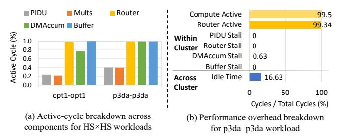

# *A. Area and Power*

We evaluate area and power using Synopsys *compile* command, with baseline optimizations. While a full backend flow would provide more accurate wire-aware estimates, both HiT and Trapezoid are evaluated at the same RTL and memorymodel abstraction level. Any wiring overhead from physical implementation would affect both designs similarly. Fig. 14 shows the area and power breakdown of HiT. The same figure also compares the area and power of HiT against the TPUlike and Trapezoid. Since Trapezoid reports area at 16nm and power at 15nm, we scale both results to 22nm using the methodology from [53] to ensure a fair comparison.

*1) Area:* HiT occupies 166.3 mm2 in 22nm, which is 1.07× that of Trapezoid and 1.82× that of the TPU-like design. Although the TPU-like design requires less area overall, it lacks the sparsity-handling components to efficiently accelerate sparse matrices. Trapezoid and HiT dedicate more than half of their total area to handling sparse computation. In HiT, the novel MSparse eliminates the need for an intersection module, which accounts for approximately 20% of Trapezoid's area (Fig. 15, (top)). The primary area trade-off is the registerfile-based buffer (discussed in the following subsection), which is approximately 4× larger than the SRAM-based buffer used in Trapezoid. Fig. 15, (bottom) compares the percentage of active area under different execution modes in HiT and Trapezoid. For dense workloads, both designs exhibit similar active-area fraction. For MS, the Trapezoid shows a higher active-area fraction, as most sparsity-related components are active except for the crossbar used in HS mode. In HS mode, HiT activates all components, while Trapezoid disables its intersection module, resulting in a lower active-area fraction.

*2) Power:* HiT consumes between 54.6 W and 113.5 W, while Trapezoid's power ranges from 36.7 W to 280.1 W. At peak utilization, HiT consumes 2.47× lower power than

Fig. 16: Geomean performance/area on workloads (from Table I) of varying sparsity levels. Normalized to HiT.

Fig. 17: Percentage of effective MACs performed over the product of total number of MACs multiplied by the latency.

Trapezoid, but 2.27× more power than the TPU-like design. In Trapezoid, power consumption is lowest when processing HS workloads due to its low throughput, but increases significantly for MS workloads as its complex intersection unit and distribution networks are activated. In contrast, HiT consumes the most power during HS processing to sustain high throughput, and the least power during D processing, where sparsity-handling modules are clock-gated and Local Buffer power-gated to reduce power consumption. The TPU-like design consistently consumes the least power overall, as it does not include sparsity-handling components.

3) Area and power comparison of register file and SRAM: To support the high bandwidth demands of HSparse and MSparse during on-chip accumulation, we implement low-latency multi-ported register files in each Compute Row, enabling up to 4 reads and 4 writes per bank. To compare its cost against SRAM alternatives, we use CACTI to model functionally equivalent multi-ported SRAMs at 22nm. While SRAM is inherently more power-efficient, achieving the same access bandwidth incurs 16.7× higher area than our register-based buffers. Given the access intensity of HiT, the register file presents a more balanced choice, offering the necessary bandwidth with considerably lower area cost.

#### B. Performance Comparison

We use performance/area as the comparison metric to account for the difference in area. The reported results measure accelerator kernel execution time only.

**Overall Performance:** In Fig. 16, we present the comparison of HiT against the specialized dense accelerator TPU-like, MS accelerators Sigma-E and Flexagon-E, and Trapezoid, which supports the full range of sparsity. For each category of multiplications, we compute the geometric mean (geomean)

Fig. 18: (a) Average percentage of active cycle for each component in Compute Row. (b) Performance overhead breakdown. Compute Active includes PIDU, multiplier, and DMAccum active time. Idle cycle represents the fraction of time a Compute Cluster remains idle while waiting for other Clusters to complete execution due to workload imbalance in HS datasets.

of the datasets listed in Table I normalized to HiT. The overall geomean is computed across all evaluated datasets. HiT achieves consistently high performance/area across all sparsity levels, outperforming TPU-like, Sigma-E, Flexagon-E, and Trapezoid by 66.5×, 8.22×, 5.84×, and 1.93×, respectively. While HiT can operate as a systolic array for D×D workloads, its larger area leads to a 1.23× lower performance/area than TPU-like. However, TPU-like degrades significantly with increasing sparsity and is inefficient on HS×HS workloads. In contrast, HiT achieves a 3.24× higher geomean performance/area than Trapezoid on HS×HS workloads by leveraging its sparsity-handling components, effectively addressing the low-throughput bottlenecks of prior HS accelerators.

MAC Utilization: We compute MAC utilization as the percentage of effective MACs over the total possible MACs multiplied by execution cycles. Fig. 17 shows representative benchmarks in which HiT consistently outperforms TPU-like and Trapezoid. Specifically, in HS workloads, where MAC utilization is inherently low, HiT improves utilization by 3,933× over TPU-like and 2.35× over Trapezoid. In particular, HiT achieves 3.46× higher utilization than Trapezoid on HS×HS workloads. These improvements stem from MSparse and HSparse, which exploit spatial parallelism and perform more effective non-zero matches per cycle.

Component Activity and Performance Breakdown: To understand the factors limiting MAC utilization in HS workloads, we analyze component activity and performance overheads. Fig. 18(a) shows that sparsity-handling units within a Compute Row remain highly active: Routers and Buffers operate in nearly all cycles, while PIDU and DMAccum are active for a substantial fraction. Fig. 18(b) further shows minimal stalls within each Compute Row, with DMAccum stalls below 1% of cycles. The overhead mainly arises from workload imbalance across Compute Clusters. Beyond architectural overheads, utilization is further limited by the intrinsically low intersection rates of HS×HS workloads, where only 0.12% (geomean) of PIDU comparisons yield valid matches.

Off-chip Traffic: Fig. 19 shows the off-chip traffic of HiT

Fig. 19: Breakdown of off-chip element access on 9 HS workloads, normalized to Trapezoid. Trp: Trapezoid

for HS workloads. HS computations are typically memorybound, and OP-based dataflows can incur high data movement. Nevertheless, HiT significantly reduces off-chip traffic, achieving savings comparable to the memory-efficient Gustavsonbased dataflow used in Trapezoid. This improvement is driven by HSparse, which increases data reuse and accumulates psums on-chip.

For *ca-0.4* and *ca-0.2*, B tiles are small enough that the entire Matrix A fits on-chip alongside a B tile, eliminating A re-accesses; execution proceeds by streaming successive B tiles. For denser workloads such as *opt1*, HiT uses smaller working tiles than Trapezoid to sustain on-chip accumulation, increasing A re-accesses and raising traffic by 30%. Although *msc* is denser than *opt1*, its smaller tile size allows multiple B tiles to be buffered simultaneously, enabling greater reuse of the same A tile and resulting in traffic comparable to Trapezoid.

Latency overhead of compute synchronization: In MSparse, we introduce partial synchronization of computation across Compute Rows within a Cluster. This design exploits the more regular non-zero distribution in MS matrices, allowing data fetched from Matrix B to be fully utilized within the Cluster. Across 3 evaluated MS×MS datasets, averaging over all 4 Compute Clusters, synchronization introduces at most 12% latency overhead, resulting in minimal impact on overall performance.

Representative Workload Analysis: We evaluate 9 representative SuiteSparse matrices spanning diverse sizes and sparsity levels. Since the TPU-like design is optimized for dense computation and performs poorly on HS matrices, we focus on Trapezoid and specialized sparse accelerators. As shown in Fig. 20, HiT consistently outperforms all baselines. In HS×HS multiplications, it achieves a geomean 3.65× speedup over Trapezoid, enabled by HSparse's highly parallel non-zero intersection unit that increases MAC utilization. In HS×MS and HS×D workloads, the performance gains are slightly lower as density increases and HSparse streams fewer B rows per tile, reducing matching opportunities with HS A elements. Nevertheless, HiT achieves geomean performance/area improvement of 46.9×, 4.35×, and 2.33× over Sigma-E, Flexagon-E, and Trapezoid, respectively, demonstrating its ability to obtain high throughput and utilization across HS workloads.

For MS workloads, HiT achieves a geomean perfor-

mance/area improvement of 1.99× to 11.91× over MS specialized baselines, Sigma-E and Flexagon-E, and Trapezoid. The TPU-like design fails to exploit input sparsity, wasting cycles on ineffectual MACs, while Trapezoid is limited by its intersection unit and small tile size. Sigma's IP-based approach only benefits from one-sided sparsity, and Flexagon, when scaled to HiT's area, peaks at just 8.58 TOPS. In contrast, MSparse efficiently exploits two-sided sparsity while maintaining high parallelism and MAC utilization, which directly translates to lower latency. Overall, HiT achieves high performance across the sparsity spectrum, driven by its higher MAC utilization.

BF16 Performance Comparison: HiT's architectural contributions are orthogonal to numerical precision and extend naturally to reduced-precision formats. Accordingly, we evaluate HiT with BF16 multiplication and FP32 accumulation at 1 GHz, matching the precision used in the original TPU and Sigma designs. Under this setting, HiT achieves 1.95× and 1.53× higher geomean performance/area than BF16 TPUlike and BF16 Sigma-E, respectively, across MS and dense workloads. For MS workloads, the gains increase to 3.34× and 1.85×, while for dense workloads, the larger area results in 1.33× and 1.04× lower performance/area. Overall, HiT retains strong advantages under reduced precision.

