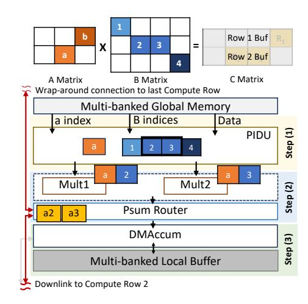
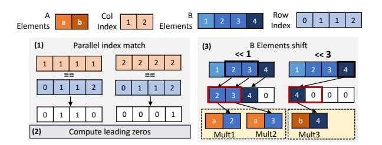
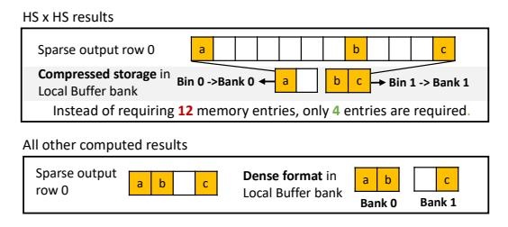
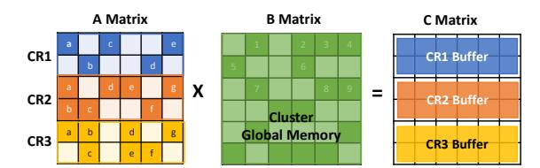

# *A. HS Architecture*

HS matrix multiplication has a very low data reuse and intersection rate. To achieve high throughput, HSparse increases the number of effective computations done in parallel by *intersecting multiple columns of Matrix A with multiple rows of Matrix B*. It exploits two levels of spatial parallelism: (a) within a matrix column, multiple non-zeros from one A column are processed in parallel, and (b) across matrix columns, multiple independent A columns are processed concurrently. As each element in the same column matches all the elements from the corresponding B row, a column-to-row intersection always guarantees a match when the corresponding rows and columns are non-empty. Furthermore, as we process Matrix A by column, the access to Matrix B is regular, eliminating the memory contention experienced by Gust-based dataflows. Fig. 7(a) illustrates a simple example of HSparse's mapping to hardware. To compute multiple columns of A in parallel, Matrix A is divided along the column dimension into three tiles, each mapped to a Compute Row. Matrix B is divided along the row dimension into corresponding tiles. In practice, the matrix is tiled based on the available Compute Rows and workload size. At the start of execution, the first few tiles of matrices A and B are preloaded into the memory banks of their respective Compute Rows.

With an outer-product-based dataflow, a large number of psums are generated in parallel. HSparse merges these psums by decoupling the multiplication and accumulation process, where psums can be produced in a different Compute Row than where they should be stored. As shown in Fig. 7(a), each Buffer in the Compute Row is assigned to store specified rows of the C Matrix on-chip. Fig. 7(b) describes the execution of HSparse in the Compute Cluster. In the multiplication phase, to improve multiplier utilization under low density, each Compute Row streams groups of B rows and processes multiple A elements per cycle. In this example, each Row streams from its dedicated Global Memory banks with up to 4 non-zero B elements and 2 non-zero A elements, matching the number of Groups. As there is no dependency among the data across the Compute Rows, multiplication is done in parallel. In the accumulation phase, psums are routed via the ring network to the destination Row for reduction. In the example, we focus on the *psum1 (blue a1)*, *psum2 (orange a1)*, and *psum3 (yellow a1)*, the products of *a* from each tile of Matrix A and *1* from each tile of B. Since *psum1* is computed where it should be stored, it is accumulated locally. For *psum2* and *psum3*, they are computed in a different Compute Row than where they should be accumulated. They are routed via the ring network to the destination Row. In our hardware implementation, HiT matches a maximum of 4 A elements with up to 64 B elements per cycle from different B rows (i.e., 32/64 for HS and MS inputs, 64 for D input) to balance the performance and area trade-offs. Accordingly,

(a) HSparse mapping, assuming a 3 Compute Rows and 1 Compute Cluster design. Matrix A is column-wise tiled. Matrix B and C are row-wise tiled. Each tile maps to a Compute Row.

(b) Execution of HSparse on the Compute Cluster, assuming 2 Compute Groups per Compute Row. Input data is accessed regularly from dedicated memory banks and processed in parallel in the Cluster.

Fig. 7: Example of HSparse Dataflow

as each Compute Row contains four Compute Groups, each Compute Group processes one A element per cycle.

In the following paragraphs, we first explain the highlevel execution process of a Compute Group, then detail the hardware components.

Example walkthrough: Fig. 8 presents a scaled-down example of the execution of HSparse. We focus on one Compute Row, assuming it is the first Row with a wrap-around link to the last Compute Row and a downlink to Compute Row 2, depicted as red arrows. As each Compute Group has the same architecture and operates in the same way, only one Group is shown. In this example, 1 non-zero element of A and 4 nonzero elements of B from the Global Memory are streamed into a Compute Group capable of handling 2 multiplications and accumulations in parallel. The execution flow is as follows: (1) the PIDU matches the coordinate of the A element with all the B elements, then distributes the matching pairs to each multiplier. (2) The multipliers produce the result and send it to the PSum Router, which checks the row index of the results. As the results are psums of the second C row assigned to Compute Row 2, they are sent out of this Row via the downlink. (3) The DMAccum in this Row remains inactive in this case.

Parallel Intersection & Distribution Unit (PIDU): This unit performs non-zero matching and distributes the matched pairs across multipliers. As illustrated in Fig. 9, the PIDU first performs parallel column-to-row index comparisons to match each A element with the grouped B elements (from

Fig. 8: A scaled-down example of a Compute Group, part of a Compute Row, showing the execution of HSparse.

multiple rows of Matrix B). It then computes leading-zero counts and uses a lightweight shifter (rather than a barrel shifter) driven by the count to align matched B elements with available multipliers. The process is pipelined across four stages. In the example, the shift unit shifts B's entries left by one position, assigning matched values *2* and *3* to *Mult1* and *Mult2*, respectively. In HiT, a total of 64 comparators per Compute Group are used to match the A element with the group of B elements. Although we intersect with more elements than the available multipliers, given the high sparsity, the number of matches rarely exceeds 32. In the case that matches exceed, reading of new A elements is stalled until the current matches are all processed.

PSum Router & Ring Network: The PSum Routers are interconnected, forming a ring network. The ring is a lightweight bidirectional network composed of point-to-point links between neighboring Compute Groups along the y-axis within each Cluster (Fig. 6). Each link transfers a vector of psum and column-index pairs with row metadata per cycle, over a wide parallel bus matched to the accumulator parallelism. The Router checks for the row index of psums and either forwards them to the local DMAccum or routes them to the designated Compute Row via the ring network. To handle data congestion, each router uses four ring buffers: size 6 for up and down incoming, 4 for multiplier incoming, and 6 for DMAccum forwarding. When a buffer is full, the Compute Row stalls until space is available. These sizes are chosen to balance performance and cost, as doubling structures reduces latency by just 10% while incurring 2× higher area and power overhead.

Exploitation of output sparsity & Dual-mode Accumulator (DMAccum): As shown in Fig. 2, HS×HS multiplications produce HS/near HS outputs. HSparse leverages this characteristic by storing results in a compressed format. This increases buffer utilization and allows a large, sparse output matrix to be stored with a small buffer size. In addition, it allows HiT to process larger input tiles that contain additional non-

Fig. 9: Example of non-zero element intersection in Parallel Intersection & Distribution Unit (PIDU), based on Fig. 8

zero elements, increasing intersection rate and computation intensity. Fig. 10(a) illustrates how sparse values in the same row are packed into a Local Buffer row. This compressed format is used only for HS×HS; outputs of all other workloads are stored densely due to higher output density (Fig. 10(b)). Given the two different memory layouts, the Accumulator has to operate in 2 modes.

In the first mode, for HS×HS where outputs are irregularly distributed. Naively accumulating a new psum requires comparing it against all entries in a Local Buffer row, which can be expensive. To reduce the number of comparators, we use a binning-compare-update procedure, shown in Fig. 10(b). Given three psums from the same output row, we map each psum to a memory bin using the modulo operation. The bin index and row index identify the target memory bank and row, respectively. Since each bin holds two entries in this example, each psum compares against only two candidates instead of all four in the row. After comparison, one of three actions occurs: (1) a match is found, and psum is updated; (2) no match but the bin contains empty slot(s), the psum is inserted into the first empty slot (with priority encoding on conflicts); or (3) the bin is full, the psum spills to an overflow buffer for the next round of accumulation.

In the second mode, for all other sparse workloads, outputs are stored densely, allowing direct row-column indexing to update psums. Together, these mechanisms allow HiT to sustain high-throughput accumulation for HS workloads while keeping buffer and comparator area modest.

Tiling: Non-zeros in HS matrices often cluster, producing partial outputs with uneven density requiring a large buffer with low utilization. To alleviate this problem, we interleave columns of B to balance non-zeros without affecting correctness. In our evaluation, this reduces the buffer size by 14× and greatly improves buffer utilization. For HS×HS multiplications, HiT supports two tiling strategies. The default method samples bitmap intersections to select tile sizes that ensure all partial sums fit in Local Buffers. A conservative alternative selects smaller tiles based on overestimated output sparsity. If an overflow occurs, HiT employs row-granularity spilling. When entries from all banks of a row become full and a new psum maps to that row, the entire row is spilled to on-chip Global Memory, the row is cleared, and accumulation continues. After tile completion, spilled segments are reloaded and merged in a second pass. Under this conservative strategy,

(a) Local Buffer memory layout in two different modes under different computations.

(b) Example of the accumulation process, activated only during HS×HS computation. Binning helps to reduce the number of comparators needed during column index matching.

Fig. 10: Dual-mode Accumulator (DMAccum) unit.

a spill of psum data is rare, with an average of 3.30% of output rows being spilled to Global Memory, introducing an average overhead of 4.05% across 4 HS×HS workloads. In the evaluated workloads, we use bitmap-based tiling to ensure all psums fit in the Local Buffer. For MS and dense matrices, inputs are tiled so that the dense outputs fit entirely in the Local Buffer, keeping all partial sums on-chip.

#### B. MS Architecture

HiT implements a second OP-based dataflow, MSparse. Similar to the HSparse, MSparse increases throughput by intersecting multiple columns of Matrix A with multiple rows of Matrix B. Since HSparse implements an efficient PIDU component for parallel input intersections, we reuse the same component in MSparse and focus on solving the accumulation of the large number of psums.

Unlike HS matrices, MS matrices present much higher element density and intersection rate. Using the ring network present in HSparse will incur a large amount of data movements, leading to high latency in accumulating the psums. Therefore, we design MSparse to accumulate psums immediately within the same Compute Row. This is achieved by mapping rows of Matrix A to one Compute Row so that psums required to form the final outputs are produced within the same Row.

However, this approach introduces one of the three problems: (1) large memory overhead, since each Compute Row would require on-chip storage of the entire Matrix B to sustain high performance; (2) large number of memory accesses, as partitioning B by rows and processing each partition separately forces repeated off-chip accesses whenever new rows of A are

(a) MSparse mapping, assuming a 3 Compute Rows and 1 Compute Cluster design. Matrix A and C are row-wise tiled, and each tile maps to a Compute Row.

(b) Execution of MSparse on the Computer Cluster, assuming 2 Compute Groups per Compute Row. Input data is accessed regularly, with B elements shared across Compute Rows and processed in parallel within the Cluster.

Fig. 11: Example of MSparse Dataflow

mapped; or (3) the need for a complex memory system to support random access from multiple Compute Rows.

To solve this problem, we partially synchronize the computation in a Compute Cluster by streaming a group of 64 B elements per cycle from Global Memory and broadcasting to Compute Rows. This solution enables regular memory access and leverages the key properties of MS multiplication, where element density and intersection rate are high, and each tile shares a similar distribution. Furthermore, we use an interleaving technique in mapping the rows of Matrix A to each Compute Row to decluster possible patterns in the matrix. Fig. 11(a) illustrates an example of this mapping, showing three row-wise partitioned tiles of Matrix A assigned to three Compute Rows and Matrix B is shared within a Compute Cluster. Fig. 11(b) outlines the execution procedure in a Compute Cluster, where HiT accesses memory sequentially and processes multiple A elements within and across the Rows in parallel. Although synchronizing the Compute Row can incur additional latency, based on our evaluations, the overhead is maximally 12% on the evaluated workloads.

**Example walkthrough:** Fig. 12, shows an example of HiT running MSparse. We focus on one Compute Group from a Compute Row. The components not activated in this dataflow are grayed out. Similar to HSparse, 1 non-zero element of A and 4 non-zero elements of B are streamed into a Compute Group with 2 multipliers and accumulators. All the C results are buffered in the same Compute Row. The execution flow is as follows: (1) the PIDU matches the coordinate of the A

Fig. 12: A scaled-down example of a Compute Group in a Compute Row, showing the execution of MSparse dataflow.

Fig. 13: A scaled-down example of a Compute Group in a Compute Row, showing the execution of dense IP dataflow.

element with all the B elements, then distributes the matching pairs to each multiplier. (2) The multipliers produce the results and send them to the DMAccum, bypassing the PSum Router. (3) The DMAccum sends a read request based on the row index of the results to the Local Buffer to fetch the partial results to perform accumulation.

#### C. Dense Architecture

We implement the standard inner-product dataflow in HiT, which is highly efficient in processing D×D multiplications. To support the dataflow, we transform the architecture into a 2D systolic array by adding connections between multiplier groups in each Compute Row and between DMAccum both within and across Compute Clusters. This resembles the TPU's matrix multiplication unit with 128×128 MACs, and the only difference is the number of multiplication pipelines. As we divide 128 multipliers per Compute Row into 4 groups, 32 multiplications can be done per cycle per Row, simplifying the layout to 128×4 with 4 multiplication pipeline stages. The components developed to handle sparsity are clock-gated with Buffer power-gated.

**Example walkthrough:** Fig. 13 shows a dense input example. In this mode, Matrix B is mapped spatially across the

TABLE I: Dataset Details

|    | Name           | Dimension              | Density |
|----|----------------|------------------------|---------|
| HS | p2p-Gnutella24 | 26518 × 26518          | 9.3e-5  |
|    | ca-CondMat     | $23133 \times 23133$   | 3.5e-4  |
|    | opt1           | $15449 \times 15449$   | 8.1e-3  |
|    | cage12         | $130228 \times 130228$ | 1.2e-4  |
|    | poisson3Da     | 13514 × 13514          | 1.9e-3  |
|    | msc10848       | $10848 \times 10848$   | 1.0e-2  |
|    |                | ·                      |         |

|        | Name                      | Dimension                                                                                 |                                              | Density              |                                  |
|--------|---------------------------|-------------------------------------------------------------------------------------------|----------------------------------------------|----------------------|----------------------------------|
|        |                           | Activation                                                                                | Weight                                       | Activation           | Weight                           |
| MS     | Resnet50-0.4 Vgg16-0.4 | 1024 × 14 × 14 512 × 28 × 28 512 × 28 × 28                                          | 1 × 1, 256 1 × 1, 128 3 × 3, 512       | 0.46 0.65 0.23 | 0.37 0.52 0.38             |
| MS / D | Llama2-7b                 | $\begin{array}{c} 1024 \times 11008 \\ 1024 \times 4096 \\ 1024 \times 11008 \end{array}$ | 11008 × 4096 4096 × 11008 11008 × 4096 | 1 1 1          | 0.20 / 1 0.40 / 1 0.60 / 1 |

architecture, each row to a Compute Row. Elements of A are streamed in row by row across the Compute Rows. Psums are accumulated vertically along the y-axis, forming the final Matrix C. We focus on one Compute Group from a Compute Row. The execution flow is as follows: (1) the data are sent directly to each multiplier, bypassing the components in the PIDU. (2) The multipliers produce the results and send them to the adders in DMAccum, bypassing the PSum Router. (3) The adders accumulate the data from the multiplier with the psums received from Compute Row 1, then generate results for the next Compute Row.

#### D. Hardware Reuse and Dataflow Switching

Hardware Reuse: In HiT, the compute fabric is largely shared across modes. HSparse and MSparse reuse the same components, with HiT gating only the PSum Routers in MSparse. In dense mode, only the multipliers, DMAccum adders, and a linear adder network remain active, while sparsity-specific components are bypassed and clock/powergated.

**Dataflow Switching and Dynamic Sparsity:** HiT supports static dataflow reconfiguration via lightweight control logic, where configuration flags enable or disable hardware components, select datapaths, and initialize Compute Rows. Reconfiguration completes in a fixed number of cycles independent of matrix size, accounting for only 0.009% of execution time (geomean). The dataflow is selected once per dataset by the user using sparsity-based heuristics: matrices with <10%density are treated as HS, 10-90% as MS, and >90% as dense, consistent with observed ranges in SuiteSparse and neural network workloads. While coarse-grained, this heuristic suffices for most inference and offline workloads where sparsity is stable at the dataset or layer granularity. Supporting dynamic sparsity would require runtime sparsity estimation and tileor batch-level dataflow switching. ML-based selectors such as Misam [45] are complementary and can be integrated to enable adaptive behavior, potentially improving dataflow selection accuracy.

