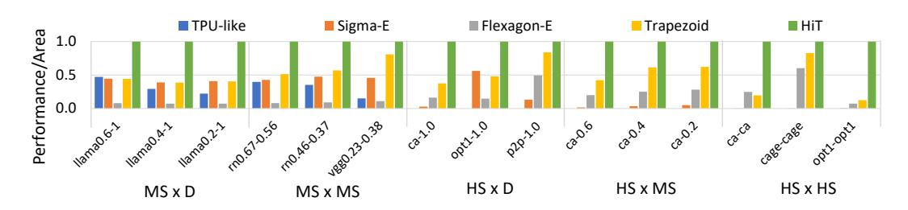
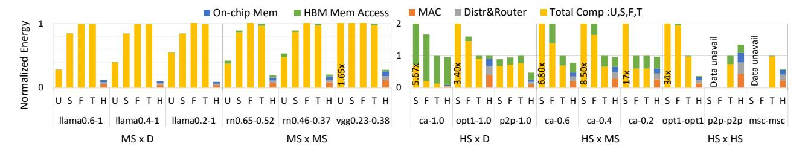
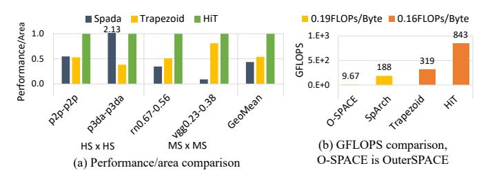

# *D. Latency Comparison with Specialized Accelerators*

We compare HiT with Spada, an adaptive-dataflow accelerator for MS×MS and HS×HS workloads. As shown in Fig. 22, HiT achieves superior performance, obtaining 2.29× higher geomean performance. Spada performs well on the relatively regular and dense *p3da* dataset, where its profilingguided configuration is effective, but its performance drops on the irregular and sparse *p2p* dataset to about half of

Fig. 20: Performance/area against baselines on real-world HS workloads of varying sparsity levels. Normalized to HiT.

Fig. 21: Energy consumption breakdown of real-world workloads with varying sparsity levels. Normalized to Trapezoid. U: TPU, S: Sigma-E, F: Flexagon-E, T: Trapezoid, and H: HiT.

Fig. 22: Comparison against specialized accelerator, Spada, OuterSPACE, and SpArch. Normalized to HiT.

HiT. In MS $\times$ MS, Spada is compute-bound, when scaled to the same area as HiT, its peak throughput is  $3.96\times$  lower, limiting overall performance. We also evaluate throughput against prior OP-based HS accelerators, using comparable SuiteSparse workloads. Scaling to HiT's area, OuterSPACE achieves 9.6 GFLOPS and SpArch achieves 188 GFLOPS, while HiT reaches 843 GFLOPS,  $87.2\times$  and  $4.48\times$  faster, respectively.

### VII. DATA PREPARATION AND SCALABILITY

**Preprocessing:** Following prior practice [19], [21], [26], [41], matrix tiling and data formatting for HSparse and MSparse are performed offline on the host CPU, and the reported results measure only accelerator execution time. In HiT, preprocessing takes 3.47 s (HS) and 0.009 s (MS); this one-time cost is amortized in iterative workloads [55]–[58]. **Data preloading:** For D×D workloads, both HiT and Trapezoid operate as systolic arrays and load tiles of identical size. For MS datasets, the overhead is negligible (below 0.01%). For HS datasets, preloading contributes a geomean of 0.51% of runtime in HiT and 0.15% in Trapezoid. Including this

overhead slightly reduces HS×MS geomean performance/area improvement by 1.10%, compared to Trapezoid.

Scalability: HiT is organized hierarchically to allow extension to larger configurations without fundamental redesign. At the system level (scale-out), multiple nodes can be connected via high-speed links, similar to TPUs [12]. Within each node (scale-up), the architecture can be extended by increasing the number of Compute Clusters and Groups per Compute Row while preserving the local ring network. However, larger deployments would require proportionally greater on-chip and off-chip memory bandwidth.

