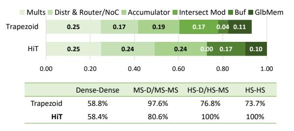

# V. EVALUATION METHODOLOGY

**Datasets:** We evaluate the performance and energy efficiency of HiT using 27 real-world matrix multiplication work-

TABLE II: HiT Design Specification

| Hardware Component |                                   | Specs                                                                    |  |
|--------------------|-----------------------------------|--------------------------------------------------------------------------|--|
| Compute Row     | Multiplier PIDU PSum Router | PIDU $4 \times (64 \text{ comparator \& shifter})$                       |  |
|                    | DMAccum Local Buffer           | 4 × (32 FP32 adders & 512 comparators) 11.4KB, 8 banks, register file |  |
| Compute Cluster    |                                   | 32 × Compute Row                                                         |  |
| Global Memory      |                                   | 16MB, 512 SRAM banks, 64B datawidth                                   |  |
|                    | Overall                           | 4 × Compute cluster @ 1 GHz 17.5MB memory, HBM @ 2TB/s                |  |

loads from SuiteSparse dataset [13] and 3 representative deep neural networks: Llama2-7B [2], ResNet50 [3], and VGG16 [16]. These workloads are selected to cover a wide range of sparsity characteristics, from HS to D matrices, enabling a comprehensive evaluation of HiT's effectiveness across diverse practical scenarios. Table I shows the size and density details of the datasets.

We use SuiteSparse datasets for HS workloads. For HS×HS, we compute  $M \times M^T$  following prior HS accelerator [41]. For HS×MS, each HS matrix is multiplied by three random matrices (1024 columns, densities 0.2, 0.4, 0.6). For HS×D, HS is multiplied by a dense matrix with 1024 columns. For MS and D workloads, we use DNN layers. MS×MS uses unstructured sparse (40% density) ResNet50 and VGG16 models [46], evaluating three convolution layers from ImageNet inference [47]. The convolution layers are converted offline to matrix multiplication using the standard im2col transformation [48]. For MS×D, we evaluate three Llama2-7b projection layers (sequence length 1024). Although Llama2 is inherently dense, we applied magnitude-based pruning to its weight matrices to introduce sparse matrix multiplications, using pruning levels (0.2, 0.4, 0.6) consistent with recent GPT sparsification studies [49], [50]. D×D uses two dense projection layers from Llama2-7b with different dimensions.

HiT Implementation: We built a cycle-level simulator to model each component of HiT, using the specifications detailed in Table II and a set of configurations to select datapaths and model static dataflow switching. This design achieves a peak throughput of 32 TFLOPS and consists of 128 Compute Rows, each featuring 128 FP32 multipliers and adders. Each Compute Row has access to a Local Buffer of 11.4 KB and shares 4MB of Global Memory. In total, the architecture provides 17.5 MB of on-chip memory. Additionally, we simulate based on a 2 TB/s HBM main memory, representative of current generation GPUs and TPUs.

The simulator models the activities of all hardware components per cycle. To obtain latency results, we run the simulator with the abovementioned datasets, faithfully capturing contention and pipeline stalls. To obtain the area, we implemented each of the components in Verilog and synthesized the design using Synopsys Design Compiler with 22nm technology node at 1 GHz. We then use Synopsys PrimePower to measure the power. Both simulator and RTL designs are validated using

Fig. 14: Area and power breakdown of HiT and comparison against TPU and Trapezoid. \*The 22nm results of Trapezoid are scaled from 16nm and 15nm based on [53].

microbenchmarks to ensure correctness. We use CACTI [51] to estimate the area and power of the on-chip Global Memory at 22nm. The energy consumed by HBM accesses (3.9 pJ/b) is obtained from a prior study [52]. HiT adopts FP32 precision to ensure fair comparison with prior accelerators (e.g., Trapezoid). Additionally, HiT targets general sparse matrix multiplication beyond NN inference, where higher precision remains relevant.

Baselines: We primarily compare HiT with Trapezoid, a unified accelerator of similar scale and design goals. Additionally, we compare against a modern version of the TPU [11] featuring dedicated Matrix Multiply Units (MXU). Both Trapezoid and the TPU employ spatial array architectures with 128×128 MACs and global cache memories of 17MB and 16MB, respectively, closely aligning with the resources available in HiT. To provide comprehensive coverage, we compare against sparsity-specialized accelerators targeting different regimes: Sigma [17] and Flexagon [25], which are optimized for MS workloads; SpArch [26] and OuterSPACE [18], which focus on HS outer-product execution; and Spada [24], which supports both MS and HS regimes through adaptive dataflow mechanisms.

For Trapezoid, we build a cycle-level simulator that models the latency using its published specification. The model captures its 128 processing rows (128 MACs each), compute clusters (32 processing rows each), tiling strategy, dataflows, intersection behavior, and multi-level memory hierarchy. Where low-level details were not explicitly specified, we adopted assumptions favorable to Trapezoid. In particular, we assume conflict-free cache banking for both reads and writes and allow HS partial results to stream off-chip with minimal onchip buffering overhead. Since Trapezoid reports normalized speedup over a TPU-like baseline, we validated our model by reproducing its published speedup under the same configuration, with error below 2%. Area and power are taken from the original paper.

For TPU, we simulate the MXU and refer to this baseline as TPU-like. We estimate the area and power of TPU-like based on results from our synthesized FP32 multiplier, FP32 adder, and CACTI cache models. The results are validated against prior work [54]. Latency and power for Sigma and Flexagon are derived from Trapezoid's results, as they are scaled to

Fig. 15: Top: Area breakdown of HiT and Trapezoid. Bottom: Percentage of active area under HS, MS, and dense modes.

match Trapezoid, which aligns with HiT's configuration. We refer to both accelerators as Sigma-E and Flexagon-E to denote the derived results. Latency of Spada is obtained from its open-source simulator, scaled to match HiT's area with 4128 MACs, 16MB global memory, and the same HBM bandwidth. GFLOPS for SpArch and OuterSPACE are scaled from SpArch's results.

